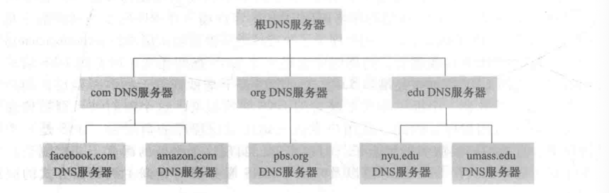
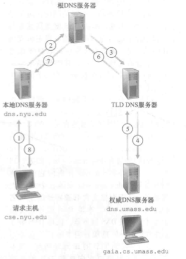
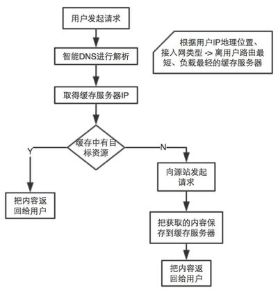
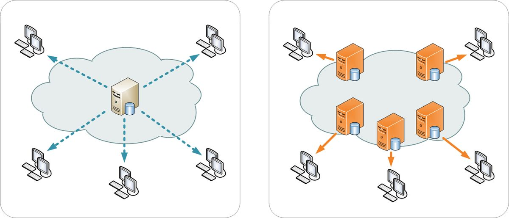

# DNS

DNS（Domain Name System），域名系统，将用户提供的主机名解析为IP地址。

DNS是：

1. 一个由分层的DNS服务器实现的分布式数据库
2. 一个使得主机能够查询分布式数据库的应用层协议

## DNS工作原理

### 客户端

1. 当用户使用的应用程序，例如浏览器或邮件客户端吗，需要将主机名转换为IP地址，这些应用将调用DNS客户端
2. 用户主机的DNS客户端向网络中发送一个DNS查询报文（53端口）
3. 用户主机的DNS客户端收到回答报文
4. 结果传递到调用DNS的应用

### 服务端

DNS有大量分布在世界范围的服务器，有三种类型：

- 根DNS服务器

  400多台服务器遍及全世界，由13个不同的组织管理。

- 顶级域服务器（Top-Level Domain TLD）

  每个顶级域（`com`、`org`、`edu、...`）和国家的顶级域(`cn、uk、...`)都有对应的服务区集群。

  由不同的公司维护不同的顶级域。

- 权威DNS服务器

  

层次关系如下图所示：

假设一个客户要获取`www.amazon.com`的IP地址：

- 首先与根服务器联系，它将返回顶级域名`com`的TLD服务器
- 客户再与对应TLD取得联系，它将为返回权威服务器的IP地址
- 最后客户与权威服务器取得联系，获取`www.amazon.com`的IP地址

当服务器有一个固定公网IP地址，别人就可以通过IP地址访问到这个服务器，但是IP地址是一串数字组成，不方便记忆，可以通将方便记忆的域名解析到对应的IP地址上，这就是域名解析。

还有一个属于本地DNS服务器，每个IPS都有一台本地的DNS服务器，起着代理客户端的作用，如下图所示：

### DNS缓存

在一个请求链中，当某DNS接收一个DNS回答，它将映射缓存在本地存储器中。

例如上图本地DNS服务器从某个DNS接收到一个DNS回答，它能够缓存该回答的任何信息，那么再此收到请求的时候，该本地DNS就能提供所要求的IP地址，即使这个DNS不是该域名的权威服务器。

DNS服务器在缓存在一段时间后将失效。

## DNS记录

DNS服务器存储了资源记录（Resource Record），资源记录提供了主机名到IP地址的映射，包含了下列字段的4元组：

- Name
- Value
- Type
- TTL

TTL是该记录的生存时间，决定了资源记录应从缓存中删除的时间，Name和Value的值取决于Type，即类型：

- A类型，则Name是主机名，Value是该主机名对应的IPv4地址

- AAAA类型，则Name是主机名，Value是该主机名对应的IPv6地址

- CNAME类型，则Name是别名，Value是规范主机名

  例如，`foo.com` `relay1.bar.foo.com` `CNAME`

- MX类型，则Name是别名，Value是邮件服务器的规范主机名

  例如，`foo.com` `mail.bar.foo.com` `MX`

- NS类型，Name是个域，Value是获取该域名主机IP地址的权威DNS服务器的主机名

  例如：`foo.com` `dns.foo.com` `NS`

## 向DNS数据库中插入数据

注册登记机构（registar）是一个商业实体，它验证域名的唯一性，将资源记录插入DSN系统，由ICANN机构向各种注册登记机构授权。

## CDN

CDN（Content Delivery Network），即内容分发网络。

不使用CDN，那么输入域名之后，经过一系列解析获取到服务器的IP地址，最后从目标服务器上获取资源。

而使用了CDN，相当于多了一个缓存层，而且通过一系列技术选择离客户端最近节点的缓存层。

即用户输域名之后，根据CNAME类型记录将域名解析出缓存域名，此域名进一步解析到离你最近的缓存服务器的IP，从而访问缓存资源。

如下图所示：

CDN适用于静态资源的分发，动态的内容，依然要交给源服务器。

通过CDN，不管你在全国哪个地方，都可以快速的访问静态资源，如下图所示：

### CDN的好处

- 提升访问速度
- 减少服务器压力
- 有利于搜索排名，某些搜索引擎也会把网站的打开速度作为排名指标之一

## References

1. 《计算机网络-自顶向下方法》
2. https://www.zhihu.com/question/36514327?rf=37353035