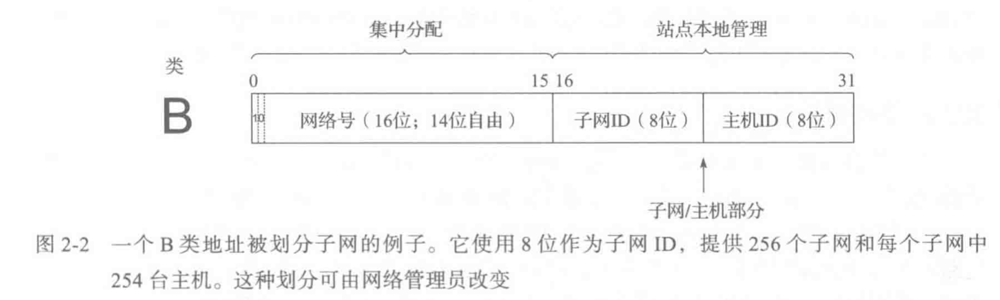

# IP地址

连接到Internet的每个设备至少需要一个IP地址，通常ISP（Internet Service Provider）负责提供IP地址，中国的三大ISP：移动、联通、电信。

## IPv4

IPv4地址是一个32位的二进制数，IP地址通常用点分十进制表示（a.b.c.d），其中a,b,c,d都是0-255的数字。

IP地址分为私有地址和公有地址。

IP地址包括两个标识码，网络码和机器码，共有5种IP地址类型。

- A类IP地址

  必须以0开头，且在四个号段中，第一个号段为网络号码，剩下的为本地计算机的号码

  ```
  00000001 00000000 00000000 00000001
  ~
  01111111 11111111 11111111 11111110
  
  0.0.0.0 ~ 127.255.255.255.255
  ```

  最后一位是广播地址

  有126个网络，每个网络容纳主机数位1600多万台

  超大型组织会分配A类地址块，例如：通用电气拥有3.0.0.0/8；苹果公司拥有17.0.0.0/8；美国邮政总局拥有56.0.0.0/8，没有中国组织分配到整块的A类ip地址，但是并不意味着中国不存在A类IP地址，中国也是存在数千万个A类ip地址的，不过都是子网。

- B类IP地址

  必须以10开头，且IP地址的四个号段中，前两个号段为网络号码。

  ```
  10000000 00000000 00000000 00000001
  ~
  10111111 11111111 11111111 11111110
  
  128.0.0.0 ~ 191.255.255.255
  ```

- C类IP地址

  必须以110开头，且IP地址的四个号段中，前三个号段为网络号码。

  C类地址的网络地址数量较多，有209万余个网络，适用于小规模的局域网络，每个网络最多只能包含254台计算机。

  ```
  11000000 00000000 00000000 00000001 
  ~
  11011111 11111111 11111111 11111110
  
  192.0.0.0 ~ 223.255.255.255
  ```

## IPv6

IPv6的地址长度是128位，是IPv4的4倍。地址一般由8个块组成，一个块4个16进制数。

IPv6地址的数量大大增加，经计算，每平方厘米的土地上，可以拥有2244个IP地址。

IPv6地址简化：

- 一个块中前导的零不必书写
- 全零的块可以省略，并用符号`::`代替，例如`0:0:0:0:0:0:0:1`可简写为`::1`，但是此符号只能用一次

## 子网

我们可以看到，最开始IP地址的划分(两级IP地址)是不合理的，例如苹果公司分配一个A类IP段，共计1600多万个IP地址，会造成大量的浪费。

这就出现了子网寻址方法，即基于之前A类B类的机器号，进一步划分为子网号和一个主机号。

例：一个B类地址被划分子网：



## 子网掩码

上述子网寻址方案使得网络号的位数不再固定，所以需要一个配置参数来指示哪些位是网络位，哪些位是机器位，这就出现了子网掩码，子网掩码使用和IP地址相同的方式编写(点分十进制)，用来确定一个IP地址中网络部分和主机部分。

```
255.255.255.192
/27
11111111 11111111 11111111 11100000
```

例如：

地址128.32.1.14属于子网128.32.1.0/24

## 特殊用途的地址

内网地址：

- 10.0.0.0/8
- 172.16.0.0/12

- 192.168.0.0/16

## References

1. 《TCP/IP详解 卷一: 协议》
