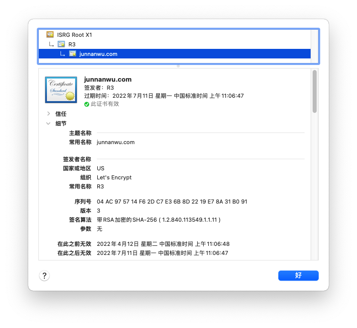
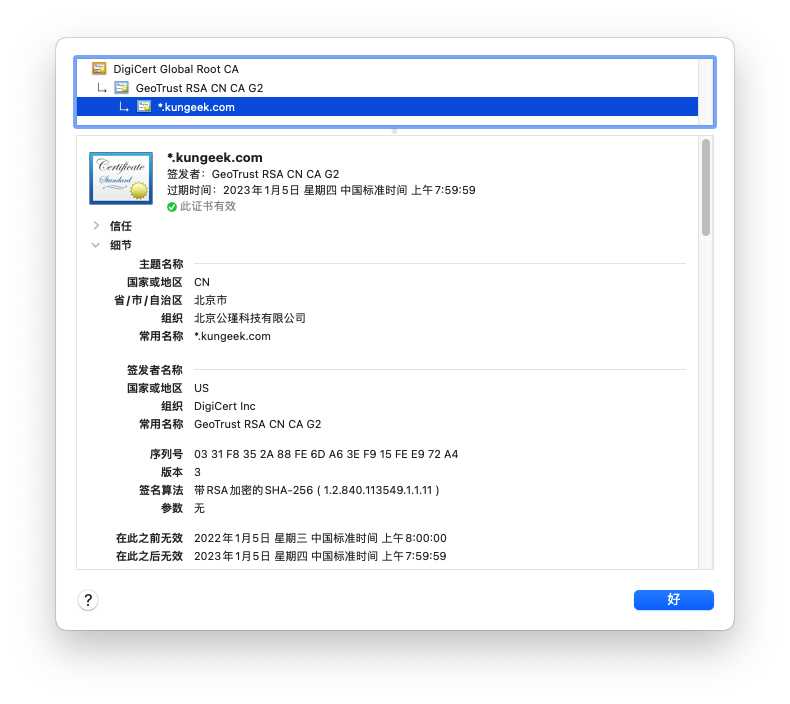
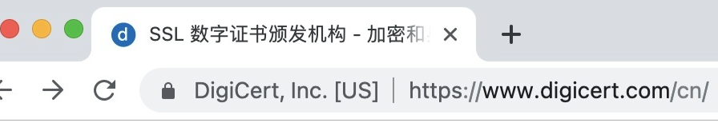
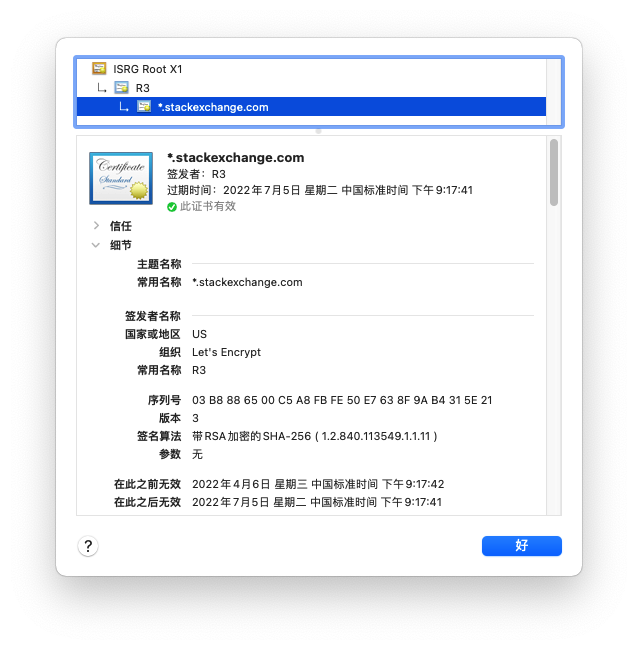

# SSL证书类型

本文主要参考[免费的SSL证书和收费的证书有什么区别？](https://www.zhihu.com/question/340572894/answer/2205326015)

SSL证书里面包含了网站域名，或者组织信息等，由CA机构签发，负责校验网站的身份。

根据验证信息范围的不同，SSL 证书 DV、OV和EV三种认证级别。

## DV证书

DV（Domain validated），即域名认证，此证书可以证明网站所有从具有对应**域名**的所有权，证书信息里面只有域名一项（Common Name 字段），如下图所示：

## OV证书

OV（Organization validated），即组织认证，证书里面除了注明了域名之外还添加了公司名等信息。

我们平时见到的https网站多用这种级别的证书。

如下图所示：

## EV证书

EV（Extended validation），也就是拓展证书，CA会对证书持有人进行更加全面的认证。如果浏览器会在网址左边显示组织机构信息。用户看到这些信息会更加放心。但现在常用的浏览器已经不再展示了，老版本的浏览器会显示。

## 选择证书

1. EV证书，在地址栏额外展示组织信息的特权大部分浏览器已经没有了，而且非常昂贵，没有必要

2. OA证书，用户知道背后组织也意义不大，由于中国的网站都需要进行备案，根据备案号完全可以去工信部网站查询备案信息

3. DV证书，一般网站DV证书足够了，浏览器自动进行域名校验，HTTPS功能也正常使用。

   最大程序问答网站stackoverflow.com即使用的免费的DV证书：

   

## 免费证书

免费证书是近几年兴起的，其目的是推动HTTPS加密通信的普及，保护用户的隐私。其中最重要的免费证书提供商就是[Let's Encrypt](https://link.zhihu.com/?target=https%3A//letsencrypt.org/)。

GitHub Page免费帮忙申请的HTTPS证书就是与Let's Encrypt合作的。

## References

1. https://www.zhihu.com/question/340572894/answer/2205326015