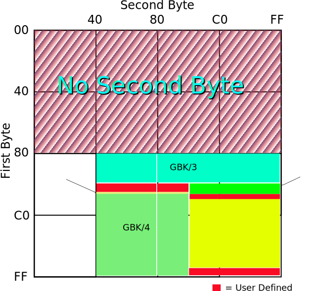
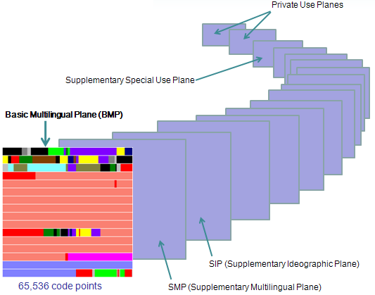
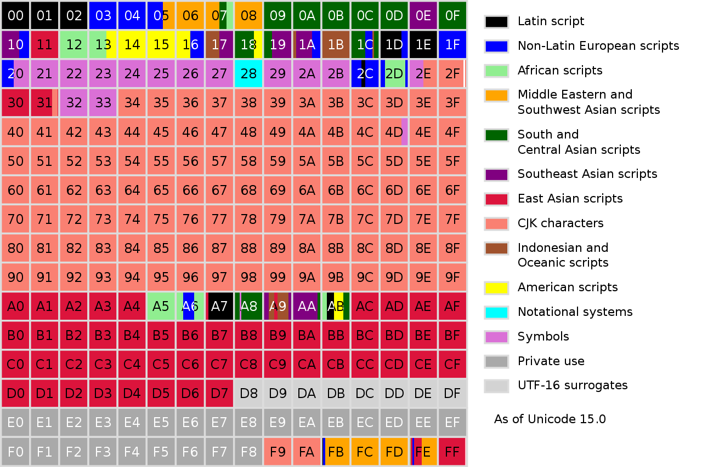

# 字符编码

## 字符集的诞生需要哪些步骤

首先，需要**确定字符集的范围**，例如，ASCII一共收录了128个字符，GB2312字符集收录7445个字符。

确定了字符集的范围，我们才能确定采用几个字节区表示一个字符，例如ASCII采用一个字节足以表示128个字符。

其次，需要对字符进行逻辑**编号**：

- 可以按顺序进行编号，例如：ASCII中，A为65，B为66

- 还可以按照区位码的方式进行编号，例如，GB2312中，汉字`王`，这个字被放在了第45区的第85位，所以`王`对应的区位码是`4585`

最后，需要将编号进行**编码**：

这个步骤我们主要需要思考两个问题：

- 计算机一次应该读取几个字节？

  有的字符编码一次读一个字节，有的字符编码一次读两个字节，还有的字符编码一次读四个字节，我们把计算机一次读取的字节数称为**码元（Code Unit）**。

- 几个码元表示一个字符？

  例如ASCII，码元为一个字节，那么一个字符占一个码元，即可表示128个字符，所以对于ASCII码，计算机一次读取一个字节，一个字节对应了一个字符。

  但是，有的字符集，一个字符可能需要多个码元来表示，这就需要进行特定规则的编码，告诉计算机，几个码元表示的是一个字符。

  例如UTF-8，码元也是一个字节，但是可能是一到四个码元表示一个字符，这时候就需要一些规则，按照这些规则将上面的编号进行编码，这样以来，计算机通过编码后的二进制，就知道，几个码元表示一个字符了（具体的规则后面的UTF-8会详解）。

  故对于UTF-8，计算机一次读取一个字节，然后根据规则将一到四个字节转换成一个字符。

## ASCII

ASCII（American Standard Code for Information Interchange，美国信息互换标准编码）

单字节编码方案，最高位用于奇偶校验，所以一共128个字符。

ASCII采用单字节作为码元的大小，将0-127这128个编号直接映射为单字节的二进制数据。

详情见附录ASCII码表。

## GB系列

### GB2312

GB2312在1981年开始实施，共收录6763个汉字以及682个全角字符。

GB2312并未收录ASCII中的字符，而是将ASCII中的符号符号重新编成了两个字节，这就是常说的全角字符，ASCII中的符号的就叫做半角字符了。

GB2312提出了分区的概念，一共94个区，每个区可以放94个字符（类似行和列），所以定位一个字符的方式就是在第几分区的第几位字符。

分区可以让字符分门别类的存放：

- 01~09区：特殊符号、数字、英文字符、制表符等
- 10~15区：待扩展
- 16~55区：常用汉字（以拼音字母排序）
- 56~87区：非常用汉字（以部首笔画排序）
- 88~94区：待扩展

例如，汉字`王`，这个字被放在了第45区的第85位，所以`王`对应的`区位码`是`4585`。

编码规则：

- 把`区位码`的区码和位码都加`160`，`45+160=205`，`85+160=245`
- 分别拼成两个字节，`11001101 11110101`，对应16进制CDF5

总结：

- 一个小于127的字符的意义与原来相同
- 两个大于127的字符连在一起时，就表示一个汉字，前面的一个字节（他称之为高字节）从`0xA1`用到`0xF7`，后面一个字节（低字节）从`0xA1`到`0xFE`

为什么要加160？

为了避开ASCII字符中的不可显示字符，即0-31个，及第32个，空格字符，所以在区位码的基础上，高位和低位分别加上32，做为国标码，但是这种编码模式和ASCII是有冲突的，后来为了方便区分单字节编码还是双字节编码，部分厂商把双字节字符的二进制最高位从0换成了1，相当于将区位码高位和低位再加上了128，32+128=160，所以相当于区位码直接加了160。

### GBK

GB2312虽然满足了日常基本使用，但是还有有一些生僻字未收录（总理朱镕基的"镕"字都没有收录），所以出现了GB2312的扩展版本，GBK（国标、扩展），兼容GB2312，包括了Unicode 1.1中的汉字，共收录了21003个汉字。

GBK是国家有关部门与一些信息行业企业等一起合作推出的方案，并非官方标准，由于Windows 95的广泛使用，导致GBK成为事实标准。

GB2312采用了`94*94`的范围，GBK将两字节能表示的区域进一步扩大，共计23940个码位：

- 首先不避开ASCII中不可显示的字符，能表示的区域就扩大成了`128*128`，对应16进制为`0x80*0x80`（`0x`代表16进制表示）。

- 进一步的，要想避免和ASCII发生冲突，只需要第一个字节大于128即可，读取的时候，如果一个字节大于128，那么连续读取两个字节即可，所以第二个字节的范围可以进一步扩大，GBK将第二个字节的范围从GB2312的`128–254`扩展到了`64–254`。

布局图如下图所示：

- GBK/1和GBK/2区域为原来的GB2312编码，GBK/1代表非汉字区，GBK/2代表汉字区
- GBK/3、GBK/4、GBK/5为GBK新增区域
- 红色区域为用户自定义区域



### GB18030

2000年发布初代版本GB18030-2000，最新的为2005年的GB18030-2005，包含多种我国少数民族文字，收入汉字70000余个。

GB18030是一个多字节编码方案，有三种变长组合：

- 单字节，对应ASCII
- 双字节，对GBK进行扩展
- 四字节，对应了Unicode中未编码的字符

GB18030兼容GB2312，基本兼容 GBK。

## Unicode

Unicode的历史如下：

- 1987年，施乐公司的Joe Becker和苹果公司的Lee Collins和Mark Davis开始研究通用字符
- 1988年，Joe Becker发布了Unicode草案，该草案中Unicode采用16位编码模型，**当时认为16位足以包含世界上任意字符**
- 1991年，成立了Unicode联盟，同年，Unicode1.0发布，共7129个字符
- 1992年，Unicode1.0.1发布，包括了20902个CJK字符（汉字符号）
- 1996年，Unicode2.0发布，Unicode的16位不够用了，**定义了代理区，同时新增个16个平面**
- ...
- 2022年，Unicode15.0发布，添加了4,489个字符，其中绝大多数还是CJK字符，当前共计149,186个字符

上面提到，Unicode最初是16位的，也就是2个字节，65,536个编号，而后续两个字节不够用了，就新增了16个平面，每个平面也都是两个字节，而最初的Unicode，被称为第0平面，也叫做基本平面（Basic Multilingual Plane，BMP），后面新增的16个平面，被称作增补平面（supplementary planes）。

Unicode字符集中的编号通常用下面方式表示：

```
U+hhhhhh
```

前两位表示平面，取值为`0x00-0x10`，故Unicode的最后一个码点，即第16个平面的最后一个码点，`U+10FFFF`。

再如，`王`字的十六进制编号是`738B`，所以我们就写成`U+738B`。

Unicode的17个平面如下图所示（目前有5个平面被分配了字符）：



下面是基本平面的分布：



我们可以看到橘红色为CJK字符，占了基本平面中很大的一部分，还有浅灰色为UTF-16的代理区，后面会讲解。

### 编码方案

Unicode的编号只是逻辑编号，在实际计算机传输的时候，依然要考虑我们开篇提到的两个问题：

- 计算机一次应该读取几个字节？
- 几个码元表示一个字符？

#### UTF-32

我们先看最简单的编码方案，UTF-32。

这种编码方案的码元采用4个字节。由于Unicode只有17个平面，每个平面是2个字节，4个字节足以直接映射所有Unicode字符，所以UTF-32不需要任何编码，直接将Unicode逻辑编号直接映射为4字节编码即可，不够4个字节的前面补0即可。

例如：

字符`u`，Unicode编号是`U+0075`，在第0平面，二进制`1110101`，所以编码为：

```
00000000 00000000 00000000 01110101
```

再看字符😂，Unicode编号是`U+1F602`（[点此查询Unicode符号](https://unicode-table.com/cn/)），在第一辅助平面，二进制`0001 1111 0110 0000 0010`，所以就直接编码为：

```
00000000 00000001 11110110 00000010
```

UTF-32的特点是定长编码，计算机在读取的时候，一次读取4个字符，并作为一个符号，但是无论任何字符，都是四个字节，浪费了大量空间，因此，UTF-32应用很少。

#### UTF-8

接下来我们看Unicode最优秀的编码方案，UTF-8。

设计UTF-8主要的原因是UTF-16并不兼容ASCII码，所以UTF-8采用了单字节码元，兼容ASCII码，是变长编码，那么就要解决上面的第二个问题，几个码元表示一个字符？

UTF-8采用了非常精巧的设计，根据首字节有几个连续的1的方式（0为终止标志）来判断一个字符几个字节，非首字节都要用10开头（为了区别单字解释编码和多字节编码的首字节）：

- 如果首字节以`0`开头，是单字节编码（1个码元），`0XXX XXXX`，共7个有效位
- 如果首字节以`110`开头，是双字节编码（2个码元），`110XXXXX 10XXXXXX`，共11个有效位
- 如果首字节以`1110`开头，是三字节编码（3个码元），`1110XXXX 10XXXXXX 10XXXXXX`，共16个有效位
- 如果首字节以`11110`开头，是四字节编码（4个码元），`11110XXX 10XXXXXX 10XXXXXX 10XXXXXX`，共21个有效位
- ...

例如：

字符`u`，Unicode编号是`U+0075`，二进制`111 0101`，按照上述规则，编码为：

```
01110101
```

再如基本平面的字符`武`，编号为`U+6B66`，二进制`0110 1011 0110 0110`，15个有效位，应该采用三字节编码，填充至上述三字节编码格式格式中，并高位补0：

```
11100110 11001101 11000110
```

再看增补平面字符😂，Unicode编号是`U+1F602`，二进制`0001 1111 0110 0000 0010`，17个有效位，所以应采用四字节编码，填充至上述四字节编码格式格式中，并高位补0：：

```
11110000 10011111 10011000 10000010
```

UTF-8的优点如下：

- 兼容ASCII编码，对于ASCII编码，只需一个字节即可
- 具备扩展性，不局限于17个平面
- 自动纠错性能好，适合网络传输，因为每个字符都有前缀，能方便的分辨一个字节是否是一个字符的开头

UTF-8的缺点就是所有变长编码的通用问题，即在程序处理的时候，无法做到随机访问。

由于UTF-8优秀的设计，大部分网站采用的都是UTF-8编码，无历史包袱的软件、系统也基本都会采用UTF-8编码，**大有一统之势**。

注意，理论上UTF-8是可以无限扩大的，例如读到`1111 1111 10xx xxxx`，可以认为是9个码元组成的一个字符，但是实际上，4个字节编码，有21个有效位，而Unicode第16辅助平面的最后一位编号为`U+10FFFF`，也21个有效位，所以，4个字节的UTF-8足以表示17个平面，这就是大家所说的**UTF-8为变长编码，由1-4个字节构成**，这也足以看出了UTF-8编码强大的扩展性。

#### UTF-16

由于Unicode最早设计就是2字节编码，那么直接将编号映射为2个字节的编码方式就是最简单的编码方式，即UCS-2（ISO组织的编码标准，后来ISO和Unicode联盟进行合作，二者编码基本一致）。

但是后来发现2个字节不够用了，ISO提出了UCS-4的方案，即4个字节表示一个字符，与UTF-32的方式相同，而Unicode则提出了UTF-16，采用代理机制实现拓展。

UTF-16代理机制就是**采用两个位于基本平面代理区（Surrogate Zone）的码元（2个字节），来表示一个增补平面的码点**。

增补平面一共16个，编号为`0x10000 ~ 0x10FFFF`，共需要20位来表示。

Unicode基本平面中的`0xD800 ~ 0xDFFF`区域被划定为代理区（上面BMP图中浅灰色区域，没有对应任何字符），对应的二进制为：`1101 1000 0000 0000 ~ 1101 1111 1111 1111` ，只要在代理区，那么二进制开头一定是`1101 1`，共计5位，一个码元还剩下11个有效位，1个位置可以表示两个代理码元的高低标志位，还剩下10个有效位，两个高低位码元加起来，刚好20位，而一个增补平面字符也刚好需要20位来表示。

20位中，前4位表示了第几平面，所以最终形式如下：

```
1101 10pp ppxx xxxx  1101 11xx xxxx xxxx
```

其中`pppp`表示所在的平面，其他16位表示所在平面的位置的2进制，且上面形式中的第一位（第6位为0）表示为高16位代理码元，后16位（第6位为1）被称为低16位代理码元。

例如：

字符`u`，Unicode编号是`U+0075`，二进制`0111 0000`，在基本平面，那么就直接将其编号映射为编码：

```
00000000 01110101
```

再如基本平面的字符`武`，编号为`U+6B66`，二进制`0110 1011 0110 0110`，同样的，直接映射为编码：

```
0110 1011 0110 0110
```

又如增补平面字符😂，Unicode编号是`U+1F602`，二进制`0001 1111 0110 0000 0010`，按照上面的形式进行填充（同样高位补零），最终编码如下：

```
1101 1000 0111 1101  1101 1110 0000 0010
```

UTF-16的缺点如下：

- 编码复杂
- 不兼容ASCII编码
- 不具备扩展性，只能基于17个平面
- 同为变长编码，判断一个字符几个字节上，成本要比UTF-8高，UTF需要判断开头几个1即可
- 相比UTF-8存在字节顺序标记问题（后续会提到）

优点：

- 大部分中文编码为两个字节
- 兼容最初的UCS-2方案

所以使用UTF-16编码的多数都是较早支持Unicode的软件系统，Windows、Java等，后续为了兼容选择UTF-16，后续新软件没有必要使用UTF-16。

### 字节顺序标记

字节顺序标记（byte order mark，BOM），在文本文件的最开头，有如下作用：

- 指示了文件使用的编码格式
- 指示了字符编码的高有效位是否存储在文件的初始位置，当字符编码的高有效位被存储在文件的初始位置，被称为"大端序"（big-endian），否则，称为"小端序"

Unicode使用了U+FEFF字符做为字节标记顺序：

| 编码                     | BOM         |
| ------------------------ | ----------- |
| UTF-8                    | EF BB BF    |
| UTF-16BE (big-endian)    | FE FF       |
| UTF-16LE (little-endian) | FF FE       |
| UTF-32BE (big-endian)    | 00 00 FE FF |
| UTF-32LE (little-endian) | FF FE 00 00 |

以字符`u`为例：

| 编码     | 二进制                              |
| -------- | ----------------------------------- |
| UTF-16BE | 00000000 01110101                   |
| UTF-16LE | 01110101 00000000                   |
| UTF-32BE | 00000000 00000000 00000000 01110101 |
| UTF-32LE | 01110101 00000000 00000000 00000000 |

微软系统及系统软件钟爱BOM，很多要求必须有BOM，并不是所有程序都支持BOM，类Unix系统不推荐添加BOM，所以在解析的时候，文件的开头需要注意是否有BOM。

注意：UTF-8不存在顺序问题，如果出现BOM仅仅是为了说明该编码格式为UTF-8。

### 在线转换注意

有时候想查一下一个字符对应的UTF-8编码是啥，就会去搜索utf-8在线转换，但是实际上，大部分中文在线UTF-8转换工具都是错的，经测试（2022年11月18日），百度搜索出来第一页的UTF-8在线转换中，只有一个是对的，其他所有都是返回的该字符的UTF-32。

例如上面测算过的`武`，对应的Unicode为`U+6B66`，正确的UTF-8编码为`0xE6 AD A6`，很多工具返回的是`0x6B66`，这是该字符的UTF-32编码。

在查询的字符的UTF-8编码的时候注意，可以使用如下转换工具：[UTF8 Encode Decode](https://convertcodes.com/utf8-encode-decode-convert-string/)、[Unicode字符百科](https://unicode-table.com/cn/)。

### Unicode应用

#### Java中的影响

Java设计之初的基本假设是，基于Unicode，设计Char，上面也提到了，起初Unicode是16位编码，定长的，自然Java的Char也设计为16位，两个字节，表示一个字符。

但是Unicode2.0，设计了增补平面，两个字节已经不够用了，Java为了兼容旧的接口和虚拟机，没有直接切换为UTF-8，而是采用UTF-16编码，一个Char字符表示UTF-16的一个码元，而不是一个真正的字符，增补字符采用两个Char来表示。

详细历史和相关API详见：[Supplementary Characters in the Java Platform](https://www.oracle.com/technical-resources/articles/javase/supplementary.html)。

代码实例如下：

```java
public class CharacterSet {
    public static void main(String[] args) {
        String s = "😂";
        ///编译报错
        //char c = '😂';
        char[] charArray = s.toCharArray();
        //结果为2
        System.out.println(charArray.length);
        //结果为2
        System.out.println(s.length());
        //新API 获取真正字符数 结果为1
        System.out.println(s.codePointCount(0, s.length()));
    }
}
```

#### Mysql字符集

2004年，Mysql4.1是第一个支持字符集和排序的版本，其中就包括了utff8，但是由于大部分字符都在基本平面，Mysql选择了优化，规定UTF-8为三个字节，当时几乎可以处理所有现代语言。

2010年，Mysql5.5开始支持4个字节的UTF-8，而且引入了新的字符集，utf8mb4。

所以utf8mb4才是未被阉割的UTF-8，**在我们使用Mysql的时候，最好使用utf8mb4来做为字符集**。

#### 正则表达式判断汉字

当我们需要判断输入字符是否是汉字的时候，大多数文章都会告诉你去会判断其Unicode是否在`\u4e00-\u9fa5`，这个区间其实是Unicode1.0.1发布，添加的20902个CJK字符，其实已经包括了大部分中文简体、繁体，但是后续又陆陆续续在基本平面和补充平面添加了一些CJK字符，**需要根据需求场景来判断是否还要算上其他CJK区间**。

#### 关于Emoji

Emoji源自1997年的日本手机的操作系统中，后来，一些公司也将Emoji引入到操作系统中，谷歌和苹果在Unicode的私有区域实现了Emoji， 2010 年，Unicode联盟发布Unicode 6.0，其中包括了722个Emoji。

Emoji的字符编码是没有版权的，遵守Unicode联盟的条款即可，但是对应不同公司设计的图案是有版权的，好比字符编码和字体的关系一样，当然，也有部分公司的设计图案是开源的，例如Google。

例如，不同公司设计的`U+1F602`表情图案：


## 附录

### ASCII码表

| Bin(二进制) | Dec(十进制) | 缩写/字符                   | 解释         |
| ----------- | ----------- | --------------------------- | ------------ |
| 0000 0000   | 0           | NUL(null)                   | 空字符       |
| 0000 0001   | 1           | SOH(start of headline)      | 标题开始     |
| 0000 0010   | 2           | STX (start of text)         | 正文开始     |
| 0000 0011   | 3           | ETX (end of text)           | 正文结束     |
| 0000 0100   | 4           | EOT (end of transmission)   | 传输结束     |
| 0000 0101   | 5           | ENQ (enquiry)               | 请求         |
| 0000 0110   | 6           | ACK (acknowledge)           | 收到通知     |
| 0000 0111   | 7           | BEL (bell)                  | 响铃         |
| 0000 1000   | 8           | BS (backspace)              | 退格         |
| 0000 1001   | 9           | HT (horizontal tab)         | 水平制表符   |
| 0000 1010   | 10          | LF (NL line feed, new line) | 换行键       |
| 0000 1011   | 11          | VT (vertical tab)           | 垂直制表符   |
| 0000 1100   | 12          | FF (NP form feed, new page) | 换页键       |
| 0000 1101   | 13          | CR (carriage return)        | 回车键       |
| 0000 1110   | 14          | SO (shift out)              | 不用切换     |
| 0000 1111   | 15          | SI (shift in)               | 启用切换     |
| 0001 0000   | 16          | DLE (data link escape)      | 数据链路转义 |
| 0001 0001   | 17          | DC1 (device control 1)      | 设备控制1    |
| 0001 0010   | 18          | DC2 (device control 2)      | 设备控制2    |
| 0001 0011   | 19          | DC3 (device control 3)      | 设备控制3    |
| 0001 0100   | 20          | DC4 (device control 4)      | 设备控制4    |
| 0001 0101   | 21          | NAK (negative acknowledge)  | 拒绝接收     |
| 0001 0110   | 22          | SYN (synchronous idle)      | 同步空闲     |
| 0001 0111   | 23          | ETB (end of trans. block)   | 结束传输块   |
| 0001 1000   | 24          | CAN (cancel)                | 取消         |
| 0001 1001   | 25          | EM (end of medium)          | 媒介结束     |
| 0001 1010   | 26          | SUB (substitute)            | 代替         |
| 0001 1011   | 27          | ESC (escape)                | 换码(溢出)   |
| 0001 1100   | 28          | FS (file separator)         | 文件分隔符   |
| 0001 1101   | 29          | GS (group separator)        | 分组符       |
| 0001 1110   | 30          | RS (record separator)       | 记录分隔符   |
| 0001 1111   | 31          | US (unit separator)         | 单元分隔符   |
| 0010 0000   | 32          | (space)                     | 空格         |
| 0010 0001   | 33          | !                           | 叹号         |
| 0010 0010   | 34          | "                           | 双引号       |
| 0010 0011   | 35          | #                           | 井号         |
| 0010 0100   | 36          | $                           | 美元符       |
| 0010 0101   | 37          | %                           | 百分号       |
| 0010 0110   | 38          | &                           | 和号         |
| 0010 0111   | 39          | '                           | 闭单引号     |
| 0010 1000   | 40          | (                           | 开括号       |
| 0010 1001   | 41          | )                           | 闭括号       |
| 0010 1010   | 42          | *                           | 星号         |
| 0010 1011   | 43          | +                           | 加号         |
| 0010 1100   | 44          | ,                           | 逗号         |
| 0010 1101   | 45          | -                           | 减号/破折号  |
| 0010 1110   | 46          | .                           | 句号         |
| 0010 1111   | 47          | /                           | 斜杠         |
| 0011 0000   | 48          | 0                           | 字符0        |
| 0011 0001   | 49          | 1                           | 字符1        |
| 0011 0010   | 50          | 2                           | 字符2        |
| 0011 0011   | 51          | 3                           | 字符3        |
| 0011 0100   | 52          | 4                           | 字符4        |
| 0011 0101   | 53          | 5                           | 字符5        |
| 0011 0110   | 54          | 6                           | 字符6        |
| 0011 0111   | 55          | 7                           | 字符7        |
| 0011 1000   | 56          | 8                           | 字符8        |
| 0011 1001   | 57          | 9                           | 字符9        |
| 0011 1010   | 58          | :                           | 冒号         |
| 0011 1011   | 59          | ;                           | 分号         |
| 0011 1100   | 60          | <                           | 小于         |
| 0011 1101   | 61          | =                           | 等号         |
| 0011 1110   | 62          | >                           | 大于         |
| 0011 1111   | 63          | ?                           | 问号         |
| 0100 0000   | 64          | @                           | 电子邮件符号 |
| 0100 0001   | 65          | A                           | 大写字母A    |
| 0100 0010   | 66          | B                           | 大写字母B    |
| 0100 0011   | 67          | C                           | 大写字母C    |
| 0100 0100   | 68          | D                           | 大写字母D    |
| 0100 0101   | 69          | E                           | 大写字母E    |
| 0100 0110   | 70          | F                           | 大写字母F    |
| 0100 0111   | 71          | G                           | 大写字母G    |
| 0100 1000   | 72          | H                           | 大写字母H    |
| 0100 1001   | 73          | I                           | 大写字母I    |
| 01001010    | 74          | J                           | 大写字母J    |
| 0100 1011   | 75          | K                           | 大写字母K    |
| 0100 1100   | 76          | L                           | 大写字母L    |
| 0100 1101   | 77          | M                           | 大写字母M    |
| 0100 1110   | 78          | N                           | 大写字母N    |
| 0100 1111   | 79          | O                           | 大写字母O    |
| 0101 0000   | 80          | P                           | 大写字母P    |
| 0101 0001   | 81          | Q                           | 大写字母Q    |
| 0101 0010   | 82          | R                           | 大写字母R    |
| 0101 0011   | 83          | S                           | 大写字母S    |
| 0101 0100   | 84          | T                           | 大写字母T    |
| 0101 0101   | 85          | U                           | 大写字母U    |
| 0101 0110   | 86          | V                           | 大写字母V    |
| 0101 0111   | 87          | W                           | 大写字母W    |
| 0101 1000   | 88          | X                           | 大写字母X    |
| 0101 1001   | 89          | Y                           | 大写字母Y    |
| 0101 1010   | 90          | Z                           | 大写字母Z    |
| 0101 1011   | 91          | [                           | 开方括号     |
| 0101 1100   | 92          | \                           | 反斜杠       |
| 0101 1101   | 93          | ]                           | 闭方括号     |
| 0101 1110   | 94          | ^                           | 脱字符       |
| 0101 1111   | 95          | _                           | 下划线       |
| 0110 0000   | 96          | `                           | 开单引号     |
| 0110 0001   | 97          | a                           | 小写字母a    |
| 0110 0010   | 98          | b                           | 小写字母b    |
| 0110 0011   | 99          | c                           | 小写字母c    |
| 0110 0100   | 100         | d                           | 小写字母d    |
| 0110 0101   | 101         | e                           | 小写字母e    |
| 0110 0110   | 102         | f                           | 小写字母f    |
| 0110 0111   | 103         | g                           | 小写字母g    |
| 0110 1000   | 104         | h                           | 小写字母h    |
| 0110 1001   | 105         | i                           | 小写字母i    |
| 0110 1010   | 106         | j                           | 小写字母j    |
| 0110 1011   | 107         | k                           | 小写字母k    |
| 0110 1100   | 108         | l                           | 小写字母l    |
| 0110 1101   | 109         | m                           | 小写字母m    |
| 0110 1110   | 110         | n                           | 小写字母n    |
| 0110 1111   | 111         | o                           | 小写字母o    |
| 0111 0000   | 112         | p                           | 小写字母p    |
| 0111 0001   | 113         | q                           | 小写字母q    |
| 0111 0010   | 114         | r                           | 小写字母r    |
| 0111 0011   | 115         | s                           | 小写字母s    |
| 0111 0100   | 116         | t                           | 小写字母t    |
| 0111 0101   | 117         | u                           | 小写字母u    |
| 0111 0110   | 118         | v                           | 小写字母v    |
| 0111 0111   | 119         | w                           | 小写字母w    |
| 0111 1000   | 120         | x                           | 小写字母x    |
| 0111 1001   | 121         | y                           | 小写字母y    |
| 0111 1010   | 122         | z                           | 小写字母z    |
| 0111 1011   | 123         | {                           | 开花括号     |
| 0111 1100   | 124         | \|                          | 垂线         |
| 0111 1101   | 125         | }                           | 闭花括号     |
| 0111 1110   | 126         | ~                           | 波浪号       |
| 0111 1111   | 127         | DEL (delete)                | 删除         |

## References

1. 博客：[字符集与编码（九）——GB2312，GBK，GB18030](https://my.oschina.net/goldenshaw/blog/352859)
1. 维基百科：[GB 2312](https://zh.m.wikipedia.org/zh-hk/GB_2312)
1. 维基百科：[GB 18030](https://en.wikipedia.org/wiki/GB_18030)
1. 博客：[字符集与编码（四）——Unicode](https://xiaogd.net/md/字符集与编码（四）-unicode)
1. 维基百科：[Unicode](https://en.wikipedia.org/wiki/Unicode)
1. 维基百科：[Plane_(Unicode)](https://en.wikipedia.org/wiki/Plane_(Unicode))
1. 维基百科：[CJK Unified Ideographs](https://en.wikipedia.org/wiki/CJK_Unified_Ideographs)
1. 维基百科：[UTF-8](https://en.wikipedia.org/wiki/UTF-8)
1. 维基百科：[UTF-16](https://en.wikipedia.org/wiki/UTF-16)
1. 维基百科：[Byte order mark](https://en.wikipedia.org/wiki/Byte_order_mark)
1. 博客：[刨根究底字符编码之十三——UTF-16编码方式](https://zhuanlan.zhihu.com/p/27417641)
1. 博客：[刨根究底字符编码之十二——UTF-8究竟是怎么编码的](https://zhuanlan.zhihu.com/p/27364614)
1. 博客：[刨根究底字符编码之十一——UTF-8编码方式与字节序标记BOM](https://zhuanlan.zhihu.com/p/27222802)
1. 官方文档：[Supplementary Characters in the Java Platform](https://www.oracle.com/technical-resources/articles/javase/supplementary.html)
1. 官方文档：[MySQL 8.0: When to use utf8mb3 over utf8mb4?](https://dev.mysql.com/blog-archive/mysql-8-0-when-to-use-utf8mb3-over-utf8mb4/)
1. 知乎：[Java 为什么使用 UTF-16 而不是更节省内存的 UTF-8？](https://www.zhihu.com/question/308677093/answer/2748648048)
1. 维基百科：[Emoji](https://en.wikipedia.org/wiki/Emoji)
1. 知乎：[表情符号是否受版权保护](https://zhuanlan.zhihu.com/p/494278681)


