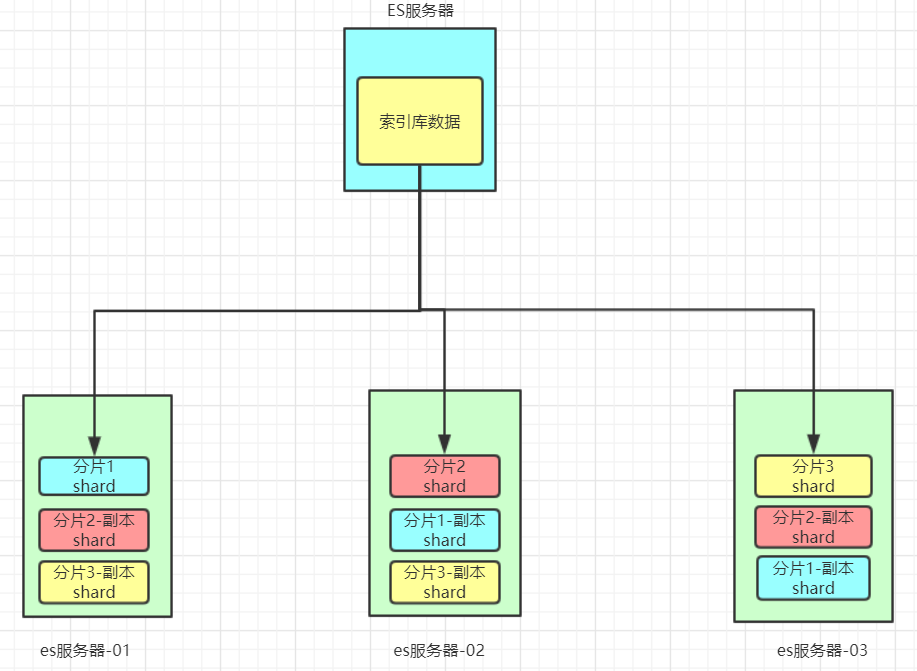

# Elasticsearch

## Lucene

**什么是lucene**

Lucene是免费开源用于全文检索的程序工具包（API），由Apache软件基金会支持和提供，Lucene的目的是为软件开发人员提供一个简单易用的工具包，以方便地在目标系统中实现全文检索的功能。 目前主流的java搜索框架都是依赖Lucene，可以用来制作搜索引擎产品。

lucene怎么读？

[lucene[ˈluːsin]](https://zh.forvo.com/word/lucene/)

## 全文检索

对于非结构化数据，例如互联网上的所有内容，或者电商站内搜索，使用顺序查询，效率也非常低，可以使用**全文检索**(Full-text Search)，计算机索引程序通过扫描文章中的每一个词，对每一个词建立一个索引，指明该词在文章中出现的次数和位置，当用户查询的时候，检索程序就根据事先建立的索引进行查找，并将查找的结果反馈给用户。

>例如：字典。字典的拼音表和部首检字表就相当于字典的索引，对每一个字的解释是非结构化的，如果字典没有音节表和部首检字表，在茫茫辞海中找一个字只能顺序扫描。然而字的某些信息可以提取出来进行结构化处理，比如读音，就比较结构化，分声母和韵母，分别只有几种可以一一列举，于是将读音拿出来按一定的顺序排列，每一项读音都指向此字的详细解释的页数。我们搜索时按结构化的拼音搜到读音，然后按其指向的页数，便可找到我们的非结构化数据——也即对字的解释。 
>这种先建立索引，再对索引进行搜索的过程就叫全文检索。 

**倒排索引**

全文检索使用的索引是**倒排索引**(Inverted Index)

它主要是用来存储某个单词（或词组）在一个文档或一组文档中的存储位置的映射，即提供了一种根据内容来查找文档的方式。

简单的说，倒序索引的**倒序**，指的是这个索引是从关键词中查找对应的文档源的，而不是从文档源中检索对应的关键词。

##  相关概念

```
索引库（indexes）---------------------------------Databases 数据库

    类型（type）----------------------------------Table 数据表

        文档（Document）--------------------------Row 行

             字段（Field）---------------------Columns 列 
                
                映射配置（mappings）--------- 表结构
```

详细说明

| 概念                 | 说明                                                         |
| -------------------- | ------------------------------------------------------------ |
| 索引库（indexes)     | 索引库包含一堆相关业务，结构相似的文档document数据，比如说建立一个商品product索引库，里面可能就存放了所有的商品数据。 |
| 类型（type）         | type是索引库中的一个逻辑数据分类，一个type下的document，都有相同的field，类似于数据库中的表。比如商品type，里面存放了所有的商品document数据。**6.0版本以后一个index只能有1个type，6.0版本以前每个index里可以是一个或多个type**。 |
| 文档（document）     | 文档是es中的存入索引库最小数据单元，一个document可以是一条客户数据，一条商品数据，一条订单数据，通常用JSON数据结构表示。document存在索引库下的type类型中。 |
| 字段（field）        | Field是Elasticsearch的最小单位。一个document里面有多个field，每个field就是一个数据字段。 |
| 映射配置（mappings） | 类型对文档结构的约束叫做`映射(mapping)`，用来定义document的每个字段的约束。如：字段的数据类型、是否分词、是否索引、是否存储等特性。类型是模拟mysql中的table概念。表是有结构的，也就是表中每个字段都有约束信息。 |

### 集群

**集群(cluster)**，由一个或者多个节点组成，每个集群都有一个cluser name 作为标识。

### 节点

**节点(node)**，一个ES实例就是一个node，一个机器可以有多个实例，大多数情况下，每个node需要运行在独立的环境中。

### 数据分片

**分片(shards)**，ES是一个分布式搜索引擎，每个索引有一个或者多个分片(shards)，索引的数据被分配到各个分片上，相当于一桶水用了多个杯子装。

- 分片是独立的，对于一个搜索行为，每个分片都会执行这个行为。
- 每个分片都是一个Lucene Index，所以一个分片只能存放 `Integer.MAX_VALUE - 128 = 2,147,483,519` 个docs

分片个数在创建索引库的时候，由`index.number_of_shards`属性指定，**默认值为1**（7.x），此值仅能在**创建索引**的时候进行设置。

同一个节点如果分片数过多，那么最终导致每个分片的文件系统缓存变小，从而影响性能。

### 数据备份

**数据备份(replica)**，相应的有**主分片(primary shard)**

- 为防止单点故障，主分片和备分片不会出现在同一节点，两个相同的备分片也不能出现在同一个节点
- 如果你只有一个节点，那么5个节点将无法分配，此时集群状态将变为黄色

集群状态：

- 绿色，所有主分片和备分分片都准备就绪，假设有一个节点挂了，那么数据不会丢失，但是集群状态会变为黄色
- 黄色，所有主分片准备就绪，但存在至少一个主分片（假设是A）对应的备份分片没有就绪，此时集群属于警告状态，意味着集群高可用和容灾能力下降，如果刚好A所在的机器挂了，并且你只设置了一个备份（已处于未就绪状态），那么A的数据就会丢失（查询结果不完整），此时集群进入Red状态
- 红色，至少有一个主分片没有就绪（直接原因是找不到对应的备份分片成为新的主分片），此时查询的结果会出现数据丢失（不完整）

所以，备份的作用主要包括：

- 容灾：primary分片丢失，replica分片就会被顶上去成为新的主分片，同时根据这个新的主分片创建新的replica，集群数据安然无恙
- 提高查询性能：replica和primary分片的数据是相同的，所以对于一个query既可以查主分片也可以查备分片，在合适的范围内多个replica性能会更优（但要考虑资源占用也会提升[cpu/disk/heap]），另外index request只能发生在主分片上，replica不能执行index request

备份数是由`index.number_of_replicas`决定的，可以随时更改。

如图，我们以3分片，每个分片备份一份为例：



在这个集群中，如果出现单节点故障，并不会导致数据缺失，所以保证了集群的高可用，同时也减少了节点中数据存储量。并且因为是多个节点存储数据，因此用户请求也会分发到不同服务器，并发能力也得到了一定的提升。

[reference](https://www.zhihu.com/question/26446020)

### 如何选择分片数和备份数

对于分片数量的选择，**我们应该选择最少的分片**。过度分配反而增大了Lucene在合并分片查询结果的复杂度。

`节点数 <= 主分片数*(副本数+1)`

### 分词器

分词器(Analyzer)的作用是把一段文本中的词按规则取出所包含的所有词。对应的是Analyzer类，这是一个抽象类，切分词的具体规则是由子类实现的，所以对于不同的语言（规则），要用不同的分词器。

分词器会在两个地方对文本进行解析：

- 建立索引库的时候，对text类型的字段进行分词
- 当全文搜索的时候，会对搜索的短语进行分词

#### 常见的分词器

##### StandardAnalyzer

英文的话会按照单词进行分隔，汉语的话会将每个字进行分隔

请求示例1：

```json
GET/POST _analyze
{
    "analyzer" : "standard",
    "text" : "I'm wujunnan, I love you"
}
```

响应示例1：

```json
{
    "tokens": [
        {
            "token": "i'm",
            "start_offset": 0,
            "end_offset": 3,
            "type": "<ALPHANUM>",
            "position": 0
        },
        {
            "token": "wujunnan",
            "start_offset": 4,
            "end_offset": 12,
            "type": "<ALPHANUM>",
            "position": 1
        },
        {
            "token": "i",
            "start_offset": 14,
            "end_offset": 15,
            "type": "<ALPHANUM>",
            "position": 2
        },
        {
            "token": "love",
            "start_offset": 16,
            "end_offset": 20,
            "type": "<ALPHANUM>",
            "position": 3
        },
        {
            "token": "you",
            "start_offset": 21,
            "end_offset": 24,
            "type": "<ALPHANUM>",
            "position": 4
        }
    ]
}
```

请求示例2：

```json
GET/POST  _analyze
{
    "analyzer" : "standard",
    "text" : "虽千万人，吾往矣"
}
```

请求示例2：

```json
{
    "tokens": [
        {
            "token": "虽",
            "start_offset": 0,
            "end_offset": 1,
            "type": "<IDEOGRAPHIC>",
            "position": 0
        },
        {
            "token": "千",
            "start_offset": 1,
            "end_offset": 2,
            "type": "<IDEOGRAPHIC>",
            "position": 1
        },
        {
            "token": "万",
            "start_offset": 2,
            "end_offset": 3,
            "type": "<IDEOGRAPHIC>",
            "position": 2
        },
        {
            "token": "人",
            "start_offset": 3,
            "end_offset": 4,
            "type": "<IDEOGRAPHIC>",
            "position": 3
        },
        {
            "token": "吾",
            "start_offset": 5,
            "end_offset": 6,
            "type": "<IDEOGRAPHIC>",
            "position": 4
        },
        {
            "token": "往",
            "start_offset": 6,
            "end_offset": 7,
            "type": "<IDEOGRAPHIC>",
            "position": 5
        },
        {
            "token": "矣",
            "start_offset": 7,
            "end_offset": 8,
            "type": "<IDEOGRAPHIC>",
            "position": 6
        }
    ]
}
```

##### IKAnalyzer

IK分词器有两种分词模式：ik_max_word和ik_smart模式。

- ik_max_word (常用)

  将文本做最细粒度的拆分

- ik_smart

  会做最粗粒度的拆分

```json
GET/POST  _analyze
{
    "analyzer" : "ik_max_word",
    "text" : "我叫武俊男，大家听我说两句"
}
```

ik_max_word 分词模式运行得到结果：

```json
{
    "tokens": [
        {
            "token": "我",
            "start_offset": 0,
            "end_offset": 1,
            "type": "CN_CHAR",
            "position": 0
        },
        {
            "token": "叫",
            "start_offset": 1,
            "end_offset": 2,
            "type": "CN_CHAR",
            "position": 1
        },
        {
            "token": "武",
            "start_offset": 2,
            "end_offset": 3,
            "type": "CN_CHAR",
            "position": 2
        },
        {
            "token": "俊男",
            "start_offset": 3,
            "end_offset": 5,
            "type": "CN_WORD",
            "position": 3
        },
        {
            "token": "大家",
            "start_offset": 6,
            "end_offset": 8,
            "type": "CN_WORD",
            "position": 4
        },
        {
            "token": "听我",
            "start_offset": 8,
            "end_offset": 10,
            "type": "CN_WORD",
            "position": 5
        },
        {
            "token": "说",
            "start_offset": 10,
            "end_offset": 11,
            "type": "CN_CHAR",
            "position": 6
        },
        {
            "token": "两句",
            "start_offset": 11,
            "end_offset": 13,
            "type": "CN_WORD",
            "position": 7
        },
        {
            "token": "两",
            "start_offset": 11,
            "end_offset": 12,
            "type": "COUNT",
            "position": 8
        },
        {
            "token": "句",
            "start_offset": 12,
            "end_offset": 13,
            "type": "CN_CHAR",
            "position": 9
        }
    ]
}
```

####  添加扩展词典和停用词典

**停用词**：有些词在文本中出现的频率非常高。但对本文的语义产生不了多大的影响。例如英文的a、an、the、of等。或中文的”的、了、呢等”。这样的词称为停用词。停用词经常被过滤掉，不会被进行索引。在检索的过程中，如果用户的查询词中含有停用词，系统会自动过滤掉。停用词可以加快索引的速度，减少索引库文件的大小。

**扩展词**：就是不想让哪些词被分开，让他们分成一个词。

#### 自定义扩展词库

- 进入到 elasticsearch/config/analysis-ik/(**插件安装方式**) 或 elasticsearch/plugins/analysis-ik/config(**安装包安装方式**) 目录下, 新增自定义词典

  ```
  vim myext_dict.dic
  ```

  输入 ：江大桥

- 将我们自定义的扩展词典文件添加到IKAnalyzer.cfg.xml配置中

  ```
  vim IKAnalyzer.cfg.xml 
  ```

  ```
  <!--用户可以在这里配置自己的扩展字典 -->
  <entry key="ext_dict">
  	myext_dict.dic
  </entry>
  ```

- 重启

- 这样就查出来了江大桥

  ```
  {
    "token": "江大桥",
    "start_offset": 4,
    "end_offset": 7,
    "type": "CN_WORD",
    "position": 6
  }
  ```

### 数据类型

[ES数据类型](https://www.elastic.co/guide/en/elasticsearch/reference/7.x/mapping-types.html)

| 数据类型 | 备注                             |
| -------- | -------------------------------- |
| keyword  | 不需要分词，精确匹配，例如：工号 |
| text     | 需要分词，                       |
| boolean  |                                  |
| long     |                                  |
| double   |                                  |
| date     |                                  |


## APIs

Elasticsearch提供了Rest风格的API，即http请求接口，而且也提供了各种语言的客户端API

### Index APIs

#### 查看所有索引库

```
GET _cat/indices
```

#### 建立索引库

```
PUT /<index>
```

通过该API，可以指定

- 索引库的Setting
- 索引库的字段Mapping
- 索引库别名

```
PUT /blog1
{
  "settings": {
    "属性名": "属性值"
  }
}
```

参数：

Path paramters

- `<index>`
  - 只能为小写字母
  - 不能已`-`, `_`, `+`开头
  - 不能超过255字节

Query parameters

- `include_type_name`

  可选，默认为false，是否期望mappings里面有type（Mappings type在7.0.0中被废弃）

- `wait_for_active_shards`

- `master_timeout`

- `timeout`

Request body

- `aliases`

- `mappings`

- `settings`

  - Static index settings

    `index.number_of_shards`

    切片数，**默认为1**，每个索引库最大限制为1024

  - Dynamic index settings

    `index.number_of_replicas`

    每个主切片有几个备份，**默认值为1**

示例：

```
PUT /test
{
  "settings": {
    "number_of_shards": 1
  },
  "mappings": {
    "properties": {
      "field1": { "type": "text" }
    }
  }
}
```

注意：

在7.0.0之前，mapping的定义中是包含type的，之后是默认不包含的

#### 创建/修改字段映射

除了在创建索引库的时候创建字段映射，也可以单独创建Mapping

```
PUT 索引库名/_mapping
{
  "properties": {
    "字段名": {
      "type": "类型",
      "analyzer": "分词器",
      (Mapping parameters)...
    }
  }
}
```

注意：在7.0.0之前，这里会包含type

Mapping parameters：

- type：类型，可以是text、long、short、date、integer、object等

- fields：一个字段可以指定为多个类型

- index：是否索引，默认为true  

- store：是否存储，默认为false

- analyzer：分词器，这里的`ik_max_word`即使用ik分词器

  只有text类型才能使用分词器，该分词器同时作用于索引的创建和搜索

例如：

```
PUT /my/_mapping/goods
{
  "properties": {
    "title": {
      "type": "text",
      "analyzer": "ik_max_word"
    },
    "subtitle": {
      "type": "text",
      "analyzer": "ik_max_word"
    },
    "images": {
      "type": "keyword",
      "index": "false"
    },
    "price": {
      "type": "float"
    }
  }
}
```

上述案例中，就给my这个索引库添加了一个名为`goods`的类型，并且在类型中设置了4个字段：

- title：商品标题
- subtitle: 商品子标题
- images：商品图片
- price：商品价格

并且给这些字段设置了一些属性，至于这些属性对应的含义，我们在后续会详细介绍。

##### type (数据类型)

- String类型，又分两种：

  - `text`：可分词，不可参与聚合
  - `keyword`：不可分词，数据会作为完整字段进行匹配，可以参与聚合
  
  注意：如果使用动态映射 (dynamic mappings)，那么String类型将同时映射为`text`类型和`keyword类型`，这个时候可以通过`test_dynamic mappings.keyword`字段实现关键词搜索及数据聚合。
  
  ```json
  "test_dynamic mappings": {
    "type": "text",
    "fields": {
      "keyword": {
        "type": "keyword",
        "ignore_above": 256
      }
    }
  }
  ```

- Numerical数值类型，分两类：

  - 整型：

    - `long`

      `-2^63` - `2^63-1`

    - `interger`

      `-2^31` - `2^31-1`

    - `short`

      `-32768` - `32767`

    - `byte`

      `-128` - `127`

    - `unsigned_long`

      `0` - `2^64-1`

  - 浮点型（IEEE 754浮点数标准）：

    - `double`

      双精度64比特

    - `float`

      单精度32比特

    - `half_float`

      半精度16比特

  - 浮点数的高精度类型

    - `scaled_float`

      需要指定一个精度因子`scaling_factor`，比如10或100。Elasticsearch会把真实值乘以这个因子后存储，取出时再还原。
      
      >For instance, a `price` field could be stored in a `scaled_float` with a `scaling_factor` of `100`. All APIs would work as if the field was stored as a double, but under the hood Elasticsearch would be working with the number of cents, `price*100`, **which is an integer**. This is mostly helpful to save disk space since integers are way easier to compress than floating points.
      
      也就说，如果小数位是固定的，可以使用`scaled_float`，这样更节省存储空间。

  举例：

  ```json
  PUT my-index-000001
  {
    "mappings": {
      "properties": {
        "number_of_bytes": {
          "type": "integer"
        },
        "time_in_seconds": {
          "type": "float"
        },
        "price": {
          "type": "scaled_float",
          "scaling_factor": 100
        }
      }
    }
  }
  ```

- `Date`：日期类型

  Elasticsearch可以对日期格式化为字符串存储，但是建议我们存储为毫秒值，存储为long，节省空间。

- `Array`：数组类型

  - 进行匹配时，任意一个元素满足，都认为满足
  - 排序时，如果升序则用数组中的最小值来排序，如果降序则用数组中的最大值来排序

- `Object`：对象

```json
{
    name:"Jack",
    age:21,
   	girl:{
		name: "Rose", age:21
   }
}
```

如果存储到索引库的是对象类型，例如上面的girl，会把girl编成两个字段：girl.name和girl.age

**index**

index影响字段的索引情况。

- true：字段会被索引，则可以用来进行搜索。默认值就是true
- false：字段不会被索引，不能用来搜索

index的默认值就是true，也就是说你不进行任何配置，所有字段都会被索引。

但是有些字段是我们不希望被索引的，比如商品的图片信息，就需要手动设置index为false。

**store**

是否将数据进行独立存储。

原始的文本会存储在`_source`里面，默认情况下其他提取出来的字段都不是独立存储的，是从`_source`里面提取出来的。当然你也可以独立的存储某个字段，只要设置store:true即可，获取独立存储的字段要比从_source中解析快得多，但是也会占用更多的空间，所以要根据实际业务需求来设置，默认为false。

##### fields (multi-fields)

一个字段可以是多种类型的

例如：

一个String类型会被映射为一个text类型用于全文搜索，也会作为一个`keyword`用作排序或聚合

`field.raw`可以用于排序或者聚合。

```json
PUT my-index-000001
{
  "mappings": {
    "properties": {
      "city": {
        "type": "text",
        "fields": {
          "raw": { 
            "type":  "keyword"
          }
        }
      }
    }
  }
}
```

[multi-fields](https://www.elastic.co/guide/en/elasticsearch/reference/7.x/multi-fields.html#multi-fields)

##### **ES为什么移除了type?**

[removal-of-types](https://www.elastic.co/guide/en/elasticsearch/reference/7.x/removal-of-types.html)

最开始，ES将index与SQL中的database做类比，那么type就类比做table。

在SQL中，table是相互独立的，两个表中即使存在相同的字段名也是没关系的，但是，在Elasticsearch索引中，不同映射类型中具有相同名称的字段在内部由相同的Lucene字段支持，也就是说，不同的type中相同名字的字段必须mapping一致。

#### 动态映射


#### 查看索引库

```
GET /<target>
```

Path parameters：

- `<target>`
  - 可以用逗号分隔的索引库名、别名
  - 也支持通配符，`*`或者`_all`来表示所有索引库

结果示例：

```json
GET /wechat_chat_transcripts
{
    "wechat_chat_transcripts": {
        "aliases": {},
        "mappings": {
            "properties": {
                "content": {
                    "type": "text",
                    "analyzer": "ik_max_word"
                },
                "cust_id": {
                    "type": "keyword"
                },
                "custmer_id": {
                    "type": "keyword"
                },
                "is_reply": {
                    "type": "keyword"
                }
            }
        },
        "settings": {
            "index": {
                "creation_date": "1625754398248",
                "number_of_shards": "1",
                "number_of_replicas": "1",
                "uuid": "EqYpwApuQUG5ymZvMlScpQ",
                "version": {
                    "created": "7050299"
                },
                "provided_name": "wechat_chat_transcripts"
            }
        }
    }
}
```

#### 删除索引库

```
DELETE /<index>
```

#### 查看映射关系

```
//获取所有索引库的mapping
GET /_mapping 
```

```
GET /<target>/_mapping
```

- 同样的，target可以使用逗号分隔
- 也可以使用通配符`*` ` _all`

### Document APIs

文档，即索引库中某个类型下的数据，会根据规则创建索引，将来用来搜索。可以类比做数据库中的每一行数据

#### 新增文档


#### 新增文档


#### 查看文档


#### 修改数据


#### 删除数据


#### 删除所有数据


#### 批量操作/bulk

当我们需要批量操作的时候，那么频繁的接口请求是非常浪费时间的。我们可以通过Bulk API来操作。

**请求格式**

- `POST /_bulk`

- `POST /<target>/_bulk`

  当使用了`<target>`参数的时候，那么批量操作中的每一个操作都默认使用该索引库，不需要再指定`_index`参数

该请求要求请求体的格式必须为NDJSON（New-line Delimited JSON）

形如下：

```
action_and_meta_data\n
optional_source\n
action_and_meta_data\n
optional_source\n
....
action_and_meta_data\n
optional_source\n
```

**注意：**

- **最后一行也要加换行符，这里很容易忽略！！！**
- 注意该请求头中的Content-Type应该使用 `application/json` or `application/x-ndjson`

##### NDJSON扩展

NDJson是一个比较新的标准，即每行就是一个传统的json对象。每个对象中要去掉原本用于格式化的换行符，每个对象之间用换行符来分隔。

**请求体**

可选的操作

- create

  创建新文档

- delete

  删除指定的文档

- index

  如果文档不存在，则新增，如果存在则修改

- update

  修改一个文档，不存在的话就返回错误

```
POST _bulk
{ "index" : { "_index" : "test", "_id" : "1" } }
{ "field1" : "value1" }
{ "delete" : { "_index" : "test", "_id" : "2" } }
{ "create" : { "_index" : "test", "_id" : "3" } }
{ "field1" : "value3" }
{ "update" : {"_id" : "1", "_index" : "test"} }
{ "doc" : {"field2" : "value2"} }
```

进行批操作的时候，一个操作失败了，是不会影响其他文档操作的，返回的响应中将会说明它的错误原因。


### Search APIs

**Request**

- `POST/GET /<target>/_search`
- `POST/GET /_search`

`<target>`参数，如果多个索引库，那么可以使用逗号分隔，或者使用通配符`*`

**Request Parameters**

- `from`

  默认为0，文档的起始位置，通过from和size不能查询超过10000的文档

- `size`

  默认为10

- `sort`

- `scroll`

- `version`

  如果为true的话，返回文档的version，默认为false

**Request body**

- 
- `_source`
  - `exclude`
  - `includes`

**Response body**

#### query和filter的区别

query更多关注的是这个查询子句和该文档的匹配程度如何？

例如：是否包含、相关得分度多少，并且得分越高，排名越靠前

典型的应用场景就是**全文检索**

filter更多关注是否匹配？

典型的应用场景：

- 时间范围是否在xxxx-xxxx之间
- 某个`keyword`字段是否是某个值

**`filter`查询要更快**，原因如下：

- **不需要计算得分**
- 经常使用的过滤器将被ElasticSearch自动缓存，以提高性能，而`query`的查询结果不可缓存

ebay在Elasticsearch使用经验中总结到：

> Use filter context instead of query context if possible.

即：如果可能，请使用filter过滤器上下文而不是query查询上下文。

**总结就是，当使用全文检索以及任何使用评分相关性的场景使用query检索，其他场景都使用filter过滤。**

举例：

```
GET /_search
{
  "query": { 
    "bool": { 
      "must": [
        { "match": { "title":   "Search"        }},
        { "match": { "content": "Elasticsearch" }}
      ],
      "filter": [ 
        { "term":  { "status": "published" }},
        { "range": { "publish_date": { "gte": "2015-01-01" }}}
      ]
    }
  }
}
```

其中match适用于query域中，而filter适用于filter域中。

#### 查询索引库总记录数/count

```
GET /cust_tag/_count
```

#### 全文查询

##### 匹配查询/match

现在，索引库中有2部手机，1台电视;

- or

`match`类型查询，会把查询条件进行分词，然后进行查询,多个词条之间是or的关系

```json
POST /my/_search
{
    "query":{
        "match":{
            "title":"小米电视4A"
        }
    }
}
```

在上面的案例中，不仅会查询到电视，而且与小米相关的都会查询到，多个词之间是`or`的关系。

- and

##### 多字段查询/multi_match

`multi_match`与`match`类似，不同的是它可以在多个字段中查询

为了测试效果我们在这里新增一条数据：

```
POST /my/goods
{
	"title": "华为手机",
	"images": "http://image.leyou.com/12479122.jpg",
	"price": 5288,
	"subtitle": "小米"
}
```

示例：

```json
POST /my/_search
{
  "query": {
    "multi_match": {
      "query": "小米",
      "fields": ["title","subtitle"]
    }
  }
}
```

本例中，我们会假设在title字段和subtitle字段中查询`小米`这个词

##### 短语查询/match_phrase

文档同时满足下面两个条件才会被搜索到：

- 分词后所有词项都要出现在该字段中
- 字段中的词项顺序要一致

match_phrase与slop一起用，能保证分词间的邻近关系，slop参数告诉match_phrase查询词条能够相隔多远时仍然将文档视为匹配，默认是0。为0时，必须相邻才能被检索出来。

参数说明：

- analyzer 指定何种分析器来对该短语进行分词处理
- slop 用于指定查询短语间的词项(term)间的距离
- boost 用于设置该查询的权重

```
GET /_search
{
    "query": {
        "match_phrase" : {
            "message" : "this is a test",
            "analyzer":"english",
            "slop":0
        }
    }
}
```

[深入理解 Match Phrase Query](https://ld246.com/article/1512989203733)

[es 基于match_phrase/fuzzy的模糊匹配原理及使用](https://www.cnblogs.com/danvid/p/10570334.html)

- 由于match_phrase是在搜索阶段进行的计算，会影响搜索效率，据说比term查询慢20倍，所以不要进行大文本量的字段搜索，尽量进行标题，名字这种类型的搜索才使用这个
- 没有讨论在文本数据重复时的情况，即文本中有多个`东方宾馆`和query文本中有多个`东方宾馆`"分词的情况，但是原理是一样的还是取距离转换的最小值
- 文中使用了standard分词，实际上可能会用不同的分词器，但是建议使用match_phrase时使用标准的一个个分词，这样是方便进行邻近搜索的控制的，如果使用ik等分词，执行match_phrase时分词是不可控的，所以结果也是不可控。match使用ik，match_phrase用standard结合一起使用也是可以的；

##### matchPhrasePrefixQuery

如果你调用matchPhrasePrefixQuery时，text为中文，那么，很大可能是一种状况：你会发现，matchPhraseQuery和matchPhrasePrefixQuery没有任何差别。而当text为英文时，差别就显现出来了：matchPhraseQuery的text是一个英文单词，而matchPhrasePrefixQuery的text则无这一约束，你可以从一个英文单词中抽几个连接在一起的字母进行查询。

https://www.cnblogs.com/softidea/archive/2016/10/20/5981751.html

#### 查询所有/match_all

```
POST /my/_search
{
    "query":{
        "match_all": {}
    }
}
```

- `query`：代表查询对象
- `match_all`：代表查询所有

结果参数：

- took：查询花费时间，单位是毫秒
- time_out：是否超时
- _shards：分片信息
- hits：搜索结果总览对象
  - total：搜索到的总条数
  - max_score：所有结果中文档得分的最高分
  - hits：搜索结果的文档对象数组，每个元素是一条搜索到的文档信息
    - _index：索引库
    - _type：文档类型
    - _id：文档id
    - _score：文档得分
    - _source：文档的源数据

#### 精准查询

##### 是否存在/exists

查询存在：

```
GET /_search
{
  "query": {
    "exists": {
      "field": "user"
    }
  }
}
```

以下情况表示不存在

- JSON的value为`null`或者`[]`
- 字符串或`-`
- 数组包含null

```
GET /_search
{
  "query": {
    "bool": {
      "must_not": {
        "exists": {
          "field": "user.id"
        }
      }
    }
  }
}
```

##### 模糊查询/fuzzy

我们新增一个商品：

```
POST /my/goods/4
{
    "title":"apple手机",
    "images":"http://image.leyou.com/12479122.jpg",
    "price":5899.00
}
```

fuzzy自动将拼写错误的搜索文本，进行纠正，纠正以后去尝试匹配索引中的数据

它允许用户搜索词条与实际词条出现偏差，但是偏差的编辑距离不得超过2：

```
POST /my/_search
{
  "query": {
    "fuzzy": {
      "title": "appla"
    }
  }
}
```

上面的查询，也能查询到apple手机

fuzziness，你的搜索文本最多可以纠正几个字母去跟你的数据进行匹配，默认不设置，我们可以通过

```
POST /my/_search
{
  "query": {
    "fuzzy": {
      "title": {
        "value": "applaa",
        "fuzziness": 2
      }
    }
  }
}
```

##### ids查询/ids

```
{
  "query": {
    "ids": {
      "type": "news",
      "values": "2101"
    }
  }
}
```

一次查询多个id

```json
{
  "query": {
    "ids": {
      "values": [
        "2101",
        "2301"
      ]
    }
  }
}
```

##### 范围查询/range

```
GET /_search
{
  "query": {
    "range": {
      "age": {
        "gte": 10,
        "lte": 20,
        "boost": 2.0
      }
    }
  }
}
```

##### 词条匹配/term

`term` 查询被用于精确值匹配，这些精确值可能是数字、时间、布尔或者那些**未分词**的字符串

```json
POST /my/_search
{
    "query":{
        "term":{
            "price":2699
        }
    }
}

---------------------
POST /my/_search
{
  "query": {
    "term": {
      "price": {
        "value": "2699"
      }
    }
  }
}

```

##### 多词条精确匹配/terms

`terms` 查询和 term 查询一样，但它允许你指定多值进行匹配。如果这个字段包含了指定值中的任何一个值，那么这个文档满足条件，类似于mysql的in：

```json
POST /my/_search
{
    "query":{
        "terms":{
            "price":[2699,5288]
        }
    }
}
```

##### 通配符查询/wildcard

使用通配符进行查询

其中`?`代表任意一个字符，`*`代表任意的一个或多个字符。

```
GET /_search
{
    "from":0,
    "size":2,
    "query":{
        "wildcard":{
        "eu_birthday_date":"10-*" 
        }
    }
}
```

#### 布尔查询/bool

布尔查询将一个或多个子语句通过下面的链接符连接起来：

- `must`

  查询的子语句必须出现在子语句中，即多个子语句的关系是`且`

- `should`

  当有多个子语句的时候，默认只要满足一个就可以返回，即多个子语句的关系**类似**`或`

  `minimum_should_match`参数定义了至少满足几个子句

  **注意：**

  关于不指定`minimum_should_match`的情况，查询分为2个情况：

  - 当bool处于query的上下文中时，如果must或者filter匹配了doc，那么should即使一条也不匹配也可以召回doc
  - 当bool处于父bool的filter的上下文中，或者bool处在query上下文且没有`must`/`filter`子句的时候，should至少匹配1个才能召回doc

  reference：[关于ES的minimum_should_match](https://yuerblog.cc/2018/09/07/elasticsearch-minimum_should_match/)

- `must_not`

- `filter`

  效果相当于`must`

```
POST _search
{
  "query": {
    "bool" : {
      "must" : {
        "term" : { "user.id" : "kimchy" }
      },
      "filter": {
        "term" : { "tags" : "production" }
      },
      "must_not" : {
        "range" : {
          "age" : { "gte" : 10, "lte" : 20 }
        }
      },
      "should" : [
        { "term" : { "tags" : "env1" } },
        { "term" : { "tags" : "deployed" } }
      ],
      "minimum_should_match" : 1,
      "boost" : 1.0
    }
  }
}
```


#### 折叠/collapse

collapse是Elasticsearch5.3中新增的特性，专门为上述场景定制，此需求是2010年7月提的issue，是讨论最多的帖子之一，6年后终于得到了支持。

#### 适用场景

- 输入提示

  例如，有企业信息宽表中，存储了海量的企业记录，每条记录有很多字段，需求是根据字段构造筛选条件，筛选出符合条件的企业主，要求在输入筛选条件字段值的时候，下面会有提示词。

  如图所示：

  

  那么在该案例中，就需要对合作机构名称字段进行去重处理

- 网站展示重复帖子/文章去重

  网上可能存在大量复制粘贴，营销号搬运的内容，我们需要对其进行折叠处理。

  首先需要定义重复文章，这就需要算法同学根据一定规则对相关内容进行判定，增加一个重复id字段，那么我们在展示的时候，就可以根据这个id对搜索到的内容进行折叠，同一重复id的内容，只展示一份即可，避免出现全是重复搬运、营销内容。

请求示例1:

```json
{
    "size": 10, //折叠后显示的个数
    "from": 0,
    "_source": ["agency_name"],
    "query":{
        "match_phrase":{
            "agency_name":"北京"
        }
    },
    "collapse":{
        "field":"agency_name.raw" //要进行折叠的字段
    },
    "sort":[
        {
            "established_duration_time":{
                "order" : "desc" //按成立时长排序
            }
        }
    ]
}
```

请求示例2：

此示例表示获取前三个合作机构名称，并获取每个机构名称下的两家公司，都按成立时长降序排序

```json
{
    "size": 3, //折叠后显示的个数
    "from": 0,
    "_source": ["agency_name","name","established_duration_time"],
    "query":{
        "match_phrase":{
            "agency_name":"北京"
        }
    },
    "collapse":{
        "field":"agency_name.raw", //要进行折叠的字段
        "inner_hits":{
            "name":"top2",
            "_source": ["agency_name","name","established_duration_time"],
            "size": 2,
            "sort":[
                {
                    "established_duration_time":"desc" //按成立时长排序
                }
            ]
        }
    },
    "sort":[
        {
            "established_duration_time":{
                "order" : "desc" //按成立时长排序
            }
        }
    ]
}
```

### 聚合/Aggregations

掌握Aggregations需要理解两个概念：

- 桶(Buckets)：符合条件的文档的集合，相当于SQL中的`group by`
- 指标(Metrics)：基于Buckets的基础上进行统计分析，相当于SQL中的`count`,`avg`,`sum`等

注意：

- **如果只想返回聚合的内容，可以将size设置为0**
- **子聚合(sub-aggregations)**嵌套子聚合并没有深度的限制
- `aggs`与`aggregations`是等效的

#### Buckets aggregations

##### Terms

单桶聚合，即按照某一个字段进行聚合，类似mysql中`group by termA`

**request**

```console
GET /_search
{
  "aggs": {
    "genres": {
      "terms": { "field": "genre" }
    }
  }
}
```

注意：

默认情况下，是不能对text类型的字段进行聚合的，除非在text字段上打开`fielddata`，聚合分析操作会对这个字段的所有分词分别进行聚合, 获得的结果大多数情况下并不符合我们的需求，而且会消耗大量内存。 

**response**

```
{
  ...
  "aggregations": {
    "genres": {
      "doc_count_error_upper_bound": 0,   
      "sum_other_doc_count": 0,           
      "buckets": [                        
        {
          "key": "electronic",
          "doc_count": 6
        },
        {
          "key": "rock",
          "doc_count": 3
        },
        {
          "key": "jazz",
          "doc_count": 2
        }
      ]
    }
  }
}
```

- `sum_other_doc_count`

  当存在很多不重复的terms的时候，Elasticsearch只会返回下面order指定顺序下排名在前的terms，这种情况下，这个数据就代表剩下不在响应体里的部分的大小。

- `size`

  返回聚合后桶的数量，当聚合后的桶过多时，可以使用size限制返回桶的数量。

  没有`from`属性，即terms聚合不支持分页，详情见下文Aggregations分页。

  `size`需要传一个整数，ElasticSearch中int型最大值都限制为2147483647即2^31-1

- `shard_size`

  > When defined, it will determine how many terms the coordinating node will request from each shard. 

  即`shard_size`参数定义了每个分片读取的terms的个数，来提高聚合size的精确性，原理详情见下文Aggregations分页。

  `shard_size`的默认大小为`(size * 1.5 + 10)`

- `order`

  默认的顺序是`doc_count`倒序

  - 按照key的字母升降顺序进行排序

    ```
    GET /_search
    {
      "aggs": {
        "genres": {
          "terms": {
            "field": "genre",
            "order": { "_key": "asc" }
          }
        }
      }
    }
    ```

##### Multi-terms

多桶聚合，即按照多个关键字进行聚合，类似mysql中`group by termA, termB`

但是，多桶聚合会比较慢，并消耗大量的内存，所以，更推荐新增一个复合字段，然后使用`terms`聚合

>The multi_term aggregations are the most useful when you need to sort by a number of document or a metric aggregation on a composite key and get top N results. If sorting is not required and all values are expected to be retrieved using nested terms aggregation or `composite aggregations` will be a faster and more memory efficient solution.

```console
GET /products/_search
{
  "aggs": {
    "genres_and_products": {
      "multi_terms": {
        "terms": [{
          "field": "genre" 
        }, {
          "field": "product"
        }]
      }
    }
  }
}
```

##### Composite

多桶聚合，它类似Mysql中的`group by 多字段`，其有两大核心功能

- 额外支持四种类型的聚合

  Multi-terms只能对多个term类型进行聚合，而Composite则打破了这个限制，使得连续型和日期类型也可以聚合，可以实现如下需求：

  根据品牌和价格区间进行聚合，例入分为：

  - 品牌A，0-100元
  - 品牌A，100-200元
  - 品牌B，0-100元
  - 品牌B，100-200元

- 聚合后分页

`sources`参数指定了多桶聚合使用哪些字段，可选项有：

- Terms

- Histogram

  数值直方图，可以使连续数据聚合，即设置固定大小的间隔，进行区间聚合

- Date histogram

  日期直方图，即选择一个日期区间进行分桶，进行日期区间聚合

- GeoTile grid

  地理块，略

```
GET /_search
{
  "size": 0,
  "aggs": {
    "my_buckets": {
      "composite": {
        "sources": [
          { "date": { "date_histogram": { "field": "timestamp", "calendar_interval": "1d" } } },
          { "product": { "terms": { "field": "product" } } }
        ]
      }
    }
  }
}
```

**分页**

使用after参数，来实现分页

但是这种方式，只支持向后翻页，不支持随机翻页

```
GET /_search
{
  "size": 0,
  "aggs": {
    "my_buckets": {
      "composite": {
        "size": 2,
        "sources": [
          { "date": { "date_histogram": { "field": "timestamp", "calendar_interval": "1d", "order": "desc" } } },
          { "product": { "terms": { "field": "product", "order": "asc" } } }
        ],
        "after": { "date": 1494288000000, "product": "mad max" } 
      }
    }
  }
}
```

**子聚合**

复合聚合也支持子聚合

```
GET /_search
{
  "size": 0,
  "aggs": {
    "my_buckets": {
      "composite": {
        "sources": [
          { "date": { "date_histogram": { "field": "timestamp", "calendar_interval": "1d", "order": "desc" } } },
          { "product": { "terms": { "field": "product" } } }
        ]
      },
      "aggregations": {
        "the_avg": {
          "avg": { "field": "price" }
        }
      }
    }
  }
}
```

**Java实现**

```java
//elasticsearch-rest-high-level-client/6.5.4
SearchRequest searchRequest = new SearchRequest("composite_test"); 
searchRequest.types("_doc");
SearchSourceBuilder searchSourceBuilder = new SearchSourceBuilder(); 
searchSourceBuilder.size(0);

List<CompositeValuesSourceBuilder<?>> sources = new ArrayList<>();

DateHistogramValuesSourceBuilder sendtime = new DateHistogramValuesSourceBuilder("sendtime")
  .field("sendtime")
  .dateHistogramInterval(DateHistogramInterval.days(1))
  .format("yyyy-MM-dd").order(SortOrder.DESC).missingBucket(false);
sources.add(sendtime);
TermsValuesSourceBuilder userid = new TermsValuesSourceBuilder("userid").field("userid").missingBucket(true);
sources.add(userid);
TermsValuesSourceBuilder dttype = new TermsValuesSourceBuilder("area").field("area").missingBucket(true);
sources.add(dttype);
CompositeAggregationBuilder  composite =new CompositeAggregationBuilder("my_buckets", sources);
composite.size(1000);

searchSourceBuilder.aggregation(composite);
searchRequest.source(searchSourceBuilder); 
SearchResponse searchResponse = client.search(searchRequest,RequestOptions.DEFAULT);
```

##### Filter

过滤桶

适用场景：

我们在聚合之后，还想再次筛选某些条件，可以通过filter过滤桶。

举例来说，假设我们在创建一个汽车交易的搜索界面，我们想通过用户的搜索内容来展示对应的结果，并展示这些搜索结果的平均价格，同时我们还想看看在这个搜索条件下，最近一个月的交易平均价格。

那么根据上述请求我们可以写出如下请求：

```
GET /cars/transactions/_search?search_type=count
{
   "query":{
      "match": {
         "make": "ford"
      }
   },
   "aggs":{
      "recent_sales": {
         "filter": { 
            "range": {
               "sold": {
                  "from": "now-1M"
               }
            }
         },
         "aggs": {
            "average_price":{
               "avg": {
                  "field": "price" 
               }
            }
         }
      }
   }
}
```

#### Metrics aggregations

##### Cardinality

统计聚合后的总数，类似sql中 `count(distinct)`，先去重再求和，这个比较常用。

**request**

```
POST /sales/_search?size=0
{
  "aggs": {
    "type_count": {
      "cardinality": {
        "field": "type"
      }
    }
  }
}
```

Response:

```console-result
{
  ...
  "aggregations": {
    "type_count": {
      "value": 3
    }
  }
}
```

注意：

此统计是个近似值

##### Top hits

聚合后，每一个聚合Bucket里面仅返回指定顺序的from-size条数据，与collapse作用相似。

一般此聚合器都用作子聚合，不然针对没有分桶的数据取出from-size个，没有意义。

- from
- size
- sort

请求样例：

```
POST /sales/_search?size=0
{
// 外层聚合，根据type类型进行聚合，根据日期返回前三个
  "aggs": {
    "top_tags": {
      "terms": {
        "field": "type",
        "size": 3
      },
      //内层聚合，每个type中，返回该type中的一个
      "aggs": {
        "top_sales_hits": {
          "top_hits": {
            "sort": [
              {
                "date": {
                  "order": "desc"
                }
              }
            ],
            "_source": {
              "includes": [ "date", "price" ]
            },
            "size": 1
          }
        }
      }
    }
  }
}
```

还有以下Metric指标可以选：

- Avg
- Min
- Max
- Sum

#### Aggregations实战

##### 实现机构名称回显下拉框

请求示例: 通过aggs/terms来实现

```json
POST /cust_tag/_search
{
    "size": 0, //折叠后显示的个数
    "from": 0,
    "_source": ["agency_name","name","established_duration_time"],
    "query":{
        "match_phrase":{
            "agency_name":"北京"
        }
    },
    "aggs":{
        "group_by_agency_name":{
            "terms":{
                "field":"agency_name.raw",
                "size":10
            }
        }
    }
}
```

##### 获取包含【北京公瑾】的文档的个数

请求示例: 通过cardinality获取

```json
POST /cust_tag/_search
{
    "query":{
    "match_phrase":{
            "agency_name":"北京公瑾"
        }
    },
    "size":0,
    "aggs":{
        "group_by_agency_name":{
            "cardinality":{
                "field":"agency_name.raw"
            }
        }
    }
}
```

### Aggregations分页

首先理解ElasticSearch的聚合过程：

> By default, the node coordinating the search process will request each shard to provide its own top `size` term buckets and once all shards respond, it will reduce the results to the final list that will then be returned to the client. 

ElasticSearch的聚合过程是先每个分片提供对应size的桶，然后不同分片提供的桶聚合到一起，再进行排序，取对应size的桶作为总结果。

举例来说：

假设我想根据Product字段进行聚合，并根据数据量取前5个，Product的取值有ProductA, ProductB, ProductC...等，那么流程如下（此例子未考虑shard_size参数）：

1. 每个分片都会根据这个字段的数据量进行分类

   假设分类结果如下：

   

2. 每个分片取前5个

   

3. 根据各分片前五，聚合得出总数量前5

   仅以产品C的排名作为举例，产品C（50个）的数据来自分片A（6个）和分片C（44个)之和。所以，排名第三。实际产品C在分片B中还存在4个，只不过这四个按照排名处于第10位，取前5的时候，显然取不到。所以，导致聚合结果不准确。

## References

1. 博客：[吃透 | Elasticsearch filter和query的不同](https://blog.csdn.net/laoyang360/article/details/80468757)
