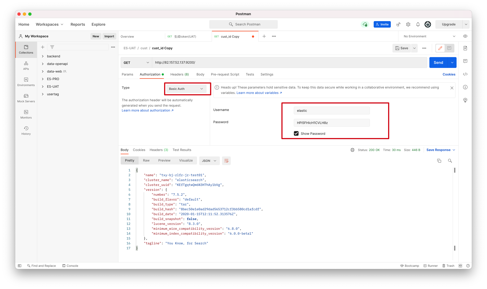

# Elasticsearch安装和配置

## Elasticsearch

注意：本文基于**elasticsearch-7.5.2**单机版的生产实践

**修改配置**

- jvm.options

  ```
  vim jvm.options
  ```

  默认配置如下：

  ```
  -Xms1g
  -Xmx1g
  ```

- elasticsearch.yml

  - 默认配置（即空配置）可以运行，但是只允许本机/kibana访问

  - 想开启密码，允许外部所有IP访问，采用下面的配置：

    ```
    #注意，必须加这个配置
    cluster.initial_master_nodes: ["node-1"]
    discovery.type: single-node
    # 默认所有host都可以访问
    network.host: 0.0.0.0
    #开启密码
    xpack.security.enabled: true
    xpack.security.transport.ssl.enabled: true
    ```
  
- 注意启动不起来要查看`elasticsearch.log`日志

**运行**

- 启动

  ```shell
  ./elasticsearch
  ```

- 后台启动

  ```shell
  ./elasticsearch -d
  ```

- 启动成功后可以看到两个端口可以看到绑定了两个端口:

  - 9300：集群节点间通讯接口，接收tcp协议
  - 9200：客户端访问接口，接收Http协议
  
- 关闭

  ```shell
  ps -ef| grep Elasticsearch
  ```

- 设置账号密码

  - 在elasticsearch.yml文件里增加配置

    ```
    xpack.security.enabled: true
    xpack.security.transport.ssl.enabled: true
    ```

  - 初始化密码需要在es启动的情况下进行设置，按照提示输入各个内置用户的密码。

    ```
    ./bin/elasticsearch -d
    ./bin/elasticsearch-setup-passwords interactive
    ```

  - 修改Kibana配置

    ```
    elasticsearch.username: “kibana”
    elasticsearch.password: “上一步设置的密码”
    ```

## Kibana

- 配置

  修改kibana.yml文件

  ```
  #server.host为访问Kibana的地址和端口
  server.host: "0.0.0.0"
  #界面中文显示，在最后一行修改
  i18n.locale: "zh-CN"
  ```

- 访问

  `http://xxx.xx.xx.xx:5601`

- 如何后台启动kibana

  ```
  nohup ./kibana &
  ```

- **如何查看kibana进程**

  ```
  ps -ef | grep node
  ```

  注意：`ps -ef | grep kibana`找不到相关进程

### Kibana配置Nginx

需求：通过Nginx实现 `host+kibana`访问kibana

问题：

当Nginx进行了反向代理配置后，并不可行，配置如下：

```nginx
location /kibana/ {
  proxy_pass http://172.27.0.8:5601;
}
```

原因：

首次访问`host+kibana`，经过代理之后，访问到了kibana，但是之后kibana会重定向到`host+login`，那么这次就不会走Nginx的反向代理了。

解决：

修改kibana的配置如下：

```properties
# Enables you to specify a path to mount(挂载) Kibana at if you are running behind a proxy.
# Use the `server.rewriteBasePath` setting to tell Kibana if it should remove the basePath
# from requests it receives, and to prevent a deprecation warning at startup.
# This setting cannot end in a slash.
server.basePath: "/kibana"

# Specifies whether Kibana should rewrite requests that are prefixed with
# `server.basePath` or require that they are rewritten by your reverse proxy.
# This setting was effectively always `false` before Kibana 6.3 and will
# default to `true` starting in Kibana 7.0.
server.rewriteBasePath: true
```

也就是说，让kibana返回的访问路径中携带basePath：`kibana`，但是读的时候却不考虑`kibana`，这个正好适合Nginx的反向代理，即将`kibana`开头的请求代理为对应的`ip+端口`

## ik分词器

- 在elasticsearch的plugins目录下新建 `analysis-ik` 目录
- [下载地址](https://github.com/medcl/elasticsearch-analysis-ik)下载对应版本的zip包解压即可
- 这里注意，不要下载`tar.gz`包，那个是源代码，需要使用maven编译一下

## 如何使用postman连接Elasticsearch

方法一：

直接在postman中认证

这种方式也会在请求头中生成一个`Authorization`的请求头



方法二：

1. 先使用chrome插件elasticsearch-head连接Elasticsearch
2. 登陆以后，查看该插件发送的请求，会发现一个`Authorization`的请求头
3. 将这个请求头复制到postman中即可

## 搭建集群

#### 清空elasticsearch中的数据

首先把已经启动的elasticsearch关闭，然后通过命令把之前写入的数据都删除。

```sh
rm -rf /elasticsearch/data
```

#### 遇到的问题

- data文件夹没有删空

  ```
  [node-2] failed to send join request to master [{node-1}{WbcP0pC_T32jWpYvu5is1A}{2_LCVHx1QEaBZYZ7XQEkMg}{10.10.11.200}{10.10.11.200:9300}], reason [RemoteTransportException[[node-1][10.10.11.200:9300][internal:discovery/zen/join]]; nested: IllegalArgumentException[can't add node {node-2}{WbcP0pC_T32jWpYvu5is1A}{p-HCgFLvSFaTynjKSeqXyA}{10.10.11.200}{10.10.11.200:9301}, found existing node {node-1}{WbcP0pC_T32jWpYvu5is1A}{2_LCVHx1QEaBZYZ7XQEkMg}{10.10.11.200}{10.10.11.200:9300} with the same id but is a different node instance]; ]
  ```

  删除es集群data数据库文件夹下所有文件即可

  [Reference](https://blog.csdn.net/diyiday/article/details/83926488)


