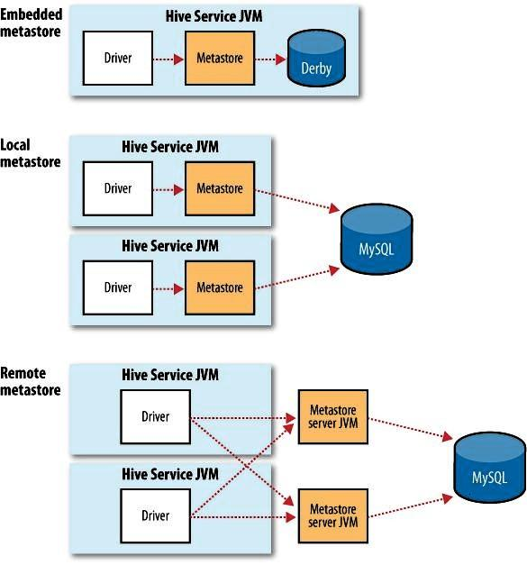
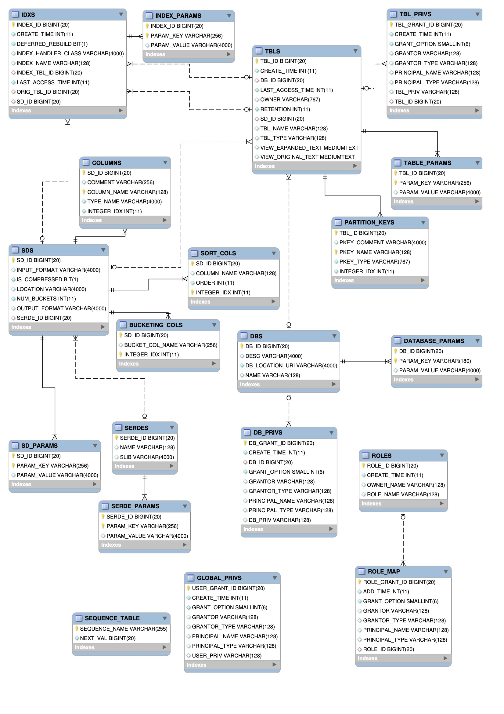

# HiveMetaStore

>All the metadata for Hive tables and partitions are accessed through the Hive Metastore. 

我们可以通过MetaStore访问Hive表和分区的元数据，由于元数据会频繁变化，所以不适合存储在HDFS中，一般存储在关系型数据库（RDBMS）中。

Hive存储元数据的三种模式：

- 内嵌模式（Embedded Metastore）

  默认的方式，使用内嵌的Derby数据库来存储元数据，Metastore服务和Hive service服务同时运行在JVM中，但是缺点是一次只能有一个连接，所以不适用于生产环境。

- 本地模式（Local Metastore）

  将元数据存储在独立的数据库中，支持多会话连接。之所以叫本地模式，是因为，Hive服务和Metastore服务还运行在同一个进程中。

- 远程模式（Remote Metastore）

  将元数据保存在独立的数据库中，这种模式下，Metastore不再和Hive在同一个JVM中，而是使用它自己的JVM。

如图所示：

## 结构

ER结构：

主要的表：

- DBS

  记录了数据库的信息

- FUNC

  存储了UDF的基本信息，一个UDF只能对应一个数据库

- DB_PRIVS

  存储该数据库相关的权限

- TBLS

  记录数据库对应的所有表的信息

- TB_PRIVS

  记录了该表的相关权限

- PARTITIONS

  分区信息

- SDS

  文件存储的基本信息

  | 表字段                    | 说明             | 示例数据                                                   |
  | ------------------------- | ---------------- | ---------------------------------------------------------- |
  | SD_ID                     | 存储信息ID       | 1                                                          |
  | CD_ID                     | 字段ID           | 对应CDS表                                                  |
  | INPUT_FORMAT              | 文件输入格式     | org.apache.hadoop.mapred.TextInputFormat                   |
  | IS_COMPRESSED             | 是否压缩         | 0                                                          |
  | IS_STOREDASSUBDIRECTORIES | 是否以子目录存储 | 0                                                          |
  | LOCATION                  | HDFS路径         | hdfs://HDFS84138/usr/hive/warehouse/t_ds_user              |
  | NUM_BUCKETS               | 分桶数量         | 0                                                          |
  | OUTPUT_FORMAT             | 文件输出格式     | org.apache.hadoop.hive.ql.io.HiveIgnoreKeyTextOutputFormat |
  | SERDE_ID                  | 序列化类ID       | 41，对应SERDES表                                           |

## References

1. https://cwiki.apache.org/confluence/display/Hive/AdminManual+Metastore+Administration
2. http://hadooptutorial.info/hive-metastore-configuration/
3. https://data-flair.training/blogs/apache-hive-metastore/