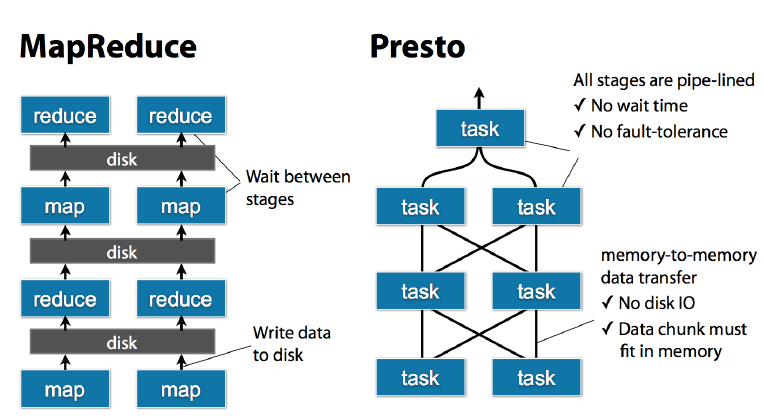

# Presto简介

Presto是一个由Facebook开源的大数据分布式SQL内存查询引擎。Presto本身并**不存储数据**，需要从其他数据源获取数据，允许查询Hive、Cassandra、关系型数据库等多种数据源，并且单个查询允许来自多个不同的数据源。

Facebook使用Presto对多个数据库的300PB数据进行交互式查询，每天超过1000名Facebook员工使用Presto运行30,000+次查询。

## Trino

由于创始团队与Facebook理念产生了偏差，并且Facebook注册了Presto商标，所以创始团队决定将Presto改名为[Trino](https://trino.io/)，详情[参见此](https://trino.io/blog/2020/12/27/announcing-trino.html)。

## Presto与Hive

Hive是一个基于HDFS数据库，具有分析和储存能力，相比Hive，查询效率要高很多，Hive作为数据源，结合Presto分布式查询引擎，这样查询计算速度就会快很多。

**为什么Presto查询速度比Hive快？**

- Presto是常驻任务，接受请求立即执行，全内存并行计算
- Hive需要用yarn做资源调度，接受查询需要先申请资源，启动进程，并且中间结果会经过磁盘

## 数据模型

Presto使用Catalog、Schema和Table这3层结构来管理数据。

例如：

`hive.test_data.test`将会寻找`hive` Catalog的`test_data` Schema的`test` table。

### Catalog

Catalog即数据源，可以通过下面语句查看Presto连接的所有数据源：

```
SHOW CATALOGS;
```

### Schema

当连接Hive或者MySql等关系型数据库的时候，Schema和Database的概念是相同的。

### Table

即关系型数据库中的表。



## References

1. presto官方文档：[Presto Documentation](https://prestodb.io/docs/current/index.html#index--page-root)
3. presto Github：[presto](https://github.com/prestodb/presto)
4. trino官方文章：[We’re rebranding PrestoSQL as Trino](https://trino.io/blog/2020/12/27/announcing-trino.html)
5. 博客：[Presto入门介绍](https://blog.csdn.net/cakexuexi/article/details/80820170)