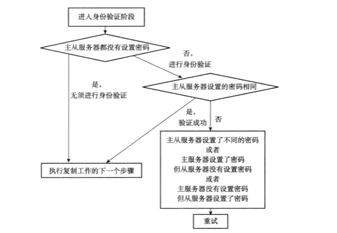

# Redi主从复制

分为同步和命令传播两个操作：

- 同步操作

  用于将从数据库状态初始化为与主服务器一致，从服务器向主服务器发送`SYNC`命令，然后主服务器执行`BGSAVE`，后台生成一个RDB文件，然后发送给从服务器，从服务器接收并载入。

- 命令传播

  用于在主服务器的数据库状态被修改的时候，保证从数据库与主数据库一致，当主服务器再此出现修改操作，会向从服务器发送该命令，从服务器执行。

### 新版优化

Redis2.8前，断线后采用完整重同步`SYNC`命令，导致效率较差，Redis2.8起，使用`PSYNC`命令来代替`SYNC`命令，此命令具有完整同步和部分重同步两种模式。

部分重同步下，主服务器可以将主从服务器连接断开期间执行的写命令发送给从服务器，从服务器只要接收并执行这些写命令，就可以将数据库更新至主服务器当前所处的状态。

### 复制的实现

向从服务器发送如下命令可以让从服务器去复制一个主服务器；

```
SLAVEOF 127.0.0.1 6379
```

此命令步骤如下：

1. 从服务器保存上述命令中主服务器的地址和端口

2. 建立套接字连接

   从服务器将建立套接字连接，在主服务器看来，从服务器是一个客户端。

   ```
   从服务器          套接字连接   主服务器
   127.0.0.1:12345 ——————————> 127.0.0.1:6379
   ```

3. 发送`PING`命令

   从服务器发送一个`PING`命令，如果得到`PONG`回复，则说明主从服务器之间的网络连接是正常的。

4. 身份验证

   

5. 发送端口信息

   从服务器将向主服务器发送监控12345端口命令。

6. 同步

   从服务器将向主服务器发送`PSYNC命令`。

7. 命令传播

   主服务器一致将自己执行的命令发送给从服务器，在命令传播阶段， 从服务器会以每秒一次的频率向主服务器发送命令，检测主从服务器的连接情况和命令丢失情况。

## References

1. 书籍：《Redis设计与实现》—— 黄健宏