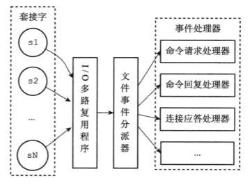

# Redis多路复用

## 单线程or多线程

- 3.x版本为单线程
- 4.x版本，增加了少部分的多线程处理（异步删除）
- 6.x版本，采用全新的多线程

## I/O多路复用

传统的阻塞IO在处理的socket需要进行I/O的时候，就会阻塞等待，导致整个线程不可用，I/O多路复用正是来解决这个问题的。

Redis服务器通过如下模型进行处理：

I/O多路复用程序可以同时监听多个socket，当这个事件产生的时候，发送给文件事件分派器进行处理。

Redis的I/O多路复用程序采用的是系统内核函数select、poll、epoll等，这些函数都是多路复用的实现，Redis会在编译时自动选择系统中性能最高的函数库来使用。

Redis通过I/O多路复用模块，实现了单线程运行的同时，服务成千上万个socket。

## References

1. 书籍：《Redis设计与实现》——黄健宏
2. 知乎文章：[Redis 和 I/O 多路复用](https://zhuanlan.zhihu.com/p/24252862)