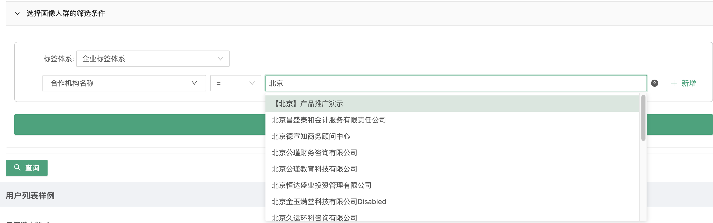
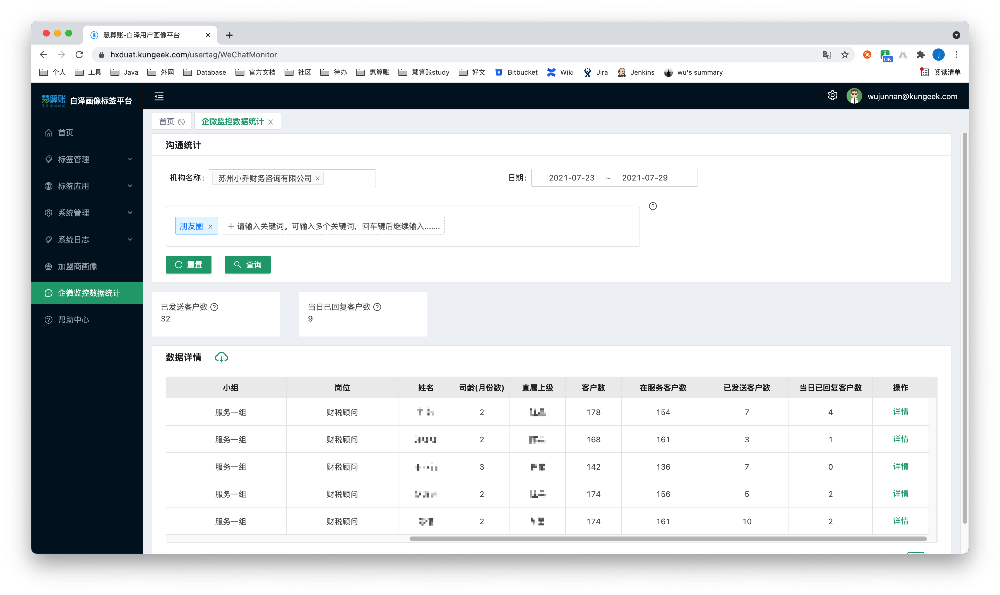

# Elasticsearch在生产中的应用

众所周知，ElasticSearch非常擅长全文搜索，正如其所说，You Know, for Search! 所以我们在生产中主要将其用作全文搜索。

当然，实际需求通常的多变的，通常需要我们搜索之后的内容进一步处理，这里主要基于聚合，丰富的聚合指标和聚合组合使得Elasticsearch同时具备分析能力。

本文从实际生产出发，结合案例，学习ElasticSearch，此文较详细，适合Elasticsearch入门。

## 基于collapse实现输入提示

### 需求

在企业信息宽表中，存储了海量的企业记录，每条记录即为一个企业，其中包括很多标签（即字段），需求是根据多个标签组合筛选条件，筛选出符合条件的企业，要求在输入筛选条件标签值的时候，下面会有提示词。

例如：标签为【合作机构名称】，然后选择一个运算符，后面是你期望的值，例如，输入北京，就从所有企业记录中找到包含北京的合作机构，并去重展示，如下图所示：



### 思路

首先我们需要搜索，即搜索出【合作机构类型】标签中包含【北京】关键词的所有记录

由于此场景要求：

- 分词后所有词项都要出现在该字段中
- 字段中的词项顺序要一致

那么这里搜索适合使用`match_phrase`，并使用其默认配置`slop=0`

这样以来含关键词的企业记录就被筛选出来了，下面就是进行所谓的去重操作。

在Elasticsearch5.3之前，我们会考虑使用`terms`聚合器，该聚合器类似mysql的`group by`，即根据【合作机构类型】字段进行分组，并返回key字段

此种方式的实现代码如下：

```json
post /cust_tag/_search
{
    "size": 0,
    "query":{
        "match_phrase":{
            "agency_name":"北京"
        }
    },
    "aggs":{
        "group_by_agency_name":{
            "terms":{
                "field":"agency_name.raw",
                "size":10
            }
        }
    }
}
```

在Elasticsearch5.3之后，Elasticsearch转为为此场景定制了`collapse`功能，此方式较上述方式效率更高，并且可以实现分页功能。

即在上述搜索之后直接根据此字段进行折叠

此种方式的实现代码如下：

```json
post /cust_tag/_search
{
    "size": 10,
    "from": 0,
    "_source": ["agency_name"],
    "query":{
        "match_phrase":{
            "agency_name":"北京"
        }
    },
    "collapse":{
        "field":"agency_name.raw"
    }
}
```

### 注意

由于此需求只返回聚合字段（即只要`agency_name`这个字段），`collapse`简洁的优势并未体现。

当我们需要聚合后的其他字段，甚至是聚合后的整条记录，那么单单使用Aggregations的`terms`就无法实现了，就必须嵌套`top hits`聚合器，来返回每一个聚合桶中的详细记录，但`collapse`就只需在`_source`中选择想要的其他列就可以了。

### 类似需求

假如我们是一个内容展示网站，网上可能存在大量复制粘贴，营销号搬运的内容，其中重复内容太多，我们需要对其进行折叠处理。

首先需要定义重复文章，这就需要算法同学根据一定规则对相关内容进行判定，增加一个重复id字段，那么我们在展示的时候，就可以根据这个id对搜索到的内容进行折叠，同一重复id的内容，只展示一份即可。

## 基于多重、嵌套Aggregations实现一次请求取回页面复杂指标

### 需求

Elasticsearch中已经存储了公司的员工和经过允许的公司的客户之间的聊天记录，我们想通过推广信息中包含的关键词，抓取聊天记录，获取该部门此次营销活动的不同员工的发送和客户的回复情况。

Elasticsearch中存储的为一条一条的聊天记录，即其他信息，其字段包括：

- 机构名称：`agency_name`
- 聊天内容：`content`
- 聊天时间：`chat_time`
- 好友微信id：`friend_wechat_id`
- 当日是否回复：`is_reply`
- 员工微信id：`staff_wechat_id`

我们需要通过【机构名称】【日期】【关键字】来圈出一批聊天记录，并通过聚合，得到

- 每一个员工的已发送客户数，当日已回复客户数
- 这些员工总的**去重**已发送数和当日已回复客户数

此部分如下图所示：



### 思路

- 首先还是搜索，根据关键词，所在机构，时间进行搜索，这里需要注意

  这里必定需要bool查询将这三个条件组合起来，但是对于不需要分词和需要分词的类型，需要分别处理，例如：

  - 机构名，需要精准查询，`terms`，那么这个需要放在bool查询的filter中，因为filter不会进行评分，效率更高
  - 时间范围，范围插叙，`range`，同样的，这也也需要放在bool查询的filter中
  - 关键字，这里是全文搜索，并且是`或`的关系，需要使用bool查询中的should中组合多个`match_phrase`，在filter之外

  此部分如下所示

  ```json
  "bool": {
    "should": [
      {
        "match_phrase": {
          "content": "朋友圈"
        }
      }
    ],
    "filter": [
      {
        "range": {
          "chat_time": {
            "gte": "2021-07-23 00:00:00",
            "lte": "2021-07-29 00:00:00"
          }
        }
      },
      {
        "terms": {
          "agency_name": [
            "苏州小乔财务咨询有限公司"
          ]
        }
      }
    ],
    "minimum_should_match": 1
  }
  ```

- 搜索完成之后，要对指标进行聚合

  - 首先是圈到的这些人的【总已发送客户数】

    我们通过`friend_wechat_id`字段进行去重统计即可

    ```json
    "aggs": {
      "all_customer_sent_message_num": {
        "cardinality": {
          "field": "friend_wechat_id"
        }
      }
    }
    ```

  - 其次是已回复数

    首先通过filter聚合器对当日已回复的人进行过滤，然后跟上面一样，通过`friend_wechat_id`字段进行去重统计即可

    ```json
    "all_customer_is_reply_num": {
      "filter": {
        "term": {
          "is_reply": "1"
        }
      },
      "aggs": {
        "all_customer_is_reply_num_sub": {
          "cardinality": {
            "field": "friend_wechat_id"
          }
        }
      }
    }
    ```

  - 最后是每个员工的已发送数和已回复数

    跟上述思路一样，只不过前面加了一步，先根据员工id进行分组，得到的桶就是每个员工的 聊天记录，每个桶内再进行聚合，即重复上述两个步骤

    ```json
    "all_staff_id_list": {
      "terms": {
        "field": "staff_id",
        "size": 2147483647
      },
      "aggs": {
        "customer_is_reply_num": {
          "filter": {
            "term": {
              "is_reply": "1"
            }
          },
          "aggs": {
            "customer_is_reply_num_sub": {
              "cardinality": {
                "field": "friend_wechat_id"
              }
            }
          }
        },
        "customer_sent_message_num": {
          "cardinality": {
            "field": "friend_wechat_id"
          }
        }
      }
    }
    ```

至于有朋友会问，为啥要在一个请求中完成呢？

这里一次计算了多个聚合指标，是由于，这几个指标都是基于根据条件所圈出的同一波人进行分析的，没有必要进行多次圈人操作，而且多次IO也会造成时间前端等待变长。

### 完整请求

```json
post wechat_chat_transcript/_search
{
    "size": 0,
    "query": {
        "bool": {
            "should": [
                {
                    "match_phrase": {
                        "content": "朋友圈"
                    }
                }
            ],
            "filter": [
                {
                    "range": {
                        "chat_time": {
                            "gte": "2021-07-23 00:00:00",
                            "lte": "2021-07-29 00:00:00"
                        }
                    }
                },
                {
                    "terms": {
                        "agency_name": [
                            "苏州小乔财务咨询有限公司"
                        ]
                    }
                }
            ],
            "minimum_should_match": 1
        }
    },
    "aggs": {
        "all_staff_id_list": {
            "terms": {
                "field": "staff_id",
                "size": 1000
            },
            "aggs": {
                "customer_is_reply_num": {
                    "filter": {
                        "term": {
                            "is_reply": "1"
                        }
                    },
                    "aggs": {
                        "customer_is_reply_num_sub": {
                            "cardinality": {
                                "field": "friend_wechat_id"
                            }
                        }
                    }
                },
                "customer_sent_message_num": {
                    "cardinality": {
                        "field": "friend_wechat_id"
                    }
                }
            }
        },
        "all_customer_sent_message_num": {
            "cardinality": {
                "field": "friend_wechat_id"
            }
        },
        "all_customer_is_reply_num": {
            "filter": {
                "term": {
                    "is_reply": "1"
                }
            },
            "aggs": {
                "all_customer_is_reply_num_sub": {
                    "cardinality": {
                        "field": "friend_wechat_id"
                    }
                }
            }
        }
    }
}
```

### Java代码

由于此请求存在两层聚合嵌套，维护此方法时，建议将本方法中的打印语句JSON格式化一下，构建的请求便可一目了然

```java
public WechatMonitorVO queryWeChatMonitorStaffList(WechatMonitorVO wechatMonitorVO) throws IOException {
        buildClient();
        SearchRequest request = new SearchRequest(INDEX_WECHAT_CHAT_TRANSCRIPTS);
        SearchSourceBuilder searchSourceBuilder = new SearchSourceBuilder();
        searchSourceBuilder.size(0);
        //构建查询体
        BoolQueryBuilder queryBuilder = QueryBuilders.boolQuery();
        queryBuilder.minimumShouldMatch(1);
        queryBuilder.filter((QueryBuilders.rangeQuery(FIELD_CHAT_TIME)
                             .gte(wechatMonitorVO.getStartTime())
                             .lte(wechatMonitorVO.getEndTime())
                             .format(DATE_FORMAT)));
        if (!wechatMonitorVO.getAgencyNameList().isEmpty()) {
            queryBuilder.filter(QueryBuilders.termsQuery(FIELD_AGENCY_NAME, wechatMonitorVO.getAgencyNameList()));
        }
        for (String keyword : wechatMonitorVO.getKeyWordList()) {
            queryBuilder.should(QueryBuilders.matchPhraseQuery(FIELD_CONTENT, keyword));
        }
        //构建三个集合体
        //1 聚合出员工列表及其子聚合：每个员工的已回复数和已发送客户数
        TermsAggregationBuilder allStaffIdAggs = AggregationBuilders.terms(ALL_STAFF_ID_LIST_AGGS).field(FIELD_STAFF_ID).size(Integer.MAX_VALUE);
        //1.1 每个员工的已回复数
        FilterAggregationBuilder customerIsReplyNumAggs = AggregationBuilders.filter(CUSTOMER_IS_REPLY_NUM_AGGS, QueryBuilders.termQuery(FIELD_IS_REPLY, "1"));
        CardinalityAggregationBuilder sumOfIsReplySubAggs = AggregationBuilders.cardinality(CUSTOMER_IS_REPLY_NUM_SUB_AGGS).field(FIELD_FRIEND_WECHAT_ID);
        //1.2 每个员工的已发送数
        CardinalityAggregationBuilder customerSentMessageNumAggs = AggregationBuilders.cardinality(CUSTOMER_SENT_MESSAGE_NUM_AGGS).field(FIELD_FRIEND_WECHAT_ID);
        customerIsReplyNumAggs.subAggregation(sumOfIsReplySubAggs);
        allStaffIdAggs.subAggregation(customerIsReplyNumAggs).subAggregation(customerSentMessageNumAggs);
        //2 聚合出已发送客户数
        CardinalityAggregationBuilder allCustomerSentMessageNumAggs = AggregationBuilders.cardinality(ALL_CUSTOMER_SENT_MESSAGE_NUM_AGGS).field(FIELD_FRIEND_WECHAT_ID);
        //3 聚合出已回复客户数
        FilterAggregationBuilder allCustomerIsReplyNumAggs = AggregationBuilders.filter(ALL_CUSTOMER_IS_REPLY_NUM_AGGS, QueryBuilders.termQuery(FIELD_IS_REPLY, "1"));
        CardinalityAggregationBuilder allSumOfIsReplySubAggs = AggregationBuilders.cardinality(ALL_CUSTOMER_IS_REPLY_NUM_SUB_AGGS).field(FIELD_FRIEND_WECHAT_ID);
        allCustomerIsReplyNumAggs.subAggregation(allSumOfIsReplySubAggs);
        searchSourceBuilder.query(queryBuilder).aggregation(allStaffIdAggs)
          .aggregation(allCustomerSentMessageNumAggs)
          .aggregation(allCustomerIsReplyNumAggs);
        request.source(searchSourceBuilder);
        log.info("ES的请求体条件为:\n{}", searchSourceBuilder.toString());
        SearchResponse response = restHighLevelClient.search(request, RequestOptions.DEFAULT);
        Map<String, Aggregation> aggregationMap = response.getAggregations().getAsMap();
        List<? extends Terms.Bucket> buckets = ((ParsedTerms) aggregationMap.get(ALL_STAFF_ID_LIST_AGGS)).getBuckets();
        List<StaffVO> staffVOS = buckets.stream().map(item -> {
            ParsedCardinality customerSentMessageNum = (ParsedCardinality) item.getAggregations().getAsMap().get(CUSTOMER_SENT_MESSAGE_NUM_AGGS);
            long customerSentMessageSubAggsValue = customerSentMessageNum.getValue();
            ParsedFilter parsedFilter = (ParsedFilter) item.getAggregations().getAsMap().get(CUSTOMER_IS_REPLY_NUM_AGGS);
            long isReplyNum = 0;
            if (null != parsedFilter) {
                isReplyNum = ((ParsedCardinality) parsedFilter.getAggregations().getAsMap().get(CUSTOMER_IS_REPLY_NUM_SUB_AGGS)).getValue();
            }
            return StaffVO.builder().staffId((String) item.getKey()).replyNumberInThatDay(isReplyNum).customerSentMesNumber(customerSentMessageSubAggsValue).build();
        }).collect(Collectors.toList());
        //获取聚合结果中的总员工VO列表
        wechatMonitorVO.setStaffVOList(staffVOS);
        wechatMonitorVO.setAllCustomerSentMesNumber(((ParsedCardinality) aggregationMap.get(ALL_CUSTOMER_SENT_MESSAGE_NUM_AGGS)).getValue());
        wechatMonitorVO.setAllReplyNumberThatDay(((ParsedCardinality) (((ParsedFilter) aggregationMap.get(ALL_CUSTOMER_IS_REPLY_NUM_AGGS)).getAggregations().getAsMap().get(ALL_CUSTOMER_IS_REPLY_NUM_SUB_AGGS))).getValue());
        return wechatMonitorVO;
    }
```

