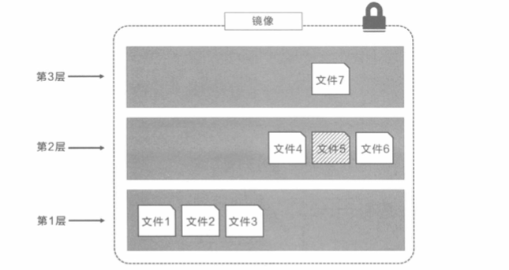

# Docker

## 什么是Docker

Docker 是一个基于Go语言实现的开源容器项目，Docker的构想是"Build, Ship and Run Any App, Anywhere"，即通过对应用的封装，分发，部署，运行生命周期进行管理，达到应用组件级别的"一次封装，到处运行"。

Docker可以理解为一种轻量级的沙盒，每个容器内运行着一个应用，不同的容器相互隔离，容器之间也可以通过网络相互通信。容器的创建和停止十分迅速，几乎和创建和终止原生应用一致，容器自身对系统资源的额外需求也十分有限，远低于传统虚拟机，很多时候可以直接把容器当成应用本身。

## Docker核心概念

Docker三大核心概念:

- Docker镜像（Image）

  可以理解为一个只读的模板，例如一个Apache镜像包含了一个基本的操作系统环境，里面仅安装了Apache应用程序。

- Docker容器（Container）

  容器是从镜像创建的应用实例，它可以启动、开始、停止、删除，这些容器都是相互隔离，互不可见的。

- Docker仓库（Repository）

  仓库是Docker集中存放镜像文件的场所。

  根据所存储的镜像公开分享与否，Docker仓库可以分为公开仓库和私有仓库，最大的公开仓库是官方提供的Docker Hub，用户也可以在本地网络内创建一个只能自己访问的私有仓库。

## Docker镜像

### 为什么镜像这么小

镜像大小由以下部分构成：

- 基础镜像

- COPY内容

  Dockerfile中的COPY/ADD是直接将文件复制进镜像中，所以镜像大小包括此部分的大小。

- RUN内容

  每个RUN指令都会新生成一层镜像，如果只是纯指令，则不占用大小，如果是会产生文件的指令，则产生的结果文件也计入镜像大小。

镜像小的原因如下：

- **镜像不包括内核**，容器都是共享的，容器都是共享所在Docker主机的内核

  Linux操作系统分别由两部分组成：

  - 内核空间（kernel）

    Linux刚启动时会加载bootfs文件系统，之后bootfs会被卸载掉。

  - 用户空间（rootfs）

    用户空间的文件系统是rootfs，包含常见的目录，如`/dev`、`/proc`、`/bin`、`/etc`等等。

  通过`docker pull centos`命令下载镜像，实质上下载CentOS操作系统的rootfs，因此Docker下载的镜像大小只有200M。

- **Docker镜像是精简的**，删除了不必要的模块，例如只有一个精简Shell

### 镜像分层

Docker镜像由一些松耦合的只读镜像层组成。

通过`docker image inspect`命令可以查看一个镜像的分层。

所有的Docker都起始于一个基础镜像层，当修改或者增加新的内容的时候，就会在当前镜像层之上，创建新的镜像层。

三层镜像示意图如下所示：



其中文件7是文件5的更新版本，Docker是通过存储引擎来实现的，例如Linux可用的存储引擎是Overlay2等，通此种方式，对外提供统一的视图。

当我们拉取镜像的时候，会发现，有的镜像层后面提示Already exists，这意味着Docker在拉取镜像之前，会查看该镜像层在本地是否存在，不同的镜像之间是可以共享镜像层的。

镜像分层还有个好处就是在push的时候，**只需要push独有的镜像层即可**，不需要仓库中已有的镜像层。

### 镜像摘要

当同一个标签的镜像出现了bug，重新推送之后，如何分辨是修复前还是修复后的呢，这里就需要镜像摘要了。每一个镜像都有一个散列值，当镜像内容变化的时候，该散列值也会变化。

## Docker数据卷

数据卷（Docker Volumes）是一个可供容器使用的特殊目录，它将宿主机目录直接映射进容器，类似Linux的mount行为。

- 数据卷可以在容器之间共享和重用，容器间传递数据将变得高效与方便
- 对数据卷的修改会马上生效，无论是容器内操作还是宿主机操作
- 对数据卷的更新不会影响镜像，应用和数据上解耦的

可以通过volume子命令来管理数据卷：

```
$ docker volume create -d local test
```

此时，在`/var/lib/docker/volumes`路径下，会发现所创建的数据卷test。

查看所有数据卷：

```
$ docker volume ls
```

查看某个数据卷的详细信息：

```
$ docker volume inspect myvolume
```

还可以在创建容器的时候来绑定数据卷，通过`docker run -mount`选项来使用数据卷：

`-mount`选项支持三种类型的数据卷，包括：

- volume

  普通数据卷，映射到主机`/var/lib/docker/volumes`路径下。

- bind

  绑定数据卷，映射到主机指定路径下。

- tmpfs

  临时数据卷，只存在于内存中。

例如：

使用`training/webapp`镜像创建一个Web容器，并创建一个数据卷挂载到容器的`/opt/webapp`目录：

```
$ docker run -d -P --name web --mount type=bind,source=/webapp,destination=/opt/webapp training/webapp python app.py
```

等同于：

```
$ docker run -d -P --name web -v /webapp:/opt/webapp training/webapp python app.py
```

注意：

- `-v`左侧是宿主机目录，右边是容器内目录。
- 本地目录的路径必须是绝对路径，容器内路径可以为相对路径，如果宿主目录不存在，Docker会自动创建。
- 如果没有指定宿主机目录，那么将自动在`/var/lib/docker/volumes`下创建随机目录
- 如果宿主机上指定为相对路径，例如`test`，那么也会在`/var/lib/docker/volumes`下创建test目录

## Docker网络


## References

1. 《深入浅出Docker》
