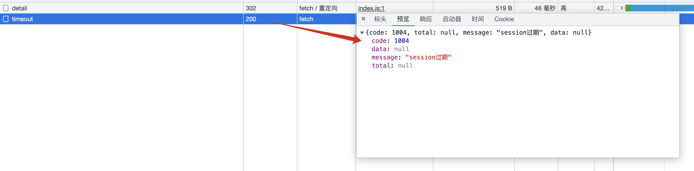

# Spring Security Session

Spring Security中提供了session配置管理，包括session无效处理，session并发控制，session过期处理等。

## Session过期时间

默认半个小时，最小60秒

```
server.servlet.session.timeout=1m
```

## Session相关配置

`http.sessionManagement()`相关方法

- `invalidSessionUrl(String invalidSessionUrl)`：指定会话失效时（请求携带无效的 JSESSIONID 访问系统）重定向的 URL，默认重定向到登录页面。
- `invalidSessionStrategy(InvalidSessionStrategy invalidSessionStrategy)`：指定会话失效时（请求携带无效的 JSESSIONID 访问系统）的处理策略。
- `maximumSessions(int maximumSessions)`：指定每个用户的最大并发会话数量，-1 表示不限数量。
- `maxSessionsPreventsLogin(boolean maxSessionsPreventsLogin)`：如果设置为 true，表示某用户达到最大会话并发数后，新会话请求会被拒绝登录；如果设置为 false，表示某用户达到最大会话并发数后，新会话请求访问时，其最老会话会在下一次请求时失效并根据 expiredUrl() 或者 expiredSessionStrategy() 方法配置的会话失效策略进行处理，默认值为 false。
- `expiredUrl(String expiredUrl)`：如果某用户达到最大会话并发数后，新会话请求访问时，其最老会话会在下一次请求时失效并重定向到 expiredUrl。
- `expiredSessionStrategy(SessionInformationExpiredStrategy expiredSessionStrategy)`：如果某用户达到最大会话并发数后，新会话请求访问时，其最老会话会在下一次请求中失效并按照该策略处理请求。注意如果本方法与 expiredUrl() 同时使用，优先使用 expiredUrl() 的配置。
- `sessionRegistry(SessionRegistry sessionRegistry)`：设置所要使用的 sessionRegistry，默认配置的是 SessionRegistryImpl 实现类。

## SessionManagementFilter

该过滤器的作用是：

1. 

核心过滤器类为SessionManagementFilter

```java
private void doFilter(HttpServletRequest request, HttpServletResponse response, FilterChain chain)
      throws IOException, ServletException {
   //避免重复执行
   if (request.getAttribute(FILTER_APPLIED) != null) {
      chain.doFilter(request, response);
      return;
   }
   request.setAttribute(FILTER_APPLIED, Boolean.TRUE);
   //判断repo中是否未存储过同一session id请求，存过的话，则跳过
   if (!this.securityContextRepository.containsContext(request)) {
      Authentication authentication = SecurityContextHolder.getContext().getAuthentication();
       //身份非空，且不是匿名认证
      if (authentication != null && !this.trustResolver.isAnonymous(authentication)) {
         try {
            //进行Session的校验，是否超过最大限制数
            this.sessionAuthenticationStrategy.onAuthentication(authentication, request, response);
         }
         catch (SessionAuthenticationException ex) {
            SecurityContextHolder.clearContext();
            this.failureHandler.onAuthenticationFailure(request, response, ex);
            return;
         }
         //将身份信息存储到session
         this.securityContextRepository.saveContext(SecurityContextHolder.getContext(), request, response);
      }
      // 用户未登录
      else {
         // cookie中sessionId不为空，且失效，则走session失效策略
         if (request.getRequestedSessionId() != null && !request.isRequestedSessionIdValid()) {
            if (this.invalidSessionStrategy != null) {
               this.invalidSessionStrategy.onInvalidSessionDetected(request, response);
               return;
            }
         }
         // sessionId为空或session未失效，则走下一个过滤器
      }
   }
   chain.doFilter(request, response);
}
```

## Session无效处理

Spring Security在Session无效可以采用两种策略

- 重定向
- 自定义策略

### 重定向

**SecurityConfig**

```java
http.authorizeRequests()
	.antMatchers("/api/user/session/timeout").permitAll()
	.sessionManagement().invalidSessionUrl("/api/user/session/timeout").and();
```

默认实现为`SimpleRedirectInvalidSessionStrategy`。

**Controller**

```java
@RestController
@RequestMapping("/api/user")
public class UserController {
    @GetMapping("/session/timeout")
    public Object sessionTimeout() {
        HttpServletRequest request = ((ServletRequestAttributes) RequestContextHolder.currentRequestAttributes()).getRequest();
        HttpSession session = request.getSession();
        System.out.println("session: " + session.getMaxInactiveInterval());
        return new ApiResult(ErrorCode.SESSION_TIMEOUT, "session过期");
    }
}
```

**效果**

当session失效后访问后端需认证链接，会302重定向到`/api/user/session/timeout`。



### 自定义策略

**SecurityConfig**

```java
http.authorizeRequests()
	.sessionManagement().invalidSessionStrategy(new MyInvalidSessionStrategy()).and();
```

**MyInvalidSessionStrategy**

```java
public class MyInvalidSessionStrategy implements InvalidSessionStrategy {

    @Override
    public void onInvalidSessionDetected(HttpServletRequest request, HttpServletResponse response) throws IOException {
        //清空前端的cookie,避免后续的请求跳转到这里
        Cookie cookie = new Cookie("JSESSIONID", null);
        cookie.setMaxAge(0);
        cookie.setPath(request.getContextPath());
        response.addCookie(cookie);
        response.setContentType("application/json;charset=utf-8");
        ApiResult resultVO = new ApiResult(ErrorCode.SESSION_TIMEOUT, "session过期！");
        response.getWriter().write(new JSONObject(resultVO).toString());
    }

}
```

**效果**

当session失效后访问后端需认证链接，会直接返回上述JSON。

## Session固定攻击

session固定攻击是指恶意攻击者先通过访问应用来创建一个session，然后再让其他用户使用相同的session进行登录（比如通过发送一个包含该sessionId参数的链接），待其他用户成功登录后，攻击者利用原来的sessionId访问系统将和原用户获得同样的权限。

Spring Security默认是对session固定攻击采取了保护措施的，它会在用户登录的时候重新为其生成一个新的session。如果你的应用不需要这种保护或者该保护措施与你的某些需求相冲突，你可以通过session-management的session-fixation-protection属性来改变其保护策略。

- `none`

  用户登录后session不变

- `newSession`

  用户登录后使用新的session

- `migrateSession`

  用户登录后创建新的session，但是会将旧的session中的数据复制到新的session中

- `changeSessionId`

  不创建新的会话，而是使用selert容器提供的会话固定保护，每次登录访问之后都更换sessionid，但是没有新建session会话。**默认启动此策略**

```
 http.sessionManagement().sessionFixation().changeSessionId(); 
```

## Refereces

1. https://www.cnblogs.com/zongmin/p/13783348.html
