# CAS-Shiro实现单点登录

## SSO-单点登录

SSO (Single sign-on) ，即单点登录，含义就是当你登录了一个信任体系下的任意一个系统，你不用再次登录就可以访问信任体系下的其他系统。

## CAS

CAS (Central Authentication Service) ，CAS是Yale大学2000-2002开发的单点登录协议，并在2004年交由JASIG (Java in Administration Special Interest Group) 管理。

## Shiro

Apache shiro项目是一个Java安全框架，它提供了认证，授权，密码和session的管理，支持配合CAS服务使用。

[详见官方文档](https://shiro.apache.org/documentation.html)

## 认证

Shiro为了与CAS进行整合，提供了CasRealm实现类，其已经对AuthozingRealm抽象类声明的doGetAuthenticationInfo(AuthenticationToken token)、doGetAuthorizationInfo(PrincipalCollection principals)方法进行实现。

```java
/**
AuthenticationToken的Credential是ticket，而返回的AuthenticationInfo的Credential仍是ticket，之间仅经过一层ticket校验，并不需要经过分子系统的数据库校验，因为在CAS服务端进行认证时已经经过一次全局的数据库校验。
**/
protected AuthenticationInfo doGetAuthenticationInfo(AuthenticationToken token) throws AuthenticationException {
    //CasToken是AuthenticationToken的实现类,其principal为null,credential为ticket.
    CasToken casToken = (CasToken) token;
    if (token == null) {
        return null;
    }

    String ticket = (String)casToken.getCredentials();
    if (!StringUtils.hasText(ticket)) {
        return null;
    }

    //ticket检验器
    TicketValidator ticketValidator = ensureTicketValidator();

    try {
        // 去CAS服务端中验证ticket的合法性并获取用户名进行补全
        Assertion casAssertion = ticketValidator.validate(ticket, getCasService());
        // 从CAS服务端中获取相关属性,包括用户名、是否设置RememberMe等
        AttributePrincipal casPrincipal = casAssertion.getPrincipal();
        String userId = casPrincipal.getName();
        log.debug("Validate ticket : {} in CAS server : {} to retrieve user : {}", new Object[]{
            ticket, getCasServerUrlPrefix(), userId
        });

        Map<String, Object> attributes = casPrincipal.getAttributes();
        // refresh authentication token (user id + remember me)
        casToken.setUserId(userId);
        String rememberMeAttributeName = getRememberMeAttributeName();
        String rememberMeStringValue = (String)attributes.get(rememberMeAttributeName);
        boolean isRemembered = rememberMeStringValue != null && Boolean.parseBoolean(rememberMeStringValue);
        if (isRemembered) {
            casToken.setRememberMe(true);
        }
        // 最终创建SimpleAuthencationInfo实体返回给SecurityManager
        List<Object> principals = CollectionUtils.asList(userId, attributes);
        PrincipalCollection principalCollection = new SimplePrincipalCollection(principals, getName());
        return new SimpleAuthenticationInfo(principalCollection, ticket);
    } catch (TicketValidationException e) { 
        throw new CasAuthenticationException("Unable to validate ticket [" + ticket + "]", e);
    }
}
```

### 重写doGetAuthenticationInfo

```java
/**
     * CAS认证 ,验证用户身份
     * 将用户基本信息设置到会话中
     */
protected AuthenticationInfo doGetAuthenticationInfo(AuthenticationToken token) {
    //调用CasRealm实现的认证方法,其包含验证ticket、填充CasToken的principal等操作)
    AuthenticationInfo authc = super.doGetAuthenticationInfo(token);
    String username = (String) authc.getPrincipals().getPrimaryPrincipal();
    User user = userService.findByUsername(username);
    if (user != null) {
        //黑名单限制
        if (Global.NO.equals(user.getLoginFlag())) {
            throw new AuthenticationException("msg:该帐号禁止登录");
        }
        //将用户信息放在session
        SecurityUtils.getSubject().getSession().setAttribute("user", user);
        return authc;
    } else {
        return null;
    }
}
```

## 授权

doGetAuthorizationInfo

```java
protected AuthorizationInfo doGetAuthorizationInfo(PrincipalCollection principals) {
    // 恢复用户信息
    SimplePrincipalCollection principalCollection = (SimplePrincipalCollection) principals;
    List<Object> listPrincipals = principalCollection.asList();
    Map<String, String> attributes = (Map<String, String>) listPrincipals.get(1);

    SimpleAuthorizationInfo simpleAuthorizationInfo = new SimpleAuthorizationInfo();
    // 为用户添加默认的角色
    addRoles(simpleAuthorizationInfo, split(defaultRoles));
    // 为用户添加默认的行为
    addPermissions(simpleAuthorizationInfo, split(defaultPermissions));
    // 为用户添加预设置的角色
    List<String> attributeNames = split(roleAttributeNames);
    for (String attributeName : attributeNames) {
        String value = attributes.get(attributeName);
        addRoles(simpleAuthorizationInfo, split(value));
    }
    // 为用户添加预设置的行为
    attributeNames = split(permissionAttributeNames);
    for (String attributeName : attributeNames) {
        String value = attributes.get(attributeName);
        addPermissions(simpleAuthorizationInfo, split(value));
    }
    return simpleAuthorizationInfo;
}
```

CasRealm实现的doGetAuthorizationInfo方法仅仅是为用户添加默认和预定义的角色与行为，并不符合实际的应用场景，因此也需要进行自定义。

### 重写doGetAuthorizationInfo

```java
/**
     * 设置角色和权限信息
     */
@Override
protected AuthorizationInfo doGetAuthorizationInfo(PrincipalCollection principals) {
    String username = (String) principals.getPrimaryPrincipal();
    User user = userService.findByUsername(username);
    if (user != null) {
        SimpleAuthorizationInfo authorizationInfo = new SimpleAuthorizationInfo();
        //获取用户拥有的角色
        List<Role> roles = roleService.findByUserId(user.getId());
        for (Role role : roles) {
            authorizationInfo.addRole(role.getEnname());
            //获取用户拥有的权限
            List<Menu> menus = menuService.findByRoleId(role.getId());
            for(Menu menu : menus){
                if(StringUtils.isNotBlank(menu.getPermission())){
                    authorizationInfo.addStringPermission(menu.getPermission());
                }
            }
        }

        return authorizationInfo;
    } else {
        return null;
    }
}
```

## 登录流程

1. 访问 `http://localhost/analysis`

   请求会被ngixn如下配置拦截

   ```nginx
   location /analysis/ {
       root   D:\work\dist;
       index  index.html index.htm;
       try_files $uri $uri/ /analysis/index.html;
       add_header Cache-Control "max-age=0";
       # add_header Cache-Control "no-cache";
   }
   ```

   最后会定位到 `/analysis/index.html`

   接着会请求一系列静态资源，也走nginx的该配置

2. 其中的一个js会首先发起异步调用

   `/data-web/user/detail?dataplatformCode=analysis`

   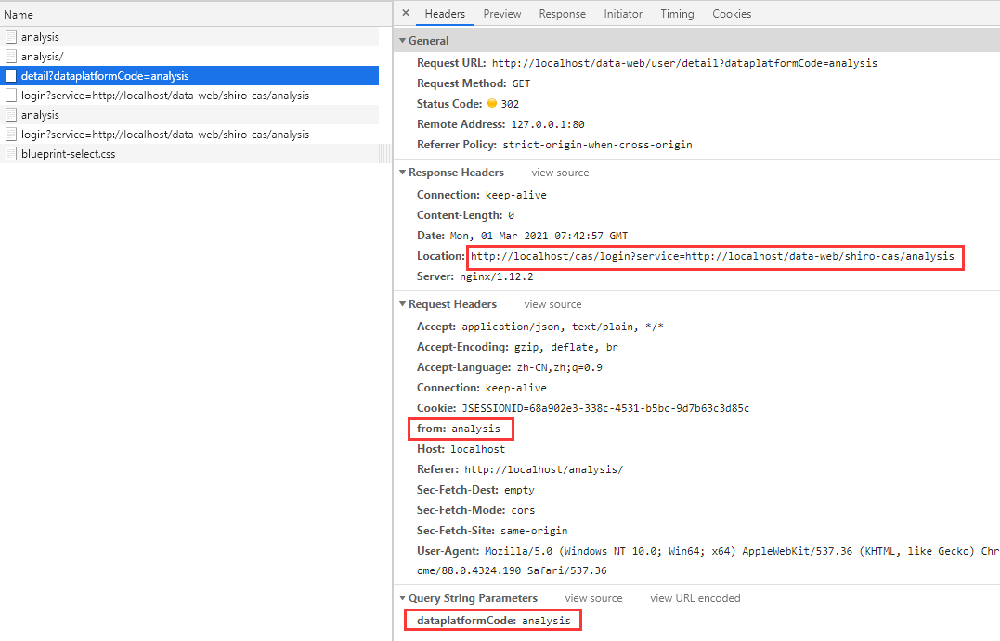

   这个时候，会被nginx的如下配置拦截

   ```nginx
   location /data-web/ {
       proxy_pass http://localhost:9010;
   }
   ```

   请求会被ngixn转发到后端，会被后端的认证拦截器拦截

   ```java
   filterChainDefinitionMap.put("/**", "formAuthenticationRewriteFilter");
   ```

   该过滤器父类中有如下方法

   ```java
   //AccessControlFilter
   public boolean onPreHandle(ServletRequest request, ServletResponse response, Object mappedValue) throws Exception {
       return isAccessAllowed(request, response, mappedValue) || onAccessDenied(request, response, mappedValue);
   }
   ```

   ```java
   //查看当前用户是否是已登录状态
   protected boolean isAccessAllowed(ServletRequest request, ServletResponse response, Object mappedValue) {
       Subject subject = getSubject(request, response);
       return subject.isAuthenticated();
   }
   ```

   ```java
   //不是登录状态则执行下面的方法
   onAccessDenied()
   ```

   ```java
   //访问的不是登录的URL的情况下，重定向到对应的登录URL
   redirectToLogin(ServletRequest request, ServletResponse response)
   ```

   我们重写了redirectToLogin方法，里面会判断来自哪个平台，然后重定向到对应的平台

   例如我们访问的是user/detail请求头携带的有form参数，就判断出是analysis平台，然后这里重定向到

   `http://localhost/cas/login?service=http://localhost/data-web/shiro-cas/analysis`

   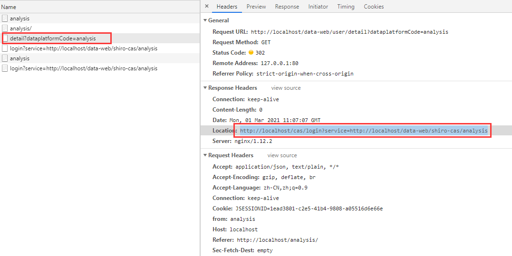

3. 输入账号密码进行登录

   - 如果密码错误，那么CAS服务端直接会返回错误界面

     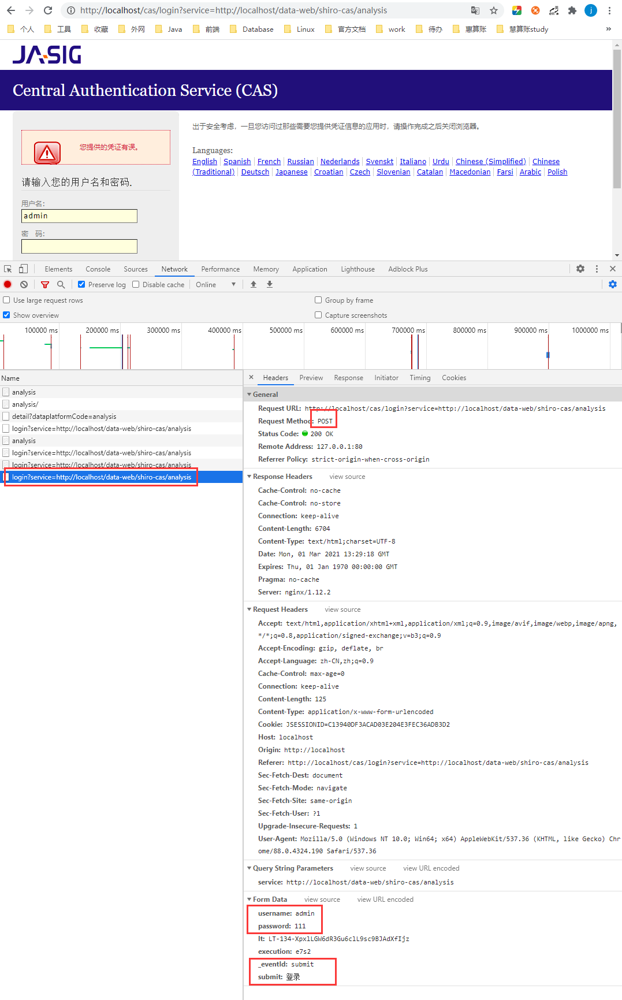

   - 输入正确密码

     登录成功就CAS server就会重定向到之前的service参数

     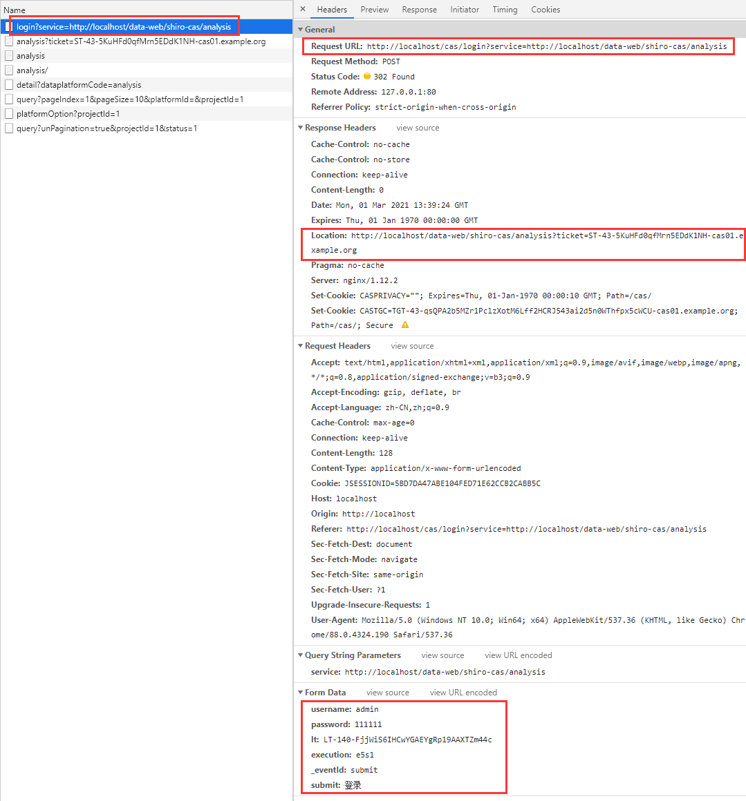

4. 后端ticket校验

   访问`http://localhost/data-web/shiro-cas/analysis?ticket=ST-43-5KuHFd0qfMrn5EDdK1NH-cas01.example.org`  到后端进行ticket校验

   - 当后端接受到该请求，所有请求都会到达AccessControllerFilterd的onPreHandle()方法，判断现在是否是登录状态

     ```java
     public boolean onPreHandle(ServletRequest request, ServletResponse response, Object mappedValue) throws Exception {
         return isAccessAllowed(request, response, mappedValue) || onAccessDenied(request, response, mappedValue);
     }
     ```

   - 现在是未登录状态，那么就执行DataWebTicketFilter.java的

     ```java
     @Override
     protected boolean onAccessDenied(ServletRequest request, ServletResponse response) throws Exception {
         return executeLogin(request, response);
     }
     ```

   - AuthenticatingFilter的executeLogin

     ```java
     protected boolean executeLogin(ServletRequest request, ServletResponse response) throws Exception {
         //
         AuthenticationToken token = createToken(request, response);
         if (token == null) {
             String msg = "createToken method implementation returned null. A valid non-null AuthenticationToken " +
                 "must be created in order to execute a login attempt.";
             throw new IllegalStateException(msg);
         }
         try {
             Subject subject = getSubject(request, response);
             subject.login(token);
             return onLoginSuccess(token, subject, request, response);
         } catch (AuthenticationException e) {
             return onLoginFailure(token, e, request, response);
         }
     }
     ```

     - 然后到DataWebTicketFilter的createToken

       ```java
       @Override
       protected AuthenticationToken createToken(ServletRequest request, ServletResponse response) throws Exception {
           HttpServletRequest httpRequest = (HttpServletRequest) request;
           String uri = httpRequest.getRequestURI();
           String ticket = httpRequest.getParameter(TICKET_PARAMETER);
           if (uri.contains(DataplatformCodeEnum.USERTAG)) {
               return new DataWebCasToken(ticket, DataplatformCodeEnum.USERTAG);
           } else {
               return new DataWebCasToken(ticket, DataplatformCodeEnum.USERANALYSIS);
           }
       }
       ```

       最后得到token，这是我们封装的token，里面有ticket和from参数

       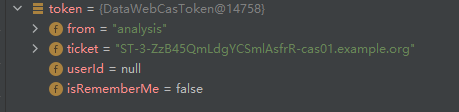

     - subject.login(token);

       最后会到达我们的CasShiroRealm的doGetAuthenticationInfo()，内有如下方法：

       AuthenticationInfo authc = validTicket(token);

     - ticketValidator.validate(ticket, service)

       ```java
       private AuthenticationInfo validTicket(AuthenticationToken token) throws AuthenticationException {
           DataWebCasToken casToken = (DataWebCasToken) token;
           if (token == null) {
               return null;
           }
           String ticket = (String) casToken.getCredentials();
           if (!StringUtils.hasText(ticket)) {
               return null;
           }
           TicketValidator ticketValidator = ensureTicketValidator();
           String service;
           if (DataplatformCodeEnum.USERTAG.equals(casToken.getFrom())){
               service = ShiroConfiguration.USERTAG_TICKET_SERVICE;
           }else if (DataplatformCodeEnum.USERANALYSIS.equals(casToken.getFrom())){
               service = ShiroConfiguration.ANALYSIS_TICKET_SERVICE;
           }else {
               service = ShiroConfiguration.DAP_TICKET_SERVICE;
           }
           try {
               // contact CAS server to validate service ticket
               // 根据token来源不同，选择不同的cas server ticket验证路径
               Assertion casAssertion = ticketValidator.validate(ticket,service);
               // get principal, user id and attributes
               AttributePrincipal casPrincipal = casAssertion.getPrincipal();
               String userId = casPrincipal.getName();
               Map<String, Object> attributes = casPrincipal.getAttributes();
               // 设置token的ID
               casToken.setUserId(userId);
               String rememberMeAttributeName = getRememberMeAttributeName();
               String rememberMeStringValue = (String) attributes.get(rememberMeAttributeName);
               boolean isRemembered = Boolean.parseBoolean(rememberMeStringValue);
               if (isRemembered) {
                   casToken.setRememberMe(true);
               }
               // create simple authentication info
               List<Object> principals = CollectionUtils.asList(userId, attributes);
               PrincipalCollection principalCollection = new SimplePrincipalCollection(principals, getName());
               return new SimpleAuthenticationInfo(principalCollection, ticket);
           } catch (TicketValidationException e) {
               throw new CasAuthenticationException("Unable to validate ticket [" + ticket + "]", e);
           }
       }
       ```

       - validate

         ```java
         //ticket:  ST-3-ZzB45QmLdgYCSmlAsfrR-cas01.example.org
         //service: http://localhost/data-web/shiro-cas/analysis
         public Assertion validate(final String ticket, final String service) throws TicketValidationException {
             //这里通过service构造出了CAS Server的校验URL(casServerUrlPrefix)
             //validationUrl: http://localhost/cas/serviceValidate?ticket=ST-4-G2ZgSKO1RRB6PNmjdCx9-cas01.example.org&service=http%3A%2F%2Flocalhost%2Fdata-web%2Fshiro-cas%2Fanalysis
             final String validationUrl = constructValidationUrl(ticket, service);
             if (log.isDebugEnabled()) {
                 log.debug("Constructing validation url: " + validationUrl);
             }
         
             try {
                 log.debug("Retrieving response from server.");
                 //这里发请求进行ticket校验
                 final String serverResponse = retrieveResponseFromServer(new URL(validationUrl), ticket);
         
                 if (serverResponse == null) {
                     throw new TicketValidationException("The CAS server returned no response.");
                 }
         
                 if (log.isDebugEnabled()) {
                     log.debug("Server response: " + serverResponse);
                 }
         
                 return parseResponseFromServer(serverResponse);
             } catch (final MalformedURLException e) {
                 throw new TicketValidationException(e);
             }
         }
         ```

         其中Assertion parseResponseFromServer(serverResponse);

         最后得到assertion,里面的principal为用户的唯一标识

         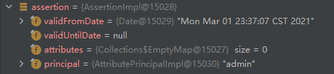

       - new SimpleAuthenticationInfo(principalCollection, ticket)

         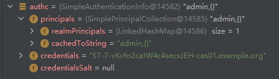

     - 执行完doGetAuthenticationInfo的AuthenticationInfo authc = validTicket(token);

     - 接下来是将用户初始化session中：

       User sysUser = userService.initSessionUser(account, from);

       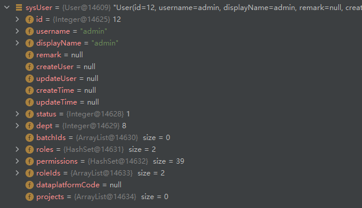

       SecurityUtils.getSubject().getSession().setAttribute("user", sysUser);

     - 成功后进行重定向

       ```java
       protected void issueSuccessRedirect(ServletRequest request, ServletResponse response, String from) throws Exception {
           WebUtils.redirectToSavedRequest(request, response, "/index/" + from);
       }
       ```

     - 然后进入EntryController

       进行匹配


## 模拟登录流程

前端发送一个请求run/as


后端的操作如下：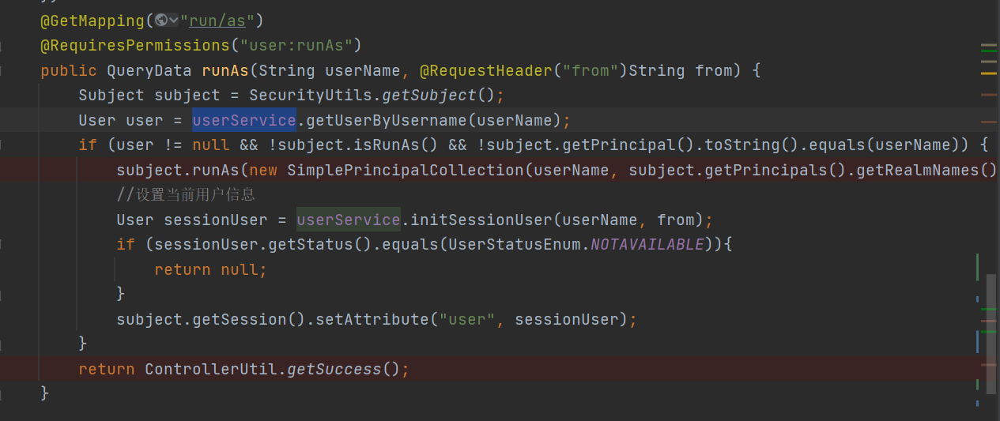

- 先根据前端传来的用户名进行查询，如果不是空的，那么调用subject.runAs()
- 然后调用userservice.initSessionUser()在session中添加该用的信息
- 最后返回成功

subject.runAs()方法


## 退出登录流程

本地环境退出登录后的路径

```
http://localhost/data-web/logout
```

```
http://localhost/cas/logout?service=http://localhost/cas/login?service=http://localhost/data-web/shiro-cas/usertag
```

登录成功之后是这个

```
http://localhost/data-web/index;JSESSIONID=1944a88f-f7ca-4ae0-8c92-dc02edd7ba2f?from=usertag
```

UAT环境退出登录后的路径

访问这个路径进行退出登录

```
https://hxduat.kungeek.com/data-web/logout
```

```
https://sso.kungeek.com/cas/logout?service=https://sso.kungeek.com/cas/login?service=https://hxduat.kungeek.com/data-web/shiro-cas/usertag
```


再次登录成功后是这个

```
https://hxduat.kungeek.com/data-web/index;JSESSIONID=03c4e4c8-20f7-47b5-b335-5f38b727d8ee?from=usertag
```


权限认证：

最后一个一个对比权限是在这里


## shiro工作模型


- Subject：代表当前用户，所有Subject都将绑定到SecurityManager，与Subject的所有交互都会委托给SecurityManager
- SecurityManager：所有与安全相关的操作都由SecurityManager进行统一管理，负责与shiro的相关组件进行交互，类似前端控制器
- Realm：为SecurityManager提供安全数据，如用户的身份、角色信息等，类似安全数据源
- SessionManager：会话管理，会话可以是普通JavaSE环境的，也可以是Web环境的
- SessionDAO：用于会话的CRUD
- CacheManager：缓存管理器，可以将从Realm中获取的数据放入缓存中管理
- Cryptography：Shiro提供了常见的加密工具类用于密码的加密

## 对资源设置权限

| 默认拦截器名       | 说明（括号里的表示默认值）                                   | 拦截器类                                                     |
| ------------------ | ------------------------------------------------------------ | ------------------------------------------------------------ |
| **身份验证相关的** |                                                              |                                                              |
| authc              | 基于表单的拦截器；如“/**=authc”，如果没有登录会跳到相应的登录页面登录；主要属性：usernameParam：表单提交的用户名参数名（ username）；  passwordParam：表单提交的密码参数名（password）； rememberMeParam：表单提交的密码参数名（rememberMe）； loginUrl：登录页面地址（/login.jsp）；successUrl：登录成功后的默认重定向地址； failureKeyAttribute：登录失败后错误信息存储key（shiroLoginFailure）； | org.apache.shiro.web.filter.authc.FormAuthenticationFilter   |
| authcBasic         | Basic HTTP身份验证拦截器，主要属性： applicationName：弹出登录框显示的信息（application）； | org.apache.shiro.web.filter.authc.BasicHttpAuthenticationFilter |
| logout             | 退出拦截器，主要属性：redirectUrl：退出成功后重定向的地址（/）;示例“/logout=logout” | org.apache.shiro.web.filter.authc.LogoutFilter               |
| user               | 用户拦截器，用户已经身份验证/记住我登录的都可；示例“/**=user” | org.apache.shiro.web.filter.authc.UserFilter                 |
| anon               | 匿名拦截器，即不需要登录即可访问；一般用于静态资源过滤；示例“/static/**=anon” | org.apache.shiro.web.filter.authc.AnonymousFilter            |
| **授权相关的**     |                                                              |                                                              |
| roles              | 角色授权拦截器，验证用户是否拥有所有角色；主要属性： loginUrl：登录页面地址（/login.jsp）；unauthorizedUrl：未授权后重定向的地址；示例“/admin/**=roles[admin]” | org.apache.shiro.web.filter.authz.RolesAuthorizationFilter   |
| perms              | 权限授权拦截器，验证用户是否拥有所有权限；属性和roles一样；示例“/user/**=perms["user:create"]” | org.apache.shiro.web.filter.authz.PermissionsAuthorizationFilter |
| port               | 端口拦截器，主要属性：port（80）：可以通过的端口；示例“/test= port[80]”，如果用户访问该页面是非80，将自动将请求端口改为80并重定向到该80端口，其他路径/参数等都一样 | org.apache.shiro.web.filter.authz.PortFilter                 |
| rest               | rest风格拦截器，自动根据请求方法构建权限字符串（GET=read, POST=create,PUT=update,DELETE=delete,HEAD=read,TRACE=read,OPTIONS=read, MKCOL=create）构建权限字符串；示例“/users=rest[user]”，会自动拼出“user:read,user:create,user:update,user:delete”权限字符串进行权限匹配（所有都得匹配，isPermittedAll）； | org.apache.shiro.web.filter.authz.HttpMethodPermissionFilter |
| ssl                | SSL拦截器，只有请求协议是https才能通过；否则自动跳转会https端口（443）；其他和port拦截器一样； | org.apache.shiro.web.filter.authz.SslFilter                  |
| **其他**           |                                                              |                                                              |
| noSessionCreation  | 不创建会话拦截器，调用 subject.getSession(false)不会有什么问题，但是如果 subject.getSession(true)将抛出 DisabledSessionException异常； | org.apache.shiro.web.filter.session.NoSessionCreationFilter  |

### ShiroConfiguration

- ShiroRedisCacheManager

  ```java
  return new ShiroRedisCacheManager(true, shiroSessionProperties.getExpire().getTimeout() * ShiroSessionProperties.MINUTE);
  
  public class ShiroRedisCacheManager implements CacheManager{
      getCache(String name))
  }
  ```

- CasShiroRealm()

  ```
  CasShiroRealm realm = new CasShiroRealm();
  realm.setCacheManager(cacheManager);
  ```

- DefaultWebSessionManager

  ```java
  @Bean(name = "sessionManager")
  public DefaultWebSessionManager defaultWebSessionManager(RedisSessionDao redisSessionDao, ShiroRedisCacheManager cacheManager,ShiroSessionProperties shiroSessionProperties) {
      DefaultWebSessionManager sessionManager = new DefaultWebSessionManager();
      sessionManager.setCacheManager(cacheManager);
      //定时检查session
      sessionManager.setSessionValidationSchedulerEnabled(true);
      //设置session失效的扫描时间，清理用户直接关闭浏览器造成的孤立会话，默认为 1个小时，单位为毫秒
      //Params: sessionValidationInterval – the time in milliseconds between checking for valid sessions to reap orphans.
      //这里设置为60分钟
    sessionManager.setSessionValidationInterval(shiroSessionProperties.getExpire().getTimeout() * ShiroSessionProperties.MINUTE);
      //session过期时间
      //全局会话超时时间，默认为30分钟
      //这里设置为60分钟
    sessionManager.setGlobalSessionTimeout(shiroSessionProperties.getExpire().getTimeout() * ShiroSessionProperties.MINUTE);
      //删除过期session
      sessionManager.setDeleteInvalidSessions(true);
      sessionManager.setSessionDAO(redisSessionDao);
      return sessionManager;
  }
  ```

- singleSignOutHttpSessnListener()

  这个监听器的作用

  用于监听session的销毁事件

- singelSignOutFilter()

  退出登录的时候，server会发送到logoutReqest参数的http请求到每一个clent，这时候会被这个过滤器拦截

- CasFilter

  选择认证失败后打开登录界面

  casFilter.setFailureUrl(loginUrl)

- DataWebTicketFilter() extends AuthenticatingFilter

- FormAuthenticationRewriteFilter()

  ```
  FormAuthenticationRewriteFilter extends FormAuthenticationFilter
  ```

  ```
  filterChainDefinitionMap.put("/**", "formAuthenticationRewriteFilter");
  ```

  即必须登录后才能访问，所以当前端访问userdetail的时候，就会被这个拦截器拦住，重定向到登录界面

  authc就是FormAuthenticationFilter的实例

  - onAccessDenied
  - redirectToLogin

- getShiroFilterFactoryBean()

  - 添加securityManager
  - setLoginUrl
  - setSuccessUrl
  - setUnauthorizedUrl
  - setFilters

  - loadShiroFilter()

  - setFilterChainDefinitionMap()

    user: remember me的可以访问

    - filterChainDefinitionMap: <url,拦截器名>哪些路径会被此拦截器拦截到（过滤链的定义，从上到下执行）

      - filterChainDefinitionMap.put(casFilterUrlPattern, "dataWebTicketFilter");

        `/shiro-cas/usertag`

        filterChainDefinitionMap.put(ANALYSIS_CAS_URL_PATTERN, "dataWebTicketFilter");

        `/shiro-cas/analysis`

        shiro集成cas后，首先添加该规则，这两个url会被该拦截器拦截

      - filterChainDefinitionMap.put("/**", "formAuthenticationRewriteFilter");

        authc，该过滤器下的页面必须验证后才能访问

      - filterChainDefinitionMap.put("/login", "anon");

        login页面什么也不做，直接放行，anon是配置不会被拦截的连接

        前后端不分离的话可以在这里面设置`put("/static/**", "anon")`

        还有swagger：`put("/swagger-ui.html#", "anon")`


```java
@Bean(name = "shiroFilter")
public ShiroFilterFactoryBean getShiroFilterFactoryBean(DefaultWebSecurityManager securityManager, CasFilter casFilter) {
    ShiroFilterFactoryBean shiroFilterFactoryBean = new ShiroFilterFactoryBean();
    // 必须设置 SecurityManager
    shiroFilterFactoryBean.setSecurityManager(securityManager);
    // 如果不设置默认会自动寻找Web工程根目录下的"/login.jsp"页面
    shiroFilterFactoryBean.setLoginUrl(loginUrl);
    // 登录成功后要跳转的连接
    shiroFilterFactoryBean.setSuccessUrl("/index");
    // 这里面并没有重定向到403，而是无任何权限的时候重定向到403？？？？？ 哪里控制的
    // 记得没有权限是返回的result里面接口无权限？？？？
    shiroFilterFactoryBean.setUnauthorizedUrl("/403");
    // 添加casFilter到shiroFilter中
    Map<String, Filter> filters = new HashMap<>();
    filters.put("casFilter", casFilter);
    shiroFilterFactoryBean.setFilters(filters);
    loadShiroFilterChain(shiroFilterFactoryBean);
    return shiroFilterFactoryBean;
}
```

## FormAuthenticationRewriteFilter

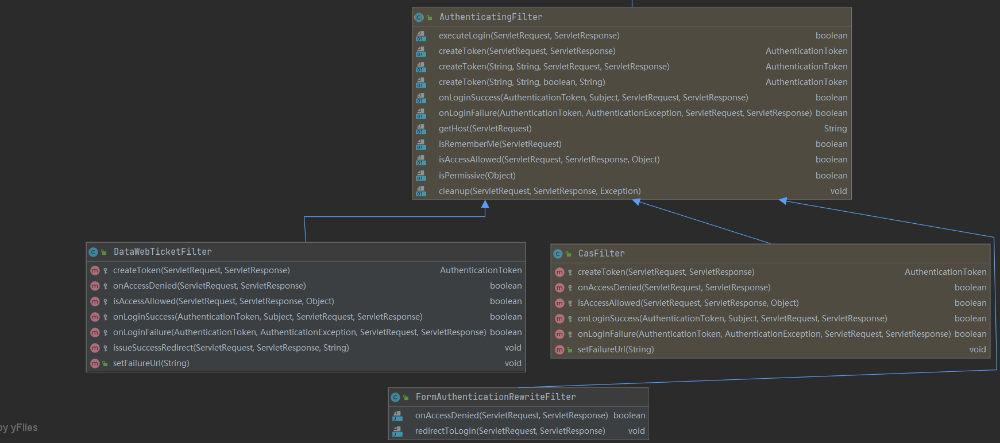

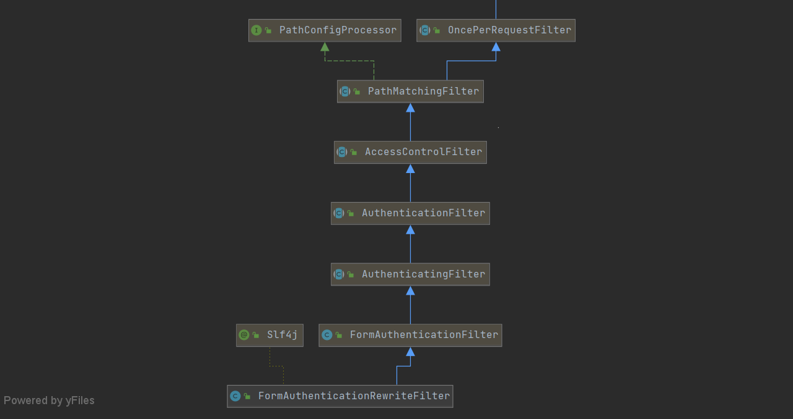

## shiro缓存管理和session管理

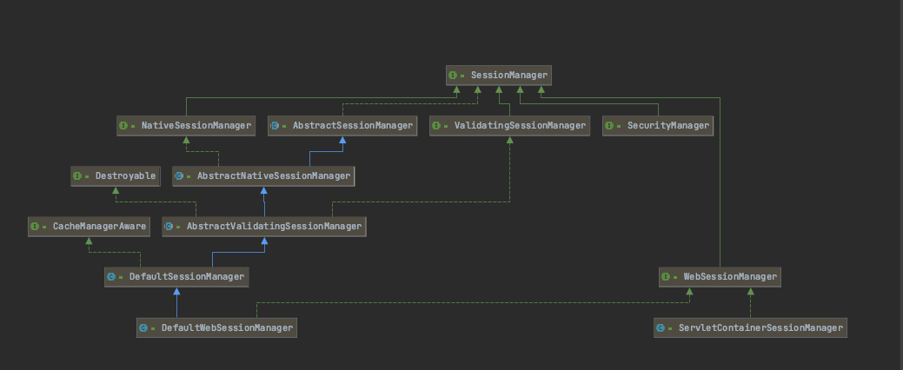

Shiro提供了三个默认实现：

- `DefaultSessionManager`：DefaultSecurityManager使用的默认实现，用于JavaSE环境；
- `ServletContainerSessionManager`：DefaultWebSecurityManager使用的默认实现，用于Web环境，其直接使用Servlet容器的会话；

- `DefaultWebSessionManager`：用于Web环境的实现，可以替代ServletContainerSessionManager，自己维护着会话，直接废弃了Servlet容器的会话管理。

### SessionManager

```java
public interface SessionManager {

    Session start(SessionContext context);

    Session getSession(SessionKey key) throws SessionException;
}
```

#### AbstractSessionManager

这个抽象类主要提供了对session全局过期时间的处理

```java
public abstract class AbstractSessionManager implements SessionManager {

    protected static final long MILLIS_PER_SECOND = 1000;
    protected static final long MILLIS_PER_MINUTE = 60 * MILLIS_PER_SECOND;
    protected static final long MILLIS_PER_HOUR = 60 * MILLIS_PER_MINUTE;
		
  	//默认全局的session过期时间30分钟
    public static final long DEFAULT_GLOBAL_SESSION_TIMEOUT = 30 * MILLIS_PER_MINUTE;

    private long globalSessionTimeout = DEFAULT_GLOBAL_SESSION_TIMEOUT;

    public AbstractSessionManager() {
    }

    public long getGlobalSessionTimeout() {
        return this.globalSessionTimeout;
    }

    public void setGlobalSessionTimeout(long globalSessionTimeout) {
        this.globalSessionTimeout = globalSessionTimeout;
    }
}
```

#### AbstractNativeSessionManager

```java
public abstract class AbstractNativeSessionManager extends AbstractSessionManager implements NativeSessionManager {

    private static final Logger log = LoggerFactory.getLogger(AbstractSessionManager.class);

    private Collection<SessionListener> listeners;

    public AbstractNativeSessionManager() {
        this.listeners = new ArrayList<SessionListener>();
    }

    //这里可以配置监听
    public void setSessionListeners(Collection<SessionListener> listeners) {
        this.listeners = listeners != null ? listeners : new ArrayList<SessionListener>();
    }

    @SuppressWarnings({"UnusedDeclaration"})
    public Collection<SessionListener> getSessionListeners() {
        return this.listeners;
    }

    public Session start(SessionContext context) {
        // 抽象创建Session的行为
        Session session = createSession(context);
        // 为Session设置过期时间
        applyGlobalSessionTimeout(session);
        // 开启Session中的行为
        onStart(session, context);
        // 通知监听器执行Session创建中行为
        notifyStart(session);
        // 包装Session，最终要实现的Session可以存储在除了内存外的其他介质中（如Redis）
        return createExposedSession(session, context);
    }

    protected abstract Session createSession(SessionContext context) throws AuthorizationException;

    protected void applyGlobalSessionTimeout(Session session) {
        session.setTimeout(getGlobalSessionTimeout());
        onChange(session);
    }

    protected void onStart(Session session, SessionContext context) {
    }

    public Session getSession(SessionKey key) throws SessionException {
        Session session = lookupSession(key);
        return session != null ? createExposedSession(session, key) : null;
    }

    private Session lookupSession(SessionKey key) throws SessionException {
        if (key == null) {
            throw new NullPointerException("SessionKey argument cannot be null.");
        }
        return doGetSession(key);
    }

    private Session lookupRequiredSession(SessionKey key) throws SessionException {
        Session session = lookupSession(key);
        if (session == null) {
            String msg = "Unable to locate required Session instance based on SessionKey [" + key + "].";
            throw new UnknownSessionException(msg);
        }
        return session;
    }

    protected abstract Session doGetSession(SessionKey key) throws InvalidSessionException;

    protected Session createExposedSession(Session session, SessionContext context) {
        return new DelegatingSession(this, new DefaultSessionKey(session.getId()));
    }

    protected Session createExposedSession(Session session, SessionKey key) {
        return new DelegatingSession(this, new DefaultSessionKey(session.getId()));
    }

    protected Session beforeInvalidNotification(Session session) {
        return new ImmutableProxiedSession(session);
    }

    protected void notifyStart(Session session) {
        for (SessionListener listener : this.listeners) {
            listener.onStart(session);
        }
    }

    protected void notifyStop(Session session) {
        Session forNotification = beforeInvalidNotification(session);
        for (SessionListener listener : this.listeners) {
            listener.onStop(forNotification);
        }
    }

    protected void notifyExpiration(Session session) {
        Session forNotification = beforeInvalidNotification(session);
        for (SessionListener listener : this.listeners) {
            listener.onExpiration(forNotification);
        }
    }

    public Date getStartTimestamp(SessionKey key) {
        return lookupRequiredSession(key).getStartTimestamp();
    }

    public Date getLastAccessTime(SessionKey key) {
        return lookupRequiredSession(key).getLastAccessTime();
    }

    public long getTimeout(SessionKey key) throws InvalidSessionException {
        return lookupRequiredSession(key).getTimeout();
    }

    //设置某个key的过期时间
    public void setTimeout(SessionKey key, long maxIdleTimeInMillis) throws InvalidSessionException {
        Session s = lookupRequiredSession(key);
        s.setTimeout(maxIdleTimeInMillis);
        onChange(s);
    }

    public void touch(SessionKey key) throws InvalidSessionException {
        Session s = lookupRequiredSession(key);
        s.touch();
        onChange(s);
    }

    public String getHost(SessionKey key) {
        return lookupRequiredSession(key).getHost();
    }

    public Collection<Object> getAttributeKeys(SessionKey key) {
        Collection<Object> c = lookupRequiredSession(key).getAttributeKeys();
        if (!CollectionUtils.isEmpty(c)) {
            return Collections.unmodifiableCollection(c);
        }
        return Collections.emptySet();
    }

    public Object getAttribute(SessionKey sessionKey, Object attributeKey) throws InvalidSessionException {
        return lookupRequiredSession(sessionKey).getAttribute(attributeKey);
    }

    public void setAttribute(SessionKey sessionKey, Object attributeKey, Object value) throws InvalidSessionException {
        if (value == null) {
            removeAttribute(sessionKey, attributeKey);
        } else {
            Session s = lookupRequiredSession(sessionKey);
            s.setAttribute(attributeKey, value);
            onChange(s);
        }
    }

    public Object removeAttribute(SessionKey sessionKey, Object attributeKey) throws InvalidSessionException {
        Session s = lookupRequiredSession(sessionKey);
        Object removed = s.removeAttribute(attributeKey);
        if (removed != null) {
            onChange(s);
        }
        return removed;
    }

    public boolean isValid(SessionKey key) {
        try {
            checkValid(key);
            return true;
        } catch (InvalidSessionException e) {
            return false;
        }
    }

    public void stop(SessionKey key) throws InvalidSessionException {
        Session session = lookupRequiredSession(key);
        try {
            if (log.isDebugEnabled()) {
                log.debug("Stopping session with id [" + session.getId() + "]");
            }
            session.stop();
            onStop(session, key);
            notifyStop(session);
        } finally {
            afterStopped(session);
        }
    }

    protected void onStop(Session session, SessionKey key) {
        onStop(session);
    }

    protected void onStop(Session session) {
        onChange(session);
    }

    protected void afterStopped(Session session) {
    }

    public void checkValid(SessionKey key) throws InvalidSessionException {
        //just try to acquire it.  If there is a problem, an exception will be thrown:
        lookupRequiredSession(key);
    }

    protected void onChange(Session s) {
    }
}
```

#### AbstractValidatingSessionManager

```java
public abstract class AbstractValidatingSessionManager extends AbstractNativeSessionManager
        implements ValidatingSessionManager, Destroyable {

    private static final Logger log = LoggerFactory.getLogger(AbstractValidatingSessionManager.class);

    //默认的session验证间隔 默认时间为1小时
    public static final long DEFAULT_SESSION_VALIDATION_INTERVAL = MILLIS_PER_HOUR;

    protected boolean sessionValidationSchedulerEnabled;

    /**
     * Scheduler used to validate sessions on a regular basis.
     */
    protected SessionValidationScheduler sessionValidationScheduler;

    protected long sessionValidationInterval;

    //默认是开启session校验，并且时间间隔为1小时
    public AbstractValidatingSessionManager() {
        this.sessionValidationSchedulerEnabled = true;
        this.sessionValidationInterval = DEFAULT_SESSION_VALIDATION_INTERVAL;
    }

    public boolean isSessionValidationSchedulerEnabled() {
        return sessionValidationSchedulerEnabled;
    }

		//设置是否开启session失效检查
    public void setSessionValidationSchedulerEnabled(boolean sessionValidationSchedulerEnabled) {
        this.sessionValidationSchedulerEnabled = sessionValidationSchedulerEnabled;
    }

    public void setSessionValidationScheduler(SessionValidationScheduler sessionValidationScheduler) {
        this.sessionValidationScheduler = sessionValidationScheduler;
    }

    public SessionValidationScheduler getSessionValidationScheduler() {
        return sessionValidationScheduler;
    }

    private void enableSessionValidationIfNecessary() {
        SessionValidationScheduler scheduler = getSessionValidationScheduler();
        if (isSessionValidationSchedulerEnabled() && (scheduler == null || !scheduler.isEnabled())) {
            enableSessionValidation();
        }
    }

    //如果使用默认的校验器，这个值的含义是 多久进行一次session的校验
    public void setSessionValidationInterval(long sessionValidationInterval) {
        this.sessionValidationInterval = sessionValidationInterval;
    }

    public long getSessionValidationInterval() {
        return sessionValidationInterval;
    }

    @Override
    protected final Session doGetSession(final SessionKey key) throws InvalidSessionException {
        enableSessionValidationIfNecessary();

        log.trace("Attempting to retrieve session with key {}", key);

        Session s = retrieveSession(key);
        if (s != null) {
            validate(s, key);
        }
        return s;
    }

    //恢复session 听过一个确定的key 去查找session
    protected abstract Session retrieveSession(SessionKey key) throws UnknownSessionException;

    protected Session createSession(SessionContext context) throws AuthorizationException {
        enableSessionValidationIfNecessary();
        return doCreateSession(context);
    }

    protected abstract Session doCreateSession(SessionContext initData) throws AuthorizationException;

    //验证session，会抛出过期或者无效
    protected void validate(Session session, SessionKey key) throws InvalidSessionException {
        try {
            doValidate(session);
        } catch (ExpiredSessionException ese) {
            onExpiration(session, ese, key);
            throw ese;
        } catch (InvalidSessionException ise) {
            onInvalidation(session, ise, key);
            throw ise;
        }
    }

   
    protected void onExpiration(Session s, ExpiredSessionException ese, SessionKey key) {
        log.trace("Session with id [{}] has expired.", s.getId());
        try {
            onExpiration(s);
            notifyExpiration(s);
        } finally {
            afterExpired(s);
        }
    }

    protected void onExpiration(Session session) {
        onChange(session);
    }

    protected void afterExpired(Session session) {
    }

    protected void onInvalidation(Session s, InvalidSessionException ise, SessionKey key) {
        if (ise instanceof ExpiredSessionException) {
            onExpiration(s, (ExpiredSessionException) ise, key);
            return;
        }
        log.trace("Session with id [{}] is invalid.", s.getId());
        try {
            onStop(s);
            notifyStop(s);
        } finally {
            afterStopped(s);
        }
    }

    protected void doValidate(Session session) throws InvalidSessionException {
        if (session instanceof ValidatingSession) {
            ((ValidatingSession) session).validate();
        } else {
            String msg = "The " + getClass().getName() + " implementation only supports validating " +
                    "Session implementations of the " + ValidatingSession.class.getName() + " interface.  " +
                    "Please either implement this interface in your session implementation or override the " +
                    AbstractValidatingSessionManager.class.getName() + ".doValidate(Session) method to perform validation.";
            throw new IllegalStateException(msg);
        }
    }

    protected long getTimeout(Session session) {
        return session.getTimeout();
    }

    protected SessionValidationScheduler createSessionValidationScheduler() {
        ExecutorServiceSessionValidationScheduler scheduler;

        if (log.isDebugEnabled()) {
            log.debug("No sessionValidationScheduler set.  Attempting to create default instance.");
        }
        scheduler = new ExecutorServiceSessionValidationScheduler(this);
        scheduler.setInterval(getSessionValidationInterval());
        if (log.isTraceEnabled()) {
            log.trace("Created default SessionValidationScheduler instance of type [" + scheduler.getClass().getName() + "].");
        }
        return scheduler;
    }

    protected void enableSessionValidation() {
        SessionValidationScheduler scheduler = getSessionValidationScheduler();
        if (scheduler == null) {
            scheduler = createSessionValidationScheduler();
            setSessionValidationScheduler(scheduler);
        }
        if (log.isInfoEnabled()) {
            log.info("Enabling session validation scheduler...");
        }
        scheduler.enableSessionValidation();
        afterSessionValidationEnabled();
    }

    protected void afterSessionValidationEnabled() {
    }

    protected void disableSessionValidation() {
        beforeSessionValidationDisabled();
        SessionValidationScheduler scheduler = getSessionValidationScheduler();
        if (scheduler != null) {
            try {
                scheduler.disableSessionValidation();
                if (log.isInfoEnabled()) {
                    log.info("Disabled session validation scheduler.");
                }
            } catch (Exception e) {
                if (log.isDebugEnabled()) {
                    String msg = "Unable to disable SessionValidationScheduler.  Ignoring (shutting down)...";
                    log.debug(msg, e);
                }
            }
            LifecycleUtils.destroy(scheduler);
            setSessionValidationScheduler(null);
        }
    }

    protected void beforeSessionValidationDisabled() {
    }

    public void destroy() {
        disableSessionValidation();
    }

    /**
     * @see ValidatingSessionManager#validateSessions()
     */
    public void validateSessions() {
        if (log.isInfoEnabled()) {
            log.info("Validating all active sessions...");
        }

        int invalidCount = 0;

        Collection<Session> activeSessions = getActiveSessions();

        if (activeSessions != null && !activeSessions.isEmpty()) {
            for (Session s : activeSessions) {
                try {
                    //simulate a lookup key to satisfy the method signature.
                    //this could probably stand to be cleaned up in future versions:
                    SessionKey key = new DefaultSessionKey(s.getId());
                    validate(s, key);
                } catch (InvalidSessionException e) {
                    if (log.isDebugEnabled()) {
                        boolean expired = (e instanceof ExpiredSessionException);
                        String msg = "Invalidated session with id [" + s.getId() + "]" +
                                (expired ? " (expired)" : " (stopped)");
                        log.debug(msg);
                    }
                    invalidCount++;
                }
            }
        }

        if (log.isInfoEnabled()) {
            String msg = "Finished session validation.";
            if (invalidCount > 0) {
                msg += "  [" + invalidCount + "] sessions were stopped.";
            } else {
                msg += "  No sessions were stopped.";
            }
            log.info(msg);
        }
    }

    protected abstract Collection<Session> getActiveSessions();
}
```


Shiro提供SessionDAO用于会话的CRUD

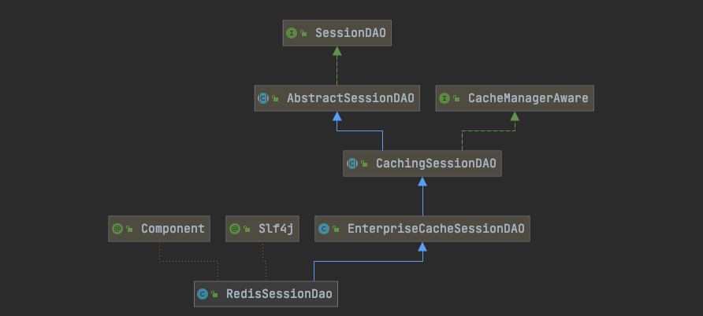

### SessionDAO

```java
public interface SessionDAO {
		//如DefaultSessionManager在创建完session后会调用该方法；
    Serializable create(Session session);
		//根据会话ID获取会话  
    Session readSession(Serializable sessionId) throws UnknownSessionException;
		//更新会话；如更新会话最后访问时间/停止会话/设置超时时间/设置移除属性等会调用  
    void update(Session session) throws UnknownSessionException;
		//删除会话；当会话过期/会话停止（如用户退出时）会调用
    void delete(Session session);
		//获取当前所有活跃用户，如果用户量多此方法影响性能  
    Collection<Session> getActiveSessions();
}
```

#### AbstractSessionDAO

```java
public abstract class AbstractSessionDAO implements SessionDAO {

    private SessionIdGenerator sessionIdGenerator;

    public AbstractSessionDAO() {
        this.sessionIdGenerator = new JavaUuidSessionIdGenerator();
    }

    public SessionIdGenerator getSessionIdGenerator() {
        return sessionIdGenerator;
    }

    public void setSessionIdGenerator(SessionIdGenerator sessionIdGenerator) {
        this.sessionIdGenerator = sessionIdGenerator;
    }

    protected Serializable generateSessionId(Session session) {
        if (this.sessionIdGenerator == null) {
            String msg = "sessionIdGenerator attribute has not been configured.";
            throw new IllegalStateException(msg);
        }
        return this.sessionIdGenerator.generateId(session);
    }

    public Serializable create(Session session) {
        Serializable sessionId = doCreate(session);
        verifySessionId(sessionId);
        return sessionId;
    }

    private void verifySessionId(Serializable sessionId) {
        if (sessionId == null) {
            String msg = "sessionId returned from doCreate implementation is null.  Please verify the implementation.";
            throw new IllegalStateException(msg);
        }
    }

    protected void assignSessionId(Session session, Serializable sessionId) {
        ((SimpleSession) session).setId(sessionId);
    }

    protected abstract Serializable doCreate(Session session);

    public Session readSession(Serializable sessionId) throws UnknownSessionException {
        Session s = doReadSession(sessionId);
        if (s == null) {
            throw new UnknownSessionException("There is no session with id [" + sessionId + "]");
        }
        return s;
    }

    protected abstract Session doReadSession(Serializable sessionId);

}
```

#### CachingSessionDAO

```java
public abstract class CachingSessionDAO extends AbstractSessionDAO implements CacheManagerAware {

    public static final String ACTIVE_SESSION_CACHE_NAME = "shiro-activeSessionCache";

    private CacheManager cacheManager;

    private Cache<Serializable, Session> activeSessions;

    private String activeSessionsCacheName = ACTIVE_SESSION_CACHE_NAME;

    public CachingSessionDAO() {
    }

    public void setCacheManager(CacheManager cacheManager) {
        this.cacheManager = cacheManager;
    }

    public CacheManager getCacheManager() {
        return cacheManager;
    }

    public String getActiveSessionsCacheName() {
        return activeSessionsCacheName;
    }

    public void setActiveSessionsCacheName(String activeSessionsCacheName) {
        this.activeSessionsCacheName = activeSessionsCacheName;
    }

    public Cache<Serializable, Session> getActiveSessionsCache() {
        return this.activeSessions;
    }

    public void setActiveSessionsCache(Cache<Serializable, Session> cache) {
        this.activeSessions = cache;
    }

    private Cache<Serializable, Session> getActiveSessionsCacheLazy() {
        if (this.activeSessions == null) {
            this.activeSessions = createActiveSessionsCache();
        }
        return activeSessions;
    }

    protected Cache<Serializable, Session> createActiveSessionsCache() {
        Cache<Serializable, Session> cache = null;
        CacheManager mgr = getCacheManager();
        if (mgr != null) {
            String name = getActiveSessionsCacheName();
            cache = mgr.getCache(name);
        }
        return cache;
    }

    public Serializable create(Session session) {
        Serializable sessionId = super.create(session);
        cache(session, sessionId);
        return sessionId;
    }

    protected Session getCachedSession(Serializable sessionId) {
        Session cached = null;
        if (sessionId != null) {
            Cache<Serializable, Session> cache = getActiveSessionsCacheLazy();
            if (cache != null) {
                cached = getCachedSession(sessionId, cache);
            }
        }
        return cached;
    }

    protected Session getCachedSession(Serializable sessionId, Cache<Serializable, Session> cache) {
        return cache.get(sessionId);
    }

    protected void cache(Session session, Serializable sessionId) {
        if (session == null || sessionId == null) {
            return;
        }
        Cache<Serializable, Session> cache = getActiveSessionsCacheLazy();
        if (cache == null) {
            return;
        }
        cache(session, sessionId, cache);
    }

    protected void cache(Session session, Serializable sessionId, Cache<Serializable, Session> cache) {
        cache.put(sessionId, session);
    }

    public Session readSession(Serializable sessionId) throws UnknownSessionException {
        Session s = getCachedSession(sessionId);
        if (s == null) {
            s = super.readSession(sessionId);
        }
        return s;
    }

    public void update(Session session) throws UnknownSessionException {
        doUpdate(session);
        if (session instanceof ValidatingSession) {
            if (((ValidatingSession) session).isValid()) {
                cache(session, session.getId());
            } else {
                uncache(session);
            }
        } else {
            cache(session, session.getId());
        }
    }

    protected abstract void doUpdate(Session session);

    public void delete(Session session) {
        uncache(session);
        doDelete(session);
    }

    protected abstract void doDelete(Session session);

    protected void uncache(Session session) {
        if (session == null) {
            return;
        }
        Serializable id = session.getId();
        if (id == null) {
            return;
        }
        Cache<Serializable, Session> cache = getActiveSessionsCacheLazy();
        if (cache != null) {
            cache.remove(id);
        }
    }

    public Collection<Session> getActiveSessions() {
        Cache<Serializable, Session> cache = getActiveSessionsCacheLazy();
        if (cache != null) {
            return cache.values();
        } else {
            return Collections.emptySet();
        }
    }
}
```

#### EnterpriseCacheSessionDAO

```java
public class EnterpriseCacheSessionDAO extends CachingSessionDAO {

    public EnterpriseCacheSessionDAO() {
        setCacheManager(new AbstractCacheManager() {
            @Override
            protected Cache<Serializable, Session> createCache(String name) throws CacheException {
                return new MapCache<Serializable, Session>(name, new ConcurrentHashMap<Serializable, Session>());
            }
        });
    }

    protected Serializable doCreate(Session session) {
        Serializable sessionId = generateSessionId(session);
        assignSessionId(session, sessionId);
        return sessionId;
    }

    protected Session doReadSession(Serializable sessionId) {
        return null; //should never execute because this implementation relies on parent class to access cache, which
        //is where all sessions reside - it is the cache implementation that determines if the
        //cache is memory only or disk-persistent, etc.
    }

    protected void doUpdate(Session session) {
        //does nothing - parent class persists to cache.
    }

    protected void doDelete(Session session) {
        //does nothing - parent class removes from cache.
    }
}
```

#### RedisSessionDao

```java
@Slf4j
@Component
public class RedisSessionDao extends EnterpriseCacheSessionDAO {
    @Autowired
    @Qualifier("redisTemplate")
    private RedisTemplate redisTemplate;

    /**
     * redis中session缓存过期时间，单位：分钟
     * 默认一小时
     */
    @Autowired
    private ShiroSessionProperties shiroSessionProperties;

    @Override
    protected Serializable doCreate(Session session) {
        Serializable sessionId = super.doCreate(session);
        BoundValueOperations<String, Object> sessionValueOperations = redisTemplate.boundValueOps(getRedisSessionKey(sessionId));
        sessionValueOperations.set(session);
        sessionValueOperations.expire(shiroSessionProperties.getExpire().getTimeout(), TimeUnit.MINUTES);
        return sessionId;
    }

    @Override
    protected Session doReadSession(Serializable sessionId) {
        Session session = super.doReadSession(sessionId);

        if(session == null){
            try {
                BoundValueOperations<String, Object> sessionValueOperations = redisTemplate.boundValueOps(getRedisSessionKey(sessionId));
                session = (Session) sessionValueOperations.get();
            } catch (Exception e) {
                // 如果出现读取session异常，返回null
                // 产生的原因一般是类似昨天晚上打开页面没有关闭，第二天直接刷新
                // 这时会放一个SavedRequest实例到redis中，在反序列化的时候报错
                if (log.isDebugEnabled()) {
                    log.debug("获取session异常，重新登陆", e);
                }
                return null;
            }
        }

        return session;
    }

    @Override
    protected void doUpdate(Session session) {
        super.doUpdate(session);

        BoundValueOperations<String, Object> sessionValueOperations = redisTemplate.boundValueOps(getRedisSessionKey(session.getId()));
        sessionValueOperations.set(session);
        sessionValueOperations.expire(shiroSessionProperties.getExpire().getTimeout(), TimeUnit.MINUTES);
    }

    @Override
    protected void doDelete(Session session) {
        redisTemplate.delete(getRedisSessionKey(session.getId()));
        super.doDelete(session);
    }

    /**
     * 格式化session在redis中存储的key
     * @param sessionId
     * @return
     */
    private String getRedisSessionKey(Serializable sessionId) {
        return String.format("%s%s", ShiroRedisCache.SESSION_PREFIX, sessionId.toString());
    }
}
```

创建session：

create session


## shiro ticket校验

## CasShiroRealm

CAS中的Service的概念: CAS分为服务端和客户端，而Service就是指具体的多个客户端（CAS Clients）

```java
@PostConstruct
public void initProperty() {
    //这个地方是设置CAS服务器的地址
    // http://localhost/cas
    setCasServerUrlPrefix(ShiroConfiguration.casServerUrlPrefix);
    // 这是客户端地址
    // http://localhost/data-web + /shiro-cas/usertag
    setCasService(ShiroConfiguration.shiroServerUrlPrefix + ShiroConfiguration.casFilterUrlPattern);
}
```


sessionDAO里面的存储session是存的prefix+sessionID

ShiroRedisCache里面存储的是prefix+key


## References

1. https://en.wikipedia.org/wiki/Single_sign-on
2. https://en.wikipedia.org/wiki/Central_Authentication_Service
2. https://my.oschina.net/thinwonton/blog/1475562


