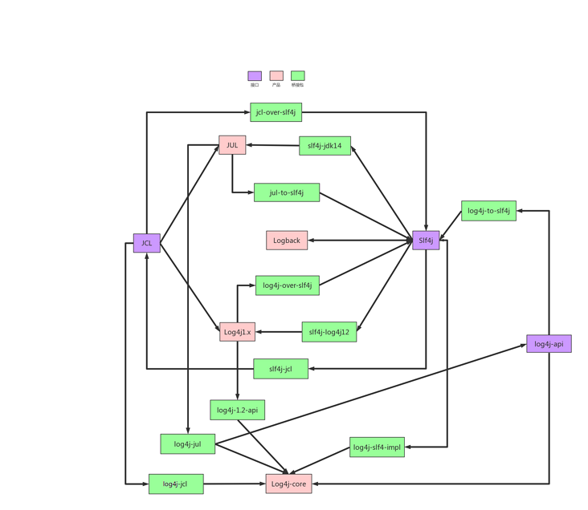

# Java日志框架

## Java日志历史

按时间线：

- Log4J——是一个基于Java的日志工具，最初由Ceki Gülcü编写，后来成为了Apache项目

- JUL——Java Util Logging，Sun并没有接受Apache的建议，将Log4j引入到Java标准库中，而是推出的自己的日志库Java Util Logging

- JCL——Jakarta Commons Logging，Apache推出了日志接口，Jakarta Commons Logging，也就是日志抽象层，想统一日志接口，就像JDBC一样

- SL4J——Simple Logging Facade for Java，Ceki Gülcü后来离开了Apache，做出了更优秀的SL4J

  但是由于出来的较晚，所以之前的日志产品，如`JUL`和`Log4j`都是没有实现这个接口的，于是SL4J提供了一系列桥接包来对接其他日志工具

- Logback——由于使用其他的日志产品对接SL4J都需要额外的桥接包，Ceki Gülcü就写了SL4J的正统实现，Logback

- Log4j2——在2012年，`Apache`直接推出新项目，不是`Log4j1.x`升级，而是新项目`Log4j2`，因为`Log4j2`是完全不兼容`Log4j1.x`的，并且是分离的设计，分化成`log4j-api`和`log4j-core`，这个`log4j-api`也是日志接口，`log4j-core`是日志实现。同时，也提供了一系列桥接包

最终的日志系统如下（3个日志接口、4个日志产品和各种桥接包）：



## JDK Logging

```java
import java.util.logging.Logger;

public class JdkLoggingTest {

    public static void main(String[] args) {
        Logger log = Logger.getGlobal();
        log.info("test jdk logger info");
        log.warning("test jdk logger warning");
        log.severe("test jdk logger severe");
        log.fine("test jdk logger fine");
    }
}
```

输出：

```
十二月 02, 2021 8:13:35 下午 com.xxx.data.migration.UploadData main
信息: test jdk logger info
十二月 02, 2021 8:13:35 下午 com.xxx.data.migration.UploadData main
警告: test jdk logger warning
十二月 02, 2021 8:13:35 下午 com.xxx.data.migration.UploadData main
严重: test jdk logger severe
```

JDK Longging定义了七个日志级别：

- SEVERE
- WARNING
- INFO（default）
- CONFIG
- FINE
- FINER
- FINEST

## Commons Logging

依赖：

```xml
<dependency>
    <groupId>commons-logging</groupId>
    <artifactId>commons-logging</artifactId>
    <version>1.2</version>
</dependency>
```

Commons Logging的特色是，它可以挂接不同的日志系统，并通过配置文件指定挂接的日志系统。默认情况下，Commons Loggin自动搜索并使用Log4j，如果没有找到Log4j，再使用JDK Logging。

```java
public class CommonsLoggingTest {
    static final Log log = LogFactory.getLog(CommonsLoggingTest.class);

    public static void main(String[] args) {
        log.info("test CommonsLogging info");
        log.error("test CommonsLogging error");
        log.warn("test CommonsLogging warn");
        log.debug("test CommonsLogging debug");
    }
}
```

输出如下：

```
十二月 02, 2021 8:23:07 下午 com.xxx.data.migration.CommonsLoggingTest main
信息: test CommonsLogging info
十二月 02, 2021 8:25:21 下午 com.xxx.data.migration.CommonsLoggingTest main
警告: test CommonsLogging warn
十二月 02, 2021 8:23:07 下午 com.xxx.data.migration.CommonsLoggingTest main
严重: test CommonsLogging error
```

Commons Logging的日志方法，例如`info()`，除了标准的`info(String)`外，还提供了一个非常有用的重载方法：`info(String, Throwable)`，这使得记录异常更加简单：

```java
try {
    ...
} catch (Exception e) {
    log.error("got exception!", e);
}
```

## Log4j2

依赖：

```xml
<dependency>
    <groupId>org.apache.logging.log4j</groupId>
    <artifactId>log4j-core</artifactId>
    <version>2.14.0</version>
</dependency>
<dependency>
    <groupId>org.apache.logging.log4j</groupId>
    <artifactId>log4j-api</artifactId>
    <version>2.14.1</version>
</dependency>
<dependency>
    <groupId>org.apache.logging.log4j</groupId>
    <artifactId>log4j-jcl</artifactId>
    <version>2.14.1</version>
</dependency>
```

前面介绍了Commons Logging，可以作为“日志接口”来使用。而真正的“日志实现”可以使用Log4j。

Log4j是一个组件化设计的日志系统，它的架构大致如下：

```ascii
log.info("User signed in.");
 │
 │   ┌──────────┐    ┌──────────┐    ┌──────────┐    ┌──────────┐
 ├──>│ Appender │───>│  Filter  │───>│  Layout  │───>│ Console  │
 │   └──────────┘    └──────────┘    └──────────┘    └──────────┘
 │
 │   ┌──────────┐    ┌──────────┐    ┌──────────┐    ┌──────────┐
 ├──>│ Appender │───>│  Filter  │───>│  Layout  │───>│   File   │
 │   └──────────┘    └──────────┘    └──────────┘    └──────────┘
 │
 │   ┌──────────┐    ┌──────────┐    ┌──────────┐    ┌──────────┐
 └──>│ Appender │───>│  Filter  │───>│  Layout  │───>│  Socket  │
     └──────────┘    └──────────┘    └──────────┘    └──────────┘
```

当我们使用Log4j输出一条日志时，Log4j自动通过不同的Appender把同一条日志输出到不同的目的地。例如：

- console：输出到屏幕；
- file：输出到文件；
- socket：通过网络输出到远程计算机；
- jdbc：输出到数据库

在输出日志的过程中，通过Filter来过滤哪些log需要被输出，哪些log不需要被输出。例如，仅输出`ERROR`级别的日志。

最后，通过Layout来格式化日志信息，例如，自动添加日期、时间、方法名称等信息。

以XML配置为例，使用Log4j的时候，我们把一个`log4j2.xml`的文件放到`classpath`下就可以让Log4j读取配置文件并按照我们的配置来输出日志。下面是一个配置文件的例子：

```xml
<?xml version="1.0" encoding="UTF-8"?>
<Configuration>
	<Properties>
        <!-- 定义日志格式 -->
		<Property name="log.pattern">%d{MM-dd HH:mm:ss} [%t] %-5level %logger{36}%n%msg%n%n</Property>
        <!-- 定义文件名变量 -->
		<Property name="file.err.filename">log/err.log</Property>
		<Property name="file.err.pattern">log/err.%i.log.gz</Property>
	</Properties>
    <!-- 定义Appender，即目的地 -->
	<Appenders>
        <!-- 定义输出到屏幕 -->
		<Console name="console" target="SYSTEM_OUT">
            <!-- 日志格式引用上面定义的log.pattern -->
			<PatternLayout pattern="${log.pattern}" />
		</Console>
        <!-- 定义输出到文件,文件名引用上面定义的file.err.filename -->
		<RollingFile name="err" bufferedIO="true" fileName="${file.err.filename}" filePattern="${file.err.pattern}">
			<PatternLayout pattern="${log.pattern}" />
			<Policies>
                <!-- 根据文件大小自动切割日志 -->
				<SizeBasedTriggeringPolicy size="1 MB" />
			</Policies>
            <!-- 保留最近10份 -->
			<DefaultRolloverStrategy max="10" />
		</RollingFile>
	</Appenders>
	<Loggers>
		<Root level="info">
            <!-- 对info级别的日志，输出到console -->
			<AppenderRef ref="console" level="info" />
            <!-- 对error级别的日志，输出到err，即上面定义的RollingFile -->
			<AppenderRef ref="err" level="error" />
		</Root>
	</Loggers>
</Configuration>
```

对上面的配置文件，凡是`INFO`级别的日志，会自动输出到屏幕，而`ERROR`级别的日志，不但会输出到屏幕，还会同时输出到文件。并且，一旦日志文件达到指定大小（1MB），Log4j就会自动切割新的日志文件，并最多保留10份。

当引入依赖后并使用上述配置后，上述代码输出自动变为：

```
12-02 20:48:32.111 [main] INFO  com.xxx.data.migration.CommonsLoggingTest
test CommonsLogging info

12-02 20:48:32.113 [main] ERROR com.xxx.data.migration.CommonsLoggingTest
test CommonsLogging error

12-02 20:48:32.113 [main] WARN  com.xxx.data.migration.CommonsLoggingTest
test CommonsLogging warn
```

## SLF4J和Logback

依赖：

```xml
<dependency>
    <groupId>org.slf4j</groupId>
    <artifactId>slf4j-api</artifactId>
    <version>1.7.21</version>
</dependency>
<dependency>
    <groupId>ch.qos.logback</groupId>
    <artifactId>logback-classic</artifactId>
    <version>1.2.3</version>
</dependency>
```

其中`logback-classic`包含了`logback-core`：

```
$ mvn dependency:tree -Dverbose -Dincludes="*logback:logback*"
com.xxx.data:data_migration:jar:1.0-SNAPSHOT
\- ch.qos.logback:logback-classic:jar:1.2.3:compile
   \- ch.qos.logback:logback-core:jar:1.2.3:compile
```

### 改进

相比log4j1.x的改进，可以看官方文章：[Reasons to prefer logback over log4j 1.x](http://logback.qos.ch/reasonsToSwitch.html)

- 速度更快 
- 和SLF4J配套，是SLF4J的直接实现

SLF4改进使用了占位符：

```java
int score = 99;
p.setScore(score);
logger.info("Set score {} for Person {} ok.", score, p.getName());
```

### 配置文件

`logback.xml`

配置文件中的()是有特殊含义的，所以要想输出`(`就需要转义`\(`

## 最佳实践

### 原则

- **依赖日志接口的API，而不是日志实现的API**

  以腾讯云的Java SDK Jar包`com.qcloud:cos_api:jar:5.6.60`为例：

  依赖树：

  ```
  [INFO] \- com.qcloud:cos_api:jar:5.6.60:compile
  [INFO]    +- org.slf4j:slf4j-api:jar:1.7.26:compile
  ...
  ```

  代码：

  ```java
  import org.slf4j.Logger;
  import org.slf4j.LoggerFactory;
  
  public class COSClient implements COS {
      private static final Logger log = LoggerFactory.getLogger(COSClient.class);
      //...
  }
  ```

  你在使用的时候需要引入自己想要的日志实现和相关配置，否则警告没有日志实现，并使用no-operation (NOP)  logger：

  ```
  SLF4J: Failed to load class "org.slf4j.impl.StaticLoggerBinder".
  SLF4J: Defaulting to no-operation (NOP) logger implementation
  SLF4J: See http://www.slf4j.org/codes.html#StaticLoggerBinder for further details.
  ```

- 日志实现的依赖只添加一个

- 把日志产品的依赖设置为`Optional`和`runtime scope`

  `Optional`是为了依赖不会被传递，而`scope`设置为`runtime`，是可以保证日志实现的依赖只有在运行时需要，编译时不需要，这样开发人员就不会在编写代码的过程中使用到日志实现的`API`了。

  ```xml
  <dependency>
      <groupId>org.apache.logging.log4j</groupId>
      <artifactId>log4j-core</artifactId>
      <version>${log4j.version}</version>
      <optional>true</optional>
      <scope>runtime</scope>
  </dependency>
  ```

### 个人实践

目前选择使用sl4j+logback组合，依赖见上。

配置文件`logback.xml`（待持续更新...）：

```xml
<?xml version="1.0" encoding="UTF-8"?>
<configuration>

    <appender name="CONSOLE" class="ch.qos.logback.core.ConsoleAppender">
        <encoder>
            <pattern>%d{YYYY/MM/dd-HH:mm:ss} [%thread] %-5level %logger{43} [\(%L\)] : %msg%n</pattern>
        </encoder>
    </appender>

    <appender name="FILE" class="ch.qos.logback.core.rolling.RollingFileAppender">
        <encoder>
            <pattern>%d{YYYY/MM/dd-HH:mm:ss} [%thread] %-5level %logger{43} [\(%L\)] : %msg%n</pattern>
            <charset>utf-8</charset>
        </encoder>
        <file>log/output.log</file>
        <rollingPolicy class="ch.qos.logback.core.rolling.FixedWindowRollingPolicy">
            <fileNamePattern>log/output.log.%i</fileNamePattern>
        </rollingPolicy>
        <triggeringPolicy class="ch.qos.logback.core.rolling.SizeBasedTriggeringPolicy">
            <MaxFileSize>1MB</MaxFileSize>
        </triggeringPolicy>
    </appender>

    <root level="INFO">
        <appender-ref ref="CONSOLE" />
        <appender-ref ref="FILE" />
    </root>
</configuration>
```

## References

1. 维基百科：[Log4j](https://en.wikipedia.org/wiki/Log4j)
2. 博客：[Java日志系统历史从入门到崩溃](https://segmentfault.com/a/1190000021121882)
2. logback官方：[Reasons to prefer logback over log4j 1.x](https://logback.qos.ch/reasonsToSwitch.html)