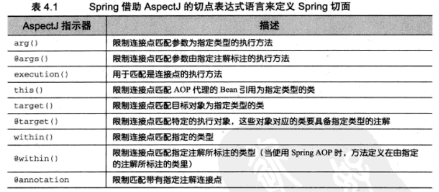

# Spring AOP




在spring中尝试使用AspectJ其他指示器时，将会抛出IllegalArgumentException异常。

当我们查看上面展示的这些spring支持的指示器时，注意只有execution指示器是唯一的执行匹配，**而其他的指示器都是用于限制匹配的**。这说明execution指示器是我们在编写切点定义时最主要使用的指示器，在此基础上，我们使用其他指示器来限制所匹配的切点。


例如：

```
@Pointcut("execution(* com.data.controller..*.*(..)) && @annotation(com.data.annotation.IgnoreToken)")
```


## AOP中获取注解

```
@Around(value="@annotation(apiLog)")
public Object around(ProceedingJoinPoint pjp, ApiLog apiLog) {
   //注解信息
   apiLog.type();
   apiLog.name();
   Object result = pjp.proceed();
   return result;
}
```

## References

1. 
