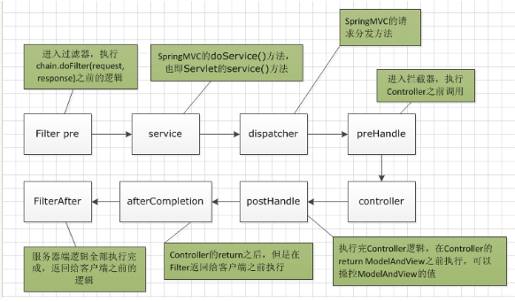
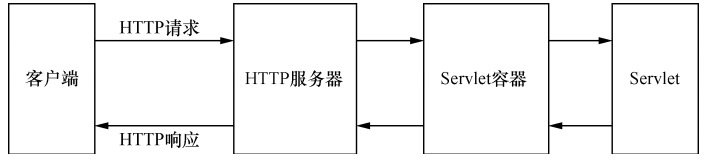
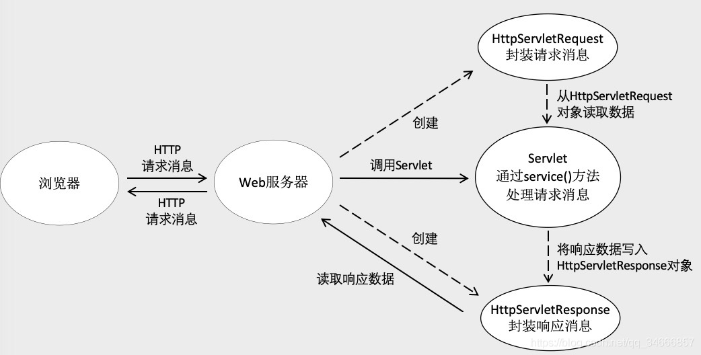

# Spring Web MVC

随时获取HttpServletRequest对象

```
HttpServletRequest request = ((ServletRequestAttributes) RequestContextHolder
        .getRequestAttributes()).getRequest();
```

RequestContextHolder为什么能获取到当前的HttpServletRequest
HttpServletRequest是在什么时候设置到RequestContextHolder

https://zhuanlan.zhihu.com/p/24293062


对于第1个问题，熟悉ThreadLocal的人应该很容易看出来这个是ThreadLocal的应用，这个类的原理在上一篇博文(ThreadLocal原理)有讲到，其实很类似上篇博文文末提到的UserContextHolder。
第2个问题应该属于spring-mvc的问题，这个是在spring-mvc执行时设置进去的

简单看下源码，我们可以知道HttpServletRequest是在执行doService方法之前，也就是具体的业务逻辑前进行设置的，然后在执行完业务逻辑或者抛出异常时重置RequestContextHolder移除当前的HttpServletRequest。




## HttpServletResponse




请求流程：

- 客户端接收一个请求
- Web服务器根据请求的路径将请求转交给对应的Servlet容器
- Servlet容器根据对应的虚拟路径来加载servlet，如果Servlet没有被实例化，则调用`init()`方法
- Servlet容器根据用户的http请求，创建一个ServletRequest，和一个可以对HTTP请求进行响应的ServletResponse对象，然后调用HttpServlet中重写的`service(ServletRequest req, ServletResponse res)`方法，并在这个方法中，将`ServletRequest`、`ServletResponse`这两个对象向下转型，得到我们非常熟悉的HttpServletRequest和HttpServletResponse两个对象，然后将客户端的请求转发到HttpServlet中`protected`修饰的`service(HttpServletRequest req, HttpServletResponse resp)`
- service(HttpServletRequest req, HttpServletResponse resp)根据请求的method（get、post、put、delete、head、options、trace）来调用不同的方法，如doGet、doPost
- 服务端处理完Http的请求后，根据HttpServletResponse对象将处理结果作为Http响应返回给客户端





设置状态码

可以通过HttpServletResponse来设置状态码

- `void setStatus(int sc)`

  设置给此次客户端相应的响应码

- `void sendError(int sc)`

  使用指定的响应码向客户端返回一个错误响应，并且清空缓冲区


响应

- `ServletOutputStream getOutputStream()`

  返回一个适合写入二进制数据ServerOutputStream对象，并通过`flush()`提交这次响应。

- `PrintWriter getWriter()`

  


Spring MVC流程

- 使用@Controller注解表示这个类是一个Handler


## 参数绑定

Spring中，提交请求是通过方法的形参来接受数据的。

Spring MVC后期使用converter进行任意类型的转换

Spring MVC提供很多的converter，在特殊情况下需要自定义converter

Spring MVC有支持的默认参数类型，我们直接在型参上给出这些默认类型的声明就可以了

- HttpServletRequest
- HttpServletResponse
- HttpSession
- Model/ModelMap

### JSON进行交互

两种交互模式：


请求的是json串

- 需要@RequestBody将json串转化成java对象
- @ResponseBody将java对象转换成json串输出


请求的是key/value

- 不需要@RequestBody
- @ResponseBody将java对象转换成json串输出

最终都要输出json数据为了在前端页面方便对请求结果进行解析。


## 过滤器拦截器

- 过滤器是servlet规范中的一部分
- 拦截器是Spring MVC自己的


自定义拦截器（实现HandlerIntercepor接口）

```java
**
 * 自定义拦截器
 *      1.实现HandlerInterceptor
 *      2.继承抽象父类 ：HandlerInterceptorAdapter
 */
public class MyIntercetpor01 implements HandlerInterceptor {


   /**
    *  handler ：处理器（控制器） = controller对象
    *      preHandle ：处理请求的（再调用controller对象方法之前执行）
    *                ：对请求进行放行（继续执行进入到方法）
    *                ：对请求过滤
    *      返回值：true = 放行
    *             false = 过滤
    *
    */
   public boolean preHandle(HttpServletRequest request, HttpServletResponse response, Object handler) throws Exception {
      System.out.println("执行MyIntercetpor1111111的preHandle方法");
      return true; //放行
   }


   /**
    *  postHandle  调用控制器方法之后执行的方法
    *            ：处理响应的
    */
   public void postHandle(HttpServletRequest request, HttpServletResponse response, Object handler, ModelAndView modelAndView) throws Exception {
      System.out.println("执行MyIntercetpor1111111的postHandle方法");
   }


   /**
    *  afterCompletion ：
    *      整个请求处理完毕，在视图渲染完毕时回调，一般用于资源的清理或性能的统计
    * 			在多个拦截器调用的过程中,
    * 				afterCompletion是否取决于preHandler是否=true
    *
    */
   public void afterCompletion(HttpServletRequest request, HttpServletResponse response, Object handler, Exception ex) throws Exception {
      System.out.println("执行MyIntercetpor1111111的afterCompletion方法");
   }
}
```


## References

- https://www.cnblogs.com/ysocean/p/7425861.html
- https://blog.csdn.net/AdamCafe/article/details/91358569