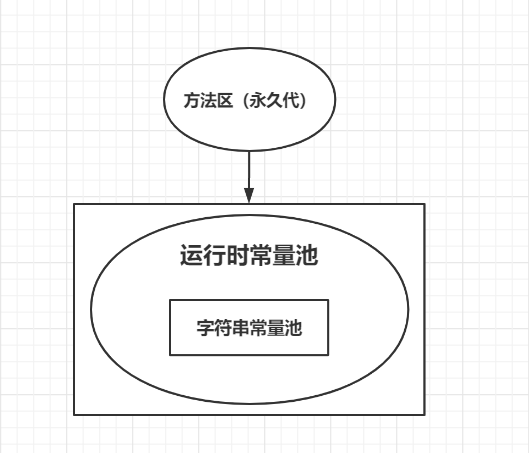
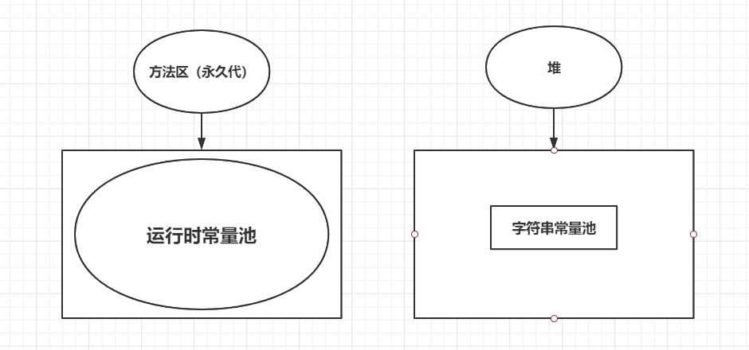
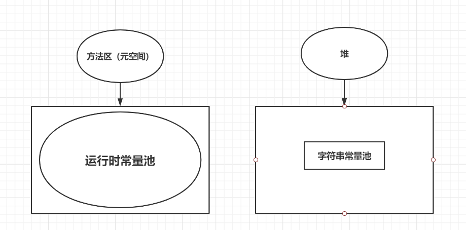

# 常量池

Java常量池分为三类：

- Class类文件常量池
- 运行时常量池
- 字符串常量池

## Class类文件常量池

Java文件被编译成Class文件，Class文件中除了包含类的版本，方法，字段，接口等信息外，还有一项就是Class常量池，用于存放编译期生成的各种字面量与符号引用。

Class常量池中主要存放两大类常量：

- 字面量

  - 文本字符串
  - 被声明为final的常量值

- 符号引用

  编译原理方面的概念，主要包括：

  - 类和接口的权限定名
  - 字段名称、描述符
  - 方法名称、描述符、句柄、描述符
  - ...

例如我们创建如下类：

```java
public class ConstantPool {
    public String s = "Hello World";
    private final int i = 100;

    public ConstantPool(String s){
        this.s = s;
    }

    public void print(){
        System.out.println(s);
        System.out.println(i);
    }
}
```

编译后执行`javap`：

```
$ javac ConstantPool.java
$ javap -v ConstantPool
```

得到如下输出：

```
Classfile /Users/wujunnan/project/JavaSE-demo/src/main/java/pers/wujn/javase/virtual/ConstantPool.class
  Last modified 2022-7-10; size 592 bytes
  MD5 checksum 6dccd09fac7996b0e4f5776340cecb88
  Compiled from "ConstantPool.java"
public class pers.wujn.javase.virtual.ConstantPool
  minor version: 0
  major version: 52
  flags: ACC_PUBLIC, ACC_SUPER
Constant pool:
   #1 = Methodref          #9.#24         // java/lang/Object."<init>":()V
   #2 = String             #25            // Hello World
   #3 = Fieldref           #7.#26         // pers/wujn/javase/virtual/ConstantPool.s:Ljava/lang/String;
   #4 = Fieldref           #7.#27         // pers/wujn/javase/virtual/ConstantPool.i:I
   #5 = Fieldref           #28.#29        // java/lang/System.out:Ljava/io/PrintStream;
   #6 = Methodref          #30.#31        // java/io/PrintStream.println:(Ljava/lang/String;)V
   #7 = Class              #32            // pers/wujn/javase/virtual/ConstantPool
   #8 = Methodref          #30.#33        // java/io/PrintStream.println:(I)V
   #9 = Class              #34            // java/lang/Object
  #10 = Utf8               s
  #11 = Utf8               Ljava/lang/String;
  #12 = Utf8               i
  #13 = Utf8               I
  #14 = Utf8               ConstantValue
  #15 = Integer            100
  #16 = Utf8               <init>
  #17 = Utf8               (Ljava/lang/String;)V
  #18 = Utf8               Code
  #19 = Utf8               LineNumberTable
  #20 = Utf8               print
  #21 = Utf8               ()V
  #22 = Utf8               SourceFile
  #23 = Utf8               ConstantPool.java
  #24 = NameAndType        #16:#21        // "<init>":()V
  #25 = Utf8               Hello World
  #26 = NameAndType        #10:#11        // s:Ljava/lang/String;
  #27 = NameAndType        #12:#13        // i:I
  #28 = Class              #35            // java/lang/System
  #29 = NameAndType        #36:#37        // out:Ljava/io/PrintStream;
  #30 = Class              #38            // java/io/PrintStream
  #31 = NameAndType        #39:#17        // println:(Ljava/lang/String;)V
  #32 = Utf8               pers/wujn/javase/virtual/ConstantPool
  #33 = NameAndType        #39:#40        // println:(I)V
  #34 = Utf8               java/lang/Object
  #35 = Utf8               java/lang/System
  #36 = Utf8               out
  #37 = Utf8               Ljava/io/PrintStream;
  #38 = Utf8               java/io/PrintStream
  #39 = Utf8               println
  #40 = Utf8               (I)V
...
SourceFile: "ConstantPool.java"
```

## 运行时常量池

运行时常量池（Runtime Constant Pool）是方法区的一部分。上面提到的Class类文件常量池表，在类加载后存放在方法区运行时常量池。

运行时常量池具有动态性，还可以在运行期间将新的常量放入池中。

## 字符串常量池

字符串常量池（String Pool），JVM为了提升性能，避免字符串的重复创建，维护了一块特殊的内存空间，即字符串常量池。

字符串常量池是虚拟机层面的，在代码层面只有String的`intern()`方法，如果该string已经在字符串常量池中存在，那么就直接返回常量池中的字符串对象，否则，就在字符串常量池中创建该字符串对象，然后返回其地址。

不通版本下字符串常量池的位置：

- JDK6及之前

  

- JDK7

  原本存放在永久代的字符串常量池被移至Java堆之中。

  

- JDK8

  无永久代，运行时常量池在元空间。

  

## 包装类常量池技术

上述提到的字符串常量池是虚拟机层面实现的，另外大部分基本类型的包装类都在代码层面实现了常量池。

例如Integer，我们知道自动装箱和拆箱这个语法糖，即：

```java
Integer a = 1;
int b = a;
```

即会被优化为：

```java
Integer a = Integer.valueOf(1);
int b = a.intValue();
```

Integer的`valueOf()`方法：

```java
public static Integer valueOf(int i) {
    if (i >= IntegerCache.low && i <= IntegerCache.high)
        return IntegerCache.cache[i + (-IntegerCache.low)];
    return new Integer(i);
}
```

```java
private static class IntegerCache {
    static final int low = -128;
    static final int high;
    static final Integer cache[];

    static {
        // high value may be configured by property
        int h = 127;
        String integerCacheHighPropValue =
            sun.misc.VM.getSavedProperty("java.lang.Integer.IntegerCache.high");
        if (integerCacheHighPropValue != null) {
            try {
                int i = parseInt(integerCacheHighPropValue);
                i = Math.max(i, 127);
                // Maximum array size is Integer.MAX_VALUE
                h = Math.min(i, Integer.MAX_VALUE - (-low) -1);
            } catch( NumberFormatException nfe) {
                // If the property cannot be parsed into an int, ignore it.
            }
        }
        high = h;

        cache = new Integer[(high - low) + 1];
        int j = low;
        for(int k = 0; k < cache.length; k++)
            cache[k] = new Integer(j++);

        // range [-128, 127] must be interned (JLS7 5.1.7)
        assert IntegerCache.high >= 127;
    }

    private IntegerCache() {}
}
```

我们可以看到Integer为`-128`到`127`（最大值可以通过属性设定）的整数都创建了默认对象，当我们自动装箱的时候，会查看传入int是否在这个范围，在的话则直接返回常量池中的对象。

类似的，`Byte`、`Short`、`Long` 这些包装类默认创建了数值 `[-128，127]` 的相应类型的缓存数据，`Character` 创建了数值在`[0,127]`范围的缓存数据。

所以在进行Integer和int之间的比较大小的时候，要避免直接使用`==`导致的自动装箱带来的问题，要调用`equal()`方法。

## References

1. 书籍：《深入理解Java虚拟机》——周志明
2. 博客：[一文彻底搞懂字符串、字符串常量池原理](https://blog.csdn.net/qq_45076180/article/details/115082348)

