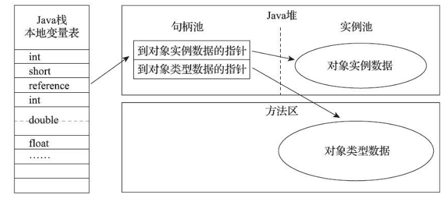

Java对象内存分配

HotSpot虚拟机中，对象在堆内存可以划分为三部分：

- 对象头
- 实例数据
- 对齐填充

## 对象头

HotSpot虚拟机对象的对象头部分包括两类信息：

- Mark Word

  用于存储对象自身运行时的数据，哈希码、GC分代年龄、锁状态标志等。

- 类型指针

  对象指向它的类型元数据的指针，Java虚拟机通过这个指针来确定对象是哪个类的实例。

## 实例数据

即我们在类中定义的各种类型的内容。

无论是父类继承的、还是子类中定义的都会被记录下来。

## 对齐填充

即占位符，HotSpot虚拟机的自动内存管理系统要求对象的大小必须是8字节的整数倍，对象头部分已经被设计为8字节的倍数，如果对象实例部分没有对齐的话，需要通过对齐填充来补全。

## 对象的访问定位

Java程序会通过栈上的reference数据来操作堆上的具体对象，Java虚拟机规范规定了它只是一个指向对象的引用，并没有定义这个引用应该怎么去定位，所以在主流的对象的访问方式中，有两种方式：

### 通过句柄访问

reference中存储的是稳定的句柄的地址，在对象被移动的时候（垃圾回收行为会经常移动对象），只会改变句柄中的实例数据指针，而reference本身不需要被修改。

### 直接通过指针访问

使用直接指针来访问最大的好处就是速度更快，由于对象访问在Java中非常频繁，因此这类开销也很可观。

## References

1. 书籍：《深入理解Java虚拟机》——周志明