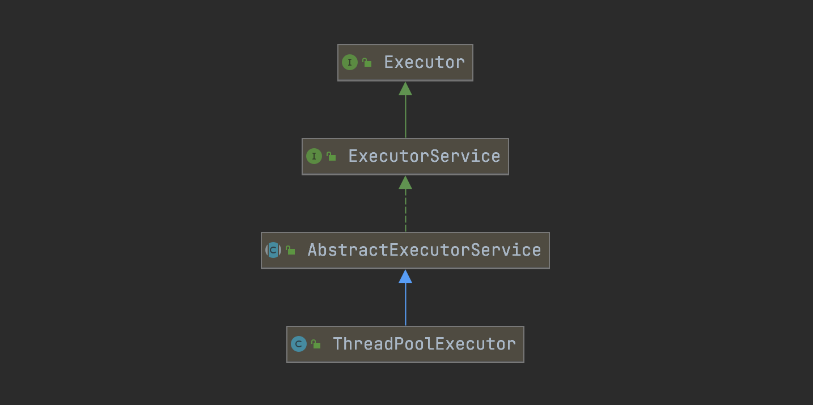
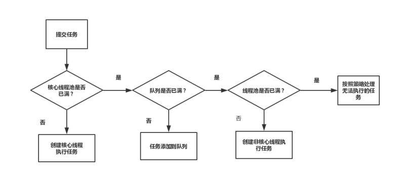
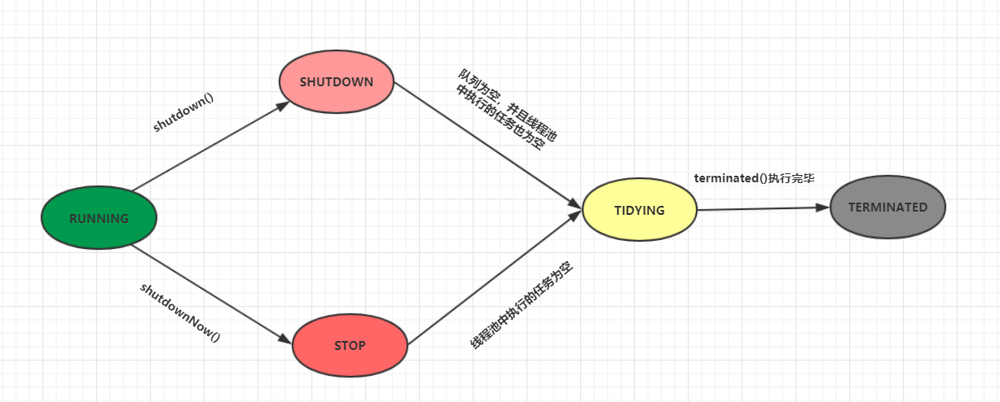

# 线程池

线程池的相关类均在jdk1.5开始的java.util.concurrent包中，涉及到的几个核心类及接口包括：Executor、Executors、ExecutorService、ThreadPoolExecutor、FutureTask、Callable、Runnable等

## 线程池架构



- Executor接口

  ```java
  public interface Executor {
      void execute(Runnable command);
  }
  ```

- ExecutorService接口

  ```java
  public interface ExecutorService extends Executor {
      // 关闭线程池，该方法执行后，拒绝接受新任务，但之前提交的任务继续执行
      void shutdown();
  
      // 立即关闭线程池，该方法执行后，停止所有正在执行及正在等待的任务，并返回等待执行的任务列表
      List<Runnable> shutdownNow();
  
      // 判断线程池是否为shutdown状态
      boolean isShutdown();
  
      // 判断线程池是否为terminated状态
      boolean isTerminated();
  
      // 在shutdown请求后，阻塞等待所有任务执行完毕
      boolean awaitTermination(long timeout, TimeUnit unit) throws InterruptedException;
  
      // 提交Callable任务
      <T> Future<T> submit(Callable<T> task);
  
      // 提交Runnable任务
      Future<?> submit(Runnable task);
      
      //...
  }
  ```
  
- ThreadPoolExecutor

  ```java
  public class ThreadPoolExecutor extends AbstractExecutorService {
      public ThreadPoolExecutor(int corePoolSize,
                                int maximumPoolSize,
                                long keepAliveTime,
                                TimeUnit unit,
                                BlockingQueue<Runnable> workQueue,
                                ThreadFactory threadFactory,
                                RejectedExecutionHandler handler) {
      }
  
      public void execute(Runnable command) {
          if (command == null)
              throw new NullPointerException();
          int c = ctl.get();
          // 如果有效线程数 < 核心线程数
          if (workerCountOf(c) < corePoolSize) {
              // 新建一个线程来处理
              if (addWorker(command, true))
                  return;
              c = ctl.get();
          }
          // 有效线程数 >= 核心线程数
          // 如果是运行状态，则将其放入工作队列
          if (isRunning(c) && workQueue.offer(command)) {
              int recheck = ctl.get();
              // 再次检查
              if (! isRunning(recheck) && remove(command))
                  reject(command);
              else if (workerCountOf(recheck) == 0)
                  addWorker(null, false);
          }
          //工作队列已满，新建非核心线程，若失败则执行拒绝策略
          else if (!addWorker(command, false))
              reject(command);
      }
  
      //...
  }
  ```

## ThreadPoolExecutor

参数解释：

- corePoolSize

  核心线程数：也没有用的时候，也不会被回收

- maximumPoolSize

  最大线程数

- keepAliveTime

  线程池中最大线程数的存活时间大小

- unit

- workQueue

  - ArrayBlockingQueue

    有界阻塞队列，使用数组实现。

  - LinkedBlockingQueue

    基于链表结构的阻塞队列 ，按FIFO排序任务，容量可以选择设置，不设置的话，将是一个无界阻塞队列，最大长度为`Integer.MAX_VALUE`，newFixedThreadPool线程池使用了这个队列。

  - DelayQueue

    延迟队列，是一个任务定时周期的延迟执行的队列，根据指定的执行时间从小到大排序，否则就根据插入到队列的先后排序。

    newScheduledThreadPool线程池使用了这个队列。

  - PriorityBlockingQueue

    优先级队列，是具有优先级的无界阻塞队列。

  - SynchronousQueue

    同步队列，一个不存储元素的阻塞队列，每个插入操作必须等到另一个线程调用移除操作，否则插入操作就一直处于阻塞状态，反之也一样，就是两个操作必须同步进行，newCachedThreadPool线程池使用了这个队列。

- threadFactory

- handler

  线程池的饱和策略

  - AbortPolicy
  
    抛出`RejectedExecutionException`异常，默认策略
  
  - DiscardPolicy
  
    直接丢弃任务
  
  - DiscardOldestPolicy
  
    丢弃队列里最老的任务，将当前这个任务继续提交给线程池
  
  - CallerRunsPolicy
  
    交给线程池调用所在的线程进行处理

### 执行步骤



### 默认线程池

Executors工具类，提供了常用的几种线程池

|                          | 核心线程数 | 最大线程数        | 存活时间 | 队列                |
| ------------------------ | ---------- | ----------------- | -------- | ------------------- |
| FixedThreadPool          | n          | n                 | 0        | LinkedBlockingQueue |
| SingleThreadExecutor     | 1          | 1                 | 0        | LinkedBlockingQueue |
| CachedThreadPool         | 0          | Integer.MAX_VALUE | 60       | SynchronousQueue    |
| ScheduledExecutorService | n          | Integer.MAX_VALUE | 0        | DelayedWorkQueue    |

### ThreadFactory

`ThreadFactory`是一个线程工厂，用来在创建线程的时候，设置一些线程名字，优先级等参数。

```java
public interface ThreadFactory {
    Thread newThread(Runnable r);
}
```

最简单的实现如下：

```java
class SimpleThreadFactory implements ThreadFactory {
    public Thread newThread(Runnable r) {
        return new Thread(r);
    }
}
```

当我们不指定的时候，使用的是默认的实现：

```java
static class DefaultThreadFactory implements ThreadFactory {
    private static final AtomicInteger poolNumber = new AtomicInteger(1);
    private final ThreadGroup group;
    private final AtomicInteger threadNumber = new AtomicInteger(1);
    private final String namePrefix;

    DefaultThreadFactory() {
        SecurityManager s = System.getSecurityManager();
        group = (s != null) ? s.getThreadGroup() :
        Thread.currentThread().getThreadGroup();
        namePrefix = "pool-" +
            poolNumber.getAndIncrement() +
            "-thread-";
    }

    public Thread newThread(Runnable r) {
        Thread t = new Thread(group, r,
                              namePrefix + threadNumber.getAndIncrement(),
                              0);
        if (t.isDaemon())
            t.setDaemon(false);
        if (t.getPriority() != Thread.NORM_PRIORITY)
            t.setPriority(Thread.NORM_PRIORITY);
        return t;
    }
}
```

## 线程池的状态



- `RUNNING`

  该状态的线程池会接受新的任务，并处理阻塞队列中的任务

  调用线程池的`shutdown()`方法，可以切换到SHUTDOWN状态

  调用线程池的`shutdownNow()`方法，可以切换到STOP状态

- `SHUTDOWN`

  该状态的线程池不会接受新的任务，但是会处理阻塞队列中的任务

  队列为空，并且线程池总执行的任务也空，进入TIDYING状态

- `STOP`

  该状态的线程不会接受新任务，也不会处理阻塞队列中的任务，而且会中断正在运行的任务

  线程池汇中执行的任务为空，进入TIDTING状态

- `TIDYING`

  该状态表明所有的任务已经运行终止，记录的任务数量为0

  `terminated()`执行完毕，进入TERMINATED状态

- `TERMINATED`

  该状态表示线程池彻底终止

## 如何中止线程池

`shutdown()`

## ThreadPoolTaskExecutor

```java
@Configuration
@EnableAsync
public class SpringThreadPoolExecutorConfig {

    @Bean(name = "threadPoolTaskExecutor")
    public ThreadPoolTaskExecutor threadPoolTaskExecutor() {
        ThreadPoolTaskExecutor pool = new ThreadPoolTaskExecutor();
        //线程最大空闲时间
        //除了核心线程 其他线程当超过等待时间keepAliveTime 就会进行线程移除
        pool.setKeepAliveSeconds(300);
        //核心线程池数
        pool.setCorePoolSize(2);
        //最大线程
        pool.setMaxPoolSize(5);
        //队列容量
        pool.setQueueCapacity(1000);
        //队列满，线程被拒绝执行策略
        pool.setRejectedExecutionHandler(new java.util.concurrent.ThreadPoolExecutor.CallerRunsPolicy());
        pool.setThreadNamePrefix("aaaa-common-support-service--");
        return pool;
    }
}
```

```java
@Slf4j
@Service("AAAAAService")
public class AAAAAServiceImpl implements AAAAAService {
 
	@Autowired
	private ThreadPoolTaskExecutor threadPoolTaskExecutor;
 
	@Override
	public List<String> queryUserByGivenname(String txNo, String givenname)
			throws ParamInvalidException {	
			threadPoolTaskExecutor.execute(()->{
				log.info("-------txNO[{}],givename[{}]", txNo,givenname);
			});
		
		return null;
	}
}
```

## 问题

- 在单元测试中出现`java.lang.InterruptedException: sleep interrupted`异常

  ```java
  @Test
  public void test01() throws InterruptedException {
    threadPoolTaskExecutor.execute(() -> {
      try {
        Thread.sleep(2000);
      } catch (InterruptedException e) {
        e.printStackTrace();
      }
    });
  }
  ```

  会跑出中断异常，是因为单元测试的主线程提前结束，主线程强制打断子线程的sleep，因此抛出异常。由 Thread 提供并受 Thread.sleep() 和 Object.wait() 支持的中断机制就是一种取消机制；它允许一个线程请求另一个线程停止它正在做的事情。当一个方法抛出 InterruptedException 时，它是在告诉您，如果执行该方法的线程被中断，它将尝试停止它正在做的事情而提前返回，并通过抛出 InterruptedException 表明它提前返回。 行为良好的阻塞库方法应该能对中断作出响应并抛出 InterruptedException，以便能够用于可取消活动中，而不至于影响响应。

https://www.jianshu.com/p/ff79dc168e1a


## References

- 博客：[线程池大小设置和CPU核心数的关系](https://blog.csdn.net/u011436427/article/details/103744149)

