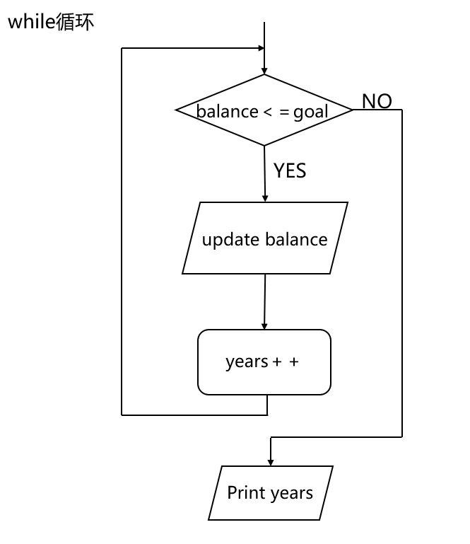

# 1. java简介

## 1.1 什么是Java

### Java发展简史

1991年，Sun公司的一个工程师小组想要设计一种小型的计算机语言，主要用于有线电视这类设备，要求语言非常小并且于不同的CPU适配，这个项目被命名为”Green“

由于有UNIX应用背景，所开发的语言以C++为基础

1992年Green项目发布了第一个产品，Sun公司不感兴趣，市场也处处碰壁

后来万维网日渐壮大，需要浏览器，Java开发者发现Java很适合用来开发浏览器，后推出HotJava浏览器，此浏览器还可以执行内嵌的Java代码，从此引发了人们延续至今对Java的狂热追逐

1996年初，Sun发布了第一个Java版本，Java1.0

1998年推出了Java2.0，除了标准版（SE），还推出了用于嵌入式设备的微型版（ME）企业版（EE)

2004年发布5.0

2009年Sun公司被Oracle收购

## 1.2 Java的特性（11个）

**简单性 面向对象 分布式 健壮性 安全性 体系结构中立 可移植性 解释型 高性能  动态性** 

**简单性**

发现C++不太适用，但设计的时候还是尽可能的接近C++，Java剔除了C++中很少使用的，难以理解的，容易混淆的概念，所以Java是C++的”纯净“版本

简单的另一方面是小，现在有一个独立的Java微型版（Java Micro Edition）JME

**面向对象**

面向对象的重点放在数据和对象的接口上

**健壮性**

Java编译器能够检测出很多其他语言在运行时才能检测出的情况

**多线程**

Java是第一个支持并发程序设计的主流语言

# 2. Java程序设计环境

## 2.1 JRE，JDK，JVM

JRE（Java Runtime Environment)

JDK (Java Development Kit)

JVM (Java Vitrtual Machine)

JDK：包括JRE和bin文件夹，bin文件夹中又有java,javac等开发工具，不同操作系统拥有不同的JDK

JRE：用来运行代码，包括JVM和运行需要的一些东西

JVM：用来翻译代码的，也是代码真正运行的地方

Java源代码，JDK，JRE都不是跨平台的，Java的跨平台性指的是，Java程序可以在不同的操作系统上运行，前提是操作系统安装了对应的JVM

## 2.2 为什么及如何设置环境变量

我们想要在任意文件夹中运行Java代码，那就要求我们在任意文件夹都可以调用javac和java，这就需要我们配置环境变量

**我们在命令行当中，输入命令之后，如果在当前文件夹下没有找到，他就会到Path环境变量当中去查找，看有没有你所需要的执行程序**

右键点击我的电脑，选择属性，再选择高级系统设置，在高级当中，选择化境变量，新建JAVA_HOME，变量值就写JDK的安装路径，然后在PATH里面，%JAVA_HOME%\bin

JAVA_HOME是一个约定的变量，通常是指JDK的目录，如果需要JDK的话，大部分程序，就会去环境变量中取JAVA_HOME这个变量，例如Tomcat。（而且下次修改盘符不需要再次修改Path变量）

如果是用别人的电脑，不想要修改别人的环境变量

打开CDM，**set path**命令

Path = bin目录，那么这个path就只存在于这个控制台窗口

 **set path =**  删除path变量的值

如果想要在	path中加路径，那就 set path = bin路径；%path% 动态调用path，那么原始系统中的path也会被保存

**ClassPath**

先看看ClassPath里面配置了什么路径

`.;%JAVA_HOME%\lib\dt.jar;%JAVA_HOME%\lib\tools.jar`

第一个"."，这个代表当前目录

rt.jar是JAVA基础类库，dt.jar是关于运行环境的类库，tools.jar是工具类库 设置在classpath里是为了让jvm能根据路径找到这些所需的依赖。

CLASSPATH环境变量。作用是指定类搜索路径，要使用已经编写好的类，前提当然是能够找到它们了，JVM就是通过CLASSPATH来寻找类的.class


## 2.3 CMD

# 3. Java的基本程序设计结构

## 3.1 简单的Java程序

```java
public class FirstSample{
    public static void main(String[] args){
        System.out.println("Hello World");
    }
}
```

关键字public被称为访问修饰符（access moddifier)

FirstSample为类名

String[] args参数

这个参数说明main方法将接受一个字符串数组，也就是命令行上指定的参数

```java
public class Message{
    public static void main(String[] args){
        if(arr.length == 0||args[0].equals("-h"))
            System.out.print("Hello,");
        else if (args[0].equals("-g"))
            System.out.print("Goodbye,");
        for(int i = 0;i<=arg.length;i++)
            System.out.print(" " + args[i]);
        System.out.print("!");
     }
}
//java message -g cruel world
//输出如下值，Goodbye,crul world!
```

一定需要传入String[]类型的参数，参数名可以自己取，但是，公认的main中的参数名是args(参数 arguments)

**分号**

在Java中，每个句子必须以分号结束，**回车不是语句结束的标志**，所以一条语句可以写在多行上，整个Java也能写在一行，既然Java中回车不是语句的结束标志，那么分号就非常重要了

Java类后面不需要加分号，但是，C++中的类后面需要加分号，所以Java类后加了分号也不会错

**点**

点号用于调用方法，Java使用的通用语法是

object.method(parameters)

## 3.3 数据类型

Java是一种强类型语言，这就意味着必须为每一个变量声明一种类型

### 基本数据类型

Java中，一共有八种基本数据类型，4个整型，2个浮点型，1个字符型

| 类型   | 储存需求 | 取值范围      |
| ------ | -------- | ------------- |
| byte   | 1字节    | -128~127      |
| short  | 2字节    | -32768        |
| int    | 4字节    | -21亿~21亿    |
| long   | 8字节    | 千万万亿      |
| float  | 4字节    | 有效位数6~7位 |
| double | 8字节    | 有效位数15位  |

Java中常见数据类型其范围从上到下依次增加

长整数值后有一个后缀L或l；float类型的数值后面有一个F或f

16进制有一个前缀0x或0X，八进制前有一个前缀0，从Java7开始，加上前缀0b或0B就可以写二进制数字

**char类型**  

**长度2个字节**  范围：从字符型对应的整数型来划分其表示范围是0~65535

常见char类型对应的数字：

​	'a' --- 97---‭01100001‬

​	'A' --- 65---‭01000001‬

​	'0' --- 48---‭00110000‬

字符什么时候会去查询ASCII码表？

1. 字符参与运算

2. 字符赋值给整数类型的变量，或者赋值给小数类型的变量

   ```java
   //字符参与运算的时候，就需要查询ASCII
   int i = 1;
   char c = 'a';
   System.out.println(i+c); //98
   //字符的值赋值给int类型
   int a ='a';
   System.out.println(a); //97
   
   double d = 'a'; //97.0
   //首先先查码表，变成97，再把97赋值给double,最终变为97.0
   
   System.out.println((char)('a'+1)); //结果为b
   
   ```


如何将char类型的数组转换为int类型的而不是ASCII

```java
char c = '5'
int i1 = c-'0'; //5
int i2 = c      //53
```

先来回答第一个问题。char一定是两个字节吗?不是的，这个跟我们选用的字符编码有关，如果采用”ISO-8859-1”编码，那么一个char只会有一个字节。如果采用”UTF-8”或者“GB2312”、“GBK”等编码格式呢?这几种编码格式采用的是动态长度的，如果是英文字符，大家都是一个字节。如果是中文，”UTF-8”是三个字节，而”GBK”和”GB2312”是两个字节。而对于”unicode”而言，无论如何都是两个字节


### String类

- String属于java.lang.String类 对于lang这个包下的类, 无需导包, 就可以直接使用

- 每个用大括号括起来的字符串都是String类型的一个实例

- 字符串是常量, 它们的值在创建之后不能被修改,字符串缓冲池支持可变的字符串, 因为String对象是不可变的, 所以可以共享

- 字符串的底层就是一个数组, 数组被final修饰, 数组的地址不能修改, 所以字符串是一个常量 `private final char value [ ];`
- `String s = "abc";` 底层把字符串存储到一个字符数组中 `new char [ ]{'a', 'b', 'c'};`

- 字符串可以和任意类型进行拼接，因为任何一个Java对象都可以转换成字符串类型

**String类的构造器**

1. `String()` 空参数构造方法

2. `String(String original)` 参数是一个字符串的构造方法,把字符串转换为String对象

3. `String(char[] value)` 参数是一个字符数组的构造方法,把字符数组转换为String对象

4. `String(char[] value, int offset, int count)` 参数是一个字符数组一部分的构造方法,把字符数组的一部分转换为String对象

   int offset: 数组的开始索引
   int count: 转换的个数

5. `String(byte[] bytes)` 参数是一个字节数组的构造方法,把字节数组转换为String类
      通过使用平台(操作系统)的默认字符集(操作系统的编码)解码指定的 byte 数组，构造一个新的 String。
      根据编码表查询字节对应的编码,把字节转换为字符串
      编码表: IO流 生活中的文字和计算机文字的一个对应关系表(ASCII)
      0==>48==>计算机只能识别二进制==>00110000 存储到计算机中
      A==>65==>1000001 存储到计算机中
      a==>97==>1100001 存储到计算机中

6. `String(byte[] bytes, int offset, int length)` 参数是一个字节数组一部分的构造方法,把字节数组的一部分转换为String对象
   int offset: 数组的开始索引
   int length: 转换的个数

**String类的内存图**


String的补充

```java
public class TestStringDemo { 
     public static void main(String[] args) {
         String s1 = "Programming";
         String s2 = new String("Programming");
         String s3 = "Program";
         String s4 = "ming";
         String s5 = "Program" + "ming";
         String s6 = s3 + s4;
         System.out.println(s1 == s2);
         System.out.println(s1 == s5);
         System.out.println(s1 == s6);     
     }
}

//false
//true
//false
```

我们可以用以下命令获得.class文件对应的JVM字节码指令

```
javap -c StringEqualTest.class
```

我们通过对比知道，String s5 = "Program" + "ming";在被编译器优化成了String s5 = "Programming"; 

```
有一个东西叫做常量折叠，是一种编译器优化技术。
就是对于 String s1 = "1" + "2"; 编译器会给你优化成 String s1 = "12";
在生成的字节码中，根本看不到 "1" "2" 这两个东西。

String s1="a"+"bc";
String s2="ab"+"c";
s1==s2的结果是true
```

也可以得出字符串常量相加，不会用到StringBuilder对象，有一点要注意的是：字符串常量和字符串是不同的概念，字符串常量储存于方法区，而字符串储存于堆(heap)。

第三个输出：false ;通过以上的分析，自然也就明白了为什么是false了

1. 使用new 了StringBuider对象
2. 进行StringBuider对象初始化
3. 使用append() 方法拼接s3的内容
4. 再使用append() 方法拼接s4的内容
5. 最后调用toString() 返回String对象

两个或者两个以上的字符串常量相加，在预编译的时候“+”会被优化，相当于把\**两个或者两个以上字符串常量自动合成一个字符串常量

**字符串的+操作其本质是new了StringBuilder对象进行append操作，拼接后调用toString()返回String对象**


**String类中常用的成员方法**

**判断功能的方法**

- `public boolean equals(Object anobject)`将此字符串与指定对象进行比较
- `public boolean equalsIgnoreCase(Spring anotherString)`将此字符串与指定对象进行比较, 忽略大小写
- `public boolean contains(CharSequence s)`判断参数字符串在当前字符串中是否存在(区分大小写) 
- `pulblic boolean endsWith(String suffix)`判断字符串是否以指定的后缀结尾(区分大小写)
- `public boolean starsWith(String prefix)`判断此字符串是否以指定的前缀开始(区分大小写)

**获取功能的方法**

- `public int length()`返回此字符串的长度

- `public String concat(String str)` 将指定的字符串连接到该字符串末尾

- `public char charAt(int index)`返回索引处的char值

- `public int indexOf(String str)`返回指定字符串第一次出现在该字符串内的索引

- `public int lastIndexOf(String str)`返回指定字符串最后一次出现在该字符串内的索引

  注意: 如果大的字符串中有重复的被查找的字符串,找到第一个就不在找了
         "abcAAAabc"==>查找"abc"==>indexOf(从前往后找)==>0
         "abcAAAabc"==>查找"abc"==>lastIndexOf(从后往前找)==>6

- `public String substring(int beginIndex)`返回一个字符串,从beginIndex开始截取字符串到字符串结尾

- `public String substring(int beginIndex, int endIndex)`返回一个字符串, 从beginIndex到endIndex截取字符串

  注意:包含beginIndex而不包含endIndex

**转换功能的方法**

- `public char[] toCharArray()`将此字符串转换为新的字符数组
- `public byte[] getBytes()`使用平台的默认字符集将String所有字符转换为新的字节数组
- `public String toLowCase()`使用默认语言环境的规则将此String编码转换为小写
- `public String toUpperCase()`使用默认语言环境将此String转换成为大写
- `public String replace(CharSequence target, CharSequence replacement) `将target匹配的字符串使用replacement字符串替换

**分割功能的方法**

- `public String[] split(String regex)`将此字符串按照给定的规则(regex)拆分为字符串数组

  ```java
  String s1 = "a-b-c";
  String[] arr1 = s1.split("-");//根据-把字符串切割为3部分,存储到数中
  String[] arr2 = "a,b,c".split(",");
  
  String[] strings = str.split("\\.");//想要用点分割,需要这样
  ```

- `public String trim()`去掉当前字符串的前后空格,并返回一个新的字符串,原字符串不变

  ```java
  if("jack".equals(username.trim())){
      System.out.println("你输入的用户名已经被注册!");
  }else{
      System.out.println("您输入的用户名可以使用!");
  }
  ```

**练习**

```java
//需求:键盘录入一个字符串, 统计字符串中的大小写字母,数字字符及其他字符个数 "abc123AAAAaaa@#aa"
public class StringDemo {
    public static void main(String[] args) {
        //键盘接收一个字符串
        Scanner sc = new Scanner(System.in);
        System.out.println("请输入一个字符串");
        String str = sc.nextLine();
        //统计字符串中大小写字母及数字字符的个数
        //1. 将这个字符串转换为一个数组
        char[] arr = str.toCharArray();
        //对arr进行遍历
        int upper = 0;
        int lower = 0;
        int num = 0;
        int other = 0;
        for (int i = 0; i < arr.length; i++) {
            //如何判断获取的字符是哪一种***
            char c = arr[i];
            if(c>='0' && c<='9'){
                num++;
            }
            else if(c>='a'&&c<='z'){
                lower++;
            }
            else if(c>='A'&&c<='z') {
                upper++;
            }
            else{
                other++;
            }
        }
        System.out.println("这个字符串中有"+num+"个数字"+", 这个字符串中有"+lower+"个小写字母"+", 这个字符串中有"+upper+"大写字母"+", 这个字符串中有"+other+"其他字符串");
    }
}
```

#### StringBuilder类

- 字符串是常量; 它们的值在创建之后不能被修改, 字符串缓冲区支持可变的字符串

- StringBuilder: 底层也是一个数组但是没有被final修饰, 地址的值是可以改变的

  `char[] value = new char [capacity]; `capacity: 数组默认的初始化值是16

- StringBuilder 可以看成一个长度可变的数组, 如果里面数组没有存储满, 可以继续存储, 如果里面的数据超出了默认的范围, 那么StringBulider会自动扩大, 把容量扩大

- 使用StringBuilder进行字符串相加, 在内存中始终使用的是一个数组对象, 占用内存少, 效率高

**构造方法**

-  `public StringBuilder()`构造一个空的StringBuilder容器

-  `public StringBuilder(String str)`构造一个StringBuilder容器，并将字符串添加进去

**常用的方法**

- `public StringBuilder append(...)`添加任意类型数据的字符串形式，**并返回当前对象自身**
- `StringBuilder reverse() `将此字符序列用其反转形式取代 即 abc  cba

链式编程: append方法的返回值就是StringBuilder本身, 所以可以继续调用append方法

```java
 b1.append("abc").append(123).append('#').append(8.8).append(true).append(false);
```

StringBuilder已经覆盖重写了Object当中的toString方法

**StringBuilder和String相互转换**

- StringBuilder转换为String

  `public String toString();`通过toString()就可以实现把StringBuilder转换为String

- String转换为StringBuilder

  `public StringBuilder(String s);`通过构造方法就可以实现把String转换为StringBuilder

注意:

- StringBuilder的两个方法返回的是对象本身,  即这个字符串是可以修改的

- 比较字符串的时候, 不要使用`StringBuilder.equals`方法, 这个方法是将两个对象进行比较, 比较的是地址的值, 当你new两个StringBuilder的时候, 是在堆内存中, 建立了两个不同的对象, 所以, 在使用equals的方法的时候, 我们可以看到返回false, 我们需要把StringBuilder转换为String类型的, 再调用equals方法.

  ```java
  StringBuilder a=new StringBuilder("abc");
  StringBuilder b=new StringBuilder("abc");
  String c="abc";
  String d="abc";
  
  System.out.println(a.equals(b));  //false
  System.out.println(c.equals(d));  //true
  ```


### 基本数据类型与字符串之间的转换

**基本数据类型转字符串**

1. 基本数据类型的值+"": 工作 中最常用 1+"" ==> "1"

2. 使用包装类中的静态方法 toString

   `static String toString(int i)` 返回一个表示 指定整数的String对象

3. 使用String类中的静态方法 valueOf 

   `static String valueOf(int i)` 返回int参数的字符串表示形式

**字符串类型转换基本数据类型**

包装类中有一个, 方法叫做 parseXXX , 可以把字符串格式的基本数据类型的值, 转换为基本数据类

Interger类: `static int parseInt(String s)`

Double类: `static double parseDouble(String s)`

注意: 

- 除了Character类之外, 其他所有的包装类都具有parseXXX的静态方法
- 那么字符串怎么转换为char型, 使用toCharArray变成字符串数组, 使用charAt方法取出字符串中指定字符,
- parseXXX方法参数必须传递基本数据类型的字符串, 否则会抛出数字格式化异常 

```java
String s1 = 1+"";
System.out.println(s1+10);//110 字符串连接

//b.使用包装类中的静态方法toString
String s2 = Integer.toString(10);
System.out.println(s2+10);//1010

//c.使用String类中的静态方法valueOf
String s3 = String.valueOf(100);
System.out.println(s3+10);//10010

//2.字符串类型==>基本数据类型数据(非常重要)
int a = Integer.parseInt("100");
System.out.println(a+100);//200

double d = Double.parseDouble("1.1");
System.out.println(d+1);//2.1

//int abc = Integer.parseInt("abc");//NumberFormatException: For input string: "abc"

//把字符串转换为char类型
char c = "a".charAt(0);
System.out.println(c);

char[] chars = "abcde".toCharArray();
```

### 引用数据类型

引用类型可以作为成员变量, 作为方法的参数, 作为方法的返回值, 以下都是引用类型作为成员变量

```java
int[] arr = new int[10]; 
Student s = new Student(); 
ArrayList<String> list = new ArrayList<String>();
MyInter m = new MyInterImpl();
Animal a = new Cat(); 
```

**类名作为参数和返回值**

```java
public class Demo01Student {
    public static void main(String[] args) {
    //调用show01方法,创建对象为方法的形式参数s赋值
    show01(new Student());
	//调用getInstance方法,获取返回的学生对象
    Student s = getInstance();
    s.eat();
	}
	
	//定义一个方法,方法的返回值类型使用Student类型
	public static Student getInstance(){
    return new Student();
	}


    //定义一个方法,方法的参数使用Student类型
	public static void show01(Student s){
    s.eat();
	}
}
```
**抽象类作为方法参数和返回值**

```java
public abstract class Animal {
    public abstract void eat();
}
```

```java
public class Demo01Animal {
    public static void main(String[] args) {
        //调用show方法,参数是Animal类型,可以传递Animal的任意子类对象
        show(new Cat());
        show(new Dog());
        show(new Animal() {
            @Override
            public void eat() {
                System.out.println("匿名的动物在吃饭!");
            }
        });
        System.out.println("--------------------");
        Animal a = getAnimal(1);
        a.eat();
        a = getAnimal(2);
        a.eat();
        a = getAnimal(100);
        a.eat();
    }

    /*
        定义一个方法,方法的返回值类型使用Animal
        方法中就可以返回Animal的任意子类对象
     */
    public static Animal getAnimal(int a){
        if(a==1){
            return new Cat();
        }else if(a==2){
            return new Dog();
        }else{
            return new Animal() {
                @Override
                public void eat() {
                    System.out.println("匿名动物在吃饭");
                }
            };
        }
    }
    
    public static void show(Animal a){
        a.eat();
    }
}
```

**接口作为方法参数和返回值**

```java
public interface Fly {
    public abstract void fly();
}
```

```java
public class Demo01Fly {
    public static void main(String[] args) {
        //调用method方法,形式参数类型是Fly,可以传递Fly的任意实现类对象
        method(new MaQue());
        method(new Ying());
        method(new Fly() {
            @Override
            public void fly() {
                System.out.println("动物在飞翔!");
            }
        });
        System.out.println("--------------------");
        /*
            Fly a = getInstance();= new Ying();
            Fly a = getInstance();= new MaQue();
            Fly a = getInstance();= new Fly() {
                                    @Override
                                    public void fly() {
                                        System.out.println("动物在飞翔!");
                                    }
                                };
         */
        Fly a = getInstance();
        a.fly();
    }

    /*
        定义一个方法,方法的返回值类型使用Fly接口
        在方法中可以返回Fly接口的任意的实现类对象
     */
    public static Fly getInstance(){
        //return new Ying();
        //return new MaQue();
        return new Fly() {
            @Override
            public void fly() {
                System.out.println("动物在飞翔!");
            }
        };
    }

    /*
        定义一个方法,方法的参数使用Fly接口类型
        多态:
            Fly f = new MaQue();
            Fly f = new Ying();
            Fly f = new Fly() {
                @Override
                public void fly() {
                    System.out.println("动物在飞翔!");
                }
            };
     */
    public static void method(Fly f){
        f.fly();
    }
}
```


## 3.4 变量与常量

常量：就是值不变的变量

声明变量：

```Java
double salary;
boolean done;

//也可以多个值同时赋值
int a,b,c;
a=b=c=3;
```

每个声明都以分号结束，而且声明是一个完整的Java语句，所以这里的分号是必须的

变量的初始化：

变量的

声明一个变量之后，必须用赋值语句对变量进行初始化，使用未初始化的变量将会报错

声明变量可以放再Java 的任何地方，但是尽可能的靠近变量第一次使用的地方，这是良好的编程习惯

### 标识符的命名规则

1. 有数字，字母，下划线，美元符组成
2. 不能以数字开头
3. 不能使用Java保留字作为变量名
4. 区分大小写

**命名建议**

定义变量名的时候，小驼峰命名法

1. 一个单词，全部小写，如name
2. 多个单词，第二个开始首字母大写，如maxAge

定义类名的时候，大驼峰命名法

1. 一个单词首字母大写，如Demo
2. 多个单词，每一个单词首字母大写，如HelloWorld


## 3.5 运算符

### 算数运算符

我们使用 + - * / 来表示加减乘除

**除法**

当运算的两个操作数都是整数的时候，表示整数除法；否则表示浮点除法

10 .0/2 = 5.0  10.00/2 = 5.0   10.0/3=3.3333333333333333  

2.0 - 1.1 = 0.8999999999999999

### 数据类型之间的转换

**隐式转换**

取值范围小的---取值范围大的(都不会出问题)

1. 在直接赋值和两个不同的运算符进行运算的时候，会将取值范围小的自动升为取值范围大的，在两个不同的数据类型进行运算的时候，

2. 小的数据类型进行运算的时候，会提升为大的数据类型，但是byte，short，char ，int一起运算的时候，不管有没有其他数据类型，都会

先提升为int类型，再进行运算

**强制类型转换**

将一个大范围的（double）赋给一个小范围的（int），Java允许这种数据类型的转化，但是有可能丢失一些信息。

```java
double x = 9.997;
int nx1 = (int)x; //结果为9，强制类型转换通过截取小数部分将浮点型转换成整型

int nx2 = (int)Math.round(x); //四舍五入，需采用math的round方法，结果为10

int i = 300;
byte b1 = (byte)i;//打印b的结果为44

byte b2 = (byte)300; //结果同样是44
```

**常量优化机制**

问题：

```java
byte b = 10; //10是一个整数，默认类型为int,为什么不会报错？
```

就是因为有常量优化机制，给一个变量赋值，如果右边为常量的表达式且没有一个变量，那么就会在编译阶段计算该表达式的结果，然后判断该表达式的结果是否在左边的类型所表示的范围内，如果在，则赋值成功，如果不在，那么就赋值失败

```java
byte b1 = 1 + 2 //正常
byte b1 = 127+2 //报错
```

### 赋值运算符

可以在赋值中使用二元运算符

x+=4; 等价于 x = x+4; 

**这里面包含了一个强制转换，会强制转换成int类型**，如果x是一个int，则 x += 3.5; 如果 (int)(x+3.5)，因为这个赋值赋的是两个数的和，和的话就需要一个强制转换，不然的话不同类型的数值进行赋值会出错

### 比较运算符

比较运算符运算结果必定是个boolean值

==  注意区别 ”=“

!=

<=; >=; <; >

### 自增和自减运算符

**区分++i，i++**

```java
int a = 3, b1, b2;
b1 = a++; // b1 = 3; a = 4;
b2 = ++a; //b2 = 5; a = 5
```

b = a++; 字面理解是先把a的值赋给b，然后进行自增运算，实际内存中不是这样的，a++会先算完才会对b进行赋值，a会先在临时区域预存下来自己的值temp参与左边的运算，然后去运算区a进行自增，最后把temp给b

1. temp = a---(3)
2. a = a+1---(4)
3. b = temp---(3)

```Java
int i = 3;
i = i++;
System.out.println(i);//结果为3
```

1. temp = i---(3)
2.  i = i+1---(4)
3. i = temp---(3)

b = ++a; a与b要想计算，必须先进行中间的++运算，得到的值再赋给b，不存在临时区域

### 逻辑运算符

&  and 与

|  or 或

^  xor 异或 **相同的时候为false** 不同的时候为true 与或运算只有一个不同

！not 非

&& 双与，短路与，左边为假结果就为假，不执行右边

|| 双或，短路或，左边为真结果就为真，不执行右边

双与和与的运算结果是一样的，

### 位运算符

& 

6&3 = 2

​    110---0000-0000 0000-0000 0000-0000 0000-0110  (int)型，4个字节

& 011---0000-0000 0000-0000 0000-0000 0000-0011

  \--------------------------------------------------------------------------

  010---2

<< 左移

\>> 右移

\>>> 无符号右移

```java
System.out.println(3<<2); 
```

0000-0000 0000-0000 0000-0000 0000-0011

左移高位丢弃，低位补零，左移几位就是该数据乘以2的几次方，所以左移可以承当2的次方运算

右移运算即为除法，6>>2 = 1---6/4 对于高位出现的空位，原来高位是什么就用什么补这个空位，保证符号不变

无符号右移：数据进行右移的时候，高位出现的空位，无论原高位是什么，空位都用0补

左移右移操作的都是2的倍数，2进制

1. 最有效率的方式算出 2*8等于几？

   2\*8=16 ， 2\*2(3)，2<<3，进行移位操作更加高效率

   0010 * 1000

2. 对两个整数进行交换(不需要第三方变量)

   ```java
   int a = 3,b = 5;
   a = a + b;
   b = a - b;
   a = a - b;//不建议使用，如果两个数值过大，会强制转换，损失精度
   ```

3. 

   ```java
   a = a ^ b; 
   b = a ^ b;
   a = a ^ b; //一个数异或另一个数两次还是这个数，但是阅读性太差（面试的时候用），建议使用第三方变量的形式，阅读性强
   ```

   

### 括号与运算符级别

### 三元运算符

表达式：comdition ? expression1 : expression2 （三个元素参与运算）（if...else的简化格式)

（两元运算符，+-*等两个元素参与运算的就叫二元运算符）（一元运算符，++）

如果条件为true，以上的表达式就为第一个表达式的值，否则就为第二个表达式的值

1. **第一个表达式，结果为Boolean值，剩余两个是值三元运算符必须有返回值，而if...else...不需要返回值，其执行结果可以为，赋值语句或输出语句**

2. 三元运算符的性能要高于if...else

3. 三元运算符与强制转换

   **三元运算操作必须返回一个数据，所以这个数据的数据类型必须确定**

   规则：

   1. 如果定义了数据类型的变量与未定义的数据类型的变量共同参与三元运算符的后双目运算，那么返回的结果就是范围大的数据类型

   2. 如果两个定义了的数据类型的变量，共同参与三元运算符的后双目运算，那么返回值的结果就是范围大的类型
   3. 如果直接进行数值的比较，会自动转换为范围大的数据类型 
   4. jvm给数值分配的数据类型，98并不是int型，而是byte/short,结果会变为ASCII

   **规则一：**

   ```java
       int a = 5;
       System.out.println("value is "+((a<5) ? 10.9 : a));
       //这个结果的输出不是5，而是5.0
   ```

   **规则二：**

   ```java
       char x = 'x';
       int i = 10;
       System.out.println(false ? i : x);//输出120 
   ```

   **规则三：**

   ```Java
   	System.out.println(true ? 99 : 9.0);//输出99.0
       System.out.println(true?99 : 'b'); // byte和char比较 输出c        
   ```

   **特殊**

   ```Java
   	char a = 'a';
   	System.out.println(true?98:a);//输出 b
   //java规范中提到 若两个操作数中有一个是常量数字S,另外一个是表达式，且其类型为T,那么，若数字S在T的范围内，則转换为T类型；若S超出了T类型的范围，则T转换为S类  因为10是常量，可以被char表示，输出的结果是char型的，所以是
   	System.out.println(false ? 2147483647L : a);//此时输出的是long类型  输出 97
   ```


## 3.6 输入

## 3.7 控制流程

### 代码块

块（block，即复合语句）是指，若干条Java语句组成的语句，并用一对大括号括起来．块确定了变量的作用域，一个块可以嵌套在另一个块中

１.　**局部代码块确定了局部变量的生命周期**

２.　不能在嵌套的两个块中声明同名的变量

### 判断结构

#### if语句

三种格式

```java
int x = 1;
if(x>1)
	System.out.println("yes")
    //只有一条语句的时候，不用加大括号，当有多条语句的时候，需要加大括号，如果不加，if只控制后面的那一条语句
    //注意：什么是一条语句，不是一行 一个if(){};这个是一个完整的语句，所以下面可以不加大括号

if(x>1)
    if(x<2)
    	System.out.println("yes");//这个就可以省去大括号，因为这两行是一句，而且缩进是为了可读性，Java执行无关
```

if的应用：

1. 对具体的值进行判断
2. 对区间进行判断
3. 对运算结果是boolean类型的表达式判断

### 选择结构

#### switch语句

```Java
switch(表达式)
{
    case(取值1):
        执行语句;
        break;
    case(取值2):
        执行语句;
        break;
    default:
        执行语句；
        break;
}
```

switch中表达式的类型，可以为byte,char,short,int

如果不写break；则会击穿

```java
int = 2;
switch(x){
    default:
        System.out.println("d");
    case 4:
        System.out.println("a")
    case 1:
         System.out.println("b")
         break;
    case 3:
    case 4:
    case 5://可以多个case执行一条语句
         System.out.println("c")
         break;
}//执行顺序为：case4---case1---case3---default(d)---case4(a)---case1(b)
```

switch:

1. 对于具体的值进行判断
2. 值得个数通常是固定的

对于固定得值的判断，建议使用switch语句，因为switch语句会将具体的答案都加载进内存，效率相对高一点

switch开发不常见

### 循环结构

#### while循环

```java
while(条件语句)
{
    执行语句;
}

while(balance<goal)//直到总额超过目标金额
{
    balance += payment;
    balance += interest;
    years++
}
System.out.println(years+"years.")
```



#### do..while循环

```Java
do
{
	执行语句; 
}while(条件表达式);
```

do...while循环的特点，不管条件表达式有没有成立，至少执行一次执行语句；开发中很少用到

#### for循环

```java
for（int i = 1; i<=3;i++)
    System.out.println(i);
```

 for循环有一条不成文的规定，for语句的三个部分应该对同一个计数器变量进行初始化，检测和更新


记住for语句的执行顺序

```java
int x = 1;
for (System.out.println("a");x<3;System.out.println("c"))
{
    System.out.println("d");
    x++;
}//a d c d c 

for(int a=0,b=0; a<3; a++,b++)  //这个也是可以的
```

for和while的特点：

1. for和while可以互换

2. 格式上的不同，在使用上有点小区别

   如果需要通过变量来对循环进行控制，该变量只作为循环增量存在时，就有区别了

   for循环中定义的变量在结束的时候即结束，在变量只作为循环增量的时候，for更好，内存用完即释放

**无限循环最简单的结构**

while(true){}

for(;;){}

### 中断控制

#### continue关键字

comtinue语句将控制转移到最内层循环的首部

```java
//for语句 
//如果当前的数字是偶数那么就不打印 使用continue关键字会直接跳转到i++
for(int i = 1; i<=10; i++){
    if(i % 2 == 0){
        continue;
    }
    System.out.println(i);
}

//while语句,遇到continue直接跳转到内层循环首部
Scanner in = new Scanner(System.in);
while(sum<goal)
{
    System.out.print("Enter a number:");
    n in.nextInt();
    if(n<0)contiune;
    sum += n;
}
```

#### break关键字

用于退出循环语句，只要有break，直接停止循环或者switch

```Java
//打印1-10，当循环到5的时候，后面的值不会打印
for(int = 1; i<=10; i++){
    if(i == 6){
        break;
    }
    System.out.println(i);
}
```

带标签的的break

```Java
label
{
    if(condition)break label;
    ...
}
```

执行带标签的break会跳转到带标签的语句块末尾

事实上，可以将标签应用到任何语句，甚至可以将其应用到if语句或者块语句

## 3.8 随机数

### Random.nextInt()方法

```Java
import java.util.Random();
Random r = new Randow();
int number = r.nextInt(100)+1;
//Random.nextInt()方法的作用是生成一个随机的int的值，该值介于[0,n）之间，包括0，而不包括n
//r.nextInt(100)生成的是[0，100),那么可以理解为括号里面的是范围，后面的加号是最小值
//想要获取两位随机数[10,99)
r.nextInt(90)+10
//生成区间为[64,128],这个可以写成[64,129),取值范围为129-64=65 起始值为64
r.nextInt(65)+64
//也有一个公式，
```

如何抽取不相等的几个数

```java
//在1-49个数中抽取6个数
//我们需要将这49个数装进数组里面
int n = 49;
int [] nums = new int[n];
for(int i=0;i<nums.length;i++){
    nums[i]=i+1;
}
//创建一个数组存储选出来的数
int k = 6;
int [] result = new int[k];
//生成随机数
Random r = new Random();
for (int i = 0; i < k; i++) {
    int m = r.nextInt(n)+1;//长度为49，从1开始
    result[i] = m;
    nums [m-1] = nums[n-1];
    n--;
}
Arrays.sort(result);
for(int m:result)
    System.out.println(m);
//输出结果就是6个不同的数
```

### Math.random()方法

```java
import java.util.*;
int r = (int)(Math.random()*n);
//Math.random()方法将返回一个0~1之间的（包含0，不包含1）的随机浮点数(double类型)，乘以n即可得到一个0~n-1之间的一个随机数，然后强制转换为int型
```


## 3.9 数组

数组是一种数据结构，用来储存同一类型的值的集合

### 声明数组

```java
//数据类型 [] 数组名;
int[] arr; 
//数据类型 数组名[];(第二种方式，不常用)
int arr[];
```

初始化：

动态初始化：初始化时只指定数组的长度，由系统分配初始值，数组一旦被创建，那么数组的长度就不能再改变

```java
//格式：数据类型 [] 变量名 = new 数据类型[数组长度]； 
int[] arr = new int[3];
```

静态初始化：

```java
int[] arr = new int[]{1,2,3,4,5,6}
// 下面是简写形式，常用
int[] arr = {2,3,4,5,6,7,8} 
```

使用场景：

在知道要存多少个元素，但是具体要存的元素还不知道，就使用动态的初始化

如果知道了所有的元素，那么就使用静态的初始化

数组长度不要求是


常量，`new int[n]`会创建一个长度为n的数组

栈内存：储存的都是局部变量，而且变量的作用域一旦结束，该变量就自动释放

**特点：**先进后出，类似弹夹

堆内存：储存的是数组和对象（实体）堆里面的变量都会有初始化值，new出来的都储存在堆内存中

方法区：当一个类要运行的时候，会把这个类的字节码文件放到方法区先存着

第一步：运行ArrDemo.class这个类

第二部：运行main，会把main加载到栈里面

第三步：`int [] arr = new int[3]`; 左边在栈（普通变量），右边在堆（new)


整数类型是0，小数是0.0或者0.0f，boolean数组会初始化为false，字符的默认值为空字符'\u0000'，引用变量的数据类型是null;

arr不再是基本数据类型，而是引用数据类型，arr引用，指向了堆内存中的数据内存，

当数组不再使用的时候，在不定时的时间内，使用垃圾回收机制，优秀的内存管理机制，但是C++里面就需要手动回收

```java
int[] arr = new int[3];
System.out.println(arr[3]); //ArrayIndexOutOfBoudsException: 当访问到数组中不存在角标的时候，就会发生该异常

arr = null;
System.out.println(arr[0]);//NullPointerExceptiond:当引用没有任何实体指向的时候，会发生该错误，对于栈内存来说，会被回收
```

数组拷贝

```java
int[] luckNumbers = smallPrimes;
luckNumbers [5] = 12
//把smallPrimes储存的第一个值的地址给luckNumbers，也可以说luckNumbers也指向了数组的第一位
```


### for each循环

`for(variable:collection) statement`

collection这一集合表达式，必须是一个数组或者是一个实现了Iterable接口的类对象

```java
for(int element : a)
System.out.println(element); //打印数组中的每一个元素，每一个元素占一行

int [] a = {1,2,3,4,5,6,7,8};
for(int element :a)
    System.out.print(element);
//结果为将12345678依次打印在各行

//相当于
for(int i = 0;i<length;i++)
    System.out.println(a[i]);
//idea里面有这个for遍历的快捷键：数组名.fori+回车
```

有一个更加简单的方式可以**打印数组中的所有值**，利用Arrays类的toString方法。调用Arrays.toString(a),返回一个包含元素的字符串，这些元素包围在中括号中，并用逗号分隔

```java
import java.util.Arrays;

int [] a = {1,2,3,4,5,6,7,8};
System.out.println(Arrays.toString(a));
//结果为[1, 2, 3, 4, 5, 6, 7, 8]
```

### 数组排序

要想对数值型数组进行排序，可以使用Arrays类中的sort方法：

```java
int [] a = new int[10000];
Arryays.sort(a)
//这个方法使用了优化的快速排序（QuickSort)算法
```

### 多维数组

### Java中的数组是对象吗

从较高层面看, 数组不是某类事物中的一个具体个体, 而是多个个体的集合, 那么它应该不是对象, 而在计算机的角度, 数组也是一个内存块, 也封装了一些数据, 这样

的话就可以称之为对象

**数组也是可以调用Object类中的方法的**

```java
int[] arr = {1,2,3,4,5};
System.out.println(arr.toString()); //[I@1b6d3586
System.out.println(arr); //[I@1b6d3586
```

所以数组的, 最顶层父类也是Object类

所以基本认定Java中的数组也是对象, 它具有Java中对象的一些基本特点, 封装了一些数据, 可以访问属性, 也可以调用方法

**那么数组是什么类型的呢**

你可以说arr是int[]类型的, 但是我们并没有自己创建这个类, 也没有再Java的标准库中找到这个类

```
String[] str = new String[2];
int[] arr = {1,2,3,4,5};
int[][] arr2 = new int[2][2];
System.out.println(str.getClass().getName());  //[Ljava.lang.String;
System.out.println(arr.getClass().getName()); //[I
System.out.println(arr2.getClass().getName());  //[[I
```

那就是虚拟机自动创建了数据类型, 可以把数据类型和8种基本数据类型一样, 当作Java的内建类型.  在java语言层面上,s是数组,也是一个对象,那么他的类型应该是

`String[]`，这样说是合理的。但是在JVM中，他的类型为`[java.lang.String`

```java
int[] arr = {1,2,3,4,5};
Object obj = arr;
int[] b = (int[])arr;//可以进行强制转换

if(obj instanceof int[])
System.out.println("obj的真实类型是int[]");
```

所以既可以向下转型, 也可以向上转型, 还可以使用instanceof关键字做类型判定

**instance of**

instance of是java一个双目运算符, 用来测试一个对象是否是一个类的实例

```java
boolean result = obj instanceof class
```


## 3.10 ArrayList

以上数组的特点:

1. 使用数组可以存储多个元素 
2. 数组的长度是固定的
3. 数组即可以存储基本数据类型, 又可以存储引用数据类型的数据(Student)

**ArrayList概述**

- `java.util.ArrayList<E>`集合, 是引用数据类型的一种, 可以帮助我们存储多个数据, 长度是看可以变化的

- ArrayList的底层就是一个长度可变的数组, 可以创建不同长度的数组来使用

  创建ArrayList的时候, ArrayList有个带参的构造函数, 那个参数即为ArrayList的初始长度, 默认情况下是10, 当数据多了, ArrayList容不下的时候, 这是ArrayList会怎加长度, newLength = oldLength+oldLength/2, 当数据容不下的时候, ArrayList会再创建一个更大的数组, 数组长度为上述长度, 然后将之前的数据拷贝到新的数组中, 这就是ArrayList基于数组实现可变长的原理.


**使用ArrayList的步骤**

1. 导包

   `import java.util.ArrayList`

   ArrayList并不是Java程序设计语言的一部分, 它只是由某个人编写并在标准库中提供的一个实用工具类

2. 创建ArrayList对象

   `ArrayList<E> list = new ArrayList<E>()` E: 泛型, 就是集合中元素的数据类型, 只能是引用数据类型, 不能是基本数据类型

   `ArrayList<String> list = new ArrayList<String>()`

   `ArrayList<Student> list = new ArrayList<Student>()`使用变量名.add方法调用ArrayList集合中的方法

   备注: 从JDK1.7+开始，右侧的尖括号内容可以不写内容，但是尖括号要写

   `boolean add(E e)`

**ArraryList集合中常见的方法**

1. `boolean add(E e)`
2. `void add (int index, E element)`在集合特定位置添加元素
3. `boolean contains(Object o)`判断集合中是否包含指定的元素
4. `E get(int index)`获取集合中指定索引处的元素
5. `int size()`获取集合中元素的个数,. 获取集合的长度
6. `E remove (int index)` 移除并返回指定索引处的元素
7. `boolean remove()`移除此集合中首次出现的指定元素
8. `E set(int index, E element)`把指定索引处的元素, 替换为新的元素, **返回被替换的元素,返回被替换的元素**
9. `void ensureCapacity(int capacity)`将分配一个包含capacity个对象的内部数组, 在前capacity次调用add, 就不会带来很大的开销重新分配空间
10. `void trimToSize()`将数组列表的存储容量削减到当前大小

集合的好处

1. 长度是可以变化的

**ArraryList存储的基本数据类型**

ArrayList不能储存基本数据类型, 只能存储引用型数据类型, 但是基本数据类型对应的包是可以的, 所以要想存储基本数据类型的数据, `<>`中的数据类型, 必须转换后才能编写,转换写法如下:

| 基本类型 | 基本类型包装类 |
| -------- | -------------- |
| byte     | Byte           |
| short    | Short          |
| **int**  | **Integer**    |
| long     | Long           |
| float    | Float          |
| double   | Double         |
| **char** | **Character**  |
| boolean  | Boolean        |

```java
ArrayList<Integer> list01 = new ArrayList<>();
list01.add(1);
list01.add(2);
list01.add(3);
list01.add(4);
```


## 3.11 函数

```java
修饰符 返回值类型 函数名(参数类型 形式参数1,参数类型 形式参数2,...){
	执行语句;
	return返回值;
}
```

#### 函数的特点

1. 定义函数可以将功能代码进行封装
2. 便于对该功能进行复用
3. 函数只有被调用才会被执行

注意：

函数中只能调用，不可以在函数内部定义函数，不能再main函数中定义函数，函数是平级关系，都属于类中的

函数内存的加载过程：

#### 函数的重载

如果多个方法出现了相同的名字, 不同的参数, 便出现了重载(overload), 它用各个方法首部中的参数类型与特定方法调用中所使用的值类型进行匹配,来选出正确的方法, 如果找不出匹配的参数, 就会产生编译错误, 这个查找匹配的过程被称为重载解析(overloading resolution)

Java允许重载任何方法, 包括构造器方法, 因此要想完整的描述一个方法, 需要指定的方法名和参数类型, 这叫做方法的签名(signature)

String类有四个名为indexOf的公共方法,他们的签名如下:

```java
indexOf(int)
indexOf(int,int)
indexOf(String)
indexOf(String,int)
```

在同一个类中，允许存在一个以上的同名函数，只要它们的参数个数或者参数类型不同即可。

1. 必须同一个类
2. 必须同名
3. 参数个数不同 or 参数类型不同
4. 函数的重载和返回值类型无关
5. Java是严谨性语言， 如果函数出现不确定性，那么就会编译失败

示例：

返回两个整数的和：

```java
int add(int x,int y){return x+y;}
```

返回三个整数的和

```java
int add(int x,int y,int z){return x+y+z;}
```

返回两个小数的和

```java
double add(double x,double y){return x+y;}
```

# 4.对象与类

## 什么是类,什么是对象, 类与对象的关系

面向对象的程序设计(object-oriented programming, OOP)

类(class) 是构造对象的模板, 由类构造(contrast)对象的过程称为创建类的实例

对象中的数据被称为**实例字段**(instance field), 操作数据的过程被称为方法(method)

## 构造对象

要想构造对象, 可以通过构造器, 工厂方法, 构造器可以采用匿名方式和传输给一个变量的方式

### 构造器

要想构造对象, 就需要使用构造器(constructor)或称构造函数, 构造函数是一种特殊的方法来构造并初始化对象

```java
new Date()
//这个表达式构造了一个新对象,这个对象被初始化为当前的日期和时间
```

对象也可以传递给一个方法

```java
import java.util.Date;
System.out.println(new Date());  //Fri Jun 12 17:16:35 CST 2020
```

#### 构造方法

```java
public Employee(String name,double salary,int year,int month,int day){
    this.name = name;
    this.salary = salary;
    hireDay = LocalDate.of(year,month,day);
}
```

**创建对象就是调用类中的构造方法**

在子类构造方法的第一行，有一个默认的super(); 其作用就是调用父类的空参数构造方法

子类继承父类，子类想要使用继承自父类的成员，就必须把父类加载到内存中，调用父类的构造方法，就会把父类加载到内存中

当我们创建一个子类对象的时候，就调用这个子类的空参数构造方法，然后这个空参数构造方法，里面有一个默认的super()；这个又会调用父类的空参数调用方法

**子父类的内存加载**

main方法进栈，栈中创建子类对象 Zi zi，堆中开辟空间，new Zi ( )，子类的变量也会进入堆内存中，存在子父类的继承关系，创建子类对象的时候，调用父类的构造方法，会对子内存进行划分，一部分分给子类用，一部分给父类用，先创建父类的对象，父类对象跟随着子类对象随着子类对象进入到子类的内存中，父类的变量也会进入到这一块儿内存中，这时要想调用父类中的同名变量，就要使用super关键字，this可以访问Zi类中 变量的成员

注意事项：

1. 构造方法没有返回值类型的，不是void
2. 构造方法中也**没有返回值**
3. 构造方法的名字必须和类名一模一样

**构造方法的特点：**

1. **类中如果没有构造方法，那么Java会给类添加有个默认的空参构造方法, 这个构造方法将所有的实例字段设置为默认值**
2. **如果类中给出了构造方法，那么Java就不会给类添加空参数构造方法，如果要使用空构造方法，就要手动给出**
3. 构造方法是可以重载的，一个类可以包含多个同名的构造方法（方法名相同，但是参数列表不同）

构造方法的作用

1. 可以为对象开辟空间，给变量赋默认的初始化值
2. 带参数的构造方法，可以给成员变量赋指定的值


### 工厂方法

构造对象还可以通过静态工厂(factor method)的方法, 即使用一个静态方法返回一个对象

```java
LocalDate.now();
LocalDate birthDay = LocalDate.of(1997.6,1);

LocalDate aThousandDaysLater = birthDay.plusDays(1000);//返回一个新对象而不是修改这个对象
```


### 匿名对象

创建对象的时候，只有创建对象的语句，没有把对象赋值给某个变量，这个对象就叫匿名对象(上述new Date对象)

只能使用一次，使用完毕就会被JVM在空闲的时候进行垃圾回收，可以节约内存，提高程序的效率, 一般可以作为方法的参数和返回值使用


### 对象变量

要想多次使用这个对象, 需要将对象存放于一个对象中

```java
Date birthday = new Date();
```

任何对象变量的值对储存在另外一个地方的对象的引用, 也可以将对象变量设为null

## 封装

### 什么是封装

实现封装(encapsulation)的关键在于,绝对不能让类中的方法访问到其他类中的实例字段,程序只能通过对象的方法与对象数据进行交互

### 方法参数

在设计语言中将参数传递给方法的分为, 按值调用(call by value)和按引用调用(call by reference)

**Java语言 总是采用按值调用**, 也就是说, 方法得到的是所有参数值的一个**副本**, 方法不能修改任何传递给它的任何参数变量的内容

```java
double precent = 10;
harry.raiseSalary(precent);
```

无论这个方法如何实现,不会改变precent的值

```java
public static void tripleValue(double x){
  x= 3*x;
}

double percent = 10;
tripleValue(percent);//percent的值还是10
```

具体的执行过程:

1. x初始化为percent的一个副本(也就是10)
2. x乘以3之后等于30, 但是percent仍然是10
3. 这个方法结束后,参数变量x不再使用

然而基本数据类型的值不会被修改,但是, 对象引用作为参数就不一样了

```Java
public  static void tripleSalary(Employee x){
    x.raiseSalary(200);
}

harry = new Employee(...);
tripleSalary(harry);
```

具体的执行流程:

1. x初始化为harry的一个副本, 这里就是一个对象的引用
2. raiseSalary方法应用于这个对象. x和harry同时引用的那个Employee对象的工资提高了200%
3. 方法结束后, 参数变量x不再使用, 但是harry继续引用那个工资至3倍的员工对象

方法得到的是对象引用的副本, 原来的对象引用和这个副本都引用同一个对象

有些程序员认为Java对对象采用的是按引用调用, **这个理解是不对的**  

```java
public static void swap(Employee x, Employee y){
	Employee temp = x;
	x = y;
	y = temp;
}

var a = new Employe("Alice",...);
var b = new Employe("Bob",...)
swap(a,b);
```

如果是按引用调用, 那么这个方法就能够实现交换, 但是这个方法并没有改变存储在变量a,b中的对象引用,  swap方法的参数 ,x和y被初始化为两个对象引用的副本, **这个方法交换的是这两个副本**.

所以, 实际上, **对象引用是按值传递的**.

- 方法不能修改基本数据累类型的参数
- 方法可以更改对象数据类型的状态
- 方法不能让一个对象引用一个新的数据对象

### 形式参数和实际参数

Java函数调用的基本语法为

```java
object.method(parameters)
```

参数(parameters), 有的程序员把参数叫做实参, 自己在构造方法时, 方法里面的参数就是形式参数

```java
public static void add(int x, int y){
	int c;
	c= x+y;
	System.out.println(c);
}

public static void main(String[] args){
	int a=5;
	int b=6;
	add(a,b);
}
```

在这个里面, x,y即是形式参数, **注意: c 不是参数, 而是局部变量**, a,b即为实际参数

### 隐式参数和显示参数

```java
public void raiseSalary(double byPersent){
	double raise = salary*byPercent/100;
	salary += raise;
}

number007.raiseSalary(5);
//该句相当于发生了如下调用
double raise = number007.salary*5/100
number007.salary += raise;
```

raiseSalary方法有两个参数, 显示(explicit)参数就是方法声明中的参数, byPresent, 隐式(implicit)参数没有出现在声明中, number007即该函数的隐式参数,

#### this关键字

**每一个方法中的this指示隐式参数.**

```java
//所以可以改为
public void raiseSalary(double byPersent){
	double raise = this.salary*byPercent/100;
	this.salary += raise;
}
```

`this`可以将局部变量和实例字段区别开来

`this`关键字代表本类对象的引用, 哪个对象调用了方法 ，方法中的`this`就是哪个对象，`this`可以解决局部变量和成员变量同名时，局部变量隐藏成员变量的问题，可以在变量前加`this.变量名`, 代表成员变量.

```java
public class Animal {
    String name = "动物";

    public void eat(){
        System.out.println("动物在吃饭");
    }
}
```

```java
/*
    this关键字:本类对象的引用(子类Cat对象)
        this.成员变量:本类的成员变量
        this.成员方法(参数):本类的成员方法
    super关键字:父类对象的引用(父类Animal对象)
        super.成员变量:父类的成员变量
        super.成员方法(参数):父类的成员方法
 */
public class Cat extends Animal{
    String name = "加菲猫";

    @Override
    public void eat(){
        System.out.println("加菲猫在吃饭");
    }

    public void show(){
        String name = "Tom";
        System.out.println("变量的就近访问原则:"+name);//Tom
        System.out.println("this.name:"+this.name);//加菲猫
        System.out.println("super.name:"+super.name);//动物
        eat();//加菲猫在吃饭
        this.eat();//加菲猫在吃饭
        super.eat();//动物在吃饭
    }
}
```

```java
package com.itheima.demo10thisAndsuper;

public class Demo01ThisAndSuper {
    public static void main(String[] args) {
        //创建子类Cat对象
        Cat cat = new Cat();
        cat.show();
    }
}
```


**this关键字可以调用本类其他构造方法**

格式：`this( )`； 调用(calls)空参数构造方法   this(参数)；调用带参数的构造方法

#### super关键字

调用父类的构造方法

1. 在子类的构造方法中没有写`super()`; 有一个默认的`super()`; 用于调用父类的空参数构造方法创建父类对象
2. **`super()`,`super(参数)`这两个语句必须写在子类构造方法有效代码的第一行**
3. 在子类的构造方法中this和super不能同时出现，都必须写在有效代码第一行

### 成员变量和局部变量的区别

1. 作用范围不一样，**变量的作用域在变量所在的大括号中有效**，成员变量在类中，局部变量在方法中
2. 初始化值不一样，成员变量有默认值(0, null,false)，局部变量没有初始化值，使用之前必须初始化
3. 在内存中的位置不同，成员变量是随着对象的创建，而进入到内存中，随着对象被JVM空闲时垃圾回收，而从堆内存中消失，局部变量随着方法的入栈而进入到内存中，随着方法的弹栈而在栈内存中消失
4. 生命周期不同，成员对象的创建而存在，随着对象的消失而消失，局部变量是随着方法的调用而存在

### 权限修饰符

|                        | public | protected | default（空的） | private |
| ---------------------- | ------ | --------- | --------------- | ------- |
| 同一类中               | √      | √         | √               | √       |
| 同一包中(子类与无关类) | √      | √         | √               |         |
| 不同包的子类           | √      | √         |                 |         |
| 不同包中的无关类       | √      |           |                 |         |

标记为public的部分可以由任意类使用, 标记为private的部分只能由定义它们的类使用. 如果没有指定, 即default的可以被同一个包中的所有方法访问. 

编写代码时, 如果没有特殊的考虑, 建议这样使用权限:

- 成员变量使用`private`, 隐藏细节(封装)
- 构造方法使用`public`, 方便创建对象
- 成员方法使用`public`,  方便调用方法

#### Private 关键字

`private`关键字可以用来修饰成员变量和成员方法，不能修饰局部变量

- 被`private`修饰的成员变量，只能在本类中使用，其他类无法使用, 被private修饰的成员变量必须提供两种方法，`setXXX`; `getXXX`


- 被`private`修饰的成员方法,  也是只能在本类中使用, 当你希望将一个代码分解为若干个独立的辅助方法, 通常,这些辅助方法就需要设置为`private`, 如果这个私有方法不再使用, 那么类的设计者就可以将其删除, 可以确信它不会在别的地方使用.

#### Protected关键字


### final关键字

#### final修饰类

`final`修饰的类是一个最终类，不能被继承

#### final修饰方法

`final`修饰的方法是一个最终的方法，可以被继承使用，但**是不能被重写**

#### final修饰变量

局部变量：

`final`修饰的变量，是一个常量，值不能改变

#### final是局部变量唯一的修饰符

`final`修饰引用型数据类型的变量，地址值不能改变，比如用`final`修饰一个数组变量`arr`，这个变量的地址不能改变，不能再`arr = new int[10]`，但是可以给`arr`赋值，`arr[0]=10`

对于可变的类变量, `final`修饰可能造成混乱,  `final`关键字 只是表示储存在这个变量中的对象引用不会再指示另一个不同的对象, 不过这个对象还是可以改变

成员变量：

`final`修饰的成员变量必须在创建对象前赋值

赋值的方法：

1. 直接赋值：定义变量，直接给变量赋值

2. 使用构造方法赋值，构造方法执行完毕，对象才算创建成功
3. 常量的命名规则：一般都是用大写字母

### static关键字

静态字段属于类，不属于任何单个的对象，静态字段，被称为类字段

**static字段的内存加载**

先Javac,把Java文件编译生成class，然后再Java会运行class文件，把.class文件加载到内存的方法区中，然后类会把自己的静态成员都加载到静态区中，程序执行的入口是main方法，JVM会在静态区中复制一份main方法，让main方法压栈执行，静态成员优先于非静态成员加载到内存中，静态的先进入到静态区，非静态的再创建对象后进入堆

下面是static的一个用法

```Java
class Employee{
    private static int nextID = 1;
	private int id;
    public setId(){
        id = nextID;
        nestId++;
    }
}

harry.id = Employee.nextID;
Empyee.nextId++;
```

**静态常量**

静态变量用的比较少，但是静态常量经常使用

```java
public static final double PI = 3.14159265358979323846
//可以使用Math.PI来访问这个常量
```

我们经常使用的一个常量是`System.out`，它在System类中的声明如下：

```java
public class System{
	public static final PrintStream out = ...;
}
```

**静态方法**

静态方法是不在对象上执行的一种方法，例如Math类的power方法就是一个静态方法

```java
Math.pow(x,a) //这个会计算x的a次幂
```

静态方法不能使用任何Math对象，也就是pow没有任何隐式参数（对象变量），可以认为在静态方法中，是没有this关键字的，在一个非静态方法中，this关键字指示的是，这个方法的隐式参数，下面是一个静态方法的示例：

```java
public static  int getNextId()(
	return nextId;
) 
```

可以通过类名来调用这个方法：

```java
int n = Employee.getNextId();
```

这个方法你也可以省略`static`关键字，那么你要想调用这个方法，你就需要创建这个对象，然后调用这个方法

在同一个类中使用静态的成员，可以省略名

#### 工厂方法

创建一个静态方法来构造对象

#### main方法

每一个类可以有一个main方法, 这是对类进行单元测试的一个技巧

### 初始化块

之前已经有两种初始化数据字段的方法, 

- 在构造器中设置值 

- 在声明中赋值

还有第三种机制, 称为初始化块(initialization block)

在一个类的声明中, 可以包含任意多个代码块, 只要构造这个类的对象, 这些块就会被执行

这种机制不是必须的, 也不常见, 通常会直接把将代码块放在构造器中.

### Javabean

​	定义一个标准的Javabean

包含：

1. 类必须是public修饰的
2. 封装私有成员变量，对外提供公共的get/set方法
3. 给类添加构造方法

快捷键：

alt+insert

### Var关键字

​	在Java10中，如果可以从变量的初始值推导出他们的类型，那么可以使用var关键字声明局部变量，而无需指定类型，

```Java
Employee harry = new Employee("Harry Hacker",5000,1989,10,1);
用以下代码替换：
var harry = new Employee("Harry Hacker",5000,1989,10,1);
```

这样可以避免重复写类型名Employee

注意var关键字只能用于方法中的局部变量，参数和字段的类型必须声明

### 包

Java允许将包(package)将类组织在一个集合中, 使用包的主要原因是确保类名的唯一性, 当两个程序员建立了相同的Employee类, 只要将这些类放置在不同的包中, 就不会产生冲突. 事实上, 为了保证包名的绝对唯一性, 要使用一个因特网域名(这显然是唯一的)以逆序的形式作为包名, 然后不同工程师使用不同的子包, 如com.itheima.corejava

#### **类的导入**

一个类可以使用一个包的所有类和其他包的公共类,  我们可以采用两种方式访问另一个包中的公共类

- 完全限定名(fully qualified name)

  ```java
  java.time.LocalDate today = Java.time.LocalDate.now();
  ```

  这种显然非常繁索

- 使用import语句导入一个特定的类或者整个包

  ```
  import java.time.*; 
  import java.time.LocalDate;
  
  LocalDate today = LocalDate.now();
  ```

  `java.time.*`的语法比较简单, 对代码的规模也没有任何负面影响, 不过如果能明确的指出所导入的类, 代码的读者就能更加准确的知道你使用的是哪些类.

**import语句的唯一好处就是简捷, 可以使用简短的名字而不是 完整的包名来引用一个类**

#### 静态导入

有一种import语句允许导入静态方法和静态字段,而不只是类

```java
import static java.lang.System.*;
```

这样就可以使用System类的静态方法和静态字段, 而不必加类名前缀:

```java
out.println("Googbye, Word")
```

**在包中增加类**

要想把类放入包中,  就必须把包的名字放在源文件的开头, 如果没有在源文件中的类就属于无名包(nunamed package), 无名包没有包名

## JAR文件

在将应用程序打包的时候, 你一定希望只向用户提供一个单独的文件, 而不是一个包含大量类文件的目录结构, Java归档(JAR)文件就是为此目的而设计的. 

## 文档注释

# 5. 继承

**子类继承(inheritance)父类，子类就会自动拥有父类非私有的成员变量和成员方法**

继承的注意事项：子类不能继承的内容

1. 父类的构造方法子类是子类不能继承的，构造方法是本类对象的引用，父类使用父类的构造方法，子类使用子类的构造犯法

2. 父类的私有成员是子类不能继承的，私有只能本类使用，不能被继承


## 方法重写

### 什么是重写

重写（Override）发生在两个子父类之间，在子类中出现了和父类一模一样的方法，叫方法重写，子类重写父类的方法，让方法更加强大

### 重写注意事项

需要一摸一样：

1. 方法名一样 
2. 参数列表一样
3. 返回值一样
4. 子类修饰权限大于等于父类 (Java的四种权限修饰符，public>protected>(default)>private)

私有方法是不能被重写的，父类的私有方法是不能被子类继承的

在子类中重写方法的快捷键，ctrl+O，但是一般都是直接复制过来，或者写出方法名

@override：检查方法是否为重载，没报错就是重载的方法

## 抽象类

抽象类一般都是父类，是根据子类共性抽象形成

## 多态

父类:父类的引用变量转向了子类的对象

使用前提:

1. 必须有子父类关系或者接口与实现类的关系
2. 在子类/实现类中重写父类或者接口中的方法,否则多态没有意义

特点:

1. 多态调用的是子类重写后的方法
2. 如果有多个子类,创建的是哪个子类对象, 调用的就是哪个子类重写后的方法

不使用多态创建对象

-  好处: 可以使用子类特有的方法

- 弊端: 扩展性差

使用多态创建对象

- 扩展性强,可以给父类变量赋值给不同的子类对象,调用每个子类重写的方法

- 弊端:多态表现得是父类的形态,看不到子类特有的成员,无法使用子类特有的成员(可以解决)

```Java
Animal a = new Cat();
a.cat(); //调用的是Cat重写后的方法
a.sleep(); //调用的是Cat重写后的方法
a.catchMouse(); //报错
a = new Dog();
a.eat(); //调用狗重写后的方法 
a.sleep();  //调用狗重写后的方法
a.lookhome(); //报错
```

### 多态的转型

1. 向上转型: 多态本身就是向上转型,把子类对象赋值给父类的变量

    `父类类型 变量名 = new  子类对象()` 

   ```java
   int a = 10;
   double d = a;//与数据的隐式转换类似 
   ```

2. 向下转型, 把父类类型的变量强制转换为子类类型

   `子类类型 变量名 = (子类类型)父类变量名`

   ```java
   double d = 5.5;
   int a = (int)d;
   ```

   好处: 转换之后多态就变成了子类类型, 就可以使用子类的特有的成员了

   注意: 

   - 向下转型的前提,必须是多态

   - 直接创建父类对象,不能向下转型的
   - 向下转型,有可能发生类型异常

```java
Fu f = new Zi();

f.work();//儿子在工作!
//f.palyGame();//父类不能调用子类的特有的方法

Zi zi = (Zi)f;//强制转换 
zi.palyGame();

//直接创建父类对象,不能向下转型的
Fu fu = new Fu();//不是多态
//Zi z = (Zi)fu;// 类型转换异常

Animal a = new Cat();//向上转型
a.eat();
a.sleep();
Cat c = (Cat)a;//向下转型
c.catchMouse();
//Dog d = (Dog)a;//类型转换异常:猫不能转换为狗
```

### instanceof关键字

用于判断某个对象是否属于某种数据类型

格式:

​	boolean b = 对象 instanceof 数据类型;

对象属于对应的数据类型,返回true,对象不属于对应的数据类型,返回false

使用前提: 对象是根据类创建的(对象所属的类和要判断的数据类型之间必须有继承或者实现关系

```java
Animal a = new Cat();
if(a instanceof Cat){//a是一个Cat,强转为Cat
    Cat c = (Cat)a;
    c.catchMouse();
}
```

## 内部类

在实际中很少看到, Java底层源码中可以看到

**成员内部类: 内部类定义在其他类的成员位置(类中方法除外)**

```Java
成员内部类:
定义格式:
修饰符 class 外部类{
    修饰符 class 成员内部类{
        内部类的成员变量
            内部类的成员方法
    }
}
使用格式:通过外部类名,来找到内部类
    外部类名.内部类名 变量名 = new 外部类().new 内部类();
变量名.内部类的成员变量
    变量名.内部类的成员方法();
```

注意:

- 内部类可以直接使用外部类的成员方法和成员变量
- 内部类指示定义在其他类的内部, 也可以继承其他的类, 也可以实现接口

```java
public class Outer {
    int a = 10;
    public void outer(){
        System.out.println("外部类的成员方法outer!");
    }

    //定义成员内部类
    public class Inner{
        //成员内部类的成员变量
        int b = 20;
        //成员内部类的成员方法
        public void inner(){
            System.out.println("成员内部类Inner的成员方法inner!");
            //在内部类中可以直接使用外部类的成员变量和成员方法
            System.out.println(a);
            outer();
        }
    }
}
```

```java
public class Demo01InnerClass {
    public static void main(String[] args) {
        Outer.Inner oi = new Outer().new Inner();
        System.out.println(oi.b);
        oi.inner();
    }
}
```

**注意:内部类生成的class里面有$**   Outer$Inner.class

**局部内部类:内部类定义在其他类的方法中**

使用格式, 局部内部类的使用范围是在方法中有效, 在方法中定义完内部类之后, 直接创建对象使用

## 匿名内部类

创建内部类, 没有名字,  **是一个局部内部类**,是写在方法中的, 作用是简化代码, 

把子类继承父类, 重写父类的方法, 创建实现类对象合成一步完成, 匿名内部类, 最终产生的是一个子类

```java
public class Demo01InnerClass {
    public static void main(String[] args) {
        //匿名对象:只能使用一次
        new Cat().eat();
        new Cat().sleep();
        System.out.println("-----------------------");
        //匿名内部类
        new Animal(){
            @Override
            public void eat() {
                System.out.println("动物在吃饭");
            }

            @Override
            public void sleep() {
                System.out.println("动物在睡觉");
            }
        }.sleep();
        //匿名内部类
        new Animal(){
            @Override
            public void eat() {
                System.out.println("动物在吃饭");
            }

            @Override
            public void sleep() {
                System.out.println("动物在睡觉");
            }
        }.eat();
        System.out.println("-------------------------------");
        //多态
        Animal a = new Cat();
        a.eat();
        a.sleep();
        
        Animal a2 = new Animal(){
            @Override
            public void eat() {
                System.out.println("动物在吃饭!");
            }

            @Override
            public void sleep() {
                System.out.println("动物在睡觉!");
            }
        };
        a2.eat();
        a2.sleep();
    }
}
```

### 接口的匿名内部类

```java
public interface Fly {
    //抽象方法
    public abstract void fly();
}
```

```java
public class Fu {
    public void show(){
        System.out.println("Fu类的show方法!");
    }
}
```

```java
public class Demo01InnerClass {
    public static void main(String[] args) {
        //不使用匿名内部类
        new Niao().eat();
        new Niao().fly();
        System.out.println("-----------------------");
        //使用匿名内部类
        new Fly(){
            @Override
            public void fly() {
                System.out.println("动物在飞翔!");
            }
        }.fly();
        System.out.println("-----------------------");
        new Fly(){
            @Override
            public void fly() {
                System.out.println("动物在飞翔!");
            }

            //定义匿名内部类特有的方法
            public void eat(){
                System.out.println("动物在吃饭!");
            }
        }.eat();

        Fly f = new Fly(){
            @Override
            public void fly() {
                System.out.println("动物在飞翔!");
            }

            //定义匿名内部类特有的方法
            public void eat(){
                System.out.println("动物在吃饭!");
            }
        };
        f.fly();
        //f.eat();//多态无法使用实现类特有的方法 无法强转
        System.out.println("------------普通类也可以使用匿名内部类------------------");
        new Fu(){
            @Override
            public void show() {
                System.out.println("匿名内部类重写父类的show方法!");
            }
        }.show();
    }
}
```

## 可变参数

之前已经看到过一个这样的方法, printf

```java
System.out.printf("%d",n);
System.out.printf("%d s%",n,"widgets");
```

printf方法是这样定义的:

```java
public class PrintStream{
	public PrintStream printf(String fmt, Object...args){
    return format(fmt,args);}
}
```

实际上printf参数方法接收两个参数,  一个是字符串格式, 另一个是Object[ ]数组, 其中保存着所有其他参数(基本类型自动装箱).

格式:

```java
修饰符 返回值类型 方法名(数据类型...变量名){
    方法体;
}
```
可变参数底层使用的数组, 传递不同个数参数, 就会创建长度不同的数组, 来接收这些参数, 然后使用增强for进行循环

```java
public static int getSum(int...arr){
    int sum = 0;
    for(int i :arr){
        sum+=i;
    }
    return sum;
}
```

###  注意事项

1. 一个方法只能写一个可变参数
2. 方法的可变参数列表可以有多个参数, 可变参数必须写在末尾
3. 允许将数组作为最后一个参数传递给有可变参数的方法, 因此, 如果有一个方法最后一个参数是数组, 就可以把它重新定义为有可变参数的方法

## 枚举类型

有时候, 变量的取值只在一个有限的集合内, 例如, 衣服尺寸可以编码为S, M, L, X, 但是这种设置很容易出错, 很可能在变量中保存了一个错误的值, 针对这种情况可以自定义枚举类型

```java
enum Szie{SMALL, MEDIUM, LARGE, EXTRA_LARGE};
Size s = Size.MEDIUM;
```

Size变量只能储存这个类型声明中给定的某个枚举值, 或者特殊值null, null表示这个变量没有设置任何值.

实际上, 这个声明定义的是一个类, 它刚好有四个实例, 不可能构造新的对象, 因此在比较两个枚举值的时候, 并不需要调用equals, 直接使用 == 就可以了

## 反射

能够分析类能力的程序称作反射(reflective)

### Class类

JVM在第一次读取到一种class类型的时候，将其加载进内存，每加载一种class，JVM就为其创建一个Class类型的实例，并关联起来

```java
public final class Class {
    private Class() {}
}
```

以String为例，当JVM加载String类的时候，它首先读取到`String.class`文件到内存中，然后，为String类创建一个Class类型的实例，并关联起来。

```java
Class clzz = new Class(String);
```

这个Class实例是JVM创建的，查看源码会发现Class类的构造方法是被private修饰的，只有JVM能创建Class实例

所以，JVM持有的每个Class实例都指向一个数据类型，一个Class实例包含了该class的所有信息

因此如果获取了某个Class的实例，我们就可以通过这个Class实例获取到该实例对应的class的所有信息，这种通过Class实例获取class信息的方法被称为反射（Reflection)


当我们使用这个类的时候, 这个类还没有加载到内存中, 就会启动类加载器

类加载器会做三件事情,

1. 加载

   - 会把要使用的类(Person.class)加载到内存中(方法区)

   - 会为class文件创建一个对象, 这个对象叫class文件对象(堆内存中)

     class文件对象, 是由类加载器创建的, 我们无权创建和销毁

     我们可以获取class文件对象, 使用class文件对象中的方法, 实现反射技术

2. 连接

3. 初始化

那么这个class对象的类又是谁呢?那就是在java.long包中的Class类

以下6种情况类会被加载到内存中来

1. 创建类的实例
2. 类的静态变量，或者为静态变量赋值
3. 类的静态方法
4. 使用反射方式来强制创建某个类或接口对应的java.lang.Class对象
5. 初始化某个类的子类
6. 直接使用java.exe命令来运行某个主类

### 如何获取类名

在程序运行期间, Java运行时系统始终为所有对象维护一个运行时类型标识, 可以使用Class类来访问这些信息, 可以通过以下几种方法获取类名

1. Object类中的`Class<?>getClass()`方法将会返回也给Class类型的实例.**(主体是对象)**

   ```java
   System.out.println(e.getClass().getName()+""+e.getName());
   ```

   员工的话就会输出Employee  经理的话就会输出一个Manager

   如果类在一个包里, 包的名字 也作为类名的一部分

   `Double[].class.getName()`返回`[Ljava.lang.Double`

   `int[].class.getName` 返回`[I`

2. **当你知道这个类的类名的时候,** 还可以使用静态方法forName获取类名对应的Class对象**(主体是类的字符串)**

   `static Class<?>forName(String className)`

   className为全类名: 包名+类名

   **这个方法更加灵活**

   ```java
   String className = "java.util.Random";
   Class cl = Class.forName(className);
   ```

   如果className是一个接口, 那么这个方法可以正常执行, 否则, forName方法将抛出一个检查型异常

3. 如果T是任意的Java类型, T.class将代表匹配的类对象**(主体是类)**

   java会为每种数据类型都赋予一个class属性, 这个class属性返回的就是class文件对象

   ```java
   Class cl1 = Random.class;
   Class cl2 = int.class;  
   Class ci3 = Double[].class;  
   ```

   注意, 一个Class对象实际上表示的是一个类型, 这可能是类, 也可能不是类, 例如, int不是类, 但是int.class 是一个Class类型的对象, Class类实际上是一个泛型类, 例如Employee类的, 类型是`Class<Employee>`

虚拟机为每个类型管理一个唯一的Class对象, 因此, 可以利用 == 运算符实现两个类型的比较

```java
if(e.getClass())==Eployee.class)... //如果e是一个Emloyee实例, 将通过
```

与`e instanceof Empoyee`不同, 如果 e 是Employee的zi类实例, 那么这个将不会通过

### Class类的方法

在`java.long.reflect`包中有三个类, Field, Method, 和Constructor分别用于描述类的字段, 方法和构造器, 下面是这三个类通有的方法

- `String getName()` 用来返回字段, 方法, 或构造器的名字
- `int getModifiters()`返回一个整数, 用来描述这个构造器, 方法, 或者字段和修饰符, 下面是Modifier类中的方法, 用来分析这个返回值
  - `static String toString(int modifiers)`返回一个字符串, 包含对应modifiers中位设置的修饰符
  - `static boolean isAbstract(int modifiers)`
  - `static boolean isFinal(int modifiers)`
  - ...

- `String getSimpleName()`获取类名
- `String getName()`获取全类名
- `ClassLoader getClassLoader()`返回该类的类加载器 

- `File getFiled(参数)`获取类中指定的**公共**成员变量

- `Field[ ] getFields()` 返回这个类所有**公共字段** , 包括超类

- `Field[ ] getDeclaredFields()` 返回这个对象对应的这个类的全部字段

  

- `static Class forName(String className)`返回一个Class对象, 表示名为className的类

  forName()方法，方法同样也是使用调用者 Class 对象的 ClassLoader 来加载目标类。不过 forName 还提供了多参数版本，可以指定使用哪个 ClassLoader 来加载

- `static Class forName(String className, boolean initialize, ClassLoader loader)`

  

- `getResource(String name)` 查找具有给定名称的资源
- `InputStream getResourceAsStream(String name) `查找具有给定名称的资源


Constructor

- `Constructor getConstructor(Class<?>...parameTypes)`获取指定的**公共的**构造方法

  ...代表为可变参数, 实际参数可以传递任意个, 传递构造方法参数列表的class文件对象

  - `public Person() ==>()` 没有参数不传递
  - `public Person(String name, int age, String sex)==>(String.class,int.class,String.class)`
  - `private Person(String name, int age)==>(String.class,int.class)`

- `Constructor[ ] getConstructors()`   

- `Constructor[ ] getDeclaredConstructors()` 获取类声明的所有构造方法(公共, 保护, 默认, 和私有)(很少用)

用来创建对象, newInstance();

#### 获取构造方法, 并实例化对象

`java.lang.reflect.Constructor<T>`: 描述构造方法的类

成员方法:

`T newInstance(Object... initargs)` 使用构造方法实例化对象(创建)

参数:

`Object... initargs` 传递创建对象使用的实际参数  new Person("张三",18,"男");

返回值:

T: 返回创建好的对象,类型默认使用Object类型   Object obj = new Person("张三",18,"男");

**私有构造方法**(不推荐)

`private Person(String name, int age)`

私有构造方法是没有权限使用的,要使用会抛出IllegalAccessException:非法访问异常

解决:

可以使用Constructor类的父类AccessibleObject类中的方法解决

`java.lang.reflect.AccessibleObject`类

`void setAccessible(boolean flag)` 将此对象的 accessible 标志设置为指示的布尔值

值为 true 则指示反射的对象在使用时应该取消 Java 语言访问检查

值为 false 则指示反射的对象应该实施 Java 语言访问检查

注意:

暴力反射不推荐,破坏了类的封装性(私有,不让外界使用)

#### 获取构造方法, 并实例化对象的简化模式

`java.lang.Class`类:

`T newInstance()` 创建此 Class 对象所表示的类的一个新实例

注意:

1. 类中必须有**空参数构造方法**,创建的对象默认使用空参数构造方法
2. 空参数构造方法的修饰符不能是private

#### 获取类中的成员方法,并运行

Method

- `Method getMethod(String name, Class<?>... parameterTypes)` 获取指定公共成员方法
- `Method getDeclaredMethod(String name, Class<?>... parameterTypes)`获取指定已声明方法(包括公共、保护、默认（包）访问和**私有方法**，但不包括继承的方法)
  - `String name`: 要获取的方法的名称
  - `Class<?>... parameterTypes`: 方法参数列表的class文件对象
- `Method[ ] getMethods()` 获取本类|父类|接口继承的所有公共的成员方法(获取的范围广, 但只能是公共的)
- `Method[ ] getDeclaredMethods()` 获取本类声明的所有方法,包括公共、保护、默认（包）访问和私有方法，但不包括继承的方法(下面这个获取各个类型的,但是只能是本类的)
- `String getName()` 以 String 形式返回此 Method 对象表示的方法名称(继承自父类)

Class类中的方法:获取指定的成员方法

`Method getMethod(String name, Class<?>... parameterTypes)`  获取指定公共成员方法

使用成员方法Method类中的方法invoke,运行获取到的方法

`java.lang.reflect.Method`: 描述成员方法的类

`Object invoke(Object obj, Object... args)` 运行成员方法

参数:

- Object obj:传递一个对象,运行哪个类中的方法,就需要传递哪个类的对象

  运行Person类中的方法,需要传递Person对象(反射快速创建对象的方式获取)

- Object... args:运行方法需要传递的实际参数

- 返回值:

  Object:成员方法的返回值

  方法的返回值类型不是void,Object就是方法的返回值

  方法的返回值类型是void,方法没有返回值,返回null

 `private void show()`

私有方法没有权限运行,会抛出非法访问异常:IllegalAccessException

使用暴力反射:使用Method的父类AccessibleObject类中的方法setAccessible取消java的语言访问检查


```java
Object obj = clazz.newInstance();//new Person();
//public String getName()
Object v1 = getNameMethod.invoke(obj);//就相当于使用getName方法获取成员变量name的值
System.out.println("v1:"+v1);//v1:null name的默认值
//public void setName(String name)
Object v2 = setNameMethod.invoke(obj,"柳岩");//就相当于使用setName方法给成员变量name赋值
System.out.println("v2:"+v2);//v2:null setName方法没有返回值

Object v3 = getNameMethod.invoke(obj);//就相当于使用getName方法获取成员变量name的值
System.out.println("v3:"+v3);//v3:柳岩

showMethod.setAccessible(true);
showMethod.invoke(obj);//Person类的私有成员方法!
```
#### 获取实现类所实现的所有接口

Class类中的方法, 使用反射技术获取实现类所实现的所有接口

`Class<?>[] getInterfaces()` 确定此对象所表示的类或接口实现的接口

### 使用反射在运行时分析对象

查看字段名称和类型, 查看对象中指定的字段的内容是一件非常容易的事, 而利用反射机制, 可以查看在编译时还不知道的对象字段

```java
Employee harry = new Employee("Harry Hacker", 5000, 10, 1, 1989);
Class cl = harry.getClass();
Filed f = cl.getDeclaredField("name");
Object v =f.get(harry); //得到String "Harry Hacker"
```

不仅可以获得值, 也可以设置值, 调用`f.set(obj,value)`将对象obj的f表示的字段设置为新值

### 使用反射编写泛型数组代码

java.lang.reflect包中的Array类允许动态的创建数组, 例如, Array类中的copyOf方法实现就是用了这个类

```java
Employee [] a = new Employee[100];
//数组满了之后
a = Arrays.copyOf(a,2*a.length);
```

如何编写一个通用的copyOf方法呢?

这个函数传入一个任意的数组变量, 可以返回一个扩容了的数组变量

方法名: `public static object copyOf(object obj, int newLength)`//不要用object[ ]参数, 因为int[ ]属于object但是不属于object数组

1. 获取obj数组的所属类 `[,`
2. 确定这个类确实是一个数组
3. 获取这个类的类型, componmentType, int
4. 创建这个数组类型的实例
5. 复制数组

```java
public static Object copyOf(Object a, int newLength){
	class cl = a.getClass();
	if(!cl.isArray())
		return null;
	Class componentType = cl.getComponentType();
	int length = Array.getLength(a);
	Object newArray = Array.newInstance(cmponentType, newLength);
	System.arraycopy(a,0,newArray,0,Math.min(length,newLength));
	return newArray;
}
```

### 使用反射的好处:通用性强

```java
package com.itheima.demo03reflect;

import java.util.ResourceBundle;

/*
    使用反射的好处:通用性强(了解_扩展)
 */
public class Demo04Reflect {
    public static void main(String[] args) throws Exception {
        //读取配置文件中的className
        ResourceBundle bundle = ResourceBundle.getBundle("prop");
        String className = bundle.getString("className");
        show01(className);
    }

    /*
        要求在不改变代码的情况下,可以创建任意的对象
        使用反射技术实现
     */
    private static void show01(String  className) throws Exception {
        //代码就写死了,就只能创建Person对象了
        //Person p = new Person();
        Class clazz = Class.forName(className);
        Object obj = clazz.newInstance();
        System.out.println(obj);
    }
}
```

### ClassLoader-类加载器

#### 类加载器的组成

- BootstrapClassLoader 根类加载器

  ​	也被称为引导类加载器，负责Java核心类的加载

  ​	比如System,String等

- ExtClassLoader 扩展类加载器

  ​	负责JRE的扩展目录中jar包的加载

  ​	在JDK中JRE的lib目录下ext目录

- AppClassLoader 系统类加载器

  ​	负责在JVM启动时加载来自java命令的class文件，以及classpath环境变量所指定的jar包和类路径

使用类`class.getClassLoader()` 获得加载自己的类加载器

**方法**

```
URL getResource(String name)
找到具有给定名称的资源

InputStream	getResourceAsStream(String name)
返回用于读取指定资源的输入
```

类加载器加载机制：全盘负责委托机制

全盘负责：A类如果要使用B类（在内存中不存在），A类加载器必须负责加载B类

委托机制：A类加载器如果要加载资源B，必须询问父类加载是否加载

如果加载，将直接使用

如果没有加载，自己再加载

采用全盘负责委托机制保证一个class文件只会被加载一次，形成一个Class对象

```JAVA
package com.itheima.demo05ClassLoader;

import sun.security.ec.SunEC;

/*
    java.lang.ClassLoader:类加载器是负责加载类的对象
        负责把类加载到内存中,并为类创建一个class文件对象
    获取类加载器的方式:
        Class类中的方法:
        ClassLoader getClassLoader() 返回该类的类加载器。
    ClassLoader类中的成员方法:
        ClassLoader getParent() 返回委托的父类加载器。
    类加载器之间的继承关系:
        AppClassLoader extends ExtClassLoader  extends BootstrapClassLoader(c语言)  extends  ClassLoader
 */
public class Demo01ClassLoader {
    public static void main(String[] args) {
        show03();
    }

    //直接获取根类加载器
    private static void show03() {
        ClassLoader c = String.class.getClassLoader();
        System.out.println(c);//null
    }

    //直接获取扩展类加载器
    private static void show02() {
        ClassLoader c = SunEC.class.getClassLoader();
        System.out.println(c);//sun.misc.Launcher$ExtClassLoader@7ea987ac
    }

    //获取类加载器
    private static void show01() {
        Class clazz = Demo01ClassLoader.class;
        ClassLoader c1 = clazz.getClassLoader();
        System.out.println(c1);//sun.misc.Launcher$AppClassLoader@18b4aac2

        ClassLoader c2 = c1.getParent();
        System.out.println(c2);//sun.misc.Launcher$ExtClassLoader@4554617c

        ClassLoader c3 = c2.getParent();
        System.out.println(c3);//null 根类加载器,不是java语言编写的,获取不到
    }
}
```

### Class与ClassLoader有什么区别

`public abstract class ClassLoader extends Object`

ClassLoader是干嘛的？

是用来加载Class的，它负责将Class的字节码形式转换为内存形式的Class对象

有很多字节码加密技术就是依靠定制 ClassLoader 来实现的。先使用工具对字节码文件进行加密，运行时使用定制的 ClassLoader 先解密文件内容再加载这些解密后的字节码

每个Class对象内部都有一个classLoader字段标记自己是被哪个ClassLoader加载的

ClassLoader就像一个容器，里面装了很多已经加载的Class对象

JVM内置了三个重要的ClassLoader


### Class.forName和ClassLoader的区别

forName()是Class的静态方法，返回这个Class


### Class与ClassLoader的`getResourceAsStream()`有什么区别

**获取src下的指定资源**

`getResourceAsStream()`读取的文件路径只局限与工程的源文件夹中，包括在工程src根目录下，以及类包里面任何位置，但是如果配置文件路径是在除了源文件夹之外的其他文件夹中时，该方法是用不了的。

1. `Class.getResourceAsStream(String path)` ： path 不以’/'开头时默认是从此类所在的包下取资源，以’/'开头则是从ClassPath根下获取。其只是通过path构造一个绝对路径，最终还是由ClassLoader获取资源。

   - 在同级目录下：com.x.y 下有类me.class ,同时在同级目录下有资源文件myfile.xml,则应使用：`me.class.getResourceAsStream("myfile.xml")`;

   - 在子目录下：例如：com.x.y 下有类me.class ,同时在 com.x.y.file 目录下有资源文件myfile.xml，则应该使用`me.class.getResourceAsStream("file/myfile.xml")`; 

   - 文件名前加了“/”，则表示从类路径下也就是从classes文件夹下查找资源

     如下表示从classes文件夹下查找22.properties文件资源

     `t.getClass().getResourceAsStream("/22.properties"));`

2. `Class.getClassLoader.getResourceAsStream(String path)` ：默认则是从ClassPath根下获取，path不能以’/'开头，最终是由ClassLoader获取资源。 
   
   - 不在同级目录下，也不在子目录下：例如：com.x.y 下有类me.class ,同时在 com.x.file 目录下有资源文件myfile.xml，则应该使用: `me.class.getClassLoader.getResourceAsStream("com/x/file/myfile.xml"`);


### Class的`getResourceAsStream()`

文件的目录结构

```
src(源文件夹)
┃
┣━11.properties
┃
┗━myspider（myspider包）
         ┃
         ┣━22.properties
         ┗━Test.java
```

```java
package myspider;  
  
import java.io.UnsupportedEncodingException;  
  
public class Test {  
    public static void main(String[] args) throws UnsupportedEncodingException{  
        Test t=new Test();  
        //文件名前不加“/”，则表示从当前类所在的包下查找该资源。如下则表示的是从包myspider下查找22.properties文件资源。  
        System.out.println("1："+t.getClass().getResourceAsStream("22.properties"));//输出java.io.BufferedInputStream@61de33  
  
        //文件名前加了“/”，则表示从类路径下也就是从classes文件夹下查找资源，如下表示从classes文件夹下查找22.properties文件资源。  
        System.out.println("2："+t.getClass().getResourceAsStream("/22.properties"));//输出null  
  
        //文件名前加了“/”，则表示从类路径下也就是从classes文件夹下查找资源，如下表示从classes文件夹下查找11.properties文件资源。  
        System.out.println("3："+t.getClass().getResourceAsStream("/11.properties"));//输出java.io.BufferedInputStream@14318bb  
        System.out.println();  
  
        //当前包路径4：file:/E:/myobject/myspider/build/classes/myspider/  
        System.out.println("4："+t.getClass().getResource(""));  
  
        //输出当前类路径5：file:/E:/myobject/myspider/build/classes/  
        System.out.println("5："+t.getClass().getResource("/"));  
  
        /* 
         * 如果类路径下的当前包有22.properties文件，则输出6：file:/E:/myobject/myspider/build/classes/myspider/22.properties 
         * 否者输出源文件下的22.properties文件的路径，则输出：6：file:/E:/myobject/myspider/src/myspider/22.properties 
         */  
        System.out.println("6："+t.getClass().getResource("22.properties"));  
        /* 
         * 如果类路径下有11.properties文件，则输出7：file:/E:/myobject/myspider/build/classes/11.properties 
         * 否者输出源文件下的11.properties文件的路径，则输出：6：7：file:/E:/myobject/myspider/src/11.properties 
         */  
        System.out.println("7："+t.getClass().getResource("/11.properties"));  
  
    }  
}
```

### `getResourceAsStream()`源码

Class类中的`getResourceAsStream()`方法

```java
public InputStream getResourceAsStream(String name) {
  //Class类中的getResourceAsStream()源码，只是将传入的名字进行了解析，最终调用的还是ClassLoader中的getResourceAsStream()
  name = resolveName(name);
  ClassLoader cl = getClassLoader0();
  if (cl==null) {
    // A system class.
    return ClassLoader.getSystemResourceAsStream(name);
  }
  return cl.getResourceAsStream(name);
}
```

`getClassLoader0()`

```java
ClassLoader getClassLoader0() { return classLoader; }
```

`resolveName(String name)`

```java
private String resolveName(String name) {
  if (name == null) {
    return name;
  }
  //如果不是以/开头，默认从此类对应的.class文件所在的packge下取资源
  if (!name.startsWith("/")) {
    Class<?> c = this;
    while (c.isArray()) {
      c = c.getComponentType();
    }
    String baseName = c.getName();
    int index = baseName.lastIndexOf('.');
    if (index != -1) {
      name = baseName.substring(0, index).replace('.', '/')
        +"/"+name;
    }
    //以/开头，从CLASSPATH下获取，去掉/传给ClassLoader的方法
  } else {
    name = name.substring(1);
  }
  return name;
}
```

ClassLoader类中的`getResourceAsStream()`方法

```java
public static InputStream getSystemResourceAsStream(String name) {
  URL url = getSystemResource(name);
  try {
    return url != null ? url.openStream() : null;
  } catch (IOException e) {
    return null;
  }
}
```

` getSystemResource(name)`

```java
public static URL getSystemResource(String name) {
    ClassLoader system = getSystemClassLoader();
    if (system == null) {
        return getBootstrapResource(name);
    }
    return system.getResource(name);
}
```

`getResource(name)`

```java
public URL getResource(String name) {
  URL url;
  if (parent != null) {
    url = parent.getResource(name);
  } else {
    url = getBootstrapResource(name);
  }
  if (url == null) {
    url = findResource(name);
  }
  return url;
}
```


### JAVA中path和classpath分别是什么意思


## 注解

### 注解概述

- 注解是JDK1.5的新特性
- 标记(注解)可以加在包，类，字段，方法，方法参数以及局部变量上
- 注解是给编译器或JVM看的，编译器或JVM可以根据注解来完成对应的功能
- 注解和类，接口，枚举是同一级别的

注解分为三大类：

- 自定义注解
- JDK内置注解
- 还有第三方框架提供的注解

自定义注解就是我们自己写的注解。JDK内置注解，比如@Override检验方法重载，@Deprecated标识方法过期等。第三方框架定义的注解比如SpringMVC的@Controller等

注解的作用:

​	1.**使用javadoc生成帮助文档**：里边可以包含注解**@author和@version**

​	2.**编译检查**：**@Override** **@FunctionalInterface**

​	3.**框架的配置(框架=代码+配置)**:框架的时候讲

### 自定义注解

格式:

`public @interface 注解名{ }`

注意:

1. 注解使用的也是.java文件,编译生成的也是.class文件
2. 注解和类和接口和枚举都是同一个层次的,都是一种数据类型
3. 注解的属性修饰符固定使用public abstract;可以省略不写,也可以写一部分,不写默认也是public abstract  建议写出,增强语句的可读性
4. 注解属性的数据类型:
   - 基本数据类型(4类8种):byte,short,int,long,float,double,char,boolean
   - 引用数据类型:String类型,反射类型,注解类型,枚举类型
   - 以及以上所有类型的一维数组

使用自定义注解(重点)

注解可以使用的位置:

包上,类上|接口上,成员变量上,成员方法上,构造方法上,局部变量上,方法的的参数上...

注意:

1.  同一个位置,同名的注解只能使用一次
2. 不同的位置,同名的注解可以多次使用

注解的使用格式:

1. 没有属性的注解,通过@注解名可以直接使用   @MyAnno01

2. 有属性的注解:必须使用键值对的方式,给注解中所有的属性都赋值之后,才能使用注解

   格式:

   @注解名(属性名=属性值, 属性名=属性值, 属性名=属性值 ,... 属性名=属性值)

   - 有默认值的属性,可以不同赋值,使用默认值

   - 给多个属性赋值,中间要使用逗号隔开

   - 属性的数据类型是数组,属性的值需要使用{ }包裹起来,说明这一组值是一个数组的属性值

     数组只有一个值,可以省略{ }

     arr = {"a","b","c"}  arr = {"a"}==> arr = "a"

   - 注解中只有一个属性,并且叫value;或者注解中有其他的属性,但是属性必须有默认值

     那么我们在使用注解的时候,给属性赋值,可以省略属性名,直接写属性值

     (任意的数据类型)value="aaa"==>"aaa"

### 自定义Book注解

```java
package com.itheima.demo07Annotation;

/*
    定义一个注解：Book
        包含属性：String value() 书名
        包含属性：double price() 价格，默认值为 100
        包含属性：String[] authors() 多位作者
 */
public @interface Book {
    //书名
    public abstract String value();
    //价格，默认值为 100
    public abstract double price() default 100;
    //多位作者
    public abstract String[] authors();
}
```

注解的本质：

当我们反编译.class文件后，我们发现，@interface变成了interface而且自动继承了Annoation

注解里面可以写方法，但是这个方法有些怪异，比如使用注解的时候我们可以给方法赋值，有些怪异，所以我们把注解里面的方法也叫做属性，属性可以指定默认值，当没有赋值的时候，属性将使用默认值，基于以上和接口的差异，我们还是把它和接口列为并列的关系

```java
package com.itheima.demo07Annotation;

/*
    分别在类上,变量上,构造方法上,成员方法上使用自定义的Book注解
 */
@Book(value = "西游记",authors = {"吴承恩"})
public class UseBook {
    @Book(value = "红楼梦",price = 66.6,authors = "曹雪芹")
    private String name;

    @Book(value = "水浒传",authors = {"施耐庵","林冲"},price = 88.8)
    public UseBook(String name) {
        this.name = name;
    }

    @Book(value = "三国演义",price = 66.6,authors = "罗贯中")
    public String getName() {
        return name;
    }

    public void setName(String name) {
        this.name = name;
    }
}
```

只要用到注解，必然有三角关系，定义注解，使用注解，读取注解

如果我们写一个程序去读取注解，通过反射技术，我们发现，Class、Method、Field对象都有个`getAnnotation()`，可以获取各自位置的注解信息，但是控制台会提示“空指针异常”，IDEA提示我们：`Annotation 'MyAnnotation.class' is not retained for reflective`。直译的话就是：注解MyAnnotation并没有为反射保留。

因为注解有所谓“保留策略”的说法，大家学习JSP时，应该学过`<!-- -->`和`<%-- -->`的区别：前者可以在浏览器检查网页源代码时看到，而另一个在服务器端输出时就被抹去了。同样的，注解通过保留策略，控制自己可以保留到哪个阶段。保留策略也是通过注解实现，它属于元注解，也叫元数据。

### 元注解

元注解:java已经定义好的注解, 可以使用元注解修饰自定义的注解

**@Target**

`java.lang.annotation.Target`

默认的是在任意位置

作用:用来标识注解使用的位置，如果没有使用该注解标识，则自定义的注解可以使用在任意位置

属性:

`ElementType[] value` :只有一个属性,属性名叫value;使用的时候,就可以省略属性名,直接写属性值

`java.lang.annotation.ElementType` :是一个枚举,枚举中的变量都是常量,可以通过枚举名.变量名直接使用

- ElementType枚举中的常量:
- TYPE，类，接口
- FIELD, 成员变量
- METHOD, 成员方法
- PARAMETER, 方法参数
- CONSTRUCTOR, 构造方法
- LOCAL_VARIABLE, 局部变量

**@Retention**

`java.lang.annotation:Retention`

作用:用来标识注解的生命周期(有效范围)

默认的是: CLASS, 在运行的时候就没有了, 所以一般都会设置Retention, 设置为RUNTIME

属性:

RetentionPolicy value: 只有一个属性,属性名叫value; 使用的时候,就可以省略属性名,直接写属性值

`java.lang.annotation.RetentionPolicy` :是一个枚举,枚举中的变量都是常量,可以通过枚举名.变量名直接使用

RetentionPolicy枚举中的常量:

- SOURCE：注解只作用在源码(.java)阶段，生成的字节码文件(.class)中不存在
- CLASS：注解作用在源码阶段，字节码文件阶段，运行阶段不存在，默认值
- RUNTIME：注解作用在源码阶段，字节码文件阶段，运行阶段（要想被反射读取，保留策略只能用RUNTIME）

注解的三种保留策略：


```java
package com.itheima.demo08Annotation;

import java.lang.annotation.ElementType;
import java.lang.annotation.Retention;
import java.lang.annotation.RetentionPolicy;
import java.lang.annotation.Target;
//声明自定义注解Book可以使用的位置:类上|接口上,构造方法上,成员变量上
//@Target(value={ElementType.TYPE,ElementType.CONSTRUCTOR,ElementType.FIELD})
@Target({ElementType.TYPE,ElementType.CONSTRUCTOR,ElementType.FIELD})
//声明自定义注解Book:在.java文件中,在.class文件中和在内存中都有效
@Retention(RetentionPolicy.RUNTIME)
public @interface Book {
    //书名
    public abstract String value();
    //价格，默认值为 100
    public abstract double price() default 100;
    //多位作者
    public abstract String[] authors();
}
```

### 注解解析

```
/*
    注解解析
        获取注解的属性值
    注解的解析底层使用的反射技术
    java.lang.reflect.AnnotatedElement接口:在接口中定义了注解解析的方法
    AnnotatedElement接口的实现类:实现类都重写了接口中的方法,都可以使用这些方法
        AccessibleObject, Class, Constructor, Field, Method, Package
    AnnotatedElement接口中的常用方法:
        1.boolean isAnnotationPresent(Class<?> annotationClass)
            判断指定的对象(Class,Method...)上,是否包含指定的注解
            参数:
               Class<?> annotationClass:判断哪个注解,就传递哪个注解的class文件对象
                判断类上,方法上有没有Book注解,就需要传递Book.class
            返回值:boolean
               有指定的注解,返回true
               没有指定的注解,返回false
        2.T getAnnotation(Class<T> annotationClass)
            获取对象(Class,Method...)上,指定的注解
            参数:
                Class<T> annotationClass:获取哪个注解,就传递哪个注解的class文件对象
                获取类上,方法上的Book注解,就需要传递Book.class
            返回值:
                T:返回获取到的注解,获取的注解不存在,返回null
        了解:
         3.Annotation[] getAnnotations() 返回此元素上存在的所有公共注释。
         4.Annotation[] getDeclaredAnnotations() 返回直接存在于此元素上的所有注释,包含其他修饰符的注解
 */
```

```java
package com.itheima.demo09Annotation;

import org.junit.Test;

import java.lang.annotation.Annotation;
import java.lang.reflect.Method;
import java.util.Arrays;

@Book(value = "西游记",authors = {"吴承恩"})
public class Demo01ParseAnnotation {
    @Book(value = "水浒传",authors = {"施耐庵","林冲"},price = 88.8)
    public void method(){}

    /*
        解析类上的注解:获取类上注解的属性值
        实现步骤:
        1.获取当前类Demo01ParseAnnotation的class文件对象
        2.使用class文件对象中的方法isAnnotationPresent判断类上是否包含指定的Book注解
        3.如果类上包含Book注解,使用class文件对象中的方法getAnnotation获取Book注解
        4.使用注解名.属性名(),获取属性值
     */
    @Test
    public void show01() throws ClassNotFoundException {
        //1.获取当前类Demo01ParseAnnotation的class文件对象
        Class clazz = Class.forName("com.itheima.demo09Annotation.Demo01ParseAnnotation");
        //2.使用class文件对象中的方法isAnnotationPresent判断类上是否包含指定的Book注解
        boolean b = clazz.isAnnotationPresent(Book.class);
        System.out.println(b);//true
        if(b){
            //3.如果类上包含Book注解,使用class文件对象中的方法getAnnotation获取Book注解
            Book book = (Book)clazz.getAnnotation(Book.class);
            //4.使用注解名.属性名(),获取属性值
            String value = book.value();
            System.out.println(value);
            double price = book.price();
            System.out.println(price);
            String[] authors = book.authors();
            System.out.println(Arrays.toString(authors));
        }
    }

    /*
        解析方法上的注解:获取方法上注解的属性值
        实现步骤:
            1.获取当前类Demo01ParseAnnotation的class文件对象
            2.使用class文件对象中的方法getMethods获取类中所有的方法,返回一个Method数组
            3.遍历Method数组,获取每一个Method对象
            4.使用Method对象中的方法isAnnotationPresent判断方法上是否包含指定的Book注解
            5.如果方法上有Book注解,使用Method对象中的方法getAnnotation,获取Book注解
            6.使用注解名.属性名(),获取属性的值
     */
    @Test
    public void show02(){
        //1.获取当前类Demo01ParseAnnotation的class文件对象
        Class clazz = Demo01ParseAnnotation.class;
        //2.使用class文件对象中的方法getMethods获取类中所有的方法,返回一个Method数组
        Method[] methods = clazz.getMethods();
        //3.遍历Method数组,获取每一个Method对象
        for (Method method : methods) {
            //4.使用Method对象中的方法isAnnotationPresent判断方法上是否包含指定的Book注解
            boolean b = method.isAnnotationPresent(Book.class);
            System.out.println(method.getName()+"-->"+b);
            if(b){
                //5.如果方法上有Book注解,使用Method对象中的方法getAnnotation,获取Book注解
                Book book = method.getAnnotation(Book.class);
                //6.使用注解名.属性名(),获取属性的值
                System.out.println(book.value());
                System.out.println(book.price());
                System.out.println(Arrays.toString(book.authors()));
            }
        }
    }
}
```

### @test注解

使用test注解需要导入JUnit.jar包，然后直接使用就行

我们看一下@test注解的参数

```java
@Retention(RetentionPolicy.RUNTIME)
		//说明该方法可以在构造方法，普通方法以及类上
　　@Target({ElementType.METHOD, ElementType.TYPE, ElementType.CONSTRUCTOR})

　　public @interface Test {
    //groups代表组，即可以将同一个功能或者一个连续的操作方法定义为一个组，运行时可以完全按照组来运行
　　String[] groups() default {};
    //enabled代表是否启用当前方法，默认为true，即为启用当前测试方法
　　boolean enabled() default true;

　　/** @deprecated */

　　@Deprecated
	 //parameters代表参数，可以使用当前注解给测试方法传递参数
　　String[] parameters() default {};
   //dependsOnGroups代表依赖的组，即如果当前方法运行之前，必须要依赖某些方法执行完毕，我们可以将这一部分的方法设置为一个组，可以将这个组设置为依赖组，测试运行的时候会优先运行依赖的组，再去运行当前测试方法
　　String[] dependsOnGroups() default {};
　　String[] dependsOnMethods() default {};
　　long timeOut() default 0L;
　　long invocationTimeOut() default 0L;
　　int invocationCount() default 1;
　　int threadPoolSize() default 0;
　　int successPercentage() default 100;
　　String dataProvider() default "";
　　Class dataProviderClass() default Object.class;
　　boolean alwaysRun() default false;
   String description() default "";
　　Class[] expectedExceptions() default {};
　　String expectedExceptionsMessageRegExp() default ".*";
　　String suiteName() default "";
　　String testName() default "";
　　/** @deprecated */
　　boolean sequential() default false;
　　boolean singleThreaded() default false;
　　Class retryAnalyzer() default Class.class;
　　boolean skipFailedInvocations() default false;
　　boolean ignoreMissingDependencies() default false;
　　int priority() default 0;

}
```

```
可以看到Test注解的定义@Target({ElementType.METHOD, ElementType.TYPE, ElementType.CONSTRUCTOR}) 则是代表了此注解可以定义的范围，即可以使用在构造方法、普通方法以及类上。而此注解中定义了大量的参数和方法，我们来看看这些参数分别是做什么的吧:

groups

groups代表组，即可以将同一个功能或者一个连续的操作方法定义为一个组，运行时可以完全按照组来运行

enabled

enabled代表是否启用当前方法，默认为true，即为启用当前测试方法

parameters

parameters代表参数，可以使用当前注解给测试方法传递参数

dependsOnGroups

dependsOnGroups代表依赖的组，即如果当前方法运行之前，必须要依赖某些方法执行完毕，我们可以将这一部分的方法设置为一个组，可以将这个组设置为依赖组，测试运行的时候会优先运行依赖的组，再去运行当前测试方法

dependsOnMethods

dependsOnMethods代表依赖的方法集合，即如果当前方法运行之前，需要依赖一个方法执行完毕或者传递结果，可以将需要依赖的方法设置进来，测试运行时会按照依赖传递优先级运行

timeOut代表测试方法的运行超时时间，可以设置对应的时间，用来测试当前方法是否能在指定时间内正确执行完毕，单位为毫秒

invocationTimeOut

invocationTimeOut与上一个参数一样都是设置方法的超时时间，但是不同的是，此参数设置的是调用方法的超时时间，即别的方法调用当前方法的时候，指定时间内必须返回，否则视为调用超时

invocationCount

invocationCount代表当前方法允许被调用的次数，此参数可以指定当前测试方法被调用的次数，默认情况下，值为1，代表一次运行中当前方法只会被调用1次

threadPoolSize

threadPoolSize代表开启多少个线程运行当前测试方法，此参数可以指定线程池的线程数，用来模拟性能测试和并发测试,默认为0，即不开启单独线程，使用主线程

successPercentage

successPercentage代表当前测试方法运行成功的百分比，一般我们测试过程中，可能会受网络或者性能的影响，导致部分测试不成功，这个时候我们就可以指定此参数，来限制测试成功百分比

dataProvider

dataProvider是指定特殊的内容提供者的方法名

dataProviderClass

dataProviderClass指定内容提供者所在的类名

alwaysRun

alwaysRun指的是当前方法是否无论什么情况都会运行，如果指定为true，则代表即使此方法依赖的方法或者组运行失败，此方法依然会尝试运行,默认为false

description

description代表当前测试方法的描述说明

expectedExceptions

expectedExceptions指的是当前测试方法可能会抛出某些异常，可以使用当前参数指定具体的异常，并且将这些异常排除，则被排除的异常出现，当前测试方法依然算成功运行

expectedExceptionsMessageRegExp

expectedExceptionsMessageRegExp指得是通过设置此参数，可以用来匹配测试方法中异常的消息是否一致

suiteName

suiteName指的是当前测试方法运行的时候指定所属的套件名称

testName

testName指的是当前测试方法运行的时候指定的测试用例的名称

sequential

sequential指的是如果当前参数为true，则当前测试类的所有测试方法都会按照定义的顺序来执行

singleThreaded

singleThreaded如果设置为true，则此测试类上的所有方法都保证在同一个线程中运行，即使当前正在使用 parallel =“methods”运行测试。此属性只能在类级别使用，如果在方法级别使用，它将被忽略。注意：此属性曾被称为顺序（现在已经弃用）

retryAnalyzer

retryAnalyzer指的是测试重试机制，即当前测试方法如果失败，可以指定此参数，当失败的时候会按照指定的值进行一定次数的重试

skipFailedInvocations

skipFailedInvocations指的是当此方法运行过程中有失败的时候，是否跳过失败的方法继续运行，默认为false

ignoreMissingDependencies

ignoreMissingDependencies指的是找不到指定的依赖的时候是否依然继续执行，默认为false

priority

priority参数指定了当前测试方法的优先级，较低的优先级则会优先运行，最低为0，默认优先级为0
```



```
常见的参数实例

接下来，我们通过一些实例来看看常见的注解参数的使用

如何在测试中报告异常

在早期开发中，传统的报告错误的方式就是利用返回码，例如返回-1代表运行失败等，但是此种方式会存在一些问题，例如当调用者拿到返回值以后需要大量的if分支来判断当前成功还是失败，并且每一次不一定有合适的错误码来与之对应，往往会导致错误码与错误并不匹配的情况。所以针对此种情况，后来又出现了通过异常信息来获取具体的错误信息的方式，此种方式把之前的错误码的弊端解决了，但是如果在java测试过程中优雅的处理测试异常呢？假设此时有个需求：预定一个航班，如果第一次尝试失败，即抛出异常，在junit3中的处理方式为:

@Test

　　public void shouldThrowIfPlaneIsFull() {

　　Plane plane = createPlane();

　　plane.bookAllSeats();

　　try {

　　plane.bookPlane(createValidItinerary ( ), null);

　　fail(MThe reservation should have failed");

　　}

catch(ReservationException ex) {

　　//success, do nothing: the test will pass

　　}

　　}

try-catch是我们最常见的处理方式，那么如果我们需要测试抛异常的时候作为此条测试用例成功的条件呢？难道每次都靠try-catch来处理吗？在testNG中有更优雅的处理方式:

@Test(expectedExceptions = ReservationException.class)

　　public void shouldThrowIfPlanelsFull() {

　　plane plane = createPlane();

　　plane. bookAHSeats ();

　　plane.bookPlane(createValidItinerary(), null);

　　}

@Test 注解中设置一个 expectedExceptions 参数，将期望抛出的异常标记出来，如果运行的时候出现了这个异常，那么则视为我们当前测试用例测试成功，比起前面的确优雅了不少。如果这个时候我返回的异常都是RuntimeException，但是我希望根据msg来确定是不是我希望触发的某种异常场景，又该如何呢?这个时候就需要 expectedExceptionsMessageRegExp 参数登场了，只要设置固定的返回异常信息，或者对应的正则表达式即可，最后返回的异常类型匹配上以后，会进行异常信息的正则匹配，只有都匹配上的异常才会视为测试成功

多线程与并发运行测试

早期开发主要使用单线程，依赖机器的硬件性能提升用户体验，但是到了后来多核心算力成为主流，所以几乎所有的程序都支持多线程运行，同样的java程序在单线程测试下往往表现很好，不会出现问题，但是当用户过多往往会发现未知的问题，我们该如何模拟多线程下的测试用例场景呢？别担心，testNg中加入了并发模块支持，从而来证明一些场景下是否为线程安全的。我们先来看一个经典的单例写法:

public class Singleton {

　　private static Singleton instance = null;

　　public static Singleton getlnstance() {

　　if (instance == null) {

　　instance = new Singleton();

　　}

　　return instance;

　　}

　　}

这是一个经典的单例的写法，看起来似乎能保证Singleton类实例仅被实例化一次，但是事实真的如此吗?我们来模拟一下多线程运行的并发测试:

private Singleton singleton;

　　@BeforeClass

　　public void init() {

　　singleton = new Singleton();

　　}

　　@Test(invocationCount = 100, threadPoolSize = 10)

　　public void testSingleton(){

　　Thread.yield();

　　Assert.assertNull(instance);

　　Singleton p = singleton.getlnstance();

　　}

可以看到我们在 @Test 注解上设置了 invocationCount 参数，表示此方法被运行100次，并且设置了

threadPoolSize 参数，代表同时开启10个线程运行此方法（无论多少个线程，运行的总数都是100次），我们来看看结果:

==================================================

　　Concurrent testing

　　Total tests run: 100, Failures: 5, Skips: 0

　　==================================================

可以看到，我们的断言居然有5个没有成功的，可见此单例在多线程下的确是不安全的

稳定性测试与可靠性测试

在测试的过程中，往往我们还会遇到需求，比如某一部分接口的调用时间不稳定，需要我们测试一下具体的稳定性或者当前接口的可靠性，这个时候我们就需要 timeOut 和 successPercentage 参数出场了，例如我们有一个接口我们必须保证在10s内调用100次这个接口成功率在98%以上，否则这个接口就是不合格的，测试代码即可如下编写所示:

//测试10s内运行一百次方法调用成功率是否超过98%

　　@Test(timeOut = 10000, invocationCount = 1000,

　　successPercentage = 98)

　　public void waitForAnswer() {

　　while (1 success) {

　　Thread.sleep(1000);

　　}

}
```

#### test注解传递参数

每个测试方法都可以带有任意数量的参数，并且可以通过使用 TestNG的@Parameters向方法传递正确的参数。

设置方式有两种方法：使用 testng.xml 或者 Data Providers

1.如果只使用相对简单的参数，可以在 testng.xml文件中指定：

```java
@Parameters({ " first-name " })
@Test
public void testSingleString(String firstName) {
  System.out.println("Invoked testString " + firstName);
  assert "Cedric".equals(firstName);
}
```

在这段代码中，我们让 firstName 参数能够接到XML文件中叫做 first-name参数的值。这个XML参数被定义在 testng.xml：

```xml
<suite name="My suite">
<parameter name=" first-name " value=" Cedric "/>
<test name="Simple example">
```

**创建testng.xml文件**

首先要声明一个suite的名字，用于描述将要运行的测试脚本集，可以根据自己需要任意命名，最终这个名字会在testng的测试报告中看到

```
<!DOCTYPE suite SYSTEM "http://testng.org/testng-1.0.dtd" >
<suite name="SuiteName" verbose="1" >  
    <test name="TestName" >
```

选择测试脚本可以从包、类、方法三个层级进行

选择一个包

```
<packages>
    <package name = "packageName" />
</packages>
```

选择一个类

```
<classes>
    <class name = "className" />
</classes>
```

选择一个方法

```
<classes>
    <class name = "className" />
       <methods>
          <include name = "methodName" />
       </methods>
    </class>
</classes>
```


# 6. 接口

## 接口的概念

接口是引用数据类型的一种，是功能的集合，接口中一般定义的都是方法，接口中不能定义变量，但是可以定义常量（很少用），接口中绝对不能有实例字段

一个类可以实现（implement）一个或多个接口

```Java
定义格式：
	修饰符 interface 接口名{
    抽象方法;JDK7重点
    默认方法;JDK8
    常量（很少使用）;
}
```

接口不是类, 具体来说, 不能使用new运算符实例化一个接口, 但是却能声明接口的变量, , : 

```java
Comparable x;
```

这个接口变量必须引用实现了这个接口的类对象

```java
x = new Employee(...); //Employee实现了Comparable接口
```

也可以使用instance of 检查这个对象是否实现了某个特定的接口

```java
if(anObject instanceof Comparable){...}
```

接口之间也是可以继承的

虽然不能在接口中包含实例字段, 但是可以包含常量, 与接口中的方法都被设置为public一样, 接口中的字段总是public static final

Java语言规范建议不要提供多余的关键字

## 定义接口

**定义含有抽象方法的接口**

定义抽象方法
没有方法体，被abstract修饰的方法

```java
定义格式：
    public abstract 返回值类型 方法名（参数）;
    public 返回值类型 方法名（参数）;
    abstract 返回值类型 方法名（参数）;
    返回值类型 方法名（参数）;
```

接口中的方法修饰符是可以省略不写的，不写默认也是public  abstract，建议写出，增强阅读性

接口的使用：接口是不能创建对象的吗，可以定义一个实现类，实现接口，重写接口中的抽象方法，创建实现类对象使用

### **为啥不使用抽象类**

抽象类每个类只能拓展一个类, Java不支持多重继承, 接口可以提供多继承的大多数好处, 同时避免多重继承的复杂性和低效性

**默认方法**

例如Iterator, 用于访问一个数据结构中的元素, 这个接口中声明了一个, remove方法, 如果你需要使用hasNext和Next方法, 它们依赖于你遍历访问的数据结构, 但是,  remove并不依赖, 就可以设置为默认方法.

默认接口的一个重要的作用就是接口演化, 如果你为接口添加一个方法, 那么, 如果这个方法不是一个默认方法, 之前实现了这个接口的类将无法正常加载

### 默认方法的接口

在看Java源码的时候可以看到：

```Java
定义格式：
修饰符 default 返回值类型 方法名（参数列表）{
	方法体;
}
default不能省略
```

含有默认方法的接口使用:定义实现类,实现接口;选择性的重写默认方法,创建实现类对象使用

- 重写了默认方法:使用类重写后的方法
- 没有重写默认方法:使用继承自接口的默认方法

### 静态方法的接口

很少自己定义，看Java源码的时候可以看到

```java
定义格式:
修饰符 static 返回值类型 方法名（参数列表）{
	方法体；
}
static关键字不能省略
```

静态方法属于接口本身，所以可以通过接口名.方法名（参数）直接使用

静态方法是不能重写的，不能被子类实现

如果在实现类中定义了和接口同名的静态方法，属于实现类本身

## 接口的多实现

接口中含有抽象方法，实现类需要重写所有接口中的抽象方法

如果接口中有同名的抽象方法，实现类只重写一个就可以了，不会产生不确定性，因为抽象方法没有方法体

**含有默认方法的接口的多实现**：

如果多个接口中默认方法有重复的，实现类必须重写这个重复的默认方法，因为存在不确定性

**含有静态方法的多实现**：

静态方法有重复的不会冲突，因为静态方法属于接口本身

类继承类的同时实现多接口

当父类方法和接口中的默认方法重复了，子类优先使用父类的

**接口的多继承**

接口与接口之间是继承关系

1. 子接口继承多个父接口，相当于求接口的并集
2. 子接口包含所有父接口的方法抽象的，默认的
3. 父接口的默认办法有重复的，子接口必须重写这个默认方法，为了区分使用是哪个默认方法，重写之后使用子接口自己的

**接口中其他成员的特点**

1. 接口中不能定义成员变量，但是可以定义常量
2. 接口中，没有构造方法，不能创建对象
3. 接口中，没有静态代码块

## 接口与回调

回调(callback)是一种常见的设计模式, 在这种模式中, 可以指定某个特定事件发生时应该采取的动作

在Java.Swing包中有一个Timer类, 构造时间器的时候, 需要设置一个特定的时间间隔, 并告诉这个定时器经过这个时间间隔需要做什么

定时器需要知道调用的哪一个方法, 并要求传入的方法实现了java.awt.event包的ActionListener接口, 

```java
class TimePrinter implements ActionListioner{
	//参数ActionEvent参数提供了这个事件的相关信息,例如发生这个事件的时间
    public void actionPerformed(AvtionEvent event){
        //event.getWhen()会返回这个时间的时间, 表示为纪元以来的毫秒数,把它传入静态方法Instant.ofEpochMilli可以得到一个具体的时间(年月日时分秒
		System.out.println("At the tone, the time is"+Instant.ofEpochMilli(event.getWhen()));
		Toolkit.getDefaultToolkit().beep();
	}
}

TimePinter listener = new TimePrinter();
Time t = new Timer(1000,listener);
```

## 对象克隆

 当我们为一个引用变量建立副本的时候, 这个副本依然指向之前的变量, 修改它跟操作之前的引用变量是一个效果, 如果我们想copy一个新的对象, 那我们就需要使用clone方法

clone方法是Object的一个protected方法, 那你的代码就不能直接调用这个方法, 只有Employee类可以克隆Employee对象

使用Object类的clone方法克隆这样一个Employee对象, 如果是基本数据类型还好, 但是如果是引用类型的对象, 例如hireDay字段是一个Date, 如果仅仅的克隆数值, 那么如果调用copy.setHirDay, 那么其实改变的还是同一个Date对象, 所以这个默认的克隆操作叫做浅拷贝, 如果原对象和浅克隆对象共享的子对象是不可变的,  这种共享就是安全的, 如String. 

不过, 通常子对象都是可变的, 必须重新定义clone方法来建立深拷贝,同时克隆所有子对象.

```java
@Override
public Employee clone() throws CloneNotSupportedException {
	Employee cloned = (Eployee)super.clone();
    clone.hireDay = (Date)hireDay.clone();
    return clone;
}
```

## lambda表达式

我们可以给一个Java变量赋值, 但是如果想给一个「一块代码」赋值,  在java8之前做不到的, 但是Java8问世之后, 就可以做到了

```java
aBolockOfCode = public void doSomething(String s){
	System.out.println(s);
}
```

但是, 这并不是也一个很简洁的方法, public是多余的, 函数名字也是多余的, 返回值也是多余的, 编译器可以根据return判断返回值的类型是啥, 形参的类型编译器也是可以判断的, 如果只有一行的话大括号也是可以不需要的, 在参数和函数之间加上一个箭头符号"->"

```java
aBlockOfCode = (s)->System.out.println(s);
```

「这个赋值给一个变量的函数」, 就是一个lambda表达式

那aBlockOfCode函数的类型是什么?

在Java8中, 这个函数的类型是一个函数式接口, Lambda表达式本身也就是这个函数式接口的实现 

```java
@FunctionalInterface
interface MylambdaInterface{
	void doSomething(String s);
}
//就得到了一个完整的lambda表达式
MylambdaInterface aBlockOfCode = (s)->System.out.println(s);
```

Lambda可以直接赋值给也给变量, 我们就可以把Lambda作为参数传给函数, 而传统的Java必须由明确的接口实现的定义初始化, 才可以使用, 有些情况下 ,这个接口是需要使用一次, 传统的方式下, 你必须定义一个「污染环境」的接口实现MyInterfaceImpl, 相比之下lambda就干净了很多

lambda是一个可以传递的代码块, 可以在以后执行一次或多次, Lambda表达式是JDK8的一个新特性, 可以取代大部分的匿名内部类

哪里用到过

把这个传递给Timer对象

```java
class Worker implement ActionListener{
	public void actionPerformed(ActionEvent event){
	 //...
	}
}
```

Comparator

```java
class LengthComparator implements Comparator<String>{
	public int compare(String first, String second){
		return first.length()-second.length();
	}
}
```

这两个都有一个共同特点, 都是将一个代码块传递到某个对象, 这个代码块会在将来某个时间调用, 但是Java传递一个代码段并不容易, Java是面向对象的语言, 所以你必须构造一个对象, 这个对象的类需要有一个方法包含所需的代码

```java
(String first, String Second)
	->(first.length()-second.length())
```

这个就是lambla表达式, 就是一个代码块以及必须传入的代码的变量规范

```java
(String first, String second)->{
    if(first.length()<second.length()) return -1;
    else if(first.length()>second.length()) return 1;
    else return 0;
}
```

即使lamada表达式没有参数, 仍要提供空括号, 就像无参的方法一样.

**Lambda语法简化**

1. 如果可以推导出也给lambda表达式的参数类型, 则可以忽略其类型的(简化参数类型, 可以不写参数类型, 但是必须所有此参数都不写)

   ```java
   Comparator<String> comp = (first,second)->first.length()-second.length();
   ```

   在这里编译器肯定可以推导出这个参数的类型, 因为这个lambda表达式将赋值给一个字符串

2. 如果方法只有一个参数, 而且这个参数的类型可以推导得出, 那么甚至还可以省略小括号

   ```java
   ActionListioner listener = event -> System.out.println(...);
   ```

3. {重写抽象方法的方法体}:重写的方法体,如果只有一行代码(java中行的以分号分隔开的),无论是否有返回值

   { }和一行代码的结束的分号(;)和return关键字可以一起省略不写

   注意:这三部分({ },;,return)或者这两部分({ },;)必须一起省略

```java
Arrays.sort(arr,(Person o1, Person o2)->{
    return o1.getAge()-o2.getAge();
});
//简化后的写法
Array.sort(planets,(first,second)->first.length-second.length)    

Timer timer = new Timer(1000, event ->
	System.out.println("The time is"+new date()));
```

### 函数式接口

对于**只有一个抽象方法的接口**, 需要这种对象的时候, 就可以提供也给lambda表达式, 这种接口成为函数式接口(functional interface)

**Consumer**

无返回值, 一个参数

    java.util.function.Consumer<T>:函数式接口
    接口中唯一的抽象方法:
    void accept(T t) :消费一个指定泛型类型的数据
    Consumer接口的泛型使用什么类型,就可以使用accept方法消费(使用)一个什么类型的数据
**Predicate**

boolean返回值, 一个参数

    java.util.function.Predicate<T>:函数式接口
    接口中唯一的抽象方法:
        boolean test(T t) 用于对接口指定泛型类型的数据进行判断
    Predicate接口的泛型使用什么类型,就可以使用test方法判断数据是否满足要求
        满足要求:返回true
        不满足安全:返回false
**Function**

一个参数, 一个返回值

    java.util.function.Function<T,R>:函数接口
    接口中唯一的抽象方法:
        R apply(T t) 根据参数类型T获取类型R类型的返回值,用于类型转换 T转换R
**Supplier**

无参数, 无返回值

    java.util.function.Supplier<T>:函数式接口
    接口中唯一的抽象方法:
        T get() 用来获取接口指定泛型类型的数据
    Supplier接口使用什么泛型,就可以使用get方法获取一个什么类型的数据
案例:

```java
public interface Executor {
    void execute(Person p);
}
```

```java
public interface NameChecker {
    boolean check(Person p);
}
```

```java
public class Demo {
    //创建三个persom
    public static void main(String[] args) {
        //创建
        ArrayList<Person> personList = new ArrayList<>();
        Collections.addAll(personList,new Person("武俊男","男",23),new Person("闫文涛","男",22),new Person("王旭强","男",24));
        System.out.println(personList);

        //筛选出姓武的人
        //定义两个函数式接口
        checkAndExecute(personList,
                p->p.getName().startsWith("武"),
                p-> System.out.println(p)
        );
    }

    public static void checkAndExecute(List<Person> personList,NameChecker nameChecker,Executor executor){
        for (Person person : personList) {
            if(nameChecker.check(person))
                executor.execute(person);
        }
    }
}
```

有了Java定义的函数式接口, 我们根本就不用定义那两个函数式接口, 因为那两个函数式接口无非就是说明了参数和返回值类型, 其他没啥作用

```java
public class Demo {
    //创建三个persom
    public static void main(String[] args) {
        //创建
        ArrayList<Person> personList = new ArrayList<>();
        Collections.addAll(personList,new Person("武俊男","男",23),new Person("闫文涛","男",22),new Person("王旭强","男",24));
        System.out.println(personList);

        //筛选出姓武的人
        //定义两个函数式接口
        checkAndExecute(personList,
                p->p.getName().startsWith("武"),
                p-> System.out.println(p)
        );
    }
	//记住这里一定要指定泛型
    public static void checkAndExecute(List<Person> personList, Predicate<Person> nameChecker, Consumer<Person> executor){
        for (Person person : personList) {
            if(nameChecker.test(person))
                executor.accept(person);
        }
        //可以用下面的forEach方法的进一步简化
        /*
        personList.forEach((p)->{if(nameChecker.test(p))
            executor.accept(p);
        });
        */
        
        //下面可以使用Stream流来代替静态方法
        personList.stream().filter(p->p.getName().startsWith("武")).forEach(p-> System.out.println(p));
        
        //使用方法引用可以进一步简化,形成最终最简洁的版本
        personList.stream().filter(p->p.getName().startsWith("武")).forEach(System.out::println);
    }
}
```

java8新特性, 在Iteratable接口中加入了默认方法

`default void forEach(Consumer<? super T> action)`  对 `Iterable`的每个元素执行给定的操作，直到所有元素都被处理或动作引发异常

所以我们可以进一步简化far each语句

所以我们可以用forEach方法进一步简化

我们可以利用方法引用来进一步简化, 就是用已经写好的别的Object/Class的method来代替Lambda表达式

```
Object::method
Class::staticMethod
```

静态函数是对List进行功能了一通操作, 我们可以使用Stream()特性来完成


 

## lambda用法

### 方法引用

有时候我们不是必须自己重写某个匿名内部类的方法, 我们可以利用lambda表达式的接口快速指向一个已经被实现了的方法

方法归属者::方法名 静态方法的归属者为类名, 普通方法的归属着为对象

对于这个方法的要求就是, 参数数量要与接口中的定义的一致, 返回值类型要与接口中定义的一致

如果你希望每间隔一秒就打印这个事件对象, 你可以

```java
Timer timer = new Timer(1000,event->System.out.println(event));
```

如果把println方法传递到Timer构造器就更好了

```java
Timer timer = new Timer(1000,System.out::println);
//等同于
x->System.out.println(x);
```

表达式`System.out::println`是一个方法引用, 它指示编译器生成一个函数式接口的实例, 这个例子中就会生成一个ActionListener的实例,  它的`actionPerformed(ActionEvent e)`方法要调用`System.out.println(e)`

System.out就是PrintStream的一个对象, PrintStream类中有十个重载的println的方法, 编译器需要根据上下文确定使用哪一个方法, 最后选择println(Object x)方法

假设你想对字符串进行排序, 而不考虑字母的大小写

```java
Arrays.sort(strings,String::compareToIgnoreCase)
//等同于
(x,y)->x.compareToignoranceCase(y);
```

 注意: 只有当lambda表达式的体只调用一个方法而不进行其他操作的时候, 才能把lambda表达式重写为方法引用

```java
s->s.length() == 0;
```

这里面有一个比较, 所以不能使用方法调用


## 对Student对象进行排序的两种方法

方法一: 利用Array

- 创建Student[ ]类型的数组
- 需要Student类实现Comparable<>接口, 实现其中的compareTo方法
- 调用Arrays.sort, 传入Student[]进行排序
- Arrays.sort也可以传入一个比较器(comparator)

方法二: 利用ArrayList

- 创建一个ArrayList<>
- 调用Collections里面的`public static <T> void sort(List<T>  list, Comparator<? super T> c)`方法
- 并且在方法参数里面创建一个实现了Comparator的匿名内部接口

# 7. 常用API

## Object类

- java.lang.Object lang包中的类无需导包可以直接使用
- 类`Object`是类层次结构的根类
- 每个类都使用Object作为超类
- 所有对象, 包括数组, 都实现了这个Object类的方法. 任何一个类都可以使用Object类中的方法

### toString方法

```java
public String toString() {
    return getClass().getName() + "@" + Integer.toHexString(hashCode());
}
System.out.println(student.toString());
//com.itheima.Demo.Student@1b6d3586
```

1. `getClass().getName()`: 使用反射技术获取类的全名(包名+类名)
2. `hashCode()`Object类中的方法, 可以获取对象的哈希值, 哈希值是操作系统随机给出的一个十进制的整数
3.  `Integer.toHexString` (十进制的整数): 把十进制的整数转换为十六进制

但是, 输出引用类型的地址值没有什么意义, 一般都会重写toString( ) 方法, 将该类的属性值进行输出, 有快捷键操作

```java
@Override
public String toString() {
    return "Student{" +
    "name='" + name + '\'' +
    ", age=" + age +
    '}';
}
```

### equals方法

```java
public boolean equals(Object obj) {
return (this == obj);
}
```

### ==运算符

- 基本数据类型比的是, 值是否相同, `10==20`
- 引用数据类型(数组, ArrayList集合, 类Person )比的是, 地址值是否相同 

但是比较两个数据的引用没有意义, 我们需要重写Object类的equals方法, 分别比较两个对象的属性

```java
@Override
public boolean equals(Object o) {
    if (this == o) return true; //如果这是一个对象, 那么没必要再比下去
    if (o == null || getClass() != o.getClass()) return false; //如果该对象为空, 或者不是存在多态的关系, 返回false
    //getClass() != o.getClass() 使用反射技术判断对象的类型==>相当于 obj instanceof Person  防止数据类型转换异常
    Student student = (Student) o; //父类的话进行向下转型, 使父类也能使用子类
    return age == student.age &&
    name.equals(student.name);  //基本数据类型用"==" String类型使用 "equals"
}

 	return this.name != null ? this.name.equals(person.name) : person.name == null;
//也可以三元运算符判断是否空指针 equals里面不能为空指针

	return age == student.age && Objects.equals(name, student.name);
 //使用Objects的equals方法,防止空指针异常(jdk7+) 选择jdk7+的话就会选择调用Strings的equals的方法, 这个不用判断String属性是否为空
```

Objects对象的工具类

java.util.Objects 操作对象的工具类, 里面的方法都是静态的, Objects类的JDK1.7之后, Object中的方法都是静态的, 可以通过类名.方法调用

Objects工具类中equals方法

`static boolean equals(Object a, Object b)`

```java
public static boolean equals(Object a, Object b) {
	return (a == b) || (a != null && a.equals(b));
}
//可以防止空指针异常
```

## Date类

java.util.Date: 用于描述时间和日期的类, 类Date表示用于描述时间和日期的类

- 类Date表示特定的瞬间,精确到毫秒, 1秒 = 1000毫秒  , 1天 = 24\*60\*60 = 86400\*1000 = 86400000毫秒

- 时间原点, 0毫秒的时间点,  1970年1月1日, 00:00:00 英国格林威治时间(世界标准时间)

- 中国为东八区, 标准时间+8个小时的时差

Date类的构造方法和成员方法

### 构造方法

​    `Date()` 空参数构造方法 重点, 返回现在的时间值, `Wed Jun 17 19:55:45 CST 2020`
​    `Date(long date)` 参数传递毫秒值的构造方法, 返回距离世界标准时间date毫秒后的时间值, 括号里面是long类型的

### 成员方法

​    `long getTime()`
​      返回自 1970 年 1 月 1 日 00:00:00 GMT 以来此 Date 对象表示的毫秒数。
​    `void setTime(long time)`
​      设置此 Date 对象，以表示 1970 年 1 月 1 日 00:00:00 GMT 以后 time 毫秒的时间点。

### DateFormat类

`java.text.DateFormat`

`public abstract class DateFormat extends Format` DateFormat类是一个抽象类, 无法直接创建对象, 需要使用子类创建对象使用

DateFormat类的成员方法:
		`String format(Date date)`  参数传递日期, 把日期格式化为符合模式的字符串
		`Date parse(String source)`  把符合模式的字符串解析为Date日期

`java.text.SimpleDateFormat`类 extends DateFormat类
SimpleDateFormat类构造方法:
		`SimpleDateFormat(String pattern)` 
          用给定的模式和默认语言环境的日期格式符号构造 SimpleDateFormat。

参数:
		String pattern: 传递日期和时间的模式
			在模式中写y代表年
            在模式中写M代表月
            在模式中写d代表日
            在模式中写H代表时
            在模式中写m代表分
            在模式中写s代表秒
            在模式中写S代表毫秒
            "yyyy-MM-dd HH:mm:ss" "2020-06-17 11:52:03"
            "yyyy年MM月dd日 HH时mm分ss秒"
            "yyyy/MM/dd HH:mm:ss"

实例:

> | 日期和时间模式                   | 结果                                   |
> | -------------------------------- | -------------------------------------- |
> | `"yyyy.MM.dd G 'at' HH:mm:ss z"` | `2001.07.04 AD at 12:08:56 PDT`        |
> | `"EEE, MMM d, ''yy"`             | `Wed, Jul 4, '01`                      |
> | `"h:mm a"`                       | `12:08 PM`                             |
> | `"hh 'o''clock' a, zzzz"`        | `12 o'clock PM, Pacific Daylight Time` |
> | `"K:mm a, z"`                    | `0:08 PM, PDT`                         |
> | `"yyyyy.MMMMM.dd GGG hh:mm aaa"` | `02001.July.04 AD 12:08 PM`            |
> | `"EEE, d MMM yyyy HH:mm:ss Z"`   | `Wed, 4 Jul 2001 12:08:56 -0700`       |
> | `"yyMMddHHmmssZ"`                | `010704120856-0700`                    |
> | `"yyyy-MM-dd'T'HH:mm:ss.SSSZ"`   | `2001-07-04T12:08:56.235-0700`         |


#### Date日期转换指定格式字符串

​    1.创建SimpleDateFormat对象,构造方法中传递指定的模式
​    2.使用SimpleDateFormat对象中的方法format把Date日期格式化为符合模式的字符串

```java
public static void main(String[] args){
    SimpleDateFormat sdf = new SimpleDateFormat("yyyy年MM月dd日 HH点mm分ss秒");
    Date d = new Date();
    String s = sdf.format(d);
    System.out.println(s);
}
```

#### 指定模式字符串解析为Date日期

1. 创建SimpleDateFormat对象, 构造方法中传递指定的模式
2. 使用SimpleDateFormate对象中的方法parse, 把符合模式的字符串解析为Date日期

```java
public class Demo {
    public static void main(String[] args) throws ParseException {
        SimpleDateFormat sdf = new SimpleDateFormat("yyyy年MM月dd日");
        Date date = sdf.parse("1997年6月1日");
        System.out.println(date);
    }
}
```

## Calendar类

Calendar类, 我们无法直接创建对象使用, 再Calendar类中有一个静态方法叫getIntance, 从中获得的实例其实就是一个GreogrianCalendar对象, GreogrianCalendar是Calendar的一个子类,  他实现了Calendar里面的抽象方法, 通过父类的引用指向子类的实例来间接的实现父类的实例化

`java.long.System` 包中

 `static Calendar getInstance()`

```java
public static void main(String[] args) throws ParseException {
    Calendar c = Calendar.getInstance();//当前时间
    System.out.println(c);
}
```

```java
java.util.GregorianCalendar[time=1592399060415,areFieldsSet=true,areAllFieldsSet=true,lenient=true,zone=sun.util.calendar.ZoneInfo[id="Asia/Shanghai",offset=28800000,dstSavings=0,useDaylight=false,transitions=29,lastRule=null],firstDayOfWeek=1,minimalDaysInFirstWeek=1,ERA=1,YEAR=2020,MONTH=5,WEEK_OF_YEAR=25,WEEK_OF_MONTH=3,DAY_OF_MONTH=17,DAY_OF_YEAR=169,DAY_OF_WEEK=4,DAY_OF_WEEK_IN_MONTH=3,AM_PM=1,HOUR=9,HOUR_OF_DAY=21,MINUTE=4,SECOND=20,MILLISECOND=415,ZONE_OFFSET=28800000,DST_OFFSET=0]
```

**Calendar类的常用成员方法**

- int get(int field)  获取指定日历字段的值

  ```java
  Calendar c = Calendar.getInstance();
  //获取年
  int year = c.get(Calendar.YEAR);
  System.out.println(year+"年");
  //获取月
  int month = c.get(Calendar.MONTH);
  System.out.println((month+1)+"月");
  //获取日
  int date = c.get(Calendar.DAY_OF_MONTH);
  System.out.println(date+"日");
  ```

- void set(int field, int value) 将给定的日历字段设置为给定值

  ```java
  //获取Calendar对象
  Calendar c = Calendar.getInstance();
  //把年设置为8888年
  c.set(Calendar.YEAR,8888);
  //把月设置为8月
  c.set(Calendar.MONTH,7);
  //把日设置为8日
  c.set(Calendar.DATE,8);
  ```

- void add(int field, int amount)  把日历字段增加|减少指定的值

  ```java
  Calendar c = Calendar.getInstance();
  //把年-5年
  c.add(Calendar.YEAR,-5);
  //把月份+3个月
  c.add(Calendar.MONTH,3);
  //把日-10天
  //c.add(Calendar.DATE,-10);
  //超出年月日的范围,会自动的进位|借位
  //把日-20天
  c.add(Calendar.DATE,-20);
  ```

- Date getTime()  把日历对象转换为日期Date对象

  ```java
  Calendar c = Calendar.getInstance();
  Date date = c.getTime();
  System.out.println( );//Wed Jun 17 14:58:55 CST 2020
  ```

- void setTime(Date date) 使用给定的 Date 设置此 Calendar 的时间。 把日期Date对象转换为日历对象

-  boolean before(Object when)判断此Calendar表示的时间是否在指定Object表示的时间之前, 返回判断结果

 以上方法的参数(int field),让我们传递指定的日历字段,这些日历字段在Calendar类中被定义为了常量

- 年: public final static int YEAR = 1;
- 月: public final static int MONTH = 2;
- 日: public final static int DATE = 5;
- 日: public final static int DAY_OF_MONTH = 5;
- 时: public final static int HOUR = 10;
- 分: public final static int MINUTE = 12;
- 秒: public final static int SECOND = 13;
- 毫秒: public final static int MILLISECOND = 14;
- 星期: public final static int DAY_OF_WEEK = 7;

### Date和Calender的区别

Date表示一个特定的瞬间, 精确到毫秒, 用于提供一个时间点,  Calendar类是一个抽象类, 它为一组日历字段之间的转换提供了方法, 并为操作字段提供了方法, 可以说, `java.util.Date`是个日期数据, `java.util.calendar`用于日期相关的计算. 比如提供今天是星期几, 本月有几天, 今天是本月的第几个星期. **Canlendar好像在翻一本无限长的日历, 去获取你想要的信息, 而Date就像一个电子手表, 以固定格式返回当前的一个时间点.** 

#### 实例化当前时间

```java
Date date = new Date(); //Wed Jun 17 19:55:45 CST 2020 //星期,几月几日几时几分几秒,几年
Calendar calendar = Calendar.getInstance();  //输出了一大堆数据
```

#### 实例化特定时间

```java
//注：mm:ss必须小写，否则无法转换。HH大小写无影响。
DateFormat df = new SimpleDateFormat("yyyy-MM-dd hh:mm:ss");
Date date1 = null;
try {
    date1 = df.parse("2017-08-07 11:11:11");
} catch (ParseException e) {
    e.printStackTrace();
}

Calendar calendar1 = Calendar.getInstance();
calendar1.setTime(date1);
```

**使用DateFormat的parse方法, 转换为Date对象, 然后通过Calendar的setTime转换为Calender**

#### 对日期进行操作

```java
calendar.add(Calender.MONTH,1)
calendar.set(Calendar.YEAR,8888); 
```

## Math类

java.lang.Math类:数学工具类

- Math 类包含用于执行基本数学运算的方法，如初等指数、对数、平方根和三角函数。
- Math类中的方法都是静态的,通过类名.方法名(参数)可以直接使用
- Math类中私有了构造方法,不让我们直接创建对象使用 private Math() {}

### 静态成员方法(5)

- public static int abs(int a) 获取参数a的绝对值
- public static double ceil(double a) 向上取整  1.1==>2.0  1.9==>2.0
- public static double floor(double a) 向下取整 1.1==>1.0  1.9==>1.0
- public static long round(double a) 四舍五入取整 5.5==>6  5.4999999==>5
- public static double pow(double a, double b) 获取a的b次幂  2^3=8  2^4=16

## System类

java.lang.System类

- System 类包含一些有用的类字段和方法。它不能被实例化。(私有了空参数构造方法)
- 里边的方法都是静态的,通过类名.方法名(参数)可以直接使用

### 静态成员方法(3)

- public static void exit(int status) 终止当前运行的 Java 虚拟机，非零表示异常终止

- public static long currentTimeMillis() 返回当前时间(以毫秒为单位)

- static void arraycopy(Object src, int srcPos, Object dest, int destPos, int length)  复制数组的方法

  ```java
  参数：
      src - 源数组
      srcPos - 源数组中的起始位置
      dest - 目标数组
      destPos - 目标数据中的起始位置
      length - 要复制的数组元素的数量
      
  int[] src = {1,2,3,4,5};
  int[] dest = {6,7,8,9,10};
  System.out.println("复制前遍历目标数组:"+ Arrays.toString(dest));//复制前遍历目标数组:[6, 7, 8, 9, 10]
  
  //数组复制
  System.arraycopy(src,0,dest,0,3);
  
  System.out.println("复制后遍历目标数组:"+ Arrays.toString(dest));//复制后遍历目标数组:[1, 2, 3, 9, 10]
  
  //数组复制
  System.arraycopy(src,0,dest,0,src.length);
  
  System.out.println("复制后遍历目标数组:"+ Arrays.toString(dest));//复制后遍历目
  标数组:[1, 2, 3, 4, 5]
  ```

## BigInteger类

java.math.BigInteger类, 不可变的任意精度的整数, 可以操作超过long类型范围的整数

### 构造方法

`BigInteger(String val)`将BigInteter的十进制字符串表示形式转换为BigInteger.

### 成员方法

- 加法:`BigInteger add(BigInteger val)` 返回其值为 (this + val) 的 BigInteger
- 减法:`BigInteger subtract(BigInteger val)` 返回其值为 (this - val) 的 BigInteger
- 乘法:`BigInteger multiply(BigInteger val)` 返回其值为 (this * val) 的 BigInteger
- 除法:`BigInteger divide(BigInteger val)` 返回其值为 (this / val) 的 BigInteger

## BigDecimal类

java.math.BigDecimal类, 用于浮点数的精确计算, 以后要想进行小数的精确计算, 不要使用float和double类型, 使用BigDecimal类型, 使用小数的时候, 在存储小数的时候, 就已经不准确了, 在使用不准确的小数进行加减乘除的时候得到的就是一个不准确的小数

```java
//System.out.println(0.09 + 0.01);//0.09999999999999999
//System.out.println(1.0 - 0.32);//0.6799999999999999
//System.out.println(1.015 * 100);//101.49999999999999
//System.out.println(1.301 / 100);//0.013009999999999999
```

### 构造方法

`BigDecimal(String val)` 将 BigDecimal 的字符串表示形式转换为 BigDecimal

### 成员方法

- 加法:`BigDecimal add(BigDecimal augend)` 返回一个 BigDecimal，其值为 (this + augend)

- 减法:`BigDecimal subtract(BigDecimal subtrahend)` 返回一个 BigDecimal，其值为 (this - subtrahend)

- 乘法:`BigDecimal multiply(BigDecimal multiplicand)` 返回一个 BigDecimal，其值为 (this × multiplicand)

- 除法:

  1. `BigDecimal divide(BigDecimal divisor)`

     返回一个 BigDecimal，其值为 (this / divisor)，如果无法表示准确的商值（除法除不尽10.0/3.0=3.333333...)

     则抛出 ArithmeticException(数学计算异常)。

  2. `BigDecimal divide(BigDecimal divisor, int scale, RoundingMode roundingMode)` 返回一个 BigDecimal，其值为 (this / divisor)

     参数:

     divisor - 此 BigDecimal 要除以的值

     scale - 保留的小数位数(2位小数,3位小数...)  3.33  3.333

     roundingMode - 要应用的舍入模式

     `RoundingMode.HALF_UP`:四舍五入模式  3.3333333...==>3.33   3.666666666...==>3.67

## Arrays类

java.util.Arrays类用于操作数组的工具类, Arrays中的方法都是静态的, 可以用类名直接调用

### Arrays中的静态成员方法

- `static String toString(Object[] a)` 返回指定数组内容的字符串表示形式, 对数组进行遍历,把数组中的元素组合成一个字符串返回

- `static void sort(Object[] a)` 根据元素的自然顺序对指定对象数组按升序进行排序

## 包装类

基本数据类型的值, int, double, char, boolean... 使用起来非常方便, 但是没有相关的方法可以操作这些基本数据类型的值, 所以我们就使用一个类, 把这些基本数据都包装起来, 再类中定义一些方法, 用于操作这些基本数据类型的值, 这个类就叫做包装类 

### 包装类的装箱和拆箱

包装类的构造方法:

- `Integer(int value)` 传递int类型的整数
- `Integer(String s)`  传递字符串类型整数

包装类的静态方法:

- `static Integer valueOf(int i)` 传递int类型的整数
- `static Integer valueOf(String s)` 传递字符串类型整数

注意: 两个传递字符串参数的方法, 必须传递整数类型的字符串, 否则就会抛出异常 

**自动装箱, 自动拆箱**

再JDK1. 5之后, 装箱和拆箱, 都可以自动进行, 不用我们手动转换

```java
ArrayList<Integer> list = new ArrayList<>();
list.add(1);//自动装箱,相当于 list.add(new Integer(1));
int i = list.get(0);//自动拆箱,相当于list.get(0).intValue();

Integer n = 3;
n++; //自动地装箱和拆箱也适用于算数表达式
```

自动装箱是指, 向一个ArrayList中添加元素的时候, 自动拆箱是指, 将一个对象赋给一个int值的时候.

包装类引用可以为null, 所以自动装箱有可能会抛出一个NullPointerException异常, 

```java
Integer n = null;
System.out.println(2*n);// throws NullPointerException
```

如果一个表达式, 混用了integer和Double类型, Integer的值就会拆箱, 提升为double, 再装箱为Double

```java
Integer n = 1;
Double x = 2.0;
System.out.println(true?n:x);
```


# 8. 异常

在Java程序设计语言中，异常对象都是派生自Throwable类的一个实例，如果Java中内置的异常类不能满足需求，用户还可以自己创建自己的异常类。

## 异常的体系

Java.lang.Throwable类: 是异常和错误的最顶层父类，在Java中，异常对象都派生于Throwable类的一个实例。

### Error错误

`java.lang.Error extends Throwable`在程序中出了严重的错误, 必须修改的, 把错误去掉才能让程序可以执行

Error描述了Java运行时系统的内部错误和资源耗尽错误。

例如：

- `OutOfMemoryError`：内存耗尽
- `NoClassDefFoundError`：无法加载某个Class
- `StackOverflowError`：栈溢出

### Exception异常

在设计Java程序时应该重点关注Exception层次结构。

这个层次又分解为两个分支，一个分支派生于`RuntimeException`，另一个分支包含其他异常；

一般的规则是，由编程错误引起的异常属于`RuntimeException`，如果程序本身没有问题，但由于像I/O错误这类问题引起的这类问题导致的异常属于其他异常。

派生于`RuntimeException`的异常包括以下问题(程序本身逻辑编写的就不对）：

- 错误的强制类型转换`NumberFormatException`
- 数组访问越界`IndexOutOfBoundsException`
- 访问null指针`NullPointerException`

不是派生于`RuntimeException`的异常包括(应用逻辑处理的一部分）：

- 试图超越文件末尾继续读取文件
- 试图打开一个不存在的文件 `FileNotFoundException`
- 数值类型的格式错误 `NumberFormatException`
- 读取网络失败 `SocketException`
- 除以0错误`ArithmeticException`

“如果出现了`RuntimeException`那么就一定是你的问题”，应该通过检查程序避免出现这类异常(JAVA核心技术卷一)

应该通过检测数组下标是否越界来避免ArrayIndexOutOfBoundsException异常；应该在使用变量之前通过检测它是否为null来杜绝NullPointerexception异常的发生。

比如IOException，你是无法通过写程序来避免的出现此类异常的

```
这个也不一定，如simpleDateFormat.parse("abc"); 这个方法会抛出检查型异常(非RuntimeException) 
parse(String source) throws ParseException extends Exception

但是，Integer.parseInt("abc");这个方法就会抛出非检查型异常(RuntimeException)
parseInt(String s) throws NumberFormatException extends IllegalArgumentException extends RuntimeException
这也是一个转换异常，抛出异常同样不一定是我们程序的问题，但是这个异常却是RuntimeException异常
```

### 异常的分类

#### 检查型异常/非检查型异常

Java语言规范将派生于**Error类**或者`RuntimeException`类的所有异常称为**非检查型异常(unchecked)**，所有其他的异常称为**检查型(checked)异常**

对于检查型异常, 编译器将会检查你是否知道这个异常并做好准备来处理后果, 对于非检查型异常, 例如数组越界异常和访问null异常, 编译器不需要捕获这些异常。

`RuntimeException`这个名字很容易让人混淆，当然现在的所有错误都是运行时的异常

对于异常的类型，总结一下，就分为三类：

- Error，严重错误
- RuntimeExcetion，非检查型异常（包括Error）
- Exception下的其他异常，检查型异常，需要进行处理

#### 编译期异常/运行时异常

运行时异常：RuntimeException，对于这些异常，我们应该修正代码，而不是去通过异常处理器处理

编译期异常：除了Error和RuntimeException的其他的异常，**程序员无法干预用户如何使用他编写的程序**，所以要为这些异常作出处理

**就说运行时异常/检查异常**

> Java是唯一支持已检查异常的唯一主流语言，例如所有C++和C#异常都相当于Java的未检查异常

--摘自rod johnson  *expert one on one j2ee design and development*

## Throwable类

Throwable下面有又有两个子类，Error和Exception

```
Throwable类里面有一个属性是detailMessage
还有一个含有message的构造函数，将异常的详细信息传递进来
public Throwable(String message) {
  fillInStackTrace();
  detailMessage = message;
}
```

Throwable类中还有一个`printStackTrace()`方法，用来访问堆栈跟踪的文本描述信息

## 异常的产生过程解析

分析异常是怎么产生的, 产生异常之后, JVM是如何处理异常的

当方法访问了数组的越界索引, 而数组是没有索引的, 这时候, JVM会检测出程序会出现异常,然后做两件事:

1. JVM会根据异常产生的原因, 创建一个和异常相关的对象, 这个对象包含了异常产生的(原因, 位置, 内容)

   `new ArrayIndexOutOfBoundsException("3");`

2. JVM发现了`getElement()`方法中没有异常的处理器`try...catch`，会把异常对象抛出的调用者main方法处理, 然后传递给JVM, JVM又会做两件事, 会把异常对象(原因, 位置, 内容)以红色的字体, 打印在控制台, 然后JVM会终止当前的程序->中断处理

## 声明检查型异常

一个方法必须声明所有可能抛出的检查型异常，非检查型异常要么就是你一开始本可以避免的(RuntimeException)，要么就是在你的控制之外(Error)

注意：

如果子类中覆盖了父类的一个方法，子类方法中声明的检查型异常不能比父类方法中声明的异常更通用，子类可以抛出更特定的异常，或者就不抛出任何异常，如果父类的方法没有抛出任何异常，那么子类对应方法也不能抛出任何**检查型异常**

## throw关键字

要在方法的首部指出这个方法可能会抛出一个异常，需要`throw`关键字

作用: 可以**在方法**中抛出指定的异常对象

```java
throw new Exception("异常信息");
```

注意:

1. throw关键字必须写在方法中使用

2. throw关键字后面创建的对象, 必须是Exception或者RuntimeException或者他们的子类对象, 不能使用其他对象

3. 在方法中使用 throw关键字抛出了编译期异常, 我们就必须处理这个编译异常

   在方法中使用throw关键字抛出了运行期异常, 我们可以不用处理这个异常, 最终交给JVM处理(中断)
   
   （编译期异常即Runtime Exception以外的异常，运行时异常，即Runtime Exception)

在工作中, 一般都会对传递到方法中的参数进行一些合法性的判断, 如果参数合法, 正常使用, 如果不合法, 可以使用抛出异常对象的方式, 告知方法的调用者, 传递的参数不合法.

```java
//运行期异常, 那么只需方法内抛出异常
public static int getElement(int[] arr,int index){
    if(arr == null){
        throw new NullPointerException("您传递的数组的不能是null");
    }
    if(index<0 || index>arr.length-1){
        throw new ArrayIndexOutOfBoundsException("您传递的参数index:"+index+",超出了数组索引的使用范围");
    }
}
```

作用:

方法的内部抛出了异常对象,是一个编译期异常,我们就必须的处理这个编译期异常对象, 可以使用throws关键字把异常对象抛出给方法的调用者来处理, 最终可以抛出给JVM处理:JVM会以红色的字体把异常对象相关的信息打印在控制台,中断当前正在执行的程序

弊端:

程序产生异常, 抛出异常对象给JVM, JVM终止程序, 产生异常之后的代码就执行不到了

注意:

- 一般方法生命抛出了什么异常, 就需要使用throws关键字, 在方法声明上, 抛出什么异常对象给方法的调用者处理

  在方法内部抛出多个异常, 就需要使用throws关键字在方法上声明多个异常即可

  如果在方法内部抛出了多个异常, 有子父类关系,在方法上声明父类异常即可

- 调用一个使用throws关键字声明抛出异常的方法,我们就必须的处理这个异常对象

  可以使用throws关键字继续声明抛出这个异常对象,最终抛出给JVM处理

  可以使用try...catch自己手动处理异常

```java
public static int getElement(int[] arr,int index)throws Exception{
    if(arr == null){
        throw new Exception("您传递的数组的不能是null");
    }

    if(index<0 || index>arr.length-1){
        throw new Exception("您传递的参数index:"+index+",超出了数组索引的使用范围");
    }

    int ele = arr[index];
    return ele;
}
```
## try...catch关键字

发生异常之后

如果发生了某个异常，但没有任何地方捕获这个异常，**程序就会终止**，并在控制台上打印一个 消息，其中包括这个异常的的类型和一个堆栈轨迹，要想捕获异常，就需要使用try..catch

注意:

- 方法内部如果抛出了多个异常, 还有子父类关系的话, 方法上面抛出父类异常即可
- 方法里面有多个异常, try语句执行到该方法的时候, 就会捕获到该异常
- **如果如果try语句块中发生了异常, 那么第二句以后的语句就执行不到了, 转到catch语句块的内容, 就会执行catch语句块之后的内容**
- 如果try语句中没有任何异常，那么程序就会跳过catch语句
- 在写catch语句的时候, 如果有子父类存在, 应该先写子类, 如果先写父类, 再写子类就会报错, 因为throw出来的是子类, try接收到, 但是到catch的时候, 就会先被父类异常匹配到,导致子类执行不到
- 如果方法中的任何代码抛出了catch子句中没有声明的一个异常类型，那么这个方法会立即退出

```java
import java.io.FileNotFoundException;
import java.io.IOException;

public class Exception{
    //写一个方法, 判断输入的网址是否是有效的
    public static void main(String[] args) {
        String s1 = null;
        String s2 = "d:abc.java";
        String s3 = "d:abc";
        try {
            //readFile(s1);
            readFile(s2);
            readFile(s3);
            System.out.println("看看我");
        }catch (IOException a ){ //定义一个异常相关的变量, 作用就是接收程序产生的异常对象
            System.out.println("文件为空呀");
        }
        //下面这句会报错, 因为如果出现了该异常, 也会被上面的catch先处理, 所以如果有子父类关系的,应该先把子类的catch的放在上面
        catch (FileNotFoundException e) {
            System.out.println("文件名不对呀小老弟");
        }
        System.out.println("后续代码");
        System.out.println("后续代码");
    }

    public static void readFile(String str) throws IOException{
        //先判断是否为空
        if(str==null)
            throw new IOException();
        if(str!="d:abc")
            throw new FileNotFoundException();//起到了抛出异常给catch的作用, 里面的文字没有用
        System.out.println("读到了读到了");
    }
}
```

一般的经验是，要捕获那些你知道如何处理的异常，而继续传播你不知道如何处理的异常

### Objects类中的requireNonNull方法

`java.util.Objects`操作对象的工具类, 里面的静态方法

`public static <T> T requireNonNull(T obj) `判断传递的对象是否为null, 如果传递的对象是null, 如果传递的对象是null, 方法内部就会抛出空指针异常, 如果传递的对象不是null,方法会返回这个对象本身

```java
public static <T> T requireNonNull(T obj) {
    if (obj == null){
        throw new NullPointerException();
    }
    return obj;
}

public static <T> T requireNonNull(T obj, String message) {
    if (obj == null){
        throw new NullPointerException(message);
    }
    return obj;
}
```

**Throwable类中定义的异常处理逻辑**

Throwable类中的成员方法:

- `String getMessage() `返回此 throwable 的简短描述
-  `String toString()` 返回此 throwable 的详细消息字符串。重写Object类的toString方法
- `void printStackTrace()`JVM处理异常对象,把异常对象打印在控制台,默认调用的就是此方法

Exception类继承了Throwable,所以Exception所有的子类都可以使用这三个方法

```java
public class Demo08Throwable {
    public static void main(String[] args) {
        try {
            //可能会产生异常的代码
            throw new Exception("异常了!");
        } catch (Exception e) {// Exception e = new Exception("异常了!");
            //异常的处理逻辑:自己定义
            String message = e.getMessage();
            System.out.println(message);//异常了!

            String s = e.toString();
            System.out.println(s);//java.lang.Exception: 异常了!
            
            /*java.lang.Exception: 异常了!
	        at com.itheima.demo03Exception.Demo08Throwable.main(Demo08Throwable.java:16)*/
            e.printStackTrace();

            System.out.println("123");//自定义的异常处理方式
        }
    }
}
```


## finally关键字

finally关键字里边定义的代码,无论程序是否有异常,都会执行, 工作中一般用于资源释放(IO)

- finally不能单独使用,必须和try一起使用

- 如果try中出现了异常**,会先执行catch中异常的处理逻辑, 再执行finally中定义的代执行完毕finally中的代码**,会继续执行try catch finally之后的代码

- **如果try没有异常,执行完try中的代码,再执行finally中定义的代码,**  执行完毕finally中的代码,会继续执行try catch finally之后的代码

- 还有一种是try之后, 没有catch语句, 直接是finally, 但是这种需要方法继续抛出异常, JVM同样会终止虚拟机的运行, finally中的代码是依然可以执行的,但是, 之后的代码无法执行得到 

  

## 异常处理的注意事项

运行期异常

运行时期的异常被抛出可以不处理, 即不捕获, 也不声明抛出, 运行时异常, 我们无需处理, 默认会交给JVM处理,代码异常我们处理没有意义, 但是运行时异常本身还是存在的

比如如果使用数组, 超出了数组索引的使用范围, 就算我们使用了try...catch处理了运行时异常, 实际上数组还是越界的, 没有从根本上解决问题, 这时候我们应该修改代码, 不让数组越界异常

```java
public class Demo01Exception {
    public static void main(String[] args) /*throws ArrayIndexOutOfBoundsException*/{
        try {
            int[] arr = new int[3];
            //System.out.println(arr[3]);
            System.out.println(arr[1]);
        } catch (Exception e) {
            e.printStackTrace();
        }

        System.out.println("后续代码!");
    }
}
```

运行时异常, 我们什么都没写, 但是省略了`throws ArrayIndexOutOfBoundsException`, 不写的话JVM也会加上, 但是这样的话后续的代码就无法执行到了, 我们可以使用try...catch语句将打印语句包起来, 这样的话后续代码就可以执行的到了, 但是这个代码本身 还是存在错误 , 所以要从根本上解决问题.

### 子父类异常处理

如果父类的方法抛出了多个异常, 子类重写父类方法时, 

- 子类可以抛出和父类方法相同的异常
- 子类重写父类方法时, 抛出父类异常的子类
- 子类重写父类的方法时, 可以不抛出异常

如果父类的方法没有抛出异常, 子类重写父类方法时也不可抛出异常

重点: 子类重写父类方法的时候, 父类方法什么异常, 子类和父类一样就行了, 无需考虑异常问题

### 多个异常使用捕获又该如何处理

- 多个异常分别处理

  多个异常分别处理, 一个异常使用一个try...catch处理

  ```java
  try {
      int[] arr = new int[3];
      System.out.println(arr[3]);
  } catch (Exception e) {
      e.printStackTrace();
  }
  
  try {
      ArrayList<String> list = new ArrayList<>();
      list.add("abc");
      System.out.println(list.get(3));
  } catch (Exception e) {
      e.printStackTrace();
  }
  ```

- 多个异常一次捕获, 多次处理

  好处就是简化了代码, 

  ```java
  try {
      int[] arr = new int[3];
      System.out.println(arr[2]);
  
      ArrayList<String> list = new ArrayList<>();
      list.add("abc");
      System.out.println(list.get(3));
  }catch (ArrayIndexOutOfBoundsException e) {
      System.out.println("数组的索引越界了:"+e.toString());
  } catch (IndexOutOfBoundsException e){
      System.out.println("集合的索引越界了:"+e);
  } 
  ```

- 多个异常一次捕获一次处理

  格式简单, 但是, 无论try中有多少种异常产生,只能在catch中写一种异常的处理逻辑

  ```java
  try {
      int[] arr = new int[3];
      System.out.println(arr[1]);
  
      ArrayList<String> list = new ArrayList<>();
      list.add("abc");
      System.out.println(list.get(3));
  }catch (Exception e) {
      e.printStackTrace();
  }
  ```

### 再次抛出异常

可以在catch子句中再次抛出一个异常，通常希望改变异常的类型的时候会这么做，如果开发了一个提供其他程序员使用的子系统，可以使用一个指使子系统故障的异常类型，例如ServletException

```java
try{
	access the database
}catch(SQLException original){
	ServletException e =new ServletException("database error");
	e.initCause(original);
	throw e;
}
```

捕获到这个异常的时候，可以使用下面这个语句获取原始异常：

```java
Throwable original = caughtException.getCause()
```

这样可以在子系统中抛出高层异常，而不会丢失原始异常的细节

## 自定义异常处理

Java给我们的异常不够使用的时候, 就需要我们自定义异常了

自定义编译异常

自定义这个类应该包含两个构造器，一个是默认的构造器，一个是包含详细信息的构造器

```java
package com.itheima.day14exception;

public class MyException extends Exception {
    public MyException() {
    }

    public MyException(String message) {
        super(message);
    }
}

```

```java
package com.itheima.day14exception;

import java.util.ArrayList;
import java.util.Collections;
import java.util.Scanner;

public class MyexceptTest {
    public static void main(String[] args) {
        //创建一个ArrayList
        ArrayList<String> list = new ArrayList<>();
        Collections.addAll(list,"wujunnan","yanwentao","wangxuqiang");
        //try...catch
        System.out.println("请输入用户名");
        String name = new Scanner(System.in).next();
        try {
            addName(list,name);
        }catch(MyException e){
            e.printStackTrace();
        }
    }

    private static void addName(ArrayList<String> list, String name) throws MyException {
        //检测name在list中是否存在
        if (list.contains(name)) {
            throw new MyException("您输入的用户名"+name+"已经被占用了");
        } else {
            list.add(name);
        }
        System.out.println(list);
        System.out.println("恭喜您, 注册成功");
    }
}
```

还可以自定义运行时异常, 可以继承RuntimeException

## try-with-Resources

在Java7中，假设资源属于一个实现了AutoCloseable接口的类，Java7为这种代码模式提供了一个很有用的快捷方式，AutoCloseable接口有一个方法：

```java
void close() throws Exception
```

try(res)...的时候，当try语句退出的时候，会自动调用res.close()，里面还可以指定多个资源

## 异常总结


# 9. 泛型

泛型是一个未知的数据类型, 当我们不知道使用什么类型的时候, 就可以使用泛型, 泛型也可以看成一个变量, 用来接收数据类型

\<E> element元素 \<T>type类型

java在定义ArrayList集合的时候, 不知道用户会往ArrayList里面存储什么类型的数据, 就使用了泛型, 是一个未知的数据类型

```java
public class ArrayList<E>{
	public boolean add(E e){}
	public E get(int index){}
}
```

java中的泛型: 是一个伪泛型, 在Java文件中有, 但是编译生成的.class文中没有, 通过反编译软件会看到没有泛型\<String>

**不使用泛型创建ArrayList好处:** 

不使用泛型, 集合默认的数据类型就是Object类型, 可以存储任意数据类型的元素

(泛型的话之后类型确定之后, 例如`ArrayList<String> list = new ArraryList<>()`只能存储String数据类型的了

不使用泛型创建ArrayList弊端:

1. 不能使用元素特有的方法 (多态)
2. 在进行向下转型的时候, 容易引发类型转换异常

```java
private static void show01() {
	ArrayList list = new ArrayList();
	list.add("aaa");
	list.add(1);
	//使用迭代器遍历list集合
	Iterator it = list.iterator();
	while (it.hasNext()){
		//存储的时候元素被提示为Object类型,取出的元素类型也是Object类型
		Object obj = it.next();
		System.out.println(obj);

		/*
		多态: Object obj = "aaa"; 无法使用子类特有的方法
		*/
		if(obj instanceof String){
			String s = (String)obj;
			System.out.println(s.length());
		}
	}
}
```

## 定义和使用含有泛型的类


比如ArrayList类

```java
public class GenericClass<C> {
    private C name;

    public C getName() {
        return name;
    }

    public void setName(C name) {
        this.name = name;
    }
}
```

```java
public class Demo01GenericClass {
    public static void main(String[] args) {
        //创建GenericClass对象,不使用泛型,类型默认就是Object类型
        GenericClass gc = new GenericClass();

        //创建GenericClass对象,泛型使用String
        GenericClass<String> gc2 = new GenericClass<>();
        gc2.setName("aaa");
        
        String name = gc2.getName();
        System.out.println(name);

        //创建GenericClass对象,泛型使用Integer
        GenericClass<Integer> gc3 = new GenericClass<>();
        gc3.setName(10);

        Integer in = gc3.getName();
        System.out.println(in);
    }
}
```

## 定义和使用含有泛型的方法

定义格式:

```java
修饰符 <泛型> 返回值类型 方法名(参数列表-->使用泛型){
    方法体;
}
```
```java
public class GenericMethod {
    //定义含有泛型的方法
    public <M> void method01(M m){
        System.out.println(m);
    }

    //定义含有泛型的静态方法(了解)
    public static <S> void method02(S s){
        System.out.println(s);
    }

    //定义含有泛型的方法,返回值类型使用泛型(了解==>看源码)
    public static <AAA> AAA method03(AAA aaa){
        return aaa;
    }
}
```

```java
import java.util.Arrays;

public class Demo01GenericMethod {
    public static void main(String[] args) {
        //创建GenericMethod对象
        GenericMethod gm = new GenericMethod();
        //调用含有泛型的method01方法,可以传递任意数据类型的参数
        gm.method01(1);
        gm.method01("aaa");
        gm.method01(1.1);
        gm.method01(true);
        gm.method01('@');
        gm.method01(new Student("张艺兴",28));
        System.out.println("------------------");
        //静态方法:通过名.方法名(参数)可以直接使用
        GenericMethod.method02(1);
        GenericMethod.method02("aaa");
        GenericMethod.method02(1.1);
        GenericMethod.method02(true);
        GenericMethod.method02('@');
        GenericMethod.method02(new Student("张艺兴",28));
        //含泛型返回值
        System.out.println("------------------");
        Integer in = GenericMethod.method03(100);
        System.out.println(in);

        Student stu = GenericMethod.method03(new Student("张艺兴", 28));
        System.out.println(stu);
    }
}
```

实例:

Collection中的contains方法 检测一个集合种是否包含指定数据元素

```java
public static void main(String[] args){
    //判断集合中是否有指定数据元素
    ArrayList<String> arr = new ArrayList<>();
    arr.add("武俊男");
    arr.add("闫文涛");
    arr.add("王旭强");
    System.out.println(arr);
    boolean b1 = contains(arr, new String("武俊男"));
    System.out.println(b1);
}

public static <E> boolean contains(Collection<E> coll, Object obj){ //都运用了多态, 以保证接收的数据类型的全名
    //对Collection进行遍历
    //增强for循环 for(集合类型 变量名 : 集合名)
    for(E element: coll){
        if(obj.equals(element))
            return true;
    }
    return false;
}
```


## 定义和使用含有泛型的接口***

```java
public interface GenericInterface<I> {
    //定义抽象方法,使用接口上的泛型,作为方法的数据类型
    public abstract void show(I i);
}
```

第一种方式, 定义时, 确定泛型的类型:

定义一个类,实现含有泛型的接口,在实现接口的同时,指定接口泛型的数据类型

```java
public class GenericInterfaceImpl1 implements  GenericInterface<String>{
    //重写接口中的方法,使用的类型就是String
    public void show(String s){ }
}
public class GenericInterfaceImpl1 implements  GenericInterface<Integer>{
    //重写接口中的方法,使用的类型就是Integer
    public void show(Integer s){ }
}
```

第二种使用方式, 始终不明确泛型的类型, 直到创建对象的时候, 确定泛型的类型

定义实现类实现含有泛型的接口,接口使用什么泛型,实现类就使用什么泛型

实现类的泛型跟着接口走,就和定义一个含有泛型的类是一样的

```java
public class GenericInterfaceImpl2<I> implements GenericInterface<I>{
    @Override
    public void show(I i) {

    }
}
```

创建对象的时候再指定这个泛型的类型

```java
//创建GenericInterfaceImpl2对象
GenericInterfaceImpl2<String> gii2 = new GenericInterfaceImpl2<>();
gii2.show("aaa");

//创建GenericInterfaceImpl2对象
GenericInterfaceImpl2<Double> gii3 = new GenericInterfaceImpl2<>();
gii3.show(1.1);
```
还可以使用匿名内部类, 这个匿名内部类就必须指定接口的泛型了

```java
new GenericInterface<String>(){
@Override
public void show(String s) {
System.out.println(s);
}
}.show("34123423");
```

## 泛型通配符

泛型的通配符

​    ? : 代表可以接收任意的数据类型 ? 通配符是java已经定义好了,我们可以直接使用

定义一个方法,能遍历任意数据类型的Collection集合

1. Collection c:不写泛型,默认的类型就是Object

2. 可以使用泛型的通配符?,可以接收任意的数据类型

**泛型通配符的高级使用**(看懂)

- 泛型的通配符: ? 代表可以接收任意数据类型的数据

- 泛型的上限限定: ? extends E ==>传递的未知数据类型?,只能是E的子类或者E本身

- 泛型的下限限定: ? super E   ==>传递的未知数据类型?,只能是E的父类或者E本身

```java
// 泛型的上限：此时的泛型?，必须是Number类型或者Number类型的子类
public static void getElement1(Collection<? extends Number> coll){}
// 泛型的下限：此时的泛型?，必须是Number类型或者Number类型的父类
public static void getElement2(Collection<? super Number> coll){}

Collection<Integer> list1 = new ArrayList<Integer>();
Collection<String> list2 = new ArrayList<String>();
Collection<Number> list3 = new ArrayList<Number>();
Collection<Object> list4 = new ArrayList<Object>();

getElement1(list1);
//getElement1(list2);//报错  String和Number没有关系
getElement1(list3);
//getElement1(list4);//报错  Object类型是Number的父类,需要Number的子类

//getElement2(list1);//报错  Integer是Numnber的子类,需要Number的父类
//getElement2(list2);//报错  String和Number没有关系
getElement2(list3);
getElement2(list4);
```

```java
//Collection接口中的方法 boolean addAll(Collection<? extends E> c)  参数传递的集合的类型只能是本身的子类或者本身
ArrayList<Integer> list01 = new ArrayList<>();
list01.add(1);
list01.add(2);

ArrayList<Object> list02 = new ArrayList<>();
//addAll的限制:传递list01集合的泛型只能使用list02泛型的子类或者本身
list02.addAll(list01);//把list01集合中所有的元素添加到list02中
System.out.println(list02);  //[1,2]

ArrayList<String> list03 = new ArrayList<>();
//addAll的限制:传递list01集合的泛型只能使用list03泛型的子类或者本身
//list03.addAll(list01); 报错, 因为Integer类型不是String类型的子类
```


# 10. 集合

## Collection接口

java.util.Collection 集合(collection)

**集合和数组的区别**

1. 都是引用数据类型,
2. 可以存储多个元素,
3.  数组长度是固定的, 集合长度是可以改变的
4.  数组可以存储基本数据类型的数据, 又可以存储引用型数据类型, 集合只能存储引用数据类型的数据

**集合常用类的继承体系**


注意: Set并不一定是一个无序的列表

Collection常用方法

- `public boolean add(E e)` ： 往集合中添加元素
- `public boolean contains(Object obj)` : 判断当前集合中是否包含给定的对象。
- `public boolean remove(E e)` : 移除集合中指定的元素
- `public boolean isEmpty()` : 判断当前集合是否为空
- `public int size()` : 返回集合中元素的个数。获取集合的长度
- `public Object[] toArray()` : 把集合中的元素，存储到数组中
- `public void clear()` :清空集合中所有的元素
- `public Iterator<E> iterator()`返回一个实现了Iterator接口的对象

## 迭代器(Iterator)

集合有很多种, 每种集合的数据结构是不用的, 集合取出元素的方式也不相同, 我们不可能为每一个集合都定义一中取出元素的方式, 所以我们可以使用迭代器, 是集合通用的取出元素的方式. 

迭代器取出元素的原理:

判断集合中还有没有元素, 有就取出来, 再判断集合中还有没有元素,有再取出来, 一直判断到集合中没有元素为止, 这种取出元素的方式叫迭代

java.util.Iterator\<E>接口

Iterator接口中常用的方法: 

1. `boolean hasNext( )`判断集合中还有没有元素, 有的话返回true, 没有的话返回false
2. `E next()`取出集合中的元素
3. `void remove()`从迭代器指向的collection中移除迭代器返回的最后一个元素

Iterator是一个接口, 无法创建对象使用, 使用Iterator接口的实现类, Iterator接口的实现类是每个集合的内部类, 我们可以使用Collection接口中的方法iterator获取迭代器接口, Iteration的实现类对象

```java
Iterator<E> iterator()  //在此collection的元素上进行迭代的迭代器
```

我们无需关注iterator方法返回的Iterator接口的哪个实现类对象, 我们只需要会使用Iterator接口来接收这个实现类对象即可(多态)

**迭代器的并发修改异常**

并发:遍历集合和修改必须同时进行会抛出此异常

- 某个线程在 Collection 上进行迭代时，通常不允许另一个线性修改该 Collection（来自java API），从这里可以看出迭代器和集合是在不同线程里的。查看资料知道了，迭代器其实在另外一个线程复制了一个一摸一样的集合进行遍历的。当用集合的remove方法删除元素时，迭代器是不会知道的，所以就会抛出异常.

- 集合可以跟踪更改操作(添加或者删除元素)的次数, 每个迭代器都会为它负责的更改操作维护一个单独的更改操作数, 在每个迭代器方法的开始处, 迭代器就会检查他自己的更改操作数是否与集合的更改操作数一样, 如果不一样就抛出Concurrent ModificationException异常

- 不过, 有个例外链表只跟踪对列表的结构性修改, 例如添加和删除, set方法不被视为结构性修改, 所以可以为一个链表关联多个迭代器, 所有的迭代器都调用set方法修改当前链接的内容(set方法为Iterator子接口提供的替换方法, 将一个新元素替换用next或者previous方法返回的上一个元素.

- 调用迭代器的方(add remove)方法的时候, 实际上底层还是用的集合的remove方法, 所以集合的更改操作数是和迭代器的更改操作数是一样的

解决:

1. 在遍历的时候, 不修改集合的长度

2. Iterator接口中有一个方法叫remove, 作用也是删除集合中的元素, 将next()方法取出的集合的元素删除

3. Iterator接口中有一个子接口叫做ListIterator, 在ListIterator接口中定义了往集合中添加元素的方法

   `List` 接口提供了特殊的迭代器，称为 `ListIterator`，除了允许 `Iterator`  接口提供的正常操作外，该迭代器还允许元素插入和替换，以及双向访问。还提供了一个方法来获取从列表中指定位置开始的列表迭代器。

   - `void add(E e)`将指定元素插入列表
- `void set(E e)` 用指定元素替换next返回的最后一个元素
  
   `ListIterator<E> listIterator()`list接口提供了该方法,list对象调用该方法, 返回了一个ListIterator的对象
```java
   Iterator<String> iterator1 = coll.iterator();
```

   ```java
   //替换第一个元素 set方法
   String oldValue = iterator.next();
   iter.set(newValue);
   ```

   

   ```java
   ListIterator<String> lit = list.listIterator();
   //使用ListIterator迭代器中的方法hasNext判断集合中是否还有元素
   while (lit.hasNext()){
       //使用ListIterator迭代器中的方法next取出集合中的元素
    String s = lit.next();
       System.out.println(s);
    //编程技巧:使用equals方法的时候,一般都把已知的值写在前边,防止空指针异常NullPointerException
       if("ccc".equals(s)){
           lit.add("itcast");//使用迭代器中的add方法,往集合中添加元素
       }
   }
   ```

   注意: 

   - 如果使用迭代器中的add|remove 方法, 往集合中添加,删除元素, 相当于迭代器和集合商量好了, 可以往集合中添加或者删除元素并且不会抛出异常
   - ListIterator迭代器只能遍历list接口下面的集合, 不能遍历Set接口下的集合.

**迭代器的实现类是每个集合的内部类**

​		集合的数据结构是不同的, 每种集合取出元素的方式也不相同, 你用ArrayList类调用的迭代器方法会返回一个Itr类, 这个类是定义在ArrayList内部的一个类, 他实现了implements的一个接口, 并重写的其中的方法, 由于这个迭代器的实现方式与集合种类有关, 所以用内部类非常合适


## 增强for循环

增强for循环时jdk1.5之后的新特性, 使用for循环的方式, 对迭代器进行简化, 增强for循环内部就是一个迭代器, 对迭代器进行了封装

Collection接口有一个父类叫做Iterable, `public interface Collection<E> extends Iterable<E>`, 实现这个父类对象的接口即为for each的目标

增强for的格式

```java
for(集合, 变量名:集合名)
	sout(变量名);

ArrayList<Student> list = new ArrayList<>();
for (Student s : list) {
    //注意:增强for循环底层就是一个迭代器,在遍历的过程中不能修改集合的长度
    //list.add(new Student("赵六",21));//ConcurrentModificationException:迭代器并发修改异常
    System.out.println(s);
}

for(数组中元素数据类型, 变量名 : 数组名)
	sout(变量名);

int[] arr2 = {1,2,3};
//使用增强for循环遍历数组
for(int s : arr2){
    s *=2;
    System.out.println(s);
}
```

增强for循环底层是一个迭代器, 所以在使用增强for循环遍历的时候, 不能对集合的长度进行修改, 否则会发生并发修改异常


## List接口

List接口是一个有序的集合(ordered collecton), 存储元素的顺序和取出元素的顺序是一致的, 还允许存储重复的元素, 包含了一些带索引的特有方法

List可以采用两种方式访问元素, 使用迭代器访问或者使用一个整数索引来访问, 后面这种方法称为随机访问(random access) 

**List接口中常见的方法**

- `void add(int index, E element)`  在集合的指定索引处,添加一个新的元素
- `E get(int index)` 获取指定索引处的元素
- `E remove(int index)`  移除并返回指定索引处的元素,**返回的是被移除的元素**
- `E set(int index, E element)`  替换并返回指定索引处的元素,返回的是被替换的元素

注意: 使用带索引的方法, 必须防止索引越界异常

### ArrayList


上面提到List接口用于描述一个有序集合, 提供set和get方法, 并且集合中元素的位置很重要, 有两种访问元素的协议, 一种是通过迭代器, 另一种是通过get和set方法随机的访问每个元素. 后者不适用于链表, 但当然对数组很有用. ArrayList实现了List接口, ArrayList封装了一个动态再分配的对象数组, 特点是查询快, 增删慢

```java
public class ArrayList<E> implements List<E>{
    //底层使用的数组
    transient Object[] elementData = {};
    add方法:list.add("aaa");
    public boolean add(E e) {
        ensureCapacityInternal(size + 1);  // Increments modCount!!
        elementData[size++] = e;
        return true;
    }
    ...
    //add最底层:创建了一个新数组,长度是原数组长度+1,把原数组中元素使用System类中的arraycopy方法复制到新的数中
    public static <T,U> T[] copyOf(U[] original, int newLength, Class<? extends T[]> newType) {
        @SuppressWarnings("unchecked")
        T[] copy = ((Object)newType == (Object)Object[].class)
            ? (T[]) new Object[newLength]
            : (T[]) Array.newInstance(newType.getComponentType(), newLength);
        System.arraycopy(original, 0, copy, 0,
                         Math.min(original.length, newLength));
        return copy;
    }
}
```

所以每添加一个元素就需要创建一个新数组, 非常麻烦, 查询快

### LinkedList

数组是在连续的储存位置上存放对象引用, 而链表则是将每个对象存放在单独的链接中,每个链接还存放着下一个链接的引用, 在Java中, 所有的链表实际上都是双向链接的, 即每个链接还存放着其前驱的引用 

LinkedList集合中定义了一些操作链表首尾元素的特有的方法

- `public void addFirst(E e)`将指定元素插入到此列表的开头
- `public void push(E e)`将元素此列表所表示的堆栈
- `public void addLast(E e)`将指定元素添加到此列表的结尾
- `public E getFirst()`返回此列表的第一个元素
- `public E getLast()`返回此列表的最后一个元素
- `public E removeFirst()`移除**并返回**此列表的第一个元素
- `public E pop()`从此列表所表示的堆栈处弹出一个元素  此方法等效于`removeFirst()`
- `public E removeLast()`移除并返回此列表的最后一个元素
- `public boolean isEmpty()`如果此列表不包含元素, 则返回true 底层为: `return size() == 0`

注意: 使用LinkedList集合特有的方法, 不能使用多态创建对象

`Link<String> list = new LinkedList<>();`弊端: 不能使用实现类特有的操作首尾元素的方法 

### Vector集合

`java.util.Vector<E>implements List<E>`(jdk1.2之后Vector实现的List)

Vector是JDK1.0时期存在的单列集合, 是最早的单列集合,Collection下面的其他结合都是JDK1.2之后出现的

Vector 类可以实现可增长的对象数组。Vector集合底层和ArrayList集合是一样的,也是数组结构:查询快,增删慢

Vector集合在1.0时期有一些特有的方法:

- `void addElement(E obj)`  往集合中添加元素

- `Enumeration<E> elements()` 返回此向量的组件的枚举

- `Enumeration<E>`接口:向量枚举,是1.0时期的迭代器

  `boolean hasMoreElements()`  判断集合中还有没有元素==>Iterator的hasNext方法

  `E nextElement()`  取出集合中的元素==>Iterator的next方法

  java集合类库的设计者本来可以选择使用Enumeration接口, 但是他们不喜欢这个接口累赘的方法名

与Collection实现不同, Vector的所有方法都是同步的, 可以安全的从两个线程访问一个Vector对象, 但是, 如果只从一个线程访问Vector, 这种现象是更为常见的, 代

码就会浪费大量时间, 然而, ArrayList方法不是同步的, 因此, 建议在不需要同步时使用ArrayList, 而不使用Vector

## Collections类

java.util.Collections类:操作集合的工具类,里边的方法都是静态的

常用的方法:

- `static void sort(List<T> list)` 根据元素的自然顺序对指定的集合进行升序排序 自然顺序: 编码表的顺序 ASCII 0:48  A:65    a:97
- `static <T> void sort(List<T> list, Comparator<? super T> c)` 根据指定比较器产生的顺序对指定集合进行排序
- `static void shuffle(List<?> list)`  随机打乱集合中元素的顺序
- `static <T> boolean  addAll(Collection<? super T> c, T... elements)`将所有指定元素添加到指定collection中 

注意:

以上3个方法,参数都是List接口,只能传递List接口下边的实现类(ArrayList,LinkedList),不能传递Set接口下的集合(HashSet)

`static <T> void sort(List<T> list, Comparator<? super T> c)` 根据指定比较器产生的顺序对指定集合进行排序

 参数:

- List<T> list:要排序的List集合

- Comparator<? super T> c:对集合进行排序的比较器

- `java.util.Comparator<T>`接口: 强行对某个对象 collection 进行整体排序 的比较函数。

  这个Comparator接口中的抽象方法:

  int compare(T o1, T o2) 比较用来排序的两个参数。

  参数:

  T o1, T o2:内部自动获取的集合中的元素[1,2,3,4]

  比较的规则(重点):

  - 升序:o1-o2
  - 降序:o2-o1
  - 两个元素相等:o1==o2

### 对Person进行排序

```java
public static void main(String[] args) {
    //创建AarrayList集合对象,泛型使用Person
    ArrayList<Person> list = new ArrayList<>();
    list.add(new Person("azhangsan",18));
    list.add(new Person("lisi",20));
    list.add(new Person("wangwu",19));
    list.add(new Person("zhaoliu",18));
    list.add(new Person("tianqi",21));
    //使用Collections集合工具类中的方法sort,对集合中的元素根据比较器产生的规则排序(年龄升序排序)
    Collections.sort(list, new Comparator<Person>() {
        @Override
        public int compare(Person o1, Person o2) {
            //年龄升序排序
            return o1.getAge()-o2.getAge();
        }
    });
    System.out.println(list);

    //按照两个人的年龄升序排序,如果两个人的年龄相同,按照姓名的首字母降序排序
    Collections.sort(list, new Comparator<Person>() {
        @Override
        public int compare(Person o1, Person o2) {
            //按照两个人的年龄升序排序
            int a = o1.getAge()-o2.getAge();
            //判断两个人的年龄是否相等
            if(a==0){
                //按照姓名的首字母降序排序
                a = o2.getName().charAt(0) - o1.getName().charAt(0);
            }
            return a;
        }
    });
    System.out.println(list);

    //按照两个人的年龄升序排序,如果两个人的年龄相同,按照姓名进行降序排序
    Collections.sort(list, new Comparator<Person>() {
        @Override
        public int compare(Person o1, Person o2) {
            //按照两个人的年龄升序排序
            int a = o1.getAge()-o2.getAge();
            //判断两个人的年龄是否相等
            if(a==0){
                //按照姓名进行降序排序
                /*
                        String类中的方法
                            int compareTo(String anotherString)按字典顺序(编码表的顺序)比较两个字符串。
                            会取出两个字符串中的每个字符,依次比较
                     */
                a = o2.getName().compareTo(o1.getName());
            }
            return a;
        }
    });
    System.out.println(list);
}
```
addAll方法

```java
ArrayList<Integer> list = new ArrayList<>();
Collections.addAll(list,1,2,3,4,5,6,7,8,9,10);
System.out.println(list);//[1, 2, 3, 4, 5, 6, 7, 8, 9, 10]

//可变参数底层就是一个数组,传递可变参数的地方都可以传递数组
String[] arr = {"aaa","bbb","ccc","dddd"};
Collections.addAll(linked,arr);
System.out.println(linked);//[a, b, c, d, e, aaa, bbb, ccc, dddd]
```

## Set接口

`java.util.Set<E>`接口 `extends Collection<E>`接口

Set接口的特点:

1. 不允许存储重复的元素  add(1)  add(1)==>集合中只有一个1
2. 不包含带索引的方法,里边的方法和Collection接口一样(Collection接口是抽取)

### HashSet

`java.util.HashSet<E>`集合 implements` Set<E>`接口

此类实现set接口, 由哈希表支持, 它不保证set的迭代顺序, 特别是,他不保证该顺序恒久不变, 此类允许使用null元素

HashSet集合的特点:

1. 不允许存储重复的元素

2. 不包含带索引的方法(不能使用普通for循环遍历Set集合)

3. 是一个无序的集合(储存的元素和取出的元素顺序可能不一样)

4. 底层是一个哈希表

   JDK1.8之前: 数组+单向链表

   JDK1.8之后: 数组+单向链表|数组+红黑树(可以提高查询的效率)

**哈希值**

是一个十进制的整数, 由操作系统随机给出, 我们打印对象的地址值, 打印的就是对象的哈希地址(虚拟的逻辑地址)

对象在内存中, 实际存储的物理地址, 并不是哈希地址

Object类中有获取哈希值的方法

`int hashCode()`

`public native int hashCode() ` native:调用的操作系统底层的方法,不是由java语言编写的

**String类的哈希值**

String类重写了Object类的hashCode

规则:

- 相同的字符串返回的哈希值, 不同的字符串

- 计算出的哈希值也有可能是一样的

String类底层就是一个数组(JDK1.9之前: 字符数组  JDK1.9之后: 字节数组

```java
private int hash;
public int hashCode(){
    int h = hash;
    if(h==0&&value.length>0){
        h = 31*h + val[i];
    }
    hash = h;
}
return h;
```

**HashSet集合存储数据的结构**

JDK1.8之前: 数组+单向链表

JDK1.8之后: 数组+单向链表  数组+红黑树

如果两个元素的哈希值相同, 叫哈希冲突, 会降低查询的效率

如果链表中的元素超过8个, 那么就会把链表转换为红黑树, 可以提高查询效率

**HashSet构造方法:**

`HashSet()` 构造一个 新的空set, 其底层HashMap实例初始容量是16, 加载因子是0.75

集合扩容(扩大集合的条件): 初始因子*加载因子

16\*0.75 = 12, 集合中存储够12个元素, 就会把集合的容量扩大一倍 32

32*0.75 = 24 集合中存储了24个元素, 会扩大容量, 把集合的容量扩大一倍 64

...

`HashSet(int initialCapacity)`  //自己定义初始容量

`HashSet(int initialCapacity, float loadFactor)`  //构造一个新的空的set, 其底层的HashMap实例有指定的初始容量和指定的加载因子

集合的扩容:也叫集合的再哈希 rehash

`void rehash()`

**使用HashSet为什么存储String不重复**

String类重写了Object类的hashCode方法和equals方法

```java
public class Demo04HashSetSaveString {
    public static void main(String[] args) {
        HashSet<String> set = new HashSet<>();
        String s1 = new String("abc");
        String s2 = new String("abc");
        set.add(s1);
        set.add(s2);
        set.add("重地");
        set.add("通话");
        set.add("abc");
        System.out.println(set);//[重地, 通话, abc]
    }
}
```

使用Hash Code集合的add方法添加元素, 会先调用hashCode方法和equals方法, 判断元素是否重复

add方法会调用s1这个字符串的hashCode方法, 计算s1的哈希值, 96354, 结果发现集合中没有96354, 这个哈希值的元素, 发现没有, 就会直接把s1,储存再集合中

add方法会调用s2这个字符串,  计算s2的哈希值, 96354,  发现有, 会使用s2字符调用equals方法和集合中的s1进行比较`s2.equals(s1)`结果为true, 那么就认定两个元素相同, 就不会把s2c存储到集合中 


**HashSet存储自定义类型的元素**

要求: 保证同名同年龄的人, 视为同一个人, 只能存储一次

保证:HashSet集合存储对象必须重写hashCode和equals方法, 来保证元素唯一

```java
 public static void main(String[] args) {
        //创建HashSet集合对象,泛型使用Person
        HashSet<Person> set = new HashSet<>();
        Person p1 = new Person("a",10);
        Person p2 = new Person("a",10);
        System.out.println(p1.hashCode());//1163157884
        System.out.println(p2.hashCode());//1956725890
        set.add(p1);
        set.add(p2);
        set.add(new Person("b",11));
        set.add(new Person("c",12));
        set.add(new Person("d",13));
        set.add(new Person("e",14));
        set.add(new Person("f",15));
        set.add(new Person("b",9));
        //遍历Set集合
        for (Person p : set) {
            System.out.println(p);
        }
        System.out.println("------------------------");
        ArrayList<Person> list = new ArrayList<>();
        list.add(new Person("a",10));
        list.add(new Person("a",10));
        System.out.println(list);//[Person{name='a', age=10}, Person{name='a', age=10}]  允许重复
```

```java
public class Person {
    private String name;
    private int age;

    public Person() {
    }

    public Person(String name, int age) {
        this.name = name;
        this.age = age;
    }

    /*
        重写Object类的hashCode方法:模拟String类型
        name本身就是一个字符串,可以直接调用String类重写后的hashCode方法,获取字符串的哈希值
        name.hashCode()+age;
        set.add(new Person("a",10)); 哈希值: 97+10 = 107
        set.add(new Person("a",10)); 哈希值: 97+10 = 107
        两个人的哈希值都是107,使用equals方法比较两个人的属性,equals返回true==>认定两个元素相同,只能存储一个
        -----------------------------------------------
        name.hashCode()+age;
        set.add(new Person("a",10)); 哈希值: 97+10 = 107
        set.add(new Person("b",9));  哈希值: 98+9 = 107
        两个人的哈希值都是107,使用equals方法比较两个人的属性,equals返回false==>认定两个元素不同,都会存储到集合中
        -----------------------------------------------
        降低相同哈希值出现的几率:可以避免两个元素比较equals方法,可以提高程序的效率
        name.hashCode()*2+age;
        set.add(new Person("a",10)); 哈希值: 97*2+10 = 204
        set.add(new Person("b",9));  哈希值: 98*2+9 = 205
        两个元素的哈希值不同,直接把("b",9)存储到集合中,避免了比较equals,可以提高效率
        name.hashCode()*31+age;
     */
    /*@Override
    public int hashCode() {
        return name.hashCode()+age;
    }*/
    @Override
    public int hashCode() {
        int result = name != null ? name.hashCode() : 0;
        result = 31 * result + age;
        return result;
    }

    @Override
    public boolean equals(Object o) {
        if (this == o) return true;
        if (o == null || getClass() != o.getClass()) return false;

        Person person = (Person) o;

        if (age != person.age) return false;
        return name != null ? name.equals(person.name) : person.name == null;
    }


    @Override
    public String toString() {
        return "Person{" +
                "name='" + name + '\'' +
                ", age=" + age +
                '}';
    }

    public String getName() {
        return name;
    }

    public void setName(String name) {
        this.name = name;
    }

    public int getAge() {
        return age;
    }

    public void setAge(int age) {
        this.age = age;
    }
}
```

### LinkedHashSet

`java.util.LinkedHashSet<E> extends HashSet<E>` 具有可预知迭代顺序的 Set 接口的哈希表和链接列表实现, 此实现与 HashSet 的不同之外在于，后者维

护着一个运行于所有条目的双重链接列表.

LinkedHashSet集合的特点:

1. 不允许存储重复元素

2. 没有带索引的方法

3. 底层是哈希表+单向链表

   JDK1.8之前:数组+单向链表+单向链表

   JDK1.8之后:数组+单向链表+单向链表|数组+红黑树+单向链表(可以提高查询的效率)

   底层的结构是一个双向链表,可以保证迭代的顺序,**是一个有序的集合**

### TreeSet

`java.util.TreeSet<E>`集合 `implements Set<E>`接口, 基于Set接口的红黑树的实现

使用元素的自然顺序对元素进行排序(内部会使用Comparator比较器对元素进行默认**升序排序**

或者根据创建 set 时提供的 Comparator 进行排序，具体取决于使用的构造方法

构造方法:

`TreeSet()` 构造一个新的空 set，该 set 根据其元素的自然顺序进行排序

`TreeSet(Comparator<? super E> comparator)` 构造一个新的空 TreeSet，它根据指定比较器进行排序

TreeSet集合的特点:

1. 不允许存储重复元素
2. 没有带索引的方法
3. 底层是一个红黑树结构(存储的元素都是有序的)
4. 可以根据比较器产生的规则对进行进行排序

```java
public static void main(String[] args) {
    //使用空参数构造方法创建TreeSet集合对象
    TreeSet<Integer> set1 = new TreeSet<>();
    set1.add(55);
    set1.add(1);
    set1.add(-88);
    set1.add(77);
    set1.add(66);
    set1.add(99);
    set1.add(0);
    set1.add(100);
    System.out.println(set1);//[-88, 0, 1, 55, 66, 77, 99, 100] 默认升序排序
    //使用带比较器Comparator构造方法创建TreeSet集合对象
    TreeSet<Integer> set2 = new TreeSet<>(new Comparator<Integer>() {
        @Override
        public int compare(Integer o1, Integer o2) {
            //o1-o2:升序  o2-o1:降序
            return o2-o1;
        }
    });
    set2.add(55);
    set2.add(1);
    set2.add(-88);
    set2.add(77);
    set2.add(66);
    set2.add(99);
    set2.add(0);
    set2.add(100);
    System.out.println(set2);//[100, 99, 77, 66, 55, 1, 0, -88] 根据比较器写的规则降序排序
}
```

## Map集合

通常, 我们知道某些关键信息, 希望查找与之关联的元素, 映射(Map)数据结构就是为此设计的

`java.util.Map<k,v>`接口 key: 键  value: 值

特点:

1. Map集合是一个双列集合, 每个元素包含两个值, 一个key, 一个value
2. Map集合中key是不允许重复的, value可以重复
3. Map集合汇总一个key只能对应一个value
4. Map集合key和value的数据类型也是可以相同的, 也可以是不同的
5. Map集合既有有序的LinkedHashMap, 还有无序的HashMap

**Map集合的常见实现类**

- `java.util.HashMap<k,v> implements Map<K,V>`哈希映射

  基于哈希表的Map接口的实现, 此类不保证映射的顺序, 特别是它不保证该顺序恒久不变

  - HashMap集合底层是一个哈希表结构和HashSet是一样的
  - 是一个无序的集合, 存储的元素和去除的元素有可能不一样

- `java.util.LinkedHashMap<K,V> extends HashMap<K,V>`

  具有可预知的迭代顺序, 此实现与HashMap的不同之处在于, 后者维护者一个运行所有条目的双重列表

  - LinkedHashMap集合底层是哈希表+单向链表,底层和LinkedHashSet集合是一样的
  - 是一个有序集合

- `java.util.TreeMap<K,V> implements Map<K,V>`

  基于红黑树（Red-Black tree）的 NavigableMap 实现。该映射根据其键的自然顺序进行排序，或者根据创建映射时提供的 Comparator 进行排序，具体取决于使用的构造方法

  - TreeMap集合底层是一个红黑树结构
  - TreeMap集合自带了一个比较器,里边存储的key是有序的(默认是升序排序,或者可以根据比较器自定义排序规则),底层和TreeSet是一样

  TreeMap集合的构造方法:

  - TreeMap() 使用键的自然顺序(升序)构造一个新的、空的树映射。
  - `TreeMap(Comparator<? super K> comparator) `构造一个新的、空的树映射，该映射根据给定比较器进行排序。

**Map的常用方法**

- `V put(K key, V value)` 把指定的键与值添加到Map集合中

- `V remove(Object key)`  根据指定的键,删除Map集合中的键值对,返回被删除的值

- `V get(Object key)  `根据key获取value

  如果没有key对应的value, 那么返回的值即为null

- `boolean containsKey(Object key) ` 判断Map集合中是否包含指定的key

- `boolean containsValue(Object value)` 判断Map集合中是否包含指定的value

- `Set<K> keySet()`  把Map集合中所有的key取出来,存储到一个Set集合中

**Map集合的遍历**

键找值的方式

1. 使用到Map中的方法keySet, 把Map集合中的所有key取出来, 存储到一个Set集合中
2. 遍历Set集合, 获取Map集合中的每一个key
3. 使用Map集合中的方法get, 根据key获取value值

键值对方式

1. 使用Map集合中的方法entrySet(), 获取Map集合中所有的Entry对象, 储存到一个Set集合中
2. 遍历Set集合, 获取每一个Entry对象
3. 使用Entry对象中的方法getKey和getValue获取键与值

### LinkedHashMap集合

此实现类与HashMap的不同之处在于, 后者维护着一个运行于所有条目的迭代顺序, 不允许重复, 是一个有序集合

### Hashtable集合

`java.uti.Hashtable<K,V> implements Map<K,V>`此类实现一个哈希表, 该哈希表将键映射到相应的值, 任何非空null对象都可以用作键或值

Hashtable集合是jdk1.0就出现的, 但是HashMap是jdk1.2之后出现的, HashMap集合不是同步的, 效率高, Hashtable集合是同步的, 效率低(多线程安全的)

 Hashtable集合效率没有HashMap高,所以已经被淘汰了, 但是Hashtable集合的子类Properties集合依然活跃历史的舞台

### Example: 输入一个字符串, 统计每个字符出现的次数*

```java
import java.util.HashMap;
import java.util.Scanner;
import java.util.Set;

public class MapExercise {
    public static void main(String[] args) {

        //输入一个字符串, 统计每个字符出现的次数
        System.out.println("请输入一个字符串");
        String str = new Scanner(System.in).nextLine();
        //接收一个字符
        char[] charArr = str.toCharArray();
        //将String类型转换为Char类型
        HashMap<Character,Integer> map = new HashMap<>();
        //创建一个key为Character value为number的map
        int num=0;
        /*for (char key : charArr) {
            if(!map.containsKey(key)){
                num=1;
            }
            else{
                num++;
            }
            map.put(key,num);
        }
        Set<Character> keySet = map.keySet();

        for (Character key : keySet) {
            System.out.println(key+"\t"+map.get(key));
        }*/
        //错误思路, 不应该公用一个num

        System.out.println("------------------------------");
        HashMap<Character,Integer> map2 = new HashMap<>();
        for (char key : charArr) {
            if(map2.containsKey(key)){
                int value = map2.get(key);
                value++;
                map2.put(key,value);
            }
            else {
                map2.put(key,1);
            }
        }
        Set<Character> keySet2 = map2.keySet();
        for (Character key : keySet2) {
            System.out.println(key+"\t"+map2.get(key));
        }

        System.out.println("-----------------------");
        //JDK8之后出现了一个新的方法
        //default V getOrDefault(Object key, V defaultValue)
        //返回到指定键所映射的值，或 defaultValue如果此映射包含该键的映射
        //意思就是如果有key对应的value, 那么就返回, 如果没有,那么就返回defaultValue,即省略了一个if判断

        HashMap<Character,Integer> map3 = new HashMap<>();
        for (char key3 : charArr) {
            Integer value = map3.getOrDefault(key3,0);
            map3.put(key3,++value);
        }
        Set<Character> keySet3 = map3.keySet();
        for (Character key3 : keySet3) {
            System.out.println(key3+"\t"+map3.get(key3));
        }

    }
}
```

### Example: 斗地主*

```java
package com.itheima.day13map;

import java.util.ArrayList;
import java.util.Collections;
import java.util.HashMap;

public class DouDiZhu {
        //准备牌13*4=52+2=54张
        HashMap<Integer,String> joker = new HashMap<>();
        //这个参数非常重要, 用于洗牌
        //如果用Map中的key来洗牌, 那么用key方法得到的是一个set, 是没办法使用shuffle()方法的
        ArrayList<Integer> listIndex = new ArrayList<>();
        //添加大王
        int index=0;
        joker.put(index,"大王");
        listIndex.add(index);
        index++;
        //添加小王
        joker.put(index,"小王");
        listIndex.add(index);
        index++;
        //添加其他各种花色的牌
        //这个因为知道数量, 只是使用一次, 使用String[]也完全无问题 
        ArrayList<String> listNum = new ArrayList<>();
        ArrayList<String> listType = new ArrayList<>();
        Collections.addAll(listNum,"2","A","K","Q","J","10","9","8","7","6","5","4","3");
        Collections.addAll(listType,"♠","♦","♣","♥");
        //两层循环存入元素
        //外层数字循环
        for (String num : listNum) {
            for (String type : listType) {
            //内层花色循环
                joker.put(index,type+num);
                listIndex.add(index);
                index++;
            }
        }
        //洗牌
        Collections.shuffle(listIndex);
        //分牌
        //创建四个ArrayList
    	//这里由于每个人拿牌的数目不是非常确定,所以使用ArrayList比较好一些
        ArrayList<Integer> list1 = new ArrayList<>();
        ArrayList<Integer> list2 = new ArrayList<>();
        ArrayList<Integer> list3 = new ArrayList<>();
        ArrayList<Integer> list4 = new ArrayList<>();

        for (int i = 0; i < listIndex.size(); i++) {
            Integer value = listIndex.get(i);
            if(i>=51)
                list4.add(value);
            else if(i%3==0){
                list1.add(value);
            }
            else if(i%3==1){
                list2.add(value);
            }
            else if(i%3==2){
                list3.add(value);
            }
        }
        //拿到手的牌进行排序

        Collections.sort(list1);
        Collections.sort(list2);
        Collections.sort(list3);
        Collections.sort(list4);

        lookUp("wujunnan",list1,joker);
        lookUp("yanwentao",list2,joker);
        lookUp("wangxuqiang",list3,joker);
        lookUp("底牌",list4,joker);
    }
    //定义看牌方法
    //传入一个名字, list1, map
    public static void lookUp(String name,ArrayList<Integer> arrayList,HashMap<Integer,String> map){
        System.out.print(name+" : ");
        for (Integer value : arrayList) {
            System.out.print(map.get(value)+" ");
        }
        System.out.println();
    }
}
```

## 集合总结


# 11. GUI

在Java1.0刚出现的时候, 它包含了一个基于GUI的程序设计的类库, 名为抽象窗口工具包(Abstract Window Toolkit,AWT), AWT使用的是各个系统的GUI工具包, 对于简单的元素, 这种"对等元素"的方法是可行的, 但是, 要想编写高质量的图形库非常困难, 例如, 在不同平台上, 菜单, 滚动条和文本域这些用户界面元素的操作行为存在一些差异, 因此, 想要提供一致的, 可预见的体验是及其困难的. 所有没有原生的Windows Mac应用那么漂亮, 更糟糕的是, 不同平台的AWT应用存在着不同的bug, "一次编写, 到处调试"

后来创建了一个Swing类库, Swing成为Java 1.2标准库的一部分

## 窗体(frame)

AWT库中有一个成为Frame的类,用于描述这个顶层窗口, 这个类的Swing版本叫做JFrame, 它扩展了Frame类, 它的修饰部件是由用户的窗口系统绘制, 而不是由Swing绘制

JFrame这个类只包含若干个改变窗体外观的方法, 很多处理窗口和位置的方法都来自JFrame的各个父类, 例如setLocation() 来自Component. 


```java
package com.itheima.demo;

import javax.swing.*;
import java.awt.*;

public class Demo {
        public static void main(String[] args) {
                EventQueue.invokeLater(() ->
                        {
                                MyFrame frame = new MyFrame();
                                frame.setTitle("欢迎来到教务管理系统");
                                frame.setVisible(true);
                        }

                );
        }

        public static class MyFrame extends JFrame{
                private static int screenWidth;
                private static int screenHeight;


                static {
                        Toolkit kit = Toolkit.getDefaultToolkit();
                        Dimension screenSize = kit.getScreenSize();
                        screenHeight = screenSize.height;
                        screenWidth = screenSize.width;
                }

                Image _javaSE1_assets = new ImageIcon("image//apple.png").getImage();

                public MyFrame() throws HeadlessException {
                        setSize(getScreenWidth()/2,getScreenHeight()/2);
                        setLocation(getScreenWidth()/4,getScreenHeight()/4);
                        setIconImage(_javaSE1_assets);
                        setDefaultCloseOperation(JFrame.EXIT_ON_CLOSE);
                }


                public int getScreenWidth() {
                        return screenWidth;
                }

                public int getScreenHeight() {
                        return screenHeight;
                }

        }
}
```

JFrame上面可以绘制字符串, 但这并不是一个好的习惯, JFrame中是设计为组件的容器的,如菜单栏和其他用户界面元素的, 应该在这些元素上面绘制信息.

JFrame的结构相当复杂, 主要关心的是, 内容窗格(content pane) 添加 到Jframe的组件都会自动添加到内容窗格中

## 事件处理

在Java AWT中, 事件源(按钮) 有一些方法, 允许你注册事件监听器, 通知一个事件监听器发生了某个事件的时候, 这个事件的相关信息会封装在一个事件对象中, 所有事件对象都派生于`java.util.EventObject`类, 每个事件类型还有子类, 如ActionEvent 和 WindowEvent 

- 事件监听是一个实现了监听器接口的类实现
- 事件源对象能够注册监听器对象发送事件对象
- 当事件发生时, 事件源将事件对象发送给所有注册的监听器
- 监听器对象再使用事件对象中的信息决定如何对事件做出响应

处理按钮点击事件:

1. 创建一个实现了ActionListener的类, 重写ActionListener中的唯一方法, `public void actionPerformed(ActionEvent event)`, 这个ActionEvent包含了所发生事件的相关信息, 方法体里面是触发了该监听事件需要的操作

   ```java
   class ColorAction implements ActionListener{
   	private Color backgroundColor;
       //一个参数的构造器, 里面传入的是一个Color对象,下面那个方法是需要的操作, 那操作就需要操作对象(JPanel)和操作变量(Color),变量就需要通过构造参数传入, 那操作对象呢?1. 将这个类设置在JFrame里面,成为一个内部类, 那不就可以使用JFrame里面的成员变量了嘛
   	public ColorAction(Color c){
   		backgroundColor = c;
   	}
   	public void actionPerformed(ActionEvent event){
           //设置Panel的颜色
       }
   } 
   ```

   Color是位于java.awt中的一个类, 里面有各种静态的颜色

   ```java
   public final static Color white = new Color(255, 255, 255);
   ```

2. 实例化事件监听器

   ```java
   ColorAction yellowAction =new ColorAction(Color.yellow);
   ColorAction blueAction =new ColorAction(Color.blue);
   ColorAction redAction =new ColorAction(Color.red);
   ```

3. 给相关组件添加监听器

   ```java
   yellowButton.addActionListener(yellowAction);
   blueButton.addActionListener(blueAction);
   redButton.addActionListener(redAction);
   ```

### 适配器类(Adapter)

并不是所有的事件处理都像按钮点击那么简单, 假设你想关闭窗口, JFrame对象就是WindowEvent事件的事件源, 如果希望捕获这个事件, 就必须有一个合适的监听器对象

```java
WindowListener listener = ...;
frame.addWindowLitener(listener);
```

窗口监听器必须是一个实现了WindowListener接口的类的一个对象, 但是, 这个接口中有7个不同窗口事件

```java
public interface WindowListener{
	void windowOpened(WindowEvent e);
	void windowClosing(WindowEvent e);
	void windowIconified(WindowEvent e);
	...
}
```

当然, 我们不想每次都只重写一个方法, 其他啥也不干, 所以, 每个含有多个方法的AWT监听器都配有一个适配器类, 这个类实现了接口中的所有方法, 但每个方法并不做任何事情, 例如: WindowAdapter

```java
class Terminator extends WindowAdapter{
	public void windowClosing(WindowEvent e){
		if(user agrees)
			System.exit(0);
	}
}

Terminator listener = new Teminator();
frame.addWindowListener(listener);
```

上面的是自定义个Action类实现ActionListener接口, 然后实例化Action

下面是自定义个类Terminator实现WindowAdapter类, 然后实例化Terminator, 你也可以实现WindowListenter接口

注意:

当然也可以使用接口的默认方法, 什么也不做, 这个也是可以的, 但是Swing早在默认方法很多年前就已经问世了

### 动作(Action)

Action是一个接口, 所以有一个实现了除actionPerformed方法之外的所有方法

通常, 启动一个命令可以有多种方式, 例如使背景颜色变为蓝色, 可以采取以下方法:

- 标记为"Blue"的工具栏按钮
- 标记为"Blue"的菜单项
- 按键 CTRL+B

Swing包提供了一种非常实用机制来封装命令, 并将它们关联到多个事件源, 这就是Action接口

Action接口包含以下方法:

- void actionPerformed(ActionEvent event)

  实际上, Action接口扩展了ActionListener接口, 因此, 可以在任何需要ActionListener对象的地方可以使用Action对象

- void setEnable(boolean b)

- boolean isEnabled()

  这两个方法允许或者禁用这个动作, 并检查这个动作当前是否启用

- void putValue(String key, Object value)

- Object getValue(String key)

  这个两个方法允许存储和获取对象中的任意名/值, 

- void addPropertyChangeListener(PropertyChangeLIstener listener)

- void removePropertyChangeListener(PropertyChangeLister listener)

  这两个方法能够让其他对象在动作对象的属性发生变化的时候得到通知

# 数据结构

## 栈

栈是仅限在表尾进行插入和删除操作的线性表

## 队列

队列是只允许在一端进行插入操作, 另一端进行删除操作的线性表

## 数组和线性表的关系

数组和链表是底层的数据存储方式, 线性表是更高层的数据组织形式

线性表有两种底层实现, 线性表的底层用数组来实现叫做顺序表, 线性表的底层用链表实现就是各种链表

## 4.1排序

#### 选择排序

首先找到数组中最小的那个数，然后将其与第一个交换位置，其次在剩下的元素中查找最小的元素，然后与第二个交换，如此往复即可将整个数组排序

每次交换都需要交换一个元素的位置，所以交换的总次数为N，刚开始需要比较N次，然后是N-1，N-2，然后求和为N(N-1)/2~N（2）/2

**特点：**

1. s运行时间和输入无关，一个有序的数组和一个随机数组的排序时间居然一样长
2. 数据移动是最少的

```java
public static void selectSort(int[] arr) {
    int size = arr.length;
    for (int i = 0; i < size - 1; i++) {
        for (int j = i; j < size - 1; j++) {
            if (arr[i] > arr[j + 1]) {
                int temp = arr[j + 1];
                arr[j + 1] = arr[i];
                arr[i] = temp;
            }
        }
    }
}
```

### 冒泡排序

```java
public static void bubbleSort(int[] arr) {
    int[] arrayFinal = null;
    int size = arr.length;
    for (int i = 0; i < size - 1; i++) {
        for (int j = 0; j < size - i - 1; j++) {
            if (arr[j] > arr[j + 1]) {
                int temp = arr[j + 1];
                arr[j + 1] = arr[j];
                arr[j] = temp;
            }
        }
    }
}
```

