# 1. 并发

## 并发和并行

并发: 交替进行

并行: 同行执行

当我们调用start方法的时候, 会开辟一个新的栈内存, 运行run方法, main线程在一个栈内存中,  新的线程Thread-x在一个栈内存中, CPU喜欢哪个栈内存就执行哪个栈内存中的代码

执行主方法里面的线程叫做主线程

## 如何创建多线程

`java.lang.Thread`类, 是一个描述线程的类, 每个线程都有一个优先级, 高优先级线程的执行优先于低优先级线程

**使用继承类的方式创建多线程**

1. 创建一个类继承多线程
2. 在Thread的子类, 重写Thread类中的run方法, 设置线程人任务
3. 在Thread类的子类对象
4. 调用继承自Thread类中的start方法, 开启新的线程执行run方法

**注意: run方法里里面执行方法发的时候, 如Thread.sleep, 在Thread类中没有抛出异常, 那么子类继承之后也不可以抛出异常, 只能通过try...catch机型捕获**

**使用接口的方式创建多线程**

Thread有个构造方法

`Thread(Runnable target)` 传递Runnable接口的实现类对象

`Thread(Runnable target, String name)` 传递Runnable接口的实现类对象和线程名称

`java.lang.Runnable`接口, `java.lang.Thread`类实现了`Runnable`接口

1. 创建一个实现类, 实现Runnable接口
2. 再实现类中重写Runnable接口中的run方法, 设置线程任务
3. 创建Runnable接口的实现类对象
4. 创建Thread类对象, 在构造方法中传递Runnable接口的实现类对象 
5. 调用Thread类中的方法start,开启新的线程

**使用匿名内部类的方式实现多线程**

```java
new Thread((new Runnable(){
            @Override
            public void run() {
                System.out.println("这是我的这个线程中的方法");
            }
        })).start();
```

**两种方式的区别**

1. 使用实现Runnable接口的方式创建多线程程序,可以避免单继承的局限性

   - 类继承了Thread类,就不能继承其他的类了
   - 类实现了Runnable接口,还可以继承其他的类

2. 使用实现Runnable接口的方式创建多线程程序,把设置线程任务和开启线程进行了解耦(解除了耦合性,增强扩展性)

   - 类继承了Thread类,在run方法设置什么任务,创建子类对象就只能执行什么任务(耦合性强)

   - 类实现Runnable接口目的: 重写run方法设置线程任务, 

     创建Thread类对象的目的: 传递不同的Runnable接口的实现类对象(传递不同的任务),执行不同的任务

## 多线程随机打印结果的原理

JVM运行main方法, 会找OS开辟一条main方法通向cpu路径, cpu就可以根据这个路径执行main方法, 当new了一个新线程的时候, 就会开辟一个新的通向cpu的路径, 用来执行run方法中的路径, 对于CPU而言就有了两条执行路径, CPU线程就可以自己选择执行哪个进程

## 多线程的内存情况

有一个主线程(main线程)的占内存,  如果是直接执行`mt.run()`, 就不会创建一个新线程, 就和多线程无关系了, 就会先执行`MyThread()`中的run()方法, 然后执行main方法中`run()`方法

如果创建一个MyThtead然后调用run方法, 就会创建一个新的线程, 并在新的栈内存, 这个线程叫Thread-0, 如果再创建一个MyThtead对象, 然后调用run方法, 就会创建一个新的Thread-1进程

**获取线程的名字**

1. 可以使用Thread类中的方法`getName()`
2. 我们可以先获取正在执行的线程的Thread对象, 再使用Thread对象中的方法getName获取线程名字 `static Thread currentThread()`返回当前正在执行的线程对象的引用, 然后再用这个引用调用getName

**设置线程名称**

1. 使用Thread类的方法`setName()`
2. 创建一个带参的构造方法, 参数传递线程名称

## Thead类中的方法sleep

`static void sleep(long millis)`在指定的毫秒数内, 让当前正在执行的线程休眠, 暂停执行, 让线程睡眠, 到时间睡醒了, 继续执行

```java
public class Demo01Sleep {
    public static void main(String[] args) {
        System.out.println("让线程10秒钟之后在执行以下代码");
        try {
            Thread.sleep(10*1000);
        } catch (InterruptedException e) {
            e.printStackTrace();
        }
        System.out.println("线程睡眠10秒钟,睡醒了,继续执行!");
    }
}
```

## 高并发及线程安全

高并发是在某个时间点,  有多个线程同时访问一个资源

线程安全性问题, 当多个线程无序的访问同一个资源, 而且访问统一资源的代码不具有原子性, 这时对这一资源的方法就会产生安全性问题, 导致此资源最终结果的错误.

高并发所产生的安全性问题的主要表现

- 可见性, 当多个线程无序访问同一变量的时候, 一个线程修改了这个变量的值, 其他线程能够立即看得到修改的值
- 有序性, 即程序执行的顺序按照代码的先后顺序执行
- 原子性, 即一个操作或者多个操作, 要么全部执行并且执行过程中不会被任何的因素打断, 要么就不执行

## Java内存模型JMM

Java Memory Model, 是Java虚拟机规范所描述的一种内存模型, 描述了Java程序中各种变量(线程共享变量)的访问规则，以及在JVM中将变量存储到内存和从内存中读取变量这样的底层细节

所有的共享变量都存储于主内存。这里所说的变量指的是实例变量(成员变量)和类变量(静态成员变量)。不包含局部变量，因为局部变量是线程私有的，因此不存在竞争问题。每一个线程还存在自己的**工作内存**，线程的工作内存，保留了被线程使用的**变量的工作副本**。线程对变量的所有的操作(读，取)都必须在工作内存中完成，而不能直接读写主内存中的变量，不同线程之间也不能直接访问

## 可见性

产生一个变量, 一个线程修改变量的值, 另一个线程由于访问频率太快, 导致一直使用本线程区内的副本, 而没有实时的到内存中获取变量的新址

在run方法中, 我们把a变量从0改成了1, 我们在主线程中, 使用while(true)循环, 在if判断a的值的时候, 有可能run方法刚拿走, 还没返回, 那么我这个if取到的a就是0,那就进不去判断语句, 这个循环就无法结束, 有时候run方法会全部执行完毕, 那么if获取的值就是1,就可以进入执行break

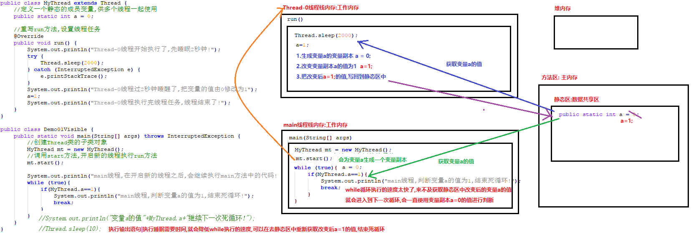

## 有序性

多行代码的编写顺序和编译顺序, 有些时候, 编译器在编译代码的时候, 为了提高效率, 会对代码进行重排, 在多线程环境下就可能导致错误

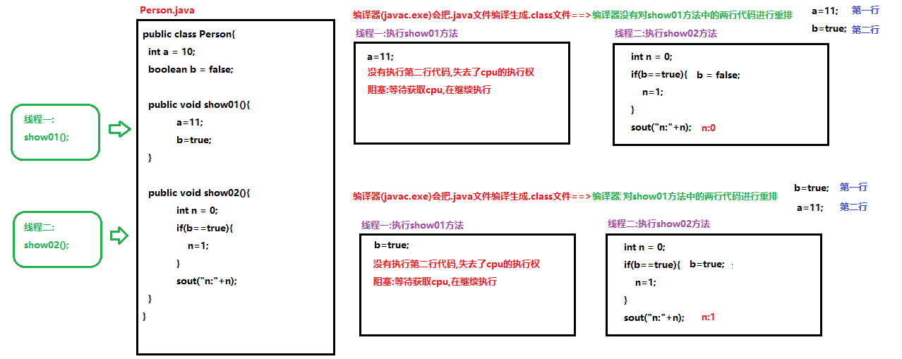

## 原子性问题

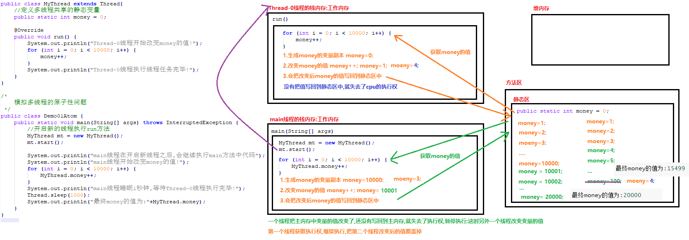

每个线程都会进行下面三个操作

1. 取Money的值
2. 将Money++
3. 将money写回

## volatile关键字

变量a被volatile关键字修饰, 当我们改变变量a的值, volatile关键字会让a变量所有的变量副本立即失效, 每个线程的工作想要使用变量a的值,  需要在主内存中重新获取

变量添加了volatile关键字, 就不会再进行重拍了

volatile关键字不能解决原子性

## 原子类

javaJDK1.5开始提供了`java.util.concurrent.atomic`包, 这个包中的原子操作类提供了一种用法简单的,性能高效的,线程安全地更新一个变量的方式.

- `java.util.concurrent.atomic.AtomicInteger`：对int变量进行原子操作的类
- `java.util.concurrent.atomic.AtomicLong`：对long变量进行原子操作的类
- `java.util.concurrent.atomic.AtomicBoolean`：对boolean变量进行原子操作的类

AtomicInteger原子型Integer，可以实现原子更新操作

- `public AtomicInteger()` 初始化一个默认值为0的原子型Integer
- `public AtomicInteger(int initialValue)` 初始化一个指定值的原子型Integer
- `int get()`获取值
- `int getAndIncrement()` 相当于i++
- `int incrementAndGet()` 相当于++i
- `int addAndGet(int data)` 以原子方式将输入的数值与实例中的值（AtomicInteger里的value）相加，并返回结果
- `int getAndSet(int value)` 以原子方式设置为newValue的值，并返回旧值

AtomicInteger类可以解决变量的可见性,有序性,原子性

## AtomicInteger的原理CAS机制

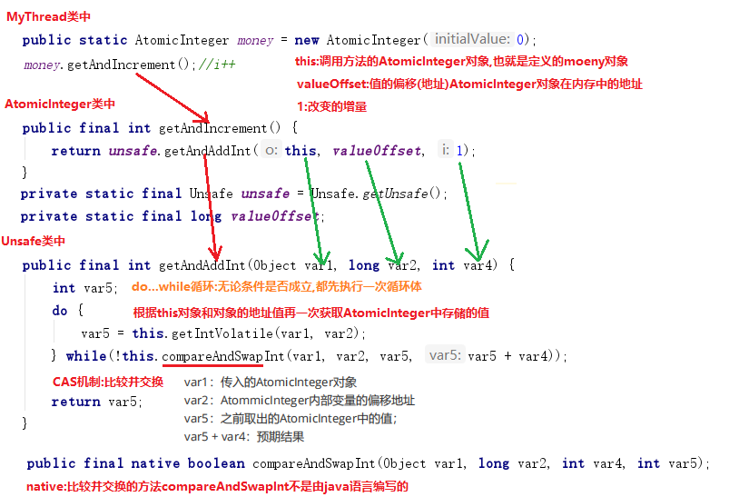

在Unsafe类中，调用了一个：compareAndSwapInt()方法，此方法的几个参数：

- var1：传入的AtomicInteger对象 

- var2：AtommicInteger内部变量的偏移地址 

- var5：之前取出的AtomicInteger中的值

-  var5 + var4：预期结果 

  

此方法使用了一种"比较并交换(Compare And Swap)"的机制，它会用var1和var2先获取内存中 AtomicInteger中的值，然后和传入的，之前获取的值var5做一下比较，也就是比较当前内存的值 和预期的值是否一致，如果一致就修改为var5 + var4，否则就继续循环，再次获取AtomicInteger 中的值，再进行比较并交换，直至成功交换为止

`compareAndSwapInt()`方法是"线程安全"的

我们假设两个线程交替运行的情况，看看它是怎样工作的： 

- 初始AtomicInteger的值为0 

- 线程A执行：`var5 = this.getIntVolatile(var1,var2);`获取的结果为：0

- 线程A被暂停 

- 线程B执行：`var5 = this.getIntVolatile(var1,var2);`获取的结果为：0

- 线程B执行：`this.compareAndSwapInt(var1,var2,var5,var5 + var4)`

- 线程B成功将AtomicInteger中的值改为1 

- 线程A恢复运行，执行：`this.compareAndSwapInt(var1,var2,var5,var5 + var4)` 

  此时线程A使用var1和var2从AtomicInteger中获取的值为：1，而传入的var5为0，比较失败，返回false，继续循环。

- 线程A执行：`var5 = this.getIntVolatile(var1,var2);`获取的结果为：1 

- 线程A执行：`this.compareAndSwapInt(var1,var2,var5,var5 + var4)` 

  此时线程A使用var1和var2从AtomicInteger中获取的值为：1，而传入的var5为1，比较成功，将其修改为var5 + var4，也就是2，将AtomicInteger中的值改为2，结束

CAS机制也被称为：乐观锁。因为大部分比较的结果为true，就直接修改了。只有少部分多线程并 发的情况会导致CAS失败，而再次循环

## 使用AtomicIntegerArray数组解决数组的原子性问题

- `AtomicIntegerArray(int length)` 创建指定长度的给定长度的新 AtomicIntegerArray
- `AtomicIntegerArray(int[] array)` 创建与给定数组具有相同长度的新 AtomicIntegerArray，并从给定数组复制其所有元素

## 线程安全

之前我们讲过的AtomicInteger可以对“int类型的变量”做原子操作。但如果需要将“很多行代码”一起作为“原子性”执行——一个线程进入后，必须将所有代码行执行完毕，其它线程才能进入，可以使用synchronized关键字——重量级的同步关键字

### 线程安全问题的代码实现

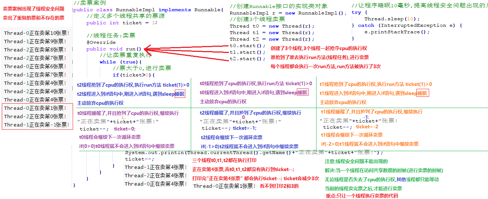

### 解决线程安全性问题的第一种方式: 使用同步代码块

解决线程安全问题的第一种方式:使用同步代码块

格式:

```java
synchronized(锁对象){
    访问了共享数据的代码(产生了线程安全问题的代码)
}
```

```java
public class RunnableImpl implements Runnable{
    //定义多个线程共享的票源
    public int ticket = 100;
    //定义一个锁对象
    //Object obj = new Object();
    String str = "abc";//new char[]{'a','b','c'}

    //线程任务:卖票
    @Override
    public void run() {
        //让卖票重复执行
        while (true){
            //同步代码块
            synchronized (str){
                //票大于0,进行卖票
                if(ticket>0){
                    //让程序睡眠10毫秒,提高线程安全问题出现的几率
                    try {
                        Thread.sleep(10);
                    } catch (InterruptedException e) {
                        e.printStackTrace();
                    }
                    System.out.println(Thread.currentThread().getName()+"正在卖第"+ticket+"张票!");
                    ticket--;
                }
            }
        }
    }
}
```

**同步的原理**

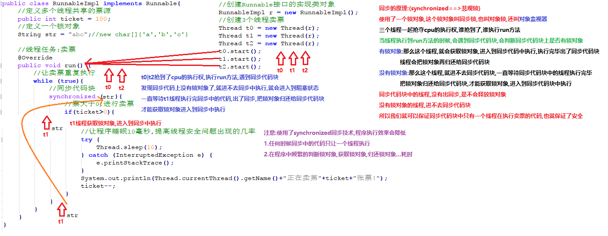

### 解决线程安全性问题的第二种方式: 使用同步方法

原理: 把访问了共享数据的代码. 提取出来放到一个方法中, 在方法上添加一个同步关键字synchronized底层原理也是使用一个锁对象, 只让一个线程对象进入到方法中执行, 保证安全

这个方法的锁对象就是这个方法的this, RunnableImple这个类的实例

这个方法也可以写为静态的, 静态的话那这个锁对象就是RunnableImpl.class

```java
格式:
权限修饰符 synchronized 返回值类型 方法名(参数列表){
    访问了共享数据的代码(产生了线程安全问题的代码)
}
```

```java
public class TicketRunnableImpl implements Runnable {
    public static int ticket = 1000;
    @Override
    public void run() {
        while (true) {
            sellTicket();
        }
    }

    public synchronized void sellTicket() {
            while (ticket > 0) {
                System.out.println(Thread.currentThread().getName() + "正在卖第" + ticket + "张票" + "\t");
                try {
                    Thread.sleep(1);
                } catch (InterruptedException e) {
                    e.printStackTrace();
                }
                ticket--;
            }
    }
}

```

### 解决线程安全问题的第三种方式: 使用Lock锁

`java.util.concurrent.locks.Lock`接口

Lock实现提供了比使用synchronized方法和语句可获得更广泛的锁定操作, Lock接口是1.5之后出现的

`void lock()`获取锁

`void lock()`释放锁

 `java.util.concurrent.locks.ReentrantLock`类 implements Lock接口

使用步骤:

1. 在成员位置创建ReentrantLock对象
2. 在可能出现线程问题的代码前, 使用lock方法获取锁对象
3. 在可能出现线程安全问题的代码后, 使用unlock方法释放锁对象

使用lock和unlock方法把一段代码包裹住, 只让一个线程进入到两个方法中间执行, 保证安全

```java
package com.itheima.thread;

import java.util.concurrent.locks.ReentrantLock;

public class TicketRunnableImpl implements Runnable {
    public static int ticket = 1000;
    ReentrantLock reentrantLock = new ReentrantLock();
    @Override
    public void run() {
        while (true) {
            reentrantLock.lock();
            while (ticket > 0) {
                System.out.println(Thread.currentThread().getName() + "正在卖第" + ticket + "张票" + "\t");
                try {
                    Thread.sleep(1);
                } catch (InterruptedException e) {
                    e.printStackTrace();
                }
                ticket--;
            }
            reentrantLock.unlock();
        }
    }
}
```

### CAS与Syschronized

AtomicInteger只能解决一个变量的原子性

Syschronized可以解决一段代码的原子性

Synchronized是从悲观的角度出发, 假设总是最坏的情况, 每次去拿数据的时候, 都会被认为别人会修改, 所以每次在拿数据的时候都会上锁, 这样别人想拿数据的时候就会阻塞直到它拿到锁, 这样别人想拿这个数据就会阻塞直到它拿到锁.

共享资源每次只给一个线程使用, 其他线程阻塞, 用完后再把资源转让给其它线程, 因此成为悲观锁, jdk中的ReentranLock也是一种悲观锁.
CAS是从乐观的角度出发, 总是假设最好的情况, 每次去拿数据的时候总会认为别人不会修改, 所以不会上锁, 但是更新的时候, 会判断一下别人有没有去更新这个数据.

CAS这种机制, 我们称之为乐观锁

## 并发包

### 并发List集合: CopyOnWriteArrayList

`java.util.concurrent.CopyOnWriteArrayList<E>`它是一个线程安全的ArrayList, 我们之前学习的`java.util.ArrayList`不是线程安全的

里边的方法和ArrayList集合是一样的

CopyOnWriteArrayList底层使用的是CAS机制:乐观锁 效率高

`java.util.Vector<E>`:是一个高并发安全的集合

Vector集合底层使用的同步synchronized技术:悲观锁 效率低

### 并发Set集合: CopyOnWriteArraySet

 `java.util.concurrent.CopyOnWriteArraySet<E>`

### 并发Map集合: ConcurrentHashMap

`java.util.concurrent.ConcurrentHashMap<K,V>`

里边的方法和HashMap是一样的

底层采用的是乐观锁:CAS机制 效率高

`java.uitl.Hashtable<K,V>`多线程安全的双列集合

 不像新的 collection 实现，Hashtable 是同步的

底层采用的是悲观锁:synchronized机制 效率低

Hashtable容器使用synchronized来保证线程安全，但在线程竞争激烈的情况下Hashtable的效率非常低下。因为当一个线程访问Hashtable的同步方法，其他线程也访问Hashtable的同步方法时，会进入阻塞状态。如线程1使用put进行元素添加，线程2不但不能使用put方法添加元素，也不能使用get方法来获取元素，所以竞争越激烈效率越低。

### 多线程协作: CountDownLatch

`java.util.concurrent.CountDownLatch`一个同步辅助类

CountDownLatch允许一个或多个线程等待其他线程完成操作

例如：线程1要执行打印：A和C，线程2要执行打印：B，但线程1在打印A后，要线程2打印B之后才能打印C，所以：线程1在打印A后，必须等待线程2打印完B之后才能继续执行打印C。

CountDownLatch构造方法:

`public CountDownLatch(int count)` 初始化一个指定计数器的CountDownLatch对象

CountDownLatch重要方法:

`public void await() throws InterruptedException`让当前线程等待

`public void countDown()`计数器进行减1

由于调用了 `countDown()` 方法，所以在当前计数到达零之前，await 方法会一直受阻塞

 注意:

        必须保证多个线程使用的是同一个CountDownLatch对象
    
        在多个线程类中定义CountDownLatch变量,使用带参构造方法给CountDownLatch变量赋值

A C线程

```java
public class MyThreadAC extends  Thread{
    //定义成员变量CountDownLatch
    private CountDownLatch countDownLatch;

    //使用带参数构造方法给CountDownLatch变量赋值
    public MyThreadAC(CountDownLatch countDownLatch) {
        this.countDownLatch = countDownLatch;
    }

    @Override
    public void run() {
        System.out.println("A");

        //使用CountDownLatch对象中的方法await,让线程等待,等待CountDownLatch对象内部计数器的值变成0在执行
        try {
            countDownLatch.await();
        } catch (InterruptedException e) {
            e.printStackTrace();
        }

        System.out.println("C");
    }
}
```

B线程

```java
public class MyThreadB extends Thread {
    //定义成员变量CountDownLatch
    private CountDownLatch countDownLatch;

    //使用带参数构造方法给CountDownLatch变量赋值
    public MyThreadB(CountDownLatch countDownLatch) {
        this.countDownLatch = countDownLatch;
    }

    @Override
    public void run() {
        System.out.println("B");
        //使用CountDownLatch对象中的方法countDown让计数器的值-1
        countDownLatch.countDown();
    }
}
```

测试类

```java
public class Demo01Thread {
    public static void main(String[] args) throws InterruptedException {
        //创建CountDownLatch对象,分别传递给每一个线程使用
        CountDownLatch cdl = new CountDownLatch(1);//创建内部计数器的值为1

        new MyThreadAC(cdl).start();
        Thread.sleep(1000);//睡眠1秒钟,保证AC线程先执行
        new MyThreadB(cdl).start();
    }
}
```

CountDownLatch中count down是倒数的意思，latch则是门闩的含义。整体含义可以理解为倒数的门栓，似乎有一点“三二一，芝麻开门”的感觉

CountDownLatch是通过一个计数器来实现的，每当一个线程完成了自己的任务后，可以调用countDown()方法让计数器-1，当计数器到达0时，调用CountDownLatch的await()方法的线程阻塞状态解除，继续执行

### 多线程协作: CyclicBarrier

CyclicBarrier的字面意思是可循环使用（Cyclic）的屏障（Barrier）。它要做的事情是，让一组线程到达一个屏障（也可以叫同步点）时被阻塞，直到最后一个线程到达屏障时，屏障才会开门，所有被屏障拦截的线程才会继续运行

例如：公司召集5名员工开会，等5名员工都到了，会议开始

CyclicBarrier构造方法

`public CyclicBarrier(int parties, Runnable barrierAction)`

创建一个新的 CyclicBarrier，它将在给定数量的参与者（线程）处于等待状态时启动，并在启动 barrier 时执行给定的屏障操作，该操作由最后一个进入 barrier 的线程执行

`int parties`:设置的屏障的数量,设置的线程数量,设置几个线程执行完,再让其他的线程执行

`Runnable barrierAction:`达到屏障之后执行的线程

CyclicBarrier重要方法

`public int await()`让设置的屏障的数量-1

**使用场景:** CyclicBarrier可以用于多线程计算数据，最后合并计算结果的场景。

**需求:** 使用两个线程读取2个文件中的数据，当两个文件中的数据都读取完毕以后，进行数据的汇总操作。

```java
public class MyThreadMeeting extends Thread {
    private CyclicBarrier cyclicBarrier;

    public MyThreadMeeting(CyclicBarrier cyclicBarrier) {
        this.cyclicBarrier = cyclicBarrier;
    }

    @Override
    public void run() {
        try {
            int r = (int)(Math.random()*1000);
            Thread.sleep(r);
            System.out.println(Thread.currentThread().getName()+"花费"+r+"秒来到了会议的现场");
            cyclicBarrier.await();
        } catch (InterruptedException e) {
            e.printStackTrace();
        } catch (BrokenBarrierException e) {
            e.printStackTrace();
        }

    }
}
```

```java
public class CyclicBarrierDemo {
    public static void main(String[] args) {
        CyclicBarrier cyclicBarrier = new CyclicBarrier(5,new AllPeopleCome());
        new MyThreadMeeting(cyclicBarrier).start();
        new MyThreadMeeting(cyclicBarrier).start();
        new MyThreadMeeting(cyclicBarrier).start();
        new MyThreadMeeting(cyclicBarrier).start();
        new MyThreadMeeting(cyclicBarrier).start();
    }
}
```

```java
public class AllPeopleCome extends Thread{
    @Override
    public void run() {
        System.out.println("人齐了, 可以开会");
    }
}
```

### 并发数量控制: Semaphore

Semaphore的主要作用是控制线程的并发数量。

synchronized可以起到"锁"的作用，但某个时间段内，只能有一个线程允许执行。

Semaphore可以设置同时允许几个线程执行。

Semaphore字面意思是信号量的意思，它的作用是控制访问特定资源的线程数目。

Semaphore构造方法

`public Semaphore(int permits)` permits 表示许可线程的数量

`public void release()`fair 表示公平性，如果这个设为 true 的话，下次执行的线程会是等待最久的线程

Semaphore重要方法

`public void acquire()` 表示获取许可  lock

`public void release()` 表示释放许可  unlock


### 线程信息交互: Exchanger

`java.util.concurrent.Exchanger<V>`用于两个线程交互数据

Exchanger（交换者）是一个用于线程间协作的工具类。Exchanger用于进行线程间的数据交换。

两个线程通过exchange方法交换数据，如果第一个线程先执行exchange()方法，它会一直等待第二个线程也执行exchange方法，当两个线程都到达同步点时，这两个线程就可以交换数据，将本线程生产出来的数据传递给对方。

Exchanger构造方法：

`public Exchanger()`

Exchanger重要方法：

`public V exchange(V x)` 参数传递给对方的数据,返回值接收对方返回的数据

`V exchange(V x, long timeout, TimeUnit unit)`

参数:设置线程等待的事件

long timeout:设置等待的时长

TimeUnit unit:设置等待的时间单位(秒,分钟,小时,天)

使用场景：可以做数据校对工作

需求：比如我们需要将纸制银行流水通过人工的方式录入成电子银行流水。为了避免错误，采用AB岗两人进行录入，录入到两个文件中，系统需要加载这两个文件，

并对两个文件数据进行校对，看看是否录入一致


## 线程池

当程序第一次启动的时候,  创建一些线程, 把线程储存到线程池中, 当我们需要线程的时候,  就可以在线程池中取出线程使用, 使用完毕, 把线程再归还给线程池

底层是一个集合, 由于经常增删, 最好使用链表

好处: 避免了频繁的创建和销毁线程对象, 可以提高线程对象

`list.add(new Thread())`添加新线程 Thread 0 

`list.add(new Thread())`添加新线程  Thread 1

`Thread t0 = list.removeFirst()`移除并返回集合中的第一个元素 Thread 0

`list.add(new Thread())`添加新线程  Thread 0

`Thread t0 = list.removeFirst()`移除并返回集合中的第一个元素 Thread 1

`list.add(new Thread())`添加新线程 Thread 1

队列思想

在java1.5之后,Java己经内置了线程池技术, 我们可以直接使用

### Executors

`java.util.concurrent.Executors`是一个创建线程池的工具类, 专门来生产线程池, 里面的方法都是静态的

静态方法:

`static ExecutorService new FixedThreadPool(int nThreads)`创建一个可重用固定线程数的线程池, 以共享的无界队列方式来运行这些线程

参数; int nThresds 创建线程池, 包含线程的数量

返回值, ExcutorService 是一个接口, 所以返回的是这个接口的实现类对象

`java.util.concurrent.ExecutorService`:描述线程池的接口

Future<?>  submit (Runnable task)提供一个Runnable任用用于执行, 并返回一个表示该任务的Future

`<T>Future<T>submit(Callable<T> task)`提交一个返回值的任务用于执行, 返回一个表示任务的Future

返回值: Future用来接收线程任务的返回值, 主要是Callable的返回值

Future接口中的方法

`V get()`用该方法接收call方法的返回值

`void shutdown()`用于销毁线程池

#### 使用线程池执行Runnable接口的线程任务:

1. 使用Excutors线程池工厂类中的方法newFixedThreadPool创建一个执行线程数量的线程池ExcutorService
2. 创建Runnable接口Callable接口的实现类对象, 重写run方法/call方法, 设置线程任务(也可以在submit方法中传递一个Runable的匿名内部类)
3. 使用线程池ExecutorService中的方法submit传递线程任务(Runnable)接口的实现类对象, Callable接口的实现类对象, submit方法会自动的从线程出中取出一个线程,执行线程任务, 使用完毕线程, 会自动把线程归还到线程池中

#### 使用线程池执行Callable接口的线程任务

Callable接口类似于Runable, Callable接口有返回值

Callable接口中的方法, 

`V call()` 计算结果, 如果无法计算结果, 则抛出一个异常

重写call方法, 设置线程任务, 把线程任务交给线程池执行, 执行的线程任务有一个返回值, 我们可以获取返回值使用


### 死锁(Deadlock)

死锁: 线程获取不到锁对象, 从而进不去内存, 线程就死在这里了

前提:

1. 必须出现同步代码块的嵌套
2. 必须有两个线程
3. 必须有两个对象

创建一个死锁, 可以用字符串当作锁对象, 因为相同的一个字符串是在常量池中的, 同样的一个字符串就是一个对象

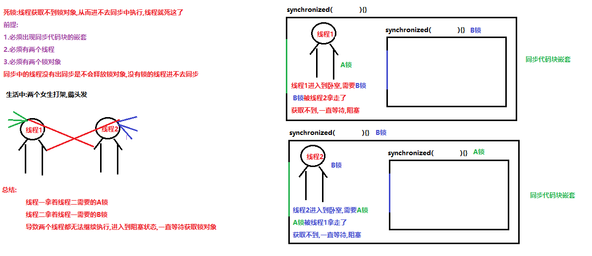

```java
package com.itheima.threadday18;

public class RunnableImpl implements Runnable {
    private String lockA = "a";
    private String lockB = "b";
    int a = 0;
    @Override
    public void run() {
        while (true) {
            if(a%2==0) {
                synchronized (lockA) {
                    System.out.println(Thread.currentThread().getName()+"取走lockA");
                    synchronized (lockB) {
                        System.out.println(Thread.currentThread().getName()+"取走lockB");
                    }
                }
            }else{
                synchronized (lockB) {
                    System.out.println(Thread.currentThread().getName()+"取走lockB");
                    synchronized (lockA) {
                        System.out.println(Thread.currentThread().getName()+"取走lockA");
                    }
                }
            }
            a++;
        }
    }
}
```

```java
public class DeadLockDemo {
    public static void main(String[] args) {
        new Thread(new RunnableImpl(),"线程一").start();
        new Thread(new RunnableImpl(),"线程二").start();
    }
}
```

## 线程状态

**新建状态(NEW)**

当新建一个线程的时候, 这个线程还没开始运行, 这个线程的状态就是新建状态

**可运行状态(RUNAABLE)**

一旦调用start方法, 线程就处于可运行状态, 一个可运行状态的可能正在运行也可能没有运行, 运行中的程序有时候暂停让其让线程有机会运行

**阻塞状态(BLOCKED)**

当一个线程试图获取一个内部的锁对象的时候, 而这个锁对象被其他线程拥有的时候, 这个线程会被阻塞

**等待状态(WAITING)**

当线程等待另一个线程通知调度器出现一个条件的时候, 这个线程会进入等待状态`Object.wait()`,  `Thread.join()` , `Object.notify()`则会唤醒等待的状态, 实际上等待状态和阻塞状态没有太大区别

**计时等待状态(TIMED_WAITING)**

有几个带时间参数的方法, 会让线程进入即使等待状态, `Thread.sleep(long)`, `Object.wait(long)`

**终止线程(TERMINATED)**

run方法正常退出, 线程自然终止, 因为一个捕获的异常终止了run方法, 使线程意外终止,   

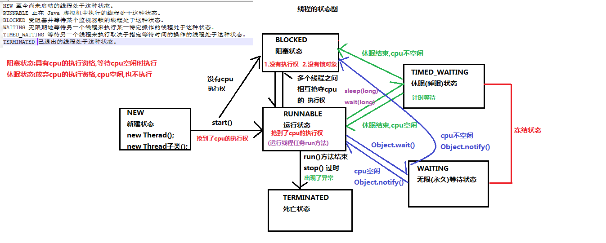

### 等待与唤醒案例

`java.lang.Object`类, 是祖宗类里面的方法, 任意的一个类都可以使用

`void wait()`在其他线程调用此对象的notify()方法或notifyAll()方法前, 导致当前线程等待 会释放锁对象

`void notify()`唤醒在此对象监视器(对象锁)上等待的单个线程

`void notifyAll()`唤醒在此对象监视器上等待的 所有线程

注意:

1. wait和notify方法一般使用在同步代码块中, 有对象锁

2. 一般使用锁对象调用wait和notify方法(多个线程使用的是同一个锁对象)

   Thread-0线程使用锁对象==>wait方法==>Thread-0进入到等待

   Thread-1线程使用锁对象==>notify方法==>唤醒在锁对象上等待的Thread-0线程

3. 在同步中的线程调用wait方法, 进入到等待 状态, 会释放锁对象

   在同步中的线程调用sleep方法, 进入睡眠, 不会释放锁对象

   或者`stop()`过时了


吃包子, 做包子

```java
package com.itheima.threadday18;

public class Restaurant implements Runnable {
    BaoZi baoZi;

    public Restaurant(BaoZi baoZi) {
        this.baoZi = baoZi;
    }

    @Override
    public void run() {
        while (true){
            synchronized (baoZi){
                //没有包子了
                if(baoZi.isState()==false){
                    System.out.println("没有包子了, 需要开始造包子了");
                    baoZi.setState(true);
                    baoZi.setPi("厚薄");
                    baoZi.setXian("猪肉韭菜馅");
                    System.out.println("做包子需要三秒钟时间");
                    try {
                        Thread.sleep(3000);
                    } catch (InterruptedException e) {
                        e.printStackTrace();
                    }
                    baoZi.notify();
                    System.out.println("已经做好"+baoZi.getPi()+ baoZi.getXian()+"的饺子了, 赶紧来吃包子吧");
                }else{
                    try {
                        baoZi.wait();
                    } catch (InterruptedException e) {
                        e.printStackTrace();
                    }
                }
            }
        }
    }
}
```

```java
package com.itheima.threadday18;

public class Eater implements Runnable {
    BaoZi baoZi;

    public Eater(BaoZi baoZi) {
        this.baoZi = baoZi;
    }

    @Override
    public void run() {


        synchronized (baoZi) {
            while (true){
                if(baoZi.isState()==true){
                    System.out.println("有包子, 那我就吃包子");
                    System.out.println("三秒钟吃完包子");
                    try {
                        Thread.sleep(3000);
                    } catch (InterruptedException e) {
                        e.printStackTrace();
                    }
                    baoZi.setState(false);
                    baoZi.notify();
                }else{
                    System.out.println("没有包子");
                    try {
                        baoZi.wait();
                    } catch (InterruptedException e) {
                        e.printStackTrace();
                    }

                }
            }
        }
    }
}
```


## Timer

`java.util.Timer`类

一种工具, 线程用其安装以后在后台线程种执行的问题, 可安排任务执行一次, 或者定期重复执行.

构造方法

Time()创建一个新计时器

成员方法

`void cancel()`终止此计时器, 丢弃所有当前已安排的任务

注意，在此计时器调用的计时器任务的 run 方法内调用此方法，就可以绝对确保正在执行的任务是此计时器所执行的最后一个任务

`void schedule(TimerTask task, long delay)`在指定的毫秒值之后,执行指定的任务, 只会执行一次

task - 所要安排的任务。定时器到时间之后要执行的任务

delay - 执行任务前的延迟时间，单位是毫秒。 多个毫秒之后开始执行TimerTask任务

`void schedule(TimerTask task, long delay, long period)`在指定的毫秒值之后,执行指定的任务,之后每隔固定的毫秒数重复执行定时任务

`void schedule(TimerTask task, Date time)`安排在指定的时间执行指定的任务,只会执行一次

`void schedule(TimerTask task, Date firstTime, long period) `安排指定的任务在指定的时间开始进行重复的固定延迟执行

`java.util.TimerTask`类 implements Runnable接口

```java
private static void show04() throws ParseException {
    //创建一个反复执行的定时器:从2020-07-06 15:36:00,开始第一次执行定时任务,之后每隔10毫秒执行1次
    SimpleDateFormat sdf = new SimpleDateFormat("yyyy-MM-dd HH:mm:ss");
    Date date = sdf.parse("2020-07-06 15:37:30");
    Timer timer  = new Timer();
    timer.schedule(new TimerTask() {
        @Override
        public void run() {
            System.out.println("嘿嘿,你中招了!");
        }
    },date,10);
}
```

## Exmple: 龟兔赛跑

```java
package com.itheima.day25;

//多线程龟兔赛跑问题，乌龟和兔子比赛跑200米的距离，
//名叫兔子的线程每执行一次兔子就向前跑5米，每跑50米休息10毫秒，
//名叫乌龟的线程每执行一次乌龟就向前跑1米，乌龟会一直跑不休息
//用多线程实现求出最后的胜利者是谁

public class Race implements Runnable {
    //winner:只有一个胜利者
    private static String winner;
    int lengthr = 200;//lengthr为兔子需要跑的长度
    int lengtht = 200;//lengtht为乌龟需要跑的长度

    // 重写run方法，编写奔跑操作
    public void run() {
        while (true) {
            //判断线程的名字是兔子
            if (Thread.currentThread().getName().equals("兔子")) {
                //兔子以5米的速度跑，
                //线程每运行一次，就打印"XXX距离终点还有YYY米(XXX为线程名字，YYY为剩余的距离)"，
                //每跑50米休息10毫秒（线程休眠10毫秒），当剩余距离为0米时不再休息，请补全此处代码：
                int disr =50;

                //
                lengthr -= disr;
                System.out.println(Thread.currentThread().getName()+"距离终点还有"+lengthr+"米");
                try {
                    Thread.sleep(10);
                } catch (InterruptedException e) {
                    e.printStackTrace();
                }
                //调用gameOver方法判断比赛是否结束
                boolean flag = gameOver(lengthr);
                if (flag) {
                    break;
                }
            }
            //判断线程的名字是乌龟
            if (Thread.currentThread().getName().equals("乌龟")) {
                //乌龟以1米的速度，会一直跑不休息，
                //线程每运行一次，就打印"XXX距离终点还有YYY米(XXX为线程名字，YYY为剩余的距离)"，请补全此处代码：
                int dist = 1;
                //
                lengtht -= dist;
                System.out.println(Thread.currentThread().getName()+"距离终点还有"+lengtht+"米");

                //调用gameOver方法判断比赛是否结束
                boolean flag = gameOver(lengtht);
                if (flag) {
                    break;
                }
            }
        }
    }
    //判断比赛是否结束
    private boolean gameOver(int lenght) {
        if (winner != null) { //如果存在胜利者
            return true;
        }
        if ( lenght == 0) {  //判断如果跑到了比赛结束
            winner = Thread.currentThread().getName();
            System.out.println("比赛结束");
            System.out.println("胜利者----->" + winner);
            return true;
        }
        return false;
    }
}
```

```java
package com.itheima.day25;

public class testWanXing2 {
    public static void main(String[] args) {
        Race race = new Race(); //创建一个比赛
        //要求创建两个线程名字分别为：兔子、乌龟。并启动线程，请补全此处代码：
        new Thread(race,"兔子").start();
        new Thread(race,"乌龟").start();

    }
}
```


# 2. Stream流

**我们可以把集合|数组,转换为Stream流,使用Stream流中的方法,对集合|数组进行操作**

1. 使用Collection接口中, (jdk1.8之后)定义了一个方法stream,可以把集合转换为Stream流

   `default Stream<E> stream()` 此转换方法只能是Collection接口下的集合使用

2. 使用Stream接口中方法of,可以把可变参数(数组)转换为Stream流

   `java.util.stream.Stream<T>` 接口(jdk1.8之后)

   `static <T> Stream<T> of(T... values)`  方法的参数是一个可变参数,也可以传递数组

```java
Stream<Integer> stream1 = Stream.of(1, 2, 3, 4, 5, 6, 7, 8, 9);
Stream<String> stream2 = Stream.of("a", "b", "c");

String[] arr1 = {"a", "b", "c"};
Stream<String> stream3 = Stream.of(arr1);

ArrayList<Integer> list = new ArrayList<>();
Stream<Integer> stream1 = list.stream();

LinkedList<String> linked = new LinkedList<>();
Stream<String> stream2 = linked.stream();

HashSet<Integer> set = new HashSet<>();
Stream<Integer> stream3 = set.stream();
```

### Stream的常用方法

| 方法名  | 方法作用   | 方法种类 | 是否支持链式调用 |
| ------- | ---------- | -------- | ---------------- |
| count   | 统计个数   | 终结     | 否               |
| forEach | 逐一处理   | 终结     | 否               |
| filter  | 过滤       | 函数拼接 | 是               |
| limit   | 取用前几个 | 函数拼接 | 是               |
| skip    | 跳过前几个 | 函数拼接 | 是               |
| map     | 映射       | 函数拼接 | 是               |
| concat  | 组合       | 函数拼接 | 是               |

#### forEach方法

    Stream流中的常用方法_forEach:用于遍历Stream流中的元素
    void forEach(Consumer<? super T> action) 对此流的每个元素执行操作。
    参数:
    Consumer<? super T> action:是一个消费型的接口,参数可以传递Lambda表达式
    唯一的抽象方法:
    void accept(T t) :消费一个指定泛型类型的数据
    注意:
    forEach方法是一个终结方法,没有返回值;也不能使用链式编程调用Stream流中的其他方法了
```java
Stream<Integer> stream = Stream.of(1, 2, 3, 4, 5, 6, 7, 8, 9, 10);
stream.forEach(i-> System.out.println(i));
```

#### count方法

```
Stream流中的常用方法_count方法:统计个数
long count() 返回此流中的元素数。
注意:
count方法是一个终结方法,返回值类型是long类型;也不能使用链式编程调用Stream流中的其他方法了
```

```java
ArrayList<String> list = new ArrayList<>();
Collections.addAll(list,"aa","bb","cc","dd","ee");
Stream<String> stream2 = list.stream();
System.out.println(stream2.count());
```

#### filter方法

```
Stream流中的常用方法_filter方法:用于过滤Stream流中的元素
Stream<T> filter(Predicate<? super T> predicate)
参数:
Predicate<? super T> predicate:函数式接口,参数传递lambda表达式
唯一的抽象方法:
boolean test(T t) 用于对接口指定泛型类型的数据进行判断
注意:
filter方法的返回值类型还是Stream类型,是一个非终结方法,可以使用返回的Stream对象继续调用Stream流中的方法(链式编程)
```

```java
Stream<String> stream = Stream.of("美羊羊", "喜羊羊", "懒羊羊", "沸羊羊", "暖羊羊", "慢羊羊", "灰太狼", "红太狼", "小灰灰");
stream.filter(s->s.contains("羊羊")).forEach(s-> System.out.println(s));
```


#### limit方法

```
Stream流中的常用方法_limit方法:获取前n个元素
Stream<T> limit(long maxSize) 返回由此流的元素组成的流，截短长度不能超过 maxSize 。
例如:
limit(4);获取流中的前4个元素,把4个元素存储到一个新的Steam流中
注意:
1.传递数字大于流的长度,返回流中所有的元素
2.limit方法的返回值类型还是Stream类型,是一个非终结方法,可以使用返回的Stream对象继续调用Stream流中的方法(链式编程)
```

#### skip方法

```
Stream流中的常用方法_skip方法:跳过前n个元素
Stream<T> skip(long n)
注意:
1.skip跳过的元素数量大于流中的个数,返回一个没有元素的空流
2.skip方法的返回值类型还是Stream类型,是一个非终结方法,可以使用返回的Stream对象继续调用Stream流中的方法(链式编程)
```

#### map方法

```
Stream流中的常用方法_map方法:映射,类型转换
<R> Stream<R> map(Function<T,R> mapper)
参数:
Function<T,R> mapper:函数式接口,可以传递Lambda表达式
接口中唯一的抽象方法:
R apply(T t) 根据参数类型T获取类型R类型的返回值,用于类型转换 T转换R
注意:
map方法的返回值类型还是Stream类型,是一个非终结方法,可以使用返回的Stream对象继续调用Stream流中的方法(链式编程)
```

#### concat方法

```
Stream流中的常用方法_concat方法:组合,把两个Stream流,组合为一个新的Stream流
static <T> Stream<T> concat(Stream<? extends T> a, Stream<? extends T> b)
注意:
concat方法的返回值类型还是Stream类型,是一个非终结方法,可以使用返回的Stream对象继续调用Stream流中的方法(链式编程)
```


# 3. IO

## File类

`java.io.File`类

文件和目录路径名的抽象表示形式

### File类的静态成员变量

`static String pathSeparator` 与系统有关的**路径**分隔符，为了方便，它被表示为一个字符串

```java
String pathSeparator = File.pathSeparator;
System.out.println(pathSeparator);//路径分隔符 windows系统:分号(;)  linux系统:冒号(:)
```

`static char pathSeparatorChar` 与系统有关的路径分隔符

`static String separator` 与系统有关的默认**名称**分隔符，为了方便，它被表示为一个字符串

```java
String separator = File.separator;
System.out.println(separator);//默认名称(文件夹名称)分隔符 windows系统:反斜杠(\)  linux系统:正斜杠(/)
```

`static char separatorChar` 与系统有关的默认名称分隔符

```java
String path = "d:\\a.txt";
System.out.println(path);

String path2 = "d:"+File.separator+"a.txt";
System.out.println(path2);
```
### 路径

绝对路径: 以盘符开始的路径

相对路径: 相对于我们当前项目的目录而言, 我们使用项目的根目录作为路径, 可以省略书写, 也就是新建一个project的文件目录

```java
D:\\Work_idea\\EE24\\day20(绝对)==>day20(相对)
D:\\Work_idea\\EE24\\day20\\a.txt(绝对)==>day20\\a.txt(相对)
```

注意: 

1. 路径是不区分大小写的

2. 如果要使用反斜杠(\\)作为分隔符, 需要些两个(\\\\), 因为一个反斜杠本身是转义字符有特殊含义

3. 在Java程序中, 也可以使用一个正斜杠(/)作为文件或者文件夹的分割目录

   ```java
   d:\\a.txt  d:/a.txt
   ```

### File的构造方法

如果类中的方法不是静态的, 只能使用构造方法创建对象才能调用类中的非静态方法

`File(File parent, String child)`根据parent抽象路径名和child路径名字创建一个新File实例

好处:

1. 父路径和子路径分别使用不同的路径, 组装成一个新的路径, 使用起来更加灵活
2. 父路径是File类型, 可以使用File类的方法, 对父路径进行一些操作, 在和子路径组成一个新的File

```java
private static void show03() {
    File parent = new File("d:\\");
    File file = new File(parent,"a.txt");
    System.out.println(file);//d:\a.txt
}
```
` File(String parent, String child)`

`File(String pathname)`

通过将给定路径名字符串转换为抽象路径名来创建一个新 File 实例

注意:

1. 参数传递的路径可以是绝对路径,也可以是相对路径
2. 参数传递的路径可以是以文件结尾的,也可以是以文件夹结尾的
3. 参数传递的路径可以是真实存在的,也可以是不存在的;构造方法仅仅是把字符串的路径,封装为File对象,**不检查路径的真实情况**
4. 传入什么, 打印出来的就是什么

### File类的成员方法_获取功能的方法

`public String getAbsolutePath()`返回此File的**绝对路径**名字符串

获取构造方法中传递的路径: 传递的路径是绝对的,就直接返回这个绝对路径, 传递的路径是相对的, 会在相对路径的前边添加上项目的根目录在返回

**(这个方法只看是相对路径还是绝对路径, 如果没有盘符, 那么就加上该项目的根目录后返回)**

`public String getPath()`将此File转换为**路径名字符串**

获取构造方法中传递的路径, 传递的路径是绝对的,就返回这个绝对路径, 传递的路径是相对的,就返回这个相对路径

**(构造方法里面的东西转换为字符串再输出)**

`public String getName()`返回由此File表示的文件或目录的名称

获取构造方法中路径末尾部分的名字(文件名称|文件夹名称)

**(即返回你构造函数的最后一个斜杠后的内容, 文件或者文件夹的名字)**

(返回你构造方法里面的最后

`public long length()`返回由此File表示的文件的长度, 不能获取目录的长度,单位是字节

注意:

1. length方法只能获取文件的大小,不能获取文件夹的大小(文件夹是没有大小概念的)
2. length方法获取是构造方法中传递文件路径指定的文件大小
3. 如果传递路径路径不存在,那么此方法返回0

### File类的成员方法_判断功能的方法

`public boolean exists()`  此File表示的文件或目录是否实际存在

(构造函数)函数括号里的是否存在

最后斜杠后面的那个是 文件夹名或者无任何文件后缀的文件 都返回true

 `public boolean isDirectory()`  此File表示的是否为目录

 `public boolean isFile()`  此File表示的是否为文件

判断文件还是文件夹是否存在之前, 先判断路径是否存在

```java
File f2 = new File("c:\\a.txt");
if(f2.exists()){
    System.out.println(f2.isDirectory());//false
    System.out.println(f2.isFile());//true
}

File f3 = new File("day20");//day20==>相当于D:\Work_idea\EE24\day20
System.out.println(f3.exists());//true
```


### File类的成员方法_创建删除功能的方法

`public boolean createNewFile()`  当且仅当具有该名称的文件尚不存在时，创建一个新的空文件

文件不存在, 创建成功, 返回true, 文件存在, 不会创建新的, 返回false(不会覆盖)

构造方法中写的文件必须是存在的,否则会抛出异常

有些操作系统, C盘是没有权限创建文件的, 就会抛出拒绝访问异常

```java
File file1 = new File("d:\\java\\java");//在Java文件夹中创建一个java文件,注意,不是文件夹!
System.out.println(file1.createNewFile());

File file1 = new File("d:\\java\\java.txt");//在Java文件夹中创建一个java.txt
System.out.println(file1.createNewFile());
```

`public boolean mkdir()`  创建由此File表示的目录

只能创建单层文件夹, 创建的时候, 也不能还有此名字的无后缀的文件

`public boolean mkdirs()`  创建由此File表示的目录，包括任何必需但不存在的父目录。

注意:

1. 创建文件夹的名字和路径在构造方法中给出
2. 此方法只能创建文件夹, 不能创建文件

`public boolean delete()`  删除由此File表示的文件或目录。

构造方法中不存在或者文件夹中有内容, 不会删除, 返回false

**此删除方法, 不走回收站, 直接在硬盘上删除, 需要谨慎**

### File类的成员方法_目录遍历的方法

`public String[] list()`返回一个String的值, 

`public File[] listFiles()`返回一个File数组, 表示该File目录中的所有子文件或目录.

遍历目录, 获取目录中每一文件, 文件夹把文件,文件夹封装为File对象, 多个File对象储存到一个File对象储存到一个File类型的数组中返回

注意:

1. 遍历目录的路径, 在构造方法中给出
2. 遍历目录的路径必须存在的, 否则会抛出空指针异常
3. 这两个方法只能遍历目录, 不能遍历文件, 否则就会抛出空指针异常

## 递归

### 使用递归实现阶乘

```java
public class Demo03Recursion {
    public static void main(String[] args) {
        int i = jieCheng(5);
        System.out.println(i);
    }

    public static int jieCheng(int n){//5,4,3,2,1
        //递归的结束条件:获取n-1==1的时候结束
        if(n==1){
            return 1;
        }
        //递归的目的:获取下一个被乘的数字n-1
        return n*jieCheng(n-1);
    }
}
```

### 使用递归遍历文件夹和文件夹中的子文件夹

```java
package com.itheima.io;

import java.io.File;

public class Recursion {
    //使用递归遍历文件夹
    //遍历d盘的目录
    public static void main(String[] args) {
        //定义一个方法, 参数传递要遍历的文件夹File对象, 在方法内部对文件夹进行遍历
        File file = new File("d://java");
        gerAllFile(file);


    }

     public static void gerAllFile(File files) {
        //打印文件夹名字
        System.out.println(files);
         File[] filess = files.listFiles();
         for (File file : filess) {
             if(file.isDirectory()){
                    gerAllFile(file);
                }else {
                    System.out.println(file.getName());
                }
        }
        }

}
```

### 文件搜索

```java
if(file.toString().toLowerCase().endsWith(".java"))
    System.out.println(file.getName());
```


## 字节流

**硬盘中的一切文件数据(文本、图片、视频等)在存储时**，都是以二进制数字的形式保存(计算机只能识别0和1)，都一个一个的**字节**(1个字节=8比特位)，那么传输时一样如此。所以，字节流可以传输任意文件数据。在操作流的时候，我们要时刻明确，无论使用什么样的流对象，底层传输的始终为二进制数据(1,0)

` java.io.OutputStream ` 字节输出流, 此抽象类是表示输出字节流的所有类的超类

`public void close()`  关闭此输出流并释放与此流相关联的任何系统资源

`public void flush() ` 刷新此输出流并强制任何缓冲的输出字节被写出

`public void write(byte[] b)` 将b.length字节从指定的字节数组写入此输出流

`public void write(byte[] b, int off, int len)`  从指定的字节数组写入 len字节，从偏移量 off开始输出到此输出流

`public abstract void write(int b)` 将指定的字节输出流

跟读是一样的, 写入一个字节对应的十进制

### 字节输出流

`java.io.FileOutputStream`  文件字节输出流  extends OutputStream

提供了也给可以附着在一个磁盘文件上的输出流

构造方法:

`FileOutputStream(File file)` File file:输出的目的地就是一个文件

`FileOutputStream(String name)`  String name:输出的目的地就是一个文件路径

构造方法的作用:

1. 会创建FileOutputStream对象

2. **会根据构造方法中传递的文件路径|文件,创建一个新的空白文件**(如果使用另一个重载函数器, 第二个参数传入true, 那么就不会覆盖原文件)

3. 会把FileOutputStream对象,指向创建好的文件,就可以往文件中写数据了, 使用字节输出流往文件中写输出的底层过程

    

**字节输出流中写多个字节的方法(重点):**

1. public abstract void write(int b) 一次写一个字节到文件中
2. public void write(byte[] b) 一次把字节数组中所有的字节写入到文件中
3. public void write(byte[] b, int off, int len) 一次把字节数组的一部分写入到文件中
4. int off:数组的开始索引,从哪个索引开始写
5. int len:写的字节个数

```java
public class FileOutputStreamDemo {
    public static void main(String[] args) throws IOException {
        FileOutputStream fileOutputStream = new FileOutputStream("D:\\java\\111.txt");
        fileOutputStream.write(97);
        byte[] bytes = {65,66,67,68,69,70};
        fileOutputStream.write(bytes,1,3);
        byte[] bytes1 = "武俊男".getBytes();
        fileOutputStream.write(bytes1);
        fileOutputStream.close();
    }
}
```

#### 字节输出流的续写和换行

**续写**, boolean append: 续写的开关

`FileOutputStream(File file, boolean append)`

`FileOutputStream(String name, boolean append)`

**换行**

Windows系统里，每行结尾是 回车+换行 ，即 \r\n

**注意: 这个是反斜杠!!**

linux,Unix系统里，每行结尾只有 换行 ，即 \n

Mac系统里，每行结尾是 回车 ，即 \r 。从 Mac OS X开始与Linux统一

```java
public class FileOutputStreamDemo {
    public static void main(String[] args) throws IOException {
        FileOutputStream fileOutputStream = new FileOutputStream("D:\\java\\111.txt",true);
        fileOutputStream.write(97);
        byte[] bytes1 = ("\r\n"+"武俊男").getBytes();
        fileOutputStream.write(bytes1);
        fileOutputStream.close();
    }
}
```

### 字节输入流

`java.io.InputStream` 字节输入流, 此抽象类是表示字节输入流的所有类的超类, 里面定义了所有字节输入流的都可以使用这些方法

`int read()`从输入流中读取数据的下一字节(返回的是这个)

`int read(byte[] b)`从输入流中读取一定数量的字节, 并将其储存在缓冲区数组b中

```
问: 这两个int分别代表什么?

第一个int, 是每次读取的那一个字节的对应的十进制, 所以不应该用len来命名, 就应该用read来命名,如果没有的话就会读出-1
第二个int, 是每次读取数组的长度, 应该用len进行命名,同样的没有数组的话也是读出-1,所以都可以用while循环!=-1来控制
```

`void close()` 关闭此输入流并释放与该流相关联的所有系统资源

`java.io.FileInputStream`文件字节输入流 `extends InputStream`将文件字节输入流 extends InputStream

构造方法:

FileInputStream的构造方法:

`FileInputStream(String)`

`FileInputStream(File file)`

在使用构造方法的时候, 如果要读取的文件不存在, 会抛出文件找不到异常

使用字节输入流读取文件到内存中的原理, java程序, JVM, 操作系统, 调用系统中读取文件的方法, 读取文件

```java
public class IOReview {
    public static void main(String[] args) throws IOException {
        File file = new File("java.txt");
        FileInputStream fileIn = new FileInputStream(file);
        //注意这行如果不注释,那么文件就会被构造器构造出一个新的文件
       // FileOutputStream fileOut = new FileOutputStream(file);
        int read1 = fileIn.read();
        int read2 = fileIn.read();
        int read3 = fileIn.read();
        int read4 = fileIn.read();
        System.out.println(read1);
        System.out.println(read2);
        System.out.println(read3);
        System.out.println(read4);
    }
}
//txt文件中为:ABC
//0100 0001 65 大写字母A
//65
//66
//67
//-1
```


```java
package com.itheima.day21;

import java.io.File;
import java.io.FileInputStream;
import java.io.IOException;

public class FileInputStreamDemo {
    public static void main(String[] args) throws IOException {
        File file = new File("demo.txt");
        FileInputStream fileInputStream =new FileInputStream(file);
        int read = 0;
        //可以在while里面赋值
        //这里一定记得加括号
        while ((read=fileInputStream.read())!=-1){
            System.out.println((char)read);
        }
        //这个不要忘记加上
        fileInputStream.close();
    }
}
```

`int read(byte[] b)` 从输入流中读取一定数量的字节，并将其存储在缓冲区数组 b 中

注意:

1. read方法的参数byte[ ]字节数组的作用

   起到缓冲作用, 把数取到的字节依次存储到数组中, 把数组一次性的由操作系统返回JVM, 由JVM返回给Java程序, 效率高

2. 数组的长度一般都定义为1024或者1024的整数倍

3. read方法的返回值是每次读取的有效字节数

String类有构造方法:

`String(byte[] bytes)`通过使用平台的默认字符集解码指定的byte数组, 构造一个新的String

`String(byte[] bytes, int offset, int length)` 把字节数组的一部分转换为字符串  int offset: 数组的开始索引  int length: 转换的个数

```java
FileInputStream fileInputStream2 =new FileInputStream(file);

int len = 0 ;
byte[] bytes = new byte[3];
while ((len = fileInputStream2.read(bytes) )!=-1) {
    System.out.println(new String(bytes,0,len));
    //写有效字节个数(最后一次读取不一定是1024个
}

fileInputStream2.close();
```

```
问: 如果只写new String(bytes)会怎么样
txt: ABCD
byte[] bytes = new byte[3];
While((len = fileIn.read(bytes))!=-1)
System.out.println(new String(bytes))
输出结果是什么?

答:
ABC
DBC
因为这个数组是反复使用的, 所以再次使用的时候, 是覆盖原数组, 而不是使用的新数组,所以, 我们应该使用 new String(bytes,0,len)来确保有效位
```


### 文件复制

```java
package com.itheima.day21;

import java.io.*;

public class CopyFile {
    public static void main(String[] args){

        FileInputStream fileInputStream = null;
        FileOutputStream fileOutputStream = null;
        long low = 0;
        long high = 0;
            File file1 = new File("d:\\电影\\寄生虫.mkv");
            File file2 = new File("d:\\java\\new寄生虫.mkv");

        try {
            //输出流, 读
            fileInputStream = new FileInputStream(file1);
            //输入流, 写
            fileOutputStream = new FileOutputStream(file2);


            byte[] bytes = new byte[1024*500];
            int len = 0;
            System.out.println("开始复制");
            low = System.currentTimeMillis();
            while ((len = fileInputStream.read(bytes))!=-1){
                fileOutputStream.write(bytes,0,len);
            }
            high = System.currentTimeMillis();
            fileOutputStream.close();
            fileInputStream.close();
            System.out.println("打印完成, 共消耗"+(high-low)+"毫秒");
        }catch (FileNotFoundException e){
            e.printStackTrace();
        }catch (IOException e) {
            e.printStackTrace();
         }
    }
}
```

## 字符流

### 字符输入流

使用字节输入流读取含有中文的文件,  一次读取一个字节(1/3个中文),把中的1/3转换为字符,出现了乱码

使用字节输入流读取含有中文的文件: 

- 文件的编码GBK:一个中文占用2个字节
- 文件的编码UTF-8:一个中文占用3个字节

`java.io.Reader` 字符输入流

`int read()` 读取单个字符

`int read(char[] cbuf)` 将字符读入数组

`void close()` 关闭该流并释放与之关联的所有资源

`java.io.FileReader`:文件字符输入流 extends `InputStreamReader`(转换流) extends `Reader`

构造方法:

`FileReader(String fileName)`

`FileReader(File file)`

**使用字符输入流读取文件的步骤**

### 字符输出流

## 字符流和字节流的区别

1.**字节流**读取的和写入都是**字节**;**字符流**读取的和写入的都是**字符**

2.所有的数据(文本,音乐,视频,图片...),都是以字节的方式存储的,**使用字节流可以读写任意的文件**

3.使用字节流读取的文件中包含中文,如果一次读取一个字节(1/2GBK,1/3UTF-8个中文),使用起来不方便,可能会出现乱码

4.**使用字符流读取含有中文文本文件**,一次读取一个字符(中文,英文,数字,符号...),使用起来很方便

什么时候使用字符流:读写**文本文件**(使用记事本打开能看懂)

什么时候使用字节流:读写**非文本文件**(图片,视频,音频...)

## Properties集合

Properties集合继承自一个不常用的HashTable, 与HashMap类似

`java.util.Properties`集合 extends `Hashtable<k,v>` implements `Map<k,v>`双列集合

1. Properties类表示了一个持久的属性集, Properties 可保存在流中或从流中加载, Properties集合是一个唯一和IO流相结合的集合, 我们可以使用Properties集合中的方法store,把集合中的临时数据,持久化到硬盘中存储(内存-->硬盘), 我们可以使用Properties集合中的方法load,把硬盘文件中保存的键值对,读取到内存中集合里边使用(硬盘-->内存).
2. 属性列表中每个键及其对应值都是一个字符串

Properties是一个双列集合,不需要写泛型,key和value默认都是字符串String类型 

Properties集合的基本使用: 使用Properties集合存储数据,遍历集合获取集合中的元素

Properties集合健和值默认都是String类型,所以集合中有一些和String相关的特有的方法

`Object setProperty(String key, String value)` 往Properties集合中添加键值对,相当于Map集合的put方法

`String getProperty(String key)`根据key获取value,相当于Map集合的get(key)方法

`Set<String> stringPropertyNames()`返回此属性列表中的键集,相当于Map集合的keySet方法

**Properties集合中的方法store**
我们可以使用Properties集合中的方法store,把集合中的临时数据,持久化到硬盘中存储(内存-->硬盘)

`void store(OutputStream out, String comments)`

`void store(Writer writer, String comments)`

**方法的参数**

OutputStream out:传递字节输出流,不能写中文,会出现乱码,可以传递OutputStream的任意子类对象

Writer writer:传递字符输出流,能写中文,不会出现乱码,可以传递Writer的任意的子类对象

String comments:注释解释说明我们保存文件是做什么用的,一般传递""

注释不能写中文,默认使用Unicode编码,写中文会出现乱码

**使用步骤**

1. 创建Properties集合对象,往集合中添加数据
2. 使用Properties集合中的方法store,把集合中的临时数据,持久化到硬盘中存储

**Properties集合中的方法load**

我们可以使用Properties集合中的方法load,把硬盘文件中保存的键值对,读取到内存中集合里边使用(硬盘-->内存)

void load(InputStream inStream) 传递字节输入流,不能读取含有中文的文件,可以传递InputStream的任意子类对象

void load(Reader reader)  传递字符输入流,可以读取含有中文的文件,可以传递Reader的任意子类对象

**使用步骤**

1. 创建Properties集合对象
2. 使用Properties集合中的方法load,把硬盘文件中保存的键值对,读取到内存中集合里边使用
3. 遍历Properties集合

**注意**

1. 在Properties集合的配置文件中,可以使用#进行注释,被注释的键值对不会被读取
2. 在Properties集合的配置文件中,健和值之间可以使用=,空格,冒号等一些符号作为键与值的分割符号
3. 在Properties集合的配置文件中,健和值默认都是String类型,不需要添加引号,否则会画蛇添足
4. 在Properties集合的配置文件中,键值对每次只能写在一行之中

## ResourceBundle工具类

前面我们学习了Properties工具类，它能够读取资源文件，当资源文件是**以.properties结尾**的文件时

我们可以使用JDK提供的另外一个工具类ResourceBundle来对文件进行读取，使得操作更加简单

`java.util.ResourceBundle`:操作资源的工具类
作用:

我们可以使用ResourceBundle类中的方法读取以.properties结尾的文件

注意:

1. ResourceBundle是一个抽象类,我们无法直接创建对象使用, 我们可以使用ResourceBundle类中的静态方法获取ResourceBundle的子类对象

   `static ResourceBundle getBundle(String baseName)`

   参数:

   String baseName: 传递以.properties结尾的文件名称

   prop.properties: 传递prop

   data.properties: 传递data

2. 以properties结尾的文件必须放在当前模块的src下边,否则获取对象找不到配置文件,会抛出异常

   

`ResourceBundle`类的`getString`方法:用于读取配置文件(存储的都是键值对)

`String getString(String key)`根据配置文件中key,读取配置文件中的value

注意:

配置文件中的key和value不要使用中文

## 缓冲流

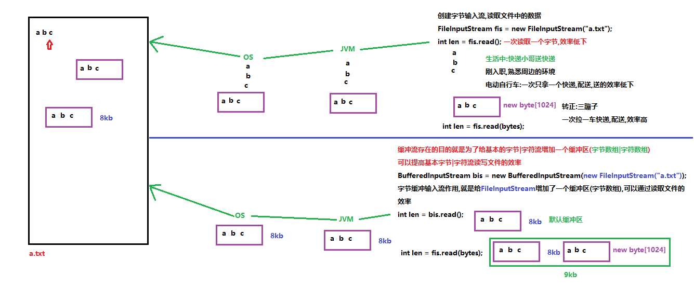

### 字节缓冲输入流

缓冲流存在的目的就是为了给基本的字节/字符流增加一个缓冲区, 可以提高基本字节字符流读写文件的效率

其实这个就是上面的方法中read(byte[]), 把这个数组给包装了进来

`java.io.BufferedInputStream`字节缓冲输入流 extends `InputStream`字节输出流

方法:

`int read()` 一次读取一个字节并返回

`int read(byte[] b)` 使用数组缓冲,一次读取多个字节

`void close()` 关闭此输入流并释放与该流关联的所有系统资源。

构造方法:

1. `BufferedInputStream(InputStream in)` 创建一个具有默认缓冲区大小的BufferedInputStream对象

   参数:

   - `InputStream in` 传递字节输入流,可以传递InputStream的任意子类对象

     我们可以传递FileInputStream对象,缓冲流就会给FileInputStream对象增加一个缓冲区(字节数组)

     提高FileInputStream读取文件的效率

   - `private static int DEFAULT_BUFFER_SIZE = 8192`

2. `BufferedInputStream(InputStream in, int size)` 创建具有指定缓冲区大小的 BufferedInputStream对象

   参数:

   - `InputStream in`:传递字节输入流,可以传递InputStream的任意子类对象, 我们可以传递FileInputStream对象, 缓冲流就会给FileInputStream对象增加一个缓冲区(字节数组)
   - `int size`指定缓冲区的大小(数组的长度),不写使用默认值

**注意**:

- 当使用默认的缓冲区的时候, 还使用`read(byte[] b)`的时候, 就会将默认的8kb与这个byte[ ]字节数组的大小相加, 形成一个更大的数组
- 特别之处, 缓冲流有个特有的readLine()方法, 而且写的时候需要flush一下
- 创建BufferedInputStream对象,构造方法中传递FileInputStream对象

```Java
int len = 0;
while ((len = bufferIn.read())!=-1){
    System.out.println((char)len);
}
```


### 字节缓冲输出流

`java.io.BufferedOutputStream`字节缓冲输出流 extends OutputStream字节输出流

`public void close()` 关闭此输出流并释放与此流相关联的任何系统资源

`public void flush()` 刷新此输出流并强制任何缓冲的输出字节被写出

`public void write(byte[] b)`  将 b.length字节从指定的字节数组写入此输出流

`public void write(byte[] b, int off, int len)`  从指定的字节数组写入 len字节，从偏移量 off开始输出到此输出流

`public  void write(int b)` 将指定的字节输出流

构造方法

`BufferedOutputStream(OutputStream out)` 创建一个新的缓冲输出流，具有默认缓冲区大小

`BufferedOutputStream(OutputStream out, int size)` 创建一个新的缓冲输出流，具有指定缓冲区大小

**注意**

这个和字节流的区别就是, 这个在write之后, 内容会写进缓冲区, 必须再flush一下, 才可以刷新到txt文件之中


### 复制文件测试缓冲流的效率

```java
package com.itheima.demo01BufferedStream;

import java.io.*;

/*
    复制文件测试缓冲流的效率
 */
public class Demo03CopyFile {
    public static void main(String[] args) {
        long s = System.currentTimeMillis();

        //copyFile01();
        copyFile02();

        long e = System.currentTimeMillis();
        System.out.println("复制文件共耗时:"+(e-s)+"毫秒");
    }

    /*
        使用字节缓冲输入流和字节缓冲输出流复制文件
        全球通史.txt 5,155,785 字节
        复制文件共耗时:417毫秒
     */
    private static void copyFile02() {
        try (BufferedInputStream bis = new BufferedInputStream(new FileInputStream("c:\\全球通史.txt"));
             BufferedOutputStream bos = new BufferedOutputStream(new FileOutputStream("d:\\全球通史.txt"));){
            //一读一写复制文件
            int read = 0;
            while ((read = bis.read())!=-1){
                bos.write(read);
            }
        } catch (IOException e) {
            e.printStackTrace();
        }
    }

    /*
        使用基本的字节输入流和字节输出流复制文件
        全球通史.txt 5,155,785 字节
        复制文件共耗时:50701毫秒
     */
    private static void copyFile01() {
        try(FileInputStream fis = new FileInputStream("c:\\全球通史.txt");
            FileOutputStream fos = new FileOutputStream("d:\\全球通史.txt");) {
            //一读一写复制文件
            int len = 0;
            while ((len = fis.read())!=-1){
                fos.write(len);
            }
        } catch (IOException e) {
            e.printStackTrace();
        }
    }
}
```


### 字符缓冲输入流

`java.io.BufferedReader`字符缓冲输入流 extends Reader字符输入流

继承自父类的共性成员方法

`int read()` 读取单个字符

`int read(char[] cbuf)` 将字符读入数组

`void close()` 关闭该流并释放与之关联的所有资源

构造方法

`BufferedReader(Reader in)` 创建一个使用默认大小输入缓冲区的缓冲字符输入流

里面传入的是Read的子类, FileReader 

`BufferedReader(Reader in, int sz)` 创建一个使用指定大小输入缓冲区的缓冲字符输入流

特有的成员方法

`String readLine()` 读取一个文本行 一次可以读取一行数据, 通过下列字符之一即可认为某行已终止：换行 ('\n')、回车 ('\r') 或回车后直接跟着换行(\r\n), 包含该行内容的字符串，不包含任何行终止符，如果已到达流末尾，则返回 **null**

### 字符缓冲输出流

`java.io.BufferedWriter`字符缓冲输出流 extends Writer:字符输出流

`public abstract void close()`   关闭此输出流并释放与此流相关联的任何系统资源

`public abstract void flush()`   刷新此输出流并强制任何缓冲的输出字符被写出

`public void write(int c)`   写出一个字符

`public void write(char[] cbuf)` 将 b.length字符从指定的字符数组写出此输出流

`public abstract void write(char[] b, int off, int len) `从指定的字符数组写出 len字符，从偏移量 off开始输出到此输出流

`public void write(String str) `写出一个字符串

`public void write(String str, int off, int len)` 写入字符串的某一部分

**构造方法**

`BufferedWriter(Writer out)`  创建一个使用默认大小输出缓冲区的缓冲字符输出流

`BufferedWriter(Writer out, int sz)`创建一个使用给定大小输出缓冲区的新缓冲字符输出流

### 文本排序

注意:

去除空行的时候, 应该用equals, 而不是==

如果不除去空行, `String line2 = bufferedReader.readLine();` 假设这一行存储的是空行, 

那么,

1.  这一行的长度是0
2. 使用charOf(0)的结果就是`StringIndexOutOfBoundsException`出现该异常
3. `line2==" ";  ==> false  `    `line2.equals(" "); ==> true`

```java
package com.itheima.day22;

import java.io.BufferedReader;
import java.io.FileReader;
import java.io.IOException;
import java.util.ArrayList;
import java.util.Collections;

public class Compare {
    public static void main(String[] args) throws IOException {
        //读取出师表
        BufferedReader bufferedReader = new BufferedReader(new FileReader("demo.txt"));
        //写入到list中
        String line;
        ArrayList<String> lists = new ArrayList<>();
        while ((line=bufferedReader.readLine())!=null){
            //除去空行
            if (!line.equals("")) {
                lists.add(line);
            }
        }
        //Collection里面的方法进行排序
       Collections.sort(lists,(o1,o2)->o1.charAt(0)-o2.charAt(0));
        //遍历
        for (String list : lists) {
            System.out.println(list);
        }
        //释放资源
        bufferedReader.close();
    }
}
```

## 转换流

**编码表**

ASCII码表: 

用于显示现代英语, 主要包括控制字符(回车键, 退格, 换行键等)和可显示字符(英文大小写字母, 阿拉伯数字, 和西文符号)

基本的ASCII, 使用7位(bits)表示一个字符, 共128个字符, ASCII的拓展字符集使用8位, 表示一个字符, 共256字符, 方便支持欧洲常用字符


**ISO-8859-1字符集**：拉丁码表

- 拉丁码表，别名Latin-1，用于显示欧洲使用的语言，包括荷兰、丹麦、德语、意大利语、西班牙语等。
- ISO-8859-1使用单字节编码，兼容ASCII编码。**不支持中文**

**GBxxx字符集**：国标

- GB就是国标的意思，是为了显示中文而设计的一套字符集。兼容ASCII表
- GB2312：简体中文码表。 7000多个简体汉字 
- **GBK**:**目前操作系统默认中文码表(简体,繁体),存储一个中文使用2个字节**,21003个汉字 
- GB18030：最新的中文码表。包含的文字最全(简体,繁体,少数民族,日韩文字)

**Unicode字符集** ：万国码

- **UTF-8**:最常用的万国表,兼容所有国家的文字

- 编码规则:
  - 128个US-ASCII字符，只需一个字节编码。
  - 拉丁文等字符，需要二个字节编码。 
  - **大部分常用字（含中文），使用三个字节编码。**
  - 其他极少使用的Unicode辅助字符，使用四字节编码

### Unicode和UTF-8的关系

Unicode为字符集, 为每一个字符分配一个唯一的ID(码位)

UTF-8是编码规则, 将上述码位转换为字节序列的规则

UTF-8是一套以8位为一个编码单位的**可变长编码**, 会将一个码位编码为1-4个字节

Unicode字符集为每一个字符分配了一个码位, 例如, 知的码位就是30693, 记作U+77E5的16进制为0x77E5

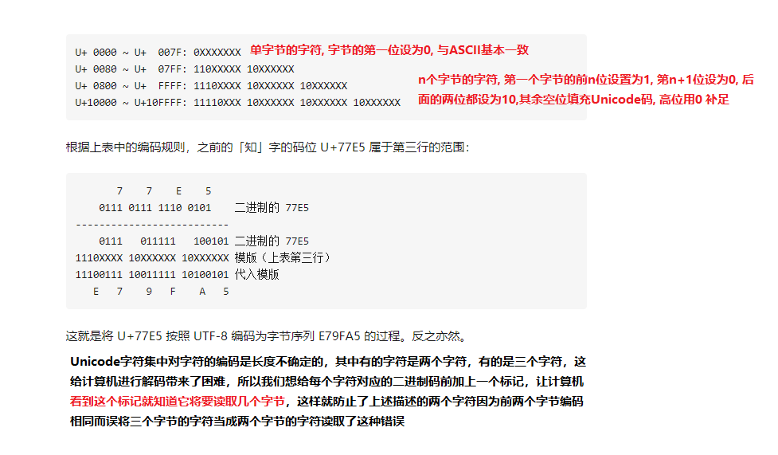

### 编码问题

FileReader:只能读取IDEA默认编码的文件(UTF-8编码), 使用FileReader读取GBK编码的文件:会出现乱码,编码和解码不一致导致

### 转换流的原理

FileReader 字符输入流, 只能查询IDEA默认编码表, 底层还是FileInputStream(fileName), FileReader继承自FileInputStream

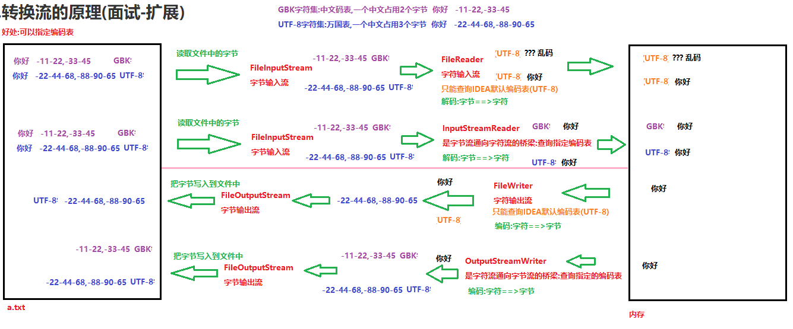

InputStreamReader是字节流通向字符流的桥梁, 每次调用 InputStreamReader 中的一个 read()  方法都会导致从底层输入流读取一个或多个字节。要启用从字节到字符的有效转换，可以提前从底层流读取更多的字节，使其超过满足当前读取操作所需的字节。 

为了达到最高效率，可要考虑在 BufferedReader 内包装 InputStreamReader。例如： 

```java
BufferedReader in  = new BufferedReader(new InputStreamReader(System.in));
```

`java.io.InputStreamReader`:字符转换输入流 extends Reader:字符输出流

构造方法

`InputStreamReader(InputStream in)`创建一个使用默认字符集的 InputStreamReader

InputStream是一个抽象类, 传入的是他的子类,  FileInputStream

**注意里面传入的是InputSream**

`InputStreamReader(InputStream in, String charsetName)` 创建使用指定字符集的 InputStreamReader

InputStreamReader构造方法中指定的编码表名称必须和文件的编码一致,否则会出现乱码

`java.io.OutputStreamWriter`字符转换输出流 extends Writer: 字符输出流

构造方法:

`OutputStreamWriter(OutputStream out)`创建使用默认字符编码的 OutputStreamWriter

`OutputStreamWriter(OutputStream out, String charsetName)`创建使用指定字符集的 OutputStreamWriter。

使用OutputStreamWriter对象中的方法write,把数据写入到内存**缓冲区**中(字符==>字节)

**总结:**

**什么时候使用FileReader和FileWriter(读取字符的便捷类):读写的文件都是IDEA默认编码utf-8的文件**

**什么时候使用InputStreamReader和OutputStreamWriter:读写的文件不是IDEA默认编码utf-8的文件**

## 序列化流

把对象以流的方式写入到文件中去, 叫写对象, 也叫对象的序列化, 写的对象不仅仅包含字符, 还有一些其他的内容, 使用字节流

ObjectOutputStream: 对象的序列化流, ～

文件中保存的都是字节, 不能使用记事本直接打开查看, 出现乱码, 记事本没有把字节转换为对象的编码

ObjectInputStream 对象的反序列化, readObject(p)

**对象的序列化流**

`java.io.ObjectOutputStream`对象的序列化流 extends OutputStream:字节输出流

构造方法

`ObjectOutputStream(OutputStream out)` 创建写入指定 OutputStream 的 ObjectOutputStream

特有的成员方法

`void writeObject(Object obj)` 将指定的对象写入 

在进行序列化|反序列化的时候,会抛出`NotSerializableException`:没有序列化异常

类通过实现 `java.io.Serializable` 接口以启用其序列化功能。未实现此接口的类将无法使其任何状态序列化或反序列化。

**对象的反序列化流**

`java.io.ObjectInputStream`对象的反序列化流 extends InputStream:字节输入流

 **构造方法**

`ObjectInputStream(InputStream in)`创建从指定 InputStream 读取的 ObjectInputStream

**特有的成员方法**

`Object readObject()` 从 ObjectInputStream 读取对象。

反序列化有两个前提:

1. 类实现Serializable接口 
2. 类有对应的class文件(Person.class)

### transient:瞬态关键字

被transient关键字修饰的变量不能被序列化

```java
private transient int age;
oos.writeObject(new Person("小美女",18)); 不会把18写入到文件中
Object obj = ois.readObject(); Person{name='小美女', age=0}
```

**static:静态关键字**

被static修饰的成员属于类,不属于某一个对象,被所有的对象所共享使用

被static修饰的成员,也不能序列化,序列化的是对象

```java
private static int age;
oos.writeObject(new Person("小美女",18)); 不会把18写入到文件中
Object obj = ois.readObject(); Person{name='小美女', age=0}
```


### 序列号冲突异常

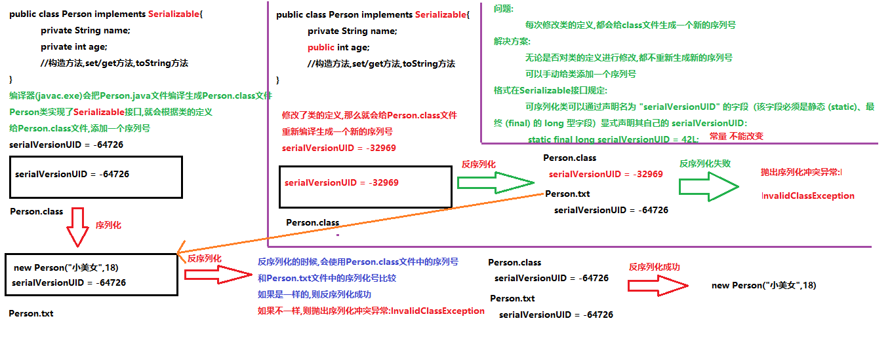

   在类中手动添加了一个序列号,无论类是否修改,序列号都是固定写死的常量值,值是不会改变的,也就不会抛出异常了

```java
public final class String implements java.io.Serializable
private static final long serialVersionUID = -6849794470754667710L;

public class Person implements Serializable{
    private static final long serialVersionUID = 1L;
    private String name;
    public int age;
}
```

**Serializable接口规定**

可序列化类可以通过声明名为 "serialVersionUID" 的字段, (该字段必须是静态 (static)、最终 (final) 的 long 型字段）显式声明其自己的 serialVersionUID：
`static final long serialVersionUID = xxL;`
在类中手动添加了一个序列号,无论类是否修改,序列号都是固定写死的常量值,值是不会改变的,也就不会抛出异常了

```java
public final class String implements java.io.Serializable
private static final long serialVersionUID = -6849794470754667710L;
```

**序列化集合**

如果要往文件中存储多个对象,不建议使用多次writeObject方法写多个对象(读取多次)

建议创建一个集合,把对象保存到集合中,对集合对象进行序列化和反序列化(读写一次就行了)

```java
package com.itheima.day22;

import java.io.*;
import java.util.ArrayList;
import java.util.Collections;

public class Question1_4 {
    public static void main(String[] args) throws IOException, ClassNotFoundException {
        //定义一个学生集合
        ArrayList<Student> students = new ArrayList<>();
        students.add(new Student("迪丽热巴","女",18,99));
        students.add(new Student("古力娜拉","女",19,98));
        students.add(new Student("周杰伦","男",20,88));
        students.add(new Student("蔡徐坤","男",19,78));

        ObjectOutputStream outputStream = new ObjectOutputStream(new FileOutputStream("demo.txt"));
        outputStream.writeObject(students);
        //记得关
        outputStream.close();

        ObjectInputStream inputStream = new ObjectInputStream(new FileInputStream("demo.txt"));
        Object myStudets = inputStream.readObject();
        //记住ArrayList怎么向下转型
        ArrayList<Student> myStudentList = (ArrayList<Student>)myStudets;
        for (Student student : myStudentList) {
            System.out.println(student);
        }
        inputStream.close();
    }
}
```

## 打印流

`java.io.PrintStream` 字节打印流 extends OutputStream: 字节输出流

特点:

1. PrintStream 为其他输出流添加了功能，使它们能够方便地打印各种数据值表示形式, PrintStream流中有两个特有的方法:print, println
2. 与其他输出流不同，PrintStream 永远不会抛出 IOException,创建对象的时候,传递路径不存在,可能会抛出文件找不到异常
3. PrintStream叫打印流,只负责输出(打印),不能读取

构造方法

`PrintStream(File file)`  打印流的目的地是一个文件

`PrintStream(OutputStream out)` 打印流的目的地是一个字节输出流

`PrintStream(String fileName)` 打印流的目的地是一个文件路径

自己特有的成员方法:print, println写数据,原样输出

`void print(Object x)`    可以写任意类型数据,不换行

`void println(Object x) ` 可以写任意类型的数据,换行

```java

public static void main(String[] args) throws FileNotFoundException {
    //1.创建PrintStream对象,构造方法中绑定要输出的目的地
    PrintStream ps = new PrintStream("day22\\print1.txt");
    //2.使用PrintStream对象中的方法write,print,println,把数据写入到文件中
    //继承自父类OutputStream的共性的成员方法write:使用write写数据,查看的时候,会查询编码表
    ps.write(97);//a

    //自己特有的成员方法:print,println写数据,原样输出
    ps.println(97);//97
    ps.println('@');//@
    ps.println(true);//true
    ps.println(1.1);//1.1
    ps.println("aaa");//aaa

    //3.释放资源
    ps.close();

    //打印字符数组不是地址值,是数组中的元素 void println(char[] x) 打印字符数组(字符串底层就是字符数组)
    char[] chars = {'a','b','c'};
    System.out.println(chars);//abc
    System.out.println("abc");//abc
}
```

```java
 public static void main(String[] args) throws FileNotFoundException {
        System.out.println("输出语句的目的地默认是在控制台输出!");

        PrintStream ps = new PrintStream("day22\\print2.txt");
        System.setOut(ps);//修改输出语句的目的地(控制台)为打印流的目的地

        System.out.println(1);
        System.out.println(2);
        System.out.println(3);
        System.out.println("输出语句的目的地不是控制台了,是print2.txt文件中");
 }
```

## 装饰设计模式

**装饰模式指的是在不改变原类, 不使用继承的基础上，动态地扩展一个对象的功能**

手机的装饰者类

要求:

1.  和手机继承相同的父类或者实现相同的接口

2. 把手机传递类中,对手机进行装饰

   在类中定义一个Phone类型的变量,使用构造方法为变量赋值

```java
public class PhoneWapper extends Phone{
    private Phone phone;

    public PhoneWapper(Phone phone) {
        this.phone = phone;
    }

    @Override
    public void call() {
        //对打电话的功能进行装饰
        System.out.println("打电话之前听彩铃!");
        phone.call();
    }

    @Override
    public void sendMessage() {
        //发短信的功能不变
        phone.sendMessage();
    }
}
```

```java
FirstPhone p1 = new FirstPhone();
p1.call();
p1.sendMessage();
//创建手机的装饰者对象,参数传递FirstPhone对象,对FirstPhone对象进行装饰
PhoneWapper pw1 = new PhoneWapper(p1);
pw1.call();//装饰后的方法
pw1.sendMessage();
```

```java
//java中有很多地方都使用了装饰者设计模式
FileReader fr = new FileReader("day22\\1.txt");
int len = fr.read();//一次读取一个字符效率低下

//BufferedReader就是一个装饰者类,给FileReader增加一个缓冲区,提高FileReader读取文件的效率
BufferedReader bw = new BufferedReader(fr);
int len2 = bw.read();//把读取到的字符存储到内部的缓冲区中,一次性返回,提高效率
```

装饰模式可以在不改变原类的基础上对类中的方法进行扩展增强,实现原则为:

1. 装饰类和被装饰类必须实现相同的接口,继承相同的父类
2. 在装饰类中必须传入被装饰类的引用(对象),使用构造方法传递
3. 在装饰类中对需要扩展的方法进行扩展
4. 在装饰类中对不需要扩展的方法调用被装饰类中的同名方法

## commons-io工具包

commons-io是apache开源基金组织提供的一组有关IO操作的类库，可以挺提高IO功能开发的效率。commons-io工具包提供了很多有关io操作的类，见下表：

| 包                                  | 功能描述                                     |
| ----------------------------------- | :------------------------------------------- |
| org.apache.commons.io               | 有关Streams、Readers、Writers、Files的工具类 |
| org.apache.commons.io.input         | 输入流相关的实现类，包含Reader和InputStream  |
| org.apache.commons.io.output        | 输出流相关的实现类，包含Writer和OutputStream |
| org.apache.commons.io.serialization | 序列化相关的类                               |

### 添加第三方jar包到模块中

步骤：

1. 步骤：

   1. 下载commons-io相关jar包；http://commons.apache.org/proper/commons-io/

   2. 把commons-io-2.6.jar包复制到指定的Module的lib目录中

      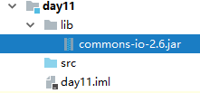

   3. 将commons-io-2.6.jar加入到classpath中

      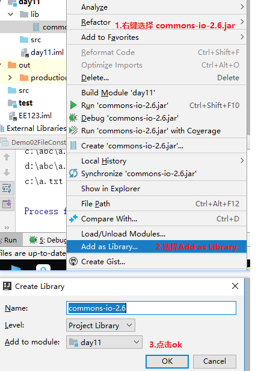

### IOUtils基本使用

 org.apache.commons.io.IOUtils: 操作IO流的工具类

1. `public static int copy(InputStream in, OutputStream out)`

   把input输入流中的内容拷贝到output输出流中，返回拷贝的字节个数(适合文件大小为2GB以下)

2. `public static long copyLarge(InputStream in, OutputStream out)`

   把input输入流中的内容拷贝到output输出流中，返回拷贝的字节个数(适合文件大小为2GB以上)

```java
public class Demo01IOUtils {
    public static void main(String[] args) throws IOException {
        //使用IOUtils工具类中的静态方法copy复制一个文件
        //int fileSize = IOUtils.copy(new FileInputStream("c:\\1.jpg"), new FileOutputStream("d:\\1.jpg"));
        //System.out.println(fileSize);//161548 字节  文件的大小

        //使用IOUtils工具类中的静态方法copyLarge复制一个大文件
        long fileSize2 = IOUtils.copyLarge(new FileInputStream("c:\\748m.rar"), new FileOutputStream("d:\\748m.rar"));
        System.out.println(fileSize2);//785,042,177 字节
    }
}
```

### FileUtils基本使用

org.apache.commons.io.FileUtils:操作文件的工具类

`static String readFileToString(File file)` 读取一个文件以字符串形式返回

`static void writeStringToFile(File file, String data)` 把字符串写入到一个文件中

`static void copyFile(File srcFile, File destFile)` 文件复制

`static void copyFileToDirectory(File srcFile, File destDir)` 把一个文件复制到一个文件夹中

 `static void copyDirectoryToDirectory(File srcDir, File destDir)` 文件夹复制

注意:

    以上4个方法的参数都是File对象

```java
public class Demo02FileUtils {
    public static void main(String[] args) throws IOException {
        show05();
    }

    /*
        static void copyDirectoryToDirectory(File srcDir, File destDir) 文件夹复制
     */
    private static void show05() throws IOException {
        FileUtils.copyDirectoryToDirectory(new File("c:\\demo"),new File("d:\\"));
    }

    /*
        static void copyFileToDirectory(File srcFile, File destDir) 把一个文件复制到一个文件夹中
     */
    private static void show04() throws IOException {
        FileUtils.copyFileToDirectory(new File("c:\\全球通史.txt"),new File("d:\\base"));
    }

    /*
        static void copyFile(File srcFile, File destFile) 文件复制
     */
    private static void show03() throws IOException {
        FileUtils.copyFile(new File("c:\\全球通史.txt"),new File("d:\\全球通史.txt"));
    }

    /*
        static void writeStringToFile(File file, String data) 把字符串写入到一个文件中
     */
    private static void show02() throws IOException {
        FileUtils.writeStringToFile(new File("day22\\io.txt"),"哈哈");
    }

    /*
        static String readFileToString(File file) 读取一个文件以字符串形式返回
     */
    private static void show01() throws IOException {
        String s = FileUtils.readFileToString(new File("c:\\Demo01BufferedInputStream.java"));
        System.out.println(s);
    }
}
```

## Junit单元测试

Junit是一个Java语言的单元测试框架，简单理解为可以用于取代java的(**部分**)main方法。Junit属于第三方工具，需要导入jar包后使用。

Junit的作用:可以单独的执行某一个方法,对方法进行测试

Junit的使用步骤

1. 导入Junit的jar包(不是java提供,第三方提供)

2. 在要执行的方法上添加一个@Test注解

3. 选择方法左边的绿色三角或者右键选择方法,选择run 方法名称,运行方法

   选择类左边的绿色三角或者右键选择类,选择run 类名,运行类中所有被@Test注解修饰的方法

   右键选择模块名称,选择 run "All Tests",运行模块中所有被@Test注解修饰的方法

Junit的注意事项

1. 没有添加@Test注解的方法,不能使用Junit单元测试运行的
2. Junit单元测试只能运行public修饰的无返回值,无参数的方法

Junit相关注解
- @Test:可以单独的执行某一个方法

* @Before：用来修饰方法，该方法会在每一个 n 方法执行之前自动执行一次

* @After：用来修饰方法，该方法会在每一个测试方法执行之后自动执行一次

* @BeforeClass：用来静态修饰方法，该方法会在所有测试方法之前自动执行一次，而且只执行一次

* @AfterClass：用来静态修饰方法，该方法会在所有测试方法之后自动执行一次，而且只执行一次

    注意:

    @Before,@After,@BeforeClass,@AfterClass:这四个注解修饰的方法,不能单独运行,会自动在@Test修饰的方法前后运行

    @Before,@After:这个两个注解修饰的方法,会在每一个@Test修饰的方法前后自动运行

    @BeforeClass,@AfterClass:这两个注解用于修饰静态方法,会在所有的@Test修饰的方法前后自动运行一次

Junit常用注解(Junit5.x版本)
* @BeforeEach：用来修饰方法，该方法会在每一个测试方法执行之前执行一次。
* @AfterEach：用来修饰方法，该方法会在每一个测试方法执行之后执行一次。
* @BeforeAll：用来静态修饰方法，该方法会在所有测试方法执行之前执行一次。
* @AfterAll：用来静态修饰方法，该方法会在所有测试方法执行之后执行一次

# 4. TCP-IP

**C/S结构** ：全称为Client/Server结构，是指客户端和服务器结构。常见程序有ＱＱ、迅雷等软件。
**B/S结构** ：全称为Browser/Server结构，是指浏览器和服务器结构。常见浏览器有谷歌、火狐等。

两种架构各有优势，但是无论哪种架构，都离不开网络的支持。**网络编程**，就是在一定的协议下，实现两台计算机的通信的程序。

## 网络通信协议

UDP:面向无连接的协议,通信的双方不用建立连接,可以直接发送数据

- 好处: 效率高,耗资小
- 弊端: 不安全,容易丢失数据

TCP:面向连接协议,客户端和服务器端必须经过3次握手建立逻辑连接,才能通信

- 好处:安全
- 弊端:效率低

三次握手：TCP协议中，在发送数据的准备阶段，客户端与服务器之间的三次交互，以保证连接的可靠

- 第一次握手，客户端向服务器端发出连接请求，等待服务器确认。服务器你死了吗？ 
- 第二次握手，服务器端向客户端回送一个响应，通知客户端收到了连接请求。我活着 啊！！ 
- 第三次握手，客户端再次向服务器端发送确认信息，确认连接。我知道了！！ 

## IP地址

**IP地址:就相当于计算机的身份号(唯一)**

ip地址的作用:具有唯一性,在网络中可以通过ip地址找到另外一台计算机

ip地址分类

1. ipv4:ip地址由4个字节组成,一个字节8位(比特位1,0)

   二进制:11001101.11001100.11000001.11001111

   十进制:192.168.0.106

   每个字节的范围:0-255(2^8),ip地址第一位不能为0 

   ip地址的数量:42亿

   问题:随着计算机的增多,ip地址面临枯竭(全球IPv4地址在2011年2月分配完毕)不够用,就出了ipv6地址

2. ipv6:ip地址由16个字节组成,一个字节8位(比特位1,0)

   ip地址的数量:

   号称可以为地球上每一粒沙子编写一个ip地址

   为了表示方便使用十六进制:fe80::a8a6:b83c:8b8b:2685%17

常用的dos命令:

1. ipconfig	Windows IP 配置

   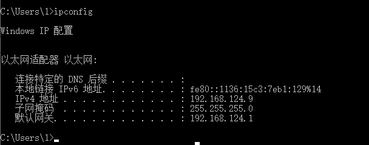

2. ping ip地址:测试你的电脑和指定ip地址的电脑是否可以连通

## 端口号

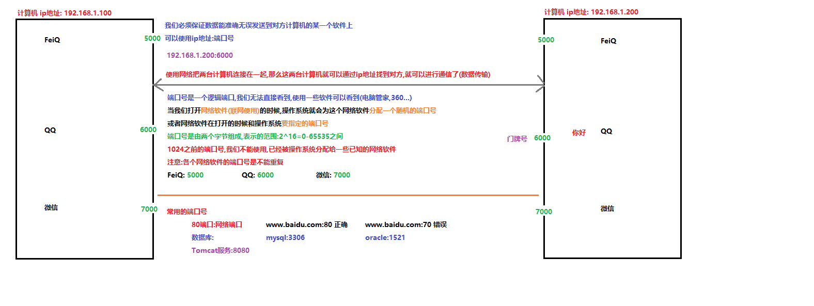

## InetAddress类

`java.net.InetAddress` 描述计算机的ip地址

此类表示互联网协议 (IP) 地址

可以使用InetAddress类中的方法获取到计算机的ip地址

静态方法

`static InetAddress getLocalHost()` 返回本地主机(你自己电脑的ip地址对象)

`static InetAddress getByName(String host)` 在给定主机名的情况下确定主机的 IP 地址

非静态方法

`String getHostAddress()` 返回 IP 地址字符串（以文本表现形式)

`String getHostName()`  获取此 IP 地址的主机名

```java
package com.itheima.day23;

import java.net.InetAddress;
import java.net.UnknownHostException;

public class IPDemo {
    public static void main(String[] args) throws UnknownHostException {
        show01();
    }

    private static void show01() throws UnknownHostException {
        //获取自己电脑的IP地址
        System.out.println(InetAddress.getLocalHost());  //DESKTOP-N8V6NO8/192.168.124.9
        //获取自己主机的名字
        System.out.println(InetAddress.getLocalHost().getHostName());  //DESKTOP-N8V6NO8
        InetAddress inetAddress = InetAddress.getByName("www.itheima.com");
        System.out.println(inetAddress.getHostName());     //www.itheima.com
        System.out.println(inetAddress.getHostAddress());      //119.52.2.102
        System.out.println(inetAddress);   //www.itheima.com/119.52.2.102
    }
}

```

## TCP通信程序


java.net.Socket:此类实现客户端套接字（也可以就叫“套接字”）

构造方法

- `Socket(InetAddress address, int port)`创建一个流套接字并将其连接到指定 IP 地址的指定端口号
- `Socket(String host, int port)` 创建一个流套接字并将其连接到指定主机上的指定端口号
  - `InetAddress address|String host` 传递服务器的ip地址
  - `int port`  服务器的端口号

成员方法:

- `OutputStream getOutputStream()`返回此套接字的输出流
- `InputStream getInputStream()` 返回此套接字的输入流

### TCP通信的客户端

客户端实现步骤(重点):

1. 创建客户端Socket对象,构造方法中绑定服务器的ip地址和端口号

2. 使用客户端Socket对象中方法getOutputStream,获取网络字节输出流OutputStream对象

3. 使用网络字节输出流OutputStream对象中的方法write,给服务器发送数据

   write里面使用String的getbyte()方法, 而不是使用char类型数组

4. 使用客户端Socket对象中方法getInputStream,获取网络字节输入流InputStream对象

5. 使用网络字节输入流InputStream对象中的方法read,读取服务器发送的数据

6. 释放资源(**Socket对象**)

```java
package com.itheima.day23;
import java.io.IOException;
import java.io.InputStream;
import java.io.OutputStream;
import java.net.Socket;

public class Demo01TCPClient {
    public static void main(String[] args) throws IOException {
        //1.创建客户端Socket对象,构造方法中绑定服务器的ip地址和端口号
        Socket socket = new Socket("127.0.0.1",8888);
        //2.使用客户端Socket对象中方法getOutputStream,获取网络字节输出流OutputStream对象
        OutputStream os = socket.getOutputStream();
        //3.使用网络字节输出流OutputStream对象中的方法write,给服务器发送数据
        os.write("你好服务器".getBytes());
        //4.使用客户端Socket对象中方法getInputStream,获取网络字节输入流InputStream对象
        InputStream is = socket.getInputStream();
        //5.使用网络字节输入流InputStream对象中的方法read,读取服务器发送的数据
        byte[] bytes = new byte[1024];
        int len = is.read(bytes);
        System.out.println(new String(bytes,0,len));
        //6.释放资源(Socket对象)
        socket.close();
    }
}
```
### TCP通信服务器端

```java
package com.itheima.demo02TCP;

import java.io.IOException;
import java.io.InputStream;
import java.io.OutputStream;
import java.net.ServerSocket;
import java.net.Socket;

/*
    TCP通信的服务器端
    作用:接收客户端的请求和客户端经过3次握手建立连接通路;读取客户端发送的数据,给客户端回写(发送)数据
    表示服务器的类:
        java.net.ServerSocket;此类实现服务器套接字。
    构造方法:
        ServerSocket(int port) 创建绑定到特定端口的服务器套接字。
    成员方法:
        Socket accept() 侦听并接受到此套接字的连接。
        使用accpet方法,会一直监听客户端的请求
            有客户端请求服务器,accept方法就会获取到请求的客户端Socket对象
            没有客户端请求服务器,accept方法会进入到阻塞状态,一直等待
*/         
public class Demo02TCPServer {
    public static void main(String[] args) throws IOException {
        //1.创建服务器ServerSocket对象,在构造方法中和系统要指定的端口号
        ServerSocket server = new ServerSocket(8888);
        System.out.println("----------服务器已经启动了,等待客户端连接-------------");
        //2.使用服务器ServerSocket对象中的方法accept,监听并获取请求的客户端Socket对象
        Socket socket = server.accept();//accpet运行之后,会一直等待客户端的请求
        //3.使用Socket对象中的方法getInputStream,获取网络字节输入流InputStream对象
        InputStream is = socket.getInputStream();
        //4.使用网络字节输入流InputStream对象中的方法read,读取客户端发送的数据
        byte[] bytes = new byte[1024];
        int len = is.read(bytes);
        System.out.println(new String(bytes,0,len));
        //5.使用Socket对象中的方法getOutputStream,获取网络字节输出流OutputStream对象
        OutputStream os = socket.getOutputStream();
        //6.使用网络字节输出流OutputStream对象中的方法write,给客户端回写数据
        os.write("收到,谢谢".getBytes());
        //7.释放资源(Socket对象,ServerSocket对象)
        socket.close();
        server.close();
    }
}
```


## 文件上传案例

文件上传案例的客户端


### 文件上传的阻塞问题

### 文件上传自定义文件名称命名规则

### 多线程版本服务器

**客户端**

```java
package com.itheima.day23;

import java.io.*;
import java.net.Socket;

public class Question1_2Clien {
    public static void main(String[] args) throws IOException {
        //将D:\\音乐\\刀郎.jpg传入到服务器D:\\Java文件夹
        //文件上传客户端
        File file = new File("D:\\音乐\\刀郎.jpg");
        //客户端需要先把硬盘的数据读取到流中来, 读取图片使用字节流
        FileInputStream filein = new FileInputStream(file);
        //再把这个数据通过Socket传到服务器
        Socket socket = new Socket("192.168.124.9",5679);
        OutputStream out = socket.getOutputStream();
        byte[] bytes = new byte[1024];
        int len = 0;
        while((len = filein.read(bytes))!=-1){
            //写的时候, 传入bytes数组, 并且记得传入有效位
            out.write(bytes,0,len);
        }
        socket.shutdownOutput();
        //接收服务器的反馈信息
        InputStream in = socket.getInputStream();
        //这个地方不用新建数组, 还可以使用之前的数组
        while((len = in.read(bytes))!=-1){
            System.out.println(new String(bytes,0,len));
        }

        filein.close();
        socket.close();
        //释放资源
    }
}

```

**服务器**

```java
package com.itheima.day23;

import java.io.*;
import java.net.ServerSocket;
import java.net.Socket;

public class Question1_2Server {
    public static void main(String[] args) throws IOException {
        //编写复制文件的服务器端
        //将接收到的文件复制到D盘的Java中
        //判断D盘有没有对应文件夹
        File file = new File("D:\\java\\我的图片");
        if(!file.exists()){
            file.mkdir();
        }
        //接收数据
        ServerSocket server = new ServerSocket(5679);
        while (true) {
            Socket socket = server.accept();
            new Thread(()-> {
                try {
                    InputStream in = socket.getInputStream();
                    //随机名字
                    //这个格式很重要,记住,不需要转换为String, 不需要加乱七八糟的括号
                    String name = "itheima" + System.currentTimeMillis() + (int) Math.random() * 1000 + ".jpg";
                    //记住这个构造方法
                    FileOutputStream outFile = new FileOutputStream(file + File.separator + name);
                    int len = 0;
                    byte[] bytes = new byte[1024];
                    //向硬盘中写入数据
                    while ((len = in.read()) != -1) {
                        //记得传入数组之后还要传入有效位数
                        outFile.write(bytes, 0, len);
                    }
                    //向客户端返回信息
                    //可以省略对象名字
                    socket.getOutputStream().write("服务器已经收到, sir!".getBytes());
                    //释放资源
                    outFile.close();
                    socket.close();
                } catch (IOException e) {
                    e.printStackTrace();
                }
            }).start();
            // //不让服务器关闭
            //server.close();
        }
    }
}
```

## 模拟B\S服务器

模拟网站服务器, 使用浏览器访问自己编写的服务端程序, 查看网页效果

这里面客户端即为浏览器, 输入了url地址, 即统一资源定位符, 定位到服务器上某一资源, 根据url地址访问服务器的资源

客户端想要读取到day23/web/index.服务器需要做的事, 根据路径读取文件, 把文件回写到客户端中显示

步骤:

1. 启动服务器

2. 浏览器即客户端, 请求服务器, 给服务器发送了一堆内容

   ```
   GET /Demo/web/index2.html HTTP/1.1
   Host: localhost:8080
   Connection: keep-alive
   Cache-Control: max-age=0
   Upgrade-Insecure-Requests: 1
   User-Agent: Mozilla/5.0 (Windows NT 10.0; Win64; x64) AppleWebKit/537.36 (KHTML, like Gecko) Chrome/83.0.4103.116 Safari/537.36
   Accept: text/html,application/xhtml+xml,application/xml;q=0.9,image/webp,image/apng,*/*;q=0.8,application/signed-exchange;v=b3;q=0.9
   Sec-Fetch-Site: cross-site
   Sec-Fetch-Mode: navigate
   Sec-Fetch-User: ?1
   Sec-Fetch-Dest: document
   Accept-Encoding: gzip, deflate, br
   Accept-Language: zh-CN,zh;q=0.9
   ```

3. 服务器用网络输入流接收到这个内容

4. 从这个内容中分离出第一行的文件地址

5. 使用字节输入流读取本服务器的 本地资源

6. 使用网络输出流将该资源输出到浏览器

注意:

1. 图片不能显示,  因为页面有多个图片, 客户端会根据图片的路径, 再一次的请求服务器, 把图片的路径发送给服务器, 让服务器根据图片的路径读取图片, 然后把图片写回到客户端显示

   我们可以写一个死循环, 让服务器一致轮询accpet方法, 一直监听客户端的请求, 客户端请求一次服务器, 服务器就根据客户端的请求路径, 读取一次文件, 就把文件写回到客户端

2. 需要加一段特定的代码告诉浏览器这个是HTML文件

```java
package com.itheima.day23;

import java.io.*;
import java.net.ServerSocket;
import java.net.Socket;

public class B_SServer {
    public static void main(String[] args) throws IOException {
        //我们模拟服务器端
        //服务器先接收客户端的请求
        ServerSocket server = new ServerSocket(8080);
        //获取server的接收的socket

        while (true) {
            //获取流
            Socket socket = server.accept();
            new Thread(()->{
                try {
                    InputStream in= socket.getInputStream();
                    //读取客户端发送过来的信息
                    byte[] bytes = new byte[1024];
                    int len = in.read(bytes);
                    String recive = new String(bytes,0,len);
                    System.out.print(recive);
                    //收到了客户端发过来的一堆消息, 分离出第一条的要访问的目的地的地址, 记得去掉第一个斜杠
                    String[] split = recive.split(" ");
                    File file = new File(split[1].substring(1));
                    //创建网络字节输出流
                    OutputStream out = socket.getOutputStream();
                    //本地的读进来
                    FileInputStream inFile = new FileInputStream(file);
                    //添加下面三行代码, 告知浏览器, index.html是一个html类型的文件, 让浏览器以html的形式显示页面
                    out.write("HTTP/1.1 200 OK\r\n".getBytes());
                    out.write("Content-Type:text/html\r\n".getBytes());
                    out.write("\r\n".getBytes());
                    //一读一写复制文件
                    while((len = inFile.read(bytes))!=-1){
                        out.write(bytes,0,len);
                    }

                    inFile.close();
                    socket.close();
                } catch (IOException e) {
                    System.out.println("服务器没有指定的文件");
                }
            }).start();
        }
        //server.close();
    }
}
```


# 5. BIO、NIO、AIO

1. BIO：Block(阻塞的) IO——我们之前学的			【同步、阻塞】
2. NIO：Non-Block(非阻塞的(同步)IO——JDK1.4开始的	【同步、非阻塞】
3. AIO：Asynchronous(异步-非阻塞)IO——JDK1.7开始	【异步、非阻塞】

举个例子，比如我们去照相馆拍照，拍完照片之后，商家说需要30分钟左右才能洗出来照片

- 同步+阻塞

  这个时候如果我们一直在店里面啥都不干，一直等待商家把它洗完照片，这个过程就叫同步阻塞。

- 同步+非阻塞

  当然大部分人很少这么干，更多的是大家拿起手机开始看电视，看一会就会问老板洗完没，老板说没洗完，然后我们接着看，再过一会接着问(**轮询**)，直到照片洗完，这个过程就叫同步非阻塞。

- 异步+阻塞

  因为店里生意太好了，越来越多的人过来拍，店里面快没地方坐了，老板说你把你手机号留下，我一会洗好了就打电话告诉你过来取，然后你去外面找了一个长凳开始躺着睡觉等待老板打电话，啥不都干，这个过程就叫异步阻塞。

- 异步+非阻塞

  当然实际情况是，大家可能会直接先去逛街或者吃饭做其他的活动，同时等待老板打电话,这样以来两不耽误，这个过程就叫异步非阻塞。


从上面的描述中我们其实能够看到阻塞和非阻塞通常是指客户端在发出请求后，在服务端处理这个请求的过程中，客户端本身是否直接挂起等待结果(**阻塞**)，还是继续做其他的任务(**非阻塞**)。
而异步和同步，则是对于请求结果的获取是客户端主动等待获取(**同步**)，还是由服务端来通知消息结果(**异步**)。
从这一点来看同步和阻塞其实描述的两个不同角度的事情，阻塞和非阻塞指的一个是客户端等待消息处理时的本身的状态，是挂起还是继续干别的。同步和异步指的对于消息结果的获取是客户端主动获取，还是由服务端间接推送。

**阻塞:等待结果,什么事都不能做**

**非阻塞:可以做别的事情**

**同步:主动获取结果**

**异步:等待通知结果**

NIO之所以是同步，是因为它的accept/read/write方法的内核I/O操作都会阻塞当前线程
首先，我们要先了解一下NIO的三个主要组成部分：Buffer（缓冲区）、Channel（通道）、Selector（选择器）

## BIO-阻塞同步

服务器就一直等着客户端的信息, 没收到就不会干其他事

Client

```java
public class NIOTCPClient {
    public static void main(String[] args) throws IOException {
        //1. 使用open方法获取客户端SocketChannel对象
        SocketChannel socket = SocketChannel.open();
        //2. 使用SocketChannel对象中的方法connect根据服务器的ip地址和端口号连接服务器
        socket.connect(new InetSocketAddress("192.168.124.9",8888));
    }
}
```

Server

```java
public class NIOTCPServer {
    public static void main(String[] args) throws IOException {
        //1. 使用open方法获取ServerSocketChannel对象
        ServerSocketChannel server = ServerSocketChannel.open();
		//2. 使用ServerSocketChannel对象中的方法bind给服务器绑定指定的端口号
        server.bind(new InetSocketAddress(8888));
        //3. 使用ServerSocketChannel对象中的方法accept监听客户端的请求
        server.accept();
        System.out.println("有客户端连接服务器");    
    }
}
```

## NIO-非阻塞同步

java.nio全称java non-blocking IO，是指jdk1.4 及以上版本里提供的新api（New IO）

IO是面向流的，NIO是面向缓冲区的, IO的各种流是阻塞的。这意味着，当一个线程调用read() 或 write()时，该线程被阻塞，直到有一些数据被读取，或数据完全写入
NIO主要有三大核心部分：Channel(通道)，Buffer(缓冲区), Selector

### Buffer

`java.nio.Buffer`(抽象类)：用于特定原始类型(**基本类型**)的数据的容器。后期在会用Channel进行通信时，底层全部使用Buffer

它的几个子类：

1. ByteBuffer：**里面可以封装一个byte[]数组。**【重点掌握】
2. ShortBuffer：里面可以封装一个short[]数组
3. CharBuffer：里面可以封装一个char[]数组
4. IntBuffer：里面可以封装一个int[]数组
5. LongBuffer：里面可以封装一个long[]数组
6. FloatBuffer：里面可以封装一个float[]数组
7. DoubleBuffer：里面可以封装一个double[]数组

没有boolean类型对应的Buffer

#### ByteBuffer

**创建ByteBuffer**

- 没有构造方法可以创建ByteBuffer，可以通过它的一些“静态方法”获取ByteBuffer对象

- 常用三个静态方法：   `new byte[10]`;  默认值 0,0,0...0

  - `public static ByteBuffer allocate(int  capacity)`：使用一个“容量”来创建一个“间接字节缓存区”——程序的“堆”空间中创建

    allocate: 拨, 划, 分配

  - `public static ByteBuffer allocateDirect(int capacity)`：使用一个“容量”来创建一个“直接字节缓存区”——系统内存。   {1,2,3,4,5}

  - `public static ByteBuffer wrap(byte[] byteArray)`：使用一个“byte[]数组”创建一个“间接字节缓存区”

    wrap: 包, 裹

**向ByteBuffer添加数据**

- `public ByteBuffer put(byte b)`：向当前可用位置添加数据。

  如果放入1, 那么就会报错, 因为接受的byte类型的数据, 需要进行强转

- `public ByteBuffer put(byte[] byteArray)`：向当前可用位置添加一个byte[]数组

- `public ByteBuffer put(byte[] byteArray,int offset,int len)`：添加一个byte[]数组的一部分

- `byte[] array()`获取此缓冲区的 byte 数组 

**capacity方法**

Buffer的容量(capacity)是指：Buffer所能够包含的元素的最大数量。定义了Buffer后，容量是不可变的

`int capacity()`返回此缓冲区的容量

**limit方法**

- 限制：limit：表示如果设置“限制为某一个位置，那么此位置后的位置将不可用

- 有两个相关方法：

  - `public int limit()`：获取此缓冲区的限制

    默认的限制就是最后一位

  - `public Buffer limit(int newLimit)`：设置此缓冲区的限制

**position位置**

- 位置position是指：**当前可写入的索引**。位置不能小于0，并且不能大于"限制"
- 有两个相关方法：
  - `public int position()`：获取当前可写入位置索引
  - `public Buffer position(int p)`：更改当前可写入位置索引

**mark标记**

- 标记mark是指：当调用缓冲区的reset()方法时，会将缓冲区的position位置重置为该mark设置的索引。不能小于0，不能大于position
- 相关方法：
  - `public Buffer mark()`：设置此缓冲区的标记为当前的position位置
  - `Buffer reset()` 将此缓冲区的位置重置为以前标记的位置

**其它方法**

- `public int remaining()`：获取position与limit之间的元素数量

- `public boolean isReadOnly()`：获取当前缓冲区是否只读

- `public boolean isDirect()`：获取当前缓冲区是否为直接缓冲区

- `public Buffer clear()`：还原缓冲区的状态

  - 将position设置为：0
  - 将限制limit设置为容量capacity
  - 丢弃标记mark

- `public Buffer flip()`: 缩小limit的范围。 **获取读取的有效数据0到position之间的数据**

  - 将limit设置为当前position位置； `[0, 1, 2, 0, 0, 0, 0, 0, 0, 0]  position=3 limit=10`
  - 将当前position位置设置为0；  `position=0 limit=3  new String(bytes,0,limit)`
  - 丢弃标记

  ```java
  package com.itheima.day24;
  
  import java.nio.ByteBuffer;
  import java.util.Arrays;
  
  public class demo1 {
      public static void main(String[] args) {
          ByteBuffer buffer = ByteBuffer.allocate(10);
          //position为当前可以写入的索引
          System.out.println("limitL:"+buffer.limit()+", position:"+buffer.position());  //limitL:10, position:0
          buffer.put((byte) 0);
          System.out.println("limitL:"+buffer.limit()+", position:"+buffer.position());  //limitL:10, position:0
          //mark的位置不能大于position
          buffer.mark();
          //能写入的最大数量
          buffer.limit(7);
          buffer.put((byte) 1);
          buffer.put((byte) 2);
          buffer.put((byte) 3);
          buffer.put((byte) 4);
          buffer.put((byte) 5);
          buffer.put((byte) 6);
          System.out.println("limitL:"+buffer.limit()+", position:"+buffer.position());  //limitL:7, position:7
          buffer.position(2);
          buffer.put((byte) 7);
          buffer.put((byte) 8);
          System.out.println("limitL:"+buffer.limit()+", position:"+buffer.position());  //limitL:7, position:4
          System.out.println(Arrays.toString(buffer.array())); //[0, 1, 7, 8, 4, 5, 6, 0, 0, 0]
          buffer.reset();
          buffer.put((byte) 0);
          System.out.println(Arrays.toString(buffer.array())); //[0, 0, 7, 8, 4, 5, 6, 0, 0, 0]
          System.out.println("limitL:"+buffer.limit()+", position:"+buffer.position());  //limitL:7, position:2
          //flip缩小limit的范围, 获取读取的有效数据0-position之间的数据,丢弃标记
          buffer.flip();
          System.out.println("limitL:"+buffer.limit()+", position:"+buffer.position());  //limitL:2, position:0
          System.out.println(Arrays.toString(buffer.array())); //[0, 0, 7, 8, 4, 5, 6, 0, 0, 0]
          buffer.put((byte) 1);
          buffer.put((byte) 1);
          //不能继续添加了
          System.out.println(Arrays.toString(buffer.array())); //[1, 1, 7, 8, 4, 5, 6, 0, 0, 0]
  
  
      }
  }
  ```

  

### Channel

Channel和IO中的Stream(流)是差不多一个等级的。只不过Stream是单向的，譬如：InputStream, OutputStream.而Channel是双向的，既可以用来进行读操作，又可以用来进行写操作

1. `java.nio.channels.Channel`(**是一个接口**)：用于 I/O 操作的连接
   - 表示：通道。
   - 可以是“文件通道-FileChannel”、“网络通道-SocketChannel和ServerSockecChannel”
   - 它类似于IO流，但比IO流更强大. `read(byte[])`  `write(byte[])`
   - IO流是“单向”的，Channel是“双向的”
2. Channel全部使用Buffer实现读、写. `read(ByteBuffer)`  `write(ByteBuffer)`

主要实现有:

- FileChannel
- DatagramChannel
- SocketChannel
- ServerSocketChannel

分别可以对应文件IO、UDP和TCP（Server和Client）

#### FileChannel

`java.nio.channels.FileChannel` (抽象类)：用于读、写文件的通道

FileChannel是抽象类，我们可以通过FileInputStream和FileOutputStream的getChannel()方法方便的获取一个它的子类对象。

获取对象的方式:

- FileInputStream: 使用字节输入流中的方法获取读取文件的FileChannel

  `FileChannel getChannel()` 返回与此文件输入流有关的唯一 FileChannel 对象

- FileOutputStream: 使用字节输出流中的方法获取写入文件的FileChannel

  `FileChannel getChannel()` 返回与此文件输出流有关的唯一 FileChannel 对象。

FileChannel的成员方法

- `int read(ByteBuffer dst)`  读取多个字节存储到ByteBuffer中,相当于FileInputStream中的read(byte[])

  用这个方法即可读取, 会自动读取到buffer中, 返回读取的长度

- `int write(ByteBuffer src)`  将ByteBuffer中的数据写入到文件中,相当于FileOutputStream中的write(byte[])

注意:

write方法写数据, 写的是buffer中position到limit之间的数据, 所以在一个循环的最后, 需要使用clear将position归位, 并且limit设置为默认的limit

FileChannel的使用步骤(重点):

1. 创建FileInputStream对象,构造方法中绑定要读取的数据源
2. 创建FileOutputStream对象,构造方法中绑定要写入的目的地
3. 使用FileInputStream对象中的方法getChannel,获取读取文件的FileChannel对象
4. 使用FileOutputStream对象中的方法getChannel,获取写入文件的FIleChannel对象
5. 使用读取文件的FileChannel对象中的方法read,读取文件
6. 使用写入文件的FIleChannel对象中的方法write,把读取到的数据写入到文件中
7. 释放资源

##### 问: 为什么FileChannel是抽象类, 还可以被实例化

FileInputStream中的getChannel()方法返回的是一个FileChannel, 实际上返回的并不是FileChannel对象, 而是FileChnnel对象的实例化

你这个多态引用调用这个`abstract int write(ByteBuffer src)`抽象方法是被重写过的, 使用多态调用是调用的子类重写后的方法, 而不是子类特有的方法

```java
public class NIOTCPClient{
    public static void main(String[] args) throws FileNotFoundException {
        FileInputStream inFile = new FileInputStream("java.txt");
        FileChannel channel = inFile.getChannel();
        System.out.println(channel.getClass().getName());
        //sun.nio.ch.FileChannelImpl
    }
}
```


```java
package com.itheima.day24;

import java.io.*;
import java.nio.ByteBuffer;
import java.nio.channels.FileChannel;

public class CopyDemo {
    //用Channel复制数据
    //创建一个byteChannel
    //创建一个buffer
    public static void main(String[] args) throws IOException {
        FileInputStream fileIn = new FileInputStream("d:\\音乐\\刀郎.jpg");
        FileOutputStream fileOut = new FileOutputStream("d:\\java\\11.jpg");
        FileChannel channelIn = fileIn.getChannel();
        FileChannel channeOut = fileOut.getChannel();
        //怎么创建一个缓冲器
        ByteBuffer buffer =ByteBuffer.allocate(1024);

        int len = 0;
        while((len = channelIn.read(buffer))!=-1){
            //将buffer里面的
            buffer.flip();
            //write方法写数据, 写的是buffer中position到limit之间的数据
            channeOut.write(buffer);
            //需要使用clear将position归位, 并且limit设置为默认的limit
            buffer.clear();
        }
        channeOut.close();
        channelIn.close();
        fileOut.close();
        fileIn.close();
    }
}
```

这种复制方式, 硬盘复制到内存, 内存再复制到硬盘, 效率低下

下面这种方式虽然是一次一个字节, 但是是内存到内存的复制,速度很快, 但是消耗内存

##### FileChannel结合MappedByteBuffer实现高效读写

`java.io.RandomAccessFile`类

此类支持对随机访问文件的的读取和写入

这个是支持读和写的, 需要在构造方法中设置读写模式

获取FileChannel需要使用RandomAccessFile类,可以创建流对象的同时设置读写模式

`java.io.RandomAccessFile`类，可以设置读、写模式的IO流类

**构造方法:**

`RandomAccessFile(String name, String mode)`

参数:

- String name:要读取的数据源,或者写入的目的地

- String mode:设置流的读写模式

  "r":只读,必须是小写, 以只读方式打开, 调用结果对象的任何 write 方法都将导致抛出 IOException   

  "rw":读写,必须是小写, 打开以便读取和写入。如果该文件尚不存在，则尝试创建该文件

**成员方法:**

`FileChannel getChannel()` 返回与此文件关联的唯一 FileChannel 对象

`java.nio.MappedByteBuffer`类

它可以创建“直接缓存区”，将文件的磁盘数据映射到内存

注意：它最大可以映射：Integer.MAX_VALUE个字节(2G)左右。

eg:磁盘和内存实时映射 硬盘(abc) 内存(abc)  内存修改为(ab) 磁盘也跟着修改(ab)

如何获取:

FileChannel的Map方法

`abstract MappedByteBuffer Map(FileChannel.MapMode mode,long position,long size)` 

参数:

- FileChannel.MapMode mode:设置读写的模式
- READ_ONLY:只读映射模式
- READ_WRITE:读取/写入映射模式
- long position:文件中的位置，映射区域从此位置开始,一般都是从0开始
- size - 要映射的区域大小,就是要复制文件的大小,单位字节

MappedByteBuffer中的方法:

`byte get(int index)`获取缓冲区中指定索引处的字节

`ByteBuffer put(int index, byte b)`把字节写入到指定的索引处

**Example: FileChannel结合MappedByteBuffer实现高效读写(2G以下文件)**

```java
package com.itheima.day24;

import java.io.FileNotFoundException;
import java.io.IOException;
import java.io.RandomAccessFile;
import java.nio.MappedByteBuffer;
import java.nio.channels.FileChannel;

public class MappedByteBufferDemo {
    public static void main(String[] args) throws IOException {
        //用构造参数分别新建读写的RandomAccessFile
        RandomAccessFile randomIn = new RandomAccessFile("d:\\电影\\寄生虫.mkv","r");
        RandomAccessFile randomOut = new RandomAccessFile("d:\\java\\new寄生虫.mkv","rw");
        //使用RandomAccessFile的方法getChannel()新建Channel
        FileChannel channelIn = randomIn.getChannel();
        FileChannel channelOut = randomOut.getChannel();
        //使用FileChannel的size方法获取文件的size
        long size = channelIn.size();
        //使用FileChannel的map(x,x,x)方法获取两块儿MappedByteBuffer
        MappedByteBuffer mapIn = channelIn.map(FileChannel.MapMode.READ_ONLY, 0, size);
        MappedByteBuffer mapOut = channelOut.map(FileChannel.MapMode.READ_WRITE, 0, size);
        //使用for循环,使用MappedByteBuffer的get和put方法一读一写
        for (long i = 0; i < size; i++) {
            byte b = mapIn.get();
            mapOut.put(b);
        }
        channelOut.close();
        channelIn.close();
        randomOut.close();
        randomIn.close();
    }
}
```

**Example: FileChannel结合MappedByteBuffer实现高效读写(2G以上文件)**

代码实现:复制2g以上的文件, 与内存大小无关, 缓冲区只能创建这个大小的

```java
package com.itheima.day24;

import java.io.IOException;
import java.io.RandomAccessFile;
import java.nio.MappedByteBuffer;
import java.nio.channels.FileChannel;

public class CopyNew {
    public static void main(String[] args) throws IOException {
        //先创建
        long lo = System.currentTimeMillis();
        RandomAccessFile fileIn = new RandomAccessFile("d:\\电影\\电影.rar","r");
        RandomAccessFile fileOut = new RandomAccessFile("d:\\java\\电影.rar","rw");
        //生成channel
        FileChannel channelIn = fileIn.getChannel();
        FileChannel channelOut = fileOut.getChannel();
        //创建需要的值
        long size = channelIn.size();
        long count = 1;
        long startIndex = 0;
        long everySize = 1024*512*1024;
        long copySize = size;

        //如果文件大小大于分区, 则进行分块
        if(size>everySize){
            //这里/写为% 让我找了好久
            count = count%everySize==0 ?size/everySize : size/everySize+1;
            copySize = everySize;
            System.out.println("文件大小为"+size+", 分为了"+count+"块");
        }


        //每一块都进行循环
        for (long i = 0; i < count; i++) {
            MappedByteBuffer mapIn = channelIn.map(FileChannel.MapMode.READ_ONLY, startIndex, copySize);
            MappedByteBuffer mapOut = channelOut.map(FileChannel.MapMode.READ_WRITE, startIndex,copySize);
            System.out.println("每块文件的开始复制的索引"+startIndex);
            System.out.println("每块文件的大小"+copySize+"字节");
            System.out.println("----------------------------------------");
            for (int j =0; j<copySize; j++) {
                //注意这个地方的索引
                byte b = mapIn.get(j);
                mapOut.put(j,b);
            }
            startIndex+=copySize;
            copySize=size-startIndex>everySize ? everySize:size-startIndex;
        }
        channelOut.close();
        channelIn.close();
        fileOut.close();
        fileIn.close();
        long hi = System.currentTimeMillis();
        System.out.println((hi-lo)+"毫秒");
    }
}
```

#### 网络Channel-NIO(同步,非阻塞)

##### ServerSocketChannel

`java.nio.channels.ServerSocketChannel`用于面向流的侦听套接字的可选通道

获取对象的方式:使用静态方法open:

`static ServerSocketChannel open() `打开服务器插槽通道

成员方法:

`ServerSocketChannel bind(SocketAddress local)` 给服务器绑定指定的端口号

`SocketChannel accept()` 监听客户端的请求

`SelectableChannel configureBlocking(boolean block)`设置服务器的阻塞模式 true:阻塞  false:非阻塞

##### SocketChannel

`java.nio.channels.SocketChannel`用于面向流的连接插座的可选通道

获取对象的静态方法: open()

`static SocketChannel open()`打开套接字通道

成员方法:

`boolean connect(SocketAddress remote)`根据服务器的ip地址和端口号连接服务器

参数:

- SocketAddress remote:封装服务器的ip地址和端口号,用的时候直接new

  返回值: boolean

  - 连接服务器成功: true
  - 连接服务器失败: false

`SelectableChannel configureBlocking(boolean block)` 设置客户端的阻塞模式

true:阻塞(不写默认) false:非阻塞

##### 实现同步非阻塞

不会等待客户端的相应, 会去做其他事情

客户端和服务器都需如下方法:

`SelectableChannel configureBlocking(boolean block)` 设置服务器的阻塞模式 true:阻塞(不写默认)  false:非阻塞

Server

```java
public class NIOTCPServer {
    public static void main(String[] args) throws IOException, InterruptedException {
        ServerSocketChannel server = ServerSocketChannel.open();
        server.bind(new InetSocketAddress(8888));
        server.configureBlocking(false);
        //之前accent接收不到会一直等待
        while (true){
            System.out.println("服务器等待客户端的连接...");
            SocketChannel channel = server.accept();
            //注意这个地方使用的!=null的方法
            if(channel.isConnected()){
                System.out.println("有客户端连接服务器...");
                break;
            }else{
                System.out.println("没有客户端连接, 休息两秒钟, 干点其他的事,再继续下一次轮询监听客户端的连接");
                Thread.sleep(2000);
            }
        }
    }
}
```

Client

`SelectableChannel configureBlocking(boolean block)` 设置客户端的阻塞模式

问: 为什么客户端设置为非阻塞无意义

因为你使用`if (connect==true)`, 即使连上了, `boolean connect = socket.connect(new`这个返回值也是false, 无法进入if语句执行break

问: 那为什么Example里面connect的值为true呢

?

```java
package com.itheima.day25;

import java.io.IOException;
import java.net.InetSocketAddress;
import java.nio.channels.SocketChannel;

public class NIOTCPClient {
    public static void main(String[] args) {
        while (true) {
            try {
                SocketChannel socket = SocketChannel.open();
                System.out.println("客户端开始连接服务器...");
                //socket.configureBlocking(true); 不写默认就是阻塞
                boolean connect = socket.connect(new InetSocketAddress("192.168.124.9",8888));
                System.out.println(connect);//true
                System.out.println("客户端连接服务器成功,结束轮询...");
                break;
            } catch (IOException e) {
                System.out.println("客户端connect方法连接服务器失败,休息2秒钟,干点其他事情,在继续下一次连接服务器...");
                try {
                    Thread.sleep(2000);
                } catch (InterruptedException ex) {
                    ex.printStackTrace();
                }
            }
        }
    }
}
```

##### ServlerSocketChannel和SocketChannel收发信息

SocketChannel中的成员方法:

`int write(ByteBuffer src)`给服务器发送数据

`int read(ByteBuffer dst)`读取服务器回写的数据

```java
package com.itheima.day25;

import java.io.IOException;
import java.net.InetSocketAddress;
import java.nio.ByteBuffer;
import java.nio.channels.SocketChannel;

public class NIOTCPClient {
    public static void main(String[] args) throws IOException, InterruptedException {
        while (true) {
            try {
                SocketChannel socket = SocketChannel.open();
                System.out.println("客户端开始连接服务器...");
                //socket.configureBlocking(true); 不写默认就是阻塞
                boolean connect = socket.connect(new InetSocketAddress("192.168.124.9",8888));
                System.out.println(connect);
                System.out.println("客户端连接服务器成功,结束轮询...");
                //向服务器发送数据
                ByteBuffer bufferOut = ByteBuffer.wrap("你好,服务器".getBytes());
                System.out.println("容量:"+bufferOut.capacity());
                System.out.println("索引:"+bufferOut.position());
                System.out.println("限定:"+bufferOut.limit());
                socket.write(bufferOut);
                //接收服务器的数据
                ByteBuffer bufferIn = ByteBuffer.allocate(1024);
                int len = socket.read(bufferIn);
                bufferIn.flip();
                System.out.println("客户端读取服务器发送的数据:"+new String(bufferIn.array(),0,bufferIn.limit()));
                System.out.println("客户端读写数据完毕, 结束轮询...");
                break;
            } catch (IOException e) {
                System.out.println("客户端connect方法连接服务器失败,休息2秒钟,干点其他事情,在继续下一次连接服务器...");
                try {
                    Thread.sleep(2000);
                } catch (InterruptedException ex) {
                    ex.printStackTrace();
                }
            }
        }
    }
}

```

```java
package com.itheima.day25;

import java.io.IOException;
import java.net.InetAddress;
import java.net.InetSocketAddress;
import java.nio.ByteBuffer;
import java.nio.channels.ServerSocketChannel;
import java.nio.channels.SocketChannel;

public class NIOTCPServer {
    public static void main(String[] args) throws IOException, InterruptedException {
        //实现同步阻塞的服务器
        ServerSocketChannel server = ServerSocketChannel.open();
        server.bind(new InetSocketAddress(8888));
        server.configureBlocking(false);
        while (true){
            System.out.println("服务器等待客户端的连接...");
            SocketChannel channel = server.accept();
            //注意这个地方使用的!=null的方法
            if(channel!=null){
                System.out.println("有客户端连接服务器...");
                ByteBuffer bufferin = ByteBuffer.allocate(1024);
                int len = channel.read(bufferin);
                //缩小limit的范围; position = 0; limit = position(读取的有效字节个数)
                bufferin.flip();
                System.out.println(new String(bufferin.array(),0,bufferin.limit()));
                //向客户端发送数据
                ByteBuffer bufferout = ByteBuffer.wrap("你好客户端, 我是服务器, 我已经收到".getBytes());
                channel.write(bufferout);
                System.out.println("服务器读写数据完毕, 结束轮询");
                break;
            }else{
                System.out.println("没有客户端连接, 休息两秒钟, 干点其他的事,再继续下一次轮询监听客户端的连接");
                Thread.sleep(2000);
            }
        }
        //释放资源
        serverSocketChannel.close();
    }
}

```

### Selector-选择器

`java.nio.channels.Selector:SelectableChannel`对象的多路复用器

获取Selector对象的方式

`static Selector open()` 打开选择器

注册Channel(服务器通道)到Selector上:使用ServerSocketChannel中的方法

`SelectionKey register(Selector sel, int ops)` 使用给定的选择器注册此频道，返回一个选择键

参数:

- Selector sel:传递要注册的选择器对象

- int ops:传递对应的事件

  使用SelectionKey中的常量:SelectionKey.OP_ACCEPT(固定写法,把服务器通道注册到选择器上)

   OP_ACCEPT:监听客户端件事

选择器Selector_常用方法

- **Selector的keys()方法**

  - 此方法返回一个`Set<SelectionKey>`集合，表示：已注册通道的集合。每个已注册通道封装为一个SelectionKey对象

    里面存的就是之前我们注册的三个SeverSocketChannel

- **Selector的selectedKeys()方法**

  - 此方法返回一个`Set<SelectionKey>`集合，表示：当前已连接的通道的集合。每个已连接通道同一封装为一个SelectionKey对象

    返回的是已经连接上的SeverSocketChannel

- **Selector的select()方法**

  - 此方法会阻塞，直到至少有1个客户端连接

  - 此方法会返回一个int值，表示有几个客户端连接了服务器

    返回的是已经连接上的SeverSocketChannel的数量

```java
package com.itheima.day25;

import java.io.IOException;
import java.net.InetSocketAddress;
import java.nio.ByteBuffer;
import java.nio.channels.SocketChannel;

public class TCPClient {
    public static void main(String[] args) throws IOException {
        new Thread(()->{
            while (true) {
                try (SocketChannel channel = SocketChannel.open();){
                    System.out.println("客户端开始连接7777端口...");
                    channel.connect(new InetSocketAddress("192.168.124.9",7777));
                    channel.write(ByteBuffer.wrap("你好,服务器, 我是连接端口7777的客户端".getBytes()));
                    System.out.println("客户端连接777端口成功,结束轮询...");
                    break;
                } catch (IOException e) {
                    e.printStackTrace();
                }
            }
        }).start();

        new Thread(()->{
            while (true) {
                try (SocketChannel channel = SocketChannel.open();){
                    System.out.println("客户端开始连接8888端口...");
                    channel.connect(new InetSocketAddress("192.168.124.9",8888));
                    channel.write(ByteBuffer.wrap("你好,服务器, 我是连接端口8888的客户端".getBytes()));
                    System.out.println("客户端连接8888端口成功,结束轮询...");
                    break;
                } catch (IOException e) {
                    e.printStackTrace();
                }
            }
        }).start();

        new Thread(()->{
            while (true) {
                try (SocketChannel channel = SocketChannel.open();){
                    System.out.println("客户端开始连接9999端口...");
                    channel.connect(new InetSocketAddress("192.168.124.9",9999));
                    channel.write(ByteBuffer.wrap("你好,服务器, 我是连接端口9999的客户端".getBytes()));
                    System.out.println("客户端连接9999端口成功,结束轮询...");
                    break;
                } catch (IOException e) {
                    e.printStackTrace();
                }
            }
        }).start();
    }
}

```

```java
package com.itheima.day25;

import java.io.IOException;
import java.net.InetSocketAddress;
import java.nio.ByteBuffer;
import java.nio.channels.*;
import java.util.Iterator;
import java.util.Set;

public class TCPServer {
    public static void main(String[] args) throws IOException, InterruptedException {

        ServerSocketChannel channel01 = ServerSocketChannel.open();
        ServerSocketChannel channel02 = ServerSocketChannel.open();
        ServerSocketChannel channel03 = ServerSocketChannel.open();

        channel01.bind(new InetSocketAddress(7777));
        channel02.bind(new InetSocketAddress(8888));
        channel03.bind(new InetSocketAddress(9999));

        channel01.configureBlocking(false);
        channel02.configureBlocking(false);
        channel03.configureBlocking(false);

        Selector selector = Selector.open();

        channel01.register(selector, SelectionKey.OP_ACCEPT);
        channel02.register(selector, SelectionKey.OP_ACCEPT);
        channel03.register(selector, SelectionKey.OP_ACCEPT);

        Set<SelectionKey> keys = selector.keys();
        System.out.println("已注册的服务器连接的数量"+keys.size());

        //服务器轮询监听客户端
        while (true){
            int select =selector.select();
            System.out.println("服务器连接的数量"+select);

            Set<SelectionKey> selectionKeys = selector.selectedKeys();
            System.out.println("已经连接到的服务器的数量"+selectionKeys.size());

            //处理选择器, 监听到客户端的请求事件, 遍历Set集合, 获取每一个SelectionKey
            Iterator<SelectionKey> iterator = selectionKeys.iterator();
            while (iterator.hasNext()){
                SelectionKey selectionKey = iterator.next();
                //获取selectionKey中封装的服务器selectionKey返回的是SelectableChannel类型的
                ServerSocketChannel channel = (ServerSocketChannel)selectionKey.channel();
                System.out.println("获取当前通道ServerSocketChannel监听的端口号,"+channel.getLocalAddress());
                SocketChannel socketChannel = channel.accept();
                ByteBuffer buffer = ByteBuffer.allocate(1024);
                int len = socketChannel.read(buffer);
                System.out.println("服务器读取到客户端发送的数据:"+new String(buffer.array(),0,len));

                //处理完SelectionKey监听到的事件, 要将Set集合中已经处理完的SelectionKey对象
                //使用迭代器对象,移除集合中的元素,不会抛出并发修改异常,移除的就是it.next()方法取出的对象
                iterator.remove();
            }

            Thread.sleep(2000);
        }
    }
}

```

## AIO-非阻塞异步

**创建AIO-AsynchronousServerSocketChannel-服务器**

`java.nio.channels.AsynchronousServerSocketChannel` 用于面向流的侦听套接字的异步通道

获取类的方法

`static AsynchronousServerSocketChannel open()` 打开异步服务器套接字通道

成员方法

1. `AsynchronousServerSocketChannel bind(SocketAddress local)` 给服务器绑定指定的端口号

2. `void accept(A attachment, CompletionHandler<?> handler)` 监听客户端的请求,默认就是非阻塞的

   参数:

   - A attachment:附件,可以传递null

   - `CompletionHandler<?> handler`事件处理的接口, 用于处理accept方法监听到的事件

     CompletionHandler: 也叫回调函数, 客户端请求服务器之后, 会自动执行

     CompletionHandler接口中的方法

     `java.nio.channels.CompletionHandler<V,A>`接口:用于消除异步I / O操作结果的处理程序

     接口中的方法:

     `void completed(V result, A attachment)` 客户端连接服务器成功执行的方法

     `void failed(Throwable exc, A attachment)`客户端连接服务器失败执行的方法

3. `Future<Integer> read(ByteBuffer dst)`  读取服务器发送的数据

   这个**是read阻塞的方法**, 会一直等待客户端

   read里面是把读到的数据存储到buffer中

4. `void read(ByteBuffer dst, long timeout, TimeUnit unit, A attachment, CompletionHandler<?> handler)` 是一个**非阻塞**的读取方法

   参数:

   - `ByteBuffer dst`  用来存储读取到的数据

   - `long timeout`  完成I / O操作的最长时间

   - `TimeUnit unit - timeout`参数的时间单位(TimeUnit.SECONDS:秒)

   - `A attachment`   要附加到I / O操作的对象; 可以是null

   - `CompletionHandler<?> handler`  消费结果的处理程序,是一个回调函数

      客户端给服务器使用write方法发送数据,服务器就会自动执行这个回调函数,来读取客户端发送的数据

     `void completed(V result, A attachment)` 服务器读取客户端发送数据成功,执行的方法

     `void failed(Throwable exc, A attachment)` 服务器读取客户端发送数据失败,执行的方法

实现步骤:

1. 获取异步非阻塞的服务器AsynchronousServerSocketChannel对象
2. 使用bind方法给AsynchronousServerSocketChannel对象绑定指定的端口号
3. 使用AsynchronousServerSocketChannel对象中的方法accept监听客户端的请求


**创建AIO-AsynchronousSocketChannel-客户端**

相关类:

`java.nio.channels.AsynchronousSocketChannel` 用于面向流的连接插座的异步通道

获取对象的方法

`static AsynchronousSocketChannel open()` 打开异步套接字通道

成员方法:

1. `Future<Void> connect(SocketAddress remote)`连接服务器的方法,参数传递

   服务器的ip地址和端口号

   `java.util.concurrent.Future<V>`接口

   接口中的方法:

   `boolean isDone()` 如果此任务完成，则返回 true

   返回true: 连接服务器成功

   返回false: 还没有连接上服务器(客户端连接服务器是需要时间的)

   **注意:**

   connect是一个非阻塞的方法,不会等待方法运行完毕,连接服务器成功在执行下边的代码

   客户端连接服务器需要时间的,如果没有连接成功,就给服务器使用write方法发送数据,会抛出异常

2. `Future<Integer> write(ByteBuffer src)`  给服务器发送数据

   write里面是传递发送给服务器的数据


实现步骤:

1. 创建异步非阻塞的客户端AsynchronousSocketChannel对象
2. 用AsynchronousSocketChannel对象中的方法connect连接服务器

```java
package com.itheima.day25;

import java.io.BufferedReader;
import java.io.IOException;
import java.net.InetAddress;
import java.net.InetSocketAddress;
import java.nio.ByteBuffer;
import java.nio.channels.AsynchronousSocketChannel;
import java.util.concurrent.Future;

public class AIOTCPClient {
    //A: Asynchronous 异步, 就是不需要你一直在等着接收客户端的消息
    public static void main(String[] args) throws IOException, InterruptedException {
        AsynchronousSocketChannel socketChannel =AsynchronousSocketChannel.open();
        Future<Void> connect = socketChannel.connect(new InetSocketAddress("192.168.124.9", 9998));
        System.out.println("连接状态"+connect);
        Thread.sleep(15000);
        if(connect.isDone()){
            socketChannel.write(ByteBuffer.wrap("你好,服务器".getBytes()));
        }
        socketChannel.close();
    }
}
```

```java
package com.itheima.day25;

import org.omg.CORBA.TIMEOUT;

import java.io.IOException;
import java.net.InetSocketAddress;
import java.nio.ByteBuffer;
import java.nio.channels.AsynchronousServerSocketChannel;
import java.nio.channels.AsynchronousSocketChannel;
import java.nio.channels.CompletionHandler;
import java.util.concurrent.ExecutionException;
import java.util.concurrent.Future;
import java.util.concurrent.TimeUnit;

public class AIOTCPServer {
    public static void main(String[] args) throws IOException, InterruptedException {
        AsynchronousServerSocketChannel serverSocketChannel = AsynchronousServerSocketChannel.open();
        serverSocketChannel.bind(new InetSocketAddress(9998));
        System.out.println("accept方法要执行了");
        //accept方法, 接收客户端的数据
        serverSocketChannel.accept(null, new CompletionHandler<AsynchronousSocketChannel, Object>() {
            //如果监听到了
            @Override
            public void completed(AsynchronousSocketChannel result, Object attachment) {
                System.out.println("客户端连接成功");
                ByteBuffer buffer = ByteBuffer.allocate(1024);
                //用非阻塞的read方法来读取
                result.read(buffer, 5, TimeUnit.SECONDS, null, new CompletionHandler<Integer, Object>() {
                    //如果读取成功
                    @Override
                    public void completed(Integer result, Object attachment) {
                        System.out.println("服务器读取客户端发送数据成功, 执行completed方法");
                        String msg = new String(buffer.array());
                        System.out.println("读取到客户端的数据为"+msg);
                    }
                    //读取客户端的数据失败
                    @Override
                    public void failed(Throwable exc, Object attachment) {
                        System.out.println("服务器读取客户端发送的数据失败, 执行failed方法");
                    }
                });
            }
            @Override
            public void failed(Throwable exc, Object attachment) {
                System.out.println("客户端连接失败");
            }
        });
        System.out.println("accept执行完毕");

        while (true){
            System.out.println("正在忙其他事情!");
            Thread.sleep(2000);
        }
     }
}
```

# 6. XML

- XML 指可扩展标记语言（**EXtensible Markup Language**）

  - 标记:也叫标签,有**固定**的使用格式
    - `<开始标签>标签体</结束标签>`
  - 可扩展:标签的名称自己定义,随意
    - `<person>aaa</person>`
    - `<sdafdsafdsa>wwww</sdafdsafdsa>`
    - <你好>hello</你好>

- XML 是 **W3C (万维网联盟)的推荐标准**

  W3C在1988年2月发布1.0版本，2004年2月又发布1.1版本，单因为1.1版本不能向下兼容1.0版本，所以1.1没有人用。同时，在2004年2月W3C又发布了1.0版本的第三版。我们要学习的还是1.0版本。

## XML 与 HTML 的主要差异

- XML:
  - 作用:存储数据,会获取出xml中存储的数据使用
  - 可扩展的,标签的名称可以自定义
- HTML:
  - 作用:展示数据,给别人看的(页面)
  - 标签的名称都是固定的

## XML的组成元素

XML文件中常见的组成元素有:文档声明、元素、属性、注释、转义字符、字符区。

## XML语法

### 文档声明

**Xml文件扩展名必须为.xml**   

```xml
<?xml version="1.0"  encoding="UTF-8" ?>
```

1. 使用IDE创建xml文件时就带有文档声明.
2. 文档声明必须为<?xml开头，以？>结束
3. 文档声明必须从文档的0行0列位置开始
4. 文档声明中常见的两个属性：
   - version：指定XML文档版本。必须属性，这里一般选择1.0；
   - enconding：指定当前文档的编码，可选属性，默认值是utf-8；

### 元素element

**注意:元素就是标签**

```
格式1:<Person>aaaa</Person>
格式2:<person/>  空元素 自闭和标签
```

1. 元素是XML文档中**最重要**的组成部分；
2. 普通元素的结构由开始标签、元素体、结束标签组成。
3. 元素体：元素体可以是元素，也可以是文本，例如：``<person><name>张三</name></person>``
4. 空元素：空元素只有开始标签，而没有结束标签，但元素必须自己闭合，例如：``<sex/>``
5. 元素命名
   - 区分大小写
   - 不能使用空格，不能使用冒号
   - 不建议以XML、xml、Xml开头
   - 不能以数字开头
6. 格式化良好的XML文档，有且仅有一个根元素。

### 属性attribute

1. 属性是元素的一部分，**它必须出现在元素的开始标签中**
2. 属性的定义格式：属性名=“属性值”，其中属性值必须使用单引或双引号括起来
3. 一个元素可以有0~N个属性，但一个元素中不能出现同名属性
4. 属性名不能使用空格 , 不要使用冒号等特殊字符，且必须以字母开头
5. 属性不区分先后顺序,写在前边和写在后边的作用是一样的

### 何时使用元素何时使用属性

```xml
<font name="Helvetica" size="36 p"/>zh

<font>
	<name>Helvetical</name>
    <size unit="pt">36</size>
</font>
```

一条常用的经验法则是, 属性只应该用来修改值的解释, 而不是用来指定值, 如果你发现自己陷入了争议, 那就不要用属性, 转而使用元素

### 注释

xml文件中的注释

注释给程序员看的,使用注释对xml文件进行解释说明

注释的内容是不会被xml解析器解析的

添加|删除注释的快捷键:

ctrl+shift+/  

### xml文件中的转义字符

XML中的转义字符与HTML一样。因为很多符号已经被文档结构所使用，所以在元素体或属性值中想使用这些符号就必须使用转义字符（也叫实体字符），例如：">"、"<"、"'"、"""、"&"

| 字符 | 预定义的转义字符 |  说明  |
| :--: | :--------------: | :----: |
|  <   |     ``&lt;``     |  小于  |
|  >   |    `` &gt;``     |  大于  |
|  "   |   `` &quot;``    | 双引号 |
|  '   |   `` &apos;``    | 单引号 |
|  &   |    `` &amp;``    |  和号  |

```xml
需求:
在标签体中写出以下内容
10<20 && 5>7

<beans>
    <bean>10&lt;20 &amp;&amp; 5&gt;7</bean>
    <bean>&quot; &apos;</bean>
</beans>
```

### CDATA字符区

需求:把以下标签的内容以文本的形式展示出来,不是标签

```
<bean className="com.itheima.demo01.Student">
        <property name="jack" age="18">张三</property>
        <property age='18' name="rose">李四</property>
</bean>
```

解决: ctrl+r:查找并替换

    可以使用转义字符,把有特殊含义的字符转换为普通的字符
    
    大量的使用了转义字符麻烦

使用CDATA区域解决:

    CDATA区域中写的任意内容,都会以文本的形式解析

CDATA格式:

```XML
<![CDATA[
	任意的内容,都是文本
]]>
```

什么时候使用CDATA区域,大量使用转义字符的时候

### XML文件的约束

在XML技术里，可以编写一个文档来约束一个XML文档的书写规范，这称之为XML约束

常见的xml约束：DTD、Schema

**学习约束文档的目的:根据约束文档写出xml文档**  

#### dtd约束文档

##### 概述

DTD是文档类型定义（Document Type Definition）。

DTD约束的作用:约束xml文档中元素属性如何编写

```dtd
<?xml version="1.0" encoding="UTF-8"?>
<!--
	传智播客DTD教学实例文档。
	模拟spring规范，如果开发人员需要在xml使用当前DTD约束，必须包括DOCTYPE。
	格式如下：
	<!DOCTYPE beans SYSTEM "bean.dtd">
-->
<!ELEMENT beans (bean*,import*) >
<!ELEMENT bean (property*)>
<!ELEMENT property (#PCDATA)>

<!ELEMENT import (#PCDATA)>

<!ATTLIST bean id CDATA #REQUIRED
			   className CDATA #REQUIRED
>

<!ATTLIST property name CDATA #REQUIRED
			   	   value CDATA #REQUIRED
>

<!ATTLIST import resource CDATA #REQUIRED>
```

dtd约束文档的使用步骤:

1.  目前在每个dtd约束文档中都有一个以<!DOCTYPE>开头的代码,复制到xml文档中

   `<!DOCTYPE beans SYSTEM "bean.dtd">`

   - <!DOCTYPE:是dtd约束文档的固定声明格式

   - beans:dtd约束文档,约束在xml中写根元素名称叫beans

   - SYSTEM:系统的意思,说明dtd约束文档来源于本地的操作系统中

     D:\Work_idea\EE24\day27\02_dtd\bean.dt

   - "bean.dtd":dtd约束文档的路径

     一般都会把约束文档和xml文档放在同一个文件夹下

     这样我们就可以使用相对路径来找到dtd约束文档

2. 根据约束文档的要求,写出根元素

3. 在根元素中,根据提示写出其他的元素和属性(写<就有提示我们可以写的内容)

##### dtd约束文档的语法

**文档声明**

- 内部DTD，在XML文档内部嵌入DTD，只对当前XML有效
- 外部DTD—本地DTD，DTD文档在本地系统上，公司内部自己项目使用
- 外部DTD—公共DTD，DTD文档在网络上，一般都由框架提供

**元素声明**

定义元素语法：`<!ELEMENT 元素名 元素描述>`

!ELEMENT:固定格式

元素名：自定义

元素描述包括：符号和数据类型

常见符号：

- ?:代表元素只能出现0次或者1次 
- +:代表元素至少出现1次  1次或者多次
- *(?和+):  代表元素可以出现任意次  0次,1次,多次
- ():一组元素  (a,b)* aaabbb (a|b)* ababba
- |:选择关系 在多个中选择一个  张三|李四   
- ,:顺序关系  a,b,c 元素书写顺序只能先写a,在写b,最后写c
- 常见类型：#PCDATA 表示内容是文本，不能是子标签

**属性声明**

属性的语法：（attribute）

```
<!ATTLIST 元素名
属性名 属性类型 约束
属性名 属性类型 约束
...
>
```

!ATTLIST:属性声明的固定写法

元素名：属性必须是给元素添加，所有必须先确定元素名

属性名：自定义

属性类型：ID、CDATA…

ID : ID类型的属性用来标识元素的唯一性(不能重复,必须有,只能以字母开头)

CDATA：文本类型,字符串

约束：

#REQUIRED：说明属性是必须的；required

#IMPLIED：说明属性是可选的；implied

#FIXED:代表属性为固定值，实现方式：book_info CDATA #FIXED "固定值"

出版社 (清华|北大|传智播客) "传智播客"

#### schema约束

Schema 语言也可作为 XSD（XML Schema Definition

Schema 比DTD强大，是DTD代替者

Schema 本身也是XML文档，但是Schema文档扩展名为xsd，而不是xml

Schema 功能更强大，数据类型约束更完善

Schema 支持命名空间

**基本使用**

模拟spring规范，如果开发人员需要在xml使用当前Schema约束，必须包括指定命名空间

格式如下：

```xml
<?xml version="1.0" encoding="UTF-8"?>
<!-- 
	传智播客Schema教学实例文档。
	模拟spring规范，如果开发人员需要在xml使用当前Schema约束，必须包括指定命名空间。
	格式如下：
	<beans xmlns="http://www.itcast.cn/bean"
	   xmlns:xsi="http://www.w3.org/2001/XMLSchema-instance"
	   xsi:schemaLocation="http://www.itcast.cn/bean bean-schema.xsd"
	>
-->
<schema xmlns="http://www.w3.org/2001/XMLSchema" 
		targetNamespace="http://www.itcast.cn/bean"
		xmlns:xsd="http://www.w3.org/2001/XMLSchema"
		xmlns:tns="http://www.itcast.cn/bean" 
		elementFormDefault="qualified">
	<element name="beans">
		<complexType>
			<choice minOccurs="0" maxOccurs="3">
				<element name="bean">
					<complexType>
						<sequence minOccurs="0" maxOccurs="unbounded">
							<element name="property">
								<complexType>
									<attribute name="name" use="optional"></attribute>
									<attribute name="value" use="required"></attribute>
								</complexType>
							</element>
						</sequence>
						<attribute name="id" use="required"></attribute>
						<attribute name="className" use="required"></attribute>
					</complexType>
				</element>
				<element name="import">
					<complexType>
						<attribute name="resource" use="required"></attribute>
					</complexType>
				</element>
			</choice>
		</complexType>
	</element>
</schema>
```

schema约束文档的使用步骤:

1. 在schema约束文档中有一个元素的开始标签,复制到xml文档中,添加结束标签
2. 在根元素中,根据提示(写<出现提示要写内容),写出其他的元素和属性

#### 命名空间

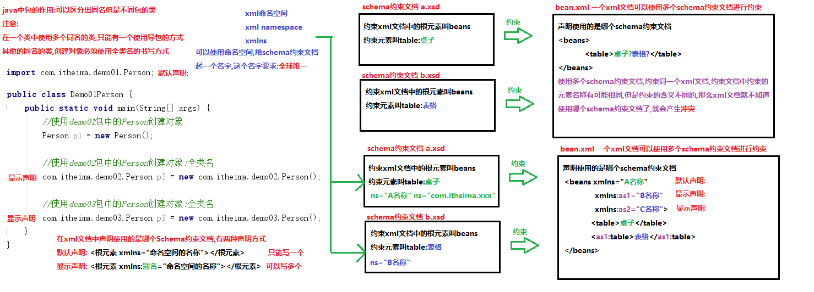

Schema约束文档:

1. 每个Schema约束文档,都必须有一个名字,这个名字就是命名空间(名称空间)

   要求:全球唯一,一般使用公司的域名+项目名称+...

   `targetNamespace="http://www.itcast.cn/bean/demo01/...."`

2. 在xml文档中想要使用Scheme约束文档,必须声明使用的是哪个Schema约束文档

   - 默认声明:只能有一个

     `xmlns="default namespace"`

     `xmlns="http://www.itcast.cn/bean"`

   - 显示声明:可以有多个

     `xmlns:别名1=”http://www.itcast.cn/bean”`

     `xmlns:别名2="http://www.itcast.cn/bean"`

3. 要使用Schema约束文档,必须确定约束文档的位置

   - 先确定官方文档的位置

     `xmlns:xsi="http://www.w3.org/2001/XMLSchema-instance"`

   - 通过官方文档确定我们自己的Schema约束文档的位置

   - `xsi:schemaLocation="{namespace} {location}"`                                                

     ​                                            命名空间	 具体位置

4. 使用

   使用默认声明, 直接写元素名称 \<bean>\</bean>

   使用显示声明:格式

   ```xml
   别名:元素名称
   <别名1:bean></别名1:bean>
   ```

**schema约束的语法**

```xml
<?xml version="1.0" encoding="UTF-8"?>
<!-- 
	传智播客Schema教学实例文档。
	模拟spring规范，如果开发人员需要在xml使用当前Schema约束，必须包括指定命名空间。
	格式如下：
	<beans xmlns="http://www.itcast.cn/bean"
	   xmlns:xsi="http://www.w3.org/2001/XMLSchema-instance"
	   xsi:schemaLocation="http://www.itcast.cn/bean bean-schema.xsd"
	>
-->

<!--
	schema约束文档的语法
	1. <element>声明元素(标签)
	2.每个元素都必须确定类型
		complexType:复杂类型
		simpleType:简单类型,一般不用,大部分都是复杂类型
	3.需要明确子标签的出场顺序
		<choice>选择 |
		<sequence>顺序 ,
		<all>任意
			minOccurs:最少出现次数
			maxOccurs:最大出现次数,unbounded:不限制(没有边)
	4.<attribute>用于给元素声明属性
		use:设置属性使用 optional:可选 required:必须
-->
<schema xmlns="http://www.w3.org/2001/XMLSchema" 
		targetNamespace="http://www.itcast.cn/bean"
		xmlns:xsd="http://www.w3.org/2001/XMLSchema"
		xmlns:tns="http://www.itcast.cn/bean" 
		elementFormDefault="qualified">
	<element name="beans">
		<complexType>
			<choice minOccurs="0" maxOccurs="unbounded">
				<element name="bean">
					<complexType>
						<sequence minOccurs="0" maxOccurs="unbounded">
							<element name="property">
								<complexType>
									<attribute name="name" use="optional"></attribute>
									<attribute name="value" use="required"></attribute>
								</complexType>
							</element>
						</sequence>
						<attribute name="id" use="required"></attribute>
						<attribute name="className" use="required"></attribute>
					</complexType>
				</element>
				<element name="import">
					<complexType>
						<attribute name="resource" use="required"></attribute>
					</complexType>
				</element>
			</choice>
		</complexType>
	</element>
</schema>
```

## XML解析

当将数据存储在XML后，我们就希望通过程序获取XML的内容。如果我们使用Java基础所学的IO知识是可以完成的，不过你学要非常繁琐的操作才可以完成，且开发中会遇到不同问题（只读、读写）**。人们为不同问题提供不同的解析方式，使用不同的解析器进行解析，方便开发人员操作XML**

### 解析方式和解析器

开发中比较常见的解析方式有三种，如下：

1. DOM：要求解析器把整个XML文档装载到内存，并解析成一个Document对象

   a）优点：元素与元素之间保留结构关系，故可以进行增删改查操作。

   b）缺点：XML文档过大，可能出现内存溢出

2. SAX：是一种速度更快，更有效的方法。她逐行扫描文档，一边扫描一边解析。并以事件驱动的方式进行具体解析，每执行一行，都触发对应的事件。（了解）

   a）优点：处理速度快，可以处理大文件

   b）缺点：只能读，逐行后将释放资源，解析操作繁琐。

3. PULL：Android内置的XML解析方式，类似SAX。（了解）

开发中比较常见的解析方式有三种，如下：

1. DOM：要求解析器把整个XML文档装载到内存，并解析成一个Document对象

   a）优点：元素与元素之间保留结构关系，故可以进行增删改查操作。

   b）缺点：XML文档过大，可能出现内存溢出

2. SAX：是一种速度更快，更有效的方法。她逐行扫描文档，一边扫描一边解析。并以事件驱动的方式进行具体解析，每执行一行，都触发对应的事件。（了解）

   a）优点：处理速度快，可以处理大文件

   b）缺点：只能读，逐行后将释放资源，解析操作繁琐。

3. PULL：Android内置的XML解析方式，类似SAX。(了解)

### 使用dom4j解析xml文件


使用dom4j解析xml文档

获取xml文档中的元素,属性和文本

解析步骤:

1. 导入dom4j的jar包
2. 创建dom4j核心类对象SAXReader
3. 使用SAXReader对象中的方法read,读取xml文件到内存中,并生成一个Document对象
4. 使用Document对象中的方法getRootElement,获取根元素beans
5. 使用根元素Element对象中的方法elements获取根元素下边所有的bean元素,多个bean元素存储到List集合中返回
6. 遍历List集合,获取每一个bean元素
7. 使用bean元素Element对象中的方法attributeValue,根据属性名,获取属性值(id,className)
8. 使用bean元素Element对象中的方法elements获取bean下边所有的property元素,多个propery元素存储到List集合中返回
9. 遍历List集合,获取每一个property元素
10. 使用property元素Element对象中的方法attributeValue,根据属性名,获取属性值(name,value)
11. 使用property元素Element对象中的方法getText,获取property元素上的文本

注意: 一定要记得在list后面加上Element的泛型, idea不会自动加

beans.xml

```xml
<?xml version="1.0" encoding="UTF-8"?>
<beans>
    <bean id="001" className="cn.itcast.demo.User">
        <property name="user" value="jack">文本1</property>
        <property name="user" value="rose">文本2</property>
        <bean id="005" className="cn.itcast.demo.Animal">
            <property name="user" value="小猫">文本9</property>
            <property name="user" value="小狗">文本10</property>
        </bean>
    </bean>
    <bean id="002" className="cn.itcast.demo.Admin">
        <property name="user" value="admin">文本3</property>
        <property name="user" value="write">文本4</property>
    </bean>
    <bean id="003" >
        <property name="user" value="张三">文本5</property>
        <property name="user" value="李四">文本6</property>
    </bean>
    <bean id="004" className="cn.itcast.demo.Student">
        <property name="user" value="王五">文本7</property>
        <property name="user" value="赵六">文本8</property>
    </bean>
</beans>
```


```java
public class Demo01UseDom4jParseXML {
    public static void main(String[] args) throws DocumentException {
        //2.创建dom4j核心类对象SAXReader
        SAXReader sax = new SAXReader();
        //3.使用SAXReader对象中的方法read,读取xml文件到内存中,并生成一个Document对象
        Document document = sax.read("day27\\beans.xml");
        //4.使用Document对象中的方法getRootElement,获取根元素beans
        Element rootElement = document.getRootElement();
        System.out.println(rootElement.getName());
        //5.使用根元素Element对象中的方法elements获取根元素下边所有的bean元素,多个bean元素存储到List集合中返回
        List<Element> beanElementList = rootElement.elements();
        //6.遍历List集合,获取每一个bean元素
        for (Element beanElement : beanElementList) {
            System.out.println("\t"+beanElement.getName());
            //7.使用bean元素Element对象中的方法attributeValue,根据属性名,获取属性值(id,className)
            String id = beanElement.attributeValue("id");
            String className = beanElement.attributeValue("className");
            System.out.println("\t\tbean元素的属性id:"+id);
            System.out.println("\t\tbean元素的属性className:"+className);
            //8.使用bean元素Element对象中的方法elements获取bean下边所有的property元素,多个propery元素存储到List集合中返回
            List<Element> propertyElementList = beanElement.elements();
            //9.遍历List集合,获取每一个property元素
            for (Element propertyElement : propertyElementList) {
                System.out.println("\t\t\t"+propertyElement.getName());
                //10.使用property元素Element对象中的方法attributeValue,根据属性名,获取属性值(name,value)
                String name = propertyElement.attributeValue("name");
                String value = propertyElement.attributeValue("value");
                System.out.println("\t\t\t\tpropery元素的属性name:"+name);
                System.out.println("\t\t\t\tpropery元素的属性value:"+value);
                //11.使用property元素Element对象中的方法getText,获取property元素上的文本
                String text = propertyElement.getText();
                System.out.println("\t\t\t\tpropery元素的文本:"+text);
            }
        }
    }
}
```

执行结果

```java
beans
	bean
		bean元素的属性id:001
		bean元素的属性className:cn.itcast.demo.User
			property
				propery元素的属性name:user
				propery元素的属性value:jack
				propery元素的文本:文本1
			property
				propery元素的属性name:user
				propery元素的属性value:rose
				propery元素的文本:文本2
	bean
		bean元素的属性id:002
		bean元素的属性className:cn.itcast.demo.Admin
			property
				propery元素的属性name:user
				propery元素的属性value:admin
				propery元素的文本:文本3
			property
				propery元素的属性name:user
				propery元素的属性value:write
				propery元素的文本:文本4
```


### 使用xpath和dom4j快速定位解析xml文件

xpath表达式常用查询形式

- **第一种查询形式**

  ```
  /AAA/DDD/BBB： 表示一层一层的，AAA下面 DDD下面的BBB
  ```

- 第二种查询形式

  ```
  //BBB： 表示和这个名称相同，表示只要名称是BBB 都得到
  ```

- 第三种查询形式

  ```
  /*: 所有元素
  ```

- 第四种查询形式

  ```
  BBB[1]：表示第一个BBB元素
  BBB[last()]：表示最后一个BBB元素
  ```

- 第五种查询形式

  ```
  //BBB[@id]： 表示只要BBB元素上面有id属性 都得到
  ```

- 第六种查询形式

  ```
  //BBB[@id='b1'] 表示元素名称是BBB,在BBB上面有id属性，并且id的属性值是b1
  ```

使用前提:

xpath是基于dom4j开发的,要使用xpath不仅仅要导入xpath的jar包,还需要导入dom4j的jar包

使用步骤:

1. 导入dom4j和xpath的jar包

2. 创建dom4j核心类对象SAXReader

3. 使用SAXReader对象中的方法read,读取xml文件到内存中,生成Document对象

4. 使用Document对象中的方法selectNodes|selectSigleNode解析xml文件

   `List<Element> selectNodes("xpath表达式")`获取符合表达式的元素集合

   `Element selectSingleNode("xpath表达式")`获取符合表达式的唯一元素

beans.xml

```xml
<?xml version="1.0" encoding="UTF-8"?>
<beans>
    <bean id="001" className="cn.itcast.demo.User">
        <property name="user" value="jack">文本1</property>
        <property name="user" value="rose">文本2</property>
        <bean id="005" className="cn.itcast.demo.Animal">
            <property name="user" value="小猫">文本9</property>
            <property name="user" value="小狗">文本10</property>
        </bean>
    </bean>
    <bean id="002" className="cn.itcast.demo.Admin">
        <property name="user" value="admin">文本3</property>
        <property name="user" value="write">文本4</property>
    </bean>
    <bean id="003" >
        <property name="user" value="张三">文本5</property>
        <property name="user" value="李四">文本6</property>
    </bean>
    <bean id="004" className="cn.itcast.demo.Student">
        <property name="user" value="王五">文本7</property>
        <property name="user" value="赵六">文本8</property>
    </bean>
</beans>
```

```java
public class Demo02UseXpathAndDom4jParseXML {
    public static void main(String[] args) throws DocumentException {
        //1.导入dom4j和xpath的jar包
        //2.创建dom4j核心类对象SAXReader
        SAXReader sax = new SAXReader();
        //3.使用SAXReader对象中的方法read,读取xml文件到内存中,生成Document对象
        Document document = sax.read("day27\\beans2.xml");
        //4.使用Document对象中的方法selectNodes|selectSigleNode解析xml文件
        // //*: 所有元素
        List<Element> list01 = document.selectNodes("//*");
        for (Element element : list01) {
            System.out.println(element.getName());
        }
        System.out.println("-----------------------------");
        //获取文档中所有的bean元素(儿子,孙子都会获取)
        List<Element> list02 = document.selectNodes("//bean");
        for (Element element : list02) {
            System.out.println(element.getName()+element.attributeValue("id"));
        }
        System.out.println("-----------------------------");
        //获取beans下边所有的bean(只要儿子,不要孙子)
        List<Element> list03= document.selectNodes("/beans/bean");
        for (Element element : list03) {
            System.out.println(element.getName()+element.attributeValue("id"));
        }
        System.out.println("-----------------------------");
        //获取beans下边bean里边的property
        List<Element> list04= document.selectNodes("/beans/bean/property");
        for (Element element : list04) {
            System.out.println(element.getName()+element.attributeValue("value"));
        }
        System.out.println("-----------------------------");
        //获取所有bean元素中的第一个bean元素
        Element oneBean = (Element)document.selectSingleNode("//bean[1]");
        System.out.println(oneBean.getName()+"\t"+oneBean.attributeValue("id"));
        //获取所有bean元素中的第二个bean元素
        Element twoBean = (Element)document.selectSingleNode("//bean[2]");
        System.out.println(twoBean.getName()+"\t"+twoBean.attributeValue("id"));
        //获取所有bean元素中的最后一个bean元素
        Element lastBean = (Element)document.selectSingleNode("//bean[last()]");
        System.out.println(lastBean.getName()+"\t"+lastBean.attributeValue("id"));
        System.out.println("-----------------------------");
        //获取所有含有className属性的bean元素
        List<Element> list05 = document.selectNodes("//bean[@className]");
        for (Element element : list05) {
            System.out.println(element.getName()+":"+element.attributeValue("id"));
        }
        System.out.println("-----------------------------");
        //获取所有含有className属性并且属性值是"cn.itcast.demo.Student"的bean元素
        Element stuEle = (Element) document.selectSingleNode("//bean[@className='cn.itcast.demo.Student']");
        System.out.println(stuEle.getName()+":"+stuEle.attributeValue("id")+"\t"+stuEle.attributeValue("className"));
    }
}
```

# 7. 设计模式

## 单例设计模式

单例设计模式（Singleton Pattern）: 内存中只会创建且仅创建一次的设计模式。

在程序中多次使用一个对象的时候，为了防止频繁的创建对象，使得内存飙升，单例模式可以仅让程序在内存中创建一个对象，让所有需要调用的地方都共享这一单例对象

### 饿汉式

形容人非常饿, 直接把创建好的对象给吃了

无论是否有人使用本类对象, 先把对象创建好了, 供用户使用

实现步骤:

1.  私有空参数构造方法,不让用户直接创建对象
2. 定义一个私有的静态的Person变量,并进行初始化赋值(创建一个对象给变量赋值)
3. 定义一个公共的静态方法,返回Person对象

```java
public class Person {
    //1.私有空参数构造方法,不让用户直接创建对象
    private Person() { }

    //2.定义一个私有的静态的Person变量,并进行初始化赋值(创建一个对象给变量赋值)
    private static Person p = new Person();

    //3.定义一个公共的静态方法,返回Person对象
    public static Person getInstance(){
        return p;
    }
}
```

```java
//测试单例设计模式,无论调用多少次静态方法,获取的对象都是同一个
for (int i = 0; i < 20; i++) {
    Person p = Person.getInstance();
    System.out.println(p);
}
```

**注意：**

饿汉式提前将变量设置好，所以不会出现并发安全和性能问题，所以在对内存要求不高的时候，就使用饿汉式，不容易出错

那就是即使这个单例不需要使用，它也会在类加载之后立即创建出来，占用一块内存，并增加类初始化时间。就好比一个电工在修理灯泡时，先把所有工具拿出来，不管是不是所有的工具都用得上。就像一个饥不择食的饿汉，所以称之为饿汉式。

### 懒汉式

人非常懒,抽一鞭子动一下

当我们使用对象的时候,才会创建对象;一直不使用对象是不会创建的

更节约内存

实现步骤:

1. 私有空参数构造方法,不让用户直接创建对象
2. 在类中定义一个私有的静态的Person变量,不进行初始化赋值
3. 在类中定义一个公共的静态成员方法,返回Person对象,保证无论调用多少次方法,只返回一个对象

```java
public class Person {
    //1.私有空参数构造方法,不让用户直接创建对象
    private Person(){}

    //2.在类中定义一个私有的静态的Person变量,不进行初始化赋值
    private static Person p;

    //3.在类中定义一个公共的静态成员方法,返回Person对象,保证无论调用多少次方法,只返回一个对象
    public static Person getInstance(){
        //增加一个判断,判断变量p是否为null(是null就是第一次调用方法,创建对象)
        if(p==null){
            p =  new Person();
        }
        //变量p不是null直接返回
        return p;
    }
} 
```

```java
package com.itheima.demo02Singleton;

public class Demo01Singleton {
    public static void main(String[] args) {
        //测试单例设计模式,无论调用多少次方法,获取的都是同一个对象
        for (int i = 0; i < 20; i++) {
            Person p = Person.getInstance();
            System.out.println(p);
        }
    }
}
```

### 懒汉式: 多线程安全问题

```java
package com.itheima.demo03Singleton;

public class Demo01Singleton {
    public static void main(String[] args) {
        //创建两个线程,每个线程获取20次对象
        new Thread(()->{
            for (int i = 0; i < 20; i++) {
                Person p = Person.getInstance();
                System.out.println(p);
            }
        }).start();

        new Thread(()->{
            for (int i = 0; i < 20; i++) {
                Person p = Person.getInstance();
                System.out.println(p);
            }
        }).start();
    }
}
```

```java
//注意: 这样写是错误的
package com.itheima.demo02;
//懒汉式
public class Person {
    //私有空参构造方法, 不让类创建对象
    private Person(){};
    //在类中定义一个私有的静态Person变量
    private static Person person;

    public static synchronized Person getPerson(){
        if(person==null){
            //person = new Person();
            return new Person();
        }
        else
        return person;
    }
}
```

```java
com.itheima.demo03Singleton.Person@1b9c704e
com.itheima.demo03Singleton.Person@ae526cf
com.itheima.demo03Singleton.Person@1b9c704e
com.itheima.demo03Singleton.Person@1b9c704e
com.itheima.demo03Singleton.Person@1b9c704e
com.itheima.demo03Singleton.Person@1b9c704e
com.itheima.demo03Singleton.Person@1b9c704e
...    
```

两个线程, 看谁先抢到执行权, 如果线程一先抢到执行权, 发现对象为null, 此时失去了继承权, 线程二抢到执行权, 也发现对象为null, 此时就新建了一个对象, 并返回, 然后线程一也新建了一个对象并返回, 接下来就person就不是空了, 就会直接返回这个对象了

那么就可以用同步锁来解决

```java
public class LazyPerson {
    private LazyPerson(){}
    private static  LazyPerson lazyPerson;
    public static  LazyPerson getInstance(){
        synchronized (LazyPerson.class) {
            if(lazyPerson==null){
                lazyPerson = new LazyPerson();
            }
            return lazyPerson;
        }
    }
}
//或者采取下面方法
public class LazyPerson {
    private LazyPerson(){}
    private static LazyPerson lazzPerson;
    static synchronized LazyPerson getInstance(){
      if(lazzPerson==null){
          lazyPerson = new LazyPerson();
      }
      return lazyPerson;
    }
}
```

这个就带来了另一个问题，每次去获取对象都要获取锁，并发性的性能非常差，接下来要做的就是性能优化

```java
public class LazyPerson {
    private LazyPerson(){}
    private static LazyPerson lazyPerson;
    static LazyPerson getInstance(){
        //先确定对象不为空再执行上述步骤，因为只有lazzPerson为空的线程才会存在都将lazyPerson==null的情况
        if(lazyPerson==null){
            synchronized (LazyPerson.class) {
                if(lazyPerson==null)
                    lazyPerson = new LazyPerson();
                }
        }
        return lazyPerson;
    }
}
```

还存在一个问题就是指令重拍，创建一个对象的时候，虚拟机会分为三步

- 为lazyPerson分配内存空间
- 初始化lazyPerson对象
- 将lazyPerson指向分配好的内存空间

使用volatile关键字可以**防止指令重排序**,所以最终版如下，称为双检锁方式

```java
public class LazzPerson {
    private static volatile LazzPerson lazzPerson;
    private LazzPerson(){}
    static LazzPerson getInstance(){
        if(lazzPerson==null){
            synchronized (LazzPerson.class) {
                if(lazzPerson==null)
                    lazzPerson = new LazzPerson();
                }
        }
        return lazzPerson;
    }
}
```

#### 静态内部类的方式来保证单例设计模式的线程安全

```java
public class Singleton {
    //通过静态内部类的方式来保证懒汉式单例的线程安全
    private static class SingletonHolder{
        public static Singleton instance = new Singleton();
    }

    private Singleton(){
    }

    public static Singleton getInstance(){
        return SingletonHolder.instance;
    }
}
```

Java 类的加载过程包括：加载、验证、准备、解析、初始化。初始化阶段即执行类的 clinit 方法（clinit = class + initialize），**包括为类的静态变量赋初始值和执行静态代码块中的内容。但不会立即加载内部类，内部类会在使用时才加载。**所以当此 Singleton 类加载时，SingletonHolder 并不会被立即加载，所以不会像饿汉式那样占用内存。

另外，Java 虚拟机规定，当访问一个类的静态字段时，如果该类尚未初始化，则立即初始化此类。当调用Singleton 的 getInstance 方法时，由于其使用了 SingletonHolder 的静态变量 instance，所以这时才会去初始化 SingletonHolder，在 SingletonHolder 中 new 出 Singleton 对象。这就实现了懒加载。

第二个问题的答案是 Java 虚拟机的设计是非常稳定的，早已经考虑到了多线程并发执行的情况。虚拟机在加载类的 clinit 方法时，会保证 clinit 在多线程中被正确的加锁、同步。即使有多个线程同时去初始化一个类，一次也只有一个线程可以执行 clinit 方法，其他线程都需要阻塞等待，从而保证了线程安全。

懒加载方式在平时非常常见，比如打开我们常用的美团、饿了么、支付宝 app，应用首页会立刻刷新出来，但其他标签页在我们点击到时才会刷新。这样就减少了流量消耗，并缩短了程序启动时间。再比如游戏中的某些模块，当我们点击到时才会去下载资源，而不是事先将所有资源都先下载下来，这也属于懒加载方式，避免了内存浪费。

但懒汉式的缺点就是将程序加载时间从启动时延后到了运行时，虽然启动时间缩短了，但我们浏览页面时就会看到数据的 loading 过程。

一般的建议是：对于构建不复杂，加载完成后会立即使用的单例对象，推荐使用饿汉式。对于构建过程耗时较长，并不是所有使用此类都会用到的单例对象，推荐使用懒汉式。

## 多例设计模式

多例设计模式，是一种常用的软件设计模式。通过多例模式可以保证系统中，应用该模式的类有**固定数量**的实例。多例类要自我创建并管理自己的实例，还要向外界提供获取本类实例的方法

### 获取多个通用的对象 

```java
package com.itheima.demo03;

import java.util.ArrayList;
import java.util.Random;

//多例设计模式
public class Person {
    //只让产生三个对象, 不多不少
    //私有空参数构造方法, 不让用户直接创建对象
    private  Person(){};
    //定义一个私有的, 静态的, 最终的变量.
    private static final int NUMOFOBJECT = 3;
    //定义一个私有的静态的, ArrayList集合对象, 用于存储多个对象
    //注意, 这个地方,在创建一个ArrayList的时候, 不要只记得前面的, 后面还要new一下,这个地方翻车了两次
    private static ArrayList<Person> personList = new ArrayList<>();
    //定义一个静态的私有的静态代码块, 创建三个对象, 储存在集合中
    static {
        for (int i = 0; i < NUMOFOBJECT; i++) {
            personList.add(new Person());
        }
    }
    //定义一个公共的静态方法, 给用户随机在集合中取出一个对象返回
    public static Person getPerson(){
        Random r = new Random();
        int i = r.nextInt(personList.size());
        return personList.get(i);
    }

}
```

```java
package com.itheima.demo03;

public class PersonTest {
    public static void main(String[] args) {
        System.out.println(Person.getPerson());
    }
}
```

### 获取多个特定的对象

```java
package com.itheima.demo06Multiton;

/*
    多例设计模式:获取多个特定的的对象
        Sex类只产生两个Sex对象,一个代表男性别,一个代表女的性别
    实现步骤:
        1.私有数构造方法,不让用户直接创建对象
        2.定义两个固定的对象(公共,静态的,最终的)一个代表男性别,一个代表女的性别
        3.重写toString方法,打印对象的属性值(不重写打印地址值)
 */
public class Sex {
    //定义一个成员变量
    private String s;

    //1.私有数构造方法,不让用户直接创建对象
    private Sex(String s){
        this.s = s;
    }

    //2.定义两个固定的对象(公共,静态的,最终的)一个代表男性别,一个代表女的性别
    public static final Sex MAN = new Sex("男");
    public static final Sex WOMAN = new Sex("女");

    //3.重写toString方法,打印对象的属性值(不重写打印地址值)
    @Override
    public String toString() {
        return s;
    }
}
```

```java
package com.itheima.demo06Multiton;

public class Demo01Multiton {
    public static void main(String[] args) {
        //创建Student对象
        Student s = new Student();
        //给成员变量赋值
        s.setName("张三");
        s.setAge(18);
        //s.setSex("abc");//性别的类型是Sex,不能随便给性别赋值,只能在Sex类中选择常量赋值
        //s.setSex(Sex.MAN);
        s.setSex(Sex.WOMAN);
        System.out.println(s);
    }
}
```

## 枚举

### 枚举的定义

枚举（enumeration）:它就是"多例设计模式:获取多个特定的的对象"的一种简化写法

需求:

Sex类只产生两个Sex对象,一个代表男性别,一个代表女的性别

使用多例实现:

`public static final Sex MAN = new Sex("男");`

`public static final Sex WOMAN = new Sex("女")`

使用枚举实现

MAN 就相当于 `public static final Sex MAN = new Sex();`

WOMAN 就相当于  `public static final Sex WOMAN = new Sex();`

注意:枚举中没有添加构造方法,有默认空参数构造方法

枚举中也可以定义成员变量,成员方法,构造方法(私有),这三个必须写在枚举常量的下边

MAN("男") 就相当于 `public static final Sex MAN = new Sex("男");`

WOMAN("女") 就相当于  `public static final Sex WOMAN = new Sex("女");`

### 枚举的使用

枚举表示性别：

```java
public enum Sex {
    MAIL, FEMAIL;
}
```

枚举表示方向：

```java
public enum Orientation {
    UP, RIGHT, DOWN, LEFT;
}
```

枚举表示季度

```java
public enum Season {
    SPRING, SUMMER, AUTUMN, WINTER;
}
```

## 工厂设计模式

工厂设计模式（Factory Pattern）

factory要解决的问题就是，希望能够创建一个对象，但是创建的过程**比较复杂**， 希望对外隐藏这些细节

### 简单工厂设计模式

简单工厂设计模式:

创建一个工厂类,在工厂类中定义一个生产对象的方法

我们要使用对象,我们不在自己创建对象了,使用工厂类的方法获取

好处:

可以给工厂类的方法传递不同的动物名称,生产不同的动物对象

**降低了耦合,增强了扩展性**

使用者不用知道这些类的构造函数，只用和工厂打交道就行

弊端:

胡乱传递一个动物名称,不存在,返回null,容易抛出空指针异常

解决:

可以使用工厂方法设计模式来来解决;创建多个工厂,每个工厂生产特定的动物

```java
package com.itheima.demo08SimpleFactory;

/*
    简单工厂设计模式:
        创建一个工厂类,在工厂类中定义一个生产对象的方法
        我们要使用对象,我们不在自己创建对象了,使用工厂类的方法获取
    好处:
        可以给工厂类的方法传递不同的动物名称,生产不同的动物对象
        解决类与类之间的耦合问题,增强了扩展性
    弊端:
        胡乱传递一个动物名称,不存在,返回null,容易抛出空指针异常
    解决:
        可以使用工厂方法设计模式来来解决;创建多个工厂,每个工厂生产特定的动物
 */
public class Demo01SimpleFactory {
    public static void main(String[] args) {
        //使用工厂类AnimalFactory中的方法,获取指定的动物对象
        //获取Cat对象
        Animal cat = AnimalFactory.getInstacne("cat");
        cat.eat();

        //获取Dog对象
        Animal dog = AnimalFactory.getInstacne("dog");
        dog.eat();

        //胡乱传递一个动物名称
        Animal car = AnimalFactory.getInstacne("car");
        car.eat();//null.eat();  NullPointerException
    }
}
```

```java
package com.itheima.demo08SimpleFactory;

/*
    定义一个生产动物的工厂
    只能生产动物,不能生产其他的对象
    定义一个静态方法,根据用户传递的动物名称,创建指定的动物对象返回
 */
public class AnimalFactory {
    public static Animal getInstacne(String name){
        if("cat".equals(name)){
            return new Cat();
        }else if("dog".equals(name)){
            return new Dog();
        }else{
            //不是动物返回null
            return null;
        }
    }
}
```

```java
package com.itheima.demo08SimpleFactory;

public abstract class Animal {
    public abstract void eat();
}
```

```java
package com.itheima.demo08SimpleFactory;

public class Cat extends Animal {
    @Override
    public void eat() {
        System.out.println("猫吃鱼!");
    }
}
```

```java
package com.itheima.demo08SimpleFactory;

public class Dog extends Animal {
    @Override
    public void eat() {
        System.out.println("狗吃肉!");
    }
}
```

### 工厂方法设计模式

简单工厂设计模式的弊端也是显而易见的：

1. 一个工厂的如果需要生产的产品过多，会导致工厂类过于庞大，变成超级类，违背了职责单一性原则
2. 当添加新的产品的时候，必须再工厂类中添加新的分支，而开闭原则则告诉我们，类应该对修改封闭，我们希望在添加新的功能的时候，只需要增加新的类，而不是修改既有的类

所以就引入了工厂方法设计模式，可以设计多个工厂,每个工厂生产不同的对象, 猫工厂只生产猫,狗工厂只生产狗，这个很容易看出了，耦合度降低了，并且在构造方法相当复杂的时候，工厂将构造过程封装起来

每个工厂都是独立的，没有继承一个统一的工厂接口

还可以继续将工厂接口抽象出来，就变成了抽象工厂模式

### 抽象工厂模式

```java
public interface Factory {
    //定义一个生产动物的抽象方法
    public abstract Animal getInstance();
}
```

```java
public class CatFactory implements Factory{
    @Override
    public Animal getInstance() {
        return new Cat();
    }
}
```

```java
public class DogFactory implements Factory{
    @Override
    public Animal getInstance() {
        return new Dog();
    }
}
```

```java
public abstract class Animal {
    public abstract void eat();
}
```

```java
public class Cat extends Animal {
    @Override
    public void eat() {
        System.out.println("猫吃鱼!");
    }
}
```

```java
public class Dog extends Animal {
    @Override
    public void eat() {
        System.out.println("狗吃肉!");
    }
}
```

在接口中只有一个方法的时候，我们还看不出抽象工厂的作用，实际上抽象工厂主要作用于代替一系列方法。

例如将程序中的 SQL Server 数据库整个替换为 Access 数据库，使用抽象方法模式的话，只需在 IFactory 接口中定义好增删改查四个方法，让 SQLFactory 和 AccessFactory 实现此接口，调用时直接使用 IFactory 中的抽象方法即可，调用者无需知道使用的什么数据库，我们就可以非常方便的整个替换程序的数据库，并且让客户端毫不知情。

抽象工厂模式很好的发挥了开闭原则、依赖倒置原则，但缺点是抽象工厂模式太重了，如果 IFactory 接口需要新增功能，则会影响到所有的具体工厂类。

使用抽象工厂模式，替换具体工厂时只需更改一行代码，但要新增抽象方法则需要修改所有的具体工厂类。所以抽象工厂模式适用于增加同类工厂这样的横向扩展需求，不适合新增功能这样的纵向扩展。


## 静态代理

静态代理（static proxy）：将被代理类作为代理类的成员，通过代理类调用被代理类的函数，并添加新的控制。包装类与被包装类实现同一接口，使得使用时的代码一致。

静态代理与装饰者模式非常相似

原则上的区别，代理为了控制对某个函数前后的操作，而装饰着模式是为了添加某一操作（其实目标没差太远）

实现上的区别，代理模式的类一般和被代理类的操作一致，因此构造函数一般不传入类对象，使用时的不同如下：

```
Logger logger = new Proxy(); // 代理模式 （为了让Proxy的行为像Logger） Logger logger = new DecorateLogger(new Logger());
```

静态代理在编译的时候就知道代理的具体对象，但是装饰者是在运行时动态的构造（通过传入构造函数形参）


## 动态代理

动态代理(dynamic proxy)

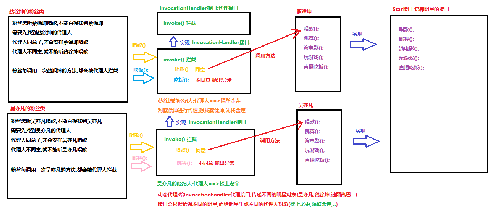

创建代理人对象,对明星进行代理,对明星的方法进行拦截

调用明星的changge,tiaowu,yandianying方法放行==>可以运行

调用明星的chifan,wanyouxi方法拦截==>不让方法运行

想要实现动态代理:使用Proxy类生成代理人对象

`java.lang.reflect.Proxy`

Proxy 提供用于创建动态代理类和实例的静态方法，它还是由这些方法创建的所有动态代理类的超类

Proxy类中的静态方法:可以生产代理人对象

`static Object newProxyInstance(ClassLoader loader, Class<?>[] interfaces, InvocationHandler h)`

返回一个指定接口的代理类实例，该接口可以将方法调用指派到指定的调用处理程序

参数

ClassLoader loader:传递类加载器

Class<?>[] interfaces:传递被代理人实现的所有接口(传递被代理人蔡徐坤,吴亦凡实现的接口)

InvocationHandler h:生成代理人的接口,传递InvocationHandler接口的实现类对象

返回值:

Object:返回的就是创建好的代理人对象


`java.lang.reflect.InvocationHandler`接口

InvocationHandler 是代理实例的调用处理程序 实现的接口

用来生产代理人对象的动态代理接口

可以把被代理人(吴亦凡对象,蔡徐坤对象)传递到InvocationHandlerImpl类中,让InvocationHandlerImpl生产明星的代理人对象

动态代理:传递哪个明星,就生产哪个明星的代理人对象

InvocationHandler接口中的方法:

`Object invoke(Object proxy, Method method, Object[] args)` 在代理实例上处理方法调用并返回结果

作用:

使用invoke方法对被代理人(吴亦凡对象,蔡徐坤对象)的方法进行拦截,让部分方法可以运行,部分方法不能运行

参数:

- Object proxy:内部产生的代理人对象,不用管
- Method method: invoke方法对传递明星的方法(changge,tiaowu...)进行拦截,方法内部使用反射技术获取到拦截到的方法
- Object[] args:拦截到方法的参数  changge() 空参数 yandianying(int money)

返回值:

Object:就是拦截到的方法的返回值

#### invoke方法中的proxy参数

1. 可以使用反射获取代理对象的信息，也就是`proxy.getClass().getName()`
2. 可以将代理对象返回以进行连续调用，这就是proxy存在的目的，因为this并不是代理对象。

```java
private interface Account {
    public Account deposit (double value);
    public double getBalance ();
}
```

```java
private class ExampleInvocationHandler implements InvocationHandler {
 
    private double balance;
 
    @Override
    public Object invoke (Object proxy, Method method, Object[] args) throws Throwable {
 
        // simplified method checks, would need to check the parameter count and types too
        if ("deposit".equals(method.getName())) {
            Double value = (Double) args[0];
            System.out.println("deposit: " + value);
            balance += value;
            return proxy; // here we use the proxy to return 'this'
        }
        if ("getBalance".equals(method.getName())) {
            return balance;
        }
        return null;
    }
}
```

```java
Account account = (Account) Proxy.newProxyInstance(getClass().getClassLoader(), new Class[] {Account.class, Serializable.class},
    new ExampleInvocationHandler());
 
// method chaining for the win!
account.deposit(5000).deposit(4000).deposit(-2500);
System.out.println("Balance: " + account.getBalance());
```

**我们看到如果返回proxy的话可以对该代理对象进行连续调用**

那为什么不返回this，而是返回proxy对象呢?

因为this对象的类型是ExampleInvocationHandler，而不是代理类$Proxy0

#### 大话动态代理

（来自福哥视频）

```
装饰者类：
需求：
我觉得还是彩信那个比较好理解
就是想给已有的类增加一些功能，但是不增加方法，
方法是接口已经定义的

所以就搞一个装饰者类，继承原来的接口，并且接受
这个产品的对象，使用这个产品的方法，在需要增加功能的短信方法里面增加一个彩信方法

其他的全部不变，仅仅是拓展了某个功能，所以叫装饰者

好处就是无切入式编程
但是有个缺点就是如果接口方法特别多的话，我需要
做的 工作就太多了，需要实现太多这个方法的接口

有的接口三四十个方法...

但是后面这些方法是有规律可言的，都是调用的原来的方法

byte[] byte = ProxyGenerator.generateProxyClass()

生成了.class文件
直接拖进idea就可以了

看完发现工具方法给你完成了上述过程

//这个方法就是拼接出了一个类出来，返回字节数组，又用自己的私有转换字节码方法，把他转换成类对象
//随便找个类获取类加载器，传入接口，干活的类
Proxy.newProxyInstance(Test02.class.getClassLoader(), new Class[]{Car.class}, new Ganhuo()};

Ganhuo类实现InvocationHandler接口 实现一个方法

priacte static class Ganhuo implements InvocationHandler(原本的对象 ori){
空构造(){
this.ori=ori
}

//上述空壳对象的任何方法执行的时候都会来到这个方法来
//这个proxy是干啥的？(已解答)

@Override
//method是外面的壳（装饰者）正在调用的方法
invoke(Object proxy,Method method,Object[] args){
sout("我是干活的")
}
}
//所以我可以
if(你调用的方法是method){我修改成我满意的}else(调用原来的)

怎么才能调用原来的方法？
这个干活的对象里面传进来了一个ori
method.invoke(ori,args)

这样写有啥好处，那我装饰的时候只需要提供一个方法就可以了，其他的重复工作不需要做

所以现在
Car car = new QQ()；
Car o = (Car)Proxy.newProxyInstance(
Test03.class.getClassLoader(),
new Class[]{Car.class},
new Ganhuo()
}

//其中数组部分，可以实现多个数组，不能直接写一个接口
可以改成ori.getClass().getInterfaces();
原来的对象实现的所有接口


private static class Ganhuo implements InvocationHandler{
@Override
public Object invoke(Object proxy,Method method,Object[] args){
	return null;
}

总结一下动态代理
假如有一个实现了手机接口的华为手机类Huawei，实现了接口的三个功能，发普通短信，打电话，看视频；我现在手机想升级，又不想动这 个华为手机类怎么办？可以用装饰者，即HuaWei装饰者(Huawei huawei)实现Phone类{发短信(huawei.发短信); 发彩信}  打电话{huawei.打电话} 看视频{hauwei.看视频}，这样我们就实现了不动Huawei类就拓展其功能的方法，这就是装饰者模式，静态代理也跟这个差不多，但现在有个问题就是这个phone接口不是只有三个方法，而是100个方法！那我就要在装饰者里面再重写99个其他方法，非常非常麻烦，而且还是原理一样的重复操作，这就有了动态代理。它会自动帮你完成上述过程， Car huawei彩信装饰者 = Proxy.newProxyInstance(类加载器，华为实现的Phone接口，new InvocationHandlerImpl));    InvocationHandler接口需要实现类InvocationHandlerImpl(Huawei huawei)实现一个invoke(method,args)方法，我们重写invoke为: if(method为 发短信){那就发彩信}else {调用huawei.原来的方法}. 这样newProxyInstance方法内部就会将Phone接口的100个methods，都作为参数method一一传入InvocationHandlerImpl并执行我们重写的invoke方法，我们让invoke进行辨别哪个method是发短信，是就加上发彩信功能，其他的method调用huawei原method，最后返回huawei彩信装饰者对象！
```


# 综合案例-学生管理系统(C/S版本)

## 注意事项

客户端

复制的时候, 直接把文件夹src下面的文件都直接复制到新建的模块下面的src中, 即可

服务器

可以把学生类复制过来, 必须保证学生类所在的包是一样的, 因为涉及到序列化与反序列化, 不一样的话序列化和反序列化会抛出异常

1. readObject() 

   java.lang.ClassNotFoundException

   由于客户端和服务器的包名不一样, 导致出现此异常

2. readObject()

   java.io.EOFException (End Of File)

   - 错误1:

     ```
     OutputStream out = socket.getOutputStream();
     out.write(("[4]").getBytes());
     InputStream in = socket.getInputStream();
     ```

     把第三写在了第二句之前, 导致读取到的为空

   - 错误2:

     TMD写了两遍readObject()(本来想加一个readObject的测试, 结果导致真正的readObject为空)

## 客户端

### pojo包Student类

```java
package com.itheima.pojo;

import java.io.Serializable;

public class Student implements Serializable {
    private static final long serialVersionUID = 19970601L;
    private int id;
    private String name;
    private String sex;
    private int age;

    public Student() {
    }

    public Student(int id, String name, String sex, int age) {
        this.id = id;
        this.name = name;
        this.sex = sex;
        this.age = age;
    }


    public int getId() {
        return id;
    }

    public void setId(int id) {
        this.id = id;
    }

    public String getName() {
        return name;
    }

    public void setName(String name) {
        this.name = name;
    }

    public String getSex() {
        return sex;
    }

    public void setSex(String sex) {
        this.sex = sex;
    }

    public int getAge() {
        return age;
    }

    public void setAge(int age) {
        this.age = age;
    }

    @Override
    public String toString() {
        return "Student{" +
                "id=" + id +
                ", name='" + name + '\'' +
                ", sex='" + sex + '\'' +
                ", age=" + age +
                '}';
    }
}
```

### utils包SutdentUtils类

```java
package com.itheima.utils;

import com.itheima.pojo.Student;
import com.sun.media.jfxmediaimpl.HostUtils;

import java.io.IOException;
import java.net.Socket;
import java.util.ArrayList;

public class StudentUtils {
     //构造函数私有化
    private StudentUtils(){};
    //定义操作学生类
    //打印学生对象
    public static void printTheSthdent(Student student){
        System.out.println("----------------------------------");
        System.out.println("ID\t姓名\t\t性别\t年龄\t");
        System.out.println(student.getId()+"\t"+student.getName()+"\t\t"+student.getSex()+"\t\t"+student.getAge()+"\t");
        System.out.println("----------------------------------");
    }
    //打印一个ArrayList集合中所有学生对象的方法
    public static void printAllStudents(ArrayList<Student> lists){
        System.out.println("----------------------------------");
        if(lists==null)
            System.out.println("没有学生对象");
        else{
            for (Student student : lists)
                System.out.println(student.getId() + "\t" + student.getName() + "\t\t" + student.getSex() + "\t\t" + student.getAge() + "\t");
        }
        System.out.println("----------------------------------");
    }
    //获取服务器ip地址和端口号
    public static Socket getSocket(){
        Socket socket = null;
        try {
            socket = new Socket("192.168.124.9",8888);
        } catch (IOException e) {
            System.out.println("连接失败");
        }
        return socket;
    }
}

```

### main包studentClient类

```java
package com.itheima.main;

import com.itheima.pojo.Student;
import com.itheima.utils.StudentUtils;

import java.io.*;
import java.net.Socket;
import java.util.ArrayList;
import java.util.Scanner;

public class studentClient {
    //客户端的主程序
    //静态的成员Scanner对象,供所有的方法使用
    static Scanner scanner = new Scanner(System.in);
    public static void main(String[] args) {
        //让系统功能重复执行
        while(true){
        //打印主菜单
        System.out.println("1.添加学生 2.根据id查询学生 3.修改学生 4.查看所有学生 5.删除学生 6.退出");
            System.out.println("-------------------欢迎使用学生管理系统---------------------");
            int num = scanner.nextInt();
            switch (num){
                case 1:
                    addStudent();
                    break;
                case 2:
                    checkStudent();
                    break;
                case 3:
                    updateStudent();
                    break;
                case 4:
                    checkAllStudent();
                    break;
                case 5:
                    deleteStudent();
                    break;
                case 6:
                    System.out.println("欢迎下次继续使用本系统!");
                    System.exit(0);
                default:
                    System.out.println("您输入的选项不存在, 请重新输入");
                    break;
            }
        }
    }

    //添加学生信息
    private static void addStudent() {
        System.out.println("--------------您选择的是添加学生管理系统,请输入学生信息---------------");
        System.out.println("请输入要添加学生的姓名");
        String name = scanner.next();
        System.out.println("请输入要添加学生的性别");
        String sex = scanner.next();
        System.out.println("请输入要添加学生的年龄");
        int age = scanner.nextInt();
        //创建客户端服务器
        Socket socket = StudentUtils.getSocket();
        //客户端往服务器发送数据

        if(socket==null){
            System.out.println("服务器暂时无法连接,请稍后尝试");
            return;
        }

        try ( OutputStream out =socket.getOutputStream();
              InputStream in = socket.getInputStream();){
            //向客户端发送数据
            out.write(("[1]"+name+","+sex+","+age).getBytes());
            int read = in.read();
            if(read==1){
                System.out.println("恭喜你,添加学生成功");
            }else{
                System.out.println("添加学生失败, 请联系管理员");
            }
            socket.close();
        } catch (IOException e) {
            e.printStackTrace();
        }
    }

    //根据id查询学生信息
    private static void checkStudent() {
        System.out.println("--------------您选择的是根据id查询学生信息---------------");
        System.out.println("请输入这个学生的id");
        int id = scanner.nextInt();
        Student student = checkTheStudent(id);
        if(student==null)
            return;
        StudentUtils.printTheSthdent(student);
    }

    //修改学生数据
    private static void updateStudent() {
        System.out.println("--------------您选择的是根据id修改学生信息---------------");
        System.out.println("请输入您要修改的用户ID");
        int id= scanner.nextInt();
        Student student = checkTheStudent(id);
        if(student==null)
            return;

        System.out.println("请输入修改后学生的姓名, 保持不变请输入0");
        String name = scanner.next();
        System.out.println("请输入修改后学生的性别, 保持不变请输入0");
        String sex = scanner.next();
        System.out.println("请输入修改后学生的年龄, 保持不变请输入0");
        int age = scanner.nextInt();
        if(!"0".equals(name))
            student.setName(name);
        if(!"0".equals(sex))
            student.setSex(sex);
        if(0!=age)
            student.setAge(age);

        //给客户端发送信息
        Socket socket = StudentUtils.getSocket();
        if(socket==null){
            System.out.println("服务器暂时无连接, 请稍后再试");
            return;
        }
        try(OutputStream out = socket.getOutputStream();
            InputStream in = socket.getInputStream();
        ){
            out.write(("[3]"+student.getId()+","+student.getName()+","+student.getSex()+","+student.getAge()).getBytes());
            int key= in.read();
            if(key==0)
                System.out.println("修改失败");
            if(key==1)
                System.out.println("恭喜你, 修改用户成功");
        }catch (IOException e){
            e.printStackTrace();
        }
    }

    //查询所有学生的信息
    private static void checkAllStudent() {
        //给客户端发送信息
        Socket socket = StudentUtils.getSocket();
        if(socket==null){
            System.out.println("服务器暂时无连接, 请稍后再试");
            return;
        }

        try{
            OutputStream out = socket.getOutputStream();
            out.write(("[4]").getBytes());

            InputStream in = socket.getInputStream();
            ObjectInputStream objIn = new ObjectInputStream(in);
            //注意: 该语句不能放入try括号中, 否则读取对象会出现错误, 需要手动关闭
            //System.out.println(objIn.readObject());
            ArrayList<Student> studentList = (ArrayList<Student>) objIn.readObject();
            //注意这个地方加上 size
            if(studentList==null||studentList.size()==0){
                System.out.println("服务器里面没有学生");
            }else{
            StudentUtils.printAllStudents(studentList);
            objIn.close();}
            socket.close();
        }catch (IOException e){
            e.printStackTrace();
        } catch (ClassNotFoundException e) {
            e.printStackTrace();
        }
    }

    private static void deleteStudent() {
        System.out.println("--------------您选择的是根据id删除学生信息---------------");
        System.out.println("请输入您要删除的用户ID");
        int id = scanner.nextInt();
        Student student= checkTheStudent(id);
        System.out.println("您要删除的用户的信心id如下");
        StudentUtils.printTheSthdent(student);

        System.out.println("您确定要删除这个学生吗?Y删除/N不删除");
        String flag = scanner.next();
        if ("N".equalsIgnoreCase(flag)){
            System.out.println("删除操作已取消");
            return;
        }
        Socket socket = StudentUtils.getSocket();
        //向服务器发送数据
        if(socket==null){
            System.out.println("服务器暂时无法连接,请稍后尝试");
            return;
        }

        int read = 0;
        try {
            OutputStream out = socket.getOutputStream();
            InputStream in = socket.getInputStream();

            out.write(("[5]"+id).getBytes());
            read = in.read();
        } catch (IOException e) {
            e.printStackTrace();
        }
        if(read==1){
            System.out.println("您已经删除成功");
        }else{
            System.out.println("删除失败");
        }


    }


    private static Student checkTheStudent(int id) {
        Socket socket = StudentUtils.getSocket();
        Student student = null;
        //记得这里返回null
        if(socket==null){
            System.out.println("服务器暂时无法连接,请稍后尝试...");
            return null;
        }
        try {

            OutputStream out = socket.getOutputStream();
            InputStream in = socket.getInputStream();
            out.write(("[2]"+id).getBytes());
            ObjectInputStream objIn = new ObjectInputStream(in);
            student = (Student)objIn.readObject();
            if(student==null)
                System.out.println("不存在这个学生的id");
            objIn.close();
            socket.close();
        } catch (IOException e) {
            e.printStackTrace();
        } catch (ClassNotFoundException e) {
            e.printStackTrace();
        }
        return student;
    }
}
```

## 服务器

### main包ServerThread类

```java
package com.itheima.main;

import com.itheima.pojo.Student;
import com.itheima.utils.StudentServerUtils;

import java.io.*;
import java.net.Socket;
import java.util.ArrayList;

public class ServerThread extends Thread{
    private Socket socket;
    public ServerThread(Socket socket) {
        this.socket = socket;
    }

    @Override
    public void run() {
        try {
            InputStream in = socket.getInputStream();
            byte[] bytes= new byte[1024];
            int len = in.read(bytes);
            String mes = new String(bytes,0,len);
            int key= Integer.parseInt(mes.substring(1,2));
            switch (key){
                case 1:
                    //方法不要在这个里面写
                    addStudent(mes);
                    break;
                case 2:
                    checkStudent(mes);
                    break;
                case 3:
                    updateStudent(mes);
                    break;
                case 4:
                    checkAllStudent();
                    break;
                case 5:
                    delateStudent(mes);
                    break;
                default:
                    System.out.println("服务器没有此功能!");
                    break;
            }
        } catch (IOException e) {
            e.printStackTrace();
        }
    }

    private void addStudent(String mes) {
        System.out.println("-------------客户端调用了添加学生的方法-----------------");
        String[] fileds = mes.split(",");
        Student student = new Student(0,fileds[0].substring(3),fileds[1],Integer.valueOf(fileds[2]));
        //把学生写入txt
        System.out.println("接收到的学生为"+student);
        boolean b = StudentServerUtils.addStudent(student);
        //给客户端回复
        try {
            OutputStream out = socket.getOutputStream();
            if(b){
                out.write(1);
            }else{
                out.write(0);
            }
        } catch (IOException e) {
            e.printStackTrace();
        }

    }

    private void checkStudent(String mes) {
        System.out.println("-------------客户端调用了查找学生的方法-----------------");
        int filed = Integer.parseInt(mes.substring(3));
        Student student = StudentServerUtils.FindByID(filed);

        try (OutputStream out = socket.getOutputStream();){
            ObjectOutputStream objOut = new ObjectOutputStream(out);
            objOut.writeObject(student);
            objOut.close();
            socket.close();
        } catch (IOException e) {
            e.printStackTrace();
        }


    }

    private void updateStudent(String mes) {
        System.out.println("-------------客户端调用了修改学生的方法-----------------");
        String[] fileds = mes.split(",");
        Student student = new Student(Integer.parseInt(fileds[0].substring(3)),fileds[1],fileds[2],Integer.valueOf(fileds[3]));
        boolean b = StudentServerUtils.updateStudent(student);

        try {
            OutputStream out = socket.getOutputStream();
            if(b){
                out.write(1);
            }else{
                out.write(0);
            }
        } catch (IOException e) {
            e.printStackTrace();
        }

    }

    private void checkAllStudent() {
        System.out.println("-------------客户端调用了查询所有学生的方法-----------------");
        ArrayList<Student> students = StudentServerUtils.readAll();
        try {
            OutputStream out = socket.getOutputStream();
            ObjectOutputStream objOut = new ObjectOutputStream(out);
            objOut.writeObject(students);
            objOut.close();
            out.close();
            socket.close();
        } catch (IOException e) {
            e.printStackTrace();
        }
    }

    private void delateStudent(String mes) {
        System.out.println("-------------客户端调用了删除学生的方法-----------------");

        int filed = Integer.parseInt(mes.substring(3));
        Student student = StudentServerUtils.FindByID(filed);
        boolean b = StudentServerUtils.deleteStudent(student);

        try {
            OutputStream out = socket.getOutputStream();
            if(b){
                out.write(1);
            }else{
                out.write(0);
            }
        } catch (IOException e) {
            e.printStackTrace();
        }
    }
}

```

### main包StudentServer类

```java
package com.itheima.main;

import java.io.IOException;
import java.net.ServerSocket;
import java.net.Socket;

public class StudentServer {
    public static void main(String[] args) {
        //新建一个服务器
        System.out.println("服务器已经启动了,客户端可以请求服务器...");
        try {
            ServerSocket server = new ServerSocket(8888);
            while (true){
                Socket socket = server.accept();
                new ServerThread(socket).start();
            }
        } catch (IOException e) {
            e.printStackTrace();
        }
    }
}
```

### utils包StudentServerUtils类

```java
package com.itheima.utils;

import com.itheima.pojo.Student;

import java.io.*;
import java.util.ArrayList;

public class StudentServerUtils {
    private StudentServerUtils(){};
    static File file = new File("student.java");
    //添加一个学生集合
    public static void writeAll(ArrayList<Student> students) {
        try(BufferedWriter writer = new BufferedWriter(new FileWriter(file));) {
            for (Student student : students) {
                writer.write(student.getId()+","+student.getName()+","+student.getSex()+","+student.getAge()+"\r\n");
            }
        } catch (IOException e) {
            e.printStackTrace();
        }
    }


    //从文件中读取所有学生的信息, 返回学生集合
    public static ArrayList<Student> readAll(){
        //注意, 这个地方需要判断一下文件是否存在
        if(!file.exists()) {
            try {
                file.createNewFile();
            } catch (IOException e) {
                e.printStackTrace();
            }
        }

        try (BufferedReader in = new BufferedReader(new FileReader(file));){
            ArrayList<Student> students = new ArrayList<>();
            String line;
            while ((line = in.readLine())!=null){
                String[] fileds = line.split(",");
                int id = Integer.parseInt(fileds[0]);
                String name = fileds[1];
                String sex = fileds[2];
                int age = Integer.parseInt(fileds[3]);
                students.add(new Student(id,name,sex,age));
            }
            return students;
        } catch (IOException e) {
            //注意这里
            return null;
        }
    }

    //添加一个学生
    public static boolean addStudent(Student student){
        ArrayList<Student> students = readAll();
        if(students==null){
            return false;
        }
        //获取最后一个学生的id
        if(students.size()!=0)
            student.setId(students.get(students.size() - 1).getId()+1);
        else
            student.setId(1);
        students.add(student);
        //会覆盖之前的文件
        writeAll(students);
        return true;
    }


    //根据学生id, 返回查询到的学生
    public static Student FindByID(int id){
        ArrayList<Student> students = readAll();
        //记得加上这个
        if(students==null)
            return null;
        for (Student student : students) {
            if(student.getId()==id)
                return student;
        }
        return null;
    }

    //根据id修改学生信息
    public static boolean updateStudent(Student student){
        ArrayList<Student> students = readAll();
        if(students==null)
            return false;
        for (int i = 0; i < students.size(); i++) {
            Student Thestudent = students.get(i);
            if(student.getId()==Thestudent.getId()){
                students.set(i,student);
                writeAll(students);
                return true;
            }
        }
        return false;
    }

    //根据id删除该学生
    public static boolean deleteStudent(Student student){
        ArrayList<Student> students = readAll();
        if(students==null)
            return false;
        for (int i = 0; i < students.size(); i++) {
            Student Thestudent = students.get(i);
            if (student.getId() == Thestudent.getId()) {
                students.remove(i);
                writeAll(students);
                return true;
            }
        }
        return false;
    }
}
```


