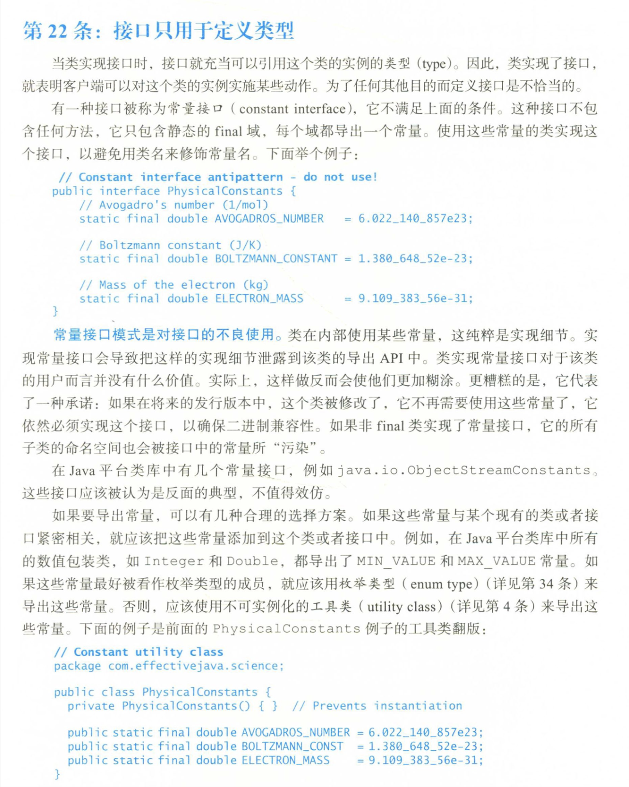

# Java常量应该定义在类中还是接口中

## 背景

在看《Effective Java》的时候，看到第四章第22条，如下所示：



Effective Java的作者Joshua Bloch（Java库设计师）并不倡导专门在接口中定义常量，更近一步说是反对常量接口模式（constant interface pattert），即继承此接口来获取到这些常量，这样做，即使此常量后续不用了，为了保证序列化正常，客户端都不得不继续实现此接口，而且此类的子类也会被接口中的常量污染。

## 探索

阿里Java开发手册嵩山版关于常量部分有如下说明：

> 【推荐】不要使用一个常量类维护所有常量，要按常量功能进行归类，分开维护。 
>
> 说明:大而全的常量类，杂乱无章，使用查找功能才能定位到修改的常量，不利于理解，也不利于维护。 
>
> 正例:缓存相关常量放在类 CacheConsts 下;系统配置相关常量放在类 SystemConfigConsts 下。
>
> 【推荐】如果变量值仅在一个固定范围内变化用 enum 类型来定义。

基本也是优先推荐使用枚举，其次是枚举类，也基本说明了使用类来接受常量集。

同时，在网上搜索了一些资料，例如，[Define Constants in Interface or Class](https://readtorakesh.com/define-constants-in-interface-or-class/)等，基本都是不赞同在接口中定义常量的，理由如下：

1. 接口是用来定义行为和类型的，而常量的具体值属于具体的实现，应该在类中
2. Java并没有提供机制来阻止常量接口被实现，一旦被客户端实现，就会出现常量接口这种反设计模式，而类可以通过fianl加私有构造来保证安全
3. 使用常量接口模式之后，可以同时使用实现类和接口来调用一个常量，容易造成困惑
4. 使用常量接口模式之后，实现类也可以使用同名变量覆盖掉接口中的常量（使用接口前缀调用不影响）
5. 使用常量接口模式之后，实现类的子类也会自动继承这些常量，造成污染
6. 使用常量接口模式之后，由于序列化，对后续代码的的拓展有限制

接下来我搜索了一下GitHub中[Apache组织下的仓库中的常量类，](https://github.com/search?q=org%3Aapache+filename%3A*constant.java&type=Code&ref=advsearch&l=&l=)也未发现使用接口接收常量集的情况，例如：

```java
package org.apache.rocketmq.connect.http.sink;

public class SftpConstant {
    public static final String LOGGER_NAME = "SftpConnector";
    //...
}
```

```java
package org.apache.dubbo.registry.xds.istio;

public class IstioConstant {
    public final static String CA_ADDR_KEY = "CA_ADDR";
    
   //...
}
```

```java
package org.apache.flink.formats.protobuf;

public class PbConstant {
    public static final String PB_METHOD_GET_DESCRIPTOR = "getDescriptor";
        //...
}
```

```java
package org.apache.iotdb.commons.sync.utils;

public class SyncConstant {
  public static final String SYNC_SYS_DIR = "sys";
  //...   
}
```

## 总结

不将常量集定义在接口中的大部分理由，都是源自曾经流行过的常量接口设计模式，如果我们在自己的代码中不使用这种设计模式，这种方法也没有什么隐患。

但是当我们写的代码会做为三方暴露出去的时候，那么我们也无法阻止客户端采用接口设计这种反模式，而定义在类中，能避免这种现象，而且定义在类中，更符合类和接口各自的用途。

当然，当变量值在一个范围内更应该优先考虑枚举类型，其他情况，为了统一和约定，我们在写代码的时候，最好将常量集定义在类中。

## References

1. Joshua Bloch，《Effective Java》中文，原书第三版 ，p92
2. 维基百科：[Constant interface](https://en.wikipedia.org/wiki/Constant_interface)
3. 阿里，《Java开发手册》，嵩山版，p4
4. [Define Constants in Interface or Class](https://readtorakesh.com/define-constants-in-interface-or-class/)
5. StackOverflow：[Should a collection of constants be placed in a class or interface?](https://stackoverflow.com/questions/1372991/should-a-collection-of-constants-be-placed-in-a-class-or-interface)
6. Github搜索：[在Apache组织中搜索文件名包含constant.java的代码](https://github.com/search?q=org%3Aapache+filename%3A*constant.java&type=Code&ref=advsearch&l=&l=)