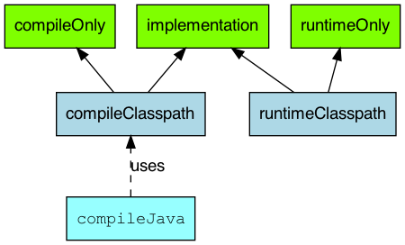

# Gradle依赖管理

## 仓库配置

Gradle支持引入公共仓库和自定义仓库。

Gradle相关接口提供了快捷方式来声明Maven Central，即通过调用`mavenCentral()`方法：

```
repositories {
    mavenCentral()
}
```

关于多个仓库的读取顺序问题


## 本地依赖缓存

Gradle会自动下载你所需要的依赖，并将它们存储在本地缓存中，后续的构建将重用这些依赖。

如果远程仓库变动了，Gradle通过比较本地和远程的校验来检测依赖是否发生变化，不仅如此，Gradle还会通过其他措施来校验依赖是否变化，可靠性更强。

## Configuration

我们知道，依赖是和使用场景相关的，例如，junit只在测试的时候才会使用，mysql-connector只在运行时需要，编译时不需要，servlet-api只在编译期用到，运行时会由容器提供。

所以，在Maven中，我们可以定义依赖的scope，例如compile、provided、runtime、test等，例如：

```xml
<dependency>
    <groupId>mysql</groupId>
    <artifactId>mysql-connector-java</artifactId>
    <scope>runtime</scope>
    <version>8.0.17</version>
</dependency>
```

在Gradle中，通过[Configuration](https://docs.gradle.org/current/dsl/org.gradle.api.artifacts.Configuration.html)来描述一个scope中的所有依赖，Configuration也是一个领域对象。

Java插件就引入了很多个Configuration：

- implementation
- compileOnly
- compileClasspath
- annotationProcessor
- runtimeOnly
- runtimeClasspath
- ...(test相关)

例如，下面是Java插件一些主要的Configuration：



Java插件引入的Configuration比起Maven的scope，粒度要更细。

注意：

>In Gradle 7, both the `compile` and `runtime` configurations are removed. Therefore, you have to migrate to the `implementation` and `api` configurations above. If you are still using the `java` plugin for a Java library, you will need to apply the `java-library` plugin instead.

在Gradle7+版本中，`compile` Configuration被移除了，应该使用`implementation`或`api`来代替。其中， `api` Configuration由Java Library插件引入（Java插件的升级版，JVM应用推荐使用），Java Library插件引入的主要Configuration如下图：


- 绿色指的是依赖可以被声明的类型
- 粉色是指一个组件编译所需或运行时所需的库
- 蓝色是组件自己内部使用的

### api vs implementation

这里是Gradle中比较难理解的一个点，很多博客写的不太清晰，这里解释一下：

- 如果一个依赖被声明为api，那么该模块的消费者的compile和runtime中都会出现该依赖
- 如果一个依赖被声明为implementation，那么该模块的消费者的compile中不会出现该依赖，只有runtime中都会出现该依赖

下面，我们用例子来说明：

有两个gradle子模块，sub-a和sub-b，其中sub-a依赖了sub-b。

sub-a的build.gradle：

```
...

dependencies {
    implementation project(':sub-b')
}
```

sub-b的build.gradle：

```
...

dependencies {
    implementation 'cn.hutool:hutool-all:5.8.10'
}
```

sub-b模块引入了该依赖，所以如下代码正常编写：

```
System.out.println(cn.hutool.core.date.DateUtil.date());
```

但是，同样的语句，在sub-a模块中，IDE就会报错，也就是说编译期找不到依赖。

查看sub-a模块的依赖：

```
$ gradle :sub-a:dependencies
...
compileClasspath - Compile classpath for source set 'main'.
\--- project :sub-b

runtimeClasspath - Runtime classpath of source set 'main'.
\--- project :sub-b
     \--- cn.hutool:hutool-all:5.8.10  
...
```

那么，我们将sub-b的build.gradle修改为如下：

```
...

dependencies {
    // implementation 'cn.hutool:hutool-all:5.8.10'
    api 'cn.hutool:hutool-all:5.8.10'
}
```

我们发现，sub-a模块中的如下语句不再编译报错了：

```
System.out.println(cn.hutool.core.date.DateUtil.date());
```

再次查看sub-a的依赖：

```
$ gradle :sub-a:dependencies
...
compileClasspath - Compile classpath for source set 'main'.
\--- project :sub-b
     \--- cn.hutool:hutool-all:5.8.10

runtimeClasspath - Runtime classpath of source set 'main'.
\--- project :sub-b
     \--- cn.hutool:hutool-all:5.8.10
...
```

我们平时引用依赖的时候，发现api和implementation区别不大的原因是，大部分依赖在Maven中声明的Scope都是`compile`。

### 最佳实践

那么平时，我们应使用api还是implementation，如果该依赖是该模块的内部依赖，则使用implementation，如果该依赖是该模块导出的一部分，则应该使用api。

更多的可以参考该文章，[How to use Gradle api vs. implementation dependencies with the Java Library plugin](https://tomgregory.com/how-to-use-gradle-api-vs-implementation-dependencies-with-the-java-library-plugin/)。

### annotationProcessor

Annotation processing是Java在1.5新增的编译选项，如下：

```
javac --processor-path path
```

此选项会去寻找一个继承自`AbstractProcessor`的类，生成指定的代码。

如下所示：

```
//lombok
compileOnly 'org.projectlombok:lombok:1.18.10'
annotationProcessor 'org.projectlombok:lombok:1.18.10'
```

`annotationProcessor`的作用就是定义了传递给`javac --processor-path`的依赖。

## 依赖报告

- 对于没有模块的：

  ```
  gradle dependencies
  ```

- 有模块的（app为你的模块名）

  ```
  gradle app:dependencies
  ```

  参数：

  - `--configuration` 选择查看哪个configuration

  例如：查看upm模块，compile的

  ```
  $ gradle :upms:dependencies --configuration compile
  > Task :upms:dependencies
  
  ------------------------------------------------------------
  Project :upms
  ------------------------------------------------------------
  
  compile - Dependencies for source set 'main' (deprecated, use 'implementation' instead).
  +--- org.mybatis.spring.boot:mybatis-spring-boot-starter:2.1.0
  |    +--- org.springframework.boot:spring-boot-starter:2.1.6.RELEASE (*)
  |    +--- org.springframework.boot:spring-boot-starter-jdbc:2.1.6.RELEASE (*)
  |    +--- org.mybatis.spring.boot:mybatis-spring-boot-autoconfigure:2.1.0
  |    |    \--- org.springframework.boot:spring-boot-autoconfigure:2.1.6.RELEASE (*)
  |    +--- org.mybatis:mybatis:3.5.2
  |    \--- org.mybatis:mybatis-spring:2.0.2
  +--- org.mybatis.generator:mybatis-generator-core:1.3.3 -> 1.3.7
  \--- org.mybatis.generator:mybatis-generator-maven-plugin:1.3.7
       +--- org.apache.maven:maven-plugin-api:3.5.4
       |    +--- org.apache.maven:maven-model:3.5.4
       |    |    +--- org.codehaus.plexus:plexus-utils:3.1.0
       |    |    \--- org.apache.commons:commons-lang3:3.5
       |    +--- org.apache.maven:maven-artifact:3.5.4
       |    |    +--- org.codehaus.plexus:plexus-utils:3.1.0
       |    |    \--- org.apache.commons:commons-lang3:3.5
       |    +--- org.eclipse.sisu:org.eclipse.sisu.plexus:0.3.3
       |    |    +--- javax.enterprise:cdi-api:1.0
       |    |    |    +--- javax.annotation:jsr250-api:1.0
       |    |    |    \--- javax.inject:javax.inject:1
       |    |    +--- org.eclipse.sisu:org.eclipse.sisu.inject:0.3.3
       |    |    +--- org.codehaus.plexus:plexus-component-annotations:1.5.5
       |    |    +--- org.codehaus.plexus:plexus-classworlds:2.5.2
       |    |    \--- org.codehaus.plexus:plexus-utils:3.0.17 -> 3.1.0
       |    +--- org.codehaus.plexus:plexus-utils:3.1.0
       |    \--- org.codehaus.plexus:plexus-classworlds:2.5.2
       \--- org.mybatis.generator:mybatis-generator-core:1.3.7
  
  (*) - dependencies omitted (listed previously)
  
  A web-based, searchable dependency report is available by adding the --scan option.
  
  BUILD SUCCESSFUL in 0s
  1 actionable task: 1 executed
  ```

注意：

- `(c)`

  dependency constraint 依赖约束

- `(*)`

  此依赖被排除了，依赖管理器选择了相同的或者另一个版本的类库

- 针对版本冲突Gradle的策略是获取最新的版本

## dependencyInsight

Gradle还提供了不同类型的报告：

dependencyInsight（观察报告），它解释了依赖是如何被选择的，以及为什么。

参数：

- `--dependency <dependency>`

  依赖名称，必选参数，可以是完整的格式，`group:name`，或者是他的一部分，如果匹配到了多个依赖，都会进行展示。

- `--configuration <name>`

  配置名称，默认是compile

例如：

```
$ gradle :upms:dependencyInsight --dependency javax.inject:javax.inject   --configuration compile

> Task :upms:dependencyInsight
javax.inject:javax.inject:1
   variant "runtime" [
      org.gradle.status = release (not requested)
   ]

javax.inject:javax.inject:1
\--- javax.enterprise:cdi-api:1.0
     \--- org.eclipse.sisu:org.eclipse.sisu.plexus:0.3.3
          \--- org.apache.maven:maven-plugin-api:3.5.4
               \--- org.mybatis.generator:mybatis-generator-maven-plugin:1.3.7
                    \--- compile

A web-based, searchable dependency report is available by adding the --scan option.

BUILD SUCCESSFUL in 0s
1 actionable task: 1 executed
```

注意：

- dependencyInsight报告展示的依赖树是从特定依赖到配置的

## 强制指定依赖版本

```
configurations.cargo.reso1utionStrategy {
    force 'org.codehaus.cargo:cargo-ant:l.3.0'
}
```

## 排除依赖

```
implementation("io.springfox:springfox-swagger2:2.9.2") {
    exclude group: "org.slf4j", module: "slf4j-api"
}
```

注意：

- version属性是不可用的

## References

1. 博客：[Annotation processors in Gradle with the annotationProcessor dependency configuration](https://tomgregory.com/annotation-processors-in-gradle-with-the-annotationprocessor-dependency-configuration/)
2. Gradle官方文档：[Declaring dependencies](https://docs.gradle.org/current/userguide/declaring_dependencies.htm)
3. Gradle官方文档：[The Java Plugin-Dependency management](https://docs.gradle.org/current/userguide/java_plugin.html#sec:java_plugin_and_dependency_management)
4. Gradle官方文档：[The Java Library Plugin](https://docs.gradle.org/current/userguide/java_library_plugin.html)
5. Gradle官方文档：[Upgrading your build from Gradle 6.x to 7.0-configuration_removal](https://docs.gradle.org/current/userguide/upgrading_version_6.html#sec:configuration_removal)
6. 博客：[How to use Gradle api vs. implementation dependencies with the Java Library plugin](https://tomgregory.com/how-to-use-gradle-api-vs-implementation-dependencies-with-the-java-library-plugin/)