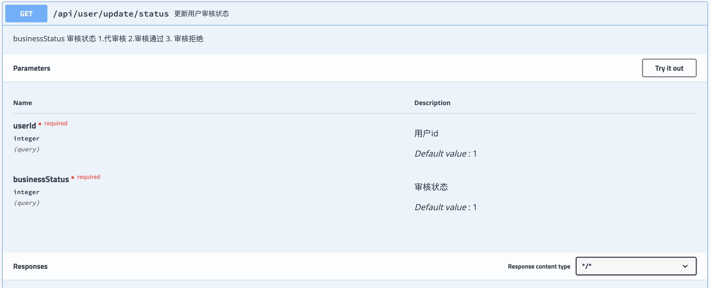
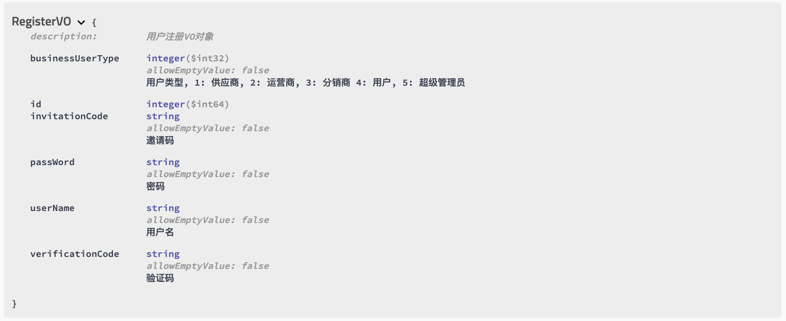

# Swagger

Swagger是一组围绕 OpenAPI规范构建的开源工具，可以设计、构建、记录和使用REST API。

## 引入依赖

- `springfox-swagger`，对Spring和Swagger的使用进行了整合
- `springfox-swagger-ui`，提供了可视化界面

```xml
<dependency>
    <groupId>io.springfox</groupId>
    <artifactId>springfox-swagger2</artifactId>
    <version>2.7.0</version>
</dependency>
<dependency>
    <groupId>io.springfox</groupId>
    <artifactId>springfox-swagger-ui</artifactId>
    <version>2.7.0</version>
</dependency>
```

## 配置


## 注解

### @Api

标记Controller，默认情况下，Swagger-Core只会扫描解析具有@Api注解的类

- `value`

  没什么作用

- `tags`

  将同一标签的接口分在一起

### @ApiOperation

对一个接口进行描述

- `value`

  操作名

- `notes`

  操作说明

### @ApiImplicitParams

@ApiImplicitParam的容器

### @ApiImplicitParam

- `name` 

  参数名称

- `value` 

  参数的简短描述

- `required` 

  是否为必传参数

- `dataType` 

  参数类型，可以为类名，也可以为基本类型（String，int、boolean等）

- `paramType` 

  参数的传入（请求）类型，可选的值有path, query, body, header or form。

### @ApiResponses

注解@ApiResponse的包装类

### @ApiResponse

略

### @ApiModel

描述一个Model，一般用于请求体的VO对象

### @ApiModelProperty

描述一个model的属性

- `value` 

  属性简短描述

- `example` 

  属性的示例值

- `required`

  是否为必须值

## 最佳实践

### 接口

```java
@Api(tags = "用户相关接口")
@RestController
@RequestMapping("/api/user")
public class UserController {
    @ApiOperation(value = "更新用户审核状态", notes = "businessStatus 审核状态 1.代审核 2.审核通过 3. 审核拒绝")
    @ApiImplicitParams({
        @ApiImplicitParam(paramType = "query", dataType = "int", name = "userId", defaultValue = "1", value = "用户id", required = true),
        @ApiImplicitParam(paramType = "query", dataType = "int", name = "businessStatus", defaultValue = "1", value = "审核状态", required = true)
    })
    @GetMapping("/update/status")
    public ApiResult updateUser(Long userId, Integer businessStatus) {
        AssertUtil.assertNotNull(businessStatus, "审核状态不能为空");
        AssertUtil.assertNotNull(userId, "用户id不能为空");
        userService.updateUserStatus(userId, businessStatus);
        return new ApiResult(0, null, "success");
    }
}
```



### VO

```java
@ApiModel(value = "RegisterVO", description = "用户注册VO对象")
public class RegisterVO {

    private Long id;

    @NotNull
    @ApiModelProperty("用户类型, 1: 供应商, 2: 运营商, 3: 分销商 4: 用户, 5: 超级管理员")
    private Integer businessUserType;

    @ApiModelProperty("用户名")
    private String userName;

    @ApiModelProperty("邀请码")
    private String invitationCode;

    @ApiModelProperty("验证码")
    private String verificationCode;

    @ApiModelProperty("密码")
    private String passWord;
}

```



## 放行Swagger

swagger2需要放行下列路径：

```
"/swagger-ui.html",
"/webjars/**",
"/swagger-resources/**",
"/v2/**"
```

## 环境控制

```
@Profile({"dev"})
```

## 使用

访问路径：` /swagger-ui.html`

## References

1. https://juejin.cn/post/6844903901724950535
