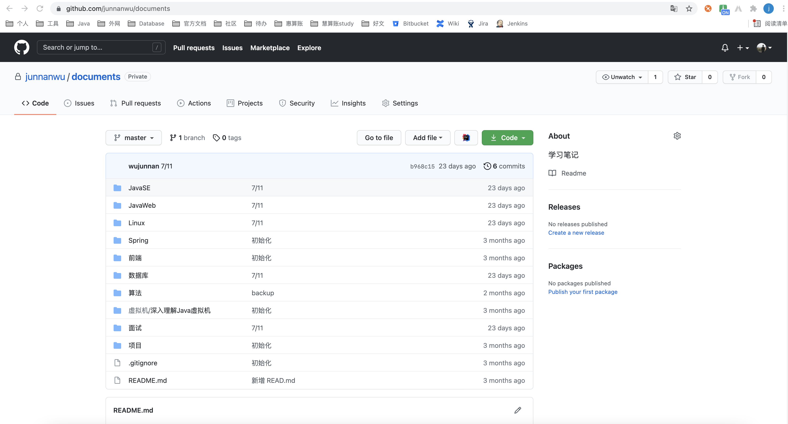

Rest

REpresentational State Transfer 

直译为：表现层状态转移，其中省略了主语Resource，加上后意思就是，资源在网络中以某种表现形式进行状态转移。

一句话概括Restful就是：URI定位资源，HTTP动词描述操作。

GET /products : will return the list of all products

POST /products : will add a product to the collection

GET /products/4 : will retrieve product #4

PATCH/PUT /products/4 : will update product #4

github请求样例：

当打开junnanwu的gitbub的documents仓库的时候，发出了如下请求：

- `get https://github.com/junnanwu/documents/tree-commit/b968c153d6069efc729484d0c6f6147f5e9969ab`
- `get https://github.com/junnanwu/documents/file-list/master`
- `get https://github.com/junnanwu/documents`

点右上角的star

- `post https://github.com/junnanwu/documents/star`

取消star

- `post https://github.com/junnanwu/documents/unstar`

