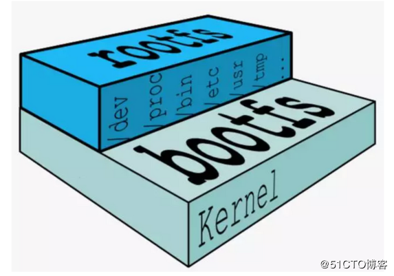
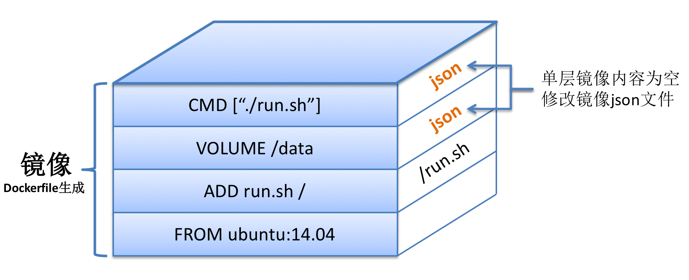

# Docker

## 什么是Docker

Docker 是一个开源的应用容器引擎，Docker可以让开发者打包他们的应用以及依赖包到一个轻量级、可移植的容器中，然后发布到任何流行的 Linux 机器上。

Docker 从 17.03 版本之后分为 CE（Community Edition: 社区版） 和 EE（Enterprise Edition: 企业版）

本文基于CentOS7 安装Docker

## 安装Docker

- 卸载旧版本

  较旧的 Docker 版本称为 docker 或 docker-engine

  ```
  $ sudo yum remove docker \
                    docker-client \
                    docker-client-latest \
                    docker-common \
                    docker-latest \
                    docker-latest-logrotate \
                    docker-logrotate \
                    docker-engine
  ```

- 使用官方安装脚本自动安装

  ```
  curl -fsSL https://get.docker.com | bash -s docker --mirror Aliyun
  ```

  也可以使用国内 daocloud 一键安装命令：

  ```
  curl -sSL https://get.daocloud.io/docker | sh
  ```

- 启动Docker

  ```
  systemctl start docker
  ```

- 重启Docker

  ```
  systemctl restart  docker
  ```

- 关闭docker 

  ```
  systemctl stop docker
  ```

- 查看是否启动成功

  ```
  docker ps -a
  ```
  
- 查看日志

  ```
  docker logs CONTAINER ID(容器id)
  ```

## Docker架构

Docker 包括三个基本概念:

- **镜像（Image）**：Docker 镜像（Image），就相当于是一个 root 文件系统。比如官方镜像 ubuntu:16.04 就包含了完整的一套 Ubuntu16.04 最小系统的 root 文件系统。
- **容器（Container）**：镜像（Image）和容器（Container）的关系，就像是面向对象程序设计中的类和实例一样，镜像是静态的定义，容器是镜像运行时的实体。容器可以被创建、启动、停止、删除、暂停等。
- **仓库（Repository）**：仓库可看成一个代码控制中心，用来保存镜像。

容器与镜像的关系类似于面向对象编程中的对象与类。

## Docker镜像加速器

查看docker镜像

```
docker info
```

配置阿里云镜像

```
sudo mkdir -p /etc/docker
sudo tee /etc/docker/daemon.json <<-'EOF'
{
  "registry-mirrors": ["https://afi5x6i2.mirror.aliyuncs.com"]
}
EOF
sudo systemctl daemon-reload
sudo systemctl restart docker
```

## Dorker镜像相关命令

- 查看本地所有镜像

  ```
  docker images
  ```

- 从网络查找相关镜像

  ```
  docker search 镜像名称
  ```

- 拉取镜像

  ```
  docker pull mysql:5.7
  ```

  从Docker仓库下载镜像到本地，镜像名称格式为 名称:版本号，如果版本号不指定则是最新的版本

- 删除本地镜像

  ```
  docker rmi 镜像id   //i(image)
  ```

## Docker容器相关命令

- 查看正在运行的容器

  ```
  docker ps 
  ```

- 查看所有容器

  ```
  docker ps -a
  ```

- 新建容器

  ```
  docker run 参数
  docker run -it --name=c1 centos:7 /bin/bash #交互式容器
  docker run -id --name=c2 centos:7  #守护式容器
  ```

  新建mysql容器

  ```
  docker run -it --name=mysql mysql:5.7 /bin/bash
  ```

- 进入容器

  ```
  docker exec -it mysql /bin/bash 
  ```

- 启动容器

  ```
  docker start 容器名称
  ```

- 关闭容器

  ```
  docker stop 容器名称
  ```

- 删除容器：如果容器是运行状态则删除失败，需要停止容器才能删除

  ```
  docker rm 容器名称
  ```

- 查看容器信息（IP）

  ```
  docker inspect 容器名称
  ```

- 容器开机自启动

  ```
  docker update --restart=always 容器名|容器ID
  ```

- 目录挂载

  ```
  docker run -id --name=容器名 -v 宿主机的目录:容器的目录 镜像名:镜像版本
  ```

## Docker应用部署

- mysql

  ```
  docker run -id \
  -p 3307:3306 \
  --name=c_mysql \
  -v $PWD/conf:/etc/mysql/conf.d \
  -v $PWD/logs:/logs \
  -v $PWD/data:/var/lib/mysql \
  -e MYSQL_ROOT_PASSWORD=root \
  mysql:5.7
  ```

  参数说明：

  - **-p 3307:3306**：将容器的 3306 端口映射到宿主机的 3307 端口。
  - **-v $PWD/conf:/etc/mysql/conf.d**：将主机当前目录下的 conf/my.cnf 挂载到容器的 /etc/mysql/my.cnf。配置目录
  - **-v $PWD/logs:/logs**：将主机当前目录下的 logs 目录挂载到容器的 /logs。日志目录
  - **-v $PWD/data:/var/lib/mysql** ：将主机当前目录下的data目录挂载到容器的 /var/lib/mysql 。数据目录
  - **-e MYSQL_ROOT_PASSWORD=123456：**初始化 root 用户的密码。

- tomcat

  ```
  docker run -id --name=c_tomcat \
  -p 8081:8080 \
  -v /root/tomcat:/usr/local/tomcat/webapps \
  tomcat
  ```

- Nginx

  ```
  # 在/root目录下创建nginx目录用于存储nginx数据信息
  mkdir ~/nginx
  cd ~/nginx
  mkdir conf
  cd conf
  # 在~/nginx/conf/下创建nginx.conf文件,粘贴下面内容
  vim nginx.conf
  ```

  ```
  user  nginx;
  worker_processes  1;
  
  error_log  /var/log/nginx/error.log warn;
  pid        /var/run/nginx.pid;
  
  
  events {
      worker_connections  1024;
  }
  
  
  http {
      include       /etc/nginx/mime.types;
      default_type  application/octet-stream;
  
      log_format  main  '$remote_addr - $remote_user [$time_local] "$request" '
                        '$status $body_bytes_sent "$http_referer" '
                        '"$http_user_agent" "$http_x_forwarded_for"';
  
      access_log  /var/log/nginx/access.log  main;
  
      sendfile        on;
      #tcp_nopush     on;
  
      keepalive_timeout  65;
  
      #gzip  on;
  
      include /etc/nginx/conf.d/*.conf;
  }
  ```

  ```
  #切至 /root/nginx 目录下
  cd ~/nginx
  docker run -id --name=c_nginx \
  -p 80:80 \
  --privileged=true \
  -v $PWD/conf/nginx.conf:/etc/nginx/nginx.conf \
  -v $PWD/logs:/var/log/nginx \
  -v $PWD/html:/usr/share/nginx/html \
  nginx
  ```

  参数说明：

  - **-p 80:80**：将容器的 80端口映射到宿主机的 80 端口。
  - **-v $PWD/conf/nginx.conf:/etc/nginx/nginx.conf**：将主机当前目录下的 /conf/nginx.conf 挂载到容器的 :/etc/nginx/nginx.conf。配置目录
  - **-v $PWD/logs:/var/log/nginx**：将主机当前目录下的 logs 目录挂载到容器的/var/log/nginx日志目录

- Redis

  ```
  docker run -id --name=c_redis -p 6379:6379 redis
  ```
  
- rabbitMQ

  ```
  docker run -d -p 5672:5672 -p 15672:15672 --name rabbitmq rabbitmq:management
  ```

  

## dockerfile

制作镜像的两种方式，一种是将容器提交为镜像

```
docker commit 容器ID|容器名 镜像名:镜像版本
```

手动编写dockerfile

- FROM

  基础镜像是谁

- MAINTAINER

  作者是谁

- RUN

  准备执行哪些LINUX命令

- WORKDIR

  登录容器进入的默认目录

- CMD

  容器启动后默认执行的命令

## docker IPV4转发问题

- WARNING: IPv4 forwarding is disabled. Networking will not work.

  没有开启转发,网桥配置完后，需要开启转发，不然容器启动后，就会没有网络，配置`/etc/sysctl.conf`,添加`net.ipv4.ip_forward=1`

  ```
  vim /etc/sysctl.conf
  
  #配置转发
  #检查系统设置，打开IPv4转发
  net.ipv4.ip_forward=1
  
  #重启网卡，让配置生效
  systemctl restart network
  
  #查看是否成功,如果返回为“net.ipv4.ip_forward = 1”则表示成功
  
  sysctl net.ipv4.ip_forward
  ```

  [Reference](https://blog.csdn.net/yelllowcong/article/details/78295600)

## 为什么Docker镜像那么小

### 为什么Docker的centOS镜像那么小?



Linux操作系统分别由两部分组成

- 内核空间(kernel)

  Linux刚启动时会加载bootfs文件系统，之后bootf会被卸载掉

- 用户空间(rootfs)

  用户空间的文件系统是rootfs,包含常见的目录，如`/dev`、`/proc`、`/bin`、`/etc`等等

通过docker pull centos命令下载镜像，实质上下载centos操作系统的rootfs，因此docker下载的镜像大小只有200M

### 为什么Docker中的镜像那么小？例如HelloWord

[Reference](https://blog.csdn.net/shlazww/article/details/47375009)

通过docker build以上Dockerfile的时候，会在Ubuntu:14.04镜像基础上，添加三层独立的镜像，依次对应于三条不同的命令。镜像示意图如下：



不得不说，在层级化管理的Docker镜像中，有不少层大小都为0。那些镜像层大小`不为0`的情况，归根结底的原因是：构建Docker镜像时，对当前的文件系统造成了修改更新。而修改更新的情况主要有两种：

**1.ADD或COPY命令**:ADD或者COPY的作用是在docker build构建镜像时向容器中添加内容，只要内容添加成功，当前构建的那层镜像就是添加内容的大小，如以上命令`ADD run.sh /`，新构建的那层镜像大小为文件run.sh的大小。

**2.RUN命令**:RUN命令的作用是在当前空的镜像层内运行一条命令，倘若运行的命令需要更新磁盘文件，那么所有的更新内容都在存储在当前镜像层中。举例说明：`RUN echo DaoCloud`命令不涉及文件系统内容的修改，故命令运行完之后当前镜像层的大小为0；`RUN wget http://abc.com/def.tar`命令会将压缩包下载至当前目录下，因此当前这一层镜像的大小为:对文件系统内容的增量修改部分，即def.tar文件的大小。

#### 镜像复用

假设本地镜像存储中只有一个ubuntu:14.04的镜像，我们以两个Dockerfile来说明镜像复用：

```
FROM ubuntu:14.04
RUN apt-get update
```

```
FROM ubuntu:14.04
ADD compressed.tar /
```

假设最终docker build构建出来的镜像名分别为image1和image2，由于两个Dockerfile均基于ubuntu:14.04，因此，image1和image2这两个镜像均复用了镜像ubuntu:14.04。 假设`RUN apt-get update`修改的文件系统内容为20MB，最终本地三个镜像的大小关系应该如下：

**ubuntu:14.04**: 200MB

**image1**:200MB(ubuntu:14.04)+20MB=220MB

**image2**:200MB(ubuntu:14.04)+100MB=300MB

如果仅仅是单纯的累加三个镜像的大小，那结果应该是：200+220+300=720MB，但是由于镜像复用的存在，实际占用的磁盘空间大小是：200＋20+100=320MB，足足节省了400MB的磁盘空间。在此，足以证明镜像复用的巨大好处。

## docker使用问题

#### 容器时区

问题：docker日志时间比正常时间慢8个小时

```
root@9cdee1317100:/# date
Thu Dec 17 07:32:57 UTC 2020
```

UTC为标准时间，为格林威治时间

原因：宿主机设置了时区，但是Docker容器并未设置时区

解决：

- 运行容器时指定时区 

  ```
  docker run -d -p 5672:5672 -p 15672:15672 -v /etc/timezone:/etc/timezone:ro -v /etc/localtime:/etc/localtime:ro  --name rabbitmq rabbitmq:management
  ```

  之后显示时间是正常的，这时候就是中国时间CST了，即东八区

  ```
  root@7ea093bca245:/# date
  Thu Dec 17 15:37:31 CST 2020
  ```

- 修改Dockerfile文件，在里面设置时区（未测试）

  ```
  ENV TZ=Asia/Shanghai 
  RUN ln -snf /usr/share/zoneinfo/$TZ /etc/localtime && echo $TZ > /etc/timezone
  ```

#### docker运行rabbitmq15672端口连接不上

进入rabbitmq之后，安装插件

```
rabbitmq-plugins enable rabbitmq_management
```

