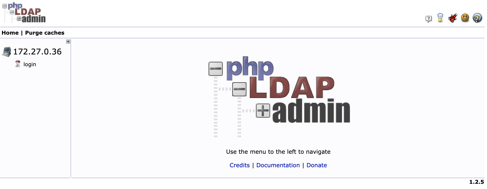
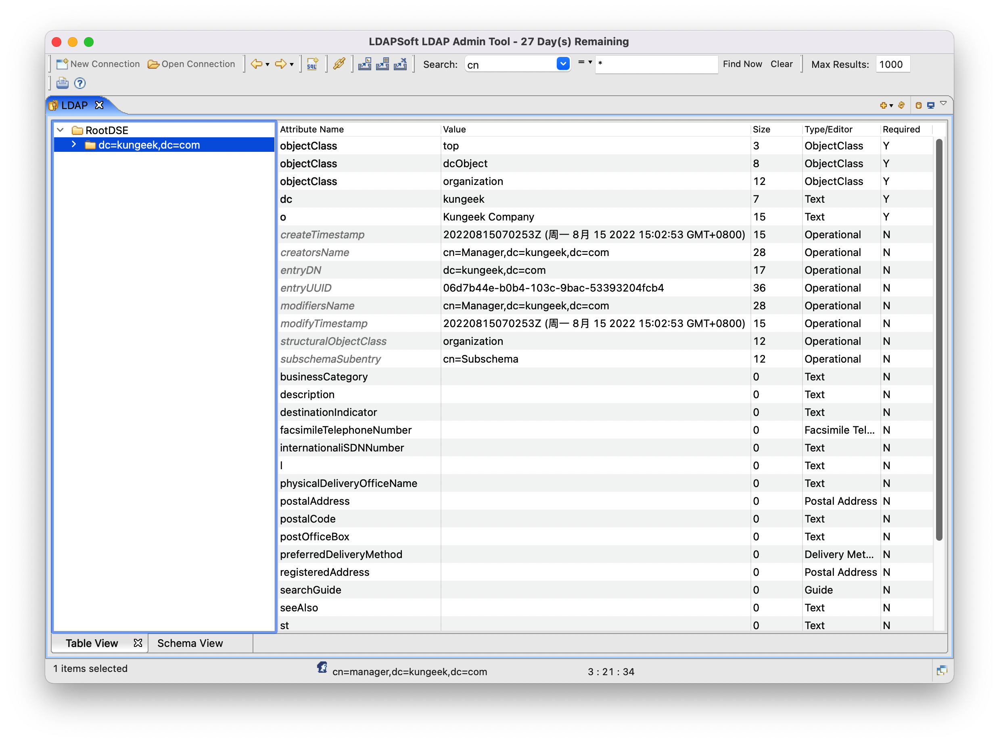

# LDAP

LDAP，轻型目录访问协议，是一个开发的，中立的，工业标准的应用协议。

由于绝大多数开源的软件都支持LDAP协议，所以我们可以使用Ldap来使用同一个账号登录公司的所有平台。

## LDAP概念

- dn（distinguished name），专有名字，类似关系型数据库中的主键。

  例如：`ou=people,dc=wikipedia,dc=org`

  ```
           dc=org
              |
          dc=wikipedia
         /          \
   ou=people     ou=groups
  ```

- dc（Domain Component）域名组件

  一般为公司的域名拆分开的形式。

- ou（Organization Unit）组织单元

- cn（Common Name）公共名称

例如：`CN=Dev-India,OU=Distribution Groups,DC=gp,DC=gl,DC=google,DC=com`（从右往左读）。

## 修改LDAP数据

有两种方式可以来修改LDAP：

- 通过LDAP协议通过网络装载数据
- 通过LDAP Data Interchange Format（LDIF）格式的文件将数据导入服务器，也可以通过LDIF来删除数据

## LDAP产品

有如下产品实现了Ldap协议：

- 微软的Active Directory
- Oracle的Oracle Internet Directory
- 开源的OpenLDAP

其中OpenLDAP已经被包含在多数LInux发行版本中。

## Open Ldap

### slappasswd

slappasswd命令用于生成加密后的密码。

参数：

- `-s secret`  

  新密码

- `-h scheme`

  指定加密方式，可取如下值：

  - `{CRYPT}`
  - `{MD5}`
  - `{SMD5}`
  - `{SSHA}`
  - `{SHA}`

例如：

```
$ slappasswd -h {SHA} -s 123456
{SHA}fEqNCco3Yq9h5ZUglD3CZJT4lBs=
```

### 加密方式

我们公司最终采用了SSHA加密的方式，就是SHA-1加密算法加盐的方式，具体算法如下：

```
{SSHA}+base64(SHA1(明文密码+盐)+盐)
```

每次都是随机的盐，所以每次加密后的密码也是不一样的。

Java代码如下：

```java
import java.nio.charset.StandardCharsets;
import java.security.MessageDigest;
import java.security.NoSuchAlgorithmException;
import java.security.SecureRandom;
import java.util.Base64;

/**
 * @author wujunnan
 * @date 2022/11/15
 */
public class SSHAEncode {

    /**
     * 盐长度
     */
    private static final int SALT_LENGTH = 4;

    public static void main(String[] args) throws NoSuchAlgorithmException {
        System.out.println(generateSSHA("123456"));
    }

    public static String generateSSHA(String password)
            throws NoSuchAlgorithmException {
        SecureRandom secureRandom = new SecureRandom();
        byte[] salt = new byte[SALT_LENGTH];
        secureRandom.nextBytes(salt);
        MessageDigest crypt = MessageDigest.getInstance("SHA-1");
        crypt.reset();
        crypt.update(password.getBytes(StandardCharsets.UTF_8));
        crypt.update(salt);
        byte[] hash = crypt.digest();
        byte[] hashPlusSalt = new byte[hash.length + salt.length];
        System.arraycopy(hash, 0, hashPlusSalt, 0, hash.length);
        System.arraycopy(salt, 0, hashPlusSalt, hash.length, salt.length);
        return Base64.getEncoder().encodeToString(hashPlusSalt);
    }
}
```

Java的方式生成SHA256的密文，代码如下：

```java
import sun.misc.BASE64Encoder;

import java.io.UnsupportedEncodingException;
import java.security.MessageDigest;
import java.security.NoSuchAlgorithmException;

public class Ldap {

    public static String EncoderBySha(String str) throws NoSuchAlgorithmException, UnsupportedEncodingException {
        //可以选择SHA-1、SHA-256、MD5
        MessageDigest sha = MessageDigest.getInstance("SHA-256");
        BASE64Encoder base64en = new BASE64Encoder();
        String newstr = base64en.encode(sha.digest(str.getBytes("utf-8")));
        return newstr;
    }

    public static void main(String[] args) throws UnsupportedEncodingException, NoSuchAlgorithmException {
        String passwordToHash = "123456";
        String encoderBySha = EncoderBySha(passwordToHash);
        //结果应该为：jZae727K08KaOmKSgOaGzww/XVqGr/PKEgIMkjrcbJI=
        System.out.println(encoderBySha);
    }
}
```

### ldapsearch

ldapsearch工具用来搜索Ldap中的内容：

```
ldapsearch -H ldap://49.7.65.7:389 -x -D "cn=Manager,dc=xxx,dc=com" -W -b "ou=test,dc=xxx,dc=com" -s sub "(uid=niuyongqiang)" "*"
```

搜索`ou=test,dc=xxx,dc=com`这个ou下所有子树满足`uid=niuyongqiang`对应的所有属性。

## LDAP管理工具

虽然可以通过命令行来操作Open Ldap，但是操作较为复杂，考虑使用LDAP管理工具，常见的管理工具有：

- phpLDAPadmin
- Apache Directory Studio
- LDAP Admin Tool

phpLDAPadmin是PHP开发的Web平台，2012年就停止维护了，界面比较古老，如下：



由于需要PHP环境，并且对PHP的版本有要求，所以使用docker安装较为方便，可以使用[此镜像](https://github.com/osixia/docker-phpLDAPadmin)。

LDAP Admin Tool是客户端工具，是需要收费的，而且有时候会出现卡死的情况，Mac版如下：




## References

1. 维基百科：[轻型目录访问协议](https://zh.wikipedia.org/wiki/%E8%BD%BB%E5%9E%8B%E7%9B%AE%E5%BD%95%E8%AE%BF%E9%97%AE%E5%8D%8F%E8%AE%AE)
2. 博客：[phpLDAPadmin安装及配置使用](https://blog.csdn.net/u010543388/article/details/107682769)