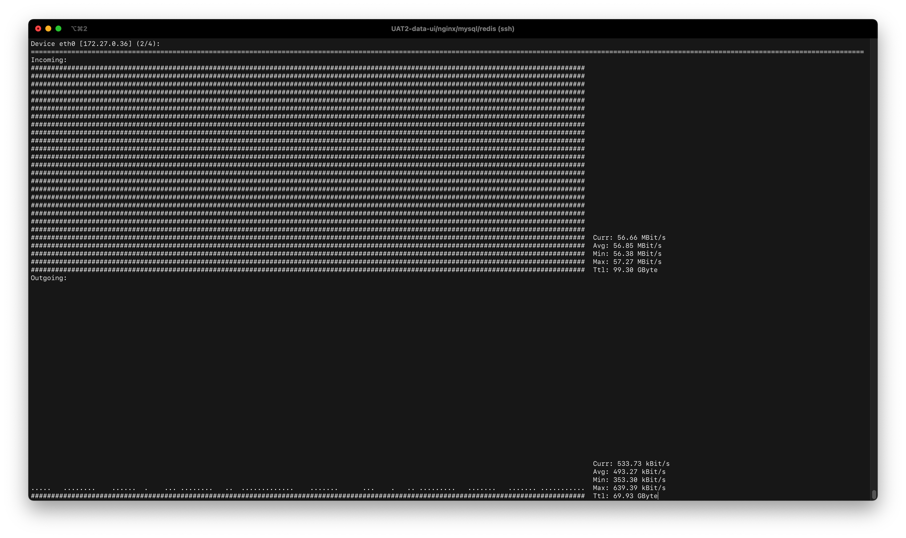
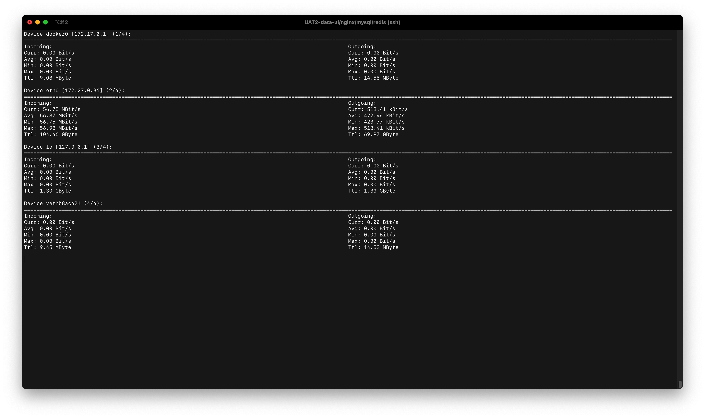
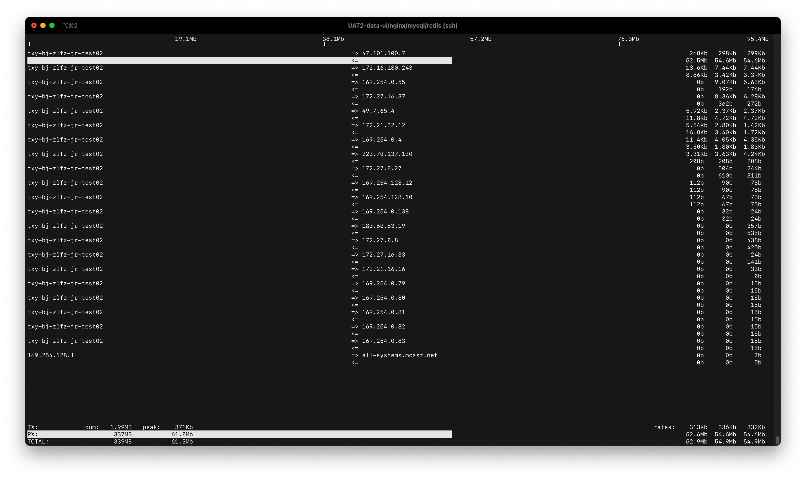
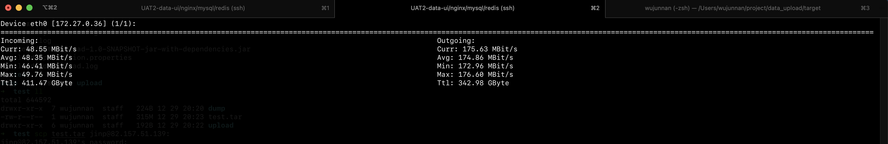

# Linux网络带宽监控工具

## nload

nload可以监控**不同的网络**设备的带宽使用情况。

### 安装

（使用Cent OS）

```
$ sudo yum install epel-release
$ sudo yum install nload
```

### 使用

格式：

```
nload [options] [devices]
```

例如：

- 查看所有设备

  ```
  $ nload
  ```

  

  可以使用左右键切换设备。

- 查看特定设备

  ```
  $ nload eth0
  ```

参数：

- `-m`

  一次查看多个设备

  ```
  $ nload -m
  ```

  

## iftop

> iftop: display bandwidth usage on an interface by host.

iftop就像top命令监测CPU一样监测网络，它根据接口列出了每个主机的带宽使用情况。

### 安装

（使用Cent OS）

```
$ sudo yum install iftop
```

### 使用

例如：

```
$ sudo iftop
```



含义：

- TX：发送流量
- RX：接收流量
- TOTAL：总流量
- Cumm：运行iftop到目前时间的总流量
- peak：流量峰值
- rates：分别表示过去 2s 10s 40s 的平均流量

## 最佳实践

- 想简单的看总的上传速度下载速度：

  ```
  $ nload -m eth0
  ```

  

## References

1. iftop文档：[iftop: display bandwidth usage on an interface](https://www.ex-parrot.com/pdw/iftop/)