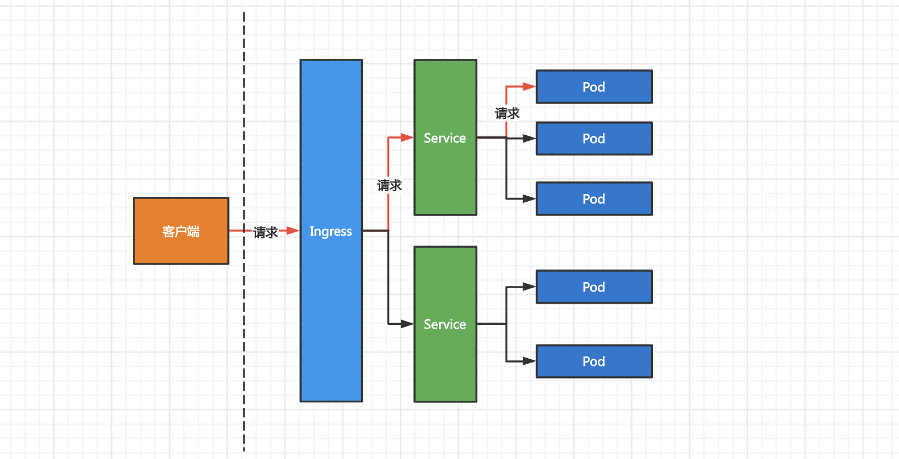

# KubeSphere创建DevOps项目

## K8s是什么

K8s是负责自动化运维管理多个Docker程序的集群。

## K8s的好处

- 资源统一管理
- 自动扩容缩容
- 简化部署
- 自我修复

## K8s的核心资源

### namespace

命名空间，分隔资源和对象。

命名空间有如下特点：

- 不同命名空间的资源时可以重名的
- 租户隔离，不用担心无意中修改其他用户的资源
- 命名空间并不提供网络隔离功能，也就是你知道某个其他命名空间下Pod的IP，那么你就可以将流量发送到该Pod

### 部署相关

#### Pod

Pod是逻辑主机，是可以在K8s中创建和管理的、最小可部署的计算单元。同一个Pod内可以有多个docker容器，当然很多时候，一个Pod中也只有一个容器。

为什么不直接使用容器而要使用Pod？

对于多进程组成的应用程序，无论是进程间通信，还是相互访问本地文件，都要求在同一台机器上。而容器为了方便进程的管理和日志的管理，被设计为一个容器只运行一个进程。基于此，出现了Pod，让多个进程就像在一台机器上一样。

K8s通过配置Docker让一个Pod内的所有容器共享相同的Linux的命名空间来实现上述特性，而不是像传统Docker一样，每个容器都有自己的一组命名空间。

也就是说，一个Pod下的所有容器：

- 拥有相同的IP地址和端口空间（端口不能相同）
- 可以通过localhost进行通信

K8s集群中的**所有Pod都在同一个共享网络地址空间中**，也就是每个Pod都有自己的IP地址，并且可以相互访问，就像在局域网中一样。

#### Deployment

在K8s上，我们很少会直接创建一个Pod，在多数情况下都会通过Deployment、DaemonSet、Job等控制器来创建Pod。

Deployment负责管理和控制Pod，自动创建指定副本数的Pod，当某个Pod运行失败，也会重新运行一个新的Pod以保证一共有指定副本数的Pod。

默认Deployment会创建ReplicaSet负责全自动维护副本数量，实现滚动升级。

### 调度相关

#### Job

ReplicaSet会持续运行应用，当遇到运行完工作后就终止任务的情况时，可以利用Job资源。

Job资源有如下特点：

- Job允许你运行一种Pod，该Pod在内部进程 成功结束的时候，不重启容器，Pod处于完成状态
- 当节点发生故障的时候，类似ReplicaSet，将该Pod重新安排到其他节点，当进程异常退出的时候，可以配置为重新启动容器
- Job中也可以创建多个Pod实例，可以顺序运行多个Pod，也可以并行运行多个Pod
- Job可以指定运行次数，可以运行多次
- 可以安排Job定期运行

#### DaemonSet

DaemonSet用于管理在集群每个Node上仅运行一份Pod的副本实例。

### 网络相关

#### Service

若干个Pod的流量入口，流量均衡器。

Service其实就是我们微服务的一个抽象，对于一个服务来说，其他服务不关心它内部一共有几个副本，也不关心其内部如何做的负载均衡，只关心最后对外暴露的IP和端口，这也正是Service的功能。

Service有几种发布类型：

- ClusterIP

  默认类型，提供一个集群内部的虚拟IP，这个是默认选项，但是依然不能被外网访问。

- NodePort

  K8s集群的每个节点都打开一个相同的端口（范围是30000-32767，也可以手动指定一个NodePort），将流量导向Service本身的IP:端口。

  注意，这里会把请求随机分配给任何一个节点Pod，如果开启了`externalTrafficPolicy: Local`，那么请求会只会被转发到对应节点的Pod。

- LoadBalancer

  使用云提供商的负载均衡器向外部暴露服务。负载均衡器有独一无二的可公开访问的IP地址，并将所有连接重定向到服务。

注意，这三种方式并**不是相互排斥的，而是层层递进的**，也就是说，NodePort机制包含ClusterIP，LoadBlanacer包含NodePort和CluterIP，也就是说LoadBalance的方式也同样可以通过NodeIP+端口来访问。

NodePort的方式满足外网访问，比较简单，但也有缺点，它依赖于某个节点，当这个节点发生故障的时候，客户端将无法访问服务，不满足高可用。

另外也可以使用Ingress充当集群的入口。

#### Ingress

由于每个LoadBalancer服务都需要自己的负载均衡器，以及独有的公网IP地址，而Ingress负载均衡只需要一个公网IP就能为需要服务提供访问。

Ingress负载均衡由以下两部分构成：

- Ingress是一个K8s的一个资源，负责定义转发规则
- Ingress Controller是具体负责反向代理的应用，例如Nginx

客户端向Ingress Controller发送HTTP请求，Ingress Controller通过Host确定客户端访问哪个服务，通过该服务关联的EndPoint对象查看Pod IP，并将客户端的请求转发给其中一个Pod（**Ingress Controller并不会将请求转发给Service，只用它来选择Pod**）。

在K8s中，Ingress Controller（如Nginx）将以Pod的形式运行，获取到Ingress的定义，生成Nginx所需的配置文件nginx.conf，在Ingress配置变化的时候，通过执行`nginx -s reload`的命令，重新加载nginx.conf。

Ingress Controller以daemonset的形式进行创建，在每个Node上都将启动一个Nginx服务，并将容器应用监听的80和443端口号映射到物理机上，可以通过访问物理机的80或443端口来访问Ingress。

**Ingress高可用**

通过云服务提供商的负载均衡，例如[阿里的SLB](https://help.aliyun.com/document_detail/196880.html)（Server Load Balance），将流量负载到多个Ingress Controller节点上。

**K8s的网络访问示意图**




## 发布一个K8s服务

### 连接到K8s

kubectl是K8s的命令行工具，就类似mysql之于mysqld，kubectl可以安装在任意一台机器上去操作K8s集群，所以，需要首先需要连接到K8s，这里是通过一个YAML配置文件（K8s所有资源都是通过YAML配置文件来描述）来进行连接。

可以将YAML文件放在`$HOME/.kube/config`目录下，接下来再此使用kubectl命令的时候就会自动读取配置了。

### 创建namespace

创建一个namespace，我们接下来会在这个namespace下来创建资源。

```
$ kubectl create namespace ${name}
```

### 部署Deployment

同样的，Deployment也通过YAML文件来描述，如下所示：

```yml
# api版本
apiVersion: apps/v1
# 该配置的类型
kind: Deployment
# Deployment的元数据
metadata:
  # Deployment的name
  name: APP_NAME
  # 对应上面的namespace
  namespace: PROJECT_NAME
#详细配置
spec:
  #pod的副本数
  replicas: 1
  #定义了Deployment如何查找Pod
  selector:
    #即有APP_NAME标签的Pod被该Deloyment管理
    matchLabels:
      app: APP_NAME
  #pod的相关信息
  template:
    #pod的元数据
    metadata:
      #pod的标签
      labels:
        app: APP_NAME
    #pod的规格/内容
    spec:
      #docker私有仓库对应的secret
      imagePullSecrets:
        - name: docker-secret
      containers:
        - name: APP_NAME
          image: IMAGE_NAME
          ports:
            - name: http-9091
              #pod对应端口
              containerPort: 9091
              protocol: TCP
          #pod对应资源
          resources:
            requests:
              cpu: 0.2
              memory: 1Gi
            limits:
              cpu: 1
              memory: 1Gi
```

具体参数详见[官方文档](https://kubernetes.io/zh-cn/docs/concepts/workloads/controllers/deployment/)。

通过如下命令，即可发布该Deployment：

```
$ kubectl create -f ${DEPLOYMENT_YAML}
```

发布Deployment的同时，也会创建一个Pod，Pod的端口为9091，Pod对应的IP也为K8s分配的虚拟IP，外网无法访问的，所以我们还需要创建Service，作为Pod的流量入口。

### 创建Service

这里使用的是Service的NodePort的方式：

```yml
apiVersion: v1
kind: Service
metadata:
  labels:
    app: APP_NAME
  name: APP_NAME
  namespace: PROJECT_NAME
spec:
  ports:
    - name: http
      #服务端口
      port: 9091
      #容器端口
      targetPort: 9091
      protocol: TCP
      #NodePort类型中指定节点上的端口
      nodePort: 30081
  selector:
    #管理标签为APP_NAME的Pod
    app: APP_NAME
  sessionAffinity: None
  #使用NodePort发布类型
  type: NodePort
```

具体参数详见[官方文档](https://kubernetes.io/zh-cn/docs/concepts/services-networking/service)。

## 其他K8s功能

### 查看应用程序的日志

容器化的应用通常会将日志记录到标准输出和标准错误流中，而不是将其写入文件，容器运行时将这些流重定向到文件中，并允许我们ssh登录到容器节点后，使用`docker log`命令来查看容器日志，可以在集群任意节点通过`kubectl logs`命令获取Pod日志。

注意：

- 每天或者每次日志文件达到10MB大小时，容器日志都会自动轮替，`kubectl logs`命令仅显示最后一次轮替后的日志
- 我们只能获取仍然存在的Pod日志，当一个Pod被删除时，它的日志也会被删除，如果希望在Pod删除之后仍然可以查看日志 ，需要设置集群范围的日志系统。

### 探针

#### 存活探针

我们该如何保证Pod时健康运行的呢？

如果容器的主线程崩溃，那么显然此时Pod不健康，K8s将重启应用，但是有时候即使进程没有崩溃，应用系统也会停止正常工作，例如OOM。

K8s可以通过存活探针（LivenessProbe）来检查容器是否正常运行，可以为Pod中的每个容器单独制定存活探针，如果存活探针探测到容器不健康，则kubelet将杀掉该容器，并根据容器的重启策略做相应的处理。

探针类型包括：

- HTTP GET探针

  对容器IP执行HTTP GET请求，如果没有相应错误码，则认为探测成功。

- TCP套接字探针

  TCP套接字探针尝试和容器端口建立TCP连接，如果连接成功建立，则探测成功。

- Exec探针

  在容器内执行任意命令，如果命令正常退出，则认为探测成功。

对于在生产中运行的Pod一定要定义一个存活的探针，来告知K8s应用是健康的。

#### 就绪探针

就绪探针（ReadinessProbe）用于判断容器服务是否可用（Ready）达到Ready状态的Pod才可以接收请求。对于被Service管理的Pod，如果在运行过程中Ready状态变为False，则系统自动将从Service的后端Endpoint列表中隔离出去。

### 磁盘挂载到容器

前面提到，Pod内的多个容器可以共享CPU、RAM、网络和端口资源，但是却无法共享磁盘资源，因为文件系统来自容器镜像。

K8s通过定义卷来解决这个问题，卷时Pod的一个组成部分，我们可以把卷挂载到容器的任意位置。

通过将相同的卷挂载到相同的容器中，它们可以对相同的文件进行操作。

## KubeSphere是什么

KubeSphere是在Kubernetes之上构建的云原生操作系统，提供了如下功能：

- 提供了UI页面来操作K8s，进一步简化了K8s操作
- 同时也集成了一些常用的组件，例如Jenkins，方便的创建流水线
- 多租户管理，方便权限控制

详情可以参考详情可以[官方文档](https://kubesphere.io/zh/docs/v3.3/)。

## KubeSphere核心概念

- 企业空间

  企业空间是KubeSphere抽象出来的一个概念，它用来管理项目、DevOps项目、应用模版，用于租户的权限隔离，一般是一个组一个企业空间，例如大数据企业空间。

- 项目

  项目对应了K8s中的namespace。一般一个环境是一个项目，例如大数据生产项目、大数据测试项目。

- 应用负载

  应用负载对应了K8s的Deployment，负责管理和创建Pod。

- 服务

  服务对应了K8s的Service，将一组Pod统一的进行暴露，在不同Pod之间进行负载均衡。

- 应用路由

  应用路由对应了K8s的Ingress，可以通过IP+路由来暴露Service，类似Nginx。

- 容器组

  容器组对应了K8s的Pod，是K8s操作的最小和基本单元。

## 创建Java后端项目DevOps项目

（以gradle为例）

### 准备工作

需要创建好namespace、project、DevOps项目及对应有权限的账户。

### 项目添加文件

在项目根路径创建ci包，里面创建如下Dockerfile：

```
FROM openjdk:8-jdk-alpine

ENV TZ=Asia/Shanghai
ADD build/libs/*-SNAPSHOT.jar /app.jar

ENTRYPOINT ["java","-jar","/app.jar"]
```

注意：

- `ENV TZ`为时区，如果不指定，则容器内为林威治时间，即慢8个小时。
- `build/libs`是在gradle默认打包位置，maven需要修改为`target`

再创建如下deploy.yml：

```yaml
---
apiVersion: apps/v1
kind: Deployment
metadata:
  name: APP_NAME
  namespace: PROJECT_NAME
spec:
  minReadySeconds: 60
  replicas: 1
  selector:
    matchLabels:
      app: APP_NAME
  template:
    metadata:
      labels:
        app: APP_NAME
    spec:
      containers:
        - name: APP_NAME
          image: IMAGE_NAME
          ports:
            - name: http-9091
              containerPort: 9091
              protocol: TCP

          resources:
            requests:
              cpu: 0.2
              memory: 1Gi
            limits:
              cpu: 1
              memory: 1Gi
---
apiVersion: v1
kind: Service
metadata:
  labels:
    app: APP_NAME
  name: APP_NAME
  namespace: PROJECT_NAME
spec:
  ports:
    - name: http
      port: 9091
      protocol: TCP
      targetPort: 9091
      nodePort: 30081
  selector:
    app: APP_NAME
  sessionAffinity: None
  type: NodePort
```

注意，需要修改部分配置：

- 端口，上面配置中，9091为项目本身的端口，30081为最终对外暴露端口
- namespace对应了KubeSphere中创建的项目

### 添加凭证

用到了三个凭证：

1. gitlab账号，名称为`git-account`，类型为`用户名和密码`
2. 连接k8s服务的配置，名称为`kubeconfig`，类型为`kubeconfig`
3. Docker私服（harbor）账号，名称为`docker-account`，类型为`用户名和密码`

注意，上面三个凭证的名称和下面的Jenkinsfile相对应，不要随意改动。

### 创建流水线

新建一个流水线，修改如下Jenkinsfile，修改后复制到项目的Jenkinsfile中。

```
pipeline {
  agent {
    node {
      label 'gradle'
    }

  }
  stages {
    stage('Checkout') {
      agent none
      steps {
        sh "echo 即将部署分支$BRANCH"
        git(credentialsId: "$GIT_CREDENTIAL_ID", url: "$GIT_URL", branch: "$BRANCH", changelog: true, poll: false)
        sh '''cat ci/deploy.yml
sed -i "s#APP_NAME#$APP_NAME#g" ci/deploy.yml
sed -i "s#PROJECT_NAME#$PROJECT_NAME#g" ci/deploy.yml
sed -i "s#IMAGE_NAME#$REGISTRY/$DOCKERHUB_NAMESPACE/$APP_NAME:SNAPSHOT-$BUILD_NUMBER#g" ci/deploy.yml
cat ci/deploy.yml'''
      }
    }

    stage('Build And Push') {
      agent none
      steps {
        container('gradle') {
          sh 'gradle clean bootJar'
          sh 'docker build -f ci/Dockerfile -t $REGISTRY/$DOCKERHUB_NAMESPACE/$APP_NAME:SNAPSHOT-$BUILD_NUMBER .'
          sh 'docker images'
          withCredentials([usernamePassword(credentialsId : "$DOCKER_CREDENTIAL_ID" , passwordVariable : 'DOCKER_PASSWORD' ,usernameVariable : 'DOCKER_USERNAME' ,)]) {
            sh '''echo "$DOCKER_PASSWORD" | docker login "$REGISTRY" -u "$DOCKER_USERNAME" --password-stdin
docker push $REGISTRY/$DOCKERHUB_NAMESPACE/$APP_NAME:SNAPSHOT-$BUILD_NUMBER'''
          }
        }
      }
    }

    stage('Deploy') {
      agent none
      steps {
        container('gradle') {
          withCredentials([kubeconfigContent(credentialsId : "$KUBECONFIG_CREDENTIAL_ID" ,variable : 'KUBECONFIG' ,)]) {
            sh '''mkdir ~/.kube
echo "$KUBECONFIG" > ~/.kube/config
kubectl apply -f ci/deploy.yml --kubeconfig=/root/.kube/config
echo "deploy Done."'''
          }
        }
      }
    }
  }
  
  environment {
    REGISTRY = 'dockerhub.xxx.com'
    DOCKERHUB_NAMESPACE = 'bigdata-uat'
    PROJECT_NAME = 'bigdata-uat'
    APP_NAME = 'bigdata-openapi'
    GIT_URL = 'http://xxx.com/data/data-openapi.git'
    GIT_CREDENTIAL_ID = 'git-account'
    DOCKER_CREDENTIAL_ID = 'docker-account'
    KUBECONFIG_CREDENTIAL_ID = 'kubeconfig'
  }
  
  parameters {
    string(name: 'BRANCH', defaultValue: 'release/v', description: '要部署的分支')
  }
}
```

**注意：**

**关于environment部分**

部分环境变量需要修改：

- `REGISTRY`对于了docker私服地址
- `DOCKERHUB_NAMESPACE`对应了docker私服里面的命名空间
- `APP_NAME`对应了此流水线的应用名
- `GIT_URL`对应了此项目的git地址，http类型的，和gitlab凭证是对照的

部分环境变量不需要修改：

`GIT_CREDENTIAL_ID`、`DOCKER_CREDENTIAL_ID`、`KUBECONFIG_CREDENTIAL_ID`这三个环境变量对应了三个凭证，和上面凭证名称相对应，不需要改动。

**在Build And Push阶段**

使用的打包命令为`gradle clean bootJar`，maven项目为`mvn clean package`。

**关于maven**

如果使用maven，则配置文件顶部label需要改为maven，里面的所有container也要使用maven。

## References

1. 《Kubernetes权威指南》
1. https://kubernetes.io/zh-cn/docs/home/
2. https://kubesphere.io/zh/docs/v3.3/
3. https://zhuanlan.zhihu.com/p/292081941
4. https://zhuanlan.zhihu.com/p/308477039
5. https://www.jianshu.com/p/50b930fa7ca3