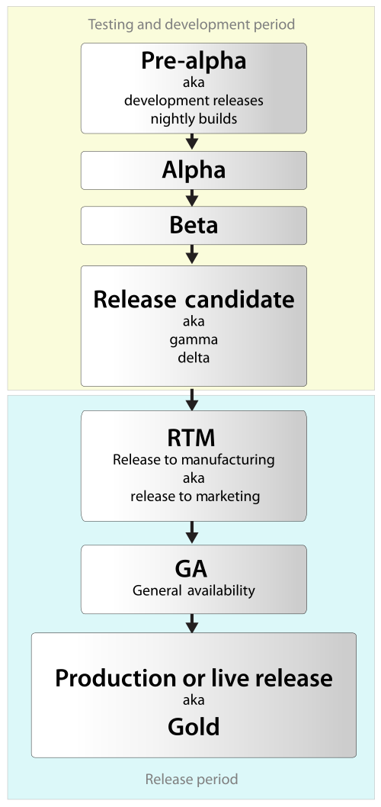
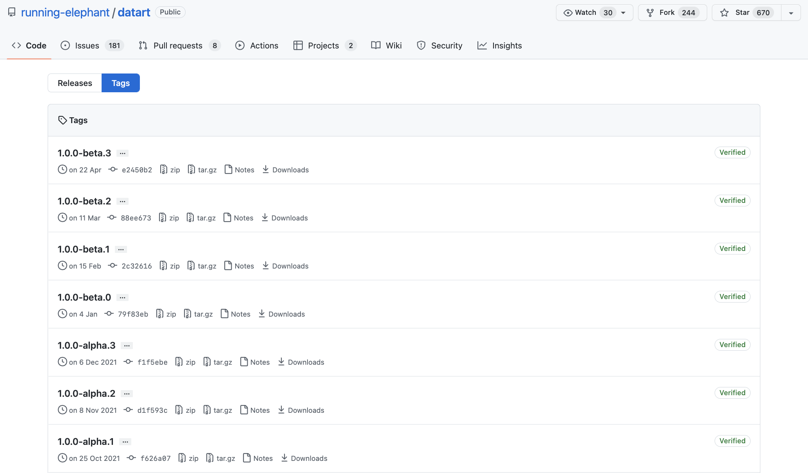
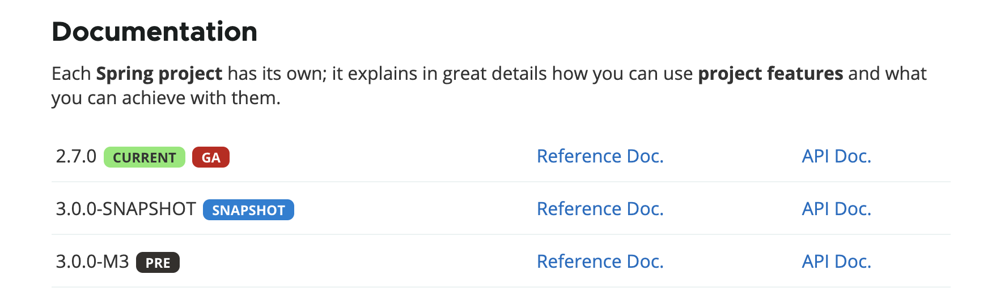

# 软件版本周期

## Pre-alpha

有时候软件会在Alpha或Beta版本前先发布Pre-alpha版本。一般而言相对于Alpha或Beta版本，Pre-alpha版本是一个功能不完整的版本。

## Alpha

Alpha版本仍然需要测试，其功能亦未完善，因为它是整个软件发布周期中的第一个阶段，所以它的名称是`Alpha`，希腊字母中的第一个字母`α`。

## Beta

Beta版本是软件最早对外公开的软件版本，由公司外的第三方开发者和业余玩家等参与公众测试。 

例如某开源软件版本：

## RC

候选版本(Release Candidate)，如果未出现问题则可发布成为正式版本。

## GA

一般可用（General availability）意味着软件被证明是可靠的，可供销售，没有严重的bug，可以用于生产。

例如Spring Boot的GA版本：

## Stable

稳定版本来自预览版本释出使用与改善而修正完成，通常是初始版本进行几个小更新后的版本。

## References

1. 维基百科：[软件版本周期](https://zh.wikipedia.org/zh-cn/%E8%BB%9F%E4%BB%B6%E7%89%88%E6%9C%AC%E9%80%B1%E6%9C%9F)

