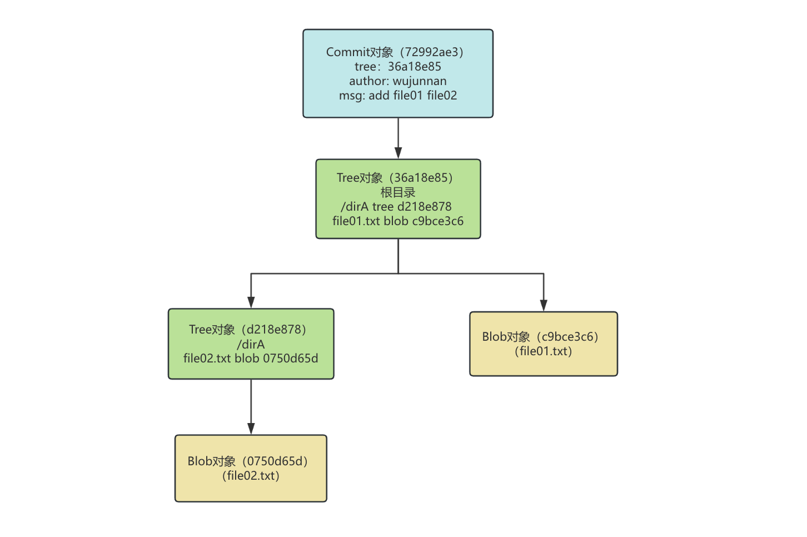
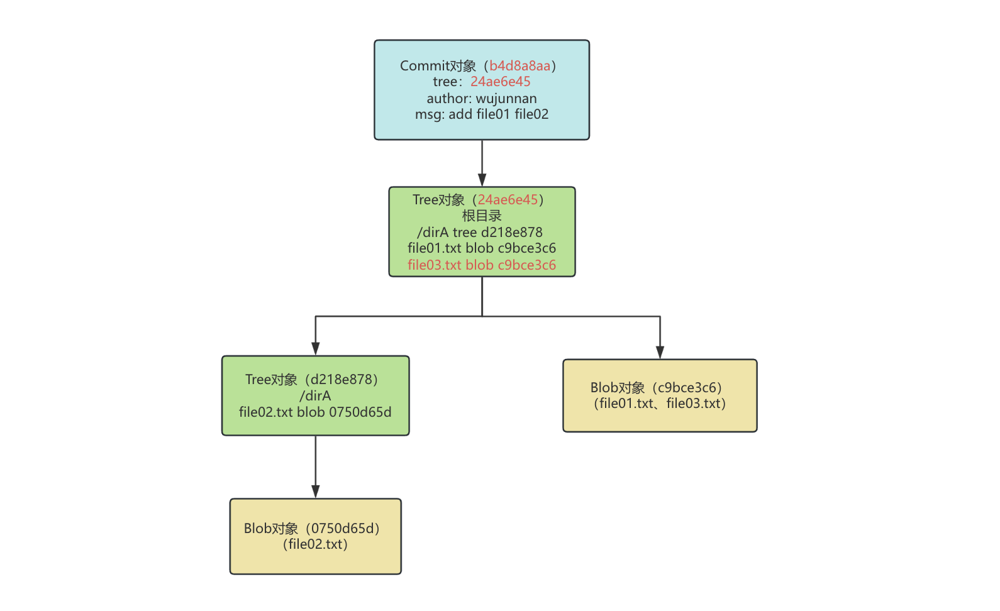
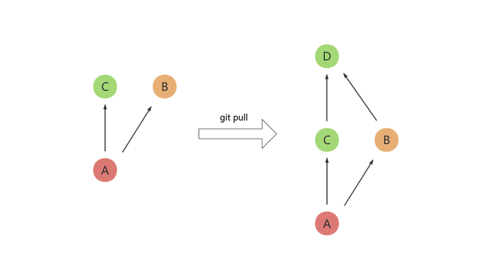
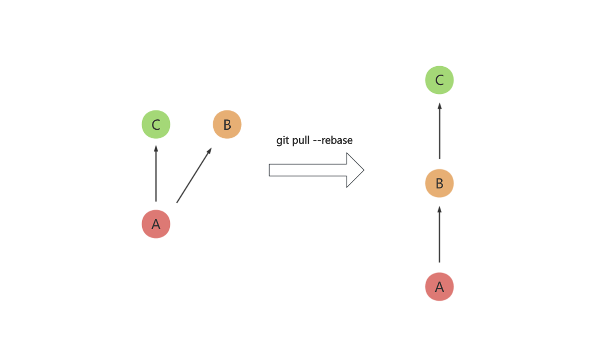
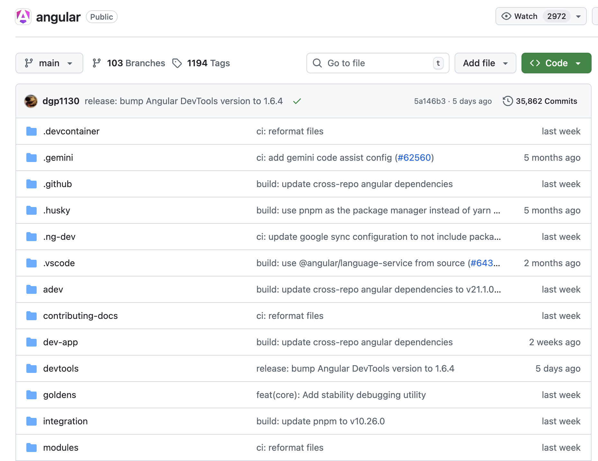

# 深入理解Git与实践

## Git是什么

1991年，当时还是赫尔辛基大学学生的Linus Torvalds对MINIX系统（用于教学的类UNIX系统）的功能限制感到不满，于是决定开发一套适配自己硬件的操作系统，即影响深远的Linux内核。后来Linus采用GNU通用公共许可证（GPL）发布Linux。这使得Linux成为一个允许任何人查看、修改的真正自由软件。

随着互联网的普及，世界各地的开发者都开始为Linux贡献代码，最初，这些开发者将源代码的diff通过邮件发送给Linus，Linus手动合并代码。随着代码量和贡献人数的增长，选择一个源码控制管理系统（SCM）来提升开发效率已经迫在眉睫了。

由于效率低下且速度慢，Linus拒绝使用CVS等集中式的SCM，在2002年2月最终决定采用分布式的BitKeeper来管理Linux内核代码。BitKeeper提供了一个免费的版本给Linux社区开发者使用，同时许可协议规定，使用者不能同时开发其竞争产品。在Linus看来，BitKeeper虽然并非完美，但是比当时其他的SCM领先太多了。

BitKeeper的使用显著提高了Linux的开发效率。然而，社区中有一些人有着对开源的纯粹追求，坚持反对使用非开源的BitKeeper来管理开源的Linux。2005年，澳大利亚开发者 Andrew Tridgell 对 BitKeeper 进行了逆向工程，触犯了其严格的许可协议。尽管 Linus 尝试在 BitKeeper 创始人 Larry McVoy 和 Tridge 之间调解，但双方立场完全是南辕北辙。最终，BitKeeper撤销了对内核开发团队的免费授权。

尽管Linus对SCM并不感兴趣，还是"被迫"开发一款新的SCM工具，经过了大概4个月的构思之后，Linus仅用不到10天，就完成了Git初代版本的开发。后来，随着Ruby on Rails等社区的使用和Git托管平台GitHub的崛起，Git开始被广泛使用，并在诞生20年后的今天，依然在版本管理领域展现出绝对的统治力，成为我们日常使用频次最高的软件之一。

作为一个Git爱好者，接下来让我们一起深入了解下Git的优秀设计。

> *Linus Torvalds 在 2012年的一次演讲中表达对 NVIDIA 的不满，图片来自：[Linus Torvalds: "So NVIDIA, F\*ck you!"](https://www.youtube.com/watch?v=Q4SWxWIOVBM)*。

## Git特点

1. **Git是分布式版本管理系统而不是集中式版本管理系统**

   分布式的特点使得我们本地也是一个完整的版本库，这样我们就可以在离线的状态下执行很多操作，同时还能看到完整的历史版本。而集中式，如Subversion（SVN），几乎所有操作都要保证和中央服务之间网络连接，而且中央数据库一旦丢失，每个人只有本地快照，整个项目的历史记录都没了。

2. **Git存储的是快照，而不是差异**

   许多版本控制系统，例如SVN，存储的是一组文件及这些文件随时间所作出的**变化**，也就是存储的是原文件以及一系列文件的变化。而Git则是存储的快照，当然文件没有发生变化，Git也只是保存一个指向原文件的指针。

3. **轻量到极致的分支**

   多数版本控制系统中，分支都成本高昂，常常需要对整个源码目录复制一遍，而Git的分支则只是一个引用，创建和切换分支非常迅速，Git也鼓励在工作流中频繁使用分支。

## Git原理

下图是Git的仓库模型：


### Git存储的是快照，而不是差异

我们新建一个文件夹，并执行`git init`，我们发现在文件夹的根目录生成了一个`.git`文件夹，这就意味着该文件夹被Git管理，并且有关Git的一切，都在这个文件夹中：

```
$ tree -L 1 .git
.git
├── config
├── description
├── HEAD
├── hooks
├── objects
└── refs
```

其中，config文件包含了项目特定的配置，description仅限于GitWeb程序使用，无需关心，hooks目录中包含了钩子脚本，剩下的四项很重要：HEAD，index文件（还未创建）、objects目录和refs目录，我们后面会提到。

objects文件夹就是存储各种对象的，Git主要提供了以下对象：

- blob对象
- tree对象
- commit对象

其中，blob对象和tree对象定义了文件树。

我们在工作目录下添加如下文件：

```
$ echo "file01 version1" > file01.txt
$ mkdir dirA
$ echo "file02 version1" > dirA/file02.txt
$ tree -L 2  .
.
├── dirA
│   └── file02.txt
└── file01.txt
```

将这些文件添加到暂存区：

```
$ git add .
```

然后查看`.git/objects`目录：

```
$ tree -L 3 .git/objects
.git/objects
├── 07
│   └── 50d65db473257b0cf510d98b0a86a39628114f
├── c9
│   └── bce3c65c7459bb2f1d56aed6b1e91ac071b9c2
├── info
└── pack
```

其中每种对象都会生成一个长度为40的SHA-1散列值，**Git通过散列值来查找对应的对象，而不是文件名**，该散列值将作为对象的文件名存储在objects文件夹中（散列值的前两位是单独的文件夹）

其中blob、tree、commit对象的内容都是二进制形式的，无法直接使用cat查看，需要`git cat-file`的指令来查看：

```
$ git cat-file -t 0750d65db473257b0cf510d98b0a86a39628114f
blob
$ git cat-file -p 0750d65db473257b0cf510d98b0a86a39628114f
file02 version1

$ git cat-file -t c9bce3c65c7459bb2f1d56aed6b1e91ac071b9c2
blob
$ git cat-file -p c9bce3c65c7459bb2f1d56aed6b1e91ac071b9c2
file01 version1
```

我们发现，Git将两个文件都转换成了blob类型的对象存放到了`.git/obects`中。

暂存区Git又是如何表达的呢？Git把上述所有blob对象的散列值，存在`.git/index`文件中，**index文件，即我们所说的暂存区**，通过如下命令可以查看`.git/index`中的内容：

```
$ git ls-files -s
100644 0750d65db473257b0cf510d98b0a86a39628114f 0   dirA/file02.txt
100644 c9bce3c65c7459bb2f1d56aed6b1e91ac071b9c2 0   file01.txt
```

接下来，我们提交变更：

```
$ git commit -m 'add file01 file02'
```

再次查看`.git/objects`目录：

```
$ tree -L 3 .git/objects
.git/objects
├── 07
│   └── 50d65db473257b0cf510d98b0a86a39628114f
├── 36
│   └── a18e85c612da8cb95ac16e58d693d42f77390f
├── 72
│   └── 992ae3c1a8c700ee3d1da0c53b7323e2f58643
├── c9
│   └── bce3c65c7459bb2f1d56aed6b1e91ac071b9c2
├── d2
│   └── 18e878d6721ac8934191ac46f4ff90ad24fcfd
├── info
└── pack
```

查看新增的对象：

```
$ git cat-file -t 36a18e85c612da8cb95ac16e58d693d42f77390f
tree
$ git cat-file -p 36a18e85c612da8cb95ac16e58d693d42f77390f
040000 tree d218e878d6721ac8934191ac46f4ff90ad24fcfd    dirA
100644 blob c9bce3c65c7459bb2f1d56aed6b1e91ac071b9c2    file01.txt

$ git cat-file -t d218e878d6721ac8934191ac46f4ff90ad24fcfd
tree
$ git cat-file -p d218e878d6721ac8934191ac46f4ff90ad24fcfd
100644 blob 0750d65db473257b0cf510d98b0a86a39628114f    file02.txt
```

可以看到，commit后新增了两个tree对象：

- 36a18e85是项目根目录，里面记录了根目录下的对象，即dirA Tree对象和file01.txt blob对象
- d218e878则是dirA目录，里面记录了file02.txt blob对象

其中，100644/040000为文件模式，100644表示这是个普通文件，040000表示这是一个普通目录

```
$ git cat-file -t 72992ae3c1a8c700ee3d1da0c53b7323e2f58643
commit
$ git cat-file -p 72992ae3c1a8c700ee3d1da0c53b7323e2f58643
tree 36a18e85c612da8cb95ac16e58d693d42f77390f
author wujunnan <xxxx@outlook.com> 1766315458 +0800
committer wujunnan <xxxx@outlook.com> 1766315458 +0800

add file01 file02
```

还新增了一个commit对象，其中：

- tree代表提交此刻项目**根目录的tree对象**的散列值
- parent为父commit的散列值（第一个commit没有父commit）
- author/committer是作者、提交者信息
- add file01 file02为commit message

以上三种对象就可以实现对一次提交的描述，并且可以还原出整个目录，步骤如下：

1. 通过散列值找到对应的commit对象
2. 从commit对象中找到对应的根目录tree对象
3. 从根目录tree对象找到根目录下的blob对象和tree对象，blob对象是二进制的，通过解析后还原出原文件，tree对象则继续重复此步骤，从而递归的解析出整个工作目录

示意图如下：



通过以上部分，你应该已经理解，Git一次提交存储的是**快照**，而不是差异，一个commit节点即可还原出整个目录。

### 高效存储

上面我们提到，Git一次提交存储的是快照，而不是差异，那很容易产生这样的疑惑：每次提交都要存储全量快照吗，那一个项目动辄成百上千个commit，那得存储多少文件？

所以接下来，我们看下Git是如何高效存储的。

**相同数据只存储一次**

Git对于相同的文件内容，只会存储一次，例如我们再在项目根目录下新建一个文件file03.txt，保证和file01.txt文件内容相同：

```
$ echo "file01 version1" > file03.txt
$ tree -L 2
.
├── dirA
│   └── file02.txt
├── file01.txt
└── file03.txt
```

分别使用`git hash-object`计算两个文件的散列值，发现file01.txt和file03.txt是同一个blob对象：

```
$ git hash-object file03.txt
c9bce3c65c7459bb2f1d56aed6b1e91ac071b9c2
$ git hash-object file01.txt
c9bce3c65c7459bb2f1d56aed6b1e91ac071b9c2
```

示意图如下：



**压缩相似的内容**

如果我们的改动只有区区几行，Git可以采用增量的方法来存储这些文件，执行`git gc`命令，不仅会清理无用的对象，还会将松散的对象（`.git/objects`下的）进行压缩，存储`.git/objects/pack`中。

在新增上面的file03.txt之前，我们查看过`.git/objects`下的文件：

```
$ tree -L 3 .git/objects
.git/objects
├── 07
│   └── 50d65db473257b0cf510d98b0a86a39628114f
├── 36
│   └── a18e85c612da8cb95ac16e58d693d42f77390f
├── 72
│   └── 992ae3c1a8c700ee3d1da0c53b7323e2f58643
├── c9
│   └── bce3c65c7459bb2f1d56aed6b1e91ac071b9c2
├── d2
│   └── 18e878d6721ac8934191ac46f4ff90ad24fcfd
├── info
└── pack
```

新增file03.txt之后，`.git/objects`下的文件如下，新增两个对象，分别是一个commit对象和一个根目录Tree对象：

```
$ tree -L 3 .git/objects
.git/objects
├── 07
│   └── 50d65db473257b0cf510d98b0a86a39628114f
├── 24
│   └── ae6e45993f3e2c99fbec1b1a5e9cbf183f429c
├── 36
│   └── a18e85c612da8cb95ac16e58d693d42f77390f
├── 72
│   └── 992ae3c1a8c700ee3d1da0c53b7323e2f58643
├── b4
│   └── d8a8aa4a2f19abe2a908bbc805efb3f919bf50
├── c9
│   └── bce3c65c7459bb2f1d56aed6b1e91ac071b9c2
├── d2
│   └── 18e878d6721ac8934191ac46f4ff90ad24fcfd
├── info
└── pack
```

执行完`git gc`之后，如下：

```
$ git gc
Enumerating objects: 7, done.
Counting objects: 100% (7/7), done.
Delta compression using up to 8 threads
Compressing objects: 100% (4/4), done.
Writing objects: 100% (7/7), done.
Total 7 (delta 1), reused 0 (delta 0), pack-reused 0

$ tree -L 3 .git/objects
.git/objects
├── info
│   ├── commit-graph
│   └── packs
└── pack
    ├── pack-f44a882a5238fda1e50dda6c4fafe10fef05c200.idx
    └── pack-f44a882a5238fda1e50dda6c4fafe10fef05c200.pack
```

当然我们不必手动执行`git gc`，Git会在特定场景下自动触发。

### 轻量到极致的分支

我们可以通过一个commit节点的散列值来复原整个工作区，但是，我们不可能去记忆这长达40位的散列值，Git的分支和标签存储了某次提交（commit对象）的散列值，例如，我们找到了master分支，就找到了master分支对应的commit对象，之后Git就可以通过上述步骤还原出整个工作区，标签同理。

标签和分支就存储在`.git/refs`文件夹中，如下：

```
$ git checkout -b feature/a
Switched to a new branch 'feature/a'
$ git tag v0.0.1
$ tree -L 3 .git/refs
.git/refs
├── heads
│   └── feature
│       └── a
└── tags
    └── v0.0.1
```

其中：

- heads指的就是我们本地的分支
- tags即为我们本地的标签

可以看到，这些**分支或标签里面存储的仅仅是某次提交的散列值**：

```
$ cat .git/refs/heads/feature/a
b4d8a8aa4a2f19abe2a908bbc805efb3f919bf50
$ cat .git/refs/tags/v0.0.1
b4d8a8aa4a2f19abe2a908bbc805efb3f919bf50
```

远程分支也同样存储在`.git/refs`中，我们在Github新建一个仓库，然后将本地的仓库进行push：

```
$ git checkout -b master
Switched to a new branch 'master'
$ git remote add origin git@github.com:junnanwu/git_demo.git
$ git push -u origin master
```

可以看到，remotes里面即是我们的远程分支：

```
$ tree -L 3 .git/refs
.git/refs
├── heads
│   ├── feature
│   │   └── a
│   └── master
├── remotes
│   └── origin
│       └── master
└── tags
    └── v0.0.1
```

Git是如何知道我们当前是哪个分支的呢？答案是通过`.git/HEAD`文件，HEAD文件里面记录我们当前所在的分支：

```
$ cat .git/HEAD
ref: refs/heads/master
```

HEAD里面也可以存储某个commit的散列值，此时即为HEAD分离状态，执行`git checkout <hash|tag>`切换到某个标签或commit节点即会进入HEAD分离状态。

另外，我们执行`git checkout branch`切换分支的时候，实际上就是修改了.git/HEAD文件，将其修改为我们要切换的目标分支，也就是对应的commit对象。

怎么样，新建、切换分支够轻量级吧？

Git的设计让人感觉非常舒适，简单且高效。

接下来我们看一些工作中的Git实践。

## Git工作实践

### 正确理解Origin

之前我们有个需求，需要在香港搭一套新的环境，一些同事不太理解如何将大陆环境的代码同步到香港环境，反而在手动复制代码，其实理解了origin是什么，这个问题也就迎刃而解了。

其实刚刚我们在执行`git remote`命令的时候，就定义了origin：

```
$ git remote add origin git@github.com:junnanwu/git_demo.git
```

git remote完整命令格式如下：

```
git remote add <name> <url>
```

含义是添加一个远程仓库，并给它一个简短的名字，例如origin。也就是说，origin只是一个代号，代指远程仓库。

那我们再给我们的项目添加一个远程仓库，在gitee上新建一个远程仓库，然后执行下面的命令，即可定义一个名字叫gitee的远程仓库：

```
$ git remote add gitee https://gitee.com/mrwujunnan/git_demo.git
$ git push -u gitee master
```

查看我们配置的远程仓库：

```
$ git remote -v
gitee   https://gitee.com/mrwujunnan/git_demo.git (fetch)
gitee   https://gitee.com/mrwujunnan/git_demo.git (push)
origin  git@github.com:junnanwu/git_demo.git (fetch)
origin  git@github.com:junnanwu/git_demo.git (push)
```

再次查看`.git/refs`

```
$ tree -L 3 .git/refs
.git/refs
├── heads
│   ├── feature
│   │   └── a
│   └── master
├── remotes
│   ├── gitee
│   │   └── master
│   └── origin
│       └── master
└── tags
    └── v0.0.1
```

当我们想拉取gitee仓库的内容的时候，我们可以执行如下命令：

```
$ git pull gitee
```

回到上面的需求，对于香港项目来说，origin对应了香港的远程仓库，gitee对应的不就是大陆环境的远程仓库嘛，配合`git cherry-pick`获取你想要的功能即可。

### 更简洁的Commit历史

之前有同事，上线一个功能，好家伙，连续十几个commit，而且message都是：“提交代码”...  当我们想从Git log中寻找历史变更的时候，该去哪个commit里面找呢？

一个有追求的开发者应该保持简洁的commit历史和commit message。

接下来我会分享三种常用的技巧来使得我们的commit历史更简洁。

**`git commit --amend`**

相信在实际开发中，常有这样的场景：写一个功能接口，提交了commit，突然发现Java代码有一个import导入没有用到，作为强迫症的我们肯定不能接受，删除无用import语句之后，再次提交相同的commit，这就造成了冗余的commit。

我们可以使用如下命令，将本次修改合并到前一个commit：

```
$ git commit --amend
```

该命令会删除前一次的commit，然后再创建一个新的commit，相当于git reset + git commit。

那如前面有多个冗余的commit，如下面的情况（前三个commit是冗余的），那该怎么办呢？

```
* cc2b3d3 - (HEAD -> feature) add t3
* 59361e9 - add t2
* f7e2acd - add t1
* 139199a - base
```

**`git rebase -i`**

这个时候，可以使用git rebase交互模式：

```
$ git rebase -i 139199a
```

将弹出的交互式窗口的内容修改为下（即将后面两个节点前的pick修改为`squash`或`s`）：

> s, squash <commit> = use commit, but meld into previous commit.

```
pick d20150f add t1
squash 59361e9 add t2
squash cc2b3d3 add t3
```

然后再调整合并后的message信息，最后，三个commit即会被合并为一个（rebase会生成新的节点，即b6f2233）：

```
* b6f2233 - (HEAD -> feature) add t1、t2、t3
* 139199a - base
```

**`git pull --rebase`**

另外，还有一种常见的场景：小张、小李都基于同一分支进行开发，假设当前最新的提交是A，小张先开发完毕，提交B，并push到远程仓库，小李后开发完毕，提交C，这个时候，当小李进行push的时候，由于远程仓库有比本地分支更新的内容，所以会远程仓库会拒绝push。

此时，我们会执行git pull，将远程更新的内容拉到本地，然后再执行git push，这次push成功了，但是我们查看git历史，会发现多了一个merge节点D：



但是，如果我们执行`git pull --rebase`，那么就会将C的base修改为B，我们就会得到一个简洁的提交历史（此C已经非彼C了，是一个新的commit）：



所以，请用`git pull --rebase`代替`git pull`操作。

上面我们提到了三个技巧来让我们的Git提交记录更简洁，但是值得注意的是，这些操作都会修改提交历史，假如你修改了其他同事的历史提交，然后`git push --force`，你的同事`git pull`之后，代码就可能丢失。所以，请熟练掌握后再使用这些命令，另外，切记：

**不要修改远程仓库公共分支的commit！不要修改远程仓库公共分支的commit！不要修改远程仓库公共分支的commit！**

上面三个操作，在多数IDE，例如IDEA中，都有对应的图形化操作，可自行搜索。

### 更简洁的Commit Message

commit message是给人看的，如果每次提交都写"提交代码"，那以后寻找历史变更将是一个灾难。

[Angular](https://github.com/angular/angular)团队的Git commit message规范是比较流行的，如下图：



参考：[Git Commit Guidelines](https://github.com/angular/angular.js/blob/master/DEVELOPERS.md#-git-commit-guidelines)，具体格式如下：

```
<type>(<scope>): <subject>
<BLANK LINE>
<body>
<BLANK LINE>
<footer>
```

但是上述格式较为复杂，通过简化，我们可以按照如下规范提交：

```
<type>(<scope>): <subject>
```

- `<type>`为提交类型

  - feat：新功能
  - fix：修复
  - style：格式（不影响代码运行的改动）
  - refactor：重构
  - test：测试
  - perf：优化

- `<scope>`为影响范围，可选，多个的话用`*`表示

  例如在 Angular，可以是 location，browser，compile；

  后端可以是Controller、Mapper、Config

- `<subject>`为commit的简短的描述，不超过50字符，结尾不要加标点，统一使用中文

例如：

```
feat:用户查询接口开发
fix(DAO):修复用户查询未判空
feat(Config):增加鉴权相关配置
```

按照此规范以后，我们应该一次commit专门做一件事情，不应该把乱七八糟的东西都塞到一个commit中。

### Git分支模型

Git允许我们使用各种各样的分支模型来进行协作，并没有标准答案，满足需求即可。

一般需求有：

- 多版本并行开发
- 支持代码review
- 方便的版本回滚
- 上线内容不丢失

这里分享一种常见的Git分支模型：

1. master作为稳定代码分支，所有分支从该分支上拉取，同时也为保护分支，仅允许release分支合入
2. 每次新开发一个版本需要从master拉一个新的release分支，格式为`release/v(year).(month).(major).(minor)`（区分产品的版本），例如，第一年的10月的第一个版本：`release/v1.10.1`，该版本后的第一个修复小版本：`release/v1.10.1.1`

3. 每个开发开发人员从master拉一个feat分支开发新功能
4. 开发完毕后，在代码仓库平台提MR（Merge Review）到对应的release分支，其中master和release分支为保护分支，不允许私自push
5. 被邀请MR的同学review过代码之后，没问题点approve，有问题的话进行comment，大部分reviewer通过之后，merge入release分支
6. 所有同学的开发分支都合入release分支后，可以依次在测试环境发布进行测试
7. 如果测试出现问题，那么从master拉出bugfix分支进行修复（或者在原本的feat分支上修复），然后重新PR合入release
8. 测试无误后，生产环境发布该release分支
9. 发版后续操作：

   - 打对应tag，格式同上，例如：`v1.10.1`
   - 将该release合入master稳定分支
   - 将该release合入还未发布的高版本release分支，防止该release版本内容丢失
10. 如果发版后出现紧急bug，从master上拉取hotfix分支进行修复、发版

示意图如下：


## 总结

本文介绍了如下内容：

- Git具备分布式、存储快照、轻量分支的特点
- Git可以通过blob、commit和tree三种对象还原出整个工作目录
- Git的分支和标签即为commit的引用，非常轻量级
- origin就是默认远程仓库的代号，很多命令默认的远程仓库就是origin，所以可以省略，可以有多个远程仓库，也可以叫任意代号
- 可以通过`git commit --amend`、`git rebase -i`、`git pull --rebase`来使得我们的提交历史更简洁，但要切记：不要修改远程仓库公共分支的commit！
- Git要有规范的commit message，要有足够的信息量，同时格式又统一、简洁
- 最后介绍了一种常见的分支模型，可满足日常需求

## References

- [Linux历史](https://zh.wikipedia.org/wiki/Linux%E5%8E%86%E5%8F%B2)
- [BitKeeper与Linux，git史前琐事](http://www.path8.net/tn/archives/6039)
- [「人物志-Linus Torvalds」Git 诞生二十周年访谈](https://linguista.bearblog.dev/linus-torvalds-git20/)
- [Linus Torvalds: "So Nvidia, F*ck you!"](https://www.youtube.com/watch?v=Q4SWxWIOVBM)

- [《精通Git》第二版](https://book.douban.com/subject/27133267/)，作者：Scott Chacon、Ben Straub
- [《Git学习指南》](https://book.douban.com/subject/26967729/)，作者：René Preißel、Bjørn Stachmann
- [Git-深入一点点](https://github.com/Val-Zhang/blogs/issues/9)
- [Git Commit Guidelines](https://github.com/angular/angular.js/blob/master/DEVELOPERS.md#-git-commit-guidelines)