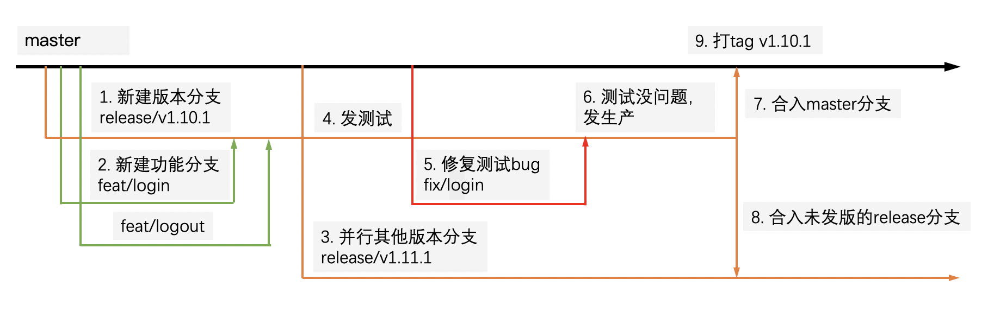

# 系列分享一：优秀的版本控制系统——Git

## Git是什么

2005年4月，Linux内核开发者社区和BitKeeper公司关系破裂，同时Linux之父，Linus Torvalds也不满当时任何一个可用的开源版本控制系统，就亲自着手实现了Git，一个分布式版本控制系统。Git一经推出就大受推崇，至今仍是最受欢迎的版本控制系统。

非常有个性的Linus Torvalds（图片来自：[Linux's Linus Torvalds: Sorry for Being a Jerk](https://www.pcmag.com/news/linuxs-linus-torvalds-sorry-for-being-a-jerk)）：


## Git特点

1. Git是**分布式**版本管理系统而不是集中式版本管理系统

   分布式的特点使得我们本地也是一个完整的版本库，这样我们就可以在离线的状态下执行很多操作，同时还能看到完整的历史版本。

   而集中式，如Subversion（SVN），几乎所有操作都要保证和中央服务之间网络连接，而且中央数据库一旦丢失，每个人只有本地快照，整个项目的历史记录都没了。

2. Git存储的是**快照**，而不是差异

   许多版本控制系统，例如SVN，存储的是一组文件及这些文件随时间所作出的**变化**，也就是存储的是原文件以及一系列文件的变化。而Git则是存储的快照，当然文件没有发生变化，Git也只是保存一个指向原文件的指针。

3. 轻量到极致的分支

   多数版本控制系统中，分支都成本高昂，常常需要对整个源码目录复制一遍，而Git的分支则只是一个引用，创建和切换分支非常迅速，Git也鼓励在工作流中频繁使用分支。

## Git原理

讲述原理之前，我们先看看下Git的仓库模型：


### Git存储的是快照，而不是差异

当你想将当前项目交给Git管理，你可以执行`git init`，之后Git就会在项目根目录生成一个`.git`文件夹，Git所有的操作都与这个文件夹相关，下面是这个文件夹的主要目录和文件：

```
.git
├── HEAD
├── index
├── objects
└── refs
```

objects文件夹中包含了三种对象：二进制对象、tree对象和commit对象，其中每种对象都会生成一个长度为40的SHA-1散列值，**Git通过散列值来查找对应的对象，而不是文件名**，该散列值将作为对象的文件名存储在objects文件夹中（散列值的前两位是单独的文件夹）：

```
$ tree -L 3 .git/objects
├── 12
│   └── 3206c8e577fb0bd6a9d0c237be25c963a6d292
├── 1d
│   ├── 8e5a152a5f756125f67e94a91e53282f422915
│   └── a6553719781d919ee160b45111c17cf4cff07d
...
```

其中三对象的内容都是二进制形式的，无法直接使用cat查看，需要Git的指令来查看，下面分别介绍三种对象：

- blob对象

  二进制文件，即普通文件压缩后的二进制形式，可以通过如下命令来查看：

  ```
  $ git cat-file -p e69de2
  123
  ```

  其中：

  - e69de2是该对象的散列值的前缀，Git会通过前缀来查找完整的散列值
  - 123即为文件的内容

- tree对象

  树对象，里面存储了目录内其他子树对象和blob对象的散列值。

  例如，目录A下有一个file.txt文件和一个dir目录，那么这个目录A对应的树对象如下，我们可以通过如下命令来查看：

  ```
  $ git ls-tree bb4a86
  100644 blob ac57ce24250466b44d8c48058290ac6a177b90d6	file.txt
  040000 tree dccea6a66df035ac506ab8ca6d2735f9b64f66c1	dir
  ```

  其中：

  - 100644/040000为文件模式，100644表示这是个普通文件，040000表示这是一个普通目录
  - blob为二进制对象、tree为树对象
  - ac57ce24250466b44d8c48058290ac6a177b90d6为散列值
  - file.txt/dir为文件名、目录名

- commit对象

  提交对象，我们可以通过如下命令来查看一个commit的构成：
  
  ```
  $ git cat-file -p 20371f4
  tree ff9ed01e8344509b26900428679fb25c3e190dda
  parent 139199a0f7051ff45162f65870d4ff78bc116f99
  author wujunnan <wujunnan@kungeek.com> 1656068060 +0800
  committer wujunnan <wujunnan@kungeek.com> 1656071772 +0800
  
  add t1\2\3
  ```
  
  其中：
  
  - tree代表提交此刻项目**根目录的tree对象**的散列值
  - parent为父commit的散列值
  - author/committer是作者、提交者信息
  - add t1\2\3 为commit message

**以上三种对象就可以实现对一次项目快照提交的描述**。

首先我们执行`git add`，该命令会将变化的文件从工作区添加到暂存区，具体如下：

1. 把所有变化的**文件**（不包括文件目录）生成新的blob对象，存储在.git/objects文件夹中，当然第一次提交的话，指的就是项目中的所有文件。
2. 把上述所有blob对象的散列值，存在.git/index文件中，**index文件，即我们所说的暂存区**

通过如下命令可以查看`.git/index`中的内容：

```
$ git ls-files -s
100644 ac57ce24250466b44d8c48058290ac6a177b90d6 0	.gitignore
100644 e69de29bb2d1d6434b8b29ae775ad8c2e48c5391 0	123
```

然后我们执行`git commit`，该命令会将暂存区跟踪的文件记录到当前分支（HEAD），具体操作如下：

1. 将所有变化的文件目录，创建tree对象，存储在.git/objects文件夹中（当你修改了一个文件的时候，从它的上级目录至项目的根目录都会被修改）
2. 新建commit对象，里面包括了根目录的tree对象散列值、作者信息、提交信息

这样以来，**我们只要知道一次提交的散列值，就能还原出完整的工作目录**，步骤如下：

1. 通过散列值找到对应的commit对象
2. 从commit对象中找到对应的根目录tree对象
3. 从根目录tree对象找到根目录下的blob对象和tree对象，blob对象是二进制的，通过解析后还原出原文件，tree对象则继续重复次步骤，从而递归的解析出整个工作目录

通过以上部分，你应该已经理解，Git存储的是**快照**，而不是差异。

### 轻量到极致的分支

当然，我们不可能去记忆这长达40位的散列值，Git的分支和标签存储了某次提交（commit对象）的散列值，例如，我们找到了master分支，就找到了master分支对应的commit对象，之后Git就可以通过上述步骤还原出整个工作区，标签同理。

标签和分支就存储在`.git/refs`文件夹中，某个项目的`.git/refs`文件夹下部分内容如下：

```
refs
├── heads
│   ├── develop
│   ├── feature
│   │   └── HDATA-1197
│   └── master
├── remotes
│   ├── origin
│   │   ├── master
│   │   ├── develop
│   │   ├── ...
└── tags
    ├── v1.0.1
    └── v1.0.2
```

其中：

- heads指的就是我们本地的分支
- remotes指的是远程仓库的分支
- tags即为我们本地的分支

再重复一次，这些**分支或标签里面存储的仅仅是某次提交的散列值**：

```
$ cat .git/refs/heads/feature/HDATA-279
18bb23ccdf5d05929e749e250f57ab412a826d36
```

Git是如何知道我们当前是哪个分支的呢？答案是通过`.git/HEAD`文件，HEAD文件里面记录我们当前所在的分支：

```
$ cat .git/HEAD
ref: refs/heads/master
```

HEAD里面也可以存储某个commit的散列值，此时即为HEAD分离状态，执行`git checkout <hash|tag>`切换到某个标签或commit节点即会进入HEAD分离状态。

我们执行`git checkout BRANCH`切换分支的时候，实际上就是修改了`.git/HEAD`文件，将其修改为我们要切换的目标分支，也就是对应的commit对象。

## Git常见操作

以下是我们日常经常使用的Git操作。

- 拉取远程仓库

  ```
  $ git clone https://xxx
  ```

- 拉取本地分支对应的远程分支并合并到本地分支中

  ```
  $ git pull
  ```

- 把已经跟踪的文件添加到暂存区并提交（跳过git add）

  ```
  $ git commit -a
  ```

- 提换前一次提交

  ```
  $ git commit --amend
  ```

- 创建并切换到新分支test

  ```
  $ git checkout -b test
  ```

- 将a.txt文件从暂存区删除，但是并不删除工作区（本地保存文件，但是不让Git管理）

  ```
  $ git rm --cached a.txt
  ```

- 将master分支合并到当前分支

  ```
  $ git merge master
  ```

- 将本地分支推送到对应的远程分支

  ```
  $ git push
  ```

- 给当前分支打标签并推到远程

  ```
  $ git tag v1.0
  $ git push –-tags
  ```

- 回退到上个版本（工作区不动）

  ```
  $ git reset HEAD^
  ```

- 丢弃本地暂存区和工作区的修改（危险）

  ```
  # . 意味着还原所有文件，也可以替换为某个文件名，还原某个特定文件
  $ git checkout .
  ```

- 查看远程主机名及地址

  ```
  $ git remote -v
  ```

## Git进阶

此部分讲解下Git日常使用中容易产生困惑的点。

### git pull与跟踪分支

`git pull`是我们常用到的一个命令，有必要完整了解下这个命令。

完整命令格式如下：

```
git pull <远程主机名> <远程分支名>:<本地分支名>
```

当我们执行`git clone`的时候，默认情况下，Git会把我们clone的源仓库起名为origin。

所以当我们需要取回`origin`主机的`next`分支，与本地的`master`分支合并：

```
$ git pull origin next:master
```

如果本地当前分支就是master，那么本地分支名则可以省略：

```
$ git pull origin next
```

上面命令表示，取回`origin/next`分支，再与当前分支合并。实质上，这等同于先做`git fetch`，再做`git merge`：

```
$ git fetch origin
$ git merge origin/next
```

如果当前分支是远程分支的跟踪分支，`git pull`还可以省略远程分支名：

```
$ git pull origin
```

如果当前分支只有一个上游分支，连远程主机名都可以省略，即我们最常用的命令之一：

```
$ git pull
```

所以`git pull`的语义就是先拉取当前分支（如master）的上游分支（如origin/master），然后将上游分支合并到当前分支。

**git push**

前面讲解了git pull命令是如何简化的，git push也是一样的，其完整命令如下：

```
git push <远程主机名> <本地分支名>:<远程分支名>
```

同样的，git push含义就是将当前分支推送唯一的上游分支。

**那么上面提到的跟踪分支是什么？**

当我们本地新建一个远程仓库不存在的分支的时候，`git push`的时候会失败，提示如下（本地分支名为te st）：

>fatal: The current branch test has no upstream branch.
>To push the current branch and set the remote as upstream, use:
>
>git push --set-upstream origin test
>
>——[Git Branching - Remote Branches](https://git-scm.com/book/en/v2/Git-Branching-Remote-Branches)

这就意味着当前分支没有跟踪分支，所以无法使用简化命令。

跟踪分支（tracking branch）是与远程分支直接关联的本地分支，对应的远程分支也叫做上游分支（upstream branch），方便`git push`和`git pull`进行操作。

我们可以通过如下命令来查看已有的跟踪分支：

```
$ git branch -vv
```

创建跟踪分支的几种方式：

1. 当我们执行`git clone`的时候，Git默认会自动会创建跟踪着远程origin/master分支的本地master分支

2. 我们执行`git checkout BRANCH`命令的时候并且分支名和远程分支名一致的时候，Git会帮你创建跟踪分支

3. 当远程分支存在，也可以通过如下方式创建跟踪关系：

   ```
   $ git branch --set-upstream-to origin/test
   ```

   上述命令意味着将远程分支`origin/test`设置为当前分支的上游分支，也可以使用`-u`参数：

   ```
   $ git branch -u origin/test
   ```

4. 当远程分支不存在的时候，我们可以使用如下命令：

   ```
   $ git push --set-upstream origin test
   ```

   上述命令意味着在远程创建test分支并设置成本地test分支的远程分支。

### HEAD~是什么

我们都知道，Linux目录是分相对引用和绝对引用的，那么Git中也是这样的，Git中的绝对引用即是对应的commit值，或者分支和标签，有时候我们想回退到上一次提交，那么这时候，相对引用就很有用了。

Git相对引用有两种形式：`~`和`^`：

- `~2`意味着**前两层**的父提交，如果有多个，则选择第一个父提交
- `^2`意味着**前一层**（一个`^`即为一层）的**第二个**（按照时间顺序）父提交，当有多个父提交的时候，就需要使用`^`来指定是哪一个父提交了

也可以组合着使用，如`HEAD~2^3`代表当前提交（HEAD）前两层的第三个提交。

[示意图](https://git-scm.com/docs/git-rev-parse#_specifying_revisions)如下（其中A是最新提交的）：

```
D  E   F
 \ | / | 
  \|/  |
   B   C
    \ /
     A
```

```
A =      = A^0
B = A^   = A^1     = A~1
C = A^2
D = A^^  = A^1^1   = A~2
E = B^2  = A^^2
F = B^3  = A^^3
```

详细的区别可以参考这里：[What's the difference between HEAD^ and HEAD~ in Git?](https://stackoverflow.com/questions/2221658/whats-the-difference-between-head-and-head-in-git)。

当然，多数情况下我们使用`~`即可，如回退到前一次提交：

```
$ git reset HEAD~
```

## 更简洁的Commit Message

Angular团队的Git Commit Message规范是比较流行的，参考：[Git Commit Guidelines](https://github.com/angular/angular.js/blob/master/DEVELOPERS.md#-git-commit-guidelines)，格式如下：

```
<type>(<scope>): <subject>
<BLANK LINE>
<body>
<BLANK LINE>
<footer>
```

但是上述格式较为复杂，通过简化，我们可以按照如下规范提交：

```
<type>(<scope>): <subject>
```

- `<type>`为提交类型

  - feat：新功能
  - fix：修复
  - style：格式（不影响代码运行的改动）
  - refactor：重构
  - test：测试
  - perf：优化

- `<scope>`为影响范围，可选，多个的话用`*`表示

  例如在 Angular，可以是 location，browser，compile；

  后端可以是Controller、Mapper、Config

- `<subject>`为commit的简短的描述，不超过50字符，结尾不要加标点，统一使用中文

例如：

```
feat(Controller):用户查询接口开发
fix(DAO):修复用户查询未判空
feat(Config):增加鉴权相关配置
```

按照此规范以后，我们应该一次commit专门做一件事情，不应该把乱七八糟的东西都塞到一个commit中。

## 更简洁的Commit历史

通常我们会有如下场景：

写一个功能接口，提交了commit，突然发现Java代码有一个import导入没有用到，作为强迫症的我们肯定不能接受，删除无用import语句之后，再次提交相同的commit，这就造成了冗余的commit，甚至有时候会发现有五六个连续相同的commit，这种情况下，完全可以将这么多个commit合并为一个。

当我们想将本次修改合并到**前一个commit**的时候，我们可以使用如下命令：

```
$ git commit --amend
```

该命令会删除前一次的commit，然后再创建一个新的commit，相当于git reset + git commit。

那如前面有多个冗余的commit，如下面的情况（前三个commit是冗余的），那该怎么办呢？

```
* cc2b3d3 - (HEAD -> feature) add t3
* 59361e9 - add t2
* f7e2acd - add t1
* 139199a - base
```

这个时候，可以使用使用git rebase交互模式：

```
$ git rebase -i head~3
```

将弹出的交互式窗口的内容修改为下（即将后面两个节点前的pick修改为`squash`或`s`）：

> s, squash <commit> = use commit, but meld into previous commit.

```
pick d20150f add t1
squash 59361e9 add t2
squash cc2b3d3 add t3
```

然后再调整合并后的message信息，最后，三个commit即会被合并为一个（rebase会生成新的节点，即b6f2233）：

```
* b6f2233 - (HEAD -> feature) add t1、t2、t3
* 139199a - base
```

## Git分支模型规范

Git允许我们使用各种各样的分支模型来进行协作，并没有标准答案，满足需求即可。

我们的需求有：

- 多版本并行开发
- 能够支持代码review
- 方便的版本回滚
- 版本号递增
- 版本内容不丢失

这里分享一下我之前使用的Git分支模型规范：

1. master作为稳定代码分支，所有分支从该分支上拉取，同时也为保护分支，仅允许release分支合入

2. 每次新开发一个版本需要从master拉一个新的release分支，格式为`release/v(year).(month).(major).(minor)`

   例如，第一年的10月的第一个版本：`release/v1.10.1`，该版本后的第一个修复小版本：`release/v1.10.1.1`

3. 每个开发开发人员需要开发新功能的时候，从master拉一个feat进行开发，修复的话可以使用fix分支，分支名可以按照业务命令

4. 开发完毕后，在代码仓库平台提PR（Pull Review）到对应的release分支，其中master和release分支为保护分支，不允许私自push

5. 被邀请PR的同学review过代码之后，没问题点approve，有问题的话进行comment，大部分reviewer通过之后，merge入release分支，并自动删除原分支

6. 所有同学的开发分支都合入release分支后，可以依次在测试环境发布进行测试

7. 如果测试出现问题，那么从master拉出bugfix分支进行修复，然后重新PR合入release

8. 测试无误后，生产环境发布该release分支

9. 发版后续操作：

   - 打对应tag，格式同上，例如：`v1.10.1`
   - 将该release合入master稳定分支
   - 将该release合入还未发布的高版本release分支，防止该release版本内容丢失
   - 删除该release分支，后续会滚版本可以使用标签

10. 如果发版后出现bug，再新建小版本进行修复、发版

示意图如下：



## 总结

本文介绍了如下内容：

- Git的分布式、存储快照、轻量分支的特点
- Git是可以通过一个Commit散列值 -> Commit对象 -> 根目录对象 -> 文件对象、下级目录对象等，如此就可以原出整个工作目录
- Git的分支和标签即为Commit的引用，非常轻量级
- `git pull`即先通过`git fetch`拉取当前分支对应的上游分支，再通过`git merge`将上游分支合并到本地分支
- Git要有规范的Commit Message，要有足够的信息量，同时格式又统一、简洁
- 可以通过`git commit --amend`和`git rebase -i`来使得我们的提交历史更简洁
- 介绍了我们的分支模型规范，该规范可以实现我们的需求

## References

- 新闻：[Linux's Linus Torvalds: Sorry for Being a Jerk](https://www.pcmag.com/news/linuxs-linus-torvalds-sorry-for-being-a-jerk)
- 书籍：《精通Git》第二版 作者：Scott Chacon、Ben Straub
- 博客：[Git-深入一点点](https://github.com/Val-Zhang/blogs/issues/9)
- 博客：[What's the difference between HEAD^ and HEAD~ in Git?](https://stackoverflow.com/questions/2221658/whats-the-difference-between-head-and-head-in-git)
- 官方文档：[Git Commit Guidelines](https://github.com/angular/angular.js/blob/master/DEVELOPERS.md#-git-commit-guidelines)
- 官方文档：[Git Branching - Remote Branches](https://git-scm.com/book/en/v2/Git-Branching-Remote-Branches)