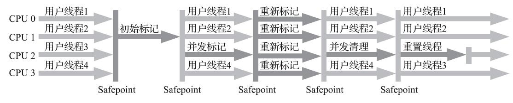

# 系列分享四：GC Promotion Fail问题排查

<!-- START doctoc generated TOC please keep comment here to allow auto update -->
<!-- DON'T EDIT THIS SECTION, INSTEAD RE-RUN doctoc TO UPDATE -->

## 目录

- [系列分享四：GC Promotion Fail问题排查](#%E7%B3%BB%E5%88%97%E5%88%86%E4%BA%AB%E5%9B%9Bgc-promotion-fail%E9%97%AE%E9%A2%98%E6%8E%92%E6%9F%A5)
  - [前言](#%E5%89%8D%E8%A8%80)
    - [传统收集器的内存划分](#%E4%BC%A0%E7%BB%9F%E6%94%B6%E9%9B%86%E5%99%A8%E7%9A%84%E5%86%85%E5%AD%98%E5%88%92%E5%88%86)
    - [CMS收集器](#cms%E6%94%B6%E9%9B%86%E5%99%A8)
    - [CMS收集器的缺点](#cms%E6%94%B6%E9%9B%86%E5%99%A8%E7%9A%84%E7%BC%BA%E7%82%B9)
      - [处理器资源敏感](#%E5%A4%84%E7%90%86%E5%99%A8%E8%B5%84%E6%BA%90%E6%95%8F%E6%84%9F)
      - [无法处理浮动垃圾](#%E6%97%A0%E6%B3%95%E5%A4%84%E7%90%86%E6%B5%AE%E5%8A%A8%E5%9E%83%E5%9C%BE)
      - [内存碎片](#%E5%86%85%E5%AD%98%E7%A2%8E%E7%89%87)
    - [CMS收集器常见问题](#cms%E6%94%B6%E9%9B%86%E5%99%A8%E5%B8%B8%E8%A7%81%E9%97%AE%E9%A2%98)
  - [问题现象](#%E9%97%AE%E9%A2%98%E7%8E%B0%E8%B1%A1)
  - [排查过程](#%E6%8E%92%E6%9F%A5%E8%BF%87%E7%A8%8B)
  - [原因分析](#%E5%8E%9F%E5%9B%A0%E5%88%86%E6%9E%90)
  - [调优思路](#%E8%B0%83%E4%BC%98%E6%80%9D%E8%B7%AF)
  - [调优效果](#%E8%B0%83%E4%BC%98%E6%95%88%E6%9E%9C)
  - [RT超时排查思路](#rt%E8%B6%85%E6%97%B6%E6%8E%92%E6%9F%A5%E6%80%9D%E8%B7%AF)
  - [最后](#%E6%9C%80%E5%90%8E)
  - [References](#references)

<!-- END doctoc generated TOC please keep comment here to allow auto update -->

## 前言

对于后台服务来说，我们希望用户的体验更好，所以相较于高吞吐（代码运行时间/(代码运行时间+垃圾收集时间) ），我们更加关心低延迟。所以，以获取最短停顿时间为目标的收集器，CMS，是我们的第一选择。

### 传统收集器的内存划分

关于对象的生命周期有两个假说：

- 绝大多数对象都是朝生夕灭的
- 熬过多次垃圾收集过程的对象就越难以消亡

基于以上两个分代假说，多数垃圾收集器进行了分代设计，将对象存储区域分为新生代和老年代，新生代关注少量存活的对象，剩下难以消亡的对象，转移到老年代，老年代就不用频繁进行回收了。

新生代绝大多数对象都是朝生夕灭，只有少量对象存活，所以大多数新生代垃圾收集器都采用了复制算法。

要想实现复制算法，可以将新生代一分为二，先使用其中的一个区，该区满了之后，将少量的存活对象复制到另一个区，如下图所示：


但是一次只能使用新生代的一半内存，浪费严重。于是Serial、ParNew等新生代收集器的新生代都将内存区域分为较大的Eden区和两块较小的Survivor区，每次只使用Eden和其中一块Survivor区（From），发生收集的时候，将Eden区和其中一块Survivor区中存活的对象复制到另外一块Survivor区（To），当然，复制的过程涉及存活对象的移动，需要暂停用户线程，即STW（Stop The World）。

故新生代和老年代内存划分如下图所示：


HotSpot虚拟机默认Eden和Survivor的大小比例是8∶1，所以新生代内存利用率达到了90%。

默认新生代和老年代的大小比例为1:2，且新生代每复制一次对象的年龄就加一，达到一定年龄，就会晋升老年代，默认晋升年龄为6次。

Serial和ParNew这两个新生代收集器都采用了复制算法，区别是，顾名思义，Serial是一个单线程的收集器，而ParNew是Serial的多线程版本，可以使用多条线程同时进行垃圾收集。ParNew是激活CMS后默认的新生代收集器。

### CMS收集器

对于老年代来说，回收后仍然有大量的存活对象，而复制算法需要复制大量存活的对象，显然不合适，有两种常用于老年代的收集算法：

- 标记-整理算法
- 标记-清除算法

示意图如下所示：


CMS（Concurrent Mark Sweep）是一款采用标记-清除算法的老年代垃圾收集器，标记-清除算法，CMS的收集过程如下：



- 初始标记是标记GC Roots能直接关联到的对象，速度很快
- 并发标记是从GC Roots直接关联的对象开始遍历整个对象图，不需要停顿用户时间
- 重新标记是修正并发标记期间产生的新对象，停顿时间稍微长点
- 最后是并发清理，采用清除算法，所以不需要移动存活对象，所以是可以和用户线程并发进行的

我们可以看到，CMS需要STW的仅仅是初始标记和重新标记阶段，所以延迟时间很短（4核8G服务器，3G左右大小的老年代，需200-300ms）。

### CMS收集器的缺点

#### 处理器资源敏感

处理器资源敏感是并发程序通用的问题，默认CMS启动的回收线程数是：（处理器核心数量+3）/4，当CPU为两核的时候，需要有50%的处理器资源（一个线程）进行垃圾回收，可能导致用户线程执行速度大幅降低，如果CPU为四核及以上，那垃圾收集线程只会占用不超过25%的CPU资源，我们生产服务器都为四核，启动一个回收线程，影响有限。

#### 无法处理浮动垃圾

我们从上面CMS回收过程可以看到，并发清理的过程是和用户线程同时进行的，所以在清理的过程中，还会有新的对象晋升入老年代，被称为“浮动垃圾”，所以CMS不能像其他收集器那样，等老年代几乎满了再进行回收，所以还需要预留一些空间，默认老年代内存达到92%的时候，触发老年代回收。

#### 内存碎片

由于CMS采用的是标记整理算法，会产生大量的内存碎片，也会出现老年代还有很多剩余空间，但是无法找到连续的空间来分配对象，尤其是大对象。

### CMS收集器常见问题

由于CMS无法处理浮动垃圾并且存在内存碎片，常见有以下两个问题：

- **Promotion Failed**（晋升失败）
- **Concurrent Mode Failure**（并发失败）

Promotion Failed 是在进行Minor GC后，对象进入老年代，而此时老年代因为剩余空间不足或者没有足够的连续内存空间来存放这些对象。

Concurrent Mode Failure 是在**执行CMS GC并发周期的过程中**同时有对象要放入老年代，而此时老年代空间不足造成的。

以上两种情况多数时候（[详见此](https://icefrozen.github.io/article/java-cms-gc-log)）会导致CMS退化为Serial Old收集器对整个堆进行Full GC，导致较长的停顿时间。

## 问题现象

3月28日，19:50到20:10中间，业务方调用画像服务有大量的超时情况，业务方RPC超时时间为500ms。

## 排查过程

首先通过观察服务监控看板，服务器内存和CPU水位都在正常范围，具体看来：

- 内存在19:30从72%上涨到74%左右，在正常范围内
- CPU水位在19:30无明显变化（后续CPU下降是20:05扩容导致）


发现在日志超时的时间点，频繁发生了CMS Old GC：


并且耗时相较平时的Old GC（200毫秒左右），时间较长，均在1秒以上，判断该GC非正常old gc：


通过老年代的内存大小也能看出该GC非正常old gc，因为没有达到老年代最大内存就提前回收：


由于我们之前新增了打印GC日志的参数，所以通过less命令（**生产环境大文件不要使用vim打开**，vim会加载全部文件，占用过多内存），搜索当天gc.log文件中第一个出现的【full 18】，日志如下所示：

```
{Heap before GC invocations=1425974 (full 17):
 par new generation   total 306688K, used 274943K [0x00000006c0000000, 0x00000006d4cc0000, 0x00000006d4cc0000)
  eden space 272640K,  99% used [0x00000006c0000000, 0x00000006d0a3e2e8, 0x00000006d0a40000)
  from space 34048K,   6% used [0x00000006d0a40000, 0x00000006d0c81af0, 0x00000006d2b80000)
  to   space 34048K,   0% used [0x00000006d2b80000, 0x00000006d2b80000, 0x00000006d4cc0000)
 concurrent mark-sweep generation total 3853568K, used 2784747K [0x00000006d4cc0000, 0x00000007c0000000, 0x00000007c0000000)
 Metaspace       used 94164K, capacity 98572K, committed 99712K, reserved 1136640K
  class space    used 10863K, capacity 11642K, committed 11944K, reserved 1048576K
2025-03-28T19:58:51.679+0800: 3100524.290: [GC (Allocation Failure) 2025-03-28T19:58:51.679+0800: 3100524.290: [ParNew (promotion failed): 274943K->274119K(306688K), 0.0692787 secs]2025-03-28T19:58:51.749+0800: 3100524.359: [CMS: 2784749K->760844K(3853568K), 1.3169160 secs] 3059691K->760844K(4160256K), [Metaspace: 94164K->94164K(1136640K)], 1.3871408 secs] [Times: user=1.41 sys=0.01, real=1.38 secs]
Heap after GC invocations=1425975 (full 18):
 par new generation   total 306688K, used 0K [0x00000006c0000000, 0x00000006d4cc0000, 0x00000006d4cc0000)
  eden space 272640K,   0% used [0x00000006c0000000, 0x00000006c0000000, 0x00000006d0a40000)
  from space 34048K,   0% used [0x00000006d2b80000, 0x00000006d2b80000, 0x00000006d4cc0000)
  to   space 34048K,   0% used [0x00000006d0a40000, 0x00000006d0a40000, 0x00000006d2b80000)
 concurrent mark-sweep generation total 3853568K, used 760844K [0x00000006d4cc0000, 0x00000007c0000000, 0x00000007c0000000)
 Metaspace       used 94164K, capacity 98572K, committed 99712K, reserved 1136640K
  class space    used 10863K, capacity 11642K, committed 11944K, reserved 1048576K
}
```

中间promotion failed日志含义：

- young gc在2025-03-28T19:58:51.679发生回收，新生代大小从274943K （268.5M）到274119K（267.7M），共花0.069s（至于为什么新生代回收后还这么大，是因为晋升失败是不会对eden和from区的对象做释放的，[详见此](http://lovestblog.cn/blog/2016/05/18/ygc-worse/)）
- 紧接着一次full gc，从2784749K（2719.5M）到760844K（743.01M），共耗时1.387s

并且使用[gceasy](https://gceasy.io/)对gc日志进行分析，也可以看到有一次GC的原因是Promotion Failure，耗时1.38s：


## 原因分析

从gc日志中，可以明确的是**：本次较长时间的停顿是Promotion Failed后，CMS退化为Serial Old进行串行收集导致的。**

再结合初始配置、GC日志，我们得知：

- 堆总大小：4G
- 新生代总大小：332.75M
- Eden区和Survivor区的比例：8:1 （即Survivor区33.2M）
- 晋升老年代年龄：6
- 老年代总大小：3.68G
- 老年代触发GC比例：92%（3.38G）

为什么会发生Promotion Failed？

前面我们提到，Promotion Failed是在进行Minor GC时，Survivor区放不下，对象只能放入老年代，而此时老年代因为剩余空间不足或者没有足够的连续内存空间来存放这些对象。

是什么导致的老年代分配失败呢？

gceasy也给到我们老年代内存使用情况：


我们可以看到在19:30，老年代GC增长的曲线开始变陡，随后陆续发生Promotion Failed，我们分别看下变陡前后新生代向老年代的晋升量：
18:19发生一次young gc，向老年代晋升2375232K-2375178K=54KB，gc log如下所示：

```
{Heap before GC invocations=1421435 (full 17):
 par new generation   total 306688K, used 273258K [0x00000006c0000000, 0x00000006d4cc0000, 0x00000006d4cc0000)
  eden space 272640K, 100% used [0x00000006c0000000, 0x00000006d0a40000, 0x00000006d0a40000)
  from space 34048K,   1% used [0x00000006d2b80000, 0x00000006d2c1aab8, 0x00000006d4cc0000)
  to   space 34048K,   0% used [0x00000006d0a40000, 0x00000006d0a40000, 0x00000006d2b80000)
 concurrent mark-sweep generation total 3853568K, used 2375178K [0x00000006d4cc0000, 0x00000007c0000000, 0x00000007c0000000)
 Metaspace       used 94164K, capacity 98572K, committed 99712K, reserved 1136640K
  class space    used 10863K, capacity 11642K, committed 11944K, reserved 1048576K
2025-03-28T18:19:38.256+0800: 3094570.867: [GC (Allocation Failure) 2025-03-28T18:19:38.256+0800: 3094570.867: [ParNew: 273258K->897K(306688K), 0.0186689 secs] 2648437K->2376129K(4160256K), 0.0195722 secs] [Times: user=0.06 sys=0.00, real=0.02 secs]
Heap after GC invocations=1421436 (full 17):
 par new generation   total 306688K, used 897K [0x00000006c0000000, 0x00000006d4cc0000, 0x00000006d4cc0000)
  eden space 272640K,   0% used [0x00000006c0000000, 0x00000006c0000000, 0x00000006d0a40000)
  from space 34048K,   2% used [0x00000006d0a40000, 0x00000006d0b207d0, 0x00000006d2b80000)
  to   space 34048K,   0% used [0x00000006d2b80000, 0x00000006d2b80000, 0x00000006d4cc0000)
 concurrent mark-sweep generation total 3853568K, used 2375232K [0x00000006d4cc0000, 0x00000007c0000000, 0x00000007c0000000)
 Metaspace       used 94164K, capacity 98572K, committed 99712K, reserved 1136640K
  class space    used 10863K, capacity 11642K, committed 11944K, reserved 1048576K
}
```

而19:58，曲线较陡的时候，向老年代晋升2784182K-2783610K=572KB，gc log如下所示：

```
{Heap before GC invocations=1425970 (full 17):
 par new generation   total 306688K, used 274780K [0x00000006c0000000, 0x00000006d4cc0000, 0x00000006d4cc0000)
  eden space 272640K, 100% used [0x00000006c0000000, 0x00000006d0a40000, 0x00000006d0a40000)
  from space 34048K,   6% used [0x00000006d0a40000, 0x00000006d0c57018, 0x00000006d2b80000)
  to   space 34048K,   0% used [0x00000006d2b80000, 0x00000006d2b80000, 0x00000006d4cc0000)
 concurrent mark-sweep generation total 3853568K, used 2783610K [0x00000006d4cc0000, 0x00000007c0000000, 0x00000007c0000000)
 Metaspace       used 94164K, capacity 98572K, committed 99712K, reserved 1136640K
  class space    used 10863K, capacity 11642K, committed 11944K, reserved 1048576K
2025-03-28T19:58:46.535+0800: 3100519.146: [GC (Allocation Failure) 2025-03-28T19:58:46.536+0800: 3100519.147: [ParNew: 274780K->1877K(306688K), 0.0175902 secs] 3058390K->2786059K(4160256K), 0.0183466 secs] [Times: user=0.06 sys=0.01, real=0.02 secs]
Heap after GC invocations=1425971 (full 17):
 par new generation   total 306688K, used 1877K [0x00000006c0000000, 0x00000006d4cc0000, 0x00000006d4cc0000)
  eden space 272640K,   0% used [0x00000006c0000000, 0x00000006c0000000, 0x00000006d0a40000)
  from space 34048K,   5% used [0x00000006d2b80000, 0x00000006d2d55420, 0x00000006d4cc0000)
  to   space 34048K,   0% used [0x00000006d0a40000, 0x00000006d0a40000, 0x00000006d2b80000)
 concurrent mark-sweep generation total 3853568K, used 2784182K [0x00000006d4cc0000, 0x00000007c0000000, 0x00000007c0000000)
 Metaspace       used 94164K, capacity 98572K, committed 99712K, reserved 1136640K
  class space    used 10863K, capacity 11642K, committed 11944K, reserved 1048576K
}
```

推测，当时有一些大参数的请求增加，同时晋升年龄较小（默认为6），导致老年代晋升了一些大对象，而老年代剩余空间碎片化较严重，导致这些大对象无法分配，从而导致Promotion Failed。

通过查看RPC接口请求，发现确实存在一些较在大的请求参数（length超过1500）：


## 调优思路

- 增加新生代大小（-Xmn1536m），减少新生代回收的频次，从而减少promotion动作
- 增加晋升年龄至15（-XX:MaxTenuringThreshold=15），同样减少promotion动作
- 老年代提前触发GC（-XX:CMSInitiatingOccupancyFraction=60），多留出一些的空闲空间
- 减少大对象的存在，优化接口接口，限制一次接口请求的参数

## 调优效果

根据上面的调整思路，将配置调整为：

```
-Xmn1536m  -XX:MaxTenuringThreshold=15
-XX:CMSInitiatingOccupancyFraction=60
-XX:+UseCMSInitiatingOccupancyOnly
```

调整后：

15秒内一共发生4次采集，共计60ms（图中15秒采集一次）；


调整前：

15秒一共发生21次采集，共计340ms;


年轻代的回收次数缩小了4倍（20/5），耗时缩小5倍（300/60） 。

每次晋升老年代大小降低为1220949K-1220943K=6K。

```
{Heap before GC invocations=16306 (full 0):
 par new generation   total 1376256K, used 1180879K [0x00000006f0800000, 0x0000000750800000, 0x0000000750800000)
  eden space 1179648K,  99% used [0x00000006f0800000, 0x00000007387fb1b8, 0x0000000738800000)
  from space 196608K,   0% used [0x0000000738800000, 0x0000000738938bd0, 0x0000000744800000)
  to   space 196608K,   0% used [0x0000000744800000, 0x0000000744800000, 0x0000000750800000)
 concurrent mark-sweep generation total 2621440K, used 1220943K [0x0000000750800000, 0x00000007f0800000, 0x00000007f0800000)
 Metaspace       used 94249K, capacity 99290K, committed 99456K, reserved 1136640K
  class space    used 10933K, capacity 11822K, committed 11904K, reserved 1048576K
2025-04-14T20:05:04.820+0800: 272995.976: [GC (Allocation Failure) 2025-04-14T20:05:04.821+0800: 272995.977: [ParNew
1180879K->1253K(1376256K), 0.0120272 secs] 2401822K->1222202K(3997696K), 0.0127680 secs] [Times: user=0.05 sys=0.00, real=0.02 secs]
Heap after GC invocations=16307 (full 0):
 par new generation   total 1376256K, used 1253K [0x00000006f0800000, 0x0000000750800000, 0x0000000750800000)
  eden space 1179648K,   0% used [0x00000006f0800000, 0x00000006f0800000, 0x0000000738800000)
  from space 196608K,   0% used [0x0000000744800000, 0x0000000744939480, 0x0000000750800000)
  to   space 196608K,   0% used [0x0000000738800000, 0x0000000738800000, 0x0000000744800000)
 concurrent mark-sweep generation total 2621440K, used 1220949K [0x0000000750800000, 0x00000007f0800000, 0x00000007f0800000)
 Metaspace       used 94249K, capacity 99290K, committed 99456K, reserved 1136640K
  class space    used 10933K, capacity 11822K, committed 11904K, reserved 1048576K
}
```

## RT超时排查思路

1. 先看大盘服务水位
2. 看GC情况有无异常
3. 再看DB水位、慢SQL
4. 查看线程池监控
5. 考虑服务本身的问题，宿主机异常

## 最后

1. 遇到此类问题，先看服务大盘，有无异常，不要钻进去
2. 不要只看单台机器和单个时间点的监控，要时间横行对比，服务横行对比
3. 高并发服务要配置gc log，不然发生gc异常毫无排查手段
4. 高并发的服务，请求参数不要过大，避免出现大对象

## References

1. [《深入理解Java虚拟机（第3版）》](https://book.douban.com/subject/34907497/) 周志明
2. [Java中9种常见的CMS GC问题分析与解决](https://tech.meituan.com/2020/11/12/java-9-cms-gc.html)
3. [Major GC和Full GC的区别是什么？触发条件呢？ - RednaxelaFX的回答](https://www.zhihu.com/question/41922036/answer/93079526)
4. [Java Hotspot G1 GC的一些关键技术](https://tech.meituan.com/2016/09/23/g1.html)
5. [Java垃圾回收详解(6)](https://icefrozen.github.io/article/java-cms-gc-log/)
6. [CMS GC 新生代默认是多大？](https://cloud.tencent.com/developer/article/1424252)
7. [Metaspace 之三--jdk8 Metaspace 调优](https://www.cnblogs.com/duanxz/p/10276603.html)
8. [[讨论\]](https://hllvm-group.iteye.com/group/forum?tag_id=690) [关于CMS GC的一些疑问](https://hllvm-group.iteye.com/group/topic/41018)
9. [YGC前后新生代变大？](http://lovestblog.cn/blog/2016/05/18/ygc-worse/)


