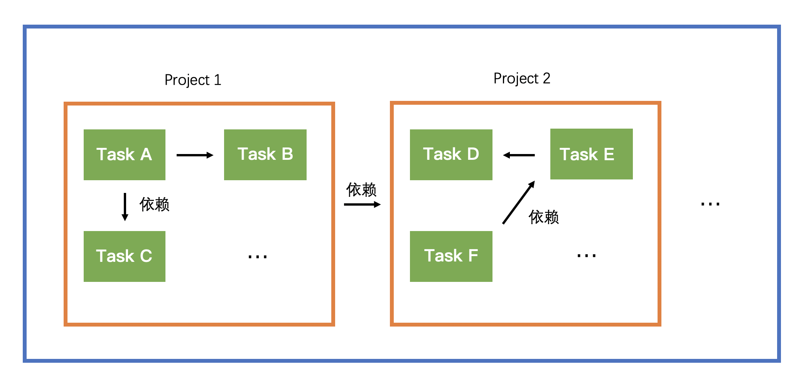

<!-- START doctoc generated TOC please keep comment here to allow auto update -->
<!-- DON'T EDIT THIS SECTION, INSTEAD RE-RUN doctoc TO UPDATE -->

- [系列分享三：Maven和Gradle是怎么设计的](#%E7%B3%BB%E5%88%97%E5%88%86%E4%BA%AB%E4%B8%89maven%E5%92%8Cgradle%E6%98%AF%E6%80%8E%E4%B9%88%E8%AE%BE%E8%AE%A1%E7%9A%84)
  - [Maven](#maven)
    - [生命周期](#%E7%94%9F%E5%91%BD%E5%91%A8%E6%9C%9F)
    - [插件目标](#%E6%8F%92%E4%BB%B6%E7%9B%AE%E6%A0%87)
    - [自定义绑定](#%E8%87%AA%E5%AE%9A%E4%B9%89%E7%BB%91%E5%AE%9A)
    - [依赖管理](#%E4%BE%9D%E8%B5%96%E7%AE%A1%E7%90%86)
  - [Gradle](#gradle)
    - [Gradle核心概念](#gradle%E6%A0%B8%E5%BF%83%E6%A6%82%E5%BF%B5)
    - [Project](#project)
    - [Task](#task)
      - [自定义Task](#%E8%87%AA%E5%AE%9A%E4%B9%89task)
      - [如何调用任务](#%E5%A6%82%E4%BD%95%E8%B0%83%E7%94%A8%E4%BB%BB%E5%8A%A1)
      - [构建的生命周期](#%E6%9E%84%E5%BB%BA%E7%9A%84%E7%94%9F%E5%91%BD%E5%91%A8%E6%9C%9F)
      - [如何保障Task执行的顺序](#%E5%A6%82%E4%BD%95%E4%BF%9D%E9%9A%9Ctask%E6%89%A7%E8%A1%8C%E7%9A%84%E9%A1%BA%E5%BA%8F)
      - [生命周期Task](#%E7%94%9F%E5%91%BD%E5%91%A8%E6%9C%9Ftask)
      - [Task的增量构建](#task%E7%9A%84%E5%A2%9E%E9%87%8F%E6%9E%84%E5%BB%BA)
    - [依赖](#%E4%BE%9D%E8%B5%96)
      - [Configuration](#configuration)
      - [api vs implementation](#api-vs-implementation)
      - [依赖冲突](#%E4%BE%9D%E8%B5%96%E5%86%B2%E7%AA%81)
      - [依赖管理](#%E4%BE%9D%E8%B5%96%E7%AE%A1%E7%90%86-1)
    - [其他](#%E5%85%B6%E4%BB%96)
      - [Wrapper](#wrapper)
      - [Groovy](#groovy)
  - [总结](#%E6%80%BB%E7%BB%93)
  - [References](#references)

<!-- END doctoc generated TOC please keep comment here to allow auto update -->

# 系列分享三：Maven和Gradle是怎么设计的

构建工具是Java开发每天都需要接触的，Maven和Gradle作为两个主流的Java构建工具，搞清楚命令背后发生了什么是有必要的。

## Maven

广大Java开发对`mvn package`可以说是非常熟悉了，这里先抛出一些问题：这命令都执行了哪些步骤呢？会执行`clean`吗？会执行单元测试吗？

Maven作为Java老牌构建工具，基于约定优于配置的思想，使用简单，Java开发几乎都会使用，但是也有部分开发对Maven仅停留在简单使用阶段，对其生命周期和插件机制不甚了解，那么在你执行Maven命令的时候，就不会那么清晰，引入Maven插件的时候，你也会对其中的配置感到困惑，所以本文Maven部分主要讲解Maven的核心——生命周期和插件机制。

### 生命周期

在Maven出现之前，项目构建的生命周期就已经存在， 开发人员每天都在对项目进行清理，编译，测试以及部署，但不同团队之间，还是会有一些差异，所以Maven对项目的构建过程进行了抽象标准化，定义了生命周期。

很多开发存在的一个误区就是Maven只有一个生命周期，其实Maven有三个独立的生命周期，分别是clean、default、site。**每个生命周期都包含一些阶段（phase），这些阶段是有序的，并且后面的阶段依赖前面的阶段**。

例如，clean生命周期的阶段如下：pre-clean、clean、post-clean，当我们执行mvn clean的时候，就会先执行pre-clean阶段，再执行clean阶段。

下面我们在看default生命周期，其主要阶段如下：validate、compile、test、package、verify、install、deploy。

所以上面提出的问题，我们也就可以回答了：当我们执行mvn package命令的时候，就会依次执行validate、compile、test、package阶段，默认会执行test阶段，由于不是同一生命周期，所以不会执行clean阶段。

注意：

在我们日常打包的时候，还是有必要在`package`前执行`clean`的，即清除所有打包的文件，因为当你进行重命名操作的时候，旧的class文件依然会存在target/classes中，可能会造成未知的错误，详细的可以看Stack Overflow的[相关讨论](https://stackoverflow.com/questions/4662452/in-maven-why-run-mvn-clean)。

### 插件目标

上面是Maven的生命周期和对应的阶段，仅仅是一种抽象，**真正的实现是由插件的目标（goal）来完成**，一个插件往往有多个目标，他们被绑定到不同的阶段上，当执行到对应阶段的时候，对应的目标将被执行。

例如，default生命周期的compile阶段是由maven-compiler-plugin的compile目标来实现的。

为了能让用户几乎不用任何配置就能构建Maven项目，Maven在一些主要的生命周期阶段绑定了很多插件的目标，除了上面的compile阶段，还有clean生命周期的clean阶段与maven-clean-plugin插件的clean目标绑定。

下面是defult生命周期阶段的默认绑定（打包类型为Jar）：

| Phase                    | plugin:goal               |
| :----------------------- | :------------------------ |
| `process-resources`      | `resources:resources`     |
| `compile`                | `compiler:compile`        |
| `process-test-resources` | `resources:testResources` |
| `test-compile`           | `compiler:testCompile`    |
| `test`                   | `surefire:test`           |
| `package`                | `jar:jar`                 |
| `install`                | `install:install`         |
| `deploy`                 | `deploy:deploy`           |

**mvn命令行格式**

mvn后面除了跟phase外，还能直接指定goal，格式为：

```
mvn [options] [<goal(s)>] [<phase(s)>]
```

例如，通过maven-dependency-plugin插件（默认插件）的tree目标查看项目的依赖树：

```
$ mvn dependency:tree
```

还可以通过命令行给插件传递参数，插件maven-surefire-plugin提供了一个maven.test.skip参数，当其值为true的时候，跳过单元测试，故可运行如下命令：

```
$ mvn clean package -Dmaven.test.skip=true
```

### 自定义绑定

除了Maven默认的绑定，我们也可以将某个插件的目标绑定到生命周期的某个阶段上。

例如，当我们想打一个fat包，我们引入maven-assembly-plugin插件，并把其中的single目标绑定到default生命周期的package阶段。

```xml
<plugin>
    <artifactId>maven-assembly-plugin</artifactId>
    <executions>
        <execution>
            <phase>package</phase>
            <goals>
                <goal>single</goal>
            </goals>
        </execution>
    </executions>
    <configuration>
        ...
    </configuration>
</plugin>
```

这时候当我们执行`mvn package`，我们会看到`maven-jar-plugin:3.0.2:jar`和`maven-assembly-plugin:2.2-beta-5:single`这两个goal都会被执行：

```
$ mvn clean package
...
[INFO] --- maven-jar-plugin:3.0.2:jar (default-jar) @ example_project ---
[INFO]
[INFO] --- maven-assembly-plugin:2.2-beta-5:single (default) @ example_project ---
...
```

并打出了一个普通Jar包和一个fat Jar包：

```
$ ls -l target|grep jar
-rw-r--r--  1 wujunnan  staff   149M Sep 25 00:26 example_project-1.0-SNAPSHOT-jar-with-dependencies.jar
-rw-r--r--  1 wujunnan  staff    17K Sep 25 00:21 example_project-1.0-SNAPSHOT.jar
```

说到打包，这里稍微展开说下，我们可以看到上面的默认插件maven-jar-plugin打出来的包是只有17K，也就是只有我们写的代码（即Skinny包），并没有依赖，这作为项目肯定是无法运行的。

所以如果是普通的项目，我们可以引入maven-assembly-plugin这类插件，将依赖和我们的代码都打包到一个Jar包中（也就是Fat/Uber包），当然使用了Spring项目，通常会引入spring-boot-maven-plugin插件。

### 依赖管理

Maven提供了dependencyManagement可以让我们在父项目中管理我们的依赖，主要管理依赖的版本。

所以我们创建SpringBoot项目的时候可以很好的利用这一点来管理依赖，通常我们在SpringBoot项目的POM文件中添加如下部分：

```xml
<parent>
    <groupId>org.springframework.boot</groupId>
    <artifactId>spring-boot-starter-parent</artifactId>
    <version>2.6.7</version>
</parent>
```

我们可以看到spring-boot-starter-parent项目的POM文件还有一个parent部分：

```xml
<parent>
    <groupId>org.springframework.boot</groupId>
    <artifactId>spring-boot-dependencies</artifactId>
    <version>2.6.7</version>
</parent>
```

其中spring-boot-dependencies项目部分主要就是对依赖版本部分的依赖了：

```xml
<properties>
    <activemq.version>5.16.4</activemq.version>
    ...
</properties>
<dependencyManagement>
    <dependencies>
        <dependency>
            <groupId>org.apache.activemq</groupId>
            <artifactId>activemq-amqp</artifactId>
            <version>${activemq.version}</version>
        </dependency>
        <dependency>
            <groupId>org.apache.activemq</groupId>
            <artifactId>activemq-blueprint</artifactId>
            <version>${activemq.version}</version>
        </dependency>
        ...
    </dependencies>
</dependencyManagement>
```

同理，还有插件管理也是如此，spring-boot-starter-parent项目中还有pluginManagement部分对很多插件做了默认配置，这就正是为什么在我们的项目中引入spring-boot-maven-plugin插件，并没有进行阶段的绑定，在执行`mvn package`的时候，spring-boot-maven-plugin插件的目标依然会被执行。

## Gradle

Gradle是基于Maven的新一代构建工具，吸取了Maven和Ant的优点，近年来势头强劲，越来越多的大型项目选择使用Gradle作为构建工具，但是实际开发中，很多同学之前并没有使用过Gradle，下面对Gralde进行讲解。

Gradle有如下特点：

- **灵活，描述性强**

  Maven最大的缺点就是过于死板，想自己定制一些流程就比较困难，例如，我们想在打包完成后输出Jar包的大小，实现起来就非常困难，需要定制插件，而插件的编写是十分困难的，而Gradle仅仅需要加入几行Groovy脚本。

- **构建速度更快**

  Gralde通过增量构建和任务并行执行等手段，大大加快了项目构建的速度。

  SpringBoot在2020年6月就改为使用Gradle进行构建，主要原因就是Gradle大大加快了SpringBoot的构建速度，使用Maven需要一个小时甚至以上的时间，而使用Gradle，则只需要9分钟，详见此：[Migrating Spring Boot's Build to Gradle](https://spring.io/blog/2020/06/08/migrating-spring-boot-s-build-to-gradle)。

- 对非Gradle项目兼容性好

  Gradle在Maven之后推出的，所以考虑了已有项目向Gradle的迁移，加上Gradle本身的灵活，所以对非Gradle的项目兼容性要更好。

### Gradle核心概念

Gradle的核心概念有Project、Task，Gradle使用领域驱动设计来建模，Project和Task都有对应的类。

Java项目中，每个模块都有一个build.gradle，对应一个Project。当构建进程启动后，Gradle就会基于build.gradle实例化Project。

Project类中可以有创建Task的方法，Task负责来执行具体任务，一个Project还有还有很多属性，如name、describe等，可以在build.gradle中给创建新的Task、给属性赋值。

例如，当我们执行`gradle main:bootjar`的时候，含义就是执行main这个Project的bootjar这个任务，但实际上我们没有在build.gradle中写bootjar这个任务，那是因为Project中还可以引入插件，进而引入他们对应的任务，bootjar就是`org.springframework.boot`这个Spring提供的插件里面的任务。

Project和Task的关系如下：



### Project

当你要着手一个Java项目的时候，你需要先去看看其中重要的类中有哪些API，同样的，我们也来看看Gradle Project对应的API：

```
//构建脚本配置
apply()
buildscript()

//依赖管理
dependencies()
configurations()
getDependencies()
getConfigurations()

//getter/setter
getName()
getDescription()
getGroup()
getVerison()
setVersion()

//创建文件
file()

//创建任务
task()
```

通过这些API，一个Project可以：

- 通过`apply()`来应用一些插件
- 通过`dependencies()`来引入一些依赖
- 通过`setDescription()`等setter来设置项目的一些属性
- 通过`task()`来新增一些任务

其实上面这些就是我们在`build.gradle`主要做的一些事情。

例如：

在build.gradle中调用Project的方法：

```
setDescription("myProject")
println "Description of project $name: " + project.description
```

执行任意Gradle命令，得到输出：

```
> Configure project :
Description of project gradle-project: myProject
```

### Task

Task对应的API如下：

```
//task依赖
dependesOn()

//动作定义
doFirst()
doLast()
getActions()

//输入输出数据声明
getInputs()
getOutputs()

//getter/setter
getDescription()
getEnable()
//任务的逻辑分组
getGroup()
setDescription()
setEnable()
setGroup()
```

任务可以是插件引入的，也可以是自定义的，我们接下来就定义一个任务。

#### 自定义Task

我们可以在`build.gradle`中创建一个task：

```
tasks.register('hello') {
    doLast {
        println 'Hello world!'
    }
}
```

我们可以看到如下输出：

```
$ gradle -q hello
Hello world!
```

我们可以看到，自定义一个简单的Task是很简单的。

#### 如何调用任务

如上所示，一般我们通过命令行来调用Gradle任务。

命令行的格式为：

```
$ gradle [taskName...] [--option-name...]
```

多项目可以通过全限定名来执行某个项目下的任务：

```
$ gradle :my-subproject:taskName
```

**有用的参数**：

- `-m` 查看一个任务的依赖顺序

  ```
  $ gradle build -m
  :compileJava SKIPPED
  :processResources SKIPPED
  :classes SKIPPED
  :bootJarMainClassName SKIPPED
  :bootJar SKIPPED
  :jar SKIPPED
  :assemble SKIPPED
  :compileTestJava SKIPPED
  :processTestResources SKIPPED
  :testClasses SKIPPED
  :test SKIPPED
  :check SKIPPED
  :build SKIPPED
  ```

- `-x` 跳过某个任务

  例如，跳过单元测试：

  ```
  $ gradle build -m -x test
  ```

#### 构建的生命周期

有时候我们会有疑问，settings.gradle、build.gradle中写的语句都会在什么时候执行呢？这就需要了解Gradle构建的生命周期，无论什么时候执行Gradle构建，都会运行三个不同的生命周期阶段：

- 初始化阶段

  在初始化阶段，Gradle先解析settings.gradle文件，找出本次构建所依赖的所有项目，并为所有项目创建Project实例。

- 配置阶段

  该阶段，Gradle将任务和其他属性添加到上述Project实例中，并根据依赖生成Task执行图。

- 执行阶段

  所有的task都应该被以正确的顺序执行。执行的顺序是由它们的依赖决定的，如果任务被认为没有被修改过，将被跳过。

例如，我们做如下配置：

settings.gradle

```
println '【初始化阶段】This is executed during the initialization phase.'
```

build.gradle

```
println '【配置阶段】This is executed during the configuration phase.'

tasks.register('lifecycle') {
    doFirst {
        println '【doFirst】This is executed first during the execution phase.'
    }
    doLast {
        println '【doLast】This is executed last during the execution phase.'
    }
    println '【任务配置阶段】This is executed during the configuration phase as well, because :lifecycle is used in the build.'
}
```

我们来检测输出：

```
$ gradle lifecycle
【初始化阶段】This is executed during the initialization phase.

> Configure project :
【配置阶段】This is executed during the configuration phase.
【任务配置阶段】This is executed during the configuration phase as well, because :lifecycle is used in the build.

> Task :lifecycle
【doFirst】This is executed first during the execution phase.
【doLast】This is executed last during the execution phase.
```

#### 如何保障Task执行的顺序

我们知道，Maven的生命周期定义了固定的phase，然后依次执行各个phase上绑定的goal，这样就使得goal有序执行了。

那Gradle是怎么保证任务的有序的执行呢？

Gradle是通过Task中的dependsOn来定义任务的依赖，从而决定了任务执行的顺序，如下所示（注意，没有依赖关系的Task的顺序并不固定）：

```
tasks.register('hello') {
    doLast {
        println 'Hello world!'
    }
}

tasks.register('intro') {
    dependsOn tasks.hello
    doLast {
        println "I'm Gradle"
    }
}
```

运行输出如下：

```
$ gradle intro -q
> Task :hello
Hello world!

> Task :intro
I'm Gradle
```

例如，build任务的依赖（导入Java插件）：


#### 生命周期Task

```
$ gradle -m assemble -q
:hello SKIPPED
:compileJava SKIPPED
:processResources SKIPPED
:classes SKIPPED
:jar SKIPPED
```

任务分为两种：

- 可执行任务（actionable tasks）
- [生命周期任务](https://docs.gradle.org/current/userguide/base_plugin.html#sec:base_tasks)（lifecycle tasks）

可执行任务就是有具体执行内容的任务，而生命周期任务就是

Gradle的base plugin提供了一些列的生命周期函数，例如：

- check
- assemble
- build

这些生命周期函数本身不执行任何任务，但我们可以将其他任务作为生命周期函数的依赖，这样我们只需要调用一个固定的生命周期函数，就会执行所有绑定（通过依赖）在该生命周期的任务，类似执行Maven的Phase。

例如：我们将hello任务作为assemble生命周期任务的依赖：

```
tasks.register('hello') {
    doLast {
        println 'Hello world!'
    }
}

assemble.dependsOn('hello')
```

接下来，我们查看assemble都执行了哪些任务：

```
$ gradle -m assemble -q
:hello SKIPPED
:compileJava SKIPPED
:processResources SKIPPED
:classes SKIPPED
:jar SKIPPED
...
```

我们看到，执行assemble的时候，hello任务将被执行。

更多详见[官方文档](https://docs.gradle.org/current/userguide/more_about_tasks.html#sec:lifecycle_tasks)。

#### Task的增量构建

Gradle支持Task的增量构建，这正是Gradle构建速度快的一大原因。

什么是增量构建？例如，Java的JavaCompile任务 ，当执行过一次编译之后，如果源文件（Java文件）没有改变，编译后的文件（class文件）没有被删除，那么下次JavaCompile任务被调用的时候，就没有必要再次执行。

那增量构建是如何实现的呢？

首先我们需要定义一个任务的输入和输出，例如，上例中，Java文件就是JavaCompile任务的input，class文件就是JavaCompile的output。

每次执行Task前，Gradle都会比较本次Task和上次Task input和output的校验和，如果一样，则会跳过本次任务。

注意：

一些老的构建工具，例如Linux make，是通过对比时间戳来决定文件是否是新的，即如果源代码的修改时间晚于可执行程序的修改时间，那么就需要重新编译源代码，否则不需要。

关于增量构建，更多详见[官方文档](https://docs.gradle.org/current/userguide/incremental_build.html)。

### 依赖

#### Configuration

我们知道，依赖是和使用场景相关的，例如，junit只在测试的时候才会使用，mysql-connector只在运行时需要，编译时不需要，servlet-api只在编译期用到，运行时会由容器提供。

所以，在Maven中，我们可以定义依赖的scope，例如compile、provided、runtime、test等，例如：

```xml
<dependency>
    <groupId>mysql</groupId>
    <artifactId>mysql-connector-java</artifactId>
    <scope>runtime</scope>
    <version>8.0.17</version>
</dependency>
```

在Gradle中，通过[Configuration](https://docs.gradle.org/current/dsl/org.gradle.api.artifacts.Configuration.html)来描述一个scope中的所有依赖，Configuration也是一个领域对象。

Java插件就引入了很多个Configuration：

- implementation
- compileOnly
- compileClasspath
- annotationProcessor
- runtimeOnly
- runtimeClasspath
- ...(test相关)

例如，下面是Java插件一些主要的Configuration：


Java插件引入的Configuration比起Maven的scope，粒度要更细。

注意：

>In Gradle 7, both the `compile` and `runtime` configurations are removed. Therefore, you have to migrate to the `implementation` and `api` configurations above. If you are still using the `java` plugin for a Java library, you will need to apply the `java-library` plugin instead.

在Gradle7+版本中，`compile` Configuration被移除了，应该使用`implementation`或`api`来代替。其中， `api` Configuration由Java Library插件引入（Java插件的升级版，JVM应用推荐使用），Java Library插件引入的主要Configuration如下图：


- 绿色指的是依赖可以被声明的类型
- 粉色是指一个组件编译所需或运行时所需的库
- 蓝色是组件自己内部使用的

#### api vs implementation

这里是Gradle中比较难理解的一个点，很多博客写的不太清晰，这里解释一下：

- 如果一个依赖被声明为api，那么该模块的消费者的compile和runtime中都会出现该依赖
- 如果一个依赖被声明为implementation，那么该模块的消费者的compile中不会出现该依赖，只有runtime中都会出现该依赖

下面，我们用例子来说明：

有两个gradle子模块，sub-a和sub-b，其中sub-a依赖了sub-b。

sub-a的build.gradle：

```
...

dependencies {
    implementation project(':sub-b')
}
```

sub-b的build.gradle：

```
...

dependencies {
    implementation 'cn.hutool:hutool-all:5.8.10'
}
```

sub-b模块引入了该依赖，所以如下代码正常编写：

```
System.out.println(cn.hutool.core.date.DateUtil.date());
```

但是，同样的语句，在sub-a模块中，IDE就会报错，也就是说编译期找不到依赖。

查看sub-a模块的依赖：

```
$ gradle :sub-a:dependencies
...
compileClasspath - Compile classpath for source set 'main'.
\--- project :sub-b

runtimeClasspath - Runtime classpath of source set 'main'.
\--- project :sub-b
     \--- cn.hutool:hutool-all:5.8.10  
...
```

那么，我们将sub-b的build.gradle修改为如下：

```
...

dependencies {
    // implementation 'cn.hutool:hutool-all:5.8.10'
    api 'cn.hutool:hutool-all:5.8.10'
}
```

我们发现，sub-a模块中的如下语句不再编译报错了：

```
System.out.println(cn.hutool.core.date.DateUtil.date());
```

再次查看sub-a的依赖：

```
$ gradle :sub-a:dependencies
...
compileClasspath - Compile classpath for source set 'main'.
\--- project :sub-b
     \--- cn.hutool:hutool-all:5.8.10

runtimeClasspath - Runtime classpath of source set 'main'.
\--- project :sub-b
     \--- cn.hutool:hutool-all:5.8.10
...
```

我们平时引用依赖的时候，发现api和implementation区别不大的原因是，大部分依赖在Maven中声明的Scope都是`compile`。

**最佳实践**

那么平时，我们应使用api还是implementation，如果该依赖是该模块的内部依赖，则使用implementation，如果该依赖是该模块导出的一部分，则应该使用api。

#### 依赖冲突

我们在开发的过程中，会经常遇到依赖冲突的情况，解决思路就是**查看依赖树，然后解决冲突**，无其他捷径。

**不同依赖冲突**

例如，我们项目中使用的是SLF4J，实现使用的是logback（SLF4J为日志接口，logback为其原生实现），这个时候，我们引入了一个新的依赖，其内部包含了`log4j-slf4j-impl`，即另一个SLF4J bindings，这个时候，我们就会收到如下警告：

```
SLF4J: Class path contains multiple SLF4J bindings.
```

即现在的Class path中存在了多个SLF4J的bindings，SLF4J不知道该选择哪个。

这个时候，就需要我们使用gradle提供的查看依赖的任务dependencies：

```
$ gradle :upms:dependencies --configuration compileClasspath
```

查看依赖树，查找是哪个依赖携带了`log4j-slf4j-impl`，然后将其exclude。

**依赖版本冲突**

还有一种情况是版本冲突，即多个不同的依赖包含了同一个依赖的不同版本，Maven遇到这种情况，就采用最近的版本，而Gradle会采用最高的版本。

但不管什么策略，如果最后构建工具选择的版本不是我们想要的，某些情况，运行的时候就会报NoSuchMethodError。

这个时候，同样的，还是只能通过查看项目的依赖树，去检查是不是某个Jar包使用的版本不对，然后通过排除掉不需要的Jar包版本或者强制指定Jar包版本来解决。

#### 依赖管理

上面提到了Maven项目可以通过指定`spring-boot-starter-parent`为parent，继而通过`<dependencyManagement>`来管理依赖，那么在Gradle中，可以引入Spring的`io.spring.dependency-management`插件来实现同样的效果，例如：

```
plugins {
    id "io.spring.dependency-management" version <<version>>
}
```

注意，上面插件对Gradle版本有要求，详细可以参考：[Spring Boot Gradle Plugin Reference Guide](https://docs.spring.io/spring-boot/docs/current/gradle-plugin/reference/htmlsingle/)

### 其他

#### Wrapper

Gradle推荐使用包装器（Wrapper）的方式来执行构建任务，这样的好处是：

- 在开发或部署的时候，不需要提前准备Gradle环境
- Wrapper指定了Gradle的版本，不需要再担心版本兼容问题

我们可以通过如下Gradle命令来生成Wrapper：

```
$ gradle wrapper --gradle-version 7.5
```

将会生成如下文件：

```
├── gradle
│   └── wrapper
│       ├── gradle-wrapper.jar
│       └── gradle-wrapper.properties
├── gradlew
└── gradlew.bat
```

然后，我们就可以使用Wrapper：

```
$ ./gradlew --version

------------------------------------------------------------
Gradle 7.5
------------------------------------------------------------
...
```

注意：

- 下载下来的包装器文件应该提交到版本控制系统中（故` .gitignore`不应该忽略所有Jar文件）

#### Groovy

Maven、Ant这些构建工具是采用XML来定义构建逻辑的，XML很容易读，也很容易被写出来，但是，在表达逻辑方面，就很困难了。

而Gradle的DSL是由Groovy实现的，Groovy是基于JVM的动态编程语言，是一种脚本语言，提供了基于Java的语法糖，语法和Java类似，使用了大量Java已有的类库，对于Java开发来说，学起来较容易，Groovy相比Java更加简洁：

- 类、方法、构造默认是public
- 编译器自动加上setter和getter，属性通过点号来获取，底层自动getter方法
- 可以直接使用`==`来判断两个实例，底层自动调用equals方法，也避免了可能存在的NPE
- ...

## 总结

1. Maven采用约定大于配置的思想，将部署的流程抽象为不同阶段构成的生命周期。
2. Maven实际由目标来执行具体任务，目标由插件导入，并绑定在阶段上。
3. Maven提供了依赖和插件的管理，spring-boot-starter-parent即是通过此来管理子项目的依赖版本和插件配置。
4. Gradle是基于Maven的新一代构建工具，构建流程更加灵活、构建速度更快。
5. Gradle采用领域建模的思想，Project、Task、Configuration等都有对应的类，一个build.gradle即对应一个Project对象。
6. 我们可以轻松的在build.gradle定义一个Task，并通过命令行来调用这个Task。
7. 任务通过dependsOn来定义该任务的依赖，从而决定了任务执行的先后。
8. 有一些任务是生命周期任务，并不执行具体操作，用来定义部署流程的阶段，可以将多个任务绑定到生命周期任务上。
9. 增量构建使得Gradle不再做重复的工作，大大提高了部署的速度。
10. Gradle将Maven中的Scope抽象为Configuration，Java插件引入了多种Configuration，比起Maven更加细化了。
11. 在Gradle7+版本中，`implementation`或`api`用来引入依赖，区别就是， 对于消费者来说，`implementation`导入的依赖，编译期是不可见的，而`api`导入的依赖，编译期是可见的。

## References

1. Maven官方文档：[Introduction to the Build Lifecycle.](https://maven.apache.org/guides/introduction/introduction-to-the-lifecycle.html)
2. 书籍：《Maven实战》，作者：许晓斌
3. Stack Overflow：[In Maven, Why Run 'mvn clean'?](https://stackoverflow.com/questions/4662452/in-maven-why-run-mvn-clean)
4. 书籍：《实战Gradle》，作者：Benjamin Muschko
5. 博客：[Migrating Spring Boot's Build to Gradle](https://spring.io/blog/2020/06/08/migrating-spring-boot-s-build-to-gradle)
6. Gradle官方文档：[The Java Plugin](https://docs.gradle.org/current/userguide/java_plugin.html)
7. Gradle官方文档：[Build Lifecycle](https://docs.gradle.org/current/userguide/build_lifecycle.html)
8. 博客：[Gradle assemble task essentials](https://tomgregory.com/gradle-assemble-task-essentials/)
9. Gradle官方文档：[Incremental build](https://docs.gradle.org/current/userguide/incremental_build.html)
10. Gradle官方文档：[Introducing Incremental Build Support](https://blog.gradle.org/introducing-incremental-build-support)
11. Spring官方文档：[Spring Boot Gradle Plugin Reference Guide](https://docs.spring.io/spring-boot/docs/current/gradle-plugin/reference/htmlsingle/)
12. Gradle官方文档：[The Gradle Wrapper](https://docs.gradle.org/current/userguide/gradle_wrapper.html)

