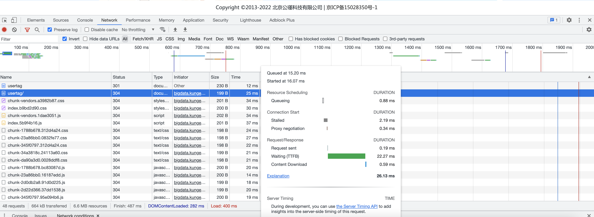

# Chrome Network

[参考官方文档](https://developer.chrome.com/docs/devtools/network/reference/#overview)

## WaterFall

不同的阶段：

- **Queueing**

  The browser queues requests when:

  - There are higher priority requests.
  - There are already six TCP connections open for this origin, which is the limit. Applies to HTTP/1.0 and HTTP/1.1 only.
  - The browser is briefly allocating space in the disk cache

- **Stalled**. The request could be stalled for any of the reasons described in **Queueing**.

- **DNS Lookup**. The browser is resolving the request's IP address.

- **Initial connection**. The browser is establishing a connection, including TCP handshakes/retries and negotiating an SSL.

- **Proxy negotiation**. The browser is negotiating the request with a [proxy server](https://en.wikipedia.org/wiki/Proxy_server).

- **Request sent**. The request is being sent.

- **ServiceWorker Preparation**. The browser is starting up the service worker.

- **Request to ServiceWorker**. The request is being sent to the service worker.

- **Waiting (TTFB)**. The browser is waiting for the first byte of a response. TTFB stands for Time To First Byte. This timing includes 1 round trip of latency and the time the server took to prepare the response.

- **Content Download**. The browser is receiving the response, either directly from the network or from a service worker. This value is the total amount of time spent reading the response body. Larger than expected values could indicate a slow network, or that the browser is busy performing other work which delays the response from being read.

- **Receiving Push**. The browser is receiving data for this response via HTTP/2 Server Push.

- **Reading Push**. The browser is reading the local data previously received.

## References

- https://developer.chrome.com/docs/devtools/network/reference/#timing-explanation