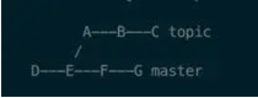
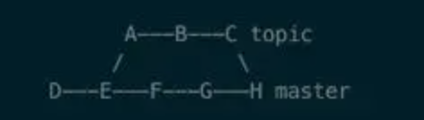
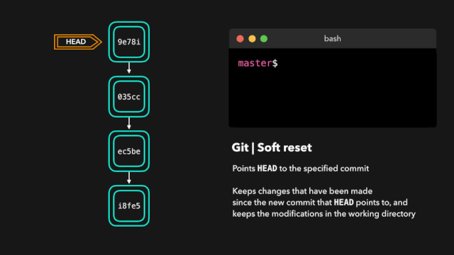
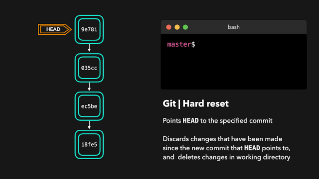
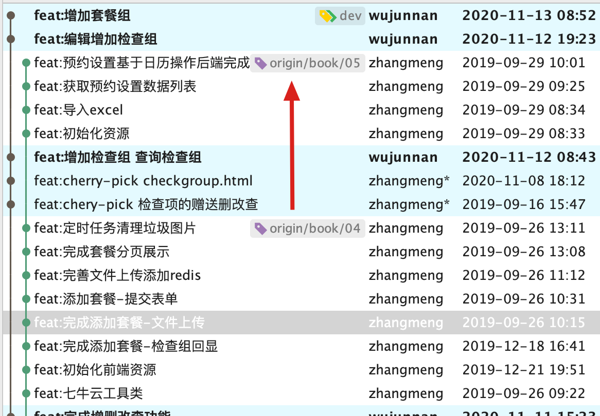
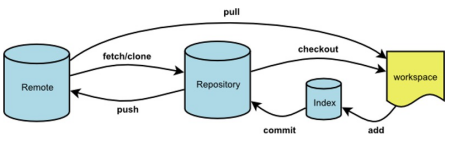

# 深入理解Git

## Git综述

## Git文件目录

```
.
└── .git
    ├── HEAD           //存储着Git仓库当前位于的分支
    ├── config			   //配置文件
    ├── description
    ├── hooks
    │   ├── applypatch-msg.sample
    │   ├── commit-msg.sample
    │   ├── fsmonitor-watchman.sample
    │   ├── post-update.sample
    │   ├── pre-applypatch.sample
    │   ├── pre-commit.sample
    │   ├── pre-push.sample
    │   ├── pre-rebase.sample
    │   ├── pre-receive.sample
    │   ├── prepare-commit-msg.sample
    │   └── update.sample
    │   ├── index      //暂存区，记录add进来的文件状态，文件SHA-1值，文件名
    ├── info
    │   └── exclude
    ├── objects        //存放Blobs,Tree objects,Commit objects这三种类型的数据
    │   ├── info
    │   └── pack
    └── refs
    		├── heads      //里面存放本地分支
				│   ├── master
				│   ├── dev
				│   └── ...
				├── remotes    //里面存放远程分支 
        │   ├── origin
        │   │   ├── ANDROIDBUG-4845
        │   │   ├── ...
        ├── stash     //与git stash相关
        └── tags      //轻量级的tag
```

## Git中存储的五种对象

- `Blobs`， 是Git中最基础的数据类型，一个`blob`对象就是一堆字节，通常是一个文件的二进制表示
- `tree`，有点类似于目录，其内容由对其它`tree`及`blobs`的指向构成；
- `commit`，指向一个树对象，并包含一些表明作者及父 commit 的元数据
- `Tag`，指向一个commit对象，并包含一些元数据
- `References`,指向一个`commit`或者`tag`对象

`blobs` , `tree` , `commit` ,以及声明式的 `tag` 这四种对象会存储在 `.git/object` 文件夹中。这些对象的名称是一段40位的哈希值，此名称由其内容依据`sha-1`算法生成，具体到`.git/object`文件夹下，会取该hash值的前 2 位为子文件夹名称，剩余 38 位为文件名，这四类对象都是二进制文件，其内容格式依据类型有所不同

### blob

`blobs`是二进制文件，我们不能直接查看，不过通过 Git 提供的命令如 `git show [hash]` 或者 `git cat-file -p [hash]` 我们就可以查看 `.git/object` 文件夹下任一文件的内容。

```
wujunnan@localhost test % git cat-file -t 180c
blob
wujunnan@localhost test % git cat-file -p 180c
test2
```

从上面的内容中就可以看出，`blob` 对象中仅仅存储了文件的内容，如果我们想要完整还原工作区的内容，我们还需要把这些文件有序组合起来，这就涉及到 Git 中存储的另外一个重要的对象：`tree`

### tree object

`tree` 对象记录了我们的文件结构，更形象的说法是，某个 `tree` 对象记录了某个文件夹的结构，包含文件以及子文件夹。`tree` 对象的名称也是一个40位的哈希值，文件名依据内容生成，因此如果一个文件夹中的结构有所改变，在 `.git/object/` 中就会出现一个新的 `tree object`

```
wujunnan@localhost test % git cat-file -p 6139
100644 blob a5bce3fd2565d8f458555a0c6f42d0504a848bd5	a.txt
040000 tree 9a18347eb049876e2855d88b091b6516dea58de7	test
```

我们可以看到，`tree` 中包含两种类型的文件，`tree` 和 `blob`，这就把文件有序的组合起来了，如果我们知道了根 `tree`（可以理解为`root`文件夹对应的`tree`），我们就有能力依据此`tree`还原整个工作区。

### commit object

我们知道，`commit`记录了我们的提交历史，存储着提交时的 message，Git 分支中的一个个的节点也是由 commit 构成。一个典型的 `commit object` 内容如下：

```
wujunnan@localhost test % git cat-file -p e8ab
tree 61392b81b60bae1f732e1b08fb5fdfcb4c36d74e
author wujunnan <“mr.wujunnan@qq.com”> 1603189020 +0800
committer wujunnan <“mr.wujunnan@qq.com”> 1603189020 +0800

第一次commit
```

我们来看看其中每一项的意义：

- `tree`:告诉我们当前 `commit` 对应的根 `tree`,依据此值我们还原此 `commit` 对应的工作区；
- `parent`:父 `commit` 的 hash 值，依据此值，我们可以记录提交历史；
- `author`:记录着此`commit`的修改内容由谁修改；
- `committer`:记录着当前 commit 由谁提交；
- `...bc`: `commit message`;

### references

`References` 对象存储在`/git/refs/`文件夹下，该文件夹结构如下:

```
wujunnan@localhost test % tree .git/refs
.git/refs
├── heads
│   ├── master
│   ├── dev
│   └── ...
├── remotes
│   ├── origin
│   │   ├── ANDROIDBUG-4845
│   │   ├── ActivityCard-za
│   │   ├── ...
├── stash
└── tags
```

heads记录的是本地所有分支，如master等，remotes和HEAD一样，指向**对应的某个远程分支**

```
wujunnan@localhost test % test % cat .git/refs/heads/master
501b5918ce6755eea19476ac6a89f214921b498e
```

master里面就是**commit节点的hash值**

再看看 `.git/refs` 文件夹中其它的内容：

- `.git/refs/remotes` 中记录着远程仓库分支的本地映射，其内容只读；

- `.git/refs/stash` 与 `git stash` 命令相关，后文会详细讲解；
- `.git/refs/tag`, 轻量级的tag，与 `git tag` 命令相关，它也是一个指向某个`commit` 对象的指针；

### tag objects

- lightweight tags，轻量标签很像一个不会改变的分支，其内容是对一个特定提交的引用，这种 tag 存储在`.git/refs/tag/`文件夹下；
- annotated tags： 声明式的标签会在object下添加`tag object`，此种 tag 能记录更多的信息；

```
# lightweight tags
$ git tag 0.1
# 指向添加tag时的commit hash值
➜ cat 0.1 
e9f249828f3b6d31b895f7bc3588df7abe5cfeee

# annotated tags
$ git tag -a -m 'Tagged1.0' 1.0
➜ git cat-file -p 52c2
object e9f249828f3b6d31b895f7bc3588df7abe5cfeee
type commit
tag 1.0
tagger zhangwang <zhangwang2014@iCloud.com> 1521625083 +0800

Tagged1.0
```

对比可以发现，声明式的 tag 不仅记录了对应的 commit ,标签号，额外还记录了打标签的人，而且还可以额外添加 `tag message`（上面的`-m 'Tagged1.0'`）。

## 常见git命令与上述资源间的映射

### git基础

#### git init

`git init`：在当前文件夹下新建一个本地仓库，在文件系统上表现为在当前文件夹中新增一个 `.git` 的隐藏文件夹

#### git add

- `git add file1 file2 file3`将多个文件添加到暂存区

- `git add .`

  `git add --all`将所有文件加入暂存区

- `git config/*`添加config目录下的所有文件

  `git home/*.java`将home目录下的所有java文件添加

`git add [file]`，**这个命令会依次做下面两件事情**：

1. 在 `.git/object/` 文件夹中添加修改或者新增文件对应的 `blob` 对象；
2. 在 `.git/index`文件夹中写入该文件的名称(file01.md)及对应的 `blob` 对象名称(72943a16fb2c8f38f9...)

很多地方会说，git 命令操作的是三棵树。三棵树对应的就是上图中的工作区( working directory )、缓存区( Index )、以及 HEAD。

`HEAD` 其实是一个指针，指向最近的一次 commit 对象

`Index` 就是我们说的缓存区了，它是下次 commit 涉及到的所有文件的列表

**注意：**我们所说的缓存区并不是一个文件夹，而是一个Index文件，里面有

`git ls-files -s` 可以查看所有位于`.git/index`中的文件

```
wujunnan@wujunnandeMacBook-Pro test01 % git ls-files -s          
100644 ca5d0e6e71945129431efcf086d0e96e397046d8 0	.DS_Store
100644 72943a16fb2c8f38f9dde202b7a70ccc19c52f34 0	file01.md
100644 f761ec192d9f0dca3329044b96ebdb12839dbff6 0	test/file02.md
```

其中各项的含义如下：

- `100644`： `100`代表regular file，`644`代表文件权限
- `8baef1b4abc478178b004d62031cf7fe6db6f903`：blob对象的名称；
- `0`：当前文件的版本，如果出现冲突，我们会看到`1`，`2`；
- `data/d.txt`: 该文件的完整路径
  Git 还额外提供了一个命令来帮我我们查看文件在这三棵树中的状态，`git status`。

#### git status

`git status`有三个作用：

1. 查看当前所在分支；
2. 列出已经缓存，未缓存，未追踪的文件（依据上文中的三棵树生成）；
3. 给下一步的操作一定的提示；

#### git commit


对应到文件层面，`git commit`做了如下几件事情：

1. 新增`tree`对象，有多少个修改过的文件夹，就会添加多少个`tree`对象；
2. 新增`commit`对象，其中的的`tree`指向最顶端的tree，此外还包含一些其它的元信息，`commit`对象中的内容，上文已经见到过， `tree`对象中会包含一级目录下的子`tree`对象及`blob`对象，由此可构建当前commit的文档快照；
3. 同时当前分支(head指向的分支)指向最新的commit对象


#### git rm

```
rm test.txt
```

rm删除工作区的文件

rm 命令只是删除工作区的文件，并没有删除版本库的文件，想要删除版本库文件还要执行下面的命令：

```
$ git add test.txt
$ git commit -m "delete test"
```

**git rm **

删除工作区文件，并且将这次删除放入暂存区。要删除的文件是没有修改过的，就是说和当前版本库文件的内容相同。

**git rm -f **

删除工作区和暂存区文件，并且将这次删除放入暂存区。**要删除的文件已经修改过，就是说和当前版本库文件的内容不同。**

**git rm --cached**

删除暂存区文件，但保留工作区的文件，并且将这次删除放入暂存区

然后提交

```
$ git commit -m "delete test"
```

成功删除了版本库文件。


要从 Git 中移除某个文件，就必须要从已跟踪文件清单中移除（确切地说，是从暂存区域移除），然后提交。 可以用 `git rm` 命令完成此项工作，并连带从工作目录中删除指定的文件，这样以后就不会出现在未跟踪文件清单中了

如果只是简单地从工作目录中手工删除文件，运行 `git status` 时就会在 “Changes not staged for commit” 部分（也就是 *未暂存清单*）看到：

```
$ rm PROJECTS.md
$ git status
On branch master
Your branch is up-to-date with 'origin/master'.
Changes not staged for commit:
  (use "git add/rm <file>..." to update what will be committed)
  (use "git checkout -- <file>..." to discard changes in working directory)

        deleted:    PROJECTS.md

no changes added to commit (use "git add" and/or "git commit -a")
```

也就是执行了add操作后，又将其删除，再次commit就会出错

然后再运行 `git rm` 记录此次移除文件的操作：

```console
$ git rm PROJECTS.md
rm 'PROJECTS.md'
$ git status
On branch master
Your branch is up-to-date with 'origin/master'.
Changes to be committed:
  (use "git reset HEAD <file>..." to unstage)

    deleted:    PROJECTS.md
```

下一次提交时，该文件就不再纳入版本管理了。  如果要删除之前修改过或已经放到暂存区的文件，则必须使用强制删除选项 `-f`（译注：即 force 的首字母）。 这是一种安全特性，用于防止误删尚未添加到快照的数据，这样的数据不能被 Git 恢复。

另外一种情况是，我们想把文件从 Git 仓库中删除（亦即从暂存区域移除），但仍然希望保留在当前工作目录中。 换句话说，你想让文件保留在磁盘，但是并不想让 Git 继续跟踪。 当你忘记添加 `.gitignore` 文件，不小心把一个很大的日志文件或一堆 `.a` 这样的编译生成文件添加到暂存区时，这一做法尤其有用。

为达到这一目的，使用 `--cached` 选项：

```console
$ git rm --cached README
```

`git rm` 命令后面可以列出文件或者目录的名字，也可以使用 `glob` 模式。比如：

```console
$ git rm log/\*.log
```

注意到星号 `*` 之前的反斜杠 `\`， 因为 Git 有它自己的文件模式扩展匹配方式，所以我们不用 shell 来帮忙展开。 此命令删除 `log/` 目录下扩展名为 `.log` 的所有文件。 类似的比如：

```console
$ git rm \*~
```

该命令会删除所有名字以 `~` 结尾的文件。

#### git mv

 要在 Git 中对文件改名，可以这么做：

```console
$ git mv file_from file_to
```

它会恰如预期般正常工作。 实际上，即便此时查看状态信息，也会明白无误地看到关于重命名操作的说明：

```console
$ git mv README.md README
$ git status
On branch master
Your branch is up-to-date with 'origin/master'.
Changes to be committed:
  (use "git reset HEAD <file>..." to unstage)

    renamed:    README.md -> README
```

其实，运行 `git mv` 就相当于运行了下面三条命令：

```console
$ mv README.md README
$ git rm README.md
$ git add README
```

如此分开操作，Git 也会意识到这是一次重命名，所以不管何种方式结果都一样。 两者唯一的区别是，`mv` 是一条命令而非三条命令，直接用 `git mv` 方便得多。


### 建立使用分支

#### git branch

前文我们提到过，分支在本质上仅仅是「指向commit对象的可变指针」，其内容为一个commit对象的SHA-1 值，所以分支的创建和销毁都异常高效

使用 `git branch [newBranchName]` 可以创建新分支 `newBranchName`。不过一个更常见的用法是`git checkout -b [newBranchName]`，此命令在本地创建了分支 `newBranchName`，并切换到了分支 `newBranchName`。

HEAD 也可以看做一个指向当前所在的本地分支的特殊指针

存在两种分支，本地分支和远程分支

本地分支：

对应存储在`.git/refs/heads`中；

还存在一种叫做「跟踪分支」(也叫「上游分支」)的本地分支，此类分支从一个远程跟踪分支检出，是与远程分支有直接关系的本地分支。 如果在一个跟踪分支上输入 git pull，Git 能自动地识别去那个远程仓库上的那个分支抓取并合并代码

`.git/config`文件中信息进一步指明了远程分支与本地分支之间的关系：

```
➜ cat .git/config
...
[remote "origin"]
	url = git@git.in.zhihu.com:zhangwang/zhihu-lite.git
	fetch = +refs/heads/*:refs/remotes/origin/*
[branch "master"]
	remote = origin
	merge = refs/heads/master
[remote "wxa"]
	url = https://git.in.zhihu.com/wxa/zhihu-lite.git
	fetch = +refs/heads/*:refs/remotes/wxa/*
```

`git status` 命令的输出十分详细，但其用语有些繁琐。 Git 有一个选项可以帮你缩短状态命令的输出，这样可以以简洁的方式查看更改。 如果你使用 `git status -s` 命令或 `git status --short` 命令，你将得到一种格式更为紧凑的输出。

```console
$ git status -s
 M README
MM Rakefile
A  lib/git.rb
M  lib/simplegit.rb
?? LICENSE.txt
```

新添加的未跟踪文件前面有 `??` 标记，新添加到暂存区中的文件前面有 `A` 标记，修改过的文件前面有 `M` 标记。 输出中有两栏，左栏指明了暂存区的状态，右栏指明了工作区的状态。例如，上面的状态报告显示： `README` 文件在工作区已修改但尚未暂存，而 `lib/simplegit.rb` 文件已修改且已暂存。 `Rakefile` 文件已修，暂存后又作了修改，因此该文件的修改中既有已暂存的部分，又有未暂存的部分。

#### git checkout

git checkout` 实际上就是在操作`HEAD

Git 中有一个比较难理解的概念叫做「HEAD分离」，映射到文件层面，其实指的是 `.git/HEAD` 直接指向某个`commit`对象。

我们来看`git checkout`的具体用法

1. `git checkout <file>`

   其操作为恢复文件`<file>`的内容为，HEAD对应的快照时的内容

2. `git checkout <branch>`

   修改 `.git/HEAD` 中的内容为 `<branch>`

   更新工作区内容为 `<branch>` 所指向的 `commit` 对象

   ```
   ➜ cat .git/HEAD
   ref: refs/heads/master
   ```

3. `git checkout <hash|tag>`

   HEAD直接指向一个`commit`对象，更新工作区内容为该`commit`对象对应的快照，此时为`HEAD`分离状态，切换到其它分支或者新建分支`git branch -b new-branch`|| `git checkout branch`可以使得`HEAD`不再分离

   ```
   ➜ cat .git/HEAD
   8e1dbd367283a34a57cb226d23417b95122e5754
   ```

```
commit ef96b7209cfce4d4402afa0bf2080a3548ffa4f8 (HEAD -> dev)
Author: wujunnan <“mr.wujunnan@qq.com”>
Date:   Tue Oct 20 21:05:52 2020 +0800

    第三次修改——支线

commit c223b9bc871e4587d165d2bd525ab7ade6110a75 (master)
Author: wujunnan <“mr.wujunnan@qq.com”>
Date:   Tue Oct 20 20:59:36 2020 +0800

    第二次修改——主线

commit e8ab8a1e4707a0939e6d59af3c04a9c621a30819
Author: wujunnan <“mr.wujunnan@qq.com”>
Date:   Tue Oct 20 18:17:00 2020 +0800

    第一次commit
```

### 分支的合并

#### git merge

Git 中分支合并有两种算法，快速向前合并和三路合并

**快速向前合并：**

此种情况下，**主分支没有改动**，因此在基于主分支生成的分支上做的更改，一定不会和主分支上的代码冲突，可以直接合并，在底层相当于修改`.refs/heads/` 下主分支的内容为最新的 commit 对象。


**三路合并：**

新的feature分支在开发过程中，主分支上的代码也做了修改并添加了新的 commit ，此时合并，需要对比 feature 分支上最新的 commit，feature 分支的 base commit 以及 master 分支上最新的 commit 这三个commit的快照。如果一切顺利，这种合并会生成新的合并 commit ，格式如下：

```
➜ git cat-file -p 43cfbd24b7812b7cde0ca2799b5e3305bd66a9b3
tree 78f3bc25445be087a08c75ca62ca1708a9d2e33a
parent 51b45f5892f640b8e9b1fec2f91a99e0d855c077
parent 96e66a5b587b074d834f50d6f6b526395b1598e5
author zhangwang <zhangwang2014@iCloud.com> 1521714339 +0800
committer zhangwang <zhangwang2014@iCloud.com> 1521714339 +0800

Merge branch 'feature'
```

和普通的 commit 对象的区别在于其有两个`parent`，分别指向被合并的两个`commit`


不过三路合并往往没有那么顺利，往往会有冲突，此时需要我们解决完冲突后，再合并，三路合并的详细过程如下（为了叙述便利，假设合并发生在 master 分支与 feature 分支之间）：

1. Git 将*接收 commit* 的哈希值写入文件 `.git/MERGE_HEAD`。此文件的存在说明 Git 正在做合并操作。(记录合并提交的状态)
2. Git 查找 *base commit*：被合并的两个分支的第一个共有祖先 commit
3. Git 基于 *base commit*、*master commit* 和 *feature commit* 创建索引；
4. Git 基于 *base commit — master commit* 和*base commit — feature commit* 分别生成 diff，diff 是一个包含文件路径的列表，其中包含添加、移除、修改或冲突等变化;
5. Git 将 diff 应用到工作区;
6. Git 将 diff 应用到 index，如果某文件有冲突，其在index中将存在三份;
7. 如果存在冲突，需要手动解决冲突
8. `git add` 以更新 index 被提交, `git commit`基于此 index 生成新的`commit`;
9. 将主分支`.git/refs/heads/master`中的内容指向第8步中新生成的 `commit`，至此三路合并完成;


```
wujunnan@MacbookPro test % git log 
commit e28f209d9d5975c714559e87f284b3fa3a6ed3b1 (HEAD -> master)
Merge: fd5b3c1 ef96b72
Author: wujunnan <“mr.wujunnan@qq.com”>
Date:   Tue Oct 20 21:31:02 2020 +0800

    处理冲突后再次提交

commit fd5b3c1fab7c92bd9f4ebf45bf6e537f4e8c8af1
Author: wujunnan <“mr.wujunnan@qq.com”>
Date:   Tue Oct 20 21:10:48 2020 +0800

    第二次主线修改

commit ef96b7209cfce4d4402afa0bf2080a3548ffa4f8 (dev)
Author: wujunnan <“mr.wujunnan@qq.com”>
Date:   Tue Oct 20 21:05:52 2020 +0800

    第三次修改——支线

commit c223b9bc871e4587d165d2bd525ab7ade6110a75
Author: wujunnan <“mr.wujunnan@qq.com”>
Date:   Tue Oct 20 20:59:36 2020 +0800

    对a.txt进行第二次修改

commit e8ab8a1e4707a0939e6d59af3c04a9c621a30819
Author: wujunnan <“mr.wujunnan@qq.com”>
Date:   Tue Oct 20 18:17:00 2020 +0800

    第一次commit
```

##### merge详解

git merge是用于从指定的commit(s)合并到当前分支的操作

```
这里的指定commit(s)是指从这些历史commit节点开始，一直到当前分开的时候
```



那么`git merge topic`命令将会把在master分支上二者共同的节点（E节点）之后分离的节点（即topic分支的A B C节点）重现在master分支上，直到topic分支当前的commit节点（C节点），并位于master分支的顶部。并且沿着master分支和topic分支创建一个记录合并结果的新节点，该节点带有用户描述合并变化的信息。




**fast-forward合并**

通常情况下分支合并都会产生一个合并节点，但是在某些特殊情况下例外。例如调用git pull命令更新远端代码时，如果本地的分支没有任何的提交，那么没有必要产生一个合并节点。这种情况下将不会产生一个合并节点，HEAD直接指向更新后的顶端代码，这种合并的策略就是fast-forward合并。


#### git rebase

**变基**


```
我们刚看到可通过执行 git merge 将一个分支的修改应用到另一个分支。另一种可将一个分支的修改融入到另一个分支的方式是执行 git rebase。

git rebase 会将当前分支的提交复制到指定的分支之上。

变基与合并有一个重大的区别：Git 不会尝试确定要保留或不保留哪些文件。我们执行 rebase 的分支总是含有我们想要保留的最新近的修改！这样我们不会遇到任何合并冲突，而且可以保留一个漂亮的、线性的 Git 历史记录。

上面这个例子展示了在 master 分支上的变基。但是，在更大型的项目中，你通常不需要这样的操作。git rebase 在为复制的提交创建新的 hash 时会修改项目的历史记录。

如果你在开发一个 feature 分支并且 master 分支已经更新过，那么变基就很好用。你可以在你的分支上获取所有更新，这能防止未来出现合并冲突。

完美，现在我们在 dev 分支上获取了 master 分支上的所有修改。
```

### git cherry-pick

**拣选**

`git cherry-pick`做的事情是将一个或者多个commit应用到当前commit的顶部，复制commit，会保留对应的二进制文件，但是会修改`parent`信息。


```
当一个特定分支包含我们的活动分支需要的某个提交时，我们对那个提交执行 cherry-pick！对一个提交执行 cherry-pick 时，我们会在活动分支上创建一个新的提交，其中包含由拣选出来的提交所引入的修改。

假设 dev 分支上的提交 76d12 为 index.js 文件添加了一项修改，而我们希望将其整合到 master 分支中。我们并不想要整个 dev 分支，而只需要这个提交！

现在 master 分支包含 76d12 引入的修改了。
```

### 版本回滚

#### git revert

**还原（Reverting）**

git revert 命令本质上就是一个逆向的 git cherry-pick 操作。 它将你提交中的变更的以完全相反的方式的应用到一个新创建的提交中，本质上就是撤销或者倒转。

```
另一种撤销修改的方法是执行 git revert。通过对特定的提交执行还原操作，我们会创建一个包含已还原修改的新提交。

假设 ec5be 添加了一个 index.js 文件。但之后我们发现其实我们再也不需要由这个提交引入的修改了。那就还原 ec5be 提交吧！

完美！提交 9e78i 还原了由提交 ec5be 引入的修改。在撤销特定的提交时，git revert 非常有用，同时也不会修改分支的历史。
```


#### git reset

`git reset` 具有以下常见用法：

1. `git reset <file>`:从缓存区移除特定文件，但是不会改变工作区的内容
2. `git reset` : 重设缓存区，会取消所有文件的缓存
3. `git reset --hard` : 重置缓存区和工作区，修改其内容对最新的一次 commit 对应的内容
4. `git reset <commit>` : 移动当前分支的末端到指定的`commit`处
5. `git reset --hard <commit>`: 重置缓存区和工作区，修改其内容为指定 commit 对应的内容
   相对而言,`git reset`是一个相对危险的操作，其危险之处在于可能会让本地的修改丢失，可能会让分支历史难以寻找。

我们看看`git reset`的原理

1. 移动`HEAD`所指向的分支的指向：如果你正在 master 分支上工作，执行 `git reset 9e5e64a` 将会修改 `master` 指向哈希值为 `9e5e64a` 的 `commit object`。

- 无论你是怎么使用的`git reset`，上述过程都会发生，不同用法的区别在于会如何修改工作区及缓存区的内容，如果你用的是 `git reset --soft`，将仅仅执行上述过程；

  

- `git reset`本质上是撤销了上一次的 `git commit` 命令。

> 执行 `git commit` ，Git 会创建一个新的 commit 对象，并移动 `HEAD` 所指向的分支指向该commit。 而执行`git reset`会修改 `HEAD` 所指向的分支指向 `HEAD~`（HEAD 的父提交），也就是把该分支的指向修改为原来的指向，此过程不会改变`index`和工作目录的内容。

1. 加上 `—mixed` 会更新索引：`git reset --mixed` 和 `git reset` 效果一致，这是`git reset`的默认选项，此命令除了会撤销一上次提交外，还会重置`index`，相当于我们回滚到了 `git add` 和 `git commit` 前的状态。
2. 添加`—hard`会修改工作目录中的内容：除了发生上述过程外，还会恢复工作区为 上一个 `commit`对应的快照的内容，换句话说，是会清空工作区所做的任何更改。

> `—hard` 可以算是 `reset` 命令唯一的危险用法，使用它会真的销毁数据。



如果你给 `git reset` 指定了一个路径，`git reset` 将会跳过第 1 步，将它的作用范围限定为指定的文件或文件夹。 此时分支指向不会移动，不过索引和工作目录的内容则可以完成局部的更改，会只针对这些内容执行上述的第 2、3 步。

> `git reset file.txt` 其实是 `git reset --mixed HEAD file.txt` 的简写形式,他会修改当前`index`看起来像 HEAD 对应的`commit`所依据的索引，因此可以达到取消文件缓存的作用。

```
git reset分为三种模式：

soft
mixed
hard

git reset --hard commit的hash值
会重置暂存区和工作区，完全重置为指定的commit节点。当前分支没有commit的代码必然会被清除。

git reset --soft commit的hash值
会保留工作目录，并把指定的commit节点与当前分支的差异都存入暂存区。也就是说，没有被commit的代码也能够保留下来。

git reset commit的hash值
不带参数，也就是mixed模式。将会保留工作目录，并且把工作区，暂存区以及与reset的差异都放到工作区，然后清空暂存区。因此执行后，只要有所差异，文件都会变成红色，变得难以区分。
```

### 代码暂存

#### git stash

有时候，我们在新分支上的`feature`开发到一半的时候接到通知需要去修复一个线上的紧急bug🐛，这时候新`feature`还达不到该提交的程度，命令`git stash`就派上了用场。

`git stash`被用来保存当前分支的工作状态，便于再次切换回本分支时恢复。其具体用法如下：

1. 在`feature`分支上执行`git stash 或 git stash save`，保存当前分支的工作状态；
2. 切换到其它分支，修复bug,并提交
3. 切换回`feature`分支，执行`git stash list`，列出保存的所有`stash`，执行 `git stash apply`，恢复最新的`stash`到工作区;

> 也可以覆盖老一些的`stash`, 用法如`git stash apply stash@{2}`;

关于`git stash`还有其它一些值得关注的点：

1. 直接执行`git stash`会恢复所有之前的文件到工作区，也就是说之前添加到缓存区的文件不会再存在于缓存区，使用 `git stash apply --index` 命令，则可以恢复工作区和缓存区与之前一样；
2. 默认情况下，`git stash` 只会储藏已经在索引中的文件。 使用 `git stash —include-untracked` 或 `git stash -u` 命令，Git 才会将任何未跟踪的文件添加到`stash`;
3. 使用命令`git stash pop` 命令可以用来应用最新的`stash`,并立即从`stash`栈上扔掉它;
4. 使用命令 `git stash —patch` ，可触发交互式`stash`会提示哪些改动想要储藏、哪些改动需要保存在工作目录中。
5. 使用命令`git stash branch <new branch>`：构建一个名为`new branch`的新分支，并将stash中的内容写入该分支

说完了`git stash`的基本用法，我们来看看，其在底层的实现原理：

上文中我们提到过，Git 操作的是 工作区，缓存区及 HEAD 三棵文件树，我们也知道，`commit` 中包含的根 `tree` 对象指向，可以看做文档树的快照。

当我们执行`git stash`时，实际上我们就是依据工作区，缓存区及HEAD这三棵文件树分别生成`commit`对象，之后以这三个commit 为 `parent` 生成新的 `commit`对象，代表此次`stash`，并把这个 commit 的 hash值存到`.git/refs/stash`中。

当我们执行`git stash apply`时，就可以依据存在 `.git/refs/stash` 文件中的 commit 对象找到 `stash` 时工作区，缓存区及HEAD这三棵文件树的状态，进而可以恢复其内容。

### git clean

使用`git clean`命令可以去除冗余文件或者清理工作目录。 使用`git clean -f -d`命令可以用来移除工作目录中所有未追踪的文件以及空的子目录。

此命令真的会从工作目录中移除未被追踪的文件。 因此如果你改变主意了，不一定能找回来那些文件的内容。 一个更安全的命令是运行 `git stash --all` 来移除每一项更新，但是可以从`stash`栈中找到并恢复它们。。

`git clean -n` 命令可以告诉我们`git clean`的结果是什么，如下：

```
$ git clean -d -n
Would remove test.o
Would remove tmp/
```

所有在不知道 `git clean` 命令的后果是什么的时候，不要使用`-f`,推荐先使用 `-n` 来看看会有什么后果。

讲到这里，常用的操作本地仓库的命令就基本上说完了，下面我们看看 Git 提供的一些操作远程仓库的命令。

## 远程命令

如果我们是中途加入某个项目，往往我们的开发会建立在已有的仓库之上。如果使用`github`或者`gitlab`,像已有仓库提交代码的常见工作流是

1. `fork`一份主仓库的代码到自己的远程仓库；
2. `clone` 自己远程仓库代码到本地；
3. 添加主仓库为本地仓库的远程仓库，`git remote add ...`，便于之后保持本地仓库与主仓库同步`git pull`；
4. 在本地分支上完成开发，推送本地分支到个人远程仓库某分支`git push`；
5. 基于个人远程仓库的分支向主仓库对应分支提交`MR`,待`review`通过合并代码到主仓库；

### git clone

`git clone`的一般用法为`git clone <url>`

`<url>`部分支持四种协议：本地协议（Local），HTTP 协议，SSH（Secure Shell）协议及 Git 协议

```
$ git clone git://github.com/schacon/ticgit.git
```

1. 复制远程仓库`objects/`文件夹中的内容到本地仓库； (对应`Receiving objects`);

   注意：这里存在了objects/文件夹中的pack文件夹

   ```
   .
   ├── info
   └── pack
       ├── pack-1c3164bae6be1ec896f23c61c438bc32a8a0e8f3.idx
       └── pack-1c3164bae6be1ec896f23c61c438bc32a8a0e8f3.pack
   ```

2. 为所接收到的文件创建索引（对应`Resolving deltas`）;

3. 为所有的远程分支创建本地的跟踪分支,存储在`.git/refs/remote/xxx/`下；

4. 检测远程分支上当前的活跃分支（`.git/HEAD`文件中存储的内容）；

5. 在当前分支上执行`git pull`，保证当前分支和工作区与远程分支一致；

除此之外，`git`会自动在`.git/config`文件中写入部分内容，

```
[remote "origin"]
        url = git@git.in.zhihu.com:zhangwang/zhihu-lite.git
        fetch = +refs/heads/*:refs/remotes/origin/*
```

默认情况下会把clone的源仓库取名`origin`，在`.git/config`中存储其对应的地址，本地分支与远程分支的对应规则等。

### git remote

`git remote` 为我们提供了管理远程仓库的途径。
对远程仓库的管理包括，查看，添加，移除，对远程分支的管理等等。

1. 查看远程仓库 `git remote`

   ```
   $ git remote
   origin
   
   # 添加 -v，可查看对应的链接
   $ git remote -v
   origin	https://github.com/schacon/ticgit (fetch)
   origin	https://github.com/schacon/ticgit (push)
   ```

2. 添加远程仓库 `git remote add <shortname> <url>`

   ```
   $ git remote add pb https://github.com/paulboone/ticgit
   $ git remote -v
   origin	https://github.com/schacon/ticgit (fetch)
   origin	https://github.com/schacon/ticgit (push)
   pb	https://github.com/paulboone/ticgit (fetch)
   pb	https://github.com/paulboone/ticgit (push)
   ```

3. 远程仓库重命名 `git remote rename`

   ```
   $ git remote rename pb paul
   $ git remote
   origin
   paul
   ```

4. 远程仓库的移除 `git remote rm <name>`

   ```
   $ git remote rm paul
   $ git remote
   origin
   ```

本地对远程仓库的记录存在于`.git/config`文件中，在`.git/config`中我们可以看到如下格式的内容：

```
# .git/config
[remote "github"]
	url = https://github.com/zhangwang1990/weixincrawler.git
	fetch = +refs/heads/*:refs/remotes/github/*
[remote "zhangwang"]
	url = https://github.com/zhangwang1990/weixincrawler.git
	fetch = +refs/heads/*:refs/remotes/zhangwang/*
```

- `[remote] "github"`:代表远程仓库的名称；
- `url`:代表远程仓库的地址
- `fetch`:代表远程仓库与本地仓库的对应规则，这里涉及到另外一个 Git 命令，`git fetch`

### git fetch

- 拉取所有远程仓库

  `git fetch --all`

- 删除版本库有，但是远程没有的分支

  `git fetch --prune`

  远程版本库有新增分支，git fetch会同步到本地，但是远程有删除分支，git fetch不会删除本地版本库的远程分支

- `git fetch --tags`包含`git fetch`吗

- `git fetch`

  会拉取当前项目所有分支的commit，如果当前项目有很多人参与，那么就会有很多分支，有时候是没有必要的。

我们继续看看`git fetch`是如何工作的：

```
# config中的配置
[remote "origin"]
    url = /home/demo/bare-repo/
    fetch = +refs/heads/*:refs/remotes/origin/* #<remote-refs>:<local-refs> 远程的对应本地的存储位置
```

`fetch`的格式为`fetch = +<src>:<dst>`,其中

- `+`号是可选的，用来告诉 Git 即使在不能采用「快速向前合并」也要（强制）更新引用；
- `<src>`代表远程仓库中分支的位置；
- `<dst>` 远程分支对应的本地位置。

我们来看一个`git fetch`的实例，看看此命令是怎么作用于本地仓库的：

`git fetch origin`

1. 会在本地仓库中创建`.git/refs/remotes/origin`文件夹；
2. 会创建一个名为`.git/FETCH_HEAD`的特殊文件，其中记录着远程分支所指向的`commit` 对象；
3. 如果我们执行 `git fetch origin feature-branch`,Git并不会为我们创建一个对应远程分支的本地分支，但是会更新本地对应的远程分支的指向；
4. 如果我们再执行`git checkout feature-branch`, git 会基于记录在`.git/FETCH_HEA`中的内容新建本地分支，并在`.git/config`中添加如下内容，用以保证本地分支与远程分支`future-branch`的一致


### git push

我们在本地某分支开发完成之后，会需要推送到远程仓库，这时候我们会执行如下代码：

`git push origin featureBranch:featureBranch`

此命令会帮我们在远程建立分支`featureBranch`,之所以要这样做的原因也在于上面定义的`fetch`模式。

因为引用规格（的格式）是 `<src>:<dst>`，所以其实会在远程仓库建立分支`featureBranch`,从这里我们也可以看出，分支确实是非常轻量级的。

此外，如果我们执行 `git push origin :topic`：，这里我们把 `<src>`留空，这意味着把远程版本库的 `topic` 分支定义为空值，也就说会删除对应的远程分支。

回到`git push`,我们从资源的角度看看发生了什么?

1. 从本地仓库的`.git/objects/`目录，上传到远程仓库的`/objects/`下;
2. 更新远程仓库的`refs/heads/master`内容，指向本地最新的commit;
3. 更新文件`.git/refs/remotes/delta/master`内容，指向最新的`commit`;

- 关于`git push`的默认行为

  当我们在本地新建了一个分支之后，在该分支上commit之后，如果直接执行`git push`命令，那么在2.0版本之前，可以push成功，但是2.0版本之后，则不能。

  因为在git的全局配置中有一个push属性，在2.0版本之前，这个属性是'matching'，2.0之后，这个属性变为了'simple'

  - matching，push所有本地和远程都存在的同名分支
  - upstream，push当前分支到它的upstream分支上
  - simple，simple和upstream是相似的，只有一点不同，simple必须保证本地分支和它的远程分支同名，否则会拒绝push操作
  - current，push当前分支到远程同名分支，如果远程同名分支不存在那么就会自动创建同名分支

  当我们把仓库A中某分支x的代码push到仓库B分支y，此时仓库B的这个分支y就叫做A中x分支的upstream，初次提交本地分支，例如`git push origin develop`操作，并不会定义当前本地分支的upstream分支，我们可以通过`git push --set-upstream origin develop`，关联本地develop分支的upstream分支，另一个更为简洁的方式是初次push时，加入-u参数，例如`git push -u origin develop`，这个操作在push的同时会指定当前分支的upstream。

  当我们选择current模式的时候，我们在第一次push的时候，就可以直接输入git push而不必显示指定远程分支。

  `git push -u origin mybranch1` 

  相当于

   `git push origin mybranch1` + `git branch --set-upstream-to=origin/mybranch1 mybranch1`

  git push的一般形式为 `git push <远程主机名> <本地分支名> : <远程分支名>`

  平时都是习惯省略远程分支名，如果远程分支被省略，如上则表示将本地分支推送到与之存在追踪关系（即-u的含义）的远程分支（通常两者同名），如果该远程分支不存在，则会被新建。

  [Git push与pull的默认行为](https://segmentfault.com/a/1190000002783245)

- **关于 refs/for**

  　　`refs/for`的意义在于我们提交代码到服务器之后是需要经过code review之后才能进行merge的，而`refs/heads`不需要

- 将本地分支推到远程分支

  git push语法

  `git push <远程主机名> <本地分支名>:<远程分支名>`

  `git push origin master:master`

- 不写远程分支意味着什么

  `git push origin master` 将本地master分支推送到远程分支

  将本地分支推到与之存在追踪关系的远程分支

  如果该远程分支不存在呢？

- 如果省略本地分支名

  `git push origin ：refs/for/master` 

  则表示把空的分支推到远程分支，也就是删除远程分支，等同于下面的删除远程分支

- 删除远程分支

- `git push origin --delete master` 删除origin主机的master分支

- 将当前分支推送到origin主机对应分支

  `git push origin`

- 如果当前分支只有一个追踪分支，那么主机名都可以省略 

  `git push`

- 如果当前分支与多个主机存在追踪关系，那么这个时候**-u选项会**指定一个默认主机，这样后面就可以不加任何参数使用git push

  `git push -u origin master`

  上面命令将本地的master分支推动到origin分支上，后面就可以直接git push了

- 强制推送

  `git push --force origin`

- 推送所有分支

  `git push --all origin`


### git pull

此命令的通用格式为 `git pull <remote> <branch>`
它做了以下几件事情：

1. `git fetch <remote>`：下载最新的内容
2. 查询`.git/FETCH_HEAD`找到应该合并到的本地分支；
3. 如果满足要求，没有冲突，执行`git merge`

`git pull` 在大多数情况下它的含义是一个 `git fetch` 紧接着一个 `git merge` 命令。


```
尽管 git fetch 可用于获取某个分支的远程信息，但我们也可以执行 git pull。git pull 实际上是两个命令合成了一个：git fetch 和 git merge。当我们从来源拉取修改时，我们首先是像 git fetch 那样取回所有数据，然后最新的修改会自动合并到本地分支中。
```

```
对拉取（pulling）这幅图有疑问，为什么在 master 没有新提交的时候，没有进行 fast foward 方式进行合并，而是创建了一个新的commit？
```

- git pull属性

  当我们执行git pull的时候，实际上是做了git fetch + git merge操作，fetch操作更新本地仓库，之后进行merge的时候，对git来说，如果没有指定当前分支的upstream，它并不会知道我们要合并到哪个分支到当前分支，所以我们需要设置当前分支的upstream

  ```
  git branch --set-upstream-to=origin/<branch> develop
  // 或者git push --set-upstream origin develop 
  ```

  实际上，如果我们没有指定upstream，git在merge时会访问git config中当前分支(develop)merge的默认配置，我们可以通过配置下面的内容指定某个分支的默认merge操作

  ```
  [branch "develop"]
      remote = origin
      merge = refs/heads/develop // [1]为什么不是refs/remotes/develop?
  ```

  或者通过command-line直接设置：

  ```
  git config branch.develop.merge refs/heads/develop
  ```

  这样当我们在develop分支git pull时，如果没有指定upstream分支，git将根据我们的config文件去`merge origin/develop`；如果指定了upstream分支，则会忽略config中的merge默认配置。

reference：

[Git-深入一点点](https://github.com/Val-Zhang/blogs/issues/9)

[手撕Git，告别盲目记忆](https://zhuanlan.zhihu.com/p/98679880)

[用动画图解 Git 的 10 大命令](https://zhuanlan.zhihu.com/p/147356242)

[图文详解如何利用Git+Github进行团队协作开发](https://zhuanlan.zhihu.com/p/23478654)

分支分类：

- master分支，即主分支。任何项目都必须有个这个分支。对项目进行tag或发布版本等操作，都必须在该分支上进行。
- develop分支，即开发分支，从master分支上检出。团队成员一般不会直接更改该分支，而是分别从该分支检出自己的feature分支，开发完成后将feature分支上的改动merge回develop分支。同时release分支由此分支检出。
- release分支，即发布分支，从develop分支上检出。该分支用作发版前的测试，可进行简单的bug修复。如果bug修复比较复杂，可merge回develop分支后由其他分支进行bug修复。此分支测试完成后，需要同时merge到master和develop分支上。
- feature分支，即功能分支，从develop分支上检出。团队成员中每个人都维护一个自己的feature分支，并进行开发工作，开发完成后将此分支merge回develop分支。此分支一般用来开发新功能或进行项目维护等。
- fix分支，即补丁分支，由develop分支检出，用作bug修复，bug修复完成需merge回develop分支，并将其删除。所以该分支属于临时性分支。
- hotfix分支，即热补丁分支。和fix分支的区别在于，该分支由master分支检出，进行线上版本的bug修复，修复完成后merge回master分支，并merge到develop分支上，merge完成后也可以将其删除，也属于临时性分支。


## 其他

### pack文件

git原理：pack打包

git向磁盘中存储对象使用“松散（loose）”对象格式。比如文件a.txt第一个版本大小是10k，第二个版本向其中添加了一行代码，假如此时文件为10.1k，那么第二个版本会重新产生一个10.1k的文件，这样会很浪费磁盘空间，所以git会时不时地将多个这些对象打包成一个称为“包文件（packfile）”的二进制文件，以节省空间和提高效率。在手动执行git gc的时候，或者向远程推送的时候，都会进行打包的操作

执行git gc会主动出发git的打包机制，打包以后，会在 .git/objects/pack文件夹中产生两个文件，其他的文件都是在此次打包过程中，git认为不能是摇摆的文件，一般是没有被添加到任何提交记录中的文件

.pack 是包文件，这个文件包含了从文件系统中移除的所有对象的内容
.idx是索引文件，这个文件包含了包文件的偏移信息

reference：

[git原理：pack打包]( https://www.cnblogs.com/413xiaol/p/7828770.html)

[为什么你的 Git 仓库变得如此臃肿]( https://www.jianshu.com/p/7231b509c279)

### .gitignore

- 匹配模式最后跟斜杠(/)说明要忽略的是目录

  `logs/`：忽略当前路径下的logs目录，包含logs下的所有子目录和文件

  `/logs.txt`：忽略根目录下的logs.txt文件

java开发通用版本

```
#java
*.class

#package file
*.war
*.ear
*.zip
*.tar.gz
*.rar
#maven ignore
target/
build/

#eclipse ignore
.settings/
.project
.classpatch

#Intellij idea
.idea/
/idea/
*.ipr
*.iml
*.iws

# temp file
*.log
*.cache
*.diff
*.patch
*.tmp

# system ignore
.DS_Store
Thumbs.db
```

### 关于空文件夹

问题：每次cherry-pick老师的初始化项目的时候，总是不显示idea给建出来的Java,resources,test/java等文件夹，这是因为每次提交的时候，这些空文件夹不会被提交

因为git空目录无法add。如果想add一个空目录，则需要在它下面创建一个文件，比如（.gitignore）

原因：

> 见 [Can_I_add_empty_directories]( https://git.wiki.kernel.org/index.php/GitFaq#Can_I_add_empty_directories.3F)
> Currently the design of the git index (staging area) only permits files to be listed, and nobody competent enough to make the change to allow empty directories has cared enough about this situation to remedy it.

解决方案：

现在的主流做法是在空文件夹里放置一个.gitkeep文件，加个.gitconfig文件在里面比较实用，也不会觉得突兀。

reference：

[大坑：git无法添加一个空的文件夹]( https://blog.csdn.net/u013467442/article/details/88806250)


标签

HEAD reflogs

[Git 之术与道 -- 索引](https://www.jianshu.com/p/6c06773d1311)


### 关于untracked files

请记住，你工作目录下的每一个文件都不外乎这两种状态：**已跟踪** 或 **未跟踪**

什么时候会出现未跟踪呢？

例如我们新建一个README文件，这时候我们git status就会显示这个文件是untracked的

如果我们确实想跟踪这个文件

就git add README，这时候就会显示Changes to be committed，这就说明是已暂存状态

```
$ git status
On branch master
Changes to be committed:
  (use "git restore --staged <file>..." to unstage)
        modified:   READEME.md
```


#### git restore

```
注意这个git restore 意思是返回到未add的状态 即modified
$ git restore --staged READEME.md

git restore --staged [file] : 表示从暂存区将文件的状态修改成 unstage 状态。当然，也可以不指定确切的文件 ，例如：
git restore --staged *.java 表示将所有暂存区的java文件恢复状态
git restore --staged . 表示将当前目录所有暂存区文件恢复状态
--staged 参数就是表示仅仅恢复暂存区的
```

问题总结接踵而至，如果我不们不止执行了 `add` 命令，还执行了 `commit` 命令。是不是也可以利用 `restore` 命令返回呢？答案是肯定的。

```
$ git restore -s HEAD~1 READEME.md  // 该命名表示将版本回退到当前快照的前一个版本
```

这时候和reset作用是一样的


删除untracked files

```
# 删除 untracked files
$ git clean -f

# 连 untracked 的目录也一起删掉
$ git clean -fd

# 连 gitignore 的untrack 文件/目录也一起删掉 （慎用，一般这个是用来删掉编译出来的 .o之类的文件用的）
$ git clean -xfd

# 在用上述 git clean 前，建议加上 -n 参数来先看看会删掉哪些文件，防止重要文件被误删
$ git clean -nxfd
$ git clean -nf
$ git clean -nfd
```


## 实际操作

- 我下载了个笔记，老师每次更新，那我应该如何操作？

  直接去相关文件夹下，执行pull操作

  ```
  git pull git@gitee.com:czbk_zhang_meng/class_bj35.git
  ```

- fatch和pull

  pull命令即更新了本地版本库也更新了工作区；fetch命令是只更新了本地的版本库；想要将本地版本库的代码更新到工作区还需要merge命令

  所以在clone老师的代码库的时候，可以只fetch，我们就可以通过仅fetch的方式，就可以更新远程分支的代码，而不会更新工作区

  

  但是，当我们clone老师的笔记的时候

  我们肯定需要更新工作区的

  这时候就需要git pull

  如果我们没有修改，那么git pull=git fetch+git merge -->采取的就是快速合并

  如果我们修改了，那么git pull=git fatch+get merge -->采取的就是三路合并 并且不会冲突

- 老师每天建立一个分支有什么好处呢？

  第一天我使用的是dev01分支，最后一次commit后当天代码没写完

  然后这时候我新建了一个dev02分支，将没写的若干部分从老师那里checkpick过来，不影响写第二天代码，然后继续在dev02完成第二天的代码，

  写完第二天代码后，从dev02切回dev01继续写完第一天的代码

  然后切回dev02，merge dev01，将第一天和第二天的进行合并，冲突全部采取dev01分支的

  到这里第一天和第二天的代码就都写完了

- 在clone老师笔记的时候，自己commit后，再次执行git stutas

  ```
  wujunnan@wujunnandeMacBook-Pro class_bj35 % git status
  On branch master
  Your branch is ahead of 'origin/master' by 14 commits.
    (use "git push" to publish your local commits)
  ```

  如何解读：

  origin/master

  远程分支（它是名为“origin” 的远程分支的*本地副本*，名为“master”）

  origin就是远程仓库的名字，origin/master 就是远程仓库的master分支

  origin/master是远程分支remote/origin/master的本地副本.注意origin/master是本地的,不是远端的

  

  git fetch origin//从origin地址下载remote/origin/branch的代码到本地origin/branch

  

  Your branch is ahead of 'origin/master' by 14 commits.

  表示在你之前已经有14个commit而没有push到远程分支上

- git stutas的几种情况

  - 如果只在本地修改，还没有commit，那么用git status, 打印信息为：

    ```
    # On branch master
    # Changes not staged for commit:
    #   (use "git add <file>..." to update what will be committed)
    #   (use "git checkout -- <file>..." to discard changes in working directory)
    #
    #    modified:   conf/gitolite.conf
    #
    no changes added to commit (use "git add" and/or "git commit -a")
    ```

  - commit之后，用git status，打印信息为：

    ```
    # On branch master
    # Your branch is ahead of 'origin/master' by 1 commit.
    #
    nothing to commit (working directory clean)
    ```

  - 说明没有文件需要commit，但是本地仓库 有一个commit ahead原来的master，就是本地仓库有一个提交，比远程仓库要先进一个commit。git push origin master之后，再用git staus，打印信息为：

    ```
    # On branch master
    nothing to commit (working directory clean)
    ```

  - 切换分支前想保存本地的更改，但是又不想commit

    - 点击工具栏的 VCS -> Git -> Stash Changes
    - 输入Message，然后点击 Create Stash
    - 切换分支
    - 想要复原，切回原来的分支，VCS -> Git -> UnStash Changes

    调用 git stash –keep-index。只会备份那些没有被add的文件


### git init

- 初始化

  `git init`

  Git会为你创建master分支

### git branch

- 创建分支

  `git branch testing` 创建test分支

- 查看分支(默认本地)

  `git branch`

- 查看所有远程分支

  `git branch -r`

- 查看所有分支

  `git branch -a`

- 删除分支

  `git branch -d testing` 删除testing分支

- 查看所有本地分支，并包含更多的信息

  `git branch -vv`

  运行此命令前，需要`git fetch -all` 抓取所有的远程仓库

### git checkout

- 切换分支

  `git checkout testing` 切换到testing分支

  `git checkout -b newtest` 创建并切换到newtest分支

- 远程先创建了分支，本地如何切换到本地对应的分支

  `git checkout feature/HDATA-335`

  当checkout后面的分支不存在，但是正好存在一个远程分支与这个分支相匹配，那么这个命令相当于

  `git checkout -b <branch> --track <remote>/<branch>`

  ```
  ➜  data-web-notice-backend git:(develop) ✗ git checkout feature/HDATA-335
  Branch 'feature/HDATA-335' set up to track remote branch 'feature/HDATA-335' from 'origin'.
  Switched to a new branch 'feature/HDATA-335'
  ```

- 切换到线上分支并且跟踪远程的分支

  `git checkout -b 本地新建的分支名 origin/线上分支名`

### git fetch

当远程创建了新的分支，或者新的tag，或者分支有了新的提交，就需要更新到本地的版本库中

- 指定远程主机

  `git fetch <远程主机名>`

- 指定远程主机和分支

  `git fetct <远程主机名><分支名>`

- **拉取全部（常用）**

  `git fetch`

  > When no remote is specified, by default the `origin` remote will be used, unless there’s an upstream branch configured for the current branch.


### git pull


### git push

- 将当前分支推送到远程分支

  `git push`

  (默认的为simple模式，即将本地的当前分支推到远程的同名分支，不存在的话将报错)

  工作场景，一版都是先创建远程分支，然后创建本地同名分支，commit，最后push

### git rm


### git merge

- 将某分支合并到当前分支

  `git merge 分支名`

### git tag

- 查看当前所有标签

  `git tag`

- 打标签

  `git tag v1.0`

  `git tag -a v1.1.4 -m "tagging version 1.1.4"`

- 将标签推到远程仓库

  `git pull origin V1.4.0`

  每次提交代码时，一定要先拉取一下代码，防止其他同事提交过代码：

  - `git push origin v0.1.2` 将本地v0.1.2标签提交到git服务器
  - `git push origin –-tags` 将所有本地标签推送到远程仓库

- 切换到某个标签下

  `git checkout v0.21` 此时会指向打v0.21标签时的代码状态, (但现在处于一个空的分支上)

- 删除本地标签

  `git tag -d 标签名`

- 删除远程标签

  `git push origin :refs/tags/v2.3.1.1`

  >`tag <<tag>>` means the same as `refs/tags/<tag>:refs/tags/<tag>`.
  >
  >Pushing an empty `<src>` allows you to delete the `<dst>` ref from the remote repository.
  
- 按照时间顺序查看tag

  `git tag --sort=-creatordate`

  `git for-each-ref --sort=creatordate --format '%(refname)' refs/tags`

  包括具体时间：

  ```
  git for-each-ref --sort=creatordate --format '%(refname) %(creatordate)' refs/tags
  ```

### git 远程操作

- 查看远程仓库

  `git remote -v`

  ```
  origin  https://wujunnan%40Kungeek.com@zlfzb.kungeek.com/bitbucket/scm/hszdat/data-web.git (fetch)
  origin  https://wujunnan%40Kungeek.com@zlfzb.kungeek.com/bitbucket/scm/hszdat/data-web.git (push)
  ```

- 取回所有分支的更新

  `git fetch`

- 取回特定分支的更新

  `git fetch <远程主机名> <分支名>`

  例如，取回origin主机上的master分支

  `git fetch origin master`

## 场景

### 移除暂存区的文件

- IDEA

  暂未知

- Git

  `git rm --cached ESUtilTest.java `

  把文件从暂存区删除

  关于删除操作详见`git rm`

### 撤销未push的commit

- IDEA

commit未push的撤销

VSC => Git=> reset head

退回到上次commit：To Commit: HEAD^

退回到第二次提交之前：To Commit: HEAD~2

退回到指定commit版本：To Commit: id号

- Git

```
git reset HEAD~

git reset --soft|--mixed|--hard <commit_id>
```

既能保证你原本的修改还在，又能撤销本次提交失误

mixed  会保留源码,只是将git commit和index 信息回退到了某个版本

soft  保留源码,只回退到commit信息到某个版本.不涉及index的回退,如果还需要提交,直接commit即可

index即暂存区，add后添加到的位置

hard  源码也会回退到某个版本,commit和index 都会回退到某个版本.(注意,这种方式是改变本地代码仓库源码)

注意：git revert是用一次新的commit来回滚之前的commit，git reset是直接删除指定的commit，看似达到的效果是一样的,其实完全不同

### checkout

当我们在一个分支上进行了修改，但是并没有进行Commit

当我们在checkout的时候，IDEA会弹出让我们选择如下

- Smart Checkout

  会把冲突的这部分代码带到目的分支

- Force Checkout

  当前分支所做的修改就会被删除