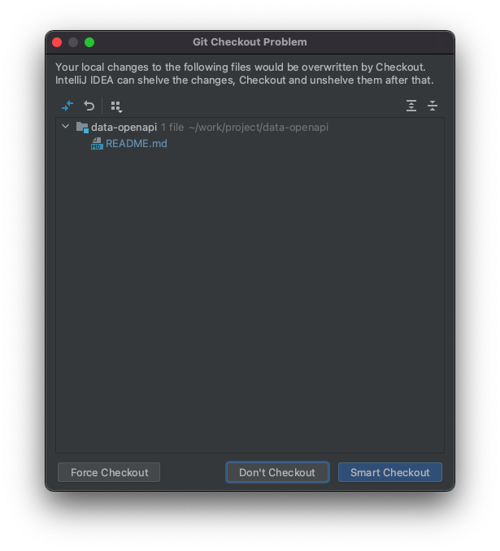

# git checkout

## 切换分支

从当前分支切换到A分支：

```
$ git checkout A
```

当checkout后面的分支不存在，但是正好存在一个远程分支与这个分支相匹配，那么这个命令相当于：

```
$ git checkout -b <branch> --track <remote>/<branch>
```

一个比较常见的场景是，当我们在release分支上开发了一部分后，发现用错分支了，其实应该使用feature分支进行开发，我们可以直接切换分支：

```
$ git checkout feature
```

如果没有任何冲突则会直接切换。

但是如果release分支上修改的内容和feature分支上已有的内容产生冲突的时候，执行上述命令则会报错：

```
$ git checkout feature
error: Your local changes to the following files would be overwritten by checkout:
	README.md
Please commit your changes or stash them before you switch branches.
Aborting
```

这个时候，可以尝试使用`-m --merge`参数：

```
$ git checkout -m feature
```

此命令会将冲突的内容进行合并，然后我们可以通过`git diff`查看冲突，并进行处理。

也可以如下操作：

1. `git stash`
2. `git checkout`
3. `git stash pop`
4. `git diff` (若有冲突)

如果我们想创建一个新分支newtest，并切换到这个分支：

```
$ git checkout -b newtest 
```

## 还原暂存区

- 将README.md恢复至暂存区的内容

  ```
  $ git checkout README.md
  ```

  注意：

  - 还原暂存区全部文件，用`.`代替文件名即可 

  - 最好在文件名前加上`--`，防止和分支名重名

    ```
    $ git checkout -- README.md
    ```

  - 还可以用通配符，例如：

    还原暂存区所有java文件

    ```
    $ git checkout -- '*.java'
    ```

- 将某分支的某文件还原至工作区

  将master分支的README.md文件恢复至工作区

  ```
  $ git checkout master -- README.md
  ```

## IDEA checkout

在idea中，同上述例子，当前分支是release，我们想切换到feature分支进行开发，我们右键某分支然后点击chekout即可完成checkout。

但是当我们当前的release分支和feature分支发生冲突的时候，会弹出如下框：



- Force Checkout

  > If you click Force Checkout, your local uncommitted changes will be overwritten, and you will lose them.

  相当于执行了如下操作：

  ```
  git checkout --force feature
  ```

  效果是我们在release分支上工作区的内容将被丢弃。

- Smart Checkout

  > If you click Smart Checkout, IntelliJ IDEA will shelve uncommitted changes, check out the selected branch, and then unshelve the changes. If a conflict occurs during the unshelve operation, you will be prompted to merge the changes. 

  将会shelve本地修改（shelve是IDEA提供的保存工作区的功能，与`git stash`类似），check out后，再unshelve，如果此时有冲突将会提示你进行修改。

**checkout和reset的区别**

都可以用于恢复指定快照的指定文件，reset命令(`--mixed`)只将指定文件恢复到暂存区，而checkout命令是同时覆盖暂存区和工作目录。

## References

1. Git官方文档：[git-checkout - Switch branches or restore working tree files](https://git-scm.com/docs/git-checkout)
2. Jetbrains官方文档：[Check out branches (git-checkout)](https://www.jetbrains.com/help/idea/manage-branches.html#checkout-Git-branch)