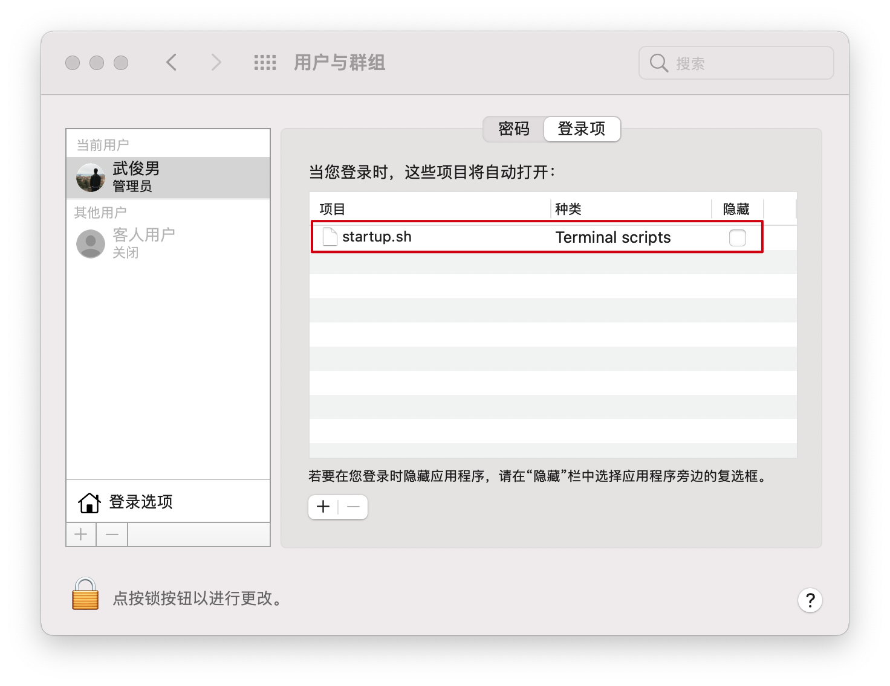
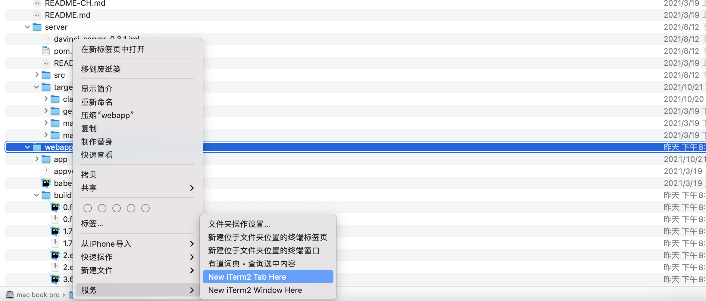

# Mac

## Mac快捷键

- 创建文件的快捷方式/替身

  `Command+Option+文件移动`

- 显示隐藏文件、文件夹

  `Command+Shift+. `
  
- 显示一个应用打开的所有窗口

  `Control + 向上箭头`

## Mac环境变量

Mac系统的环境变量，加载顺序为： 

```
a. /etc/profile 
b. /etc/paths 
c. ~/.bash_profile 
d. ~/.bash_login 
e. ~/.profile 
f. ~/.bashrc 
```

a. /etc/profile

```
➜  /etc cat profile
# System-wide .profile for sh(1)

if [ -x /usr/libexec/path_helper ]; then
	eval `/usr/libexec/path_helper -s`
fi

if [ "${BASH-no}" != "no" ]; then
	[ -r /etc/bashrc ] && . /etc/bashrc
fi
```

b. /etc/paths

```
➜  /etc cat paths
/usr/local/bin
/usr/bin
/bin
/usr/sbin
/sbin
```

其中a和b是系统级别的，系统启动就会加载，其余是用户接别的。c,d,e按照从前往后的顺序读取，如果c文件存在，则后面的几个文件就会被忽略不读了，以此类推。~/.bashrc没有上述规则，它是bash shell打开的时候载入的。这里建议在c中添加环境变量

 **查看所有的环境变量**

```
$ env
```

注意：

- 与DOS/Window不同，UNIX类系统环境变量中路径名用`:`分隔，不是分号。

- `$`在Linux脚本中的作用是申明变量

- Linux export 命令

  Linux export 命令用于设置或显示环境变量

  ```
  export [-fnp][变量名称]=[变量设置值]
  ```

**如何添加环境变量**


**如何查看PATH环境变量**

```
$ echo $PATH
```

**如何将添加PATH变量**

- /etc/paths

  这个是系统级别的

  不建议修改paths文件

  可以在paths.d文件夹中添加文件

  ```
  $ echo "/usr/local/sbin/mypath" | sudo tee test
  ```

  执行完之后需要重启终端

## Mac开启自启

方式一：设置/用户与群组/登陆项



startup.sh如下：

```
sh /Users/wujunnan/WWW/apache-tomcat-7.0.90/bin/startup.sh
```

那么开机后，就会自动启动tomcat

方式二：launchd

https://blog.csdn.net/kevinlou2008/article/details/49155497

https://www.launchd.info/

https://en.wikipedia.org/wiki/Launchd

https://stackoverflow.com/questions/28063598/error-while-executing-plist-file-path-had-bad-ownership-permissions

## 访达

- 查看隐藏文件夹

  例如`/usr/local`

  - 方式一：

    `Command+Shift+G`打开路径跳转，输入目标路径跳转即可

  - 方式二：

    `Command+空格` 打开全局搜索，输入跳转即可

- 复制文件路径

  - 方式一：

    `Command+Option+C`

  - 方式二：

    打开文件，按住`Option`的同时，按下右键，即可复制文件路径

## Chrome

- 切换标签页

  `ctrl+tab`

## 终端

### 快捷键

- 删除光标之前到行首的字符

  `Ctrl + u` 

- 删除光标到行尾的字符

  `Ctrl + k`

- 光标移动到行首(Ahead of line)，相当于通常的Home键

  `Ctrl + a`

- 光标移动到行尾(End of line)

  `Ctrl + e`

- 取消(cancel)当前行输入的命令，相当于Ctrl + Break

  `Ctrl + c `

- 清屏，相当于执行clear命令

  `Ctrl + l `

### autojump

[官方仓库点击这里](https://github.com/wting/autojump)

这个工具为你的目录维护了一个数据库，只要你访问过这个目录，后续就可以直接直接 `j doc`，其中有模糊匹配，纠错，并根据熟练度进行选择，非常强大。

## item2

- 新建窗口

  `command + t` 

- 新建窗口

  `command + t` 

- 垂直分屏

  `command + d` 

- 水平分屏

  `command + shift + d`  

- 在最近使用的分屏直接切换

  `command + option + 方向键`

  `command + ]` 和 `command + [`

- 查看历史命令

  `command + ;`

- 复制粘贴

  鼠标选中复制，鼠标中键粘贴

- 列出剪切板历史

  `command + shift + h`

  

问题：

- 关于mac下iterm2无权访问某些文件夹，并提示`ls .: Operation not permitted`

  系统偏好设置 -> 安全性与隐私 -> 隐私 -> 文件和文件夹，发现iterm下面的“桌面和文件夹”没有被选中，把这一项打上勾，然后重启iterm2

技巧：

- 自动输入命令

  输入打头几个字母，然后输入 `command + ;` iterm2 将自动列出之前输入过的类似命令。 　　

- 在某个文件夹上右键，可以选择使用item2在此建立窗口

  

## Hombrew

Homebrew是一款Mac OS平台下的软件包管理工具，拥有安装、卸载、更新、查看、搜索等很多实用的功能。简单的一条指令，就可以实现包管理，而不用你关心各种依赖和文件路径的情况，十分方便快捷。

- 查看当前的镜像源

  ```
  $ brew config
  ```
  
- 查询可用包

  ```
  $ brew search <packageName>
  ```

- 查看安装的软件列表

  ```
  $ brew list
  ```

- 查看某个软件的列表

  ```
  $ brew list nginx
  ```

- 查找包中所有的文件

  ```
  $ brew ls nginx
  ```

- 查看已安装的信息

  ```
  $ brew info maven
  ```
  
- 切回官方源

  ```
  $ cd "$(brew --repo)"
  $ git remote set-url origin https://github.com/Homebrew/brew.git
  ```
  
  


### 常用软件

- trash

  当mac使用`rm -rf`这个及其危险的命令删除的时候，有个回收站。

  - 安装

    ```
    $ brew install trash
    ```

  - 替换命令

    在`.zshrc`文件中添加：

    ```
    alias rm=trash
    ```
  
  - 删除的文件就会出现在Mac的回收站中，即`.Trash`

## 文本编辑器

**当作账号密码记录方案**

由于工作中存在大量的账号密码需要管理，而且需要经常打开（轻量级，pass Excel），所以我选择使用系统自带的文本编辑器来承担该任务。

但是呢，有个痛点就是在经常复制的过程中，总会无意改变文本，经过各种摸索，包括：

- `chmod u-x password.txt`

  首先改变必须需要打开终端输入命令，效果就是文件名上会显示已锁定，而且一编辑就可以选择取消锁定。

- 菜单栏 - 格式 - 防止编辑

  缺点就是再次打开这个文件防止编辑就失效了。

- 点击标题旁边的向下箭头——已锁定

  

第三种是我目前选择的最优解。

2021/11/08 更新：换成了Typora，格式更加清晰，同样可以使用上述最后一种锁定文件的方案 。

- 

## Oh My Zsh

配置命令高亮

- 安装

  ```
  brew install zsh-syntax-highlighting
  ```

- 配置

  在` ~/.zshrc`中添加下面配置

  ```
  source /usr/local/share/zsh-syntax-highlighting/zsh-syntax-highlighting.zsh
  ```


## Sublime

- 进入列编辑模式

  `command + shift + L`

- 列编辑移动到首位

  `command + 左 右`
  
- 替换所有空行

  - 打开替换

    `option+command+F `

  - 勾选正则，匹配中输入

    `^\n`

    (正则中`^`表示数据字符串的开始位置)

## References

- https://cnbin.github.io/blog/2015/06/20/iterm2-kuai-jie-jian-da-quan/
- https://www.launchd.info/
