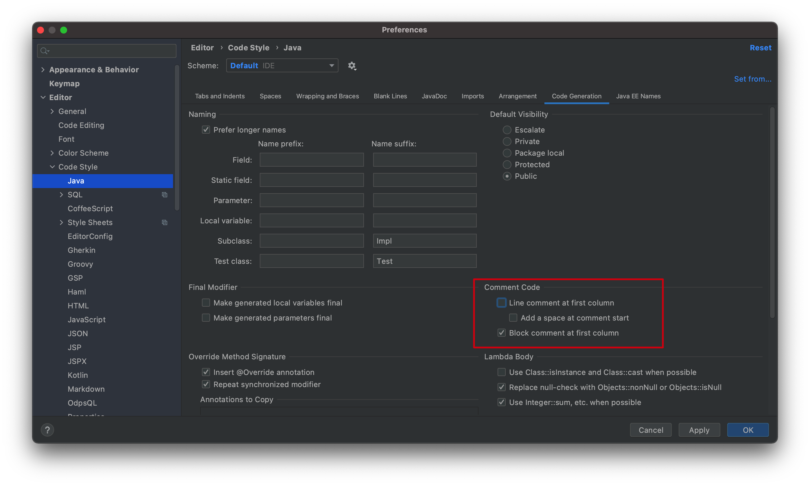
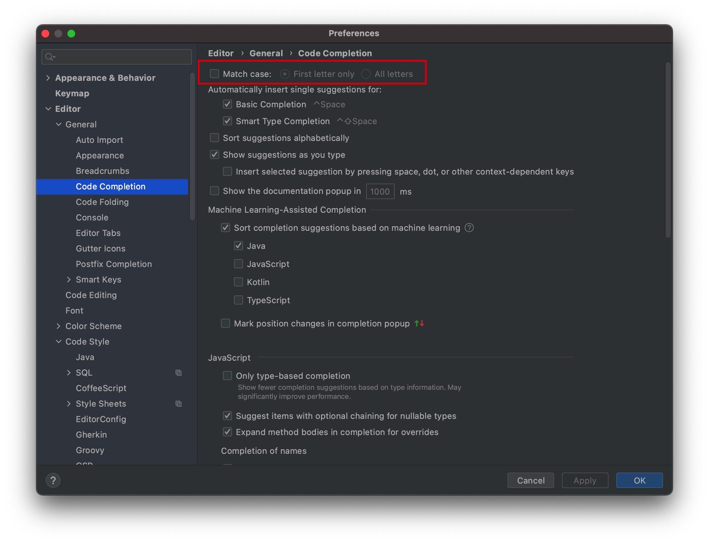
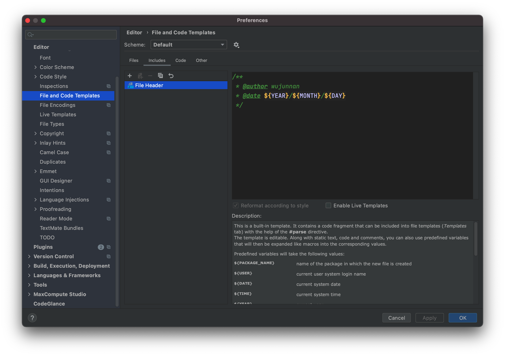
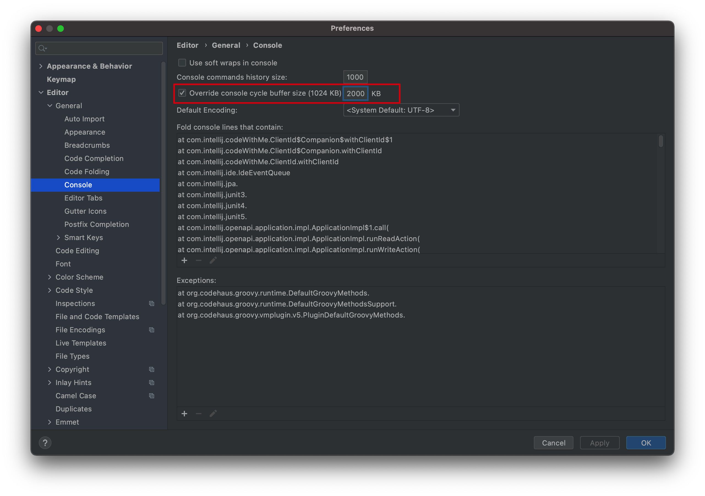
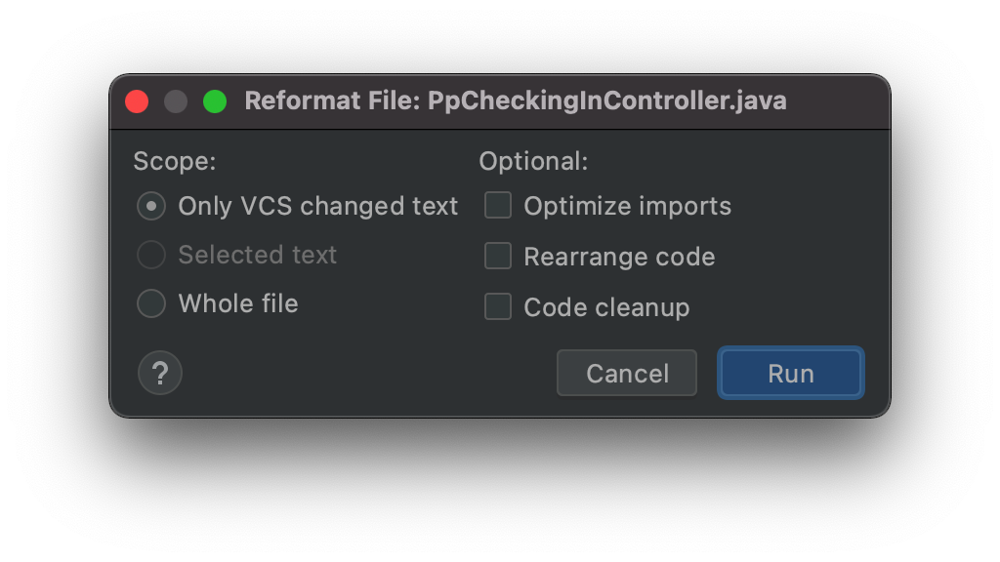
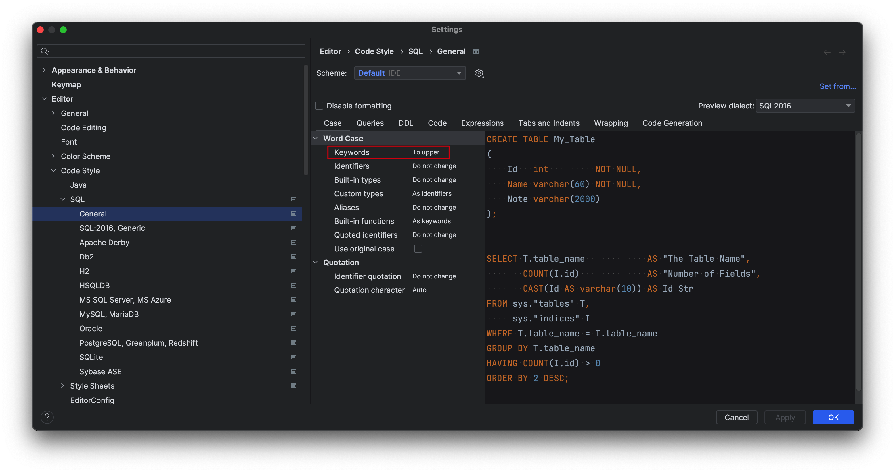
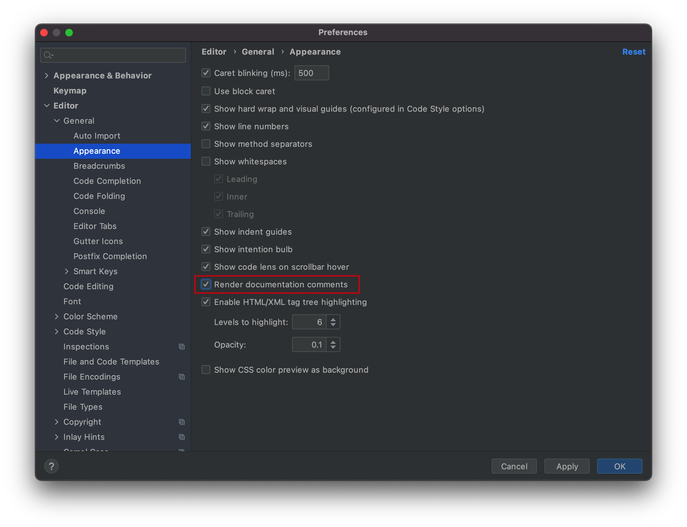
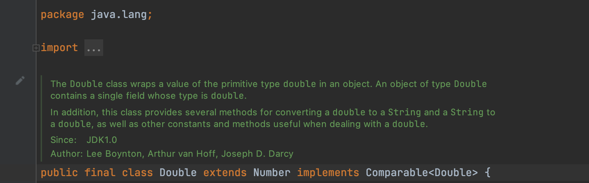
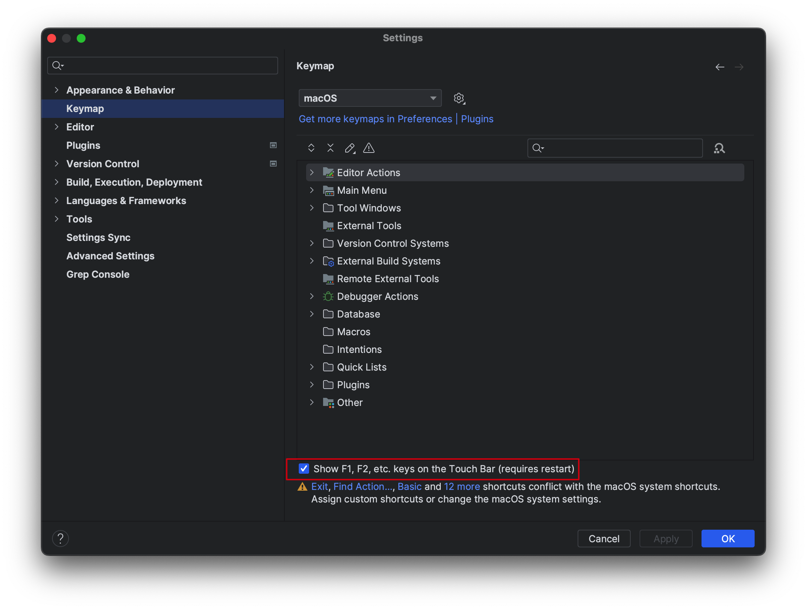

# IDEA

本文基于Mac版本的IDEA。

## 快捷键

（快捷键类型为Mac）

### 光标导航

- 最近浏览的文件

  `Command+E` 

- 各视图区域的切换

  `Command + 视图区域对应的数字`

- [调整某个窗口的大小](https://www.jetbrains.com/help/idea/manipulating-the-tool-windows.html#resize)

  `Control+Option+方向`

- 查看当前文件所处的位置

  `Alt+F1`

- [切换tab页](https://www.jetbrains.com/help/idea/using-code-editor.html#switcher)

  `Contorl+Tab`

- [查看某个类在哪个地方被使用](https://www.jetbrains.com/help/idea/navigating-through-the-source-code.html#go_to_declaration)

  `Command+B`

- [跳转到某个抽象方法的实现](https://www.jetbrains.com/help/idea/navigating-through-the-source-code.html#go_to_implementation)

  `Command+Option+B`

- 跳转到某个方法的抽象方法

  `Command+U`

- [查看该类中的方法](https://www.jetbrains.com/help/idea/navigating-through-the-source-code.html#use_structure_view)

  `Command+F12`

- [在一个类中的不同方法之间进行跳转](https://www.jetbrains.com/help/idea/navigating-through-the-source-code.html#method_navigation)

  `Contrl+Shift+方向`

### 代码

- 插入

  `Command+N`

- 整段加注释

  `Shift+Control+/`

- 重写方法

  `Control+O`

- 添加类

  `Option+Enter`

- 打开项目结构对话框

  `Command+;` 

- 基本的代码补全

  `Ctrl+Space` 

- 自动生成变量名

  `Command+Option+V`

- 大小写切换

  `Command+Shift+U`

- 看每一行的编辑者是谁

  `右键+annotate`

- 代码格式化

  `Ctrl+Alt+L`

- [输入方法时显示参数提示](https://www.jetbrains.com/help/idea/viewing-reference-information.html#view-parameter-info)

  `Command+P`

- [查看某个类的Quick Documentation](https://www.jetbrains.com/help/idea/viewing-reference-information.html#quick-doc-popup)

  `F1`

## IDEA列编辑

- 选择多行

  按住`Option`，加鼠标上下滑动即可选择多行进行编辑。

- 一次选择全部（数百行）

  `Command+A`选择全部，`Command+Shift+8`进入列编辑模式即可。

- 新增行（不同位置）

  按住`Option+Shift`，鼠标点击其他行，即可选择不同位置的光标。

- 回到多行的行尾

  按`Home`或`End`按键，即可将光标移动到行首或行尾，**即使尾部没有对齐也可以**。

- 多行的光标左右移动单词

  像在单行编辑一样，`Option+方向`。

## IDEA好用插件

### Lombok

略，新版IDEA默认就会安装。

### Alibaba Java Coding Guidelines

阿里代码格式检查。

### Grep Console

自定义控制器输出日志格式。

### Free Mybatis Plugin

Free MyBatis Tool 是一款增强idea对mybatis支持的插件。

>  主要功能如下：
>
> - 生成mapper xml文件
> - 快速从代码跳转到mapper及从mapper返回代码
> - mybatis自动补全及语法错误提示
> - 集成mybatis generator gui界面
> - 根据数据库注解，生成swagger model注解

### SQL Params Setter

一款将预查询语句和参数转换为SQL语句的插件。

当然同类插件也有更出名的mybatis log plugin，但是开始收费了，就找了个代替的。

说明如下：

>A simple tool that helps you to extract a executable sql from mybatis logs like below:
>==> Preparing: select * from table where name = ?
>==> Parameters: Tom(String)
>After selecting these two lines of logs above, you can right click your mouse and select "SQL Params Setter" in the popup menu, then the result executable sql, i.e. "select * from table where name = 'Tom'" will be copied to your clipboard.
>
>Note:
>The selected area should contain both keyword [Preparing:] in the 1st line and keyword [Parameters:] in the 2nd line.

### CamelCase

各种驼峰，蛇形等各种形式的转换。

IDEA自带的有大小写转换，但是实际上遇到数据库中的蛇形字段转换成驼峰的需求的时候，就无法满足了，可以使用此插件。

说明如下：

> Switch easily between kebab-case, SNAKE_CASE, PascalCase, camelCase, snake_case or space case. See Edit menu or use ⇧ + ⌥ + U / Shift + Alt + U. Allows to disable some conversions or change their order in the preferences.

### POJO to JSON

将POJO转换为JSON方便接口调试，使用postman调试的时候，可以直接将pojo复制成json的格式放入请求体。

### Json Formatter

可以进行Json的格式校验和格式化。

说明如下：

>Usage: Paste JSON string into editor, and press Reformat Code (Ctrl/Command + Alt + L in windows) to format code as if you editing a file with .json suffix.

### RestfulToolkit

一套 RESTful 服务开发辅助工具集。

功能如下：

1. 根据 URL 直接跳转到对应的方法定义 ( `Ctrl \` or `Ctrl Alt N` );
2. 提供了一个 Services tree 的显示窗口;
3. 一个简单的 http 请求工具;
4. 在请求方法上添加了有用功能: 复制生成 URL;,复制方法参数...
5. 其他功能: java 类上添加 Convert to JSON 功能，格式化 json 数据 ( Windows: `Ctrl + Enter`; Mac:`Command + Enter` )。

### Convert YAML and Properties File

在YAML文件和Properties文件上点击右键即可将二者进行转换。

## IDEA配置

### 双斜杠注释紧贴代码而不是在行首



效果：

```
修改前：
//    public ...
修改后：
    //public ...
```

### 代码提示取消大小写匹配



### 创建文件的时候，自动创建文件头注释



如下：

```
/**
 * @author wujunnan
 * @date ${YEAR}/${MONTH}/${DAY}
 */
```

- 设置控制台限制的文件总大小

  

### 格式化部分代码

当去别的组开发的时候，别人的代码可能存在没有格式化的情况，从而导致格式化后大量的修改，所以需要格式化部分代码

按快捷键`Command+Shift+Alt+L`，调出格式化配置对话框：



- Only VSC changed text

  > If this checkbox is selected, then reformatting will apply only to the files that have been changed locally, but not yet checked in to the repository.

  也就是未`git commit`的代码

- Optimize imports

  删除未使用的import语句

- Rearrange code

  根据`Code Style settings`的设置对代码格式化

- Code cleanup

  IDEA自动修复可能存在问题的代码

### 格式化SQL的将关键字变为大写



### 开启文档注释渲染视图



开启以后，我们自己写的代码的文档注释也会被渲染，例如如下代码：

```
package java.lang;

/**
 * The {@code Double} class wraps a value of the primitive type
 * {@code double} in an object. An object of type
 * {@code Double} contains a single field whose type is
 * {@code double}.
 *
 * <p>In addition, this class provides several methods for converting a
 * {@code double} to a {@code String} and a
 * {@code String} to a {@code double}, as well as other
 * constants and methods useful when dealing with a
 * {@code double}.
 *
 * @author  Lee Boynton
 * @author  Arthur van Hoff
 * @author  Joseph D. Darcy
 * @since JDK1.0
 */
public final class Double extends Number implements Comparable<Double> {
	//...
}
```

渲染后如下：



注意：

@data tag并不是Java约定的tag，所以在某些版本（2020.3不会渲染，但是2022.3会进行渲染）不会进行渲染，详见[Javadoc Tool](https://www.oracle.com/technical-resources/articles/java/javadoc-tool.html)。

### Mac Touch Bar显示F1、F2等



## 配置Java远程Debug

**服务端**

在启动程序的时候，加上如下参数，即可开启Debug模式

```
-Xdebug  -Xrunjdwp:transport=dt_socket,server=y,suspend=n,address=8089
```

**客户端**

在IDEA中添加Remote-JVM Debug，配置如下图所示：


## iml文件

iml文件是Intelij在你的根目录创建的一个文件，它对你的代码没有任何影响。

这个文件和代码无关，**不应该被git管理**，即使你的代码没有变动，这个文件也会有变化，而且maven等都可以创建此文件。

## References

1. 官方文档：[Reformat File dialog](https://www.jetbrains.com/help/idea/2021.2/reformat-file-dialog.html)
