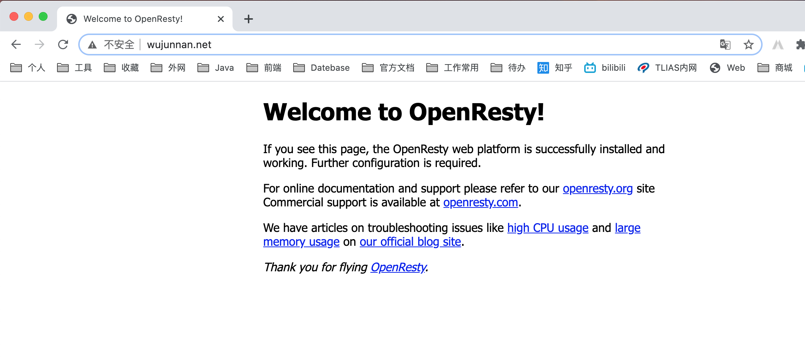

# Nginx

## 安装

### 安装lua

### 安装openResty

OpenResty 相当于封装了nginx，并且集成了lua脚本。

使用yum暗转的openResty默认在`usr/local/openresty`目录下，里面包括nginx

### nginx结构

nginx下主要的文件夹

```
conf  html  logs  sbin
```

- conf

  里面包含`nginx.conf`

  ```nginx
  user root root;
  worker_processes  1;
  
  #error_log  logs/error.log;
  #error_log  logs/error.log  notice;
  #error_log  logs/error.log  info;
  
  #pid        logs/nginx.pid;
  
  
  events {
      worker_connections  1024;
  }
  
  
  http {
      include       mime.types;
      default_type  application/octet-stream;
  
      #log_format  main  '$remote_addr - $remote_user [$time_local] "$request" '
      #                  '$status $body_bytes_sent "$http_referer" '
      #                  '"$http_user_agent" "$http_x_forwarded_for"';
  
      #access_log  logs/access.log  main;
  
      sendfile        on;
      #tcp_nopush     on;
  
      #keepalive_timeout  0;
      keepalive_timeout  65;
  
      #gzip  on;
  
      server {
          listen       80;
          server_name  localhost;
  
          #charset koi8-r;
  
          #access_log  logs/host.access.log  main;
  
          location / {
              root   html;
              index  index.html index.htm;
          }
  
          #error_page  404              /404.html;
  
          # redirect server error pages to the static page /50x.html
          #
          error_page   500 502 503 504  /50x.html;
          location = /50x.html {
              root   html;
          }
  
          # proxy the PHP scripts to Apache listening on 127.0.0.1:80
          #
          #location ~ \.php$ {
          #    proxy_pass   http://127.0.0.1;
          #}
  
          # pass the PHP scripts to FastCGI server listening on 127.0.0.1:9000
          #
          #location ~ \.php$ {
          #    root           html;
          #    fastcgi_pass   127.0.0.1:9000;
          #    fastcgi_index  index.php;
          #    fastcgi_param  SCRIPT_FILENAME  /scripts$fastcgi_script_name;
          #    include        fastcgi_params;
          #}
  
          # deny access to .htaccess files, if Apache's document root
          # concurs with nginx's one
          #
          #location ~ /\.ht {
          #    deny  all;
          #}
      }
  
  
      # another virtual host using mix of IP-, name-, and port-based configuration
      #
      #server {
      #    listen       8000;
      #    listen       somename:8080;
      #    server_name  somename  alias  another.alias;
  
      #    location / {
      #        root   html;
      #        index  index.html index.htm;
      #    }
      #}
  
  
      # HTTPS server
      #
      #server {
      #    listen       443 ssl;
      #    server_name  localhost;
  
      #    ssl_certificate      cert.pem;
      #    ssl_certificate_key  cert.key;
  
      #    ssl_session_cache    shared:SSL:1m;
      #    ssl_session_timeout  5m;
  
      #    ssl_ciphers  HIGH:!aNULL:!MD5;
      #    ssl_prefer_server_ciphers  on;
  
      #    location / {
      #        root   html;
      #        index  index.html index.htm;
      #    }
      #}
  
  }
  ```

  

- sbin

  里面是nginx

- html

  里面就是存放静态资源的

- logs

### nginx简单命令

- 运行nginx

  ```
  /usr/local/openresty/nginx/sbin/nginx
  ```

  运行的时候还可以指定配置文件的位置

  ```
  /usr/local/openresty/nginx/sbin/nginx -c /usr/local/openresty/nginx/conf/nginx.conf
  ```

- 检查配置

  ```
  /usr/local/openresty/nginx/sbin/nginx -t
  ```

- 重新载入配置

  ```
  /usr/local/openresty/nginx/sbin/nginx -s reload
  ```

- 重启nignx

  ```
  /usr/local/openresty/nginx/sbin/nginx -s reopen 
  ```

- 停止nignx

  ```
  /usr/local/openresty/nginx/sbin/nginx -s stop 
  ```

- 查看进程

  ```
  ps aux | grep nginx
  ```

启动nginx后，nginx默认监听的是80端口，我们直接访问服务器就能直接看到下图




在/root/lua目录下创建ad_load.lua ，实现连接mysql  查询数据 并存储到redis中

```lua
ngx.header.content_type="application/json;charset=utf8"
local cjson = require("cjson")
local mysql = require("resty.mysql")
local uri_args = ngx.req.get_uri_args()
local position = uri_args["position"]

local db = mysql:new()
db:set_timeout(1000)  
local props = {  
    host = "192.168.200.128",  
    port = 3306,  
    database = "changgou_business",  
    user = "root",  
    password = "root"  
}

local res = db:connect(props)  
local select_sql = "select url,image from tb_ad where status ='1' and position='"..position.."' and start_time<= NOW() AND end_time>= NOW()"  
res = db:query(select_sql)  
db:close()  

local redis = require("resty.redis")
local red = redis:new()
red:set_timeout(2000)

local ip ="192.168.200.128"
local port = 6379
red:connect(ip,port)

red:set("ad_"..position,cjson.encode(res))
red:close()

ngx.say("{flag:true}")
```

修改`nginx.conf`

```nginx
#user  nobody;
user root root;
worker_processes  1;

#error_log  logs/error.log;
#error_log  logs/error.log  notice;
#error_log  logs/error.log  info;

#pid        logs/nginx.pid;

events {
    worker_connections  1024;
}

http {
    include       mime.types;
    default_type  application/octet-stream;
    sendfile        on;
    #tcp_nopush     on;

    #keepalive_timeout  0;
    keepalive_timeout  65;

    #gzip  on;

    server {
        listen       80;
        server_name  localhost;
        charset utf-8;
        #access_log  logs/host.access.log  main;
        # 添加
        location /ad_update {
            content_by_lua_file /root/lua/ad_update.lua;
        }
        
        # redirect server error pages to the static page /50x.html
        #
        error_page   500 502 503 504  /50x.html;
        location = /50x.html {
            root   html;
        }        
    }
}
```

## nginx配置

### location

`=` 开头表示精确匹配

`/` 通用匹配，任何请求都会匹配到

精确匹配 = >>  以xx开头匹配^~  >>  按文件中顺序的正则匹配 >> 最后是/通用匹配

当有匹配成功时候，停止匹配，按当前匹配规则处理请求

```NGINX
location / {
    # dw-web-ui
    root   D:\work\dist;
    index  index.html index.htm;
    #try_files $uri $uri/ /dw-web-ui/index.html;
    try_files $uri $uri/ /usertag/index.html;
}
```

### try_files

```
格式1: try_files file ... uri; 

格式2: try_files file ... =code;
```

- 按指定的file顺序查找存在的文件，并使用第一个找到的文件进行请求处理
- 查找路径是按照给定的root或alias为根路径来查找的
- 如果给出的file都没有匹配到，则重新请求最后一个参数给定的uri，就是新的location匹配
- 如果是格式2，如果最后一个参数是 = 404 ，若给出的file都没有匹配到，则最后返回404的响应码

##### 举例说明

```nginx
location /images/ {
    root /opt/html/;
    try_files $uri   $uri/  /images/default.gif; 
}
```

比如，请求 127.0.0.1/images/test.gif 会依次查找 

- 文件/opt/html/images/test.gif 
- 文件夹 /opt/html/images/test.gif/下的index文件
- 请求127.0.0.1/images/default.gif

##### 实战

```nginx
location / {
  root   /Users/wujunnan/develop/work/dist;
  index  index.html index.htm;
  #try_files $uri $uri/ /dw-web-ui/index.html;
  try_files $uri $uri/ /usertag/index.html;
}
```

含义就是先访问`/Users/wujunnan/develop/work/dist;`+uri访问的资源是否存在，存在的话就访问，不存在的话访问`/usertag/index.html`

```NGINX
location /usertag/ {
    root   D:\work\dist;
    index  index.html index.htm;
    try_files $uri $uri/ /usertag/index.html;
    add_header Cache-Control "max-age=0";
    # add_header Cache-Control "no-cache";
}
```

### Cache-Control

Cache-Control：no-cache，强制每次请求直接发送给源服务器，而不经过本地缓存版本的校验。这对于需要确认认证应用很有用（可以和public结合使用），或者严格要求使用最新数据 的应用（不惜牺牲使用缓存的所有好处）. 通俗解释：浏览器通知服务器，本地没有缓存数据

cache-control :
    max-age>0时 直接从游览器缓存中提取;
    max-age<=0 时向server发送http请求确认 ,该资源是否有修改, 有的话 返回200 , 无的话 返回304。

### proxy_pass

```nginx
location /cas/ {
    proxy_pass http://localhost:8080;
}
```

在nginx中配置proxy_pass代理转发时，如果在proxy_pass后面的url加/，表示绝对根路径；如果没有/，表示相对路径，把匹配的路径部分也给代理走

在本例中，8080后面没有/，也就意味着会将上面的cas也给代理走

### vhost

vhost配置文件的作用是为了将更多的server配置文件的信息，单独存放，不至于集中在nginx.conf配置中，这样有助于查找问题

http块中添加include vhosts/*.conf，然后在nginx目录下的vhosts目录中新增xxx.conf

## 访问流程

```nginx
server {
    listen       80;
    server_name  localhost;

    #charset koi8-r;

    #access_log  logs/host.access.log  main;

    location / {
        # dw-web-ui
        root   D:\work\dist;
        index  index.html index.htm;
        #try_files $uri $uri/ /dw-web-ui/index.html;
        try_files $uri $uri/ /usertag/index.html;
    }

    location /usertag/ {
        root   D:\work\dist;
        index  index.html index.htm;
        try_files $uri $uri/ /usertag/index.html;
        add_header Cache-Control "max-age=0";
        # add_header Cache-Control "no-cache";
    }

    location /analysis/ {
        root   D:\work\dist;
        index  index.html index.htm;
        try_files $uri $uri/ /analysis/index.html;
        add_header Cache-Control "max-age=0";
        # add_header Cache-Control "no-cache";
    }


    location /data-web/ {
        proxy_pass http://localhost:9010;
    }

    location /cas/ {
        proxy_pass http://localhost:8080;
    }

    #error_page  404              /404.html;

    # redirect server error pages to the static page /50x.html
    #
    error_page   500 502 503 504  /50x.html;
    location = /50x.html {
        root   html;
    }
}
```

输入localhost/analysis后nginx中的请求日志

```
127.0.0.1 - - [01/Mar/2021:15:42:50 +0800] "GET /analysis/ HTTP/1.1" 304 0 "-" "Mozilla/5.0 (Windows NT 10.0; Win64; x64) AppleWebKit/537.36 (KHTML, like Gecko) Chrome/88.0.4324.190 Safari/537.36"
127.0.0.1 - - [01/Mar/2021:15:42:50 +0800] "GET /analysis/static/css/chunk-vendors.0eaad782.css HTTP/1.1" 304 0 "http://localhost/analysis/" "Mozilla/5.0 (Windows NT 10.0; Win64; x64) AppleWebKit/537.36 (KHTML, like Gecko) Chrome/88.0.4324.190 Safari/537.36"
127.0.0.1 - - [01/Mar/2021:15:42:50 +0800] "GET /analysis/static/css/index.ceee3654.css HTTP/1.1" 304 0 "http://localhost/analysis/" "Mozilla/5.0 (Windows NT 10.0; Win64; x64) AppleWebKit/537.36 (KHTML, like Gecko) Chrome/88.0.4324.190 Safari/537.36"
127.0.0.1 - - [01/Mar/2021:15:42:50 +0800] "GET /analysis/static/js/chunk-vendors.7b2a99f3.js HTTP/1.1" 304 0 "http://localhost/analysis/" "Mozilla/5.0 (Windows NT 10.0; Win64; x64) AppleWebKit/537.36 (KHTML, like Gecko) Chrome/88.0.4324.190 Safari/537.36"
127.0.0.1 - - [01/Mar/2021:15:42:50 +0800] "GET /analysis/static/js/index.7113c2e4.js HTTP/1.1" 304 0 "http://localhost/analysis/" "Mozilla/5.0 (Windows NT 10.0; Win64; x64) AppleWebKit/537.36 (KHTML, like Gecko) Chrome/88.0.4324.190 Safari/537.36"
127.0.0.1 - - [01/Mar/2021:15:42:50 +0800] "GET /analysis/static/css/chunk-23a86bb0.0832fe77.css HTTP/1.1" 304 0 "http://localhost/analysis/" "Mozilla/5.0 (Windows NT 10.0; Win64; x64) AppleWebKit/537.36 (KHTML, like Gecko) Chrome/88.0.4324.190 Safari/537.36"
127.0.0.1 - - [01/Mar/2021:15:42:50 +0800] "GET /analysis/static/css/chunk-8caa4b5a.312d4a24.css HTTP/1.1" 304 0 "http://localhost/analysis/" "Mozilla/5.0 (Windows NT 10.0; Win64; x64) AppleWebKit/537.36 (KHTML, like Gecko) Chrome/88.0.4324.190 Safari/537.36"
127.0.0.1 - - [01/Mar/2021:15:42:50 +0800] "GET /analysis/static/css/chunk-da90a3d0.0028ddf8.css HTTP/1.1" 304 0 "http://localhost/analysis/" "Mozilla/5.0 (Windows NT 10.0; Win64; x64) AppleWebKit/537.36 (KHTML, like Gecko) Chrome/88.0.4324.190 Safari/537.36"
127.0.0.1 - - [01/Mar/2021:15:42:50 +0800] "GET /analysis/static/js/chunk-23a86bb0.81554dc6.js HTTP/1.1" 304 0 "http://localhost/analysis/" "Mozilla/5.0 (Windows NT 10.0; Win64; x64) AppleWebKit/537.36 (KHTML, like Gecko) Chrome/88.0.4324.190 Safari/537.36"
127.0.0.1 - - [01/Mar/2021:15:42:50 +0800] "GET /analysis/static/js/chunk-2d0db2a8.100e037d.js HTTP/1.1" 304 0 "http://localhost/analysis/" "Mozilla/5.0 (Windows NT 10.0; Win64; x64) AppleWebKit/537.36 (KHTML, like Gecko) Chrome/88.0.4324.190 Safari/537.36"
127.0.0.1 - - [01/Mar/2021:15:42:50 +0800] "GET /analysis/static/js/chunk-2d22d366.ba278505.js HTTP/1.1" 304 0 "http://localhost/analysis/" "Mozilla/5.0 (Windows NT 10.0; Win64; x64) AppleWebKit/537.36 (KHTML, like Gecko) Chrome/88.0.4324.190 Safari/537.36"
127.0.0.1 - - [01/Mar/2021:15:42:50 +0800] "GET /analysis/static/js/chunk-8caa4b5a.16aab16a.js HTTP/1.1" 304 0 "http://localhost/analysis/" "Mozilla/5.0 (Windows NT 10.0; Win64; x64) AppleWebKit/537.36 (KHTML, like Gecko) Chrome/88.0.4324.190 Safari/537.36"
127.0.0.1 - - [01/Mar/2021:15:42:50 +0800] "GET /analysis/static/js/chunk-da90a3d0.eef2ab5a.js HTTP/1.1" 304 0 "http://localhost/analysis/" "Mozilla/5.0 (Windows NT 10.0; Win64; x64) AppleWebKit/537.36 (KHTML, like Gecko) Chrome/88.0.4324.190 Safari/537.36"

127.0.0.1 - - [01/Mar/2021:15:42:57 +0800] "GET /data-web/user/detail?dataplatformCode=analysis HTTP/1.1" 302 0 "http://localhost/analysis/" "Mozilla/5.0 (Windows NT 10.0; Win64; x64) AppleWebKit/537.36 (KHTML, like Gecko) Chrome/88.0.4324.190 Safari/537.36"

127.0.0.1 - - [01/Mar/2021:15:42:57 +0800] "GET /cas/login?service=http://localhost/data-web/shiro-cas/analysis HTTP/1.1" 200 6636 "http://localhost/analysis/" "Mozilla/5.0 (Windows NT 10.0; Win64; x64) AppleWebKit/537.36 (KHTML, like Gecko) Chrome/88.0.4324.190 Safari/537.36"

127.0.0.1 - - [01/Mar/2021:15:42:58 +0800] "GET /data-web/index/analysis HTTP/1.1" 302 0 "http://localhost/analysis/" "Mozilla/5.0 (Windows NT 10.0; Win64; x64) AppleWebKit/537.36 (KHTML, like Gecko) Chrome/88.0.4324.190 Safari/537.36"

127.0.0.1 - - [01/Mar/2021:15:42:58 +0800] "GET /cas/login?service=http://localhost/data-web/shiro-cas/analysis HTTP/1.1" 200 6636 "http://localhost/analysis/" "Mozilla/5.0 (Windows NT 10.0; Win64; x64) AppleWebKit/537.36 (KHTML, like Gecko) Chrome/88.0.4324.190 Safari/537.36"
```

## 生产

### nginx限制IP

- 设置IP白名单

  ```nginx
  location /dap {
              allow 223.70.137.137;
              allow 223.70.137.130;
              allow 49.7.65.2;
              allow 49.7.65.3;
              allow 49.7.65.4;
              allow 49.7.65.14;
              allow 49.7.65.254;
              deny all;
              root    /data;
              try_files $uri $uri/ /dap/index.html;
              add_header Cache-Control max-age=0;
          }
  ```

- nginx更改默认403页面

  ```nginx
  server{
  	listen	443;
  	server_name	hxduat.kungeek.com;
  	error_page  403  /403.html;
  	...
  	}
  ```


