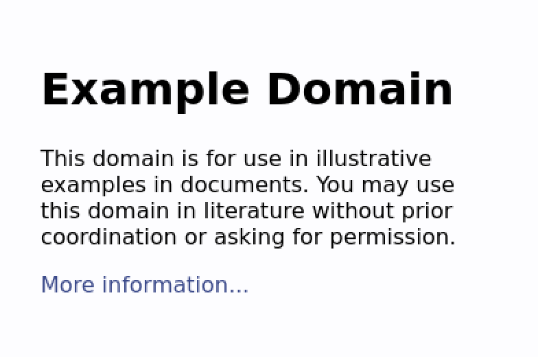

# PhantomJS

## 简介

PhantomJS，发音类似【fan·tm】，是一个无头Web浏览器，即没有用户界面的浏览器，它可以实现如下功能：

- 网站页面截图
- 页面操作自动化
- 网页监控
- 网页测试

2018年3月，PhantomJS由于内部矛盾，决定暂停开发。

## 基本使用

### 安装

#### Linux

- [下载对应版本](https://phantomjs.org/download.html)

- 解压即可

  ```
  $ tar -xjvf phantomjs-2.1.1-linux-x86_64.tar.bz2
  ```

#### Mac

```
$ brew install phantomjs
```

### 测试

#### Hello,word!

- 新建js文件夹，并新建hello.js

  ```js
  console.log('Hello, world!');
  phantom.exit();
  ```

- 运行

  ```
  $ cd bin/
  $ ./phantomjs ../js/hello.js
  Hello, world!
  ```

#### 获取参数

phantomjs可以通过命令行向脚本中传递参数，可以通过如下方式获取参数：

```js
var system = require('system');
var args = system.args;

if (args.length === 1) {
  console.log('Try to pass some arguments when invoking this script!');
} else {
  args.forEach(function(arg, i) {
    console.log(i + ': ' + arg);
  });
}
```

[参考官方文档](https://phantomjs.org/api/system/property/args.html)

#### Page Loading

- 新建js/get_image.js

  ```js
  var page = require('webpage').create();
  page.open('http://example.com', function(status) {
    console.log("Status: " + status);
      if(status === "success") {
          page.render('example.png');
          phantom.exit(0);
      } else {
          console.log(status, 'reason: ', page.reason);
          phantom.exit(1);
      }
  });
  ```

  代码含义：

  - 加载PhantomJS的webpage模块，并创建一个实例

  - open()方法，用于打开具体的网页

    第一个参数是网页的网址，第二个参数是回调函数，网页打开后该函数将会运行，它的参数是一个表示状态的字符串，如果打开成功就是success，否则就是fail

  - render方法用于将网页保存成图片，参数就是指定的文件名。该方法根据后缀名，将网页保存成不同的格式，目前支持PNG、GIF、JPEG和PDF

- 运行

  ```
  $ ./phantomjs ../js/get_image.js
  Status: success
  ```

- 我们可以得到如下截图：

  

注意：

- 当测试https网站的时候，例如`https://www.baidu.com`的时候，会报错

  加上如下参数运行：

  ```
  --ignore-ssl-errors=yes
  ```

## 应用

## Java调用

```java
public void testPhantomJS() throws IOException, InterruptedException {
    String url = "https://hxduat.xxx.com/report/company_operations_daily_report/multi-progress.html";
    String cmd = "phantomjs template/script/getImage.js" + " " + url;
    System.out.println("开始执行...");
    Runtime.getRuntime().exec(cmd).waitFor();
    System.out.println("执行结束!");
}
```

## References

1. https://phantomjs.org/
2. https://github.com/ariya/phantomjs
3. http://javascript.ruanyifeng.com/tool/phantomjs.html