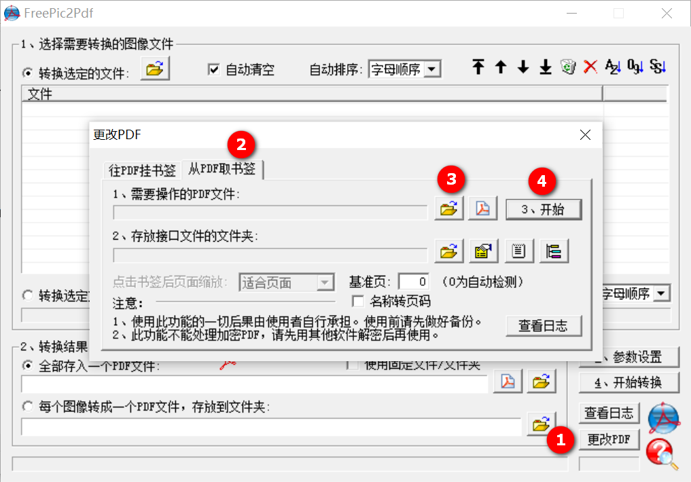

# PDF书签制作

## 所需软件

下载安装FreePic2Pd软件，只能在Windows上运行。

## 拆解PDF

打开软件 -> 更改pdf -> 从PDF取书签 -> 选择文件 ->  开始，如下图所示：



发现多了一个目录，一个ift文件，一个txt文件：

- txt文件即为目录文件

- ift为一些元数据信息

  例如：

  BasePage = 20表示txt文件中数字为1的，代表pdf中第20页。

## 查找目录

可以去豆瓣查找响应书籍的目录，如下所示：

```
第1章 Kubernetes入门 1
1.1 Kubernetes是什么 2
1.2 为什么要用Kubernetes 5
1.3 从一个简单的例子开始 6
1.3.1 环境准备 7
1.3.2 启动MySQL服务 7
1.3.3 启动Tomcat应用 10
1.3.4 通过浏览器访问网页 12
```

## 加工目录

目录需要加工上述目录为对应的格式并复制进txt文件，即每层级前面需要有一个制表符，最后的目录数字前也要有制表符，如下所示：

```
封面	-19
书名	-18
版权	-17
前言	-16
目录	-11
第1章 Kubernetes入门	1
	1.1 Kubernetes是什么	2
	1.2 为什么要用Kubernetes	5
	1.3 从一个简单的例子开始	6
		1.3.1 环境准备	7
		1.3.2 启动MySQL服务	7
		1.3.3 启动Tomcat应用	10
		1.3.4 通过浏览器访问网页	12
```

可以通过正则表达式替换来实现

- 替换一级目录

  将`^(\d{1,1}\.\d)`替换为`\t\1`。

- 替换二级目录

  将`^(\s\d{1,2}\.\d\.\d)`替换为`\t\t\1`。

- 替换行末尾数字

  将`(\d{1,3})$`替换为`\t\1`。

正则表达式解读：

- `^`代表行开头
- `\d`代表任何一个数字
- `{1,1}`表示前面元素重复的次数，最少1次，最多1次
- `\.`即点符号
- `$`即行末尾
- `\num`表示重复第num个括号里的内容匹配，`\1`即为之前匹配的内容

当然一般PDF前面都会有封面，目录等，导致PDF页码并不和目录对照，这就需要**修改ift文件中的BasePage**。

## 重装目录

打开软件 -> 更改pdf -> 往PDF上挂书签 -> 选择文件 ->  开始。

即可完成PDF的目录挂载，本文参考[此博客](https://blog.csdn.net/zane3/article/details/86307103)。