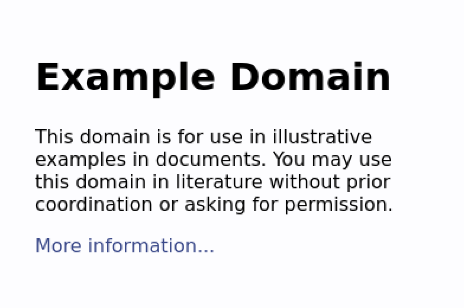

# PhantomJS

## 简介

PhantomJS是一个无头Web浏览器，即没有用户界面，它可以实现如下功能：

- 网站页面截图
- 页面操作自动化
- 网页监控
- 网页测试

2018年3月，PhantomJS由于内部矛盾，决定暂停开发。

## 基本使用

本文使用Linux演示。

### 安装

- [下载对应版本](https://phantomjs.org/download.html)

- 解压即可

  ```
  $ tar -xjvf phantomjs-2.1.1-linux-x86_64.tar.bz2
  ```

### 测试

#### Hello,word!

- 新建js文件夹，并新建hello.js

  ```js
  console.log('Hello, world!');
  phantom.exit();
  ```

- 运行

  ```
  $ cd bin/
  $ ./phantomjs ../js/hello.js
  Hello, world!
  ```

#### Page Loading

- 新建js/get_image.js

  ```js
  var page = require('webpage').create();
  page.open('http://example.com', function(status) {
    console.log("Status: " + status);
    if(status === "success") {
      page.render('example.png');
    }
    phantom.exit();
  });
  ```

- 运行

  ```
  $ ./phantomjs ../js/get_image.js
  Status: success
  ```

- 我们可以得到如下截图：

  

## References

1. https://phantomjs.org/
2. https://github.com/ariya/phantomjs
3. http://javascript.ruanyifeng.com/tool/phantomjs.html