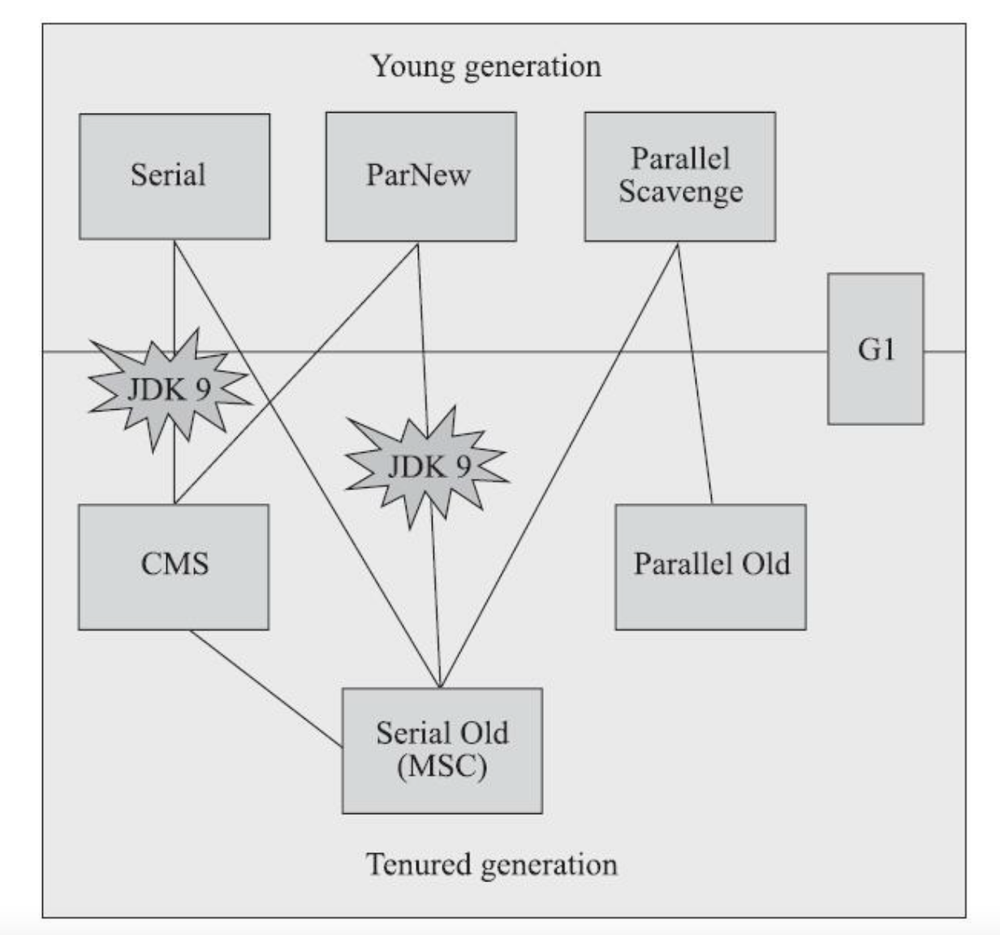

# Java

## JavaSE

### final关键字的特点

- 被final修饰的类不能被继承

  常见被final修饰的类，Integer等包装类型，UUID等

- 被final修饰的方法不能被重写

- 被final修饰的成员变量，不能被重新赋值

### String  str =  new  String("abc")和String str = "abc"的区别

`String str = "abc"`是把常量池中`abc`的地址给`str`，`String str = new String("abc")`是把常量池的abc地址给堆里的对象，对象的地址再给`str`。

### 什么是字符串常量优化

```java
String s3 = "wujunnan";
String s4 = "wu"+"junnan";
//true
System.out.println("s3==s4 => "+(s3==s4));
```

输出结果为true，在赋值语句的时候，如果等号右边都是常量，那么编译器在编译时期就会运算出右边的结果，所有右边会直接得到"wujunnan"这个字符串，然后去常量池中发现该字符串已经存在，则返回这个字符串的地址。

### StringBuilder和Stringbuffer的区别


### 什么是不可变类

不可变类指的是一个类的所有成员变量一旦创建就不可修改。

### 如何创建不可变集合

- 通过jdk的Collections.unmodifiableXxx

  缺点：

  - 采用代理模式，返回的Collection内部还是使用的原来的Collection，不是真正的不可变集合，当原对象元素被修改的时候，结果集合依然会被改变
  - 效率低下，由于只是进行了代理，所以不可变集合的操作还是经过了可变集合的并发修改的检查，产生了额外开销

- Guava Immutable

  特点是拒绝null值，无论原集合如何改变，返回的集合都不会改变。

### ArrayList内部结构，新增逻辑

### ArrayList和LinkedList的区别

### HashMap的结构及put步骤

### HashMap链表采用头插还是尾插

1.8之前采用的是头插，头插会导致在并发扩容的的时候，在头部产生环形链表。

https://blog.csdn.net/thqtzq/article/details/90485663

### ConcurrentHashMap的实现方式、为什么比HashTable效率要高

在jdk1.8之前，ConcurrentHashMap使用的是分段思想，其中Segment继承于 ReentrantLock，当一个线程访问不同的Segment的时候，不会影响到其他的Segment，核心数据如 value ，以及链表都是 volatile 修饰的，保证了获取时的可见性。

不会像HashTable一样，什么操作都要进行同步处理，效率低下。

jdk1.8，ConcurrentHashMap采用了CAS+synchronized（synchronized进行了优化）来保证并发，当进行put的时候，首先采用CAS进行尝试，失败则使用synchronized进行写入。

Guava中Cache的实现就是利用ConcurrentHashMap的思想。

### 深拷贝与浅拷贝的理解

### 线程池执行流程和参数含义、Java提供的默认线程池及其参数、如何设置线程池大小、拒绝策略

### ThreadLocal是如何实现的、有哪些应用

### ThreadLocal会造成内存泄漏吗？如何避免

`ThreadLocal`有可能会造成内存泄漏，因为ThreadLocalMap是Thread的一个属性，而Thread的生命周期是很长的，所以我们创建的TheadLocal我们不再使用，由于作为Key其是虚引用，所以下一次垃圾回收就会被回收掉，key变为null，其对应的值就无法被回收，当然虚拟机已经考虑到了这种情况，每当你调用remove、get方法的时候，都会对Map中key为null的值进行清除。

但是如果，set之后，就不再调用，也不使用remove方法进行移除，就会造成内存泄漏。

所以，在使用ThreadLocal的时候，要注意取完值之后，进行remove操作。

### volatile、synchronized分别是如何实现的

### synchronized和ReentrantLock有什么区别，如何应用

- `synchronized`加锁和释放锁的动作都是自动的，无需手动操作，`ReentrantLock`加锁和解锁都需要手动操作
- `synchronized`不能实现公平锁，而`ReentrantLock`可以选择实现公平锁，即多个线程按照申请锁的顺序获得锁
- `synchronized`一旦锁定就不能中断，除非执行完毕，或者抛出异常，而`ReentrantLock`可以实现中断
- `synchronized`在线程协同方面只能通过`wait()`/`notify()`/`notifyAll()`来实现，而`ReentrantLock`可以给一个锁构建多个`condition`，在线程协作方面更加灵活。

在效率方面，在Java初期，`synchronized`的效率较差，但是经过Java6的一系列优化，二者的效率已相差无几，所以如果用到上面说的高级功能，可以使用`ReentrantLock`，如果只是简单的加锁操作，还是推荐使用`synchronized`。

### AQS是什么

AQS即AbstractQueuedSynchronizer，抽象队列同步器，是JCU中很多锁接口都是基于AQS实现的，例如ReentrantLock。

AbstractQueuedSynchronizer中有两个关键变量：

一个是state，int类型，用来记录加锁的状态，初始值为0，当进行加锁的操作的时候，同过CAS操作来对state进行加1。

另一个变量记录了哪个线程进行了加锁操作，这样当第二个线程进行加锁操作的时候，会看到第一个线程已经占用了这个锁，这个时候，线程二会将自己放到等待队列中。

等到线程一使用完之后，会释放锁，即将state减1，直至到0，彻底释放锁。接下来从等待队列的队头唤醒线程二重新尝试加锁。

### jdk对synchronized进行了哪些优化


### CAS原理，有什么问题

### 为什么要重写HashCode？

为何要重写？

HashCode是为各种哈希桶的结构提供的，因为类似HashMap这种结构是通过Hash值来计算在哈希桶中的位置的，一个桶内的元素才有可能equals，不同桶内的元素一定不equals，当两个对象的HashCode不相同的时候，就不再需要比较equals，所以重写equals一定要重写hashcode，原则是equals为true的hashcode一定要相同。

我们可以直接返回一个整数，这个满足了上述原则，但是这个最差的，因为都分配到了一个哈希桶中，退化为了链表，所以，理想的HashCode()应该尽可能使得不相等的对象返回不同的散列值。

### 如何重写HashCode？

可以按照Effective Java中给出的：

- 首先我们要计算的属性为参与equal中进行比较的属性

- 如果是基本类型 ，计算Type.hashCode(f)，type为基本类型的包装类

- 如果该域是一个引用类型，而且该引用类型也实现了hashcode，则调用它的hashcode，例如String，如果引用类型为null，则可以设置其HashCode为0

- 如果该域是一个数组，则每个元素单独按照上述处理

- 然后通过下面公式累加起来：

  ```
  result = 31 * result + c
  ```

  - 使用乘法能产生一个更好的散列函数，例如一个数组，如果直接将每个元素hashcode累加，那么数组中不同的顺序，也会导致生成相同的哈希值。

  - 至于31，一个奇素数，而且使用说31可以通过位移和减法来代替，效率更高，虚拟机会自动完成优化。

    ```
    31*i = (i<<5)-i
    ```

- 也可以使用`Objects.hash()`方法来帮你实现，它的质量跟上面方案类似，运行速度慢一些 。

- 如果一个类是**不可变的**，而且当计算hash的过程比较繁琐的时候，可以把hashcode的值进行缓存，即添加一个hashCode属性，返回hashcode值的时候先看此值是否为0，String就是这样干的，可以参考String的做法。

### String如何重写HashCode?

```
h = 31 * h + val[i];
```

即之前的hashcode*31加上每个元素的对应编码下的编码值。

### 如何进行序列化，实现序列化接口有什么作用

- `Serializable`接口是一个标记接口，里面没有任何方法，实现了此接口意味着这个对象可以进行序列化

- `Serializableuuid`的作用是版本号，当有了这个属性，在反序列化的时候，会对比反序列化目标类中的Serializableuuid和序列化出来的对象中的Serializableuuid值是否一样，一样才可以进行序列化。

  如果你没有实现这个UID，那么系统就会自动根据这个类的结构自动生成一个标识号，那么如果你通过任何方式改变了这些，例如增加了一个不是很重要的工具方法，自动生成的UID也会发生变化，如果你没有显式的声明一个UID，那么兼容性就会遭到破坏，在运行时出现InvalidClassException。

  实现UID也会带来一个性能上的优势，因为如果没有显示的提供，就需要在运行时通过一个高开销的计算过程来产生一个序列版本UID。

### Java8新特性

- Date升级为了LocalDate和LocalDateTime
  - LocalDate不需要借助Calendar来对日期进行运算，而是自带API
  - 新API修正了旧API不合理的设计，例如Calender中Month、Week常量都是从0开始
  - 新API的类型基本都是不可变的，不需要担心被修改
- Stream流、Lambda表达式
- Optional减少空指针
- 接口中可以定义默认方法
- HashMap当哈希桶上面的链表达到8个长度的时候，会转换为红黑树
- Java8永久废弃了永久代，采用元空间来实现方法区，方法区直接使用物理内存，不再受虚拟内存的限制

### 设计模式

**创建型**

如何创建对象

- 单例模式
- 工厂模式
- 建造者 

**结构型**

如何组合各种对象

- 代理模式

- 装饰者模式

  装饰着模式是将辅助功能与核心功能进行分离。

  如果一个功能是核心功能，应该采用继承子类的方式来实现。

- 适配器

  将一个A接口接到B接口上，日志框架内大规模使用。

**行为型**

算法和对象之间的职责分配

- 责任链模式

- 观察者模式

- 策略模式

- 模版方法模式

  定一个操作的一系列步骤，公共方法定义骨架，私有方法来负责实现。

### Jar和War的区别

- Jar是Java Application归档，War是Web Application归档
- 内容上，Jar是类和相关资源，war代表了一个Web应用程序，它可以包含JSP，HTML、图片等
- 二者都采取了压缩，可以使用zip进行解压
- 使用上，一般Jar用来引入需要的资源，或者内嵌tomcat作为独立的服务，而war一般是一个独立的项目，需要放入tomcat等中

## 虚拟机

### 双亲委派模型是什么，作用是什么

### JVM的内存布局，分别有什么作用

线程共享：

- 方法区

  用户存储已被虚拟机加载的类型信息，常量，静态变量等。

  JDK8之前，Hotspot使用永久代来实现方法区，当时经常会导致内存超出永久代上限从而导致OOM，Java8废弃了永久代的概念，该用元空间来代替。

  运行时常量池也是方法区的一部分。

- 堆内存

  几乎所有对象在堆上创建。

线程独占：

- 程序计数器

  是当前线程控制流的指示器。

- 虚拟机栈

  每个方法被执行的时候，Java虚拟机都会同步创建一个栈帧用于存储局部变量表，方法出口，操作数栈等信息。

- 本地方法栈

  跟虚拟机栈类似，只是本地方法栈用来执行本地方法。

### 类的加载过程

- 加载，将Class文件加载进内存，并创建 Class对象，将Class文件常量部分加载进运行时常量池
- 验证，对Class文件进行验证
- 准备，对静态变量进行初始化，赋初始值
- 解析，将常量池中的符号引用，解析为直接引用
- 初始化 ，执行静态代码块，静态赋值语句等

### Java内存模型是什么

### 对象头都包含哪些内容

### 说下Java虚拟机如何实现垃圾回收

### 有哪些垃圾回收算法

- 标记清除算法，标记已过期的对象，然后进行清除，缺点就是当大量对象死亡的时候，移动量大 ，而且产生很多内存碎片，适合老年代，CMS垃圾收集器即采用的此种算法

- 标记复制算法，将初始区域分为两个部分，只使用其中一个部分，然后回收的时候将存活的对象复制到另一个区域，解决了上述对象大量死亡的时候，工作量大和内存碎片的问题，此种算法适合新生代使用，但是缺点就是浪费内存空间，为了解决这个问题，可以将新生代分为一块eden和两块Survial。这也是主流新生代回收器采用的算法，serial，parlNew等。

- 标记整理算法

  标记存储下来的对象，然后进行移动，来清除内存碎片。

### 什么是GC ROOT，有哪些GC ROOT

- 栈中的对象
- 方法区中的常量
- 锁对象

### 都有哪些垃圾回收器



**新生代回收器**

- Serial
- ParNew
- Parallel Scavenge

**老年代回收器**

- Serial Old
- CMS
- Parallel Old

**Serial**

Serial是最基本回收器，采用标记复制算法，单线程进行收集，收集时暂停所有工作线程，简单高效，额外内存消耗最少，适用于单核或小内存客户端程序。

**ParNew**

ParNew时Serial的多线程版本，特点基本和Serial一样，也会暂停所有用户线程。亮点是除Serial外，目前只有它能与CMS收集器配合工作，是一个非常重要的垃圾回收器。

**Parallel Scavenge**

Parallel Scavenge也采用复制算法，与ParNew不同在于Parallel收集器可以**通过参数控制吞吐量和最大垃圾收集停顿时间**，而ParNew更关注尽可能缩短垃圾收集时用户线程的停顿时间。

Parallel Scavenge收集器还有**自适应调节策略**，可以根据当前系统的运行情况来动态调整新生代大学、Eden、Survivor比等参数，只需要把-Xmx最大内存设置好即可。

**Serial Old**

Serial Old是Serial收集器的老年代版本，它同样是一个单线程收集器，使用标记-整理算法。

**Parallel Old**

Parallel Old是Parallel Scavenge收集器的老年代版本，使用多线程和标记-整理算法。

Parallel组合吞吐量大，相比用户交互后台，更适用于计算型任务。

**CMS**

CMS收集器是一种以获取最短回收停顿时间为目标的收集器，缺点是标记清除算法的内存碎片问题，可以指定回收多少次之后进行内存整理，优点是速度快。

步骤：

- 初始标记，标记GC Roots能**直接**关联到的对象。
- 并发标记，根据上面关联到的对象遍历整个对象图。
- 重新标记，修正并发标记期间，用户线程继续运作产生变动的那一部分对象
- 并发清除

其中初始标记和重新标记这两个步骤仍然需要Stop The World。

**缺点：**

- 并发操作，所以对处理器资源非常敏感，一个是处理器数很少的时候，处理性能不佳，另一个是占用部分线程导致应用程序变慢
- 由于基于标记清除算法，所以会有内存碎片，往往导致老年代还有很多剩余空间，但就是没有足够大的空间来分配当前对象，导致提前Full GC，所以默认是每次Full GC之后，都得进行碎片整理，还是会造成stop the world

**G1**

G1主要是面向服务端的垃圾收集器，较新的G1回收器，他是负责整个堆内存的回收，G1的特点是可以指定停顿时间（200ms左右）、将内存分为不同的Region、按照收益动态的进行回收。

- G1将Java堆划分为多个大小相等的Region，每个Region都可以扮演Eden、Survivor或老年代
- 收集的时候，G1跟踪各个Region里面的回收代价，并使用一个优先级列表进行维护，优先处理用户设定的收集停顿时间内的，价值收益最大的Region

特点：

- 采用的是标记-复制算法，整体上采用的标记-整理算法，都不会产生内存碎片
- 实现较为复杂，需要堆容量的10%-20%的额外内存来维持收集器的工作，在简单的应用下并不占优势，在大内存下占有优势，临界点差不多6-8G

**默认垃圾回收器**

- Java7、8默认垃圾回收器为Parallel Scavenge+Parallel Old

- Java9默认的垃圾回收器是G1

**其他垃圾回收器**

上面的都是经典回收器，下面是其他的垃圾回收器。

我们都知道，垃圾回收器的三特性：内存占用，吞吐量和延迟，三者是不可兼得的，随着硬件的发展，我们可以容忍占用的内存变大，硬件的提升也可以带来大的吞吐量，但会造成延迟的升高，因为内存越大，回收起来耗时越长，所以低延迟越来越被重视。

下面是两款低延迟的回收器：

- Shenandoah

  RedHat开发的，跟G1相似，有如下特点：

  - 支持并发的整理
  - 不支持分代
  - 通过二维表代替G1的记忆集

- ZGC

  - 也采用Region，但具有动态性，分为小、中、大
  - 不同的算法来实现并发整理

### 如何选择垃圾回收器

- 单核Serial
- CPU多核，关注吞吐量 ，那么选择Parallel Scavenge+Parallel Old组合，大部分情况也可以使用该组合，因为它有自适应功能
- CPU多核，关注用户停顿时间，JDK版本1.6或者1.7，那么选择CMS
- CPU多核，关注响应时间，JDK1.8及以上，JVM可用内存6G以上，那么选择G1

### 什么时候会触发YGC和FGC？对象什么时候会进入老年代?

- 当eden区满了的时候，触发YGC，回收后的对象放入survivor区
- 如果YGC之后还是没有足够的区间，则直接进入老年代
- 如果老年代也无法分配内存，则触发FGC，FGC之后还是放不下，报OOM异常

### 引用类型有哪些

- 强引用
- 虚引用，OOM之前会进行清理
- 弱引用，下一次GC进行清理，例如ThreadLocalMap key值的引用。

### OutOfMemory实际经历

- 应用页面点击没反应了
- 先上服务器查看日志，发现日志停留在几十秒前
- 重启应用没几十分钟，还是相同的情况。
- 使用`ps-aux|sort`命令，发现Java服务进程内存占用非常大
- 又通过`jstack`命令查看对应进程的运行情况
- 然后再通过`jmap`将快照保存，使用Memory-analysis工具，查看堆内存分布
- 分析业务代码，通过员工的参数查出员工，再去商户表查出对应客户，然后遍历，返回给前端
- 关联表查出的数据为空，这里没有判空，等于查出所有客户表，等于查询了一条300万的LIst，导致内存溢出
- 多次请求导致产生了大量对象，新生代GC后， 内存用尽，然后使用老年代，再触发Full GC，一次Full  GC释放的内存不够，就连续多次Full GC，导致用户线程停止，请求的对象还在被引用，导致死循环一样，频繁GC

### xmx设置为多大合适

参照老年代存活对象大小

- Xmx设置为老年代存活对象的3-4倍
- 永久代为老年代存活对象的1.2-1.5倍
- 年轻代Xmn为老年代存活对象的1-1.5倍
- 老年代为老年代存活对象的2-3倍

### 什么时候抛出OutOfMemory

- JVM98%的时间都花费在内存回收

- 每次回收的内存小于2%

满足这两个条件将触发OutOfMemoryException，这将会留给系统一个微小的间隙以做一些Down之前的操作，比如手动打印Heap Dump。

### 使用什么工具排查OOM

- 在启动Java应用的时候，加上OOM Log启动参数：`-XX:+HeapDumpOnOutOfMemoryError -XX:HeapDumpPath=heap.bin`

  这样在OOM的时候，就会把堆内存信息给dump下来

  还可以开启GC Log

- jmap

  可以把指定java进程的内存快照dump出来，效果和第一种处理办法一样，不同的是它不用等OOM就可以做到，而且dump出来的快照也会小很多。

- jstat

  统计java进程内存使用情况和gc活动的工具

- jstack

  JVM栈查看工具，可以打印JVM进程的栈和锁情况

- EclipseMemory Analysis Tools (MAT) 

  分析堆数据，给出图形化数据，可以定位内存泄漏

### 虚拟机优化经历

什么时候需要考虑调优

- 普通接口响应时间长，可能是频繁发生GC导致Stop The World

- Full GC次数频繁，不低于10分钟一次，回收时间不长于1秒，Young GC 不低于10秒一次

  （通过jstat查看Young GC Full GC次数）

- 大内存应用

如何调优：

- 将Xmx和Xms设置为相同，类似List指定初始大小 ，避免频繁扩容
- 频繁Full GC可能是服务给的内存太小或新生代给的内存太小
- 当堆内存大于8G的时候，尝试指定G1作为垃圾收集器
- 年轻代和老年代一般比例为1:2

调优目标：

- Full gc 次数0 或 avg pause interval >= 24小时
- 回收时间小于1s
- 堆内存使用率小于70%

### CPU100%如何定位

- top命令先查看哪个进程消耗了大量CPU
- jstack PID 打印进程信息
- 查看是否有线程长时间的watting或blocked，根据堆栈信息来定位代码位置

### 什么是内存泄漏？

即有的对象用不到了，但是也没有被垃圾回收给回收掉

### 常量池的分类，作用

## Spring

### IOC和AOP的理解

### JDK动态代理和CGLIB代理有什么区别

- JDK动态代理

  基于接口实现，代码层面，通过反射来构造一个基于同一个接口的实现类。

- CGLIB

  基于继承思想，通过修改字节码的技术生成一个继承了需要代理类的对象。

### Spring AOP和 AspectJ AOP 有什么区别

- Spring AOP是Spring支持的面向切面AOP的编程
  - 仅支持方法执行切入点
  - 只能在运行时织入
  - SpringAOP 使用了大量AspectJ的注解和代码，比如`@Aspect`，`@Around`，`@Pointcut`注解
- AspectJ是一个面向切面的框架
  - 支持所有切入点
  - 拥有更好的性能
  - 支持编译时，加载时织入（提供了单独的编译工具和类加载器）

### Spring启动流程

- 初始化Spring容器
- 注册每一个Bean的BeanDefinition到容器中
- 按照BeanDefinition的规定进行初始化，并放入容器

### Springboot的启动流程

- 构建一个SpringApplication实例，

  - 设置应用类型

  - 设置初始化类

    spring.factories，里面记载了需要初始化什么bean

  - 设置监听器

- 调用run方法

- 获取、启动运行过程的监听器

- 构建环境，加载系统配置和用户自定义的配置文件

- 创建IOC容器

- 容器前置，将启动类注入容器

- 容器刷新，初始化资源

- 容器后置，打印启动结束日志等

- 发出结束执行的事件

```
@ComponentScan 注解只能扫描 spring-boot 项目包内的 bean 并注册到 spring 容器中，因此需要 @EnableAutoConfiguration 注解来注册项目包外的bean。而 spring.factories 文件，则是用来记录项目包外需要注册的bean类名。
```

https://zhuanlan.zhihu.com/p/301063931

### Spring BeanFactory和FactoryBean的区别

- BeanFactory

  BeanFactory是一个工厂类接口，它负责生产和管理Bean。这个是所有SpringBean容器管理的根接口，给Spring定义了一套规范，比如我们常用的getBean方法等。

  ApplicationContext接口,它由BeanFactory接口派生而来，ApplicationContext包含BeanFactory的所有功能。

  提供了`getBean(String)`方法，返回给定名称注册的bean实例。根据bean的配置情况，如果是singleton模式将返回一个共享实例，否则将返回一个新建的实例。

- FactoryBean

  FactoryBean是Spring容器创建Bean的一种方式，采用了装饰者模式。

  一般情况下，Spring通过反射机制来实例化bean，在某些情况下， 实例化Bean的过程比较复杂， 如果按照传统的方式去创建，需要提供大量的配置信息，通过FactoryBean，通过编码的方式来暴露出来一个简单的创建Bean的方式。

  根据该Bean的ID从BeanFactory中获取的实际上是FactoryBean的getObject()返回的对象，而不是FactoryBean本身，如果要获取FactoryBean对象，请在id前面加一个&符号来获取。

### SpringBean的生命周期

- 首先Spring启动的时候，通过扫描注解配置等信息，例如@Scope、@Lazy、@DependsOn等信息，包装成BeanDefinition
- 接着执行BeanFactoryPostProcessor对Bean进行实例化
- 接下来对Bean进行属性注入，包括解决循环依赖等问题
- 进行初始化的操作，判断Bean是否实现了Aware相关的接口，例如ApplicationContextAware接口，来获取ApplicationContext对象从而获取Spring Bean
- 处理BeanPostProcessor，执行相关初始化方法，例如@PostConstruct、实现了InitializingBean接口的init-method方法等
- 销毁的时候，看有没有配置相关的destroy方法

### Spring如何解决循环依赖的

Spring是采用三级缓存的方式来解决循环依赖的，循环依赖的产生的原因是A依赖了B，当初始化A的时候，发现B还没有进行初始化，开始B的初始化，这个时候B又依赖了A，就导致了循环依赖。

Spring有三级缓存：

- singletonObjects

  一级缓存，用于保存实例化、注入、初始化完成的bean实例

- earlySingletonObjects

  二级缓存，用于保存实例化完成的bean实例

- singletonFactories

  三级缓存，用于保存bean创建工厂

Spring的创建过程：

- A从一级缓存中找不到实例，则创建A实例，并添加到三级缓存
- 开始注入B，找不到B实例，则创建B实例，并添加到三级缓存，B开始依赖注入，从三级缓存获取到A，完成注入，将B添加到一级缓存
- 开始注入A，A初始化完成之后，添加到一级缓存结束。

https://www.zhihu.com/question/438247718/answer/1730527725

### 为何需要三级缓存，而不是两级

### 什么情况Spring无法解决循环依赖

- 非单例模式

  也就是`@Scope("prototype") `，这样每次都会创建一个新的对象，不会放入缓存

- 构造器注入

  A在构造的同时，就触发了注入B操作，此时B开始构造，而A又没有完成构造，所以无法注入。

- @Async 类型的 AOP Bean 的循环依赖

  @Async产生的代理和普通的代理不同，所以当通过A的三级缓存来获取bean的早期引用的时候，获取到的是 bean的原始对象，而没有提前生成代理对象。

  因为二级缓存中存放的bean的早期引用，比如是最终的bean的引用是相同的。

### Spring里面用到了哪些设计模式

- 模版方法模式

  例如JDBCTemplate，实现了抽象类中对数据源的操作，这些操作是各种JDBC都需要的共性操作，所以在父抽象类中统一进行规定。

  再例如，Hibernate中定义了模版方法HibernateCallback()，里面是对session的操作，不再是使用传统的继承的方式来实现，而是基于依赖优先于继承原则，在HibernateTemplate中用到这个模版的地方使用将Callback作为参数传入，并通过匿名类的方式来实现，减少子类的数量。

- 代理模式

  代理模式是将真实的对象进行代理，实现一些额外的操作。

  代理模式分为静态代理和动态代理两种：

  - 静态代理

    一般需要代理者和委托者拥有同样的父类，这样代理类就可以替代委托类。

    静态代理的缺点就是需要手动编写代理对象，当有多个委托类的时候，工作量很大。

  - 动态代理

    动态代理在代理对象上更加灵活，动态代理类的字节码在运行时自动生成，简化了编程工作。

    - JDK动态代理
    - CGLIB动态代理

### SpringSecurity中用到了哪些设计模式

- 模版方法模式

  也就是一个抽象类公开定义了执行它的方法的模版，然后通过子类去实现。

  `AbstractUserDetailsAuthenticationProvider`是用来验证的，提供了两个抽象的方法，`retrieceUser()`、`additionalAuthenticationChecks()`。

  前者用来从数据源中获取用户对象，后者用来做额外的校验。

- 责任链模式

  在这种模式中，通常每个接收者都包含对另一个接收者的引用，如果一个对象不能处理该请求，那么它会把相同的请求传给下一个接收者，依此类推。

  例如：`VirtualFilterChain`，从`additionalFilters`取出过滤器链中的一个个过滤器 ，挨个调用`doFilter()`方法。

- 策略模式

  通过输入来决定使用不同的策略。

  例如，SecurityContextHolder中定义登录用户信息存储的方法，我们还可以通过他来获取Context，来获取用户信息，就SecurityContextHolder如何保存SecuritContext，定义了三种策略，用户可以自行选择使用哪一种策略。

  - MODE_THREADLOCAL，默认使用ThreadLocal实现
  - MODE_GLOBAL，表示SecurityContextHolder是全局的，所有线程都可以访问，适合单机系统
  - MODE_INHERITABLETHREADLOCAL，表示有父子关系的线程可以访问

  用户可以通过程序设置或者定义系统变量的方式来决定使用哪一种策略。

- 代理模式

  给某一个对象提供一个代理，并由代理对象控制对原对象的引用，它是一种对象结构型模式。

  在Spring  Security中的应用就是创建过滤器的时候，使用了Spring的DelegatingFilterProxy，这个代理中保存了Spring中的容器。

  有时候我们需要实现一个过滤器，如果我们想在过滤器中使用某个bean，就会出现问题，因为filter加载完成的时候，bean还没有装配，所以filter所依赖的bean为空，我们可以用DelegatingFilterProxy来实现这个功能。

- 适配器模式

  适配器模式使接口不兼容的类可以一起工作。

  WebSecurityConfigurerAdapter

- 观察者模式

  Observer(观察者模式)指多个对象间存在一对多的依赖关系，当一个对象的状态发生改变时，所有依赖于它的对象都得到通知并自动更新，观察者模式也称为发布-订阅模式、模型-视图模式，它是对象行为型模式。

  具体到 Spring Security 中，如登录成功事件发布，session 销毁事件等等，都算是观察者模式。

- 建造者模式

  AuthenticationManagerBuilder

  这个是Spring Security最核心的配置，通过他我们可以指定对哪些请求进行拦截，指定我们实现的session管理，用户管理等。

### Spring事务传播机制

- `REQUIRED`

  默认的事务传播机制，如果外部没有事务，就自己开启一个事务，如果外部有事务，就加入外部的事务，成为一个事务。

- `REQUIRED_NEW`

  如果外部没有开启事务，那么就开启事务，如果外部开启了事务，仍然开启一个新的事务，外部发生异常，内部不会进行回滚，内部发生异常，外部也不会进行回滚。

- `NESTED`

  如果外部事务没有事务，那么则开启事务，如果外部有事务，则开启一个子事务，即内部发生异常，不进行回滚，外部发生异常，内外都回滚。

  例如增加积分之类的操作，内部异常不能影响下单的是否成功。

- `SUPPORTS`

  看父方法有没有事务，有的话就加入其事务，没有的话也不开启事务。

- `NOT_SUPPORTS`

  不开启事务。

- `NEVER`

  上下文存在事务，就抛出异常。

### Spring事务什么时候会失效

- 同一个类中的方法调用

  因为当调用没有@Transactional修饰的方法的时候，不会调用代理类，所以事务也不会生效

- 添加到非public方法上

- 方法内部try...catch吞掉异常

  所以在对异常处理后也要抛出RuntimeException或者是其子类自定义异常，或和`rollbackFor`相匹配的异常

- 数据库本身就不支持事务，例如MyISAM引擎

## Mysql

### Mysql索引类型有哪些，结构分别是什么

### 回表指的是什么

### 事务的ACID是什么

- 原子性

  一个事务是不可分割的，要么全部提交，要么全不提交。

  InnoDB通过undo log来实现。

- 一致性

  一个事务提交前后状态应该是一致的，比如两个人相互转账，转账前后总金额应该是不变的。

  通过事务来保证。

- 隔离性

  一个事务的执行，不受其他事务的影响，具体隔离的级别，就是数据库的隔离级别，可以进行设置。

  MVCC来保证。

- 持久性

  一旦事务提交，就会对数据库发生持久性的改变，不会受到故障等的影响，这个mysql是靠来实现的
  
  redo log来保证。

### 4个隔离级别是什么

- 读未提交

  可以读到其他事务未提交的数据，导致脏读。

- 读已提交

  通过MVCC来读取最新版本的事务，来实现读已提交。

  如果A线程先读取了数据，B线程修改了数据，并提交，这时候A再次读取，就会发现数据不一致问题。

- 可重复读

  通过MVCC读取初始版本来实现可重复读。

  可重复读在读事务的时候，禁止其他事务修改，但是其他事务还是可以新增或删除，所以会导致幻读。

  可重复读对已有的行可以加锁，实现可重复读，但是insert无法控制，所以会出现幻读。

  一个简单的场景，当我们插入一个用户的时候，会先查询是否存在，不存在则插入。

  当A事务中先查找发现没有用户1，然后准备插入用户1，此时B线程开启了事务插入了用户1，导致A事务的失败，这个就是幻读。

  通过给修改的区间加间隙锁来防止幻读。

- 序列化

  所有事务都是串行执行的，一个事务执行完了执行其他的事务。

https://zhuanlan.zhihu.com/p/117476959

### MVCC是什么

为了解决读写锁之间的冲突，就是读取数据时通过一种类似快照的方式将数据保存下来，这样读锁就和写锁不冲突了，不同的事务session会看到自己特定版本的数据。

来实现事务的隔离性。

### MySQL都会有什么锁

Mysql的锁使用来保证并发的情况下，数据一致性和完整性的主要机制。

按照粒度分为：

- 表锁
- 行锁

InnoDB采用了两种不同的行锁：

- 共享锁（读锁）读锁和读锁不互斥
- 排他锁（写锁）写锁和其他锁都互斥

表级锁分为两种：

- LockTables语句手动锁定表(Server级别)

  - 读锁定

    ```
    lock tables tableName read;
    ```

    如果一个线程获得一个表上的read锁，那么所有线程只能进行读操作。

  - 写锁定

    ```
    lock tables tableName write；
    ```

    如果一个线程在一个表上得到一个write锁，那么只有这个线程能从这个表中读和写表，其他线程阻塞。

- InnoDB提供了表级别的意向锁

  需要判断有没有行锁，需要遍历所有数据，非常麻烦，所以要想实现

  - 意向共享锁

    事务在给数据行权限加行级共享锁之前，必须先取得该表的意向共享锁

  - 意向拍他锁

    事务在给数据行权限加行级排他锁之前，必须先取得该表的意向拍他锁

    这样当有一个事务更新数据的时候，会加行级拍他锁，前提是假意向拍他锁，也就是表锁，

    两个update不同行也是可以进行的，因为两个意向拍他锁可以共存。

其中行级锁又包括

记录锁

锁上单条记录。

**间隙锁**

间隙锁是可重复读级别下的锁，结合MVCC和间隙锁可以解决幻读问题。

当我们修改id=20的时候，mysql自动帮我们生成了区间

```
(负无穷,10] (10,20] (20,30] (30, 正无穷)
```

```
(10,20] (20,30]区间被锁定，无法插入，删除
```

### Mysql都有哪些日志

- InnoDB中通过undo log实现了数据的多版本，undo log除了实现MVCC外，还用于事务的回滚。

- binlog，是mysql服务层产生的日志，常用来进行数据恢复、数据库复制

- redolog，保证了Mysql中的事务不会丢失，保证了事务的完整性和持久性

  当你查询一条数据，会从硬盘把一页的数据加载出来，放入到`Buffer Pool`中，后续的查询会先去Buffer Pool中查找，减少磁盘IO。

  在更新数据的时候，也是如此，发现如果Buffer Pool中有要更新的数据，就直接在Buffer Pool里更新，然后把修改操作记录在Redo Log Buffer中，当事务提交的时候，刷到磁盘中。

  刷redolog比直接刷盘的速度更快，因为redolog更小。

### MySQL主从同步如何实现的

- master提交完事务之后，写入binlog
- slave获取到binlog
- master创建dump线程，将binlog推送给slave
- slave启动一个线程读取同步过来的binlog，记录到中继日志中
- slave启动一个sql线程读取relay log并在slave执行，完成同步
- slave记录自己的binlog

由于Mysql默认的复制方式是异步的，主库把日志发送给从库之后不关心从库是否已经处理，这样会产生一个问题就是主库挂了，此时主库上已提交的事务未传递到从库上， 此时进行故障转移，将从升级为主，则导致新主上的数据不完整。

mysql有多种同步模式：

- 默认的异步复制，主库不关心从库是否处理
- 全同步复制，指当主库执行完一个事务，并且所有的从库都执行了该事务，主库才提交事务并返回结果给客户端。
- 半同步复制，从库写入成功之后返回ACK，只要有一个从库确认即认为写操作完成

当Master在给Slave推送了一个数据之后，默认10s之后Slave还未给Master返回一个ACK，半同步方式会降级，变为异步同步的方式。

### 如何解决主从延迟

- 针对特定的业务场景，对数据的实时性要求非常严格，读写请求都强制走主库
- 读请求走从库，如果没有数据，去主库做二次查询

### Myisam和innodb的区别

### MySQL怎么保证已提交事务的数据不丢失

### MySQL的查询过程

### Mysql命中了多个索引如何选择

### 分库分表流程

### 分库分表如何设计ID

- UUID

  UUID包括了MAC地址，时间戳等，128位，无序的，会造成page分裂，插入效率低，占用空间大。

- 雪花算法

  时间戳在高位，是递增的，但是依赖机器的时钟，当服务器时钟回拨，会导致重复ID生成。

  为了解决时钟回拨问题：我们可以在内存中存下最新的ID，当我们生成的ID小于这个ID的时候，我们就丢弃，继续生成直到大于这个ID。

- Redis生成方案

  （依赖Redis的高可用）

- 通过Mysql自增ID

  在分布式系统中，使用一个公共的数据库，建一张表，每次需要全局唯一ID的时候，先在该表中插入一条数据，返回插入成功的主键作为全局唯一的ID。

  （并发性比Redis要差一个数量级）

### UUID做唯一索引有什么缺点

Mysql中存储数据的最小单位为page，大小为16K，也就是一个page中可以存储多行数据，使用B+树的结构后，数据必须是有序的，如果此时page1已经写满，page2只写了一半，当下一个数据是有序的时候，直接追加到pa ge2后面即可，但是当数据是无序的时候，当数据被计算后需要插入到page1中，就会导致page1的分裂。

由于频繁的页分裂，也导致会有大量数据碎片，同一个表占用更大的空间。

### Mysql高可用方案

**主从或主主半同步复制**

使用双节点数据库，搭建单向或者双向半同步复制，同时配合keepalivied同时使用来监控数据库。


## Redis

### Redis各种数据类型及场景

- 平时程序中普通的key -> value场景都是使用的String

  String的内部实现是SDS，SDS内部包含了length，使得字符串不需要像C的String一样通过空字符`\0`判断字符串是否结束，所以SDS不仅可以存放文本数据，还可以存放图片等二进制数据，而且获取长度更加方便。

  SDS的好处：

  - 获取字符串长度的复杂度为O(1)
  - API是安全的，不会造成缓冲区溢出
  - 修改字符串长度N次最多需要执行N次的内存分配
  - 二进制安全，可以保存二进制数据

  应用：

  - 过期时间
  - 分布式锁
  - 序列化后的对象
  - 缓存对象
  - 共享session
  - 幂等

- List类型内部是双向链表或压缩列表实现的

  在 Redis 3.2 版本之后，List 数据类型底层数据结构就只由 quicklist 实现了，替代了双向链表和压缩列表

  应用：

  可以用来实现队列。

- Hash类型

  这种一般对应的是**嵌套**的HashMap类型需要Redis进行存储的时候，可以使用Hash结构。

  - 例如购物车

    `<userId, <skuID, num>>`

  - 例如可重入分布式锁

    `<锁Key, <客户端Id, 加锁次数>>`

  底层存储：

  当满足下面条件的时候，将使用ziplist

  - 当hash对象保存的键和值字符串长度都小于64字节
  - hash对象保存的键值对数量小于512

  也就是当元素较小的时候，我们就将所有的key和value都当成一个元素，顺序的存入ziplist中。

  Hash类型在负载因子达到一定的时候，会进行rehash，但是由于键值对的数量可能非常大，数千万，上亿，那么此时就不可能一次性完成rehash，所以Redis采用了渐进式rehash的方式

- Set

  用作去重

  - 点赞操作，一个文章只能被一个用户点赞
  - 抽奖操作

- ZSet

  用作排序

  - 排行榜
  
  两种方式实现：
  
  - zipList
  
    当满足键值对数量小于128个和每个元素的长度小于64字节。
  
  - skipList+Hash
  
    hash用来存储value到score的映射，这样就可以在O(1)的时间内拿到value对应的分数。
  
    skipList按照从小到大的顺序存储[scort, value]。

跳表本质就是一个有序的链表，在原有有序链表的基础上，增加了多级索引。性能上和平衡树不相上下，但是实现起来更加简单。

### Redis为什么那么快

- Redis的大部分操作都是在内存中完成，内存本身存取速度就很快
- Redis采用了高效的数据结构，哈希表，跳表等
- Redis采用了多路复用机制，使其在网络IO中能并发处理大量的客户端请求

我们知道Redis要处理一个请求，中间是会有阻塞点的，例如Redis监听到一个客户端有连接请求，但是一直未能建立起连接、再比如Redis在从客户端读取数据的时候，数据一直没有到达等。

如果是阻塞模型，那么单线程只能等待这些阻塞点结束，效率很低。

所以Redis采用的是非阻塞模型，基于Linux的IO多路复用模型，Redis调用epoll机制，让内核监听这些套接字。此时，Redis线程不会阻塞在某一个特定的监听上，也就是说，不会阻塞在某一特定的客户端处理请求上，当请求到达的时候，放入一个事件队列，Redis只需要对这个队列进行基于事件的回调机制的处理即可，即调用不同的回调函数。

Redis的4种集合类型数据，List、Hash、Set、Sorted Set，在集合元素个数小于一定的阈值的时候，会使用内存紧凑的底层数据进行保存，从而节省内存空间，例如当Hash集合的元素不超过1000个（可配置），那么就会使用ziplist。

### Redis的过期删除策略是什么

- 定期删除，每隔一定的时间，扫描进行删除
- 惰性删除，在查询的时候，就进行删除

### Redis的持久化方式

- RDB

  给当前数据库的问价进行备份，然后持久化。

  支持设置例如一分钟内修改若干次后就进行持久化的操作。

  RDB是写前日志。

  此模式默认会从主进程中fork出一个子进程，进行持久化，子进程可以共享主进程的内存数据，所以当主线程有数据要修改时，那么就将要修改的键值对复制一份，然后写入RDB文件，这就使得备份的过程中还可以进行修改操作。

- AOF

  保存执行的修改命令，类似Mysql binlog中的Statement模式，并且命令过多的时候会进行命令合并。

  此种方式会先讲命令写入缓冲区，缓冲区写入磁盘，支持awlays、everysec、no（由操作系统决定）等方式。
  
  要想高性能就采用no的方式，要想高可靠性，就采用always，折中就采用everysec。
  
  AOF的方式是写后日志，一是保证命令是正确的再记录，二是不会阻塞当前的写操作。
  
  但是也有风险：
  
  - 当Redis在记录日志前宕机，这个命令就有丢失的风险
  - 虽然避免了当前命令的阻塞，可能会给下一个操作带来阻塞的风险，因为AOF日志也是在主线程中执行的
  
  AOF重写机制就是会将AOF日志进行重写，例如，你多次修改，记录了多次修改的语句，可以转换成修改成最后的结果的一条语句。
  
- 混合记录，Redis4.0提出了一个混合使用AOF日志和内存快照的方法，内存快照按照一定频率执行，两次快照之间，采用AOF记录所有命令操作。

### 如何实现Redis的高可用

Redis采用了主从库模式，以保证数据副本的一致，主从库之间采用的是读写分离的方式，即：

- 读操作，主库和从库都可以接收
- 写操作，首先到主库执行，然后主库将写操作同步给从库

同步操作是通过生成RDB文件来实现，因为在初始化从库的阶段，RDB文件比AOF文件更小，而且二进制文件执行更快。

哨兵机制

- 监控

  当主库挂了，就要通过哨兵机制来实现故障转移，哨兵即一个特殊的Redis服务，哨兵会周期性的向所有主从库发送ping命令，如果从库没有在规定的时间内回复，那么哨兵就会把它标记为下线状态，同样，如果主库也没有在规定的时间内响应哨兵，哨兵就开始自动切换主库流程。

  主观下线和客观下线

  当主库或者从库没有回复哨兵的PING，那么哨兵会将其标记为主观下线。

  如果是主库，为了防止误判，例如网络堵塞，这就用到了哨兵集群，大多数（N/2+1）哨兵认为主库下线， 那么就认为该主库客观下线。

- 选主

  主库挂了之后，哨兵就需要从很多个从库里，按照一个新的规则选出一个从库作为主库。

  规则：

  - 和主库的断连次数
  - 通过配置的优先级项
  - 和主库同步进度最接近的从库得分高

- 通知

  哨兵会把新的主库的连接信息发送给其他从库，让他们执行replicaof命令，和新主库建立连接，并进行数据复制。同时哨兵会把新的主库的信息通知给客户端，让他们把新的请求发到新主库

### 为什么通常配置三个哨兵

因为当一个哨兵要想成为Leader，必须获得N/2+1个选票，如果有两个哨兵，那么就至少需要两票，当有个哨兵挂了，集群是无法完成主从切换的，跟1个哨兵的效果是一样的，所以要想高可用，至少3个。

### Redis的事务了解吗

Redis事务本质是一组命令的集合，事务支持一次执行多个命令。

批量操作在发送 EXEC 命令前被放入队列缓存，并不会被实际执行，也就不存在事务内的查询要看到事务里的更新，事务外查询不能看到，所以没有隔离级别的概念。

Redis也不保证原子性，单条命令是原子性执行的，但事务保证原子性，且没有回滚。

主要的作用就是串联多个命令，防止其他命令插队。

### 如何解决缓存一致性

- 「先更新数据库 + 再删除缓存」的方案，是可以保证数据一致性的
- 给缓存数据加上过期时间

### 什么是缓存雪崩、击穿、穿透

- 缓存雪崩就是大量数据同时过期，导致大量请求直接打到Mysql

  - 可以给缓存设置不同的过期时间

  - 在给Redis中添加数据的时候，使用互斥锁，避免大量数据同时设置缓存

- 缓存击穿

  跟上面类似

- 缓存穿透

  数据既不在缓存中，也不在数据库中，当有大量请求到来的时候，数据库压力骤增，原因可能是业务误操作，导致应该有的数据都被误删除了，或者黑客攻击，

  - 非法请求的限制，判断数据是否合理

  - 不存在的值返回空值缓存

  - 布隆过滤器

    布隆过滤器由一个**位图数组**和N个哈希函数组成，但是存在误判的情况，也就是说布隆说没有则一定没有，布隆说有，则不一定是有。

## Kafka

### 你使用Kafka的场景是什么

- 埋点数据做流式处理，业务方发送给我们的接口平台，然后接口平台发送给Kafka，Kafka再发送给Flink，做日志的校验。
- 电话告警，主要做一个解偶，接收业务方的通知，然后进行告警。

### 选型如何考虑的

### 怎么保证消息的可靠性

- 生产端丢失

  将ack设置为ALL，服务端收到消息，并写到所有分片上。

  设置retries次数，发送失败的采取策略进行保存。

- 服务端丢失

  设置从机器数

  不允许没有完全同步的副本参与选举。

  设置最小副本数

- 消费者丢失

  消费者改自动提交为手动提交。

### Kafka为什么吞吐量很大

-  写入

  虽然使用磁盘进行存储，但是顺序写入磁盘的速度还是要高于内存的随机写入的。

- 页缓存

  也就是在操作磁盘的过程中加了一个内存缓冲。

- 零拷贝技术

  将文件直接从磁盘拷贝到网卡，不再经由程序之手，减少了内核和用户模式之间的上下文切换。

### Kafka不同Partition保证有序性

kafka只能保证partition内是有序的，partition之间是无法保证有序的。

- 首先考虑同步发送消息，设置参数`max.in.flight.requests.per.connection = 1`

  这样设置完以后，在Kafka的发送端，每发出一条消息之后，响应必须满足acks设置的参数之后，才会发送下一条消息。

  当调用 KafkaProducer 的send方法后，调用 send 方法返回的Future对象的 get 方式阻塞等待结果。等结果返回后，再继续调用 KafkaProducer 的 send 方法发送下一条消息。

  将同一类型的数据发送到同一个partition。

- broker端，Kafka只能保证同个分区内的消息是有序的

- 消费端，避免发生rebalance

### Kafka消费者Rebalance机制

当消费者组成员发送变化、订阅的主题数发送变化（正则匹配Topic）、订阅的分区数发生变化的时候，会发生Rebalance机制。

会导致全部消费者消费暂停，让消费者重新分配分区，可能导致消费顺序不一致。

### Kafka分Partition有啥好处

一个Kafka由多个Broker组成，每个Broker中包含有集群的部分数据

- 多个Partition有利于水平扩展
- 一个partition只能由一个消费者消费，多个Partition有利于增加吞吐量

### Kafka发送到不同Partition的策略

- 使用特点Partition Key，发送到固定的partition

- 如果没有指定Partition，Kafka就会使用轮询的方式来决定写入哪个Partition
- 一个producer也可以指定自己的分区规则

### Kafka消费者是拉的模式还是推的模式

Kafka 不像普通消息队列具有发布/订阅功能，Kafka 不会向 Consumer 推送消息。

Consumer 必须自己从 Topic 的 Partition 拉取消息。

Offset 的推进和记录都是Consumer的责任，Kafka是不管的。

https://blog.csdn.net/duysh/article/details/116481414

### Kafka exactly once如何实现

Kafka通过幂等性和事务这两种机制实现了exactly once的语意。

什么时候会导致消息重复，当broker收到消息之后，返回ack给producer，这个时候如果broker宕机，或者因为网络波动未返回的ack包丢失，那就导致producer的重试，就会导致消息重复。

这个时候需要客户端开启`enable.idempotence`。

为了实现生产者的幂等性，Kakfa引入了Producer ID和Sequence Number的概念。

Producer  ID即一个生产者一个，Sequence Number是每个消息对应一个从0开始递增的Sequence Number。

Broker端也会为每个消息维护一个序号，每次收到一条消息的时候，如果其序号比Broker维护的序号大1，则Broker会接受它，否则将其丢弃。

- 如果消息序号比Broker维护的序号大1以上，说明中间有数据尚未写入，此时Broker拒接该消息，Producer抛出InvalidSequenceNumber
- 如果消息序号小于Broker维护的序号，说明该消息已被保存，即为重复消息，Broker直接丢弃该消息，Producer抛出DulicateSequenceNumber

此设计解决了

- Broker保存信息后未返回ACK前宕机导致的消息重复问题
- 前一条消息发送失败，后一条消息发送成功，前一条消息重试后成功造成的数据乱序问题

局限是保证了单个分区的幂等性，同样的也只能保证一个分区的顺序性。

其次就是只能保证单会话的幂等性，不能实现跨会话的幂等性，当你重启Producer进程之后，Producer会分配一个新的ProducerID，相当于之前的SequenceNumber就丢失了。

事务

上面分析倒是消息重复的原因无非是发送消息、返回ack、接收ack这三个操作非原子，如果将这三个操作事务化，要么都完成，要么都不完成，就可以解决重复问题，并且支持多个分区。

需要用户提供一个相同的Transation ID。

- 跨session的数据可以实现幂等发送，当语句相同的transaction ID的新的Producer实例被创建时，旧的Producer将不再工作
- 跨session的事务恢复，如果某个应用实例宕机，新的实例可以保证未完成的旧的事务要么提交要么丢弃，使得新实例从一个正常的状态开始工作

Kafka通过Control来实现来判定对应的消息是被Commit还是Abort了，然后结合Consumer的隔离级别来决定是否将该消息返回给应用程序。

## RabbitMQ

### 你使用MQ的场景是什么

### RabbitMQ的几种模式

（只有一个交换机）

- 简单模式，一个队列，一个消费端
- 工作队列模式，一个队列，多个消费端
- 广播模式，多个队列，多个消费者
- 路由模式，路由到多个队列

### 怎么保证消息的可靠性

生产者

- 使用confirm模式，如果小时成功写入，客户端会收到一个ack回执，Confirm是异步的
- 使用事务模式，事务模式是同步的，很耗时。

Server

- 开启持久化，结合前面的confirm机制，只有持久化了，才返回confirm

消费者

- 关闭 RabbitMQ 的自动 `ack`，可以通过一个 api 来调用就行，然后每次在自己代码里确保处理完的时候，再在程序里 `ack` 一把。

### 一直消费失败导致消息积压怎么办

## Dubbo

### Dubbo的分层

主要分为三层：

- business业务逻辑层

  自己来提供接口和实现还有一些配置信息

- RPC层

  封装整个RPC的调用过程、负载均衡 、集群容错、代理

- remoting层

  对网络传输协议和数据转换的封装

### Dubbo的工作原理

1. 服务启动的时候，provdier和consumer根据配置信息，连接到注册中心，分别向register注册和订阅服务
2. register根究服务订阅关系，返回provider信息到consumer，同时consumer会把provider信息缓存到本地，如果信息有变更，consumer会收到来自register的推送
3. consumer生成代理对象，同时根据负载均衡策略，选择一台provider，同时定时向monitor记录接口发送调用次数和时间信息
4. 拿到代理对象之后，consumer通过代理对象发起接口调用
5. provider收到请求之后对数据进行反序列化，然后通过代理调用具体的接口实现

### Dubbo的负载均衡策略

- 加权随机，根据权重随机选择。

- 最小活跃调用

  每个服务提供者对应一个活跃数，初始情况下，所有服务提供者活跃数均为0，每收到一个请求活跃数就加1，完成请求后活跃数将减一，在服务运行一段时间以后，性能好的服务提供者处理请求的速度更快，能够优先获取新的服务请求。

- 一致性Hash

  通过hash算法，把provider的hash值投射到一个圆环上，查询的时候也通过consumer的key进行hash，下一个provider即为他要使用的provider。

- 加权轮询

  根据权重依次轮询。

### Dubbo集群容错

- 失败自动重试

  dubbo默认的容错方案，失败自动切换，当出现失败，重试其它服务器。

- 失败自动恢复

  在调用失败后，记录日志和调用信息，然后返回空结果给consumer，并且通过定时任务每隔5秒对失败的调用进行重试。

- 快速失败

  只发起一次调用，失败立即报错，用于非幂等的操作

- 并行调用

  并行调用多个服务器，只要一个成功返回即可，对实时性要求较高的操作

### RPC协议和HTTP协议的区别

**RPC**

RPC（Remote Procedure Call）远程过程调用

- 多数RPC协议是基于TCP协议
- 报文体积更小，速度更快
- 可以采用thrift实现更高效的序列号和反序列化

**HTTP协议**

- 基于TCP协议
- HTTP协议更加臃肿，速度慢
- 大部分采用JSON进行反序列化，效率低

所以RPC主要用于公司内部服务调用，性能消耗低，传输效率高，HTTP主要用于CS架构，第三方接口调用等。

## Linux

### Docker

#### 挂载主机目录


## Elasticsearch

### 什么是倒排索引

倒排索引，又被称为反向索引，即单词到文档的映射关系。文档到单词的映射，即为正向索引。

类比书籍，书的目录就是正向索引，书后面的专有名词索引就是反向索引。

### Elasticsearch的原理

ES分别为每个field都建立了一个倒排索引，索引结构也是B+树，也就是根据每个term可以找到对应的文档的位置，这个其实和Mysql的B+树是相似的。

但是ES又新增了term index，把Term拆解成了一些前缀，再结合FST压缩技术，大大减少了索引的体积，从而使得term index可以存入内存之中，从term index查到对应的term地址，再去磁盘上寻找term，大大减少了磁盘随机读的次数。

**构建索引的过程**

- 插入文档
- 将文档分词，包括去除标点符号，去除无意义的词得到token
- 语言处理组件将token进行处理，例如全部处理成小写，将单词变为词根模式
- 构建倒排索引，即token到document的映射

**搜索过程**

- 输入语句同样经过上述步骤处理成token
- 计算一个词在一个文档中的权重，有两个关键因素：
  - Term Frequency：即此Term在此文档中出现了多少次，tf越大说明越重要
  - Document Frequency：即有多少文档包含次Term，df越大说明越不重要
- 每个文档进行打分，最后根据文档分数返回

### Elasticsearch的集群是如何工作的

ES的每个index由若干个分片组成，ES可以由多个节点组成，一个节点即一个运行中的ES实例，ES集群有三种不同类型的节点：

- 主节点

  协调各个节点，例如增加、删除节点、决定哪些分片给相关的节点等。

  默认一个主节点也是数据节点。

- 数据节点

  数据节点负责数据的存储和相关操作，负责数据的存储和相关的操作。

- 协调节点

  ES的任意节点都可以作为协调节点接收请求，负责处理请求，并转发给主分片。

ES的数据由分片组成，这就使得ES有水平扩展的能力，分片分为主分片和副本分片，副本分片来实现高可用，高并发。

集群模型：

三个节点，数据分为3个主切片，每个主切片又有两个从切片，主切片和从切片分布在不同的机器。

写操作：

一个写请求被发送到某个节点之后，节点会根据路由公式计算出要写在哪个分片上，再将请求转发到这个分片的主分片上，主分片处理成功之后，会将请求转发给副本分片。

## ClickHouse

### ClickHouse为什么块

- 作为OLAP平台，ClickHouse有着这些平台的特点，OLAP的特点就是读取大量的行，少量的列，这就非常适合列式存储，列式存储，相同的类型的数据存储在一起，也会使得压缩率更高，IO效率更高
- 向量化执行，采用CPU的指令，相当于将n次的for循环，转换为n个重复的操作执行一次，效果非常好
- ClickHouse将数据划分为多个partition，通过多个CPU核心分别处理其中的一部分来实现并行数据处理。在这种设计下，单条Query就能利用整机的CPU，极致的并行处理能力
- 分布式计算，除了优秀的单机处理能力，ClickHouse还提供了可线性拓展的分布式计算能力，ClickHouse会自动将查询拆解为多个Task下发到集群中，然后进行多机并行处理，最后把结果汇总到一起。

### ClickHouse遇到的bug

- decimal不能和float进行运算

  ```
  #a为decimal类型
  SELECT a FROM tableA WHERE a > 1.1
  ```

  解决办法就是将1.1通过toDecimal32进行转化。

- 某个版本复杂语句无法解析数字开头的字段，回退到特定版本。

### 技术选型，为什么选择ClickHouse

- 极致性能，ClickHouse在列式存储中基本是速度最快的，在实际测试中，2000万的埋点数据，全表根据项目字段聚合统计每个项目的日志总数，只需要100ms。

  单服务器每秒能处理亿级到十亿行级别数据

- 活跃度高

- 国内字节，腾讯，快手等团队内部都广泛应用了ClickHouse

缺点：

- 技术文档不分版本
- 不够稳定，有一些小bug，例如上面说到的

### ClickHouse有哪些表引擎

- MergeTree

  及其家族，支持索引和分区，注意Clickhouse表主键可以重复，没有唯一约束。

  - 索引为稀疏索引
  - order by 是MergeTree的唯一一个必选项，并且主键必须是Order By的前缀字段

- ReplacingMergeTree

  - 增加一个去重功能，根据order by进行去重
  - 只在分区内进行去重

- SummingMergeTree

  - 插入的时候，自动帮忙做聚合
  - 只在分区内进行聚合

- Log

  日志家族

  一般临时测试用，实现了最简单的功能。

- Memory

  基于内存，所以对数据量有要求，安全性差，但是查询速度很快。

## 项目

### 数仓模型是什么

首先是离线数仓：

- 首先是ODS（Operational Data Store，即数据运营）层，从主营等业务Mysql通过Datax将原始数据同步过来
- 然后DWD（Data WareHouse Detail）层对数据进行初步加工，分为事实表和维度表
- 其次是DWS（Data WareHouse Service）层对数据进一步进行加工
- 最后是DM（Data Market）应用层，供业务和数据分析使用

其次是实时数仓：

- 通过CloudCanal，实时读取binlog，然后写入到ClickHouse，通过ClickHouse再进行一些事实的计算，产出大屏等准实时数据
- 通过Maxwell获取binlog，然后发送到Kafka，再通过Flink进行实时解析，然后写入HDFS

### 如何保障项目高可用

- 保证Nginx高可用：

  - 增加一台keepalived和一台Nginx，master正常工作时会向其他backup机器(>= 1台)不停的广播心跳包，当backup机器收不到master的心跳包时就会重新选举一个master来顶上，当原来的master恢复之后，又会把流量交回给它，以此便可以达到高可用机制。

  - 但是，上述方案不能水平拓展，DNS不仅仅可以绑定一个IP，我们可以在DNS上绑定多个IP，每个IP对应一个Nginx，保证高可用。

- 应用高可用

  - 只读项目可以直接水平扩展，然后Nginx负载均衡

  - 启动两个项目，通过keepalived，一个挂的时候，将请求转发给另一个服务

    （涉及到定时任务->分布式锁，session->分布式事务）

- 持久层的高可用

  - 双主复制

    采用了服务器A，B进行双主复制的情况，二者互为主从，设置ID自增步长2，但是初始ID不同。

## 计算机网络

### TCP/IP四层模型

- 应用层（HTTP协议）
- 传输层（TCP/UDP协议）
- 网络层（IP协议）
- 数据链路层

### TCP三次握手、四次挥手

三次握手流程：

- A请求建立连接 
- B同意建立建立
- A返回ack

四次挥手：

- A发送finish
- B发送ack
- B发送finish
- A发送ack

### 浏览器请求一个网址的过程


### HTTPS的工作原理

### Reactor模型的理解

## 算法

### 排序算法

- 选择排序

  遍历一边，选择一个最大的；再遍历一边，再选择一个最大的。

- 冒泡排序

  每两个进行交换，进行一轮之后，就会选择出一个最大的，一直交换，直至最后。

- 插入排序

  就像打牌，每来一个，都要插入已排好的顺序中。

- 快速排序

  挑出一个元素为基准元素，将小于基准元素的放在其左边，大于基准元素的放在其右边，递归执行。

- 归并排序

  将一个未排序的数组分成一个一个的小片段，然后再两两归并在一起，使之有序，不停的归并，最后拍成一个有序的队列。

## 其他

### 分布式

#### 分布式锁如何设计

分布式锁的三大特性：

- 互斥

- 防止死锁

  如果某个服务出现故障导致无法释放锁，那么就会导致死锁。

- 可重入

  同一个线程可以重复拿到一个资源的锁。

生产中一般都会使用Redission这种开源框架。

Redission的加锁机制：

- 当某个客户端要加锁的时候，如果面对的是cluster集群，首先会选择一台机器。

- 接下来发送一段lua脚本到Redis上

  - 首先判断要加的锁是否存在，不存在，则进行加锁

  - 设置一个hash结构

    ```
    lockKey: {"clientId":1}
    ```

    最后那个加锁数字是加锁次数，实现可重入的功能。

  - 设置锁过期时间，默认为30秒，还会有一个watch dog后台线程，不断检查客户端是否还持有锁，如果持有，则延长key的生存时间。

- 释放锁

  - 每次对锁对应的数字减1，直至0为止

#### Redission Watch dog机制有什么作用

防止死锁，即一个服务释放锁失败，或者服务挂掉，就会导致他一直持有这个锁，其他线程无法获取获取锁，所以Redission采用了Watch dog机制，每次默认给锁设置过期时间30秒 ，watch dog后台线程也会每10秒检测一次，如果锁还没有被释放，则再次续期为30秒。

如果服务挂掉，或者unlock失败，定时任务将不再进行，锁很快也就会过期释放。

#### 分布式事务

**可靠消息最终一致方案**

- A系统先发送一个Prepared消息到MQ，测试联通性
- 如果上面的消息发送成功，接着执行A系统的本地事务，如果执行失败则告诉MQ回滚消息，后续操作不再执行
- 如果A系统本地事务执行成功，告诉MQ发送确认消息
- B系统开始执行本地事务，如果本地事务执行成功则事务正常完成
- B本地事务执行失败，则MQ会不断重试直至成功，重试达到一定次数，则本地表持久化，并启动定时任务补偿。

较为复杂。

**最大努力通知方案**

- 系统A本地事务执行完成之后，发送到消息到MQ
- 这里会有专门消费MQ的最大努力通知服务，这个服务消费MQ，然后写入数据库记录下来，或者放入内存队列，接着调用B接口
- 最大努力调用B N次，如果失败就放弃
- 适用场景为电商中的不太重要的业务，例如通知短信

**TCC分布式事务**

引入一个TCC分布式事务，来负责调度，例如ByteTCC等。

例如订单支付后的步骤：涉及到订单状态、库存量、积分数

- Try

  尝试阶段，每个操作增加一个状态阶段，即表明正在操作

  - 订单增加一个updating字段，表明正在修改
  - 库存增加一个冻结库存量
  - 增加积分也增加一个预增加积分字段

  这个操作意味着先测试各个服务是否正常，资源是否充足。

- Confirm

  如果各个服务自己的Try操作都完成了，框架来执行下面的操作。

  - 订单将状态改为已支付
  - 库存服务，把冻结库存变为0
  - 积分服务，把预增加变为0

- Cancel阶段

  增加一个undo的方法，当Try出现异常的时候，进行回滚。

  - 每个服务增加一个cancel接口

Confirm或者Cancel阶段失败了，则会一直重试。

**Seata的AT方式，即自动化事务**

三个重要的角色：

- TC - 事务协调者，维护全局和分支事务的状态，协调全局事务提交或回滚
- TM - 事务管理器，定义全局事务的范围、开始全局事务
- RM - 资源管理器，管理分支事务处理的资源

Seata提供了四种不同的分布式事务解决方案，一般采用AT的方案，使用较为简单，无业务侵入。

- Seata会拆解语句，把业务数据再更新前后的数据镜像组织成回滚日志，将业务数据的更新，并将回滚日志记录在本地的undo_log表中。

  undo_log包括前镜像，后镜像，全局事务ID，分支事务ID等

- 这样就可以保证任何提交的业务数据有相应的回滚日志

- 本地事务提交，业务数据的更新、UNDO_LOG、本地事务结果一起提交

- TC根据各个分支事务的决议做提交或回滚

- 如果决议结果是全局提交，TC向分支发送第二阶段请求，分支收到后异步执行删除UNLOG记录操作

- 如果决议是全局回滚，通过undo_log生成反向SQL并执行。

#### 如何解决缓存一致性

当有数据变更的时候，有两种处理策略：

- 更新缓存

  数据不但写入数据库，同时也更新缓存

- 删除缓存

  只写入数据库，缓存数据直接删除，造成一次Cache Miss

先操作数据库还是先操作缓存

- 先写数据库，后淘汰缓存

  当后一步操作失败，会出现DB是新数据，缓存是旧数据的数据不一致的情况。

- 先操作缓存，在写数据库更合适

  当后一步操作失败也不会出现缓存不一致的情况。

  这个操作一定是删除操作，如果是修改，还是会造成缓存不一致的情况。

### SSO

#### SSO的流程

- Client未登录过访问Server，没有Server的cookie，被判定为未登录，重定向到get/cas/login?service=xxx
- Client没有携带TGC，CAS Server认为用户没有登录过，重定向到post/cas/login?service=xxx
- Client输入正确的账号密码，CAS颁发TGC= TGT-xxx，并重定向到Server的值，携带ticket令牌，这个ticket就是ST
- Client根据重定向地址访问Server
- Server拿着这个ST去CAS server进行校验，检验成功，并返回用户基本信息，Server为Client创建session，并返回sessionID
- Client再次访问Server，并携带此SessionID，即可正常登录

### 数据脱敏

哪些数据需要脱敏：

客户的身份证号和手机号

脱敏规则：

分为可恢复类和不可恢复类两种


前端展示脱敏：

手动处理，或者mybatis一些插件也可以处理。


第一类，唯一标识，不需要原始数据，或者不需要全部原始数据，入库的时候，就做一个不可逆转换，留下城市位。

第二类，需要用到的原始数据的，例如手机号。

