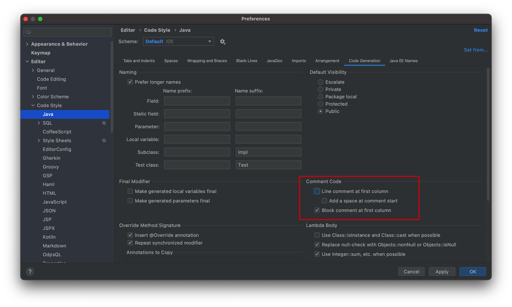
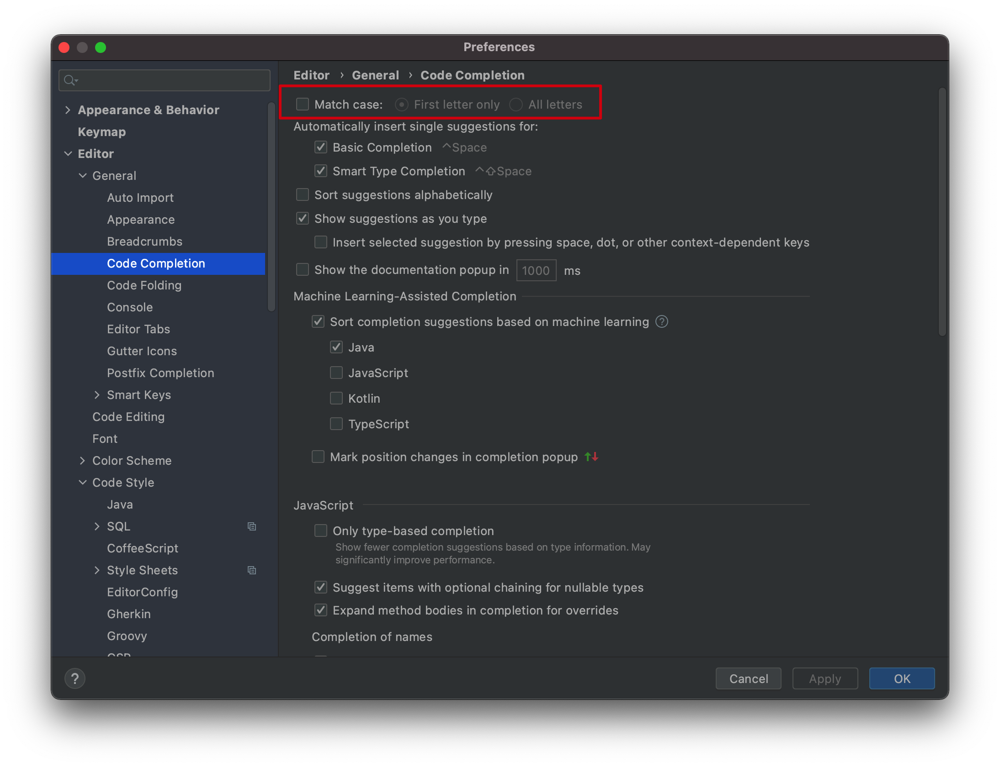
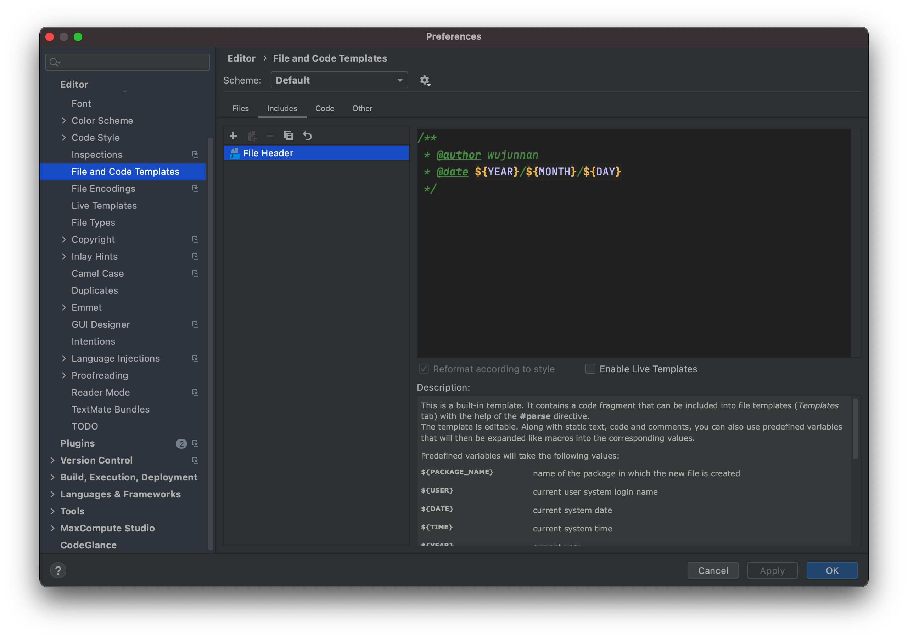
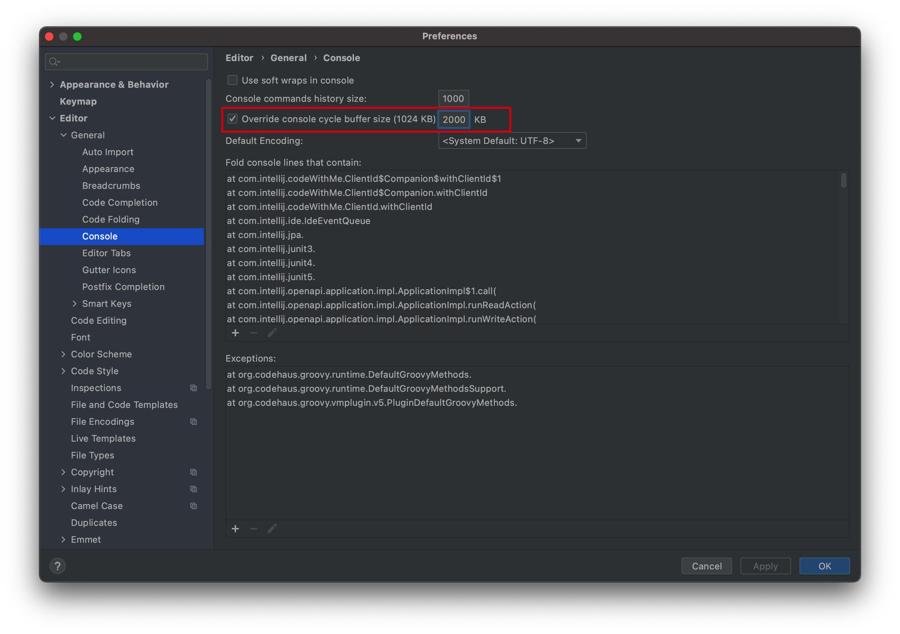

# IDEA

## 快捷键

- 插入快捷键

  `alt+inster==command+n`

- 整段加注释

  `shift+control+/`

- 重写方法

  `ctrl+O`

- 添加类

  `option+enter`

- 各视图区域的切换

  `cmd + 视图区域对应的数字`

- 显示方法的参数信息

  `Command+P`

- 打开项目结构对话框

  `Command+;` 

- 基本的代码补全

  `Ctrl+Space` 

- 自动生成变量名

  `Command+Option+v`

- 大小写切换

  `Command+Shift+u`

- 看每一行的编辑者是谁

  `右键+annotate`

- 查看某个类在哪个地方被使用

  `Alt+F7`

- 查看当前文件所处的位置

  `Alt+F1`
  
- 代码格式化

  `Ctrl+Alt+L`

## IDEA好用插件

### Lombok

略

### SQL Params Setter

一款将预查询语句和参数转换为SQL语句的插件。

当然同类插件也有更出名的mybatis log plugin，但是开始收费了，就找了个代替的。

说明如下：

>A simple tool that helps you to extract a executable sql from mybatis logs like below:
>==> Preparing: select * from table where name = ?
>==> Parameters: Tom(String)
>After selecting these two lines of logs above, you can right click your mouse and select "SQL Params Setter" in the popup menu, then the result executable sql, i.e. "select * from table where name = 'Tom'" will be copied to your clipboard.
>
>Note:
>The selected area should contain both keyword [Preparing:] in the 1st line and keyword [Parameters:] in the 2nd line.

### CamelCase

各种驼峰，蛇形等各种形式的转换。

IDEA自带的有大小写转换，但是实际上遇到数据库中的蛇形字段转换成驼峰的需求的时候，就无法满足了，可以使用此插件。

说明如下：

> Switch easily between kebab-case, SNAKE_CASE, PascalCase, camelCase, snake_case or space case. See Edit menu or use ⇧ + ⌥ + U / Shift + Alt + U. Allows to disable some conversions or change their order in the preferences.

### POJO to JSON

将POJO转换为JSON方便接口调试，使用postman调试的时候，可以直接将pojo复制成json的格式放入请求体。

### Json Formatter

可以进行Json的格式校验和格式化。

说明如下：

>Usage: Paste JSON string into editor, and press Reformat Code (Ctrl/Command + Alt + L in windows) to format code as if you editing a file with .json suffix.

### RestfulToolkit

一套 RESTful 服务开发辅助工具集。

功能如下：

1. 根据 URL 直接跳转到对应的方法定义 ( `Ctrl \` or `Ctrl Alt N` );
2. 提供了一个 Services tree 的显示窗口;
3. 一个简单的 http 请求工具;
4. 在请求方法上添加了有用功能: 复制生成 URL;,复制方法参数...
5. 其他功能: java 类上添加 Convert to JSON 功能，格式化 json 数据 ( Windows: `Ctrl + Enter`; Mac:`Command + Enter` )。

## IDEA配置

### 双斜杠注释紧贴代码而不是在行首



效果：

```
修改前：
//    public ...
修改后：
    //public ...
```

### 代码提示取消大小写匹配



### 创建文件的时候，自动创建文件头注释



如下：

```
/**
 * @author wujunnan
 * @date ${YEAR}/${MONTH}/${DAY}
 */
```

- 设置控制台限制的文件总大小

  

### 格式化部分代码

当去别的组开发的时候，别人的代码可能存在没有格式化的情况，从而导致格式化后大量的修改，所以需要格式化部分代码

#### 方式一

按快捷键`Command+Shift+Alt+L`，调出格式化配置对话框：


- Only VSC changed text

  > If this checkbox is selected, then reformatting will apply only to the files that have been changed locally, but not yet checked in to the repository.

  也就是未`git commit`的代码

- Optimize imports

  删除未使用的import语句

- Rearrange code

  根据`Code Style settings`的设置对代码格式化

- Code cleanup

  IDEA自动修复可能存在问题的代码

## 配置Java远程Debug

**服务端**

在启动程序的时候，加上如下参数，即可开启Debug模式

```
-Xdebug  -Xrunjdwp:transport=dt_socket,server=y,suspend=n,address=8089
```

**客户端**

在IDEA中添加Remote-JVM Debug，配置如下图所示：


## iml文件

iml文件是Intelij在你的根目录创建的一个文件，它对你的代码没有任何影响。

这个文件和代码无关，**不应该被git管理**，即使你的代码没有变动，这个文件也会有变化，而且maven等都可以创建此文件

## References

1. https://www.jetbrains.com/help/idea/2021.2/reformat-file-dialog.html
