# RabbitMQ

## MQ

> MQ(Message Queue)消息队列，是基础数据结构中“先进先出”的一种数据结构。一般用来解决应用解耦，异步消息，流量削峰等问题，实现高性能，高可用，可伸缩和最终一致性架构。

## MQ的使用场景

我们拿订单流程举例，那么我们的订单系统生成订单后需要分别调用物流系统，库存系统，积分系统，优惠券系统短信系统等。

- 解耦

  在上述情形中，当积分系统修改，我们需要对订单系统进行代码的修改并重新部署，或者订单系统发生故障的时候，订单系统也会受到影响，耦合性高，非常麻烦，使用MQ，我们可以让订单系统将消息发送到MQ，其他几个系统从中读取消息，订单系统不需要再关心其他系统，从而降低了耦合性，提高系统的可维护性。

- 异步

  我们上述流程包含很多步骤，如果采用同步的方式完整走完一个流程需要很长时间，那么像积分库存优惠券等对实时一致性要求不高的就可以消息队列异步的方式，来缩短用户的请求响应时间，提高了用户体验和系统吞吐量(单位时间内处理请求的数目)。

- 削峰

  进行促销时，一次性来了很多的请求，很可能超过我们几台服务器的处理能力，这时候我们可以使用消息队列，一次性接收这些请求，每台服务器按照自己的处理能力来获取请求并处理，这样系统就不容易因为超负载而崩溃，提高了系统的稳定性。

## MQ存在的问题

- 系统复杂性

  多增加了一个环节，增加了系统的复杂性

- 数据一致性

  这是分布式服务存在的一个问题，所有的服务全部执行成功，那么这个订单才是成功执行的，我们可以使用分布式事务来解决上述问题

- 可用性

  当MQ服务器宕机，就会导致整个服务不可用

## MQ小结

既然 MQ 有优势也有劣势，那么使用 MQ 需要满足什么条件呢？

- 生产者不需要从消费者处获得反馈。引入消息队列之前的直接调用，其接口的返回值应该为空，这才让明明下层的动作还没做，上层却当成动作做完了继续往后走，即所谓异步成为了可能。
- 容许短暂的不一致性。
- 确实是用了有效果。即解耦、提速、削峰这些方面的收益，超过加入MQ，管理MQ这些成本。

## 技术选型

目前在市面上比较主流的消息队列中间件主要有，**Kafka、ActiveMQ、RabbitMQ、RocketMQ** 等这几种。

|                | **RabbitMQ**                                                 | **ActiveMQ**                            | **RocketMQ**             | **Kafka**                                      |
| -------------- | ------------------------------------------------------------ | --------------------------------------- | ------------------------ | ---------------------------------------------- |
| 公司/社区      | Rabbit                                                       | Apache                                  | 阿里                     | Apache                                         |
| 开发语言       | **Erlang**                                                   | Java                                    | Java                     | Scala&Java                                     |
| 协议支持       | AMQP, XMPP, SMTP, STOMP                                      | OpenWire, STOMP, REST, XMPP, AMQP       | 自定义                   | 自定义协议，社区封装了http协议支持             |
| 客户端支持语言 | 官方支持Erlang，Java，Ruby等,社区产出多种API，几乎支持所有语言 | Java, C, C++, Python, PHP, Perl, .net等 | Java, C++（不成熟）      | 官方支持Java,社区产出多种API，如PHP，Python等  |
| 单机吞吐量     | 万级（其次）                                                 | **万级（最差）**                        | 十万级（最好）           | 十万级（次之）                                 |
| 消息延迟       | 微妙级                                                       | 毫秒级                                  | 毫秒级                   | 毫秒以内                                       |
| 功能特性       | 并发能力强，性能极其好，延时低，社区活跃，管理界面丰富       | 老牌产品，成熟度高，文档较多            | MQ功能比较完备，扩展性佳 | 只支持主要的MQ功能，毕竟是为大数据领域准备的。 |

**ActiveMQ**和**RabbitMQ**这两着因为吞吐量还有GitHub的社区活跃度的原因，在各大互联网公司都已经基本上绝迹了，业务体量一般的公司会是有在用的，但是越来越多的公司更青睐**RocketMQ**这样的消息中间件了。

**Kafka**在大数据领域，公司的日志采集，实时计算等场景，都离不开他的身影，算得上是世界范围级别的消息队列标杆。

[Reference](https://www.zhihu.com/question/54152397)

## 基于RabbitMQ的MQ实战

### AMQP协议

AMQP协议中间的几个重要概念：

- Server：接收客户端的连接，实现AMQP实体服务。
- Connection：连接，应用程序与Server的网络连接，TCP连接。
- Channel：信道，消息读写等操作在信道中进行。客户端可以建立多个信道，每个信道代表一个会话任务。
- Message：消息，应用程序和服务器之间传送的数据，消息可以非常简单，也可以很复杂。有Properties和Body组成。Properties为外包装，可以对消息进行修饰，比如消息的优先级、延迟等高级特性；Body就是消息体内容。
- Virtual Host：虚拟主机，用于逻辑隔离。一个虚拟主机里面可以有若干个Exchange和Queue，同一个虚拟主机里面不能有相同名称的Exchange或Queue。
- Exchange：交换器，接收消息，按照路由规则将消息路由到一个或者多个队列。如果路由不到，或者返回给生产者，或者直接丢弃。RabbitMQ常用的交换器常用类型有direct、topic、fanout、headers四种，后面详细介绍。
- Binding：绑定，交换器和消息队列之间的虚拟连接，绑定中可以包含一个或者多个RoutingKey。
- RoutingKey：路由键，生产者将消息发送给交换器的时候，会发送一个RoutingKey，用来指定路由规则，这样交换器就知道把消息发送到哪个队列。路由键通常为一个“.”分割的字符串，例如“com.rabbitmq”。
- Queue：消息队列，用来保存消息，供消费者消费。

我们完全可以直接使用 Connection 就能完成信道的工作，为什么还要引入信道呢?

试想这样一个场景， 一个应用程序中有很多个线程需要从 RabbitMQ 中消费消息，或者生产消息，那么必然需要建立很多个 Connection，也就是许多个 TCP 连接。然而对于操作系统而言，建立和销毁 TCP 连接是非常昂贵的开销，如果遇到使用高峰，性能瓶颈也随之显现。 RabbitMQ 采用 TCP 连接复用的方式，不仅可以减少性能开销，同时也便于管理 。

### 交换器的类型

RabbitMQ常用的交换器类型有direct、topic、fanout、headers四种

[Reference](https://www.cnblogs.com/sgh1023/p/11217017.html)

### docker安装rabbitMQ

```
#1.查找带管控台页面插件的rabbitmq镜像
docker search rabbitmq:management
#2.获取镜像
docker pull rabbitmq:management
#3.安装镜像 -d 后台运行容器，并返回容器ID 
#-p 指定端口映射，格式为：主机(宿主)端口:容器端口
#--name 给运行的程序起个名称
docker run -d -p 5672:5672 -p 15672:15672 --name rabbitmq rabbitmq:management
```

地址栏访问： http://ip:15672  默认账号密码： guest/guest

### rabbitMQ管控台操作

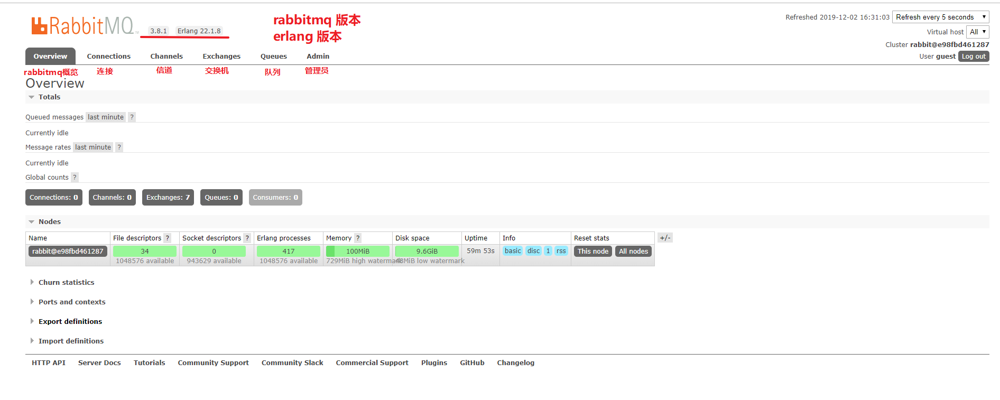

#### 添加队列

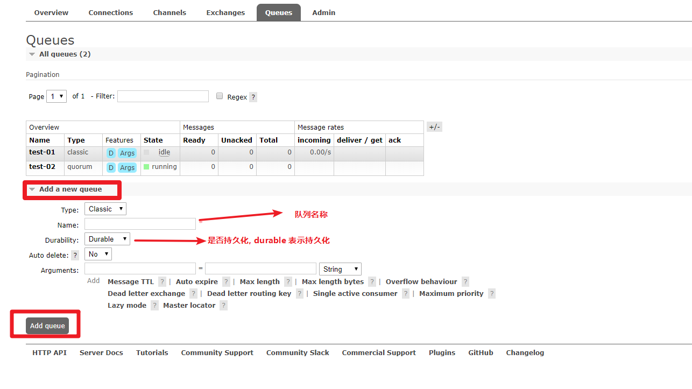

#### 添加交换机

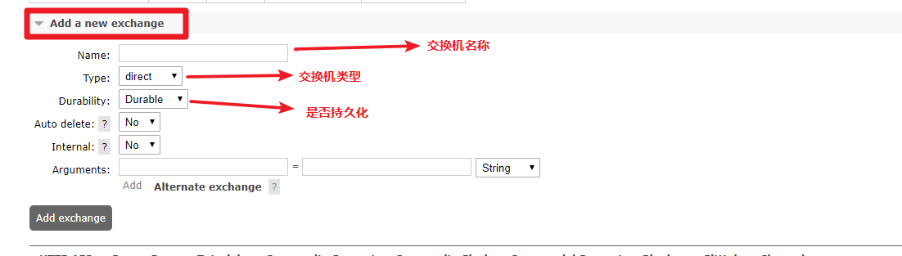

#### 用户角色

RabbitMQ在安装好后，可以访问http://localhost:15672；其自带了guest/guest的用户名和密码；如果需要创建自定义用户；那么也可以登录管理界面后，如下操作：

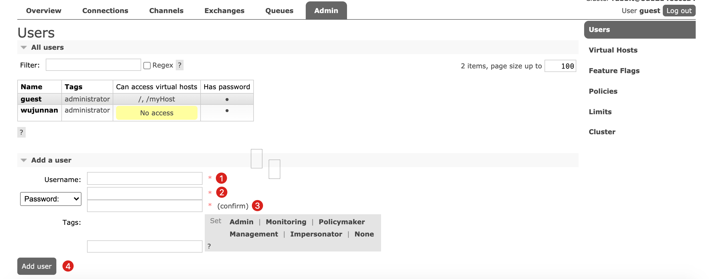

**角色说明：**

1. 超级管理员(administrator)可登陆管理控制台，可查看所有的信息，并且可以对用户，策略(policy)进行操作。
2. 监控者(monitoring)可登陆管理控制台，同时可以查看rabbitmq节点的相关信息(进程数，内存使用情况，磁盘使用情况等)
3. 策略制定者(policymaker)可登陆管理控制台, 同时可以对policy进行管理。但无法查看节点的相关信息(上图红框标识的部分)。
4. 普通管理者(management)仅可登陆管理控制台，无法看到节点信息，也无法对策略进行管理。
5. 其他无法登陆管理控制台，通常就是普通的生产者和消费者。

#### Virtual Hosts配置

像mysql拥有数据库的概念并且可以指定用户对库和表等操作的权限。RabbitMQ也有类似的权限管理；在RabbitMQ中可以虚拟消息服务器Virtual Host，每个Virtual Hosts相当于一个相对独立的RabbitMQ服务器，每个VirtualHost之间是相互隔离的。exchange、queue、message不能互通。相当于mysql的db。Virtual Name一般以/开头。

- 创建Virtual Hosts

  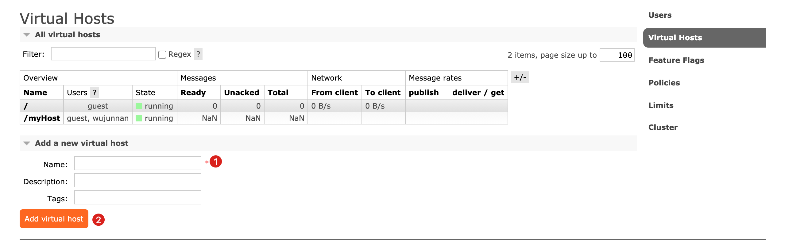

- 设置Virtual Hosts权限

  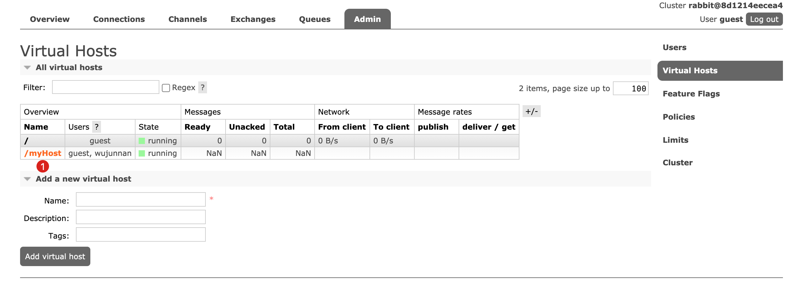

  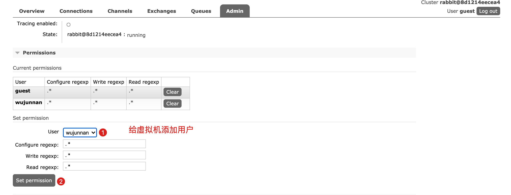

### MQ的几种模式

使用springboot创建模块，然后导入相关依赖

```
    <dependencies>
        <!--amqp协议相关依赖-->
        <dependency>
            <groupId>org.springframework.boot</groupId>
            <artifactId>spring-boot-starter-amqp</artifactId>
        </dependency>


        <!--spring web依赖-->
        <dependency>
            <groupId>org.springframework.boot</groupId>
            <artifactId>spring-boot-starter-web</artifactId>
        </dependency>

        <!--spring test依赖-->
        <dependency>
            <groupId>org.springframework.boot</groupId>
            <artifactId>spring-boot-starter-test</artifactId>
            <scope>test</scope>
            <!--junit-vintage-engine是JUnit 5为兼容JUnit4而编写的API-->
            <exclusions>
                <exclusion>
                    <groupId>org.junit.vintage</groupId>
                    <artifactId>junit-vintage-engine</artifactId>
                </exclusion>
            </exclusions>
        </dependency>
        <!--rabbit的测试依赖-->
        <dependency>
            <groupId>org.springframework.amqp</groupId>
            <artifactId>spring-rabbit-test</artifactId>
            <scope>test</scope>
        </dependency>


        <!--lombok插件-->
        <dependency>
            <groupId>org.projectlombok</groupId>
            <artifactId>lombok</artifactId>
        </dependency>
    </dependencies>
```

在application.yml中配置文件来连接rabbitMQ

```
spring:
  rabbitmq:
    host: wujunnan.net #ip地址
    port: 5672 #通信端口#5672是rabbitmq 默认TCP监听端口 RabbitMQ管理控制台：RabbitMQ版本3.x的端口15672
    username: wujunnan #用户名
    password: wujunnan #密码
    virtual-host: /myhost #虚拟host
```

建立好的模块模板如下：

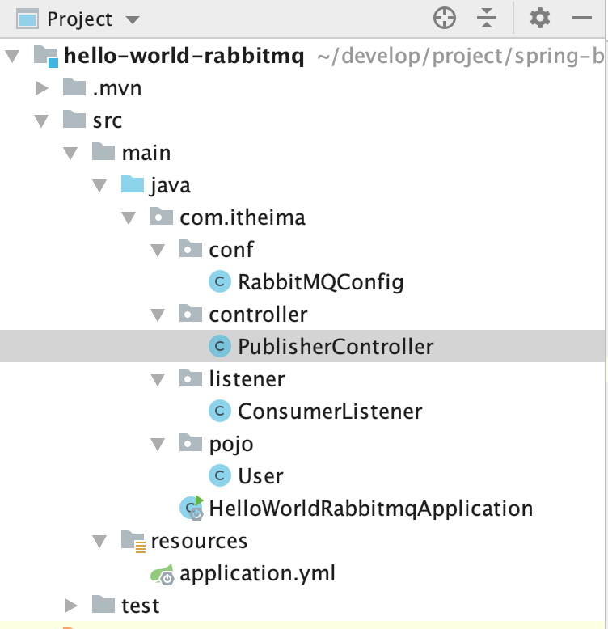

user是用于发送的pojo类

#### 简单模式

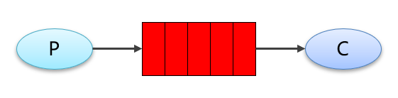

- RabbitMQConfig

  定义一个配置类，里面使用@bean初始化Queue

  ```java
  /************简单模式****************/
  public static final String SIMPLE_QUEUE_STRING = "simple.queue.string";
  public static final String SIMPLE_QUEUE_USER = "simple.queue.user";
  
  @Bean
  public Queue simpleQueueString(){
    return new Queue(SIMPLE_QUEUE_STRING);
  }
  
  @Bean
  public Queue simpleQueueUser(){
    return new Queue(SIMPLE_QUEUE_USER);
  }
  ```

- PublisherController

  ```java
  @Autowired
  private RabbitTemplate rabbitTemplate;
  /************简单模式*****************/
  @GetMapping("/simpleSendMess/{message}")
  public String sendMessage(@PathVariable String message){
    //第一个参数是routingkey,简单模式下，routing就是队列名称
    rabbitTemplate.convertAndSend(RabbitMQConfig.SIMPLE_QUEUE_STRING, message);
    return "ok";
  }
  
  @GetMapping("/simpleSendUser")
  public String sendUser(){
    User user = new User("猴子","吃我一棒");
    rabbitTemplate.convertAndSend(RabbitMQConfig.SIMPLE_QUEUE_USER, user);
    return "ok";
  }
  ```

- ConsumerListener

  ```java
  /**************简单模式*******************/
  @RabbitListener(queues = RabbitMQConfig.SIMPLE_QUEUE)
  //也可以使用一个对象来接收
  public void helloConsumer(String message){
    log.info("simple-listener "+message);
  }
  ```

- 结果

  分别访问：

  - `http://localhost:8080/simpleSendUser`
  - `http://localhost:8080/simpleSendMess/123`

  ```
  2020-12-02 14:22:46.806  INFO 41023 --- [ntContainer#1-1] com.itheima.listener.ConsumerListener    : simple-listener user:User(name=猴子, note=吃我一棒)
  2020-12-02 14:23:43.207  INFO 41023 --- [ntContainer#0-1] com.itheima.listener.ConsumerListener    : simple-listener 123
  ```

  

#### 工作队列模式

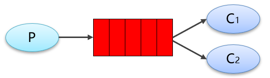

与入门程序的简单模式相比，多了一个或一些消费端，多个消费端共同消费同一个队列中的消息。对于任务过重或任务较多情况使用工作队列可以提高任务处理的速度。

- RabbitMQConfig

  ```java
  /************工作队列模式*****************/
  public static final String WORK_QUEUE = "work.queue";
  
  @Bean
  public Queue workQueue(){
    return new Queue(WORK_QUEUE);
  }
  ```

- PublisherController

  ```java
  /************工作队列模式*****************/
  @GetMapping("/work/{message}/{num}")
  public String workMessage(@PathVariable("message") String message ,@PathVariable("num") Integer num){
    for (int i = 0; i < num; i++) {
      rabbitTemplate.convertAndSend(RabbitMQConfig.WORK_QUEUE, message+i);
    }
    return "ok";
  }
  ```

- ConsumerListener

  ```java
  /************工作队列模式*****************/
  @RabbitListener(queues = RabbitMQConfig.WORK_QUEUE)
  public void workConsumer01(String message){
    log.info("work-listener01"+message);
  }
  
  @RabbitListener(queues = RabbitMQConfig.WORK_QUEUE)
  public void workConsumer02(String message){
    log.info("work-listener02"+message);
  }
  
  @RabbitListener(queues = RabbitMQConfig.WORK_QUEUE)
  public void workConsumer03(String message){
    log.info("work-listener03"+message);
  }
  ```

- 结果

  访问`http://localhost:8080/work/wujunnan/100`

  ```
  2020-12-02 14:45:39.633  INFO 41023 --- [ntContainer#3-1] com.itheima.listener.ConsumerListener    : work-listener02wujunnan4
  2020-12-02 14:45:39.634  INFO 41023 --- [ntContainer#4-1] com.itheima.listener.ConsumerListener    : work-listener03wujunnan2
  2020-12-02 14:45:39.634  INFO 41023 --- [ntContainer#2-1] com.itheima.listener.ConsumerListener    : work-listener01wujunnan0
  2020-12-02 14:45:39.635  INFO 41023 --- [ntContainer#4-1] com.itheima.listener.ConsumerListener    : work-listener03wujunnan5
  2020-12-02 14:45:39.635  INFO 41023 --- [ntContainer#3-1] com.itheima.listener.ConsumerListener    : work-listener02wujunnan7
  2020-12-02 14:45:39.638  INFO 41023 --- [ntContainer#2-1] com.itheima.listener.ConsumerListener    : work-listener01wujunnan3
  2020-12-02 14:45:39.639  INFO 41023 --- [ntContainer#2-1] com.itheima.listener.ConsumerListener    : work-listener01wujunnan6
  2020-12-02 14:45:39.640  INFO 41023 --- [ntContainer#3-1] com.itheima.listener.ConsumerListener    : work-listener02wujunnan10
  2020-12-02 14:45:39.641  INFO 41023 --- [ntContainer#2-1] com.itheima.listener.ConsumerListener    : work-listener01wujunnan9
  .....
  ```

#### 订阅模式

在订阅模型中，多了一个 Exchange 角色，交换机（X）。一方面，接收生产者发送的消息。另一方面，知道如何处理消息，例如递交给某个特别队列、递交给所有队列、或是将消息丢弃。到底如何操作，取决于Exchange的类型。Exchange有常见以下3种类型：

- Fanout：广播，将消息交给所有绑定到交换机的队列
- Direct：定向，把消息交给符合指定routing key 的队列
- Topic：通配符 ，把消息交给符合routing pattern（路由模式） 的队列

##### Fanout广播模式

场景：群发，弹窗

交换机需要与队列进行绑定，绑定之后；一个消息可以被多个消费者都收到，实质是一个广播消息，就像一个广播一样，大家听到的都是一样的

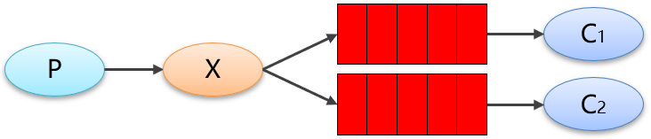

- RabbitMQConfig

  ```java
  
  /**************广播模式**************/
  public static final String FANOUT_EXCHANGE = "fantout.exchange";
  
  public static final String FANOUT_QUEUE1 = "fantout.queue1";
  
  public static final String FANOUT_QUEUE2 = "fantout.queue2";
  
  @Bean
  public FanoutExchange fantoutExchange(){
    return new FanoutExchange(FANOUT_EXCHANGE);
  }
  
  @Bean
  public Queue fanoutQueue1(){
    return new Queue(FANOUT_QUEUE1);
  }
  
  @Bean
  public Queue fanoutQueue2(){
    return new Queue(FANOUT_QUEUE2);
  }
  
  //建立交换机与队列的直接绑定关系
  @Bean
  public Binding bindFanoutQueue1(Queue fanoutQueue1,FanoutExchange fantoutExchange){
    return BindingBuilder.bind(fanoutQueue1).to(fantoutExchange);
  }
  
  
  @Bean
  public Binding bindFanoutQueue2(Queue fanoutQueue2,FanoutExchange fantoutExchange){
    return BindingBuilder.bind(fanoutQueue2).to(fantoutExchange);
  }
  ```

- PublisherController

  ```java
  /**************广播模式**************/
  @RequestMapping("/fanout/{message}")
  public String fanout(@PathVariable String message){
    rabbitTemplate.convertAndSend(RabbitMQConfig.FANOUT_EXCHANGE,null,message);
    return "ok";
  }
  ```

- ConsumerListener

  ```java
  /**************广播模式**************/
  @RabbitListener(queues = RabbitMQConfig.FANOUT_QUEUE1)
  public void fanoutMsg1(String message){
    log.info("fanout-listener1:" + message);
  }
  
  @RabbitListener(queues = RabbitMQConfig.FANOUT_QUEUE2)
  public void fanoutMsg2(String message){
    log.info("fanout-listener2:" + message);
  }
  ```

- 测试输出

  访问`http://localhost:8080/fanout/wujunnan`

  ```
  2020-12-02 15:00:32.182  INFO 41253 --- [ntContainer#6-1] com.itheima.listener.ConsumerListener    : fanout-listener2:wujunnan
  2020-12-02 15:00:32.183  INFO 41253 --- [ntContainer#5-1] com.itheima.listener.ConsumerListener    : fanout-listener1:wujunnan
  ```

##### Direct模式(路由)

场景：下单后，发邮件，发短信

队列与交换机的绑定，不能是任意绑定了，而是要指定一个 RoutingKey（路由key）

消息的发送方在向 Exchange 发送消息时，也必须指定消息的 RoutingKey

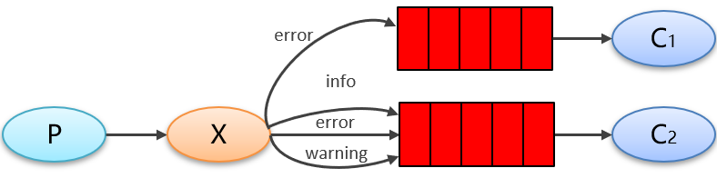

- RabbitMQConfig

  ```java
  /**************路由模式**************/
  public static final String DIRECT_EXCHANGE = "direct.exchange";
  
  public static final String DIRECT_ROUTEKEY_EMAIL = "dicret.email";
  
  public static final String DIRECT_ROUTEKEY_SM = "direct.sm";
  
  public static final String DIRECT_QUEUE_EMAIL = "direct.email.queue";
  
  public static final String DIRECT_QUEUE_SM = "direct.sm.queue";
  
  @Bean
  public DirectExchange directExchange(){
    return new DirectExchange(DIRECT_EXCHANGE);
  }
  
  @Bean
  public Queue directEmailQueue(){
    return new Queue(DIRECT_QUEUE_EMAIL);
  }
  
  @Bean
  public Queue directSmQueue(){
    return new Queue(DIRECT_QUEUE_SM);
  }
  
  @Bean
  public Binding bindingEmailQueue(Queue directEmailQueue,DirectExchange directExchange){
    return BindingBuilder.bind(directEmailQueue).to(directExchange).with(DIRECT_ROUTEKEY_EMAIL);
  }
  
  @Bean
  public Binding bindingSmQueue(Queue directSmQueue,DirectExchange directExchange){
    return BindingBuilder.bind(directSmQueue).to(directExchange).with(DIRECT_ROUTEKEY_SM);
  }
  ```

- PublisherController

  ```java
  /************路由模式****************/
  @RequestMapping("/direct/{routekey}/{message}")
  public String fanout(@PathVariable("routekey")String routekey, @PathVariable("message") String message){
    rabbitTemplate.convertAndSend(RabbitMQConfig.DIRECT_EXCHANGE,routekey,message);
    return "ok";
  }
  ```

- ConsumerListener

  ```java
  /**************路由模式**************/
  @RabbitListener(queues = RabbitMQConfig.DIRECT_QUEUE_EMAIL)
  public void directMsgEmail(String message){
    log.info("direct-email-listener: {}" ,message);
  }
  
  @RabbitListener(queues = RabbitMQConfig.DIRECT_QUEUE_SM)
  public void directMsgSM(String message){
    log.info("direct-SM-listener: {}" ,message);
  }
  ```

- 测试

  分别访问：

  `http://localhost:8080/direct/dicret.email/wujunnan`

  `http://localhost:8080/direct/dicret.sm/wujunnan`

  ```
  2020-12-02 15:29:43.028  INFO 41403 --- [ntContainer#7-1] com.itheima.listener.ConsumerListener    : direct-email-listener: wujunnan
  2020-12-02 15:30:01.233  INFO 41403 --- [ntContainer#8-1] com.itheima.listener.ConsumerListener    : direct-SM-listener: wujunnan
  ```

##### Topic模式（通配符模式 ）

Topic 类型与 Direct 相比，都是可以根据 RoutingKey 把消息路由到不同的队列。只不过 Topic 类型Exchange 可以让队列在绑定 Routing key 的时候使用**通配符**

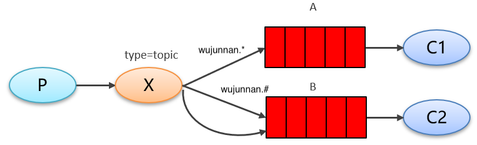

- RabbitMQConfig

  ```Java
  /**************主题模式**************/
  public static final String TOPIC_EXCHANGE = "topic.exchange";
  public static final String TOPIC_ROUTEKEY1 = "wujunnan.*";
  public static final String TOPIC_ROUTEKEY2 = "wujunnan.#";
  public static final String TOPIC_QUEUE1 = "topic.queue1";
  public static final String TOPIC_QUEUE2 = "topic.queue2";
  
  @Bean
  public TopicExchange topicExange(){
    return new TopicExchange(TOPIC_EXCHANGE);
  }
  
  @Bean
  public Queue topicQueue1(){
    return new Queue(TOPIC_QUEUE1);
  }
  
  @Bean
  public Queue topicQueue2(){
    return new Queue(TOPIC_QUEUE2);
  }
  
  @Bean
  public Binding bindingTopicQueue1(Queue topicQueue1,TopicExchange topicExchange){
    return BindingBuilder.bind(topicQueue1).to(topicExchange).with(TOPIC_ROUTEKEY1);
  }
  
  @Bean
  public Binding bindingTopicQueue2(Queue topicQueue2,TopicExchange topicExchange){
    return BindingBuilder.bind(topicQueue2).to(topicExchange).with(TOPIC_ROUTEKEY2);
  }
  ```

- PublisherController

  ```java
  /************主题模式****************/
  @RequestMapping("/topic/{routekey}/{message}")
  public String topic(@PathVariable("routekey")String routekey, @PathVariable("message") String message){
  rabbitTemplate.convertAndSend(RabbitConfig.TOPIC_EXCHANGE,routekey,message);
  return "ok";
  }
  ```

- ConsumerListener

  ```java
  /**************主题模式**************/
  @RabbitListener(queues = RabbitMQConfig.TOPIC_QUEUE1)
  public void topicMsg1(String message){
    log.info("topic-listener1:" + message);
  }
  
  @RabbitListener(queues = RabbitMQConfig.TOPIC_QUEUE2)
  public void topicMsg2(String message){
    log.info("topic-listener2:" + message);
  }
  ```

- 测试

  输入`http://localhost:8080/topic/wujunnan.1/helloword`

  ```
  2020-12-02 15:43:54.890  INFO 41544 --- [tContainer#10-1] com.itheima.listener.ConsumerListener    : topic-listener2:helloword
  2020-12-02 15:43:54.900  INFO 41544 --- [ntContainer#9-1] com.itheima.listener.ConsumerListener    : topic-listener1:helloword
  ```

  输入`http://localhost:8080/topic/wujunnan.1.2/helloword`

  ```
  2020-12-02 15:44:46.114  INFO 41544 --- [tContainer#10-1] com.itheima.listener.ConsumerListener    : topic-listener2:helloword
  ```

## MQ的高级特性

### 生产者确认

在使用 RabbitMQ 的时候，作为消息发送方希望杜绝任何消息丢失或者投递失败场景。RabbitMQ 为我们提供了两种方式用来控制消息的投递可靠性模式。

- confirm 确认模式
- return  退回模式

rabbitmq 整个消息投递的路径为：

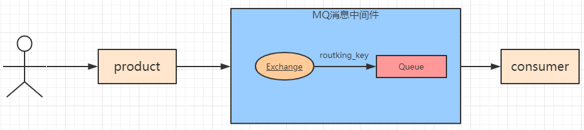

- 消息从 **product 到 exchange** 是否成功可以通过confirmCallback来进行确认
- 消息从 **exchange 到 queue**路由是否成功可以通过returnCallback来进行确认。

我们将利用这两个 callback 控制消息的可靠性投递

#### confirm确认模式

首先需要在配置文件中配置

```
publisher-confirms: true
```

使用`rabbitTemplate.setConfirmCallback`设置回调函数。当消息发送到exchange后回调confirm方法。在方法中判断ack，如果为true，则发送成功，如果为false，则发送失败，需要处理。

#### return退回模式

当消息从exchange路由到queue失败后，则会将消息退回给producer，并执行回调函数returnedMessage。

需要在配置文件中配置

```
publisher-returns: true
```

主要是编写confirm回调方法

```java
@Slf4j
@Component
public class RabbitTemplateConfig implements RabbitTemplate.ConfirmCallback, RabbitTemplate.ReturnCallback {
    @Autowired
    RabbitTemplate rabbitTemplate;

    /**
     * @PostConstruct
     *   保证这个方法在注入后执行，构造方法在@Autowired和@PostConstruct之前执行
     * ::双冒号
     *   java8中的新特性 用于方法的引用
     */
    @PostConstruct
    public void init(){
        rabbitTemplate.setConfirmCallback(this::confirm);
      	rabbitTemplate.setReturnCallback(this::returnedMessage);
    }
    /**
     *
     * @param correlationData
     * @param ack
     * @param cause
     */
    @Override
    public void confirm(CorrelationData correlationData, boolean ack, String cause) {
        if(ack){
            log.info("进入交换机成功");
        }else{
            log.info("进入交换机失败 cause:{}",cause);
        }
    }
  
  	    /**
     * return回退模式
     * @param message
     * @param replyCode
     * @param replyText
     * @param exchange
     * @param routingKey
     */
      @Override
      public void returnedMessage(Message message, int replyCode, String replyText, String exchange, String routingKey) {
          log.info("消息发送到routekey失败，exchange:{},routingKey:{},replyCode:{},replyText:{}",exchange, routingKey, replyCode, replyText);
      }
}
```

### 消费者确认(ACK)

表示消费端收到消息后的确认方式。有三种确认方式：

- 自动确认：`acknowledge="none"`
- 手动确认：`acknowledge="manual"`
- 根据异常情况确认：`acknowledge="auto"`

如果设置了手动确认方式，则需要在业务处理成功后，调用`channel.basicAck()`，手动签收，如果出现异常，则调用`channel.basicNack()`方法，让其自动重新发送消息。

```java
    @RabbitListener(queues = RabbitConfig.DIRECT_QUEUE2)
    public void reciveMesConsumer(String mes, Channel channel,@Header(AmqpHeaders.DELIVERY_TAG) long deliveryTag,@Header(AmqpHeaders.REDELIVERED) boolean redelivered){
        log.info("message: {}, deliveryTag: {}", mes, deliveryTag);
        try {
            if(mes.equals("台湾")){
                throw new RuntimeException("不能去台湾");
            }
        /*
        deliverTag信道中每接收一次消息，自增1
        第二个参数代表是否批量确认,我们这里只确认一条消息所以设置为false
        basicAck 代表接收消息后业务逻辑处理正常，rabbitmq可以将此消息删除掉了
         */
            try {
                channel.basicAck(deliveryTag,false);
            } catch (IOException e) {
                e.printStackTrace();
            }
        } catch (Exception e) {
            //如果是第二次消费失败
            if(redelivered) {
                log.info("第二次消费失败,不允许重回队列, " +
                        "message: {}, deliveryTag: {}, redelivered: {}", mes, deliveryTag, redelivered);

                //不要再重回队列
                try {
                    channel.basicNack(deliveryTag, false, false);
                } catch (IOException e1) {
                    log.error("拒绝重回队列异常： {}", e1);
                }
            }else{
                //第一次消费失败
                log.info("消费失败,重回队列, message: {}, deliveryTag: {}", mes, deliveryTag);
                /*
                第三个参数代表是否重回队列
                 */
                try {
                    channel.basicNack(deliveryTag, false, true);
                } catch (IOException e1) {
                    log.error("重回队列异常： {}", e1);
                }
            }
        }
    }
}
```

### 消费端限流

在配置文件中设置

```
listener:
  simple:
    acknowledge-mode: manual #开启消费者手动确认
    prefetch: 1 #消费者在未确认消息时一次拉取消息的数量
```

然后在消费者中增加时间来增加处理时间

```java
try {
  TimeUnit.SECONDS.sleep(3);
} catch (InterruptedException e) {
  e.printStackTrace();
}
```

### TTL

TTL 全称 Time To Live（存活时间/过期时间）。当消息到达存活时间后，还没有被消费，会被自动清除。

RabbitMQ可以对消息设置过期时间，也可以对整个队列（Queue）设置过期时间。给单个消息设置过期时间没实际意义。