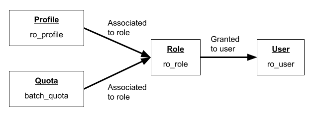
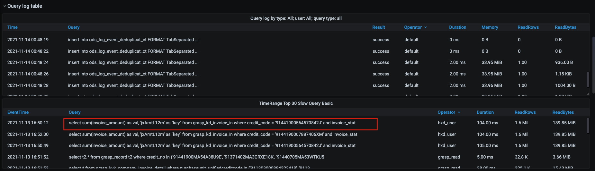

# ClickHouse

## 什么是ClickHouse

ClickHouse是俄罗斯 Yandex开发的用于联机分析(**OLAP**)的**列式**数据库管理系统。

在列式数据库系统中，来自同一列的数据被存储在一起。

**OLAP场景的关键特征**

- 绝大多数是读请求
- 数据以相当大的批次(> 1000行)更新，而不是单行更新;或者根本没有更新。
- 已添加到数据库的数据不能修改。
- 对于读取，从数据库中提取相当多的行，但只提取列的一小部分。
- 宽表，即每个表包含着大量的列
- 查询相对较少(通常每台服务器每秒查询数百次或更少)
- 对于简单查询，允许延迟大约50毫秒
- 列中的数据相对较小：数字和短字符串(例如，每个URL 60个字节)
- 处理单个查询时需要高吞吐量(每台服务器每秒可达数十亿行)
- 事务不是必须的
- 对数据一致性要求低
- 每个查询有一个大表。除了他以外，其他的都很小。
- 查询结果明显小于源数据。换句话说，数据经过过滤或聚合，因此结果适合于单个服务器的RAM中

**注意：**

关于ClickHouse的简称，ClickHouse是由Click和House两个单词组成，所以按照英语缩写的规范，应该缩写为`CH`，而不是内裤`CK`！

官方文档明确写到：

>If you need to abbreviate it, use **CH**. For some historical reasons, abbreviating as CK is also popular in China, mostly because one of the first talks about ClickHouse in Chinese used this form.

[详见此](https://clickhouse.com/docs/en/faq/general/dbms-naming/)

## 安装

### 安装软件

可以参考[官方文档](https://clickhouse.tech/docs/zh/getting-started/install/)，CentOS推荐使用`RPM`/`yum`的方式安装。

方式一：yum的方式（默认安装最新的稳定版）：

- ClickHouse的安装包并不在Linux官方yum仓库中，需要添加官方存储库

  ```
  $ sudo yum install yum-utils
  $ sudo rpm --import https://repo.clickhouse.com/CLICKHOUSE-KEY.GPG
  $ sudo yum-config-manager --add-repo https://repo.clickhouse.com/rpm/stable/x86_64
  ```

- 运行命令安装

  ```
  $ sudo yum install clickhouse-server clickhouse-client
  ```

方式二：（如果想要下载自己想要的更新或者更旧的版本）可以自己下载rpm安装包进行安装，[点此下载](https://repo.yandex.ru/clickhouse/rpm/stable/x86_64/)

- 需要下载三个包，最好一样的版本

  - `clickhouse-common-static` — ClickHouse编译的二进制文件。
  - `clickhouse-server` — 创建`clickhouse-server`软连接，并安装默认配置服务
  - `clickhouse-client` — 创建`clickhouse-client`客户端工具软连接，并安装客户端配置文件。

- rpm上传服务器，分别安装

  ```
  #依赖项common-static需要先安装
  $ rpm -ivh clickhouse-common-static-20.9.3.45-2.x86_64.rpm clickhouse-client-20.9.3.45-2.noarch.rpm clickhouse-server-20.9.3.45-2.noarch.rpm
  ```

### 修改配置文件

- `config.xml`

  - 这里需要开启允许其他IP连接，默认只允许本机连接

    ```xml
    <listen_host>::</listen_host>
    ```

- `user.xml`

  这里需要设置用户的密码
  
  ```xml
  <password>123456</password>
  ```

### 修改数据目录

我们可以看到ClickHouse使用的默认的数据文件夹如下：

```xml
<path>/var/lib/clickhouse/</path>
<tmp_path>/var/lib/clickhouse/tmp/</tmp_path>
<user_files_path>/var/lib/clickhouse/user_files/</user_files_path>
```

由于公司的服务器默认给`/data`了很大的分区，专门用于存放数据，我在安装的时候没有将数据目录指定到`/data`下，导致其他分区inode很快用完了，所以，要将数据放在`/data`下（取决服务器的分区）

服务器分区如下：

```
$ df
文件系统           1K-块     已用      可用 已用% 挂载点
devtmpfs        16379192        0  16379192    0% /dev
tmpfs           16390100       24  16390076    1% /dev/shm
tmpfs           16390100      948  16389152    1% /run
tmpfs           16390100        0  16390100    0% /sys/fs/cgroup
/dev/vda1       51473868 12459740  36816884   26% /
/dev/vdb1      515927296 25023880 464672684    6% /data
tmpfs            3278020        0   3278020    0% /run/user/0
tmpfs            3278020        0   3278020    0% /run/user/1002
```

修改数据文件有两种方法：

方法一：修改配置文件

将上面的配置文件中的`/var/lib/clickhouse`和`var/log/clickhouse-server`修改为`/data/clickhouse/data`和`/data/clickhouse/log`，并创建对应的文件夹，修改属主为ClickHouse。

方法二：建立软连接

思路是不修改配置文件，将原系统默认位置下的数据和日志复制到/data/clickhouse下，并在原文件位置建立软连接。

- 在合理的分区创建日志和数据文件夹

- 复制数据、日志 删除原文件夹、修改属主（如果是新的ClickHouse，则不需要复制数据）

  ``` 
  $ sudo mv /var/lib/clickhouse/* /data/clickhouse/data/
  $ sudo mv /var/log/clickhouse-server/* /data/clickhouse/log/
  ```
  
- 修改属主

  ```
  $ sudo chown -R clickhouse:clickhouse /data/clickhouse/data/
  $ sudo chown -R clickhouse:clickhouse /data/clickhouse/log/
  ```
  
- 删除原文件夹、修改属主

  ```
  $ sudo rm -r /var/lib/clickhouse/
  $ sudo rm -r /var/log/clickhouse-server/
  ```
  
- 建立软连接

  ```
  $ sudo ln -s /data/clickhouse/data/ /var/lib/clickhouse
  $ sudo ln -s /data/clickhouse/log/ /var/log/clickhouse-server
  ```

建议采用第二种方式：

采用第一种方式需要改配置文件，而且数据会分别存储在`/var/lib/`文件（系统表）下和`/data/clickhouse/`下，不利于数据迁移，如下：

```
$ sudo ls -l /var/lib/clickhouse/metadata
lrwxrwxrwx 1 clickhouse clickhouse 63 11月  3 14:30 hxd -> /data/clickhouse/store/9ee/9eecb5e2-e144-48db-9cc0-729698e960e8
-rw-r----- 1 clickhouse clickhouse 78 11月  3 14:30 hxd.sql
lrwxrwxrwx 1 clickhouse clickhouse 67 11月  3 14:30 system -> /var/lib/clickhouse/store/2c0/2c0341a6-1658-4606-ac03-41a616588606/
-rw-r----- 1 clickhouse clickhouse 78 11月  3 14:30 system.sql
```

第二种方式不需要修改配置文件，而且数据都在一个文件夹下。

## 配置文件解读

### users.xml

[详见官方文档](https://clickhouse.com/docs/en/operations/settings/settings-users/#user-name-databases)

```xml
<users>
    <!-- If user name was not specified, 'default' user is used. -->
    <user_name>
        <password></password>
        <!-- Or -->
        <password_sha256_hex></password_sha256_hex>

        <access_management>0|1</access_management>

        <networks incl="networks" replace="replace">
        </networks>

        <profile>profile_name</profile>

        <quota>default</quota>
        <default_database>default<default_database>
        <databases>
            <database_name>
                <table_name>
                    <filter>expression</filter>
                <table_name>
            </database_name>
        </databases>
    </user_name>
    <!-- Other users settings -->
</users>
```

#### access_management

是否允许改用户使用SQL管理用户权限，默认值为0。

#### profiles

profiles即配置，下面是ClickHouse默认的只读配置：

```xml
<default>
    <!-- Maximum memory usage for processing single query, in bytes. -->
    <max_memory_usage>10000000000</max_memory_usage>

    <!-- Use cache of uncompressed blocks of data. Meaningful only for processing many of very short queries. -->
    <use_uncompressed_cache>0</use_uncompressed_cache>

    <!-- How to choose between replicas during distributed query processing.
                 random - choose random replica from set of replicas with minimum number of errors
                 nearest_hostname - from set of replicas with minimum number of errors, choose replica
                  with minimum number of different symbols between replica's hostname and local hostname
                  (Hamming distance).
                 in_order - first live replica is chosen in specified order.
                 first_or_random - if first replica one has higher number of errors, pick a random one from replicas with minimum number of errors.
            -->
    <load_balancing>random</load_balancing>
</default>
```

配置的作用是关联到用户上，例如官方文档提供只读的profile:

```xml
<!-- Profile that allows only read queries. -->
<readonly>
    <readonly>1</readonly>
</readonly>
```

注意：


示例：

```xml
<!-- Settings profiles -->
<profiles>
    <!-- Default settings -->
    <default>
        <!-- The maximum number of threads when running a single query. -->
        <max_threads>8</max_threads>
    </default>

    <!-- Settings for quries from the user interface -->
    <web>
        <max_rows_to_read>1000000000</max_rows_to_read>
        <max_bytes_to_read>100000000000</max_bytes_to_read>

        <max_rows_to_group_by>1000000</max_rows_to_group_by>
        <group_by_overflow_mode>any</group_by_overflow_mode>

        <max_rows_to_sort>1000000</max_rows_to_sort>
        <max_bytes_to_sort>1000000000</max_bytes_to_sort>

        <max_result_rows>100000</max_result_rows>
        <max_result_bytes>100000000</max_result_bytes>
        <result_overflow_mode>break</result_overflow_mode>

        <max_execution_time>600</max_execution_time>
        <min_execution_speed>1000000</min_execution_speed>
        <timeout_before_checking_execution_speed>15</timeout_before_checking_execution_speed>

        <max_columns_to_read>25</max_columns_to_read>
        <max_temporary_columns>100</max_temporary_columns>
        <max_temporary_non_const_columns>50</max_temporary_non_const_columns>

        <max_subquery_depth>2</max_subquery_depth>
        <max_pipeline_depth>25</max_pipeline_depth>
        <max_ast_depth>50</max_ast_depth>
        <max_ast_elements>100</max_ast_elements>

        <readonly>1</readonly>
    </web>
</profiles>
```

#### quota

[详见官方文档](https://clickhouse.com/docs/en/operations/quotas/#quotas)

配额，用来控制该用户使用ClickHouse的资源。

```xml
<!-- Quotas. -->
<quotas>
    <!-- Name of quota. -->
    <default>
        <!-- Limits for time interval. You could specify many intervals with different limits. -->
        <interval>
            <!-- Length of interval. -->
            <duration>3600</duration>

            <!-- No limits. Just calculate resource usage for time interval. -->
            <queries>0</queries>
            <errors>0</errors>
            <result_rows>0</result_rows>
            <read_rows>0</read_rows>
            <execution_time>0</execution_time>
        </interval>
    </default>
</quotas>
```

### users.d

推荐配置文件添加到此文件夹中，好处在于如果升级版本，users.xml也会跟着更新，但是user.d文件夹下的东西不会丢失。

注意：配置文件会按照字母表的顺序进行加载，如果你确定想要某个配置可能存在冲突，你可以给你想要生效的配置文件前面加上`z_`前缀，让其最后执行。

## 使用

- 启动服务

  ```
  # 21.8版本支持
  $ sudo clickhouse start
  ```

  或

  ```
  $ sudo /etc/init.d/clickhouse-server start
  ```

  前台启动

  ```
  $ sudo -u clickhouse clickhouse-server --config-file=/etc/clickhouse-server/config.xml
  ```

- 关闭服务

  ```
  $ sudo /etc/init.d/clickhouse-server stop
  ```
  
- 开启客户端

  ```
  $ clickhouse-client
  ```

### 客户端

具体请查看官方文档：

[Command-line Client](https://clickhouse.com/docs/en/interfaces/cli/#command-line-client)

参数：

- `--user, -u` 

  用户名，默认为default

- `--password` 

  密码，默认为空字符串

- `--query -q`

  使用非交互模式，指定查询语句

- `--queries_file, -qf`

  执行对应的sql文件（低版本不支持，如20年12月之前的）

  后面可以加绝对路径或者相对路径

- `--format, -f`

  使用特定的格式输出结果

- `--multiline -m`

  允许多行查询

- `--multiquery -n`

  允许多个查询使用分号分隔

例如：

- 非交互式一次提交多个语句：

  ```
  $ clickhouse-client --multiquery --query "show databases;show tables from system;"
  default
  system
  aggregate_function_combinators
  asynchronous_metrics
  build_options
  clusters
  collations
  ...
  ```

- 非交互式执行一个sql文件

  新版本支持：

  ```
  $ clickhouse-client --queries-file test.sql
  ```

  旧版本：

  ```
  $ cat test.sql|clickhouse-client -mn
  ```

  或

  ```
  $ clickhouse-client --multiquery < test.sql
  ```

## 基本语句

### SHOW语句

- 查看表

  ```sql
  SHOW TABLES FROM data_web;
  ```

- 查看建表语句

  ```sql
  SHOW CREATE [TEMPORARY] [TABLE|DICTIONARY] [db.]table [INTO OUTFILE filename] [FORMAT format]
  ```

  查看建表语句并导出

  ```sql
  SHOW CREATE TABLE data_web.pg_cust_staff INTO OUTFILE '/home/jinp/data_web.pg_cust_staff.sql'
  ```

注意：

1. 实际使用过程中发现，存在高版本（21.8.x）导出的建表语句在低版本(20.3.x)不兼容的情况

   如：

   - 高版本导出的decimal类型默认值为""

     可能是设置错误，但是高版本兼容。

   - 高版本导出的建表语句最后的coment不能识别

     解决办法：

     如果想在低版本执行，需要批量删除最后一行commant注释，参考如下命令：

     ```
     $ sed -i '/^COMMENT/d' test.sql
     ```


### CREATE语句

- 创建数据库

  ```sql
  CREATE DATABASE [IF NOT EXISTS] db_name [ON CLUSTER cluster] [ENGINE = engine(...)]
  ```

  默认情况下，ClickHouse使用的是原生的数据库引擎Ordinary

- 导出语句

  ```sql
  INTO OUTFILE filename [FORMAT format]
  ```

  在select语句后面加上该子语句会将select的结果输出到指定位置的文件，filename是一个字符串

  注意：filename参数中不能识别`~`，应该使用完整路径

  [ClickHouse Formats](https://clickhouse.tech/docs/en/interfaces/formats/)

  - TabSeparated (default)
  - TabSeparatedWithNames
  - CSV

### 其他语句

查看ClickHouse版本

```sql
SELECT version();
```

## 数据类型

`Decimal(P, S)`

- `P` 

  precision，有效范围为`[1,76]`，表示总位数

- `S` 

  scale，有效范围为`[0,P]`，表示小数位

## 函数

- `toDecimal(32|64|128|256)`

  将一个value转换成Decimal，value可以为`number`或者`String`，S参数表示小数位数

  - `toDecimal32(value, S)`
  - `toDecimal64(value, S)`
  - `toDecimal128(value, S)`
  - `toDecimal256(value, S)`

## 添加用户和权限

### 配置文件方式

#### 添加用户

这种方式是ClickHouse最初支持的方式，现在最新的版本依然支持，直接修改配置文件，不需要重启ClickHouse即可生效。

[详见官方文档](https://clickhouse.com/docs/en/operations/settings/settings-users/#user-name-databases)

- 可以选择使用sha256加密配置文件，使用如下命令生成原密码和加密后的密码

  ```sh
  $ PASSWORD=$(base64 < /dev/urandom | head -c8); echo "$PASSWORD"; echo -n "$PASSWORD" | sha256sum | tr -d '-'
  wUKtL7Ub
  f0932a382fe7e2dcc01c484c59fa2999948146a00f90c4c483ef2658602fb8e1
  ```

- 在`/etc/clickhouse-server/users.d`目录下添加文件test.xml，内容如下：

  ```xml
  <yandex>
      <users>
          <test>                  			
              <password_sha256_hex>f0932a382fe7e2dcc01c484c59fa299994(此处无换行)
              8146a00f90c4c483ef2658602fb8e1</password_sha256_hex>
              <networks>
                  <ip>::/0</ip>
              </networks>
              <profile>default</profile>
              <quota>default</quota>
          </test>
      </users>
  </yandex>
  ```

- 使用如下命令登录

  ```
  $ clickhouse-client --user=test --password=wUKtL7Ub
  ```

#### 权限限制

- `database_name`

  例如：

  user1只能查看table1中id字段值为1000的行，其他库可以访问

  ```xml
  <user1>
      <databases>
          <database_name>
              <table1>
                  <filter>id = 1000</filter>
              </table1>
          </database_name>
      </databases>
  </user1>
  ```

- `allow_databases`

  > In the optional `<allow_databases>` section, you can also specify a list of databases that the user can access. By default, all databases are available to the user. You can specify the `default` database. In this case, the user will receive access to the database by default.
  >
  > The user can get a list of all databases and tables in them by using `SHOW` queries or system tables, even if access to individual databases isn't allowed.
  >
  > Database access is not related to the readonly setting. You can't grant full access to one database and `readonly` access to another one.
  >
  > ——[详见19.4版本官方文档](http://devdoc.net/database/ClickhouseDocs_19.4.1.3-docs/operations/access_rights/)

  - 默认用户可以访问所有数据库
  - 即使不允许用户访问某个数据库，用户也可以通过show来查看数据库
  - 数据库的权限和readonly没有关系，你不能授予一个数据库的全部权限和另一个数据库的只读权限
  - system库是都可以看到的
  
  例如：
  
  限制只能访问test数据库
  
  ```xml
  <allow_databases>
      <database>data_web</database>
  </allow_databases>
  ```

### SQL方式

[详见官方文档](https://clickhouse.com/docs/en/operations/access-rights/#user-account-management)

ClickHouse在20.5版本之后实现使用SQL管理用户的全生命周期，这种方式在安全性方面也更上一个等级，推荐此种方式。

```
CREATE USER [IF NOT EXISTS | OR REPLACE] name1 [ON CLUSTER cluster_name1]
        [, name2 [ON CLUSTER cluster_name2] ...]
    [NOT IDENTIFIED | IDENTIFIED {[WITH {no_password | plaintext_password | sha256_password | sha256_hash | double_sha1_password | double_sha1_hash}] BY {'password' | 'hash'}} | {WITH ldap SERVER 'server_name'} | {WITH kerberos [REALM 'realm']}]
    [HOST {LOCAL | NAME 'name' | REGEXP 'name_regexp' | IP 'address' | LIKE 'pattern'} [,...] | ANY | NONE]
    [DEFAULT ROLE  [,...]]
    [DEFAULT DATABASE database | NONE]
    [GRANTEES {user | role | ANY | NONE} [,...] [EXCEPT {user | role} [,...]]]
    [SETTINGS variable [= value] [MIN [=] min_value] [MAX [=] max_value] [READONLY | WRITABLE] | PROFILE 'profile_name'] [,...]
```

#### 角色



参数：

- Identification

  例如：

  - `IDENTIFIED WITH no_password`
  - `IDENTIFIED WITH plaintext_password BY 'qwerty'`
  - `IDENTIFIED WITH sha256_password BY 'qwerty'` or `IDENTIFIED BY 'password'`

- `HOST`

  - `HOST ANY`

    任何host都可以连接，是默认选项

例如：

- 创建test用户，使用`ZjVlY2I5YTQzZDY`的sha256算法密文，有test库的所有表的只读权限

  ```
  CREATE USR test HOST ANY identified by 'ZjVlY2I5YTQzZDY' SETTINGS PROFILE 'readonly';
  GRANT SHOW TABLES, SELECT ON test.* to test;
  ```

- 角色的使用

  通过下面的语句，用户ro_user绑定了ro_role，ro_role上面绑定了ro_profile，batch_quota

  ```
  CREATE SETTINGS PROFILE IF NOT EXISTS ro_profile
  SETTINGS
    max_threads = 2 MIN 1 MAX 4,
    max_memory_usage = 10000000 MIN 1000000 MAX 20000000
  READONLY
  
  CREATE ROLE IF NOT EXISTS ro_role
    SETTINGS PROFILE 'ro_profile'
  
  CREATE QUOTA IF NOT EXISTS batch_quota
  FOR INTERVAL 3600 second
    MAX queries 60,
    MAX result_rows 1000000
  TO ro_role
  
  CREATE USER ro_user
    IDENTIFIED WITH SHA256_PASSWORD BY 'top_secret'
    DEFAULT ROLE ro_role
  ```

  

## 日志

### query_log

[详见官方文档](https://clickhouse.com/docs/en/operations/system-tables/query_log/)

query_log记录了的执行语句的相关信息，例如开始时间，执行时间，保存信息等。

注意：

- query_log不会记录insert的插入的具体数据
- 建议开启此日志，这里面的记录的信息很重要
- 当语句执行成功，会在此表生成两条日志，类型分别为 `QueryStart` 和 `QueryFinish` ，其他情况参考官方文档

**查看query_log是否开启**

```
Select * from system.settings where name = 'log_queries' LIMIT 1;

┌─name────────┬─value─┬─changed─┬─description─────────────────────────────────────────┬─min──┬─max──┬─readonly─┐
│ log_queries │ 1     │       1 │ Log requests and write the log to the system table. │ ᴺᵁᴸᴸ │ ᴺᵁᴸᴸ │        0 │
└─────────────┴───────┴─────────┴─────────────────────────────────────────────────────┴──────┴──────┴──────────┘
```

`value`如果是1的话就代表query_log已开启，如果没有开启，可以在`/etc/clickhouse-server/users.d`中添加文件`users.xml`，文件内容如下（这种方式不需要重启ClickHouse）：

```xml
<yandex>
    <profiles>
        <default>
            <log_queries replace="replace">1</log_queries>
        </default>
    </profiles>
</yandex>
```

开启了query log之后可以在下面的监控平台看到很多查询信息，例如查询占用资源情况等：



## ClickHouse监控

如何搭建详细可见[Prometheus+Grafana监控体系——ClickHouse](../../运维/Prometheus+Grafana监控体系#ClickHouse)

## 备份/迁移

### 方式一

采用复制数据文件夹的方式

主要涉及的`var/lib/clickhouse`（若更改，则为更改后数据地址）如下文件夹：

- `metadata`

  表结构数据

- `data`

  表数据

- `store`

  前两个文件里面存放的是软连接，链接到此文件夹

这里要注意：

- 数据文件夹中的`data`目录和`metadata`目录都采用的是软链接的方式，要注意软链接的地址是否存在

  ```
  $ sudo ls -l data/data/data_web/
  总用量 20
  lrwxrwxrwx 1 clickhouse clickhouse 63 11月  3 14:30 dim_ftsp_cust_base_info -> /data/clickhouse/store/a06/a067d774-79a9-4808-b107-93a184790c83
  lrwxrwxrwx 1 clickhouse clickhouse 64 11月  3 14:30 dm_ftsp_cust_tag_ctd -> /data/clickhouse/store/ae4/ae4f7e2b-4bd9-4cad-ae4f-7e2b4bd91cad/
  ```

- 要注意文件最后的属主要改为ClickHouse

- 建议使用前台启动命令，方便查看启动日志保存信息

### 方式二

#### 导出结构和数据

由于ClickHouse没有类似mysqldump的备份工具，只能通过`show table`语句来查看表结构，但是当表存在很多的时候，就需要通过脚本来实现了。

原脚本地址：

[clickhousedump](https://gist.github.com/inkrement/ea78bc8dce366866103df83ea8d36247)

对原脚本进行了小改动，如下：

```sh
#!/bin/bash
set -eu

PASSWORD="xxxxxx"

OUTDIR=.

while read -r db ; do
  while read -r table ; do

  if [ "$db" == "system" ]; then
   echo "skip system db"
   continue 2;
  fi

  if [[ "$table" == ".inner."* ]]; then
     echo "skip materialized view $table ($db)"
     continue;
  fi

  echo "export table $table from database $db"

    # dump schema
    clickhouse-client --password=${PASSWORD} -q "SHOW CREATE TABLE ${db}.${table} FORMAT TabSeparatedRaw" > "${OUTDIR}/${db}_${table}_schema.sql"

    # dump data
    # clickhouse-client --password=${PASSWORD} -q "SELECT * FROM ${db}.${table} FORMAT TabSeparatedRaw" | gzip > "${OUTDIR}/${db}_${table}_data.tsv.gz"

  done < <(clickhouse-client --password=${PASSWORD} -q "SHOW TABLES FROM $db")
done < <(clickhouse-client --password=${PASSWORD} -q "SHOW DATABASES")
```

说明：

ClickHouse支持导出和导入数据的时候指定Format，默认的为TabSeparated，及将数据按照制表符的格式展示，但是当使用默认格式导出表结构的时候，会将换行符导出为`\`和`n`两个字符，导致执行的时候无法识别，这时候可以选择其他Format，例如TabSeparatedRaw；

#### 执行表结构语句

同样的，由于表的数量很多，一个一个的执行建表SQL也很麻烦，可以使用下面脚本：

```sh
#! /bin/bash
set -eu
for file in `ls *sql`
do
  echo 开始执行$file
  clickhouse-client --password xxxxxx --queries-file '/home/jinp/sql/sql/'$file
done
```

注意：

20.3.10版本不支持`--queries-file`参数，参考上面如何非交互式执行sql文件。

#### 执行插入语句

注意，采用上述方式导出的数据只是像csv一样的纯数据，而不是导出的insert插入语句，需要使用insert into语句并指定FORMAT为导出时候的格式。

例如：

将导出的hxd.dwd_hxd_third_jxfp表的数据插入ClickHouse 

```
$ cat hxd_dwd_hxd_third_jxfp_data.sql | clickhouse-client --password=xxxxxx --query "insert into hxd.dwd_hxd_third_jxfp FORMAT TabSeparated"
```

### 方式三

select出远程的表然后进行插入：

```
INSERT INTO ... SELECT ...
```

### 方式四

[clickhouse-copier](https://clickhouse.com/docs/en/operations/utilities/clickhouse-copier/)、[clickhouse-backup](https://github.com/AlexAkulov/clickhouse-backup)等工具

## 卸载

1. 查看ClickHouse安装包

   ```
   $ rpm -qa |grep clickhouse
   clickhouse-server-21.7.4.18-2.noarch
   clickhouse-common-static-21.7.4.18-2.x86_64
   clickhouse-client-21.7.4.18-2.noarch
   ```

2. 移除上面每个服务

   ```
   sudo rpm -e clickhouse-common-static-21.7.4.18-2.x86_64 clickhouse-client-21.7.4.18-2.noarch clickhouse-server-21.7.4.18-2.noarch
   ```
   
3. 卸载重新安装的时候，注意不论是使用yum还是rpm卸载，都会存在数据文件夹和配置文件所在文件夹未清理的情况，尤其是卸载新版本安装旧版本的时候，很可能出现不兼容的情况，所以要关注以下两个地方的目录，如果想安装一个新的ClickHouse，可以将数据文件和配置文件清除：

   - `/etc/clickhouse-*`
   - `/var/lib/clickhouse/*`

## Reference

1. https://github.com/ClickHouse/ClickHouse/issues/4491
2. https://clickhouse.com/docs/en/operations/backup/
3. https://github.com/ClickHouse/ClickHouse
3. https://altinity.com/blog/goodbye-xml-hello-sql-clickhouse-user-management-goes-pro
3. https://stackoverflow.com/questions/63486092/not-able-to-add-settings-log-queries-1-in-clickhouse-settings

