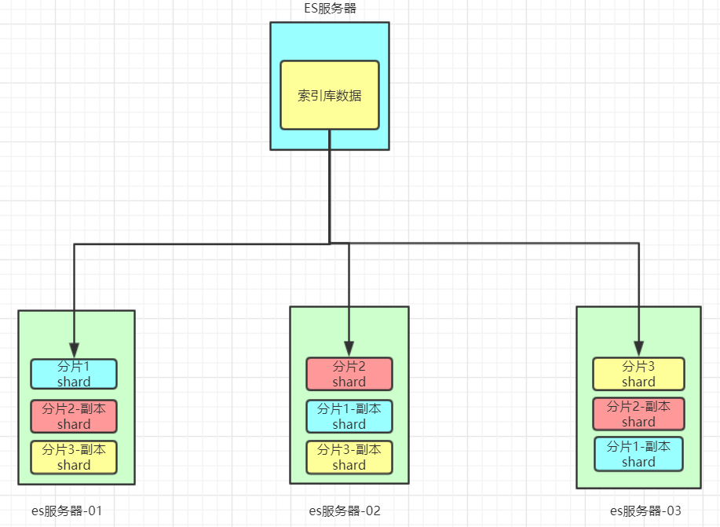

# Elasticsearch

## Lucene

### 什么是lucene

Lucene是免费开源用于全文检索的程序工具包（API），由Apache软件基金会支持和提供，Lucene的目的是为软件开发人员提供一个简单易用的工具包，以方便地在目标系统中实现全文检索的功能。 目前主流的java搜索框架都是依赖Lucene，可以用来制作搜索引擎产品。

lucene怎么读？

[lucene[ˈluːsin]](https://zh.forvo.com/word/lucene/)

## 全文检索

对于非结构化数据，例如互联网上的所有内容，或者电商站内搜索，使用顺序查询，效率也非常低，可以使用**全文检索**(Full-text Search)，计算机索引程序通过扫描文章中的每一个词，对每一个词建立一个索引，指明该词在文章中出现的次数和位置，当用户查询的时候，检索程序就根据事先建立的索引进行查找，并将查找的结果反馈给用户。

>例如：字典。字典的拼音表和部首检字表就相当于字典的索引，对每一个字的解释是非结构化的，如果字典没有音节表和部首检字表，在茫茫辞海中找一个字只能顺序扫描。然而字的某些信息可以提取出来进行结构化处理，比如读音，就比较结构化，分声母和韵母，分别只有几种可以一一列举，于是将读音拿出来按一定的顺序排列，每一项读音都指向此字的详细解释的页数。我们搜索时按结构化的拼音搜到读音，然后按其指向的页数，便可找到我们的非结构化数据——也即对字的解释。 
>这种先建立索引，再对索引进行搜索的过程就叫全文检索。 

### 倒排索引

全文检索使用的索引是**倒排索引**(Inverted Index)

它主要是用来存储某个单词（或词组）在一个文档或一组文档中的存储位置的映射，即提供了一种根据内容来查找文档的方式。

简单的说，倒序索引的**倒序**，指的是这个索引是从关键词中查找对应的文档源的，而不是从文档源中检索对应的关键词。

##  ElasticSearch相关概念

```
索引库（indexes）---------------------------------Databases 数据库

    类型（type）----------------------------------Table 数据表

        文档（Document）--------------------------Row 行

             字段（Field）---------------------Columns 列 
                
                映射配置（mappings）--------- 表结构
```

详细说明

| 概念                 | 说明                                                         |
| -------------------- | ------------------------------------------------------------ |
| 索引库（indexes)     | 索引库包含一堆相关业务，结构相似的文档document数据，比如说建立一个商品product索引库，里面可能就存放了所有的商品数据。 |
| 类型（type）         | type是索引库中的一个逻辑数据分类，一个type下的document，都有相同的field，类似于数据库中的表。比如商品type，里面存放了所有的商品document数据。**6.0版本以后一个index只能有1个type，6.0版本以前每个index里可以是一个或多个type**。 |
| 文档（document）     | 文档是es中的存入索引库最小数据单元，一个document可以是一条客户数据，一条商品数据，一条订单数据，通常用JSON数据结构表示。document存在索引库下的type类型中。 |
| 字段（field）        | Field是Elasticsearch的最小单位。一个document里面有多个field，每个field就是一个数据字段。 |
| 映射配置（mappings） | 类型对文档结构的约束叫做`映射(mapping)`，用来定义document的每个字段的约束。如：字段的数据类型、是否分词、是否索引、是否存储等特性。类型是模拟mysql中的table概念。表是有结构的，也就是表中每个字段都有约束信息。 |

### 集群

**集群(Cluster)**，由一个或者多个节点组成，每个集群都有一个cluser name 作为标识。

### 节点

**节点(node)**，一个ES实例就是一个node，一个机器可以有多个实例，大多数情况下，每个node需要运行在独立的环境中。

### 数据分片

**分片(shards)**，ES是一个分布式搜索引擎，每个索引有一个或者多个分片(shards)，索引的数据被分配到各个分片上，相当于一桶水用了多个杯子装。

- 分片是独立的，对于一个搜索行为，每个分片都会执行这个行为。
- 每个分片都是一个Lucene Index，所以一个分片只能存放 `Integer.MAX_VALUE - 128 = 2,147,483,519` 个docs

分片个数在创建索引库的时候，由`index.number_of_shards`属性指定，**默认值为1**（7.x），此值仅能在**创建索引**的时候进行设置。

同一个节点如果分片数过多，那么最终导致每个分片的文件系统缓存变小，从而影响性能。

### 数据备份

**数据备份(replica)**，相应的有**主分片(primary shard)**

- 为防止单点故障，主分片和备分片不会出现在同一节点，两个相同的备分片也不能出现在同一个节点
- 如果你只有一个节点，那么5个节点将无法分配，此时集群状态将变为黄色

集群状态：

- 绿色，所有主分片和备分分片都准备就绪，假设有一个节点挂了，那么数据不会丢失，但是集群状态会变为黄色
- 黄色，所有主分片准备就绪，但存在至少一个主分片（假设是A）对应的备份分片没有就绪，此时集群属于警告状态，意味着集群高可用和容灾能力下降，如果刚好A所在的机器挂了，并且你只设置了一个备份（已处于未就绪状态），那么A的数据就会丢失（查询结果不完整），此时集群进入Red状态
- 红色，至少有一个主分片没有就绪（直接原因是找不到对应的备份分片成为新的主分片），此时查询的结果会出现数据丢失（不完整）

所以，备份的作用主要包括：

- 容灾：primary分片丢失，replica分片就会被顶上去成为新的主分片，同时根据这个新的主分片创建新的replica，集群数据安然无恙
- 提高查询性能：replica和primary分片的数据是相同的，所以对于一个query既可以查主分片也可以查备分片，在合适的范围内多个replica性能会更优（但要考虑资源占用也会提升[cpu/disk/heap]），另外index request只能发生在主分片上，replica不能执行index request

备份数是由`index.number_of_replicas`决定的，可以随时更改。

如图，我们以3分片，每个分片备份一份为例：



在这个集群中，如果出现单节点故障，并不会导致数据缺失，所以保证了集群的高可用，同时也减少了节点中数据存储量。并且因为是多个节点存储数据，因此用户请求也会分发到不同服务器，并发能力也得到了一定的提升。

[reference](https://www.zhihu.com/question/26446020)

### 如何选择分片数和备份数

对于分片数量的选择，**我们应该选择最少的分片**。过度分配反而增大了Lucene在合并分片查询结果的复杂度。

`节点数 <= 主分片数*(副本数+1)`

### 分词器

分词器(Analyzer)的作用是把一段文本中的词按规则取出所包含的所有词。对应的是Analyzer类，这是一个抽象类，切分词的具体规则是由子类实现的，所以对于不同的语言（规则），要用不同的分词器。

分词器会在两个地方对文本进行解析：

- 建立索引库的时候，对text类型的字段进行分词
- 当全文搜索的时候，会对搜索的短语进行分词

#### 常见的分词器

##### StandardAnalyzer

英文的话会按照单词进行分隔，汉语的话会将每个字进行分隔

请求示例1：

```json
GET/POST  _analyze
{
    "analyzer" : "standard",
    "text" : "I'm wujunnan, I love you"
}
```

响应示例1：

```json
{
    "tokens": [
        {
            "token": "i'm",
            "start_offset": 0,
            "end_offset": 3,
            "type": "<ALPHANUM>",
            "position": 0
        },
        {
            "token": "wujunnan",
            "start_offset": 4,
            "end_offset": 12,
            "type": "<ALPHANUM>",
            "position": 1
        },
        {
            "token": "i",
            "start_offset": 14,
            "end_offset": 15,
            "type": "<ALPHANUM>",
            "position": 2
        },
        {
            "token": "love",
            "start_offset": 16,
            "end_offset": 20,
            "type": "<ALPHANUM>",
            "position": 3
        },
        {
            "token": "you",
            "start_offset": 21,
            "end_offset": 24,
            "type": "<ALPHANUM>",
            "position": 4
        }
    ]
}
```

请求示例2：

```json
GET/POST  _analyze
{
    "analyzer" : "standard",
    "text" : "虽千万人，吾往矣"
}
```

请求示例2：

```json
{
    "tokens": [
        {
            "token": "虽",
            "start_offset": 0,
            "end_offset": 1,
            "type": "<IDEOGRAPHIC>",
            "position": 0
        },
        {
            "token": "千",
            "start_offset": 1,
            "end_offset": 2,
            "type": "<IDEOGRAPHIC>",
            "position": 1
        },
        {
            "token": "万",
            "start_offset": 2,
            "end_offset": 3,
            "type": "<IDEOGRAPHIC>",
            "position": 2
        },
        {
            "token": "人",
            "start_offset": 3,
            "end_offset": 4,
            "type": "<IDEOGRAPHIC>",
            "position": 3
        },
        {
            "token": "吾",
            "start_offset": 5,
            "end_offset": 6,
            "type": "<IDEOGRAPHIC>",
            "position": 4
        },
        {
            "token": "往",
            "start_offset": 6,
            "end_offset": 7,
            "type": "<IDEOGRAPHIC>",
            "position": 5
        },
        {
            "token": "矣",
            "start_offset": 7,
            "end_offset": 8,
            "type": "<IDEOGRAPHIC>",
            "position": 6
        }
    ]
}
```

##### IKAnalyzer

IK分词器有两种分词模式：ik_max_word和ik_smart模式。

- ik_max_word (常用)

  将文本做最细粒度的拆分

- ik_smart

  会做最粗粒度的拆分

```json
GET/POST  _analyze
{
    "analyzer" : "ik_max_word",
    "text" : "我叫武俊男，大家听我说两句"
}
```

ik_max_word 分词模式运行得到结果：

```json
{
    "tokens": [
        {
            "token": "我",
            "start_offset": 0,
            "end_offset": 1,
            "type": "CN_CHAR",
            "position": 0
        },
        {
            "token": "叫",
            "start_offset": 1,
            "end_offset": 2,
            "type": "CN_CHAR",
            "position": 1
        },
        {
            "token": "武",
            "start_offset": 2,
            "end_offset": 3,
            "type": "CN_CHAR",
            "position": 2
        },
        {
            "token": "俊男",
            "start_offset": 3,
            "end_offset": 5,
            "type": "CN_WORD",
            "position": 3
        },
        {
            "token": "大家",
            "start_offset": 6,
            "end_offset": 8,
            "type": "CN_WORD",
            "position": 4
        },
        {
            "token": "听我",
            "start_offset": 8,
            "end_offset": 10,
            "type": "CN_WORD",
            "position": 5
        },
        {
            "token": "说",
            "start_offset": 10,
            "end_offset": 11,
            "type": "CN_CHAR",
            "position": 6
        },
        {
            "token": "两句",
            "start_offset": 11,
            "end_offset": 13,
            "type": "CN_WORD",
            "position": 7
        },
        {
            "token": "两",
            "start_offset": 11,
            "end_offset": 12,
            "type": "COUNT",
            "position": 8
        },
        {
            "token": "句",
            "start_offset": 12,
            "end_offset": 13,
            "type": "CN_CHAR",
            "position": 9
        }
    ]
}
```

####  添加扩展词典和停用词典

**停用词**：有些词在文本中出现的频率非常高。但对本文的语义产生不了多大的影响。例如英文的a、an、the、of等。或中文的”的、了、呢等”。这样的词称为停用词。停用词经常被过滤掉，不会被进行索引。在检索的过程中，如果用户的查询词中含有停用词，系统会自动过滤掉。停用词可以加快索引的速度，减少索引库文件的大小。

**扩展词**：就是不想让哪些词被分开，让他们分成一个词。

#### 自定义扩展词库

- 进入到 elasticsearch/config/analysis-ik/(**插件安装方式**) 或 elasticsearch/plugins/analysis-ik/config(**安装包安装方式**) 目录下, 新增自定义词典

  ```
  vim myext_dict.dic
  ```

  输入 ：江大桥

- 将我们自定义的扩展词典文件添加到IKAnalyzer.cfg.xml配置中

  ```
  vim IKAnalyzer.cfg.xml 
  ```

  ```
  <!--用户可以在这里配置自己的扩展字典 -->
  <entry key="ext_dict">
  	myext_dict.dic
  </entry>
  ```

- 重启

- 这样就查出来了江大桥

  ```
  {
    "token": "江大桥",
    "start_offset": 4,
    "end_offset": 7,
    "type": "CN_WORD",
    "position": 6
  }
  ```

## Elasticsearch操作

Elasticsearch提供了Rest风格的API，即http请求接口，而且也提供了各种语言的客户端API

### index APIs

#### 查看所有索引库

```
GET _cat/indices
```

#### 建立索引库

```
PUT /<index>
```

通过该API，可以指定

- 索引库的Setting
- 索引库的字段Mapping
- 索引库别名

```
PUT /blog1
{
  "settings": {
    "属性名": "属性值"
  }
}
```

参数：

Path paramters

- `<index>`
  - 只能为小写字母
  - 不能已`-`, `_`, `+`开头
  - 不能超过255字节

Query parameters

- `include_type_name`

  可选，默认为false，是否期望mappings里面有type（Mappings type在7.0.0中被废弃）

- `wait_for_active_shards`

- `master_timeout`

- `timeout`

Request body

- `aliases`

- `mappings`

- `settings`

  - Static index settings

    `index.number_of_shards`

    切片数，**默认为1**，每个索引库最大限制为1024

  - Dynamic index settings

    `index.number_of_replicas`

    每个主切片有几个备份，**默认值为1**

示例：

```
PUT /test
{
  "settings": {
    "number_of_shards": 1
  },
  "mappings": {
    "properties": {
      "field1": { "type": "text" }
    }
  }
}
```

注意：

在7.0.0之前，mapping的定义中是包含type的，之后是默认不包含的

#### 创建/修改字段映射

除了在创建索引库的时候创建字段映射，也可以单独创建Mapping

```
PUT 索引库名/_mapping
{
  "properties": {
    "字段名": {
      "type": "类型",
      "analyzer": "分词器",
      (Mapping parameters)...
    }
  }
}
```

注意：在7.0.0之前，这里会包含type

Mapping parameters：

- type：类型，可以是text、long、short、date、integer、object等

- fields

  一个String类型会被映射为一个text类型用于全文搜索，也会作为一个keyword用作排序或聚合

  `field.raw`可以用于排序或者聚合

  [reference](https://www.elastic.co/guide/en/elasticsearch/reference/7.x/multi-fields.html#_multi_fields_with_multiple_analyzers)

- index：是否索引，默认为true  

- store：是否存储，默认为false

- analyzer：分词器，这里的`ik_max_word`即使用ik分词器

  只有text类型才能使用分词器，该分词器同时作用于索引的创建和搜索

例如：

```
PUT /my/_mapping/goods
{
  "properties": {
    "title": {
      "type": "text",
      "analyzer": "ik_max_word"
    },
    "subtitle": {
      "type": "text",
      "analyzer": "ik_max_word"
    },
    "images": {
      "type": "keyword",
      "index": "false"
    },
    "price": {
      "type": "float"
    }
  }
}
```

上述案例中，就给my这个索引库添加了一个名为`goods`的类型，并且在类型中设置了4个字段：

- title：商品标题
- subtitle: 商品子标题
- images：商品图片
- price：商品价格

并且给这些字段设置了一些属性，至于这些属性对应的含义，我们在后续会详细介绍。

**type**

- String类型，又分两种：

  - **text：可分词，不可参与聚合**
  - **keyword：不可分词，数据会作为完整字段进行匹配，可以参与聚合**


https://segmentfault.com/a/1190000008897731

- Numerical：数值类型，分两类

  - 基本数据类型：long、interger、short、byte、double、float、half_float
  - 浮点数的高精度类型：scaled_float
    - 需要指定一个精度因子，比如10或100。elasticsearch会把真实值乘以这个因子后存储，取出时再还原。

- Date：日期类型

  elasticsearch可以对日期格式化为字符串存储，但是建议我们存储为毫秒值，存储为long，节省空间。

- Array：数组类型

  - 进行匹配时，任意一个元素满足，都认为满足
  - 排序时，如果升序则用数组中的最小值来排序，如果降序则用数组中的最大值来排序

- Object：对象

```
{
    name:"Jack",
    age:21,
   	girl:{
		name: "Rose", age:21
   }
}
```

如果存储到索引库的是对象类型，例如上面的girl，会把girl编成两个字段：girl.name和girl.age

**index**

index影响字段的索引情况。

- true：字段会被索引，则可以用来进行搜索。默认值就是true
- false：字段不会被索引，不能用来搜索

index的默认值就是true，也就是说你不进行任何配置，所有字段都会被索引。

但是有些字段是我们不希望被索引的，比如商品的图片信息，就需要手动设置index为false。

**store**

是否将数据进行独立存储。

原始的文本会存储在`_source`里面，默认情况下其他提取出来的字段都不是独立存储的，是从`_source`里面提取出来的。当然你也可以独立的存储某个字段，只要设置store:true即可，获取独立存储的字段要比从_source中解析快得多，但是也会占用更多的空间，所以要根据实际业务需求来设置，默认为false。


[removal-of-types](https://www.elastic.co/guide/en/elasticsearch/reference/7.x/removal-of-types.html)

ES为什么移除了type?

最开始，ES将index与SQL中的database做类比，那么type就类比做table。

在SQL中，table是相互独立的，两个表中即使存在相同的字段名也是没关系的，但是，在Elasticsearch索引中，不同映射类型中具有相同名称的字段在内部由相同的Lucene字段支持，也就是说，不同的type中相同名字的字段必须mapping一致。


#### 查看索引库

```
GET /<target>
```

Path parameters

- `<target>`
  - 可以用逗号分隔的索引库名、别名
  - 也支持通配符，`*`或者`_all`来表示所有索引库

结果示例：

```json
GET /wechat_chat_transcripts
{
    "wechat_chat_transcripts": {
        "aliases": {},
        "mappings": {
            "properties": {
                "content": {
                    "type": "text",
                    "analyzer": "ik_max_word"
                },
                "cust_id": {
                    "type": "keyword"
                },
                "custmer_id": {
                    "type": "keyword"
                },
                "is_reply": {
                    "type": "keyword"
                }
            }
        },
        "settings": {
            "index": {
                "creation_date": "1625754398248",
                "number_of_shards": "1",
                "number_of_replicas": "1",
                "uuid": "EqYpwApuQUG5ymZvMlScpQ",
                "version": {
                    "created": "7050299"
                },
                "provided_name": "wechat_chat_transcripts"
            }
        }
    }
}
```

#### 删除索引库

```
DELETE /<index>
```

#### 类型

有了`索引库`，等于有了数据库中的`database`。接下来就需要索引库中的`类型`了，也就是数据库中的`表`。创建数据库表需要设置字段约束，索引库也一样，在创建索引库的类型时，需要知道这个类型下有哪些字段，每个字段有哪些约束信息，这就叫做`字段映射(mapping)`

字段的约束包括但不限于：

- 字段的数据类型
- 是否要存储
- 是否要索引
- 是否分词
- 分词器是什么

#### 查看映射关系

```
//获取所有索引库的mapping
GET /_mapping 
```

```
GET /<target>/_mapping
```

- 同样的，target可以使用逗号分隔
- 也可以使用通配符`*` ` _all`

### 文档操作

文档，即索引库中某个类型下的数据，会根据规则创建索引，将来用来搜索。可以类比做数据库中的每一行数据

#### 新增文档

(官方文档是使用的put进行的新增操作)

通过POST请求，可以向一个已经存在的索引库中添加文档数据。

```
POST /索引库名/类型名
{
    "key":"value"
}
```

```
POST /my/goods/
{
    "title":"小米手机",
    "images":"http://image.leyou.com/12479122.jpg",
    "price":2699.00
}
```

可以看到结果显示为：`created`，应该是创建成功了。

另外，需要注意的是，在响应结果中有个`_id`字段，这个就是这条文档数据的`唯一标示`，以后的增删改查都依赖这个id作为唯一标示。

可以看到id的值为：`2a3UTW0BTp_XthqB6lMH`,这里我们新增时没有指定id，所以是ES帮我们随机生成的id。

#### 新增文档并自定义id

如果我们想要自己新增的时候指定id，可以这么做：

```
POST /索引库名/类型/id值
{
    ...
}
```

示例：

```json
POST /my/goods/2
{
    "title":"大米手机",
    "images":"http://image.leyou.com/12479122.jpg",
    "price":2899.00
}
```

#### 查看文档

根据rest风格，新增是post，查询应该是get，不过查询一般都需要条件，这里我们把刚刚生成数据的id带上。

```
GET /my/goods/2a3UTW0BTp_XthqB6lMH
```

查看结果：

```json
{
  "_index": "my",
  "_type": "goods",
  "_id": "2a3UTW0BTp_XthqB6lMH",
  "_version": 1,
  "found": true,
  "_source": {
    "title": "小米手机",
    "images": "http://image.leyou.com/12479122.jpg",
    "price": 2699
  }
}
```

- `_source`：源文档信息，所有的数据都在里面。
- `_id`：这条文档的唯一标示

#### 修改数据

如果想更新已存在的文档，只需再次 `PUT`

比如，我们把使用id为3，不存在，则应该是新增：

```json
PUT /my/goods/3
{
    "title":"超米手机",
    "images":"http://image.leyou.com/12479122.jpg",
    "price":3899.00
}
```

结果：

```json
{
  "_index": "my",
  "_type": "goods",
  "_id": "3",
  "_version": 1,
  "result": "created",
  "_shards": {
    "total": 2,
    "successful": 1,
    "failed": 0
  },
  "_seq_no": 0,
  "_primary_term": 1
}
```

可以看到是`created`，是新增。

我们再次执行刚才的请求，不过把数据改一下：

```json
PUT /my/goods/3
{
    "title":"超大米手机",
    "images":"http://image.leyou.com/12479122.jpg",
    "price":3299.00
}
```

查看结果：

```json
{
  "_index": "my",
  "_type": "goods",
  "_id": "3",
  "_version": 2,
  "result": "updated",
  "_shards": {
    "total": 2,
    "successful": 1,
    "failed": 0
  },
  "_seq_no": 1,
  "_primary_term": 1
}
```

可以看到结果是：`updated`，显然是更新数据

#### 删除数据

1）根据id进行删除：

> 语法

```
DELETE /索引库名/类型名/id值
```

实例：

```
DELETE my/goods/3
```

结果：

```
{
  "_index": "my",
  "_type": "goods",
  "_id": "3",
  "_version": 3,
  "result": "deleted",
  "_shards": {
    "total": 2,
    "successful": 1,
    "failed": 0
  },
  "_seq_no": 2,
  "_primary_term": 1
}
```

可以看到结果是：`deleted`，显然是删除数据

2）根据查询条件进行删除

> 语法

```
POST  /索引库名/_delete_by_query
{
  "query": { 
    "match": {
      "字段名": "搜索关键字"
    }
  }
}
```

示例：

```
POST my/_delete_by_query
{
	"query": {
		"match": {
			"title": "小米"
		}
	}
}
```

结果：

```
{
  "took": 269,
  "timed_out": false,
  "total": 1,
  "deleted": 1,
  "batches": 1,
  "version_conflicts": 0,
  "noops": 0,
  "retries": {
    "bulk": 0,
    "search": 0
  },
  "throttled_millis": 0,
  "requests_per_second": -1,
  "throttled_until_millis": 0,
  "failures": []
}
```

#### 删除所有数据

```
POST  索引库名/_delete_by_query
{
  "query": { 
    "match_all": {}
  }
}
```

示例：

```
POST my/_delete_by_query
{
  "query": {
    "match_all": {}
  }
}
```

结果：

```
{
  "took": 11,
  "timed_out": false,
  "total": 1,
  "deleted": 1,
  "batches": 1,
  "version_conflicts": 0,
  "noops": 0,
  "retries": {
    "bulk": 0,
    "search": 0
  },
  "throttled_millis": 0,
  "requests_per_second": -1,
  "throttled_until_millis": 0,
  "failures": []
}
```

### 基本查询

导入数据，这里是采用批处理的API，大家直接复制到kibana运行即可，**注意千万别使用kibana的格式化**

```
POST /my/goods/_bulk
{"index":{}}
{"title":"大米手机","images":"http://image.leyou.com/12479122.jpg","price":3288}
{"index":{}}
{"title":"小米手机","images":"http://image.leyou.com/12479122.jpg","price":2699}
{"index":{}}
{"title":"小米电视4A","images":"http://image.leyou.com/12479122.jpg","price":4288}
```

官方网站：

```
GET /megacorp/employee/_search
{
    "query" : {
        "match" : {
            "about" : "rock climbing"
        }
    }
}
```

结果：

```
GET /megacorp/employee/_search
{
    "query" : {
        "match" : {
            "about" : "rock climbing"
        }
    }
}
拷贝为 cURL
在 Sense 中查看
 
显然我们依旧使用之前的 match 查询在`about` 属性上搜索 “rock climbing” 。得到两个匹配的文档：

{
   ...
   "hits": {
      "total":      2,
      "max_score":  0.16273327,
      "hits": [
         {
            ...
            "_score":         0.16273327, 
            "_source": {
               "first_name":  "John",
               "last_name":   "Smith",
               "age":         25,
               "about":       "I love to go rock climbing",
               "interests": [ "sports", "music" ]
            }
         },
         {
            ...
            "_score":         0.016878016, 
            "_source": {
               "first_name":  "Jane",
               "last_name":   "Smith",
               "age":         32,
               "about":       "I like to collect rock albums",
               "interests": [ "music" ]
            }
         }
      ]
   }
}
```

这是一个很好的案例，阐明了Elasticsearch如何在全文属性上搜索并返回相关性最强的结果。Elasticsearch中的相关性概念非常重要，也是完全区别于传统关系型数据库的一个概念，数据库中的一条记录要么匹配要么不匹配。

```
POST /索引库名/_search
{
    "query":{
        "查询类型":{
            "查询条件":"查询条件值"
        }
    }
}
```

这里的query代表一个查询对象，里面可以有不同的查询属性

- 查询类型：例如：`match_all`， `match`，`term` ， `range` 等等
- 查询条件：查询条件会根据类型的不同，写法也有差异

#### 查询索引库总记录数

```
GET /cust_tag/_count
```


#### 查询所有(match_all)

```
POST /my/_search
{
    "query":{
        "match_all": {}
    }
}
```

- `query`：代表查询对象
- `match_all`：代表查询所有

结果：

```json
{
  "took": 7,
  "timed_out": false,
  "_shards": {
    "total": 5,
    "successful": 5,
    "skipped": 0,
    "failed": 0
  },
  "hits": {
    "total": 3,
    "max_score": 1,
    "hits": [
      {
        "_index": "my",
        "_type": "goods",
        "_id": "3a3hTW0BTp_XthqB2lMR",
        "_score": 1,
        "_source": {
          "title": "大米手机",
          "images": "http://image.leyou.com/12479122.jpg",
          "price": 3288
        }
      },
      {
        "_index": "my",
        "_type": "goods",
        "_id": "3q3hTW0BTp_XthqB2lMR",
        "_score": 1,
        "_source": {
          "title": "小米手机",
          "images": "http://image.leyou.com/12479122.jpg",
          "price": 2699
        }
      },
      {
        "_index": "my",
        "_type": "goods",
        "_id": "363hTW0BTp_XthqB2lMR",
        "_score": 1,
        "_source": {
          "title": "小米电视4A",
          "images": "http://image.leyou.com/12479122.jpg",
          "price": 4288
        }
      }
    ]
  }
}
```

- took：查询花费时间，单位是毫秒
- time_out：是否超时
- _shards：分片信息
- hits：搜索结果总览对象
  - total：搜索到的总条数
  - max_score：所有结果中文档得分的最高分
  - hits：搜索结果的文档对象数组，每个元素是一条搜索到的文档信息
    - _index：索引库
    - _type：文档类型
    - _id：文档id
    - _score：文档得分
    - _source：文档的源数据

#### 匹配查询(match)

现在，索引库中有2部手机，1台电视;

- or关系

`match`类型查询，会把查询条件进行分词，然后进行查询,多个词条之间是or的关系

```json
POST /my/_search
{
    "query":{
        "match":{
            "title":"小米电视4A"
        }
    }
}
```

结果：

```
{
  "took": 20,
  "timed_out": false,
  "_shards": {
    "total": 5,
    "successful": 5,
    "skipped": 0,
    "failed": 0
  },
  "hits": {
    "total": 2,
    "max_score": 2.5141225,
    "hits": [
      {
        "_index": "my",
        "_type": "goods",
        "_id": "363hTW0BTp_XthqB2lMR",
        "_score": 2.5141225,
        "_source": {
          "title": "小米电视4A",
          "images": "http://image.leyou.com/12479122.jpg",
          "price": 4288
        }
      },
      {
        "_index": "my",
        "_type": "goods",
        "_id": "3q3hTW0BTp_XthqB2lMR",
        "_score": 0.22108285,
        "_source": {
          "title": "小米手机",
          "images": "http://image.leyou.com/12479122.jpg",
          "price": 2699
        }
      }
    ]
  }
}
```

在上面的案例中，不仅会查询到电视，而且与小米相关的都会查询到，多个词之间是`or`的关系。

- and关系

某些情况下，我们需要更精确查找，我们希望这个关系变成`and`，可以这样做：

```json
POST /my/_search
{"query": {"match": {
  "title": {"query": "小米电视4A","operator": "and"}
}}}
```

结果：

```
{
  "took": 7,
  "timed_out": false,
  "_shards": {
    "total": 5,
    "successful": 5,
    "skipped": 0,
    "failed": 0
  },
  "hits": {
    "total": 1,
    "max_score": 2.5141225,
    "hits": [
      {
        "_index": "my",
        "_type": "goods",
        "_id": "363hTW0BTp_XthqB2lMR",
        "_score": 2.5141225,
        "_source": {
          "title": "小米电视4A",
          "images": "http://image.leyou.com/12479122.jpg",
          "price": 4288
        }
      }
    ]
  }
}
```

本例中，只有同时包含`小米`和`电视`的词条才会被搜索到。

#### 多字段查询(multi_match)

`multi_match`与`match`类似，不同的是它可以在多个字段中查询

为了测试效果我们在这里新增一条数据：

```
POST /my/goods
{
	"title": "华为手机",
	"images": "http://image.leyou.com/12479122.jpg",
	"price": 5288,
	"subtitle": "小米"
}
```

示例：

```json
POST /my/_search
{
  "query": {
    "multi_match": {
      "query": "小米",
      "fields": ["title","subtitle"]
    }
  }
}
```

结果：

```
{
  "took": 6,
  "timed_out": false,
  "_shards": {
    "total": 5,
    "successful": 5,
    "skipped": 0,
    "failed": 0
  },
  "hits": {
    "total": 3,
    "max_score": 0.5442147,
    "hits": [
      {
        "_index": "my",
        "_type": "goods",
        "_id": "3q3hTW0BTp_XthqB2lMR",
        "_score": 0.5442147,
        "_source": {
          "title": "小米手机",
          "images": "http://image.leyou.com/12479122.jpg",
          "price": 2699
        }
      },
      {
        "_index": "my",
        "_type": "goods",
        "_id": "363hTW0BTp_XthqB2lMR",
        "_score": 0.36928856,
        "_source": {
          "title": "小米电视4A",
          "images": "http://image.leyou.com/12479122.jpg",
          "price": 4288
        }
      },
      {
        "_index": "my",
        "_type": "goods",
        "_id": "5a3yTW0BTp_XthqBcFOL",
        "_score": 0.2876821,
        "_source": {
          "title": "华为手机",
          "images": "http://image.leyou.com/12479122.jpg",
          "price": 5288,
          "subtitle": "小米"
        }
      }
    ]
  }
}
```

本例中，我们会假设在title字段和subtitle字段中查询`小米`这个词

#### 词条匹配(term)

`term` 查询被用于精确值匹配，这些精确值可能是数字、时间、布尔或者那些**未分词**的字符串

```json
POST /my/_search
{
    "query":{
        "term":{
            "price":2699
        }
    }
}

---------------------
POST /my/_search
{
  "query": {
    "term": {
      "price": {
        "value": "2699"
      }
    }
  }
}

```

结果：

```
{
  "took": 13,
  "timed_out": false,
  "_shards": {
    "total": 5,
    "successful": 5,
    "skipped": 0,
    "failed": 0
  },
  "hits": {
    "total": 1,
    "max_score": 1,
    "hits": [
      {
        "_index": "my",
        "_type": "goods",
        "_id": "3q3hTW0BTp_XthqB2lMR",
        "_score": 1,
        "_source": {
          "title": "小米手机",
          "images": "http://image.leyou.com/12479122.jpg",
          "price": 2699
        }
      }
    ]
  }
}
```

#### 多词条精确匹配(terms)

`terms` 查询和 term 查询一样，但它允许你指定多值进行匹配。如果这个字段包含了指定值中的任何一个值，那么这个文档满足条件，类似于mysql的in：

```json
POST /my/_search
{
    "query":{
        "terms":{
            "price":[2699,5288]
        }
    }
}
```

结果：

```
{
  "took": 9,
  "timed_out": false,
  "_shards": {
    "total": 5,
    "successful": 5,
    "skipped": 0,
    "failed": 0
  },
  "hits": {
    "total": 2,
    "max_score": 1,
    "hits": [
      {
        "_index": "my",
        "_type": "goods",
        "_id": "3q3hTW0BTp_XthqB2lMR",
        "_score": 1,
        "_source": {
          "title": "小米手机",
          "images": "http://image.leyou.com/12479122.jpg",
          "price": 2699
        }
      },
      {
        "_index": "my",
        "_type": "goods",
        "_id": "5a3yTW0BTp_XthqBcFOL",
        "_score": 1,
        "_source": {
          "title": "华为手机",
          "images": "http://image.leyou.com/12479122.jpg",
          "price": 5288,
          "subtitle": "小米"
        }
      }
    ]
  }
}
```

#### 范围查询(range)

`range` 查询找出那些落在指定区间内的数字或者时间

`range`查询允许以下字符：

| 操作符 |   说明   |
| :----: | :------: |
|   gt   |   大于   |
|  gte   | 大于等于 |
|   lt   |   小于   |
|  lte   | 小于等于 |

示例：

```
POST /my/_search
{
    "query":{
        "range": {
            "price": {
                "gte":  3000,
                "lt":   5000
            }
      }
    }
}
```

日期：

```
{
  "query": {
    "range": {
      "postdate": {
        "gte": "2016-09-01 00:00:00",
        "lte": "2016-09-30 23:59:59",
        "format": "yyyy-MM-dd HH:mm:ss"
      }
    }
  }
}
```

format不加也行，如果写的时间格式正确

#### ids查询

```
{
  "query": {
    "ids": {
      "type": "news",
      "values": "2101"
    }
  }
}
```

一次查询多个id

```json
{
  "query": {
    "ids": {
      "values": [
        "2101",
        "2301"
      ]
    }
  }
}
```

### 高级查询

#### 布尔组合(bool)

`bool`把各种其它查询通过`must`（与）、`must_not`（非）、`should`（或）的方式进行组合

```
GET /my/_search
{
    "query":{
        "bool":{
          "must":     { "match": { "title": "小米" }},
          "must_not": { "match": { "title":  "电视" }},
          "should":   { "match": { "title": "手机" }}
        }
    }
}
```

结果：

```
{
  "took": 134,
  "timed_out": false,
  "_shards": {
    "total": 5,
    "successful": 5,
    "skipped": 0,
    "failed": 0
  },
  "hits": {
    "total": 1,
    "max_score": 1.0884295,
    "hits": [
      {
        "_index": "my",
        "_type": "goods",
        "_id": "3q3hTW0BTp_XthqB2lMR",
        "_score": 1.0884295,
        "_source": {
          "title": "小米手机",
          "images": "http://image.leyou.com/12479122.jpg",
          "price": 2699
        }
      }
    ]
  }
}
```

#### 模糊查询(fuzzy)

我们新增一个商品：

```
POST /my/goods/4
{
    "title":"apple手机",
    "images":"http://image.leyou.com/12479122.jpg",
    "price":5899.00
}
```

fuzzy自动将拼写错误的搜索文本，进行纠正，纠正以后去尝试匹配索引中的数据

它允许用户搜索词条与实际词条出现偏差，但是偏差的编辑距离不得超过2：

```
POST /my/_search
{
  "query": {
    "fuzzy": {
      "title": "appla"
    }
  }
}
```

上面的查询，也能查询到apple手机

fuzziness，你的搜索文本最多可以纠正几个字母去跟你的数据进行匹配，默认不设置，我们可以通过

```
POST /my/_search
{
  "query": {
    "fuzzy": {
      "title": {
        "value": "applaa",
        "fuzziness": 2
      }
    }
  }
}
```

#### match_phrase

文档同时满足下面两个条件才会被搜索到：

- 分词后所有词项都要出现在该字段中
- 字段中的词项顺序要一致

match_phrase与slop一起用，能保证分词间的邻近关系，slop参数告诉match_phrase查询词条能够相隔多远时仍然将文档视为匹配，默认是0。为0时，必须相邻才能被检索出来。

参数说明：

- analyzer 指定何种分析器来对该短语进行分词处理
- slop 用于指定查询短语间的词项(term)间的距离
- boost 用于设置该查询的权重

```
GET /_search
{
    "query": {
        "match_phrase" : {
            "message" : "this is a test",
            "analyzer":"english",
            "slop":0
        }
    }
}
```

[深入理解 Match Phrase Query](https://ld246.com/article/1512989203733)

[es 基于match_phrase/fuzzy的模糊匹配原理及使用](https://www.cnblogs.com/danvid/p/10570334.html)

- 由于match_phrase是在搜索阶段进行的计算，会影响搜索效率，据说比term查询慢20倍，所以不要进行大文本量的字段搜索，尽量进行标题，名字这种类型的搜索才使用这个
- 没有讨论在文本数据重复时的情况，即文本中有多个`东方宾馆`和query文本中有多个`东方宾馆`"分词的情况，但是原理是一样的还是取距离转换的最小值
- 文中使用了standard分词，实际上可能会用不同的分词器，但是建议使用match_phrase时使用标准的一个个分词，这样是方便进行邻近搜索的控制的，如果使用ik等分词，执行match_phrase时分词是不可控的，所以结果也是不可控。match使用ik，match_phrase用standard结合一起使用也是可以的；

##### matchPhrasePrefixQuery

如果你调用matchPhrasePrefixQuery时，text为中文，那么，很大可能是一种状况：你会发现，matchPhraseQuery和matchPhrasePrefixQuery没有任何差别。而当text为英文时，差别就显现出来了：matchPhraseQuery的text是一个英文单词，而matchPhrasePrefixQuery的text则无这一约束，你可以从一个英文单词中抽几个连接在一起的字母进行查询。

https://www.cnblogs.com/softidea/archive/2016/10/20/5981751.html

#### 通配符查询wildcard

使用通配符进行查询

其中`?`代表任意一个字符，`*`代表任意的一个或多个字符。

```
GET /_search
{
    "from":0,
    "size":2,
    "query":{
        "wildcard":{
        "eu_birthday_date":"10-*" 
        }
    }
}
```

### 结果字段过滤

默认情况下，elasticsearch在搜索的结果中，会把文档中保存在`_source`的所有字段都返回。

如果我们只想获取其中的部分字段，我们可以添加`_source`的过滤

- 直接指定字段

  ```
  POST /my/_search
  {
    "_source": ["title","price"],
    "query": {
      "term": {
        "price": 2699
      }
    }
  }
  ```

- includes：来指定想要显示的字段

  ```
  POST /my/_search
  {
    "_source": {
      "includes":["title","price"]
    },
    "query": {
      "term": {
        "price": 2699
      }
    }
  }
  ```

- excludes：来指定不想要显示的字段

  ```
  POST /my/_search
  {
    "_source": {
       "excludes": ["images"]
    },
    "query": {
      "term": {
        "price": 2699
      }
    }
  }
  ```

### 分页

elasticsearch中实现分页的语法非常简单：

```
POST /my/_search
{
  "query": {
    "match_all": {}
  },
  "size": 2,
  "from": 0
}
```

size:每页显示多少条 

from:当前页起始索引,  int start = (pageNum - 1) * size;

### 滚动查询

### 排序

#### 单字段排序

`sort` 可以让我们按照不同的字段进行排序，并且通过`order`指定排序的方式

```
POST /my/_search
{
  "query": {
    "match_all": {}
  },
  "sort": [
    {"price": {"order": "desc"}}
  ]
}
```

#### 多字段排序

假定我们想要结合使用 price和 _score（得分） 进行查询，并且匹配的结果首先按照价格排序，然后按照相关性得分排序：

```
POST /my/_search
{
    "query":{
        "match_all":{}
    },
    "sort": [
      { "price": { "order": "desc" }},
      { "_score": { "order": "desc" }}
    ]
}
```

### 高亮

elasticsearch中实现高亮的语法比较简单：

```
POST /my/_search
{
  "query": {
    "match": {
      "title": "电视"
    }
  },
  "highlight": {
    "pre_tags": "<font color='pink'>",
    "post_tags": "</font>",
    "fields": {
      "title": {}
    }
  }
}
```

在使用match查询的同时，加上一个highlight属性：

- pre_tags：前置标签
- post_tags：后置标签
- fields：需要高亮的字段
  - title：这里声明title字段需要高亮，后面可以为这个字段设置特有配置，也可以空

结果：

```
{
  "took": 12,
  "timed_out": false,
  "_shards": {
    "total": 5,
    "successful": 5,
    "skipped": 0,
    "failed": 0
  },
  "hits": {
    "total": 1,
    "max_score": 0.90204775,
    "hits": [
      {
        "_index": "my",
        "_type": "goods",
        "_id": "363hTW0BTp_XthqB2lMR",
        "_score": 0.90204775,
        "_source": {
          "title": "小米电视4A",
          "images": "http://image.leyou.com/12479122.jpg",
          "price": 4288
        },
        "highlight": {
          "title": [
            "小米<font color='pink'>电视</font>4A"
          ]
        }
      }
    ]
  }
}
```

### 聚合

掌握Aggregations需要理解两个概念：

- 桶(Buckets)：符合条件的文档的集合，相当于SQL中的group by。比如，在users表中，按“地区”聚合，一个人将被分到北京桶或上海桶或其他桶里；按“性别”聚合，一个人将被分到男桶或女桶
- 指标(Metrics)：基于Buckets的基础上进行统计分析，相当于SQL中的count,avg,sum等。比如，按“地区”聚合，计算每个地区的人数，平均年龄等

 对照一条SQL来加深我们的理解：

```
SELECT COUNT(color) FROM table GROUP BY color
```

GROUP BY相当于做分桶的工作，COUNT是统计指标。

- 单值聚合

  指标聚合，相当于SQL的聚合函数

  返回expires_in之和，其中size=0 表示不需要返回聚合外的其他数据。

  ```
  {
    "size": 0,
    "aggs": {
      "return_expires_in": {
        "sum": {
          "field": "expires_in"
        }
      }
    }
  }
  ```

  ```
  {
    "took" : 3,
    "timed_out" : false,
    "_shards" : {
      "total" : 5,
      "successful" : 5,
      "failed" : 0
    },
    "hits" : {
      "total" : 2,
      "max_score" : 0.0,
      "hits" : [ ]
    },
    "aggregations" : {
      "return_expires_in" : {
        "value" : 5184000.0
      }
    }
  }
  ```

  返回最小值

  ```
  {
    "size": 0,
    "aggs": {
      "return_min_expires_in": {
        "min": {
          "field": "expires_in"
        }
      }
    }
  }
  ```

  最大值：max

  平均值：avg

- 多值聚合

- Terms聚合

  桶聚合

  记录有多少F，多少M

  ```
  {
    "size": 0,
    "aggs": {
      "genders": {
        "terms": {
          "field": "gender"
        }
      }
    }
  }
  ```

fielddata和keyword的聚合比较

为某个 text 类型的字段开启fielddata字段后, 聚合分析操作会对这个字段的所有分词分别进行聚合, 获得的结果大多数情况下并不符合我们的需求.

使用keyword内置字段, 不会对相关的分词进行聚合, 结果可能更有用

[ES的常用查询与聚合](https://www.cnblogs.com/hirampeng/p/10035858.html)

### 去重

#### 适用场景

- 输入提示

  例如，有企业信息宽表中，存储了海量的企业记录，每条记录有很多字段，需求是根据字段构造筛选条件，筛选出符合条件的企业主，要求在输入筛选条件字段值的时候，下面会有提示词。

  如图所示：

  

  那么在该案例中，就需要对合作机构名称字段进行去重处理

- 网站展示重复帖子/文章去重

  网上可能存在大量复制粘贴，营销号搬运的内容，我们需要对其进行折叠处理。

  首先需要定义重复文章，这就需要算法同学根据一定规则对相关内容进行判定，增加一个重复id字段，那么我们在展示的时候，就可以根据这个id对搜索到的内容进行折叠，同一重复id的内容，只展示一份即可，避免出现全是重复搬运、营销内容。

#### collapse

collapse是Elasticsearch5.3中新增的特性，专门为上述场景定制，此需求是2010年7月提的issue，是讨论最多的帖子之一，6年后终于得到了支持。

请求示例1:

```json
{
    "size": 10, //折叠后显示的个数
    "from": 0,
    "_source": ["agency_name"],
    "query":{
        "match_phrase":{
            "agency_name":"北京"
        }
    },
    "collapse":{
        "field":"agency_name.raw" //要进行折叠的字段
    },
    "sort":[
        {
            "established_duration_time":{
                "order" : "desc" //按成立时长排序
            }
        }
    ]
}
```

响应示例1:

```json
{
    "took": 3,
    "timed_out": false,
    "_shards": {
        "total": 1,
        "successful": 1,
        "skipped": 0,
        "failed": 0
    },
    "hits": {
        "total": {
            "value": 10000,
            "relation": "gte"
        },
        "max_score": null,
        "hits": [
            {
                "_index": "cust_tag",
                "_type": "_doc",
                "_id": "h0000000000000352636922650091520",
                "_score": null,
                "_source": {
                    "agency_name": "北京公瑾税务师事务所有限公司"
                },
                "fields": {
                    "agency_name.raw": [
                        "北京公瑾税务师事务所有限公司"
                    ]
                },
                "sort": [
                    15139
                ]
            },
            {
                "_index": "cust_tag",
                "_type": "_doc",
                "_id": "679cbe765344483fa762880e54951b5f",
                "_score": null,
                "_source": {
                    "agency_name": "北京公瑾财务咨询有限公司"
                },
                "fields": {
                    "agency_name.raw": [
                        "北京公瑾财务咨询有限公司"
                    ]
                },
                "sort": [
                    13322
                ]
            },
            {
                "_index": "cust_tag",
                "_type": "_doc",
                "_id": "6B2A3B3792B84E269AFC345827B33E3B",
                "_score": null,
                "_source": {
                    "agency_name": "北京纽斯特秘书财会服务有限公司Disabled"
                },
                "fields": {
                    "agency_name.raw": [
                        "北京纽斯特秘书财会服务有限公司Disabled"
                    ]
                },
                "sort": [
                    13284
                ]
            },
            {
                "_index": "cust_tag",
                "_type": "_doc",
                "_id": "89FE864C8CB145A88860109B35B1C89F",
                "_score": null,
                "_source": {
                    "agency_name": "北京新智咨询有限公司Disabled"
                },
                "fields": {
                    "agency_name.raw": [
                        "北京新智咨询有限公司Disabled"
                    ]
                },
                "sort": [
                    10386
                ]
            },
            {
                "_index": "cust_tag",
                "_type": "_doc",
                "_id": "h0000000000000362835093414289408",
                "_score": null,
                "_source": {
                    "agency_name": "北京三圣缘财税服务有限公司"
                },
                "fields": {
                    "agency_name.raw": [
                        "北京三圣缘财税服务有限公司"
                    ]
                },
                "sort": [
                    10342
                ]
            },
            {
                "_index": "cust_tag",
                "_type": "_doc",
                "_id": "h0000000000000355627537302347776",
                "_score": null,
                "_source": {
                    "agency_name": "北京昌盛泰和会计服务有限责任公司"
                },
                "fields": {
                    "agency_name.raw": [
                        "北京昌盛泰和会计服务有限责任公司"
                    ]
                },
                "sort": [
                    10304
                ]
            },
            {
                "_index": "cust_tag",
                "_type": "_doc",
                "_id": "h0000000000000395873736600928256",
                "_score": null,
                "_source": {
                    "agency_name": "北京秋实小宝会计服务有限公司"
                },
                "fields": {
                    "agency_name.raw": [
                        "北京秋实小宝会计服务有限公司"
                    ]
                },
                "sort": [
                    10144
                ]
            },
            {
                "_index": "cust_tag",
                "_type": "_doc",
                "_id": "F6B9CDC7096343578D0330FE17D83E86",
                "_score": null,
                "_source": {
                    "agency_name": "德鼎晟（北京）财务咨询有限责任公司"
                },
                "fields": {
                    "agency_name.raw": [
                        "德鼎晟（北京）财务咨询有限责任公司"
                    ]
                },
                "sort": [
                    9775
                ]
            },
            {
                "_index": "cust_tag",
                "_type": "_doc",
                "_id": "CCFE5C0A0DD04ABE95E77651E3D9A073",
                "_score": null,
                "_source": {
                    "agency_name": "北京梦之源企业管理有限公司"
                },
                "fields": {
                    "agency_name.raw": [
                        "北京梦之源企业管理有限公司"
                    ]
                },
                "sort": [
                    9703
                ]
            },
            {
                "_index": "cust_tag",
                "_type": "_doc",
                "_id": "D0FD2F3792CF40AA9AE7D5A25C79D014",
                "_score": null,
                "_source": {
                    "agency_name": "北京久运环科咨询有限公司"
                },
                "fields": {
                    "agency_name.raw": [
                        "北京久运环科咨询有限公司"
                    ]
                },
                "sort": [
                    9606
                ]
            }
        ]
    }
}
```

请求示例2：

此示例表示获取前三个合作机构名称，并获取每个机构名称下的两家公司，都按成立时长降序排序

```json
{
    "size": 3, //折叠后显示的个数
    "from": 0,
    "_source": ["agency_name","name","established_duration_time"],
    "query":{
        "match_phrase":{
            "agency_name":"北京"
        }
    },
    "collapse":{
        "field":"agency_name.raw", //要进行折叠的字段
        "inner_hits":{
            "name":"top2",
            "_source": ["agency_name","name","established_duration_time"],
            "size": 2,
            "sort":[
                {
                    "established_duration_time":"desc" //按成立时长排序
                }
            ]
        }
    },
    "sort":[
        {
            "established_duration_time":{
                "order" : "desc" //按成立时长排序
            }
        }
    ]
}
```

响应示例2：

```json
{
    "took": 6,
    "timed_out": false,
    "_shards": {
        "total": 1,
        "successful": 1,
        "skipped": 0,
        "failed": 0
    },
    "hits": {
        "total": {
            "value": 10000, //搜索结果的total是所有的命中记录数，即未经聚合，仅query中的条件查出的总数
            "relation": "gte"
        },
        "max_score": null,
        "hits": [
            {
                "_index": "cust_tag",
                "_type": "_doc",
                "_id": "h0000000000000352636922650091520",
                "_score": null,
                "_source": {
                    "agency_name": "北京公瑾税务师事务所有限公司",
                    "established_duration_time": 15139,
                    "name": "王明安"
                },
                "fields": {
                    "agency_name.raw": [
                        "北京公瑾税务师事务所有限公司"
                    ]
                },
                "sort": [
                    15139
                ],
                "inner_hits": {
                    "top2": {
                        "hits": {
                            "total": {
                                "value": 2311,
                                "relation": "eq"
                            },
                            "max_score": null,
                            "hits": [
                                {
                                    "_index": "cust_tag",
                                    "_type": "_doc",
                                    "_id": "h0000000000000352636922650091520",
                                    "_score": null,
                                    "_source": {
                                        "agency_name": "北京公瑾税务师事务所有限公司",
                                        "established_duration_time": 15139,
                                        "name": "王明安"
                                    },
                                    "sort": [
                                        15139
                                    ]
                                },
                                {
                                    "_index": "cust_tag",
                                    "_type": "_doc",
                                    "_id": "h0000000000000343584933160886272",
                                    "_score": null,
                                    "_source": {
                                        "agency_name": "北京公瑾税务师事务所有限公司",
                                        "established_duration_time": 11597,
                                        "name": "李建辉"
                                    },
                                    "sort": [
                                        11597
                                    ]
                                }
                            ]
                        }
                    }
                }
            },
            {
                "_index": "cust_tag",
                "_type": "_doc",
                "_id": "679cbe765344483fa762880e54951b5f",
                "_score": null,
                "_source": {
                    "agency_name": "北京公瑾财务咨询有限公司",
                    "established_duration_time": 13322,
                    "name": "北京龙华牧业有限公司"
                },
                "fields": {
                    "agency_name.raw": [
                        "北京公瑾财务咨询有限公司"
                    ]
                },
                "sort": [
                    13322
                ],
                "inner_hits": {
                    "top2": {
                        "hits": {
                            "total": {
                                "value": 10000,
                                "relation": "gte"
                            },
                            "max_score": null,
                            "hits": [
                                {
                                    "_index": "cust_tag",
                                    "_type": "_doc",
                                    "_id": "679cbe765344483fa762880e54951b5f",
                                    "_score": null,
                                    "_source": {
                                        "agency_name": "北京公瑾财务咨询有限公司",
                                        "established_duration_time": 13322,
                                        "name": "北京龙华牧业有限公司"
                                    },
                                    "sort": [
                                        13322
                                    ]
                                },
                                {
                                    "_index": "cust_tag",
                                    "_type": "_doc",
                                    "_id": "h0000000000000327246594270707712",
                                    "_score": null,
                                    "_source": {
                                        "agency_name": "北京公瑾财务咨询有限公司",
                                        "established_duration_time": 12587,
                                        "name": "深圳安科高技术股份有限公司"
                                    },
                                    "sort": [
                                        12587
                                    ]
                                }
                            ]
                        }
                    }
                }
            },
            {
                "_index": "cust_tag",
                "_type": "_doc",
                "_id": "6B2A3B3792B84E269AFC345827B33E3B",
                "_score": null,
                "_source": {
                    "agency_name": "北京纽斯特秘书财会服务有限公司Disabled",
                    "established_duration_time": 13284,
                    "name": "北京市顺义南法信建筑工程公司"
                },
                "fields": {
                    "agency_name.raw": [
                        "北京纽斯特秘书财会服务有限公司Disabled"
                    ]
                },
                "sort": [
                    13284
                ],
                "inner_hits": {
                    "top2": {
                        "hits": {
                            "total": {
                                "value": 98,
                                "relation": "eq"
                            },
                            "max_score": null,
                            "hits": [
                                {
                                    "_index": "cust_tag",
                                    "_type": "_doc",
                                    "_id": "6B2A3B3792B84E269AFC345827B33E3B",
                                    "_score": null,
                                    "_source": {
                                        "agency_name": "北京纽斯特秘书财会服务有限公司Disabled",
                                        "established_duration_time": 13284,
                                        "name": "北京市顺义南法信建筑工程公司"
                                    },
                                    "sort": [
                                        13284
                                    ]
                                },
                                {
                                    "_index": "cust_tag",
                                    "_type": "_doc",
                                    "_id": "99E7F995237B4EE588EF7F182E14E204",
                                    "_score": null,
                                    "_source": {
                                        "agency_name": "北京纽斯特秘书财会服务有限公司Disabled",
                                        "established_duration_time": 9031,
                                        "name": "北京市瀚特艺术有限公司"
                                    },
                                    "sort": [
                                        9031
                                    ]
                                }
                            ]
                        }
                    }
                }
            }
        ]
    }
}
```

[Elasticsearch 5.x 字段折叠的使用](https://elasticsearch.cn/article/132)

[Field Collapsing官方文档](https://www.elastic.co/guide/en/elasticsearch/reference/5.5/search-request-collapse.html#search-request-collapse)

#### aggs

请求示例1:

```json
{
    "size": 0, //折叠后显示的个数
    "from": 0,
    "_source": ["agency_name","name","established_duration_time"],
    "query":{
        "match_phrase":{
            "agency_name":"北京"
        }
    },
    "aggs":{
        "group_by_agency_name":{
            "terms":{
                "field":"agency_name.raw",
                "size":10
            }
        }
    }
}
```

响应示例1:

```json
{
    "took": 2,
    "timed_out": false,
    "_shards": {
        "total": 1,
        "successful": 1,
        "skipped": 0,
        "failed": 0
    },
    "hits": {
        "total": {
            "value": 10000,
            "relation": "gte"
        },
        "max_score": null,
        "hits": []
    },
    "aggregations": {
        "group_by_agency_name": {
            "doc_count_error_upper_bound": 0,
            "sum_other_doc_count": 2151,
            "buckets": [
                {
                    "key": "北京公瑾财务咨询有限公司",
                    "doc_count": 29528
                },
                {
                    "key": "北京公瑾税务师事务所有限公司",
                    "doc_count": 2311
                },
                {
                    "key": "北京小丽会计事务所（普通合伙）",
                    "doc_count": 494
                },
                {
                    "key": "北京梦之源企业管理有限公司",
                    "doc_count": 485
                },
                {
                    "key": "北京慧创鑫晟企业管理有限公司",
                    "doc_count": 459
                },
                {
                    "key": "北京华缘桓鑫会计服务有限公司Disabled",
                    "doc_count": 391
                },
                {
                    "key": "京诚社税务师事务所（北京）有限公司",
                    "doc_count": 355
                },
                {
                    "key": "北京百练知财会计服务有限公司天津分公司",
                    "doc_count": 300
                },
                {
                    "key": "北京展祥投资控股股份有限公司",
                    "doc_count": 282
                },
                {
                    "key": "北京中友明昊企业管理咨询有限公司",
                    "doc_count": 244
                }
            ]
        }
    }
}
```

请求示例2：

```json
{
    "size": 10, //折叠后显示的个数
    "from": 0,
    "_source": ["agency_name","name","established_duration_time"],
    "query":{
        "match_phrase":{
            "agency_name":"北京"
        }
    },
    "aggs":{
        "group_by_agency_name":{
            "terms":{
                "field":"agency_name.raw",
                "size":5
            },
            "aggs":{
                "items": {
                    "top_hits": {
                        "_source": ["agency_name","name", "established_duration_time"],
                        "sort": [{
                            "established_duration_time": {
                                "order" : "desc"
                            }
                        }],
                        "size":1
                    }
                }
            }
        }
    }
}
```

响应示例：

```json
{
    "took": 13,
    "timed_out": false,
    "_shards": {
        "total": 1,
        "successful": 1,
        "skipped": 0,
        "failed": 0
    },
    "hits": {
        "total": {
            "value": 10000,
            "relation": "gte"
        },
        "max_score": 4.294753,
        "hits": [
            {
                "_index": "cust_tag",
                "_type": "_doc",
                "_id": "h0000000000000290776773543403520",
                "_score": 4.294753,
                "_source": {
                    "agency_name": "【北京】产品推广演示",
                    "name": "奥克商贸有限公司孙大圣"
                }
            },
            {
                "_index": "cust_tag",
                "_type": "_doc",
                "_id": "h0000000000000327725347790938112",
                "_score": 4.294753,
                "_source": {
                    "agency_name": "【北京】产品推广演示",
                    "name": "云南起码教育科技有限公司"
                }
            },
            {
                "_index": "cust_tag",
                "_type": "_doc",
                "_id": "h0000000000000327991706521190400",
                "_score": 4.294753,
                "_source": {
                    "agency_name": "【北京】产品推广演示",
                    "name": "上海润贤酒店设备有限公司"
                }
            },
            {
                "_index": "cust_tag",
                "_type": "_doc",
                "_id": "h0000000000000282426247703658496",
                "_score": 4.294753,
                "_source": {
                    "agency_name": "【北京】产品推广演示",
                    "name": "张宝111"
                }
            },
            {
                "_index": "cust_tag",
                "_type": "_doc",
                "_id": "h0000000000000298340529147109376",
                "_score": 4.294753,
                "_source": {
                    "agency_name": "【北京】产品推广演示",
                    "name": "奥克商贸有限公司朱俊昂"
                }
            },
            {
                "_index": "cust_tag",
                "_type": "_doc",
                "_id": "h0000000000000370455241444851712",
                "_score": 4.294753,
                "_source": {
                    "agency_name": "【北京】产品推广演示",
                    "name": "奥克商贸有限公司-陈海滨"
                }
            },
            {
                "_index": "cust_tag",
                "_type": "_doc",
                "_id": "h0000000000000370710711027965952",
                "_score": 4.294753,
                "_source": {
                    "agency_name": "【北京】产品推广演示",
                    "name": "奥克商贸有限公司-陈海滨1"
                }
            },
            {
                "_index": "cust_tag",
                "_type": "_doc",
                "_id": "h0000000000000383804496851034112",
                "_score": 4.294753,
                "_source": {
                    "agency_name": "【北京】产品推广演示",
                    "name": "周星星集团"
                }
            },
            {
                "_index": "cust_tag",
                "_type": "_doc",
                "_id": "h0000000000000384161031376683008",
                "_score": 4.294753,
                "_source": {
                    "agency_name": "【北京】产品推广演示",
                    "name": "永旺不锈钢有限公司贾君萍"
                }
            },
            {
                "_index": "cust_tag",
                "_type": "_doc",
                "_id": "h0000000000000318647066719846400",
                "_score": 4.294753,
                "_source": {
                    "agency_name": "【北京】产品推广演示",
                    "name": "天津不锈钢公司"
                }
            }
        ]
    },
    "aggregations": {
        "group_by_agency_name": {
            "doc_count_error_upper_bound": 0,
            "sum_other_doc_count": 3723,
            "buckets": [
                {
                    "key": "北京公瑾财务咨询有限公司",
                    "doc_count": 29528,
                    "items": {
                        "hits": {
                            "total": {
                                "value": 29528,
                                "relation": "eq"
                            },
                            "max_score": null,
                            "hits": [
                                {
                                    "_index": "cust_tag",
                                    "_type": "_doc",
                                    "_id": "679cbe765344483fa762880e54951b5f",
                                    "_score": null,
                                    "_source": {
                                        "agency_name": "北京公瑾财务咨询有限公司",
                                        "established_duration_time": 13322,
                                        "name": "北京龙华牧业有限公司"
                                    },
                                    "sort": [
                                        13322
                                    ]
                                }
                            ]
                        }
                    }
                },
                {
                    "key": "北京公瑾税务师事务所有限公司",
                    "doc_count": 2311,
                    "items": {
                        "hits": {
                            "total": {
                                "value": 2311,
                                "relation": "eq"
                            },
                            "max_score": null,
                            "hits": [
                                {
                                    "_index": "cust_tag",
                                    "_type": "_doc",
                                    "_id": "h0000000000000352636922650091520",
                                    "_score": null,
                                    "_source": {
                                        "agency_name": "北京公瑾税务师事务所有限公司",
                                        "established_duration_time": 15139,
                                        "name": "王明安"
                                    },
                                    "sort": [
                                        15139
                                    ]
                                }
                            ]
                        }
                    }
                },
                {
                    "key": "北京小丽会计事务所（普通合伙）",
                    "doc_count": 494,
                    "items": {
                        "hits": {
                            "total": {
                                "value": 494,
                                "relation": "eq"
                            },
                            "max_score": null,
                            "hits": [
                                {
                                    "_index": "cust_tag",
                                    "_type": "_doc",
                                    "_id": "h0000000000000385338774583828480",
                                    "_score": null,
                                    "_source": {
                                        "agency_name": "北京小丽会计事务所（普通合伙）",
                                        "established_duration_time": 8487,
                                        "name": "北京欣荣建材有限责任公司"
                                    },
                                    "sort": [
                                        8487
                                    ]
                                }
                            ]
                        }
                    }
                },
                {
                    "key": "北京梦之源企业管理有限公司",
                    "doc_count": 485,
                    "items": {
                        "hits": {
                            "total": {
                                "value": 485,
                                "relation": "eq"
                            },
                            "max_score": null,
                            "hits": [
                                {
                                    "_index": "cust_tag",
                                    "_type": "_doc",
                                    "_id": "CCFE5C0A0DD04ABE95E77651E3D9A073",
                                    "_score": null,
                                    "_source": {
                                        "agency_name": "北京梦之源企业管理有限公司",
                                        "established_duration_time": 9703,
                                        "name": "北京磐石园艺有限公司"
                                    },
                                    "sort": [
                                        9703
                                    ]
                                }
                            ]
                        }
                    }
                },
                {
                    "key": "北京慧创鑫晟企业管理有限公司",
                    "doc_count": 459,
                    "items": {
                        "hits": {
                            "total": {
                                "value": 459,
                                "relation": "eq"
                            },
                            "max_score": null,
                            "hits": [
                                {
                                    "_index": "cust_tag",
                                    "_type": "_doc",
                                    "_id": "h0000000000000318283632800415744",
                                    "_score": null,
                                    "_source": {
                                        "agency_name": "北京慧创鑫晟企业管理有限公司",
                                        "established_duration_time": 5529,
                                        "name": "北京锦紫川科技有限公司"
                                    },
                                    "sort": [
                                        5529
                                    ]
                                }
                            ]
                        }
                    }
                }
            ]
        }
    }
}
```

#### cardinality

统计去重后的个数(不看具体内容)

cardinality 即去重计算，类似sql中 `count(distinct)`，先去重再求和，计算指定field值的种类数。

统计所有人中生日(yy-MM)有几种

请求示例1：

```json
POST /eu_active_info/_search
{
    "size":0,
    "query":{
        "match_all":{}
    },
    "aggs":{
        "eu_birthday_date_aggs":{
            "cardinality" : {
                "field" :"eu_birthday_date"
            }
        }   
    }
}
```

响应示例1：

结果：即366个月日都有匹配上的

```json
{
    "took": 19,
    "timed_out": false,
    "_shards": {
        "total": 2,
        "successful": 2,
        "skipped": 0,
        "failed": 0
    },
    "hits": {
        "total": {
            "value": 10000,
            "relation": "gte"
        },
        "max_score": null,
        "hits": []
    },
    "aggregations": {
        "eu_birthday_date_aggs": {
            "value": 366
        }
    }
}
```

请求示例2：

```json
{
    "query":{
    "match_phrase":{
            "agency_name":"北京公瑾"
        }
    },
    "size":0,
    "aggs":{
        "group_by_agency_name":{
            "cardinality":{
                "field":"agency_name.raw"
            }
        }
    }
}
```

响应示例2：

```json
{
    "took": 4,
    "timed_out": false,
    "_shards": {
        "total": 1,
        "successful": 1,
        "skipped": 0,
        "failed": 0
    },
    "hits": {
        "total": {
            "value": 10000,
            "relation": "gte"
        },
        "max_score": null,
        "hits": []
    },
    "aggregations": {
        "group_by_agency_name": {
            "value": 3
        }
    }
}
```


### 搭建集群

#### 清空elasticsearch中的数据

首先把已经启动的elasticsearch关闭，然后通过命令把之前写入的数据都删除。

```
rm -rf /elasticsearch/data
```

#### 修改配置文件

#### 遇到的问题

- failed to obtain node locks, tried [[/elasticsearch-5.4.0/data/elasticsearch]] with lock id [0]; maybe these locations are not writable or multiple nodes were started without increasing [node.max_local_storage_nodes] (was [1])

  解决：

   /usr/local/elasticsearch-6.2.0/config/elasticsearch.yml  配置文件最后添加  node.max_local_storage_nodes: 2

- 访问跨域问题

  在elasticsearch的安装目录下找到config文件夹，找到elasticsearch.yml文件，打开编辑它，加上如下这两行配置

  ```
  http.cors.enabled: true
  http.cors.allow-origin: "*"
  ```

  [Reference1](https://blog.csdn.net/fst438060684/article/details/80936201)

  [Reference2](https://blog.csdn.net/jingzuangod/article/details/99673361)  

- data文件夹没有删空

  ```
  [node-2] failed to send join request to master [{node-1}{WbcP0pC_T32jWpYvu5is1A}{2_LCVHx1QEaBZYZ7XQEkMg}{10.10.11.200}{10.10.11.200:9300}], reason [RemoteTransportException[[node-1][10.10.11.200:9300][internal:discovery/zen/join]]; nested: IllegalArgumentException[can't add node {node-2}{WbcP0pC_T32jWpYvu5is1A}{p-HCgFLvSFaTynjKSeqXyA}{10.10.11.200}{10.10.11.200:9301}, found existing node {node-1}{WbcP0pC_T32jWpYvu5is1A}{2_LCVHx1QEaBZYZ7XQEkMg}{10.10.11.200}{10.10.11.200:9300} with the same id but is a different node instance]; ]
  ```

  删除es集群data数据库文件夹下所有文件即可

  [Reference](https://blog.csdn.net/diyiday/article/details/83926488)
