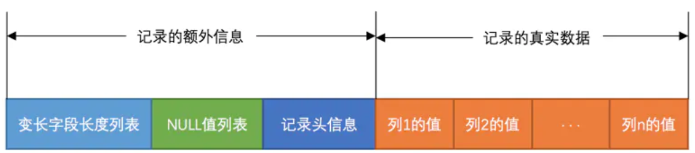

# Mysql

## SQL数据类型

## MySQL 数据类型

在 MySQL 中，有三种主要的类型：文本、数字和日期/时间类型。

**Text 类型：**

| 数据类型         | 描述                                                         |
| :--------------- | :----------------------------------------------------------- |
| CHAR(size)       | 保存固定长度的字符串，最多 255 个字符。                      |
| VARCHAR(size)    | 保存可变长度的字符串（可包含字母、数字以及特殊字符）。在括号中指定字符串的最大长度。最多 255 个字符。注释：如果值的长度大于 255，则被转换为 TEXT 类型。？？？ |
| TINYTEXT         | 存放最大长度为 255 个字符的字符串。                          |
| TEXT             | 存放最大长度为 65,535 个字符的字符串。                       |
| BLOB             | 用于 BLOBs (Binary Large OBjects)。存放最多 65,535 字节的数据。 |
| MEDIUMTEXT       | 存放最大长度为 16,777,215 个字符的字符串。                   |
| MEDIUMBLOB       | 用于 BLOBs (Binary Large OBjects)。存放最多 16,777,215 字节的数据。 |
| LONGTEXT         | 存放最大长度为 4,294,967,295 个字符的字符串。                |
| LONGBLOB         | 用于 BLOBs (Binary Large OBjects)。存放最多 4,294,967,295 字节的数据。 |
| ENUM(x,y,z,etc.) | 允许你输入可能值的列表。可以在 ENUM 列表中列出最大 65535 个值。如果列表中不存在插入的值，则插入空值。注释：这些值是按照你输入的顺序存储的。可以按照此格式输入可能的值：ENUM('X','Y','Z') |
| SET              | 与 ENUM 类似，SET 最多只能包含 64 个列表项，不过 SET 可存储一个以上的值。 |

**Number 类型：**

| 数据类型        | 描述                                                         |
| :-------------- | :----------------------------------------------------------- |
| TINYINT(size)   | -128 到 127 常规。0 到 255 无符号*。在括号中规定最大位数。   |
| SMALLINT(size)  | -32768 到 32767 常规。0 到 65535 无符号*。在括号中规定最大位数。 |
| MEDIUMINT(size) | -8388608 到 8388607 普通。0 to 16777215 无符号*。在括号中规定最大位数。 |
| INT(size)       | -2147483648 到 2147483647 常规。0 到 4294967295 无符号*。在括号中规定最大位数。 |
| BIGINT(size)    | -9223372036854775808 到 9223372036854775807 常规。0 到 18446744073709551615 无符号*。在括号中规定最大位数。 |
| FLOAT(size,d)   | 带有浮动小数点的小数字。在括号中规定最大位数。在 d 参数中规定小数点右侧的最大位数。 |
| DOUBLE(size,d)  | 带有浮动小数点的大数字。在括号中规定最大位数。在 d 参数中规定小数点右侧的最大位数。 |
| DECIMAL(size,d) | 作为字符串存储的 DOUBLE 类型，允许固定的小数点。             |

这些整数类型拥有额外的选项 UNSIGNED。通常，整数可以是负数或正数。如果添加 UNSIGNED 属性，那么范围将从 0 开始，而不是某个负数。

**Date 类型：**

| 数据类型    | 描述                                                         |
| :---------- | :----------------------------------------------------------- |
| DATE()      | 日期。格式：YYYY-MM-DD注释：支持的范围是从 '1000-01-01' 到 '9999-12-31' |
| DATETIME()  | *日期和时间的组合。格式：YYYY-MM-DD HH:MM:SS注释：支持的范围是从 '1000-01-01 00:00:00' 到 '9999-12-31 23:59:59' |
| TIMESTAMP() | *时间戳。TIMESTAMP 值使用 Unix 纪元('1970-01-01 00:00:00' UTC) 至今的描述来存储。格式：YYYY-MM-DD HH:MM:SS注释：支持的范围是从 '1970-01-01 00:00:01' UTC 到 '2038-01-09 03:14:07' UTC |
| TIME()      | 时间。格式：HH:MM:SS 注释：支持的范围是从 '-838:59:59' 到 '838:59:59' |
| YEAR()      | 2 位或 4 位格式的年。注释：4 位格式所允许的值：1901 到 2155。2 位格式所允许的值：70 到 69，表示从 1970 到 2069。 |

即便 DATETIME 和 TIMESTAMP 返回相同的格式，它们的工作方式很不同。在 INSERT 或 UPDATE 查询中，TIMESTAMP 自动把自身设置为当前的日期和时间。TIMESTAMP 也接受不同的格式，比如 YYYYMMDDHHMMSS、YYMMDDHHMMSS、YYYYMMDD 或 YYMMDD。

### 蠕虫复制

```sql
在已有的数据的基础之上，将原来的数据进行复制，插入到对应的表中
前提：表结构得一致
语法格式：
insert into 表名1 select *from 表名2;
```

### 删除记录

```sql
不带条件的删除数据：
delete from 表名;
根据条件的删除记录；
delete from 表名 where 字段名=值;

truncate删除表记录：
truncate table 表名; 
全删
```

delete和truncate的区别：

1. delete是将表中的数据一条一条的删除
2. truncate是将整个表摧毁，重新创建了一个新的表，表的结构和原来的一模一样
3. delete删除的数据能够找回，truncate删除的数据找不回来了

## 用户授权

用户

- 切换数据库

  ```
  use mysql
  ```

- 创建用户

  ```
  CREATE USER 'username'@'host' IDENTIFIED BY 'password';
  ```

  ```
  create user 'data_web'@'%' identified by 'OWIwMTY5Njg1NWI';
  ```

- 删除用户

  ```
  DROP USER 'username'@'host';
  ```

权限

- 查看用户权限

  ```
  show grants for jinp;
  ```

- 给用户赋予权限

  ```
  GRANT privileges ON databasename.tablename TO 'username'@'host';
  ```

  ```
  grant select,insert,update,delete on data_web.* to 'data_web'@'%';
  ```

- 查看数据库角色

  ```
  select user from mysql.userl;
  ```

- 想要使某个用户拥有分配权限的权限

  ```
  GRANT privileges ON databasename.tablename TO 'username'@'host' WITH GRANT OPTION;
  ```

- 刷新权限

  ```
  flush privileges;
  ```

  

## 事务

MySQL 事务主要用于处理操作量大，复杂度高的数据。比如说，在人员管理系统中，你删除一个人员，你既需要删除人员的基本资料，也要删除和该人员相关的信息，如信箱，文章等等，这样，这些数据库操作语句就构成一个事务！

MySQL中，事务是最小的工作单元，事务能保证一个业务的完整性

```sql
update user set money=money-100 where name='a';

update user set money=money+100 where name='b';
```

实际的程序中，如果只有一条语句执行成功了，而另外一条没有成功，就会出现数据前后不一致的情况。

MySQL 默认情况下开启了一个自动提交的模式 autocommit，一条语句被回车执行后该语句便生效了，便会保存在 MySQL 的文件中，无法撤消。

默认开启自动提交当我们去执行一个SQL语句的时候，效果会立即体现出来，且不能回滚。

**事务回滚** : 撤销SQL语句执行效果

要想实现回滚就需要设置MySQL自动提交为False，这也是开启事务的一种方式

```sql
set autocommit=0; -- 0:OFF  1:ON
```

当使用`commit;`手动提交数据之后，再进行回滚，就不管用了，体现了事务的持久性，事务一旦提交，就不能再回滚，也就是说这个事务在提交的时候已经结束了

**手动开启一个事务**,事务给我们提供了一个返回的机会:回滚

```sql
set autocommit=0;
begin;
start transaction;
```

关于 autocommit 与事务，它们其实是这样的关系：

1. MySQL 每一步操作都可看成一个原子操作。默认情况下，autocommit 是开启状态，所以每一条语句都是执行后自动提交，语句产生的效果会被记录保存下来（这时候回滚是无效的）
2. 我们手动关闭autocommit 后，语句不会自动提交，这时需要手动调用 COMMIT 来让效果被持久化
3. 在默认情况下，（autocommit 处于开启状态时）我们也可通过 BEGIN 开启一个事务，此时 autocommit 被隐式地关闭了，因此事务操作过程中也是需要显式调用 COMMIT 来让效果永久生效。
4. BEGIN 开启一个事务后，使用 COMMIT 或 ROLLBACK 来结束该事务。事务结束后 ，autocommit 回到原有的状态。所以，autocommit 这个开关相当于一个记录事务的标记，它被关闭时，你一直处于一个可回滚的状态。而 BEGIN 开启的是一次临时事务，一旦 COMMIT 或 ROLLBACK 本次事务便结束了。

**事物的四大特征：**

1. 原子性：事务是最小的单位，不可再分割
2. 一致性：事务要求，同一事务中的SQL语句，要么同时成功，要么同时失败
3. 隔离性：事务1与事务2之间具有隔离性
4. 持久性：事务一旦结束（commit | rollback），就不可以返回

## InnoDB

InnoDB是一个将表中数据存储到磁盘的存储引擎。InnoDB处理数据是发生在内存中的，需要把磁盘中的数据加载到内存中，InnoDB以页作为磁盘和内存之间交互的基本单位，InnoDB中页的默认大小为16KB。

测试：

```
SHOW VARIABLES LIKE "innodb_page_size"
-- 结果为16KB
innodb_page_size: 16384
```

注意：此变量在mysql运行时不可更改

我们平时是以记录为单位向表中插入数据的，这些记录的格式被称为行格式，共有四种：

- Dynamic
- Compact
- Redundant
- Compressed

测试：

```
SHOW VARIABLES LIKE "innodb_default_row_format"
--
innodb_default_row_format: dynamic
```


**varchar最多可以存几个字符呢？**

### Dynamic——innodb默认的行格式



#### 变长字段长度列表

一些变长的数据类型，比如`VARCHAR(M)`、各种`TEXT`类型，各种`BLOB`类型，变长数据类型的字段中存储多少字节的数据是不固定的，在存储真实数据的时候需要把**这些数据占用的字节数也存起来**

innodb分配了两个字节去记录表示varchar的字节数，所以记录的范围就是2^16-1=65535

InnoDB中，最多能存储字节数 = 最多能存储字符数 * 该编码中最大的字节数

对于该编码中最大的字节数，例如：

- `utf8mb4`字符集是`4`
- `utf8`字符集是`3`
- `gbk`字符集是`2`
- `ascii`字符集是`1`

所以，当使用`utf8mb4`的时候，会提示`varchar`类型最大16383个，即65535/4=16383.75

但是，如上述，即使提示16383，行里很多东西，包括变长字段，NULL值列表，记录头信息等，所以即使提示16383也绝不可能存到16383。

经测试：

建一个有一列的表，字符集采用`utf8mb4`，类型`varchar(16383)`，然后后向这个字符中添加值，字符总极限为48545字节，超出即会报错。

结果是远不到65535字节，主要是因为溢出列的原因，数据分散在不同的行中，所以，很长的数据，建议往`text`类型考虑。

- `InnoDB`在读记录的变长字段长度列表时先查看表结构，如果某个变长字段允许存储的最大字节数(最大字符数*编码最大字节数)不大于255时，只用1个字节来表示真实数据占用的字节。
- 如果允许存储的最大字节数大于255，则分为两种情况（这里存疑）
  - 如果实际存储字节 <= 127，`varchar`占用的真实字节数仅分配1个字节就能表示
  - 如果实际存储字节 > 127，`varchar`占用的真实字节数需要分配2个字节才能表示
- 变长字段长度列表只会存储非null值的长度

#### NULL值列表

如果表中的某些列可能存储`NULL`值，把这些`NULL`值都放到**记录的真实数据**中存储会很占地方，所以`dynamic`行格式把这些值为`NULL`的列统一管理起来，存储到`NULL`值列表中。

过程如下：

- 统计表中允许存储`NULL`的列有哪些
- 将每个允许存储`NULL`的列对应一个二进制位，二进制位按照列的顺序**逆序排列**
- `NULL`值列表必须用整数个字节的位表示，如果使用的二进制位个数不是整数个字节，则在字节的**高位补0**

例如：

```
建一个a,b,c,d四列的表，其中，d不允许为NULL
那么，一条记录的NULL值列表格式为：0000 0cba

当存入1,null,null,1时
此记录的NULL值列表为：0000 0110
```

#### 溢出列

对于占用存储空间非常多的列，在记录真实数据时，**该列只会用`20`字节空间**，而这`20`字节的空间不存储数据，因为数据都分散存储在其他几行中了。这`20`字节的空间存储的是分散行的地址和占用的字节数。分散行记录是单链表连接的结构。


## JDBC

JDBC（Java DataBase Connectivity,java数据库连接）是一种用于执行SQL语句的Java API。JDBC是Java访问数据库的标准规范，可以为不同的关系型数据库提供统一访问，它由一组用Java语言编写的接口和类组成。

## JDBC代码演示

* DriverManager:用于注册驱动

  里面有方法`DriverManager.registerDriver(new Driver());`

  但是在Driver源码中

  里面已经执行过`DriverManager.registerDriver(new Driver())`，导致驱动被注册了两次，而且强烈依靠JAR包，所以上述语句可以替换成`Class.forName("com.mysql.jdbc.Driver");`

* Connection: 表示与数据库创建的连接

* Statement: 操作数据库sql语句的对象

* ResultSet: 结果集或一张虚拟表

  ResultSet实际上就是一张二维的表格，我们可以调用其`boolean next()`方法指向某行记录，当第一次调用`next()`方法时，便指向第一行记录的位置，这时就可以使用ResultSet提供的`getXXX(int col)`方法来获取指定列的数据：(与数组索引从0开始不同，这里索引从1开始)

  ```
  rs.next();//指向第一行
  rs.getInt(1);//获取第一行第一列的数据
  ```

  

开发步骤：

1. 注册驱动  

   DriverManager->`void registerDeiver(Driver)`

2. 获得连接  

   DriverManager-> `Connection getConnection(url,user,password)`

3. 获得执行sql语句的对象  

   Connection->`Statement creatSratement()`

4. 执行sql语句，并返回结果 

   Statement->`excuteUpdate("sql")`/`ResultSet excuteQuery("sql")`

5. 处理结果 

   `resultSet.next()`/`resultSet.getInt()`/`resultSet.getString()`

6. 释放资源

   与IO流一样，使用后的东西都需要关闭！关闭的顺序是先得到的后关闭，后得到的先关闭。

```java
package com.itheima;

import java.sql.Connection;
import java.sql.DriverManager;
import java.sql.ResultSet;
import java.sql.Statement;

public class demo01 {
    public static void main(String[] args) throws Exception {
        //1. 注册驱动
        Class.forName("com.mysql.jdbc.Driver");
        //2. 获得连接
        String url = "jdbc:mysql://localhost:3306/demo2";
        Connection connection = DriverManager.getConnection(url, "root", "root");
        //3. 获取执行sql语句的对象
        Statement statement = connection.createStatement();
        //4.1 执行sql插入语句
        //statement.executeUpdate("INSERT INTO stu(sid,sname,sage,tea_id) values (4,'王华伟',24,3)");
        //4.2 执行sql修改语句
        statement.executeUpdate("update stu set sname='旭强' where sname='王旭强'");
        //4.3 执行sql查询语句
        ResultSet resultSet = statement.executeQuery("SELECT * FROM STU;");
        while (resultSet.next()){
            int sid = resultSet.getInt("sid");
            String sname = resultSet.getString("sname");
            System.out.println("sid: "+sid+";sname "+sname);
        }
        //5. 关闭资源
        resultSet.close();
        statement.close();
        resultSet.close();
    }
}
```

## SQL注入问题

```sql
String sql = "select * from users where username = '"+username+"' and password = '"+password+"'";
```

此时，当用户输入正确的账号与密码后，查询到了信息则让用户登录。但是当用户输入的账号为XXX 密码为：`XXX’  OR ‘a’=’a`时，则真正执行的代码变为：

```sql
SELECT * FROM 用户表 WHERE NAME = ‘XXX’ AND PASSWORD =’ XXX’  OR ’a’=’a’;
```

此时，上述查询语句时永远可以查询出结果的。那么用户就直接登录成功了，显然我们不希望看到这样的结果，这便是SQL注入问题。
为此，我们使用PreparedStatement来解决对应的问题。

## 预处理对象

**preparedStatement**：预编译对象，**是Statement对象的子类**

PreparedStatement预处理对象，处理的每条sql语句中所有的实际参数，都必须使用占位符?替换

```sql
String sql = "select * from user where username = ? and password = ?";
```

分为以下三步：

1. PreparedStatement预处理对象代码：

   ```
   PreparedStatement psmt = conn.prepareStatement(sql)
   ```

2. 设置实际参数

   ```
   void setXxx(int index, Xxx xx) 将指定参数设置指定类型的值
   	参数1：index 实际参数序列号，从1开始。
   	参数2：xxx 实际参数值，Xxx表示具体的类型。
   例如：
   setString(2, "1234") 把SQL语句中第2个位置的占位符?替换成实际参数 "1234"
   ```

3. 执行SQL语句

   ```
   int executeUpdate(); --执行insert update delete语句.
   ResultSet executeQuery(); --执行select语句.
   boolean execute(); --执行select返回true 执行其他的语句返回false.
   ```

演示代码：

```java
public class demo04 {
    public static void main(String[] args) throws SQLException {
        System.out.println("请输入要查询的用户名：");
        Scanner scanner = new Scanner(System.in);
        String userName = scanner.next();
        Connection connection = JDBCUtils.getConnection();
      //获取预对象
        PreparedStatement preparedStatement = connection.prepareStatement("SELECT *from stu where sname = ?;");
        preparedStatement.setObject(1,userName);
      //执行sql语句
        ResultSet resultSet = preparedStatement.executeQuery();
        if(resultSet.next()){
            System.out.println("查找成功");
        }else{
            System.out.println("查找失败");
        }
        JDBCUtils.close(resultSet,preparedStatement,connection);
    }
}
```

读取properties文件方式编写工具类

记住properties文件的格式和properties文件的普通读取方法和快速读取方式

```properties
url = jdbc:mysql://localhost:3306/demo2
name = root
password = root
```

```java
package com.itheima.utils;

import java.sql.*;
import java.util.ResourceBundle;

public class JDBCUtils2 {
        private static String url;
        private static String name;
        private static String password;
        static{
            try {
                Class.forName("com.mysql.jdbc.Driver");
            } catch (ClassNotFoundException e) {
                e.printStackTrace();
            }
            ResourceBundle conf = ResourceBundle.getBundle("conf");

            url = conf.getString("url");
            name = conf.getString("name");
            password = conf.getString("password");

        }

        public static Connection getConnection() throws SQLException {
            Connection connection = DriverManager.getConnection(url, name, password);
            return connection;
        }

        //关闭资源
        public  static void close(ResultSet resultSet, Statement statement,Connection connection){
            if(resultSet!=null){
                try {
                    resultSet.close();
                } catch (SQLException e) {
                    e.printStackTrace();
                }
            }
            if(statement!=null){
                try {
                    statement.close();
                } catch (SQLException e) {
                    e.printStackTrace();
                }
            }
            if (connection!=null){
                try {
                    connection.close();
                } catch (SQLException e) {
                    e.printStackTrace();
                }
            }
        }
}
```

## 连接池

Java为数据库连接池提供了公共的接口：**javax.sql.DataSource**，各个厂商需要让自己的连接池实现这个接口。这样应用程序可以方便的切换不同厂商的连接池

常见的连接池：C3P0、DRUID

### C3P0

C3P0开源免费的连接池！目前使用它的开源项目有：Spring、Hibernate等。使用C3P0连接池需要导入jar包，c3p0使用时还需要添加配置文件“c3p0-config.xml” 

使用步骤：

1. 添加jar包

   两个`c3p0-0.9.5.2.jar`和`mchange-commons-java-0.2.12.jar`(数据连接池的辅助包)

2. 编写配置文件c3p0-config.xml，放在src中（文件名不能写错）

   ```xml
   <c3p0-config>
       <!-- 使用默认的配置读取连接池对象 -->
       <default-config>
           <!--  连接参数 -->
           <property name="driverClass">com.mysql.jdbc.Driver</property>
           <property name="jdbcUrl">jdbc:mysql://localhost:3306/day06</property>
           <property name="user">root</property>
           <property name="password">root</property>
   
           <!-- 连接池参数 -->
           <property name="initialPoolSize">5</property>
           <property name="maxPoolSize">10</property>
           <property name="checkoutTimeout">2000</property>
           <property name="maxIdleTime">1000</property>
   
           <!--记得添加下面这些信息，不然就会-->
           <!-- 当连接池耗尽时候，一次获得连接数-->
           <property name="acquireIncrement" value="5" />
           <property name="maxStatements" value="0" />
           <!-- 当连接池连接耗尽时，客户端getConnection(),所等待的时间-->
           <property name="checkoutTimeout" value="20000"/>
           <property name="idleConnectionTestPeriod" value="120" />
           <!-- 当连接失效时，获得连接的次数，0为无限次（重连）-->
           <property name="acquireRetryAttempts" value="30" />
       </default-config>
   </c3p0-config>
   ```

3. 编写工具类

```java
package com.itheima.c3p0;

import com.mchange.v2.c3p0.ComboPooledDataSource;

import java.sql.Connection;
import java.sql.ResultSet;
import java.sql.SQLException;
import java.sql.Statement;

public class C3P0Utils {
    //创建数据源对象
    private static ComboPooledDataSource dataSource;

    static{
        dataSource = new ComboPooledDataSource();
    }

    public static ComboPooledDataSource getDataSource(){
        return dataSource;
    }

    public static Connection getConnection(){
        Connection connection = null;
        try {
            connection = dataSource.getConnection();
        } catch (SQLException e) {
            e.printStackTrace();
        }
        return connection;
    }

    public static void close(Connection connection, Statement statement, ResultSet resultSet) {
        if (resultSet != null) {
            try {
                resultSet.close();
            } catch (SQLException e) {
                e.printStackTrace();
            }
        }

        if (statement != null) {
            try {
                statement.close();
            } catch (SQLException e) {
                e.printStackTrace();
            }
        }

        if (connection != null) {
            try {
                connection.close();
            } catch (SQLException e) {
                e.printStackTrace();
            }
        }
    }
}
```

### Druid

Druid是阿里巴巴开发的号称为监控而生的数据库连接池，Druid是国内目前最好的数据库连接池。在功能、性能、扩展性方面，都超过其他数据库连接池。Druid已经在阿里巴巴部署了超过600个应用，经过一年多生产环境大规模部署的严苛考验。如：一年一度的双十一活动，每年春运的抢火车票。

Druid的下载地址：<https://github.com/alibaba/druid>

DRUID连接池使用的jar包：`druid-1.1.16.jar`

步骤:

1. 导入DRUID jar 包
2. 拷贝配置文件到src目录
3. 根据配置文件 创建连接池对象
4. 从连接池对象获得连接

```java
public class DruidUtils {
    private static DataSource dataSource;
    static {
        //加载properties文件
        //Druid需要传入properties参数，所以不能使用ResourceBundle
        //ResourceBundle conf = ResourceBundle.getBundle("druid");
        //需要使用传统的方式
        /*Properties properties = new Properties();
        try {
            properties.load(new FileInputStream(new File("connectionPool/src/druid.properties")));
        } catch (IOException e) {
            e.printStackTrace();
        }
        System.out.println(properties);*/

        InputStream inputStream = DruidUtils.class.getClassLoader().getResourceAsStream("druid.properties");
        Properties properties = new Properties();
        try {
            properties.load(inputStream);
        } catch (IOException e) {
            e.printStackTrace();
        }
        System.out.println(properties);
        //创建Druid连接池对象
        try {
            dataSource = DruidDataSourceFactory.createDataSource(properties);
        } catch (Exception e) {
            e.printStackTrace();
        }
    }

    public static DataSource getDataSource(){
        return dataSource;
    }

    public static Connection getConnetion(){
        Connection connection = null;
        try {
            connection = dataSource.getConnection();
        } catch (SQLException e) {
            e.printStackTrace();
        }
        return connection;
    }
}
```

关于`getResourceAsStream()`

```java
//默认则是从ClassPath根下获取，path不能以’/'开头，最终是由ClassLoader获取资源。 
InputStream inputStream = DruidUtils.class.getClassLoader().getResourceAsStream("druid.properties");
```

```java
//文件名前加了“/”，则表示从类路径下也就是从classes文件夹下查找资源
InputStream inputStream = DruidUtils.class.getResourceAsStream("/druid.properties");
```

## DBUtils

如果只使用JDBC进行开发，我们会发现冗余代码过多，为了简化JDBC开发，本案例我们讲采用apache commons组件一个成员：DBUtils

DBUtils就是JDBC的简化开发工具包。需要项目导入commons-dbutils-1.6.jar才能够正常使用DBUtils工具

DBUtils是java编程中的数据库操作实用工具，小巧简单实用。DBUtils封装了对JDBC的操作，简化了JDBC操作，可以少写代码。

Dbutils三个核心功能介绍

* QueryRunner中提供对sql语句操作的API.

* ResultSetHandler接口，用于定义select操作后，怎样封装结果集.

* DbUtils类，它就是一个工具类,定义了关闭资源与事务处理的方法

ResultSetHandler 结果集

DBUtils用的最多的就是其对于结果集的处理，仅仅得到一个ResultSet没什么用，而结果集的处理正是依赖于ResultSetHandler接口及其实现类

**ResultSetHandler接口就是将ResultSet结果集映射为Bean、List、Map等Java中的对象或者集合**

```java
/**
 * 此接口的实现将 ResultSet 转换为其他对象
 * T： 目标类型（类型参数），也就是 ResultSet 转换为的对象的类型
 */
public interface ResultSetHandler<T> {

    /**
     * 方法说明：将 ResultSet 转换为一个对象
     *
     * rs： 要转换的 ResultSet
     * T： 返回用 ResultSet 数据初始化的对象
     * 如果 ResultSet 包含0行，那么实现返回 null 也是合法的
     * 数据库访问出错将会抛出 SQLException 异常
     */
    T handle(ResultSet rs) throws SQLException;

}
```

```
处理单行数据的类：ScalarHandler、ArrayHandler、MapHandler、BeanHandler

处理多行数据的类：BeanListHandler、AbstractListHandler（ArrayListHandler、MapListHandler、ColumnListHandler）、AbstractKeyedHandler（KeyedHandler BeanMapHandler）
```

**BeanHandler**

```
将结果集中的第一行数据封装到一个对应的JavaBean实例中
```

```java
public class Demo01 {
    public static void main(String[] args) throws SQLException {
        QueryRunner queryRunner = new QueryRunner();
        Connection connetion = DruidUtils.getConnetion();
        Stu query = queryRunner.query(connetion, "select * from stu where sid = ?",new BeanHandler<>(Stu.class),1);
        System.out.println(query);
    }
}
```

**BeanListHandler**

```
将结果集中的每一行数据都封装到一个对应的JavaBean实例中，存放到List里
```

```java
public class Demo2_BeanlistHeandler {
    public static void main(String[] args) {
        QueryRunner queryRunner = new QueryRunner(DruidUtils.getDataSource());
        List<Stu> list = null;
        try {
            list = queryRunner.query("select *from stu", new BeanListHandler<>(Stu.class));
            list.forEach(System.out::println);
        } catch (SQLException e) {
            e.printStackTrace();
        }finally {
        }
    }
}
```

## 事务(transaction)

事务特性：ACID

1. 原子性（Atomicity）：事务开始后所有操作，要么全部做完，要么全部不做，不可能停滞在中间环节。事务执行过程中出错，会回滚到事务开始前的状态，所有的操作就像没有发生一样。也就是说事务是一个不可分割的整体，就像化学中学过的原子，是物质构成的基本单位。
2. 一致性（Consistency）：事务开始前和结束后，数据库的完整性约束没有被破坏 。比如A向B转账，不可能A扣了钱，B却没收到。
3. 隔离性（Isolation）：同一时间，a，不同的事务之间彼此没有任何干扰。比如A正在从一张银行卡中取钱，在A取钱的过程结束前，B不能向这张卡转账。
4. 持久性（Durability）：事务完成后，事务对数据库的所有更新将被保存到数据库，不能回滚。

小结：原子性是事务隔离的基础，隔离性和持久性是手段，最终目的是为了保持数据的一致性。

**sql手动提交事务**

| sql语句                  | 描述     |
| ------------------------ | -------- |
| start transaction\|begin | 开启事务 |
| commit                   | 提交事务 |
| rollback                 | 回滚事务 |

```sql
start transaction;
update account set money=money-1000 where name='jack';
update account set money=money+1000 where name='rose';
commit;
#或者
rollback;
```

**JDBC事务操作**

| Connection 对象的方法名   | 描述     |
| ------------------------- | -------- |
| conn.setAutoCommit(false) | 开启事务 |
| conn.commit()             | 提交事务 |
| conn.rollback()           | 回滚事务 |

**事务模板代码**

```java
//事务模板代码
public void demo01() throws SQLException{
	// 获得连接
	Connection conn = null;
	
	try {
		//#1 开始事务
		conn.setAutoCommit(false);
		
		//.... 加钱 ,减钱
		
		//#2 提交事务
		conn.commit();
	} catch (Exception e) {
		//#3 回滚事务
		conn.rollback();
	} finally{
		// 释放资源
		conn.close();
	}
}
```

**DBUtils事务操作**

| Connection对象的方法名                                       | 描述                                   |
| ------------------------------------------------------------ | -------------------------------------- |
| conn.setAutoCommit(false)                                    | 开启事务                               |
| new QueryRunner()                                            | 创建核心类，不设置数据源(手动管理连接) |
| query(conn , sql , handler, params )  或 update(conn, sql , params) | 手动传递连接， 执行SQL语句CRUD         |
| DbUtils.commitAndCloseQuietly(conn)                          | 提交并关闭连接，不抛异常               |
| DbUtils.rollbackAndCloseQuietly(conn)                        | 回滚并关闭连接，不抛异常               |

```java
//事务模板代码
public void demo02() throws SQLException{
	// 获得连接
	Connection conn = null;
	
	try {
		//#1 开始事务
		conn.setAutoCommit(false);
		
		//.... 加钱 ,减钱
		
		//#2 提交事务
		DbUtils.ommitAndCloseQuietly(conn); 
	} catch (Exception e) {
		//#3 回滚事务
		DbUtils.rollbackAndCloseQuietly(conn);
        e.printStackTrace();
	} 
}
```

## JDBC事务分层传递

工具类C3P0Utils

```java
package com.itheima.utils;

import com.mchange.v2.c3p0.ComboPooledDataSource;

import javax.sql.DataSource;
import java.sql.Connection;
import java.sql.SQLException;

public class C3P0Utils {
    public static DataSource dataSource = new ComboPooledDataSource();

    //获取连接
    public static Connection getConnection() throws SQLException {
        return dataSource.getConnection();
    }
}
```

c3p0-config.xml（千万不能写错）（记得创建在src中）

```java
<?xml version="1.0" encoding="UTF-8"?>

<c3p0-config>
    <!-- 使用默认的配置读取连接池对象 -->
    <default-config>
        <!--  连接参数 -->
        <property name="driverClass">com.mysql.jdbc.Driver</property>
        <property name="jdbcUrl">jdbc:mysql://localhost:3306/demo2</property>
        <property name="user">root</property>
        <property name="password">root</property>

        <!-- 连接池参数 -->
        <property name="initialPoolSize">5</property>
        <property name="maxPoolSize">10</property>
        <property name="checkoutTimeout">2000</property>
        <property name="maxIdleTime">1000</property>
    </default-config>
</c3p0-config>
```

步骤1：编写入口程序

```java
package com.itheima.domain;

import com.itheima.service.AccountService;

import java.sql.SQLException;

public class App {
    public static void main(String[] args) {
        try {
            String outUser = "JACK";
            String inUser = "ROSE";
            Integer money = 100;
            AccountService accountService = new AccountService();
            accountService.transter(outUser,inUser,money);
            System.out.println("提示转账成功");
        } catch (SQLException e) {
            e.printStackTrace();
            System.out.println("转账失败");
        }
    }
}
```

service层

```java
package com.itheima.service;

import com.itheima.dao.AccountDao;
import com.itheima.utils.C3P0Utils;
import org.apache.commons.dbutils.DbUtils;

import java.sql.Connection;
import java.sql.SQLException;

public class AccountService {

    public void transter(String from, String to, Integer money) throws SQLException {
        AccountDao accountDao = new AccountDao();

        Connection connection = null;

        try {
            connection = C3P0Utils.getConnection();
            connection.setAutoCommit(false);
            accountDao.outMoney(connection,from,money);
            accountDao.inMoney(connection,to,money);
            DbUtils.commitAndCloseQuietly(connection);
        } catch (SQLException e) {
            DbUtils.rollbackAndCloseQuietly(connection);
            e.printStackTrace();
        }


    }
}
```

dao层

```java
package com.itheima.dao;

import org.apache.commons.dbutils.QueryRunner;

import java.sql.Connection;
import java.sql.SQLException;

public class AccountDao {

    public void outMoney(Connection connection, String from, Integer money) {
        QueryRunner queryRunner = new QueryRunner();
        try {
            String sql = "UPDATE ACCOUNT SET MONEY = MONEY - ? WHERE NAME = ?";
            queryRunner.update(connection,sql,money,from);
        } catch (SQLException e) {
            e.printStackTrace();
        }
    }

    public void inMoney(Connection connection, String to, Integer money) {
        QueryRunner queryRunner = new QueryRunner();
        try {
            String sql = "UPDATE ACCOUNT SET MONEY = MONEY + ? WHERE NAME = ?";
            queryRunner.update(connection,sql,money,to);
        } catch (SQLException e) {
            e.printStackTrace();
        }
    }
}
```

## 数据库的四种隔离级别

**Read uncommitted**（脏读）

读未提交，顾名思义，就是一个事务可以读取另一个未提交事务的数据。

事例：老板要给程序员发工资，程序员的工资是3.6万/月。但是发工资时老板不小心按错了数字，按成3.9万/月，该钱已经打到程序员的户口，但是事务还没有提交，就在这时，程序员去查看自己这个月的工资，发现比往常多了3千元，以为涨工资了非常高兴。但是老板及时发现了不对，马上回滚差点就提交了的事务，将数字改成3.6万再提交。

分析：实际程序员这个月的工资还是3.6万，但是程序员看到的是3.9万。他看到的是老板还没提交事务时的数据。这就是脏读。

那怎么解决脏读呢？Read committed！读提交，能解决脏读问题。

**Read committed**

读提交，顾名思义，就是一个事务要等另一个事务提交后才能读取数据。

事例：程序员拿着信用卡去享受生活（卡里当然是只有3.6万），当他埋单时（程序员事务开启），收费系统事先检测到他的卡里有3.6万，就在这个时候！！程序员的妻子要把钱全部转出充当家用，并提交。当收费系统准备扣款时，再检测卡里的金额，发现已经没钱了（第二次检测金额当然要等待妻子转出金额事务提交完）。程序员就会很郁闷，明明卡里是有钱的…

分析：这就是读提交，若有事务对数据进行更新（UPDATE）操作时，读操作事务要等待这个更新操作事务提交后才能读取数据，可以解决脏读问题。但在这个事例中，出现了一个事务范围内两个相同的查询却返回了不同数据，这就是不可重复读。

那怎么解决可能的不可重复读问题？Repeatable read ！

**Repeatable read**

重复读，就是在开始读取数据（事务开启）时，不再允许修改操作

事例：程序员拿着信用卡去享受生活（卡里当然是只有3.6万），当他埋单时（事务开启，不允许其他事务的UPDATE修改操作），收费系统事先检测到他的卡里有3.6万。这个时候他的妻子不能转出金额了。接下来收费系统就可以扣款了。

分析：重复读可以解决不可重复读问题。写到这里，应该明白的一点就是，不可重复读对应的是修改，即UPDATE操作。但是可能还会有幻读问题。因为幻读问题对应的是插入INSERT操作，而不是UPDATE操作。

按照可重复读的定义，一个事务启动的时候，能够看到所有已经提交的事务结果。但是之后，这个事务执行期间，其他事务的更新对它不可见。

而且在A

**什么时候会出现幻读？**

事例：程序员某一天去消费，花了2千元，然后他的妻子去查看他今天的消费记录（全表扫描FTS，妻子事务开启），看到确实是花了2千元，就在这个时候，程序员花了1万买了一部电脑，即新增INSERT了一条消费记录，并提交。当妻子打印程序员的消费记录清单时（妻子事务提交），发现花了1.2万元，似乎出现了幻觉，这就是幻读。

在可重复读中，该sql第一次读取到数据后，就将这些数据加锁（悲观锁），其它事务无法修改这些数据，就可以实现可重复读了。但这种方法却无法锁住insert的数据，所以当事务A先前读取了数据，或者修改了全部数据，事务B还是可以insert数据提交，这时事务A就会发现莫名其妙多了一条之前没有的数据，这就是幻读，不能通过行锁来避免。

那怎么解决幻读问题？Serializable！

**Serializable 序列化**

Serializable 是最高的事务隔离级别，在该级别下，事务串行化顺序执行，可以避免脏读、不可重复读与幻读。但是这种事务隔离级别效率低下，比较耗数据库性能，一般不使用。

值得一提的是：大多数数据库默认的事务隔离级别是Read committed，比如Sql Server , Oracle。Mysql的默认隔离级别是Repeatable read

**查询数据库的隔离级别**

```
show variables like '%isolation%';
或
select @@tx_isolation;
```

**设置数据库的隔离级别**

- `set session transactionisolation level` 级别字符串
- 级别字符串：`read uncommitted`、`read committed`、`repeatable read`、`serializable`
- 例如：`set session transaction isolation level read uncommitted`

```
大话事务隔离级别
我，老婆(两个客户端)同时操作一个银行卡(家庭数据库中的一条记录，记录了我家银行卡号和余额)，如果该数据库是Read uncommitted级别，现在我想买电脑，我比较喜欢Thinkpad，看了一款，准备付款，老板扣了我银行卡12000(开启事务，update)，很巧，在家的老婆这时候，突然查询了我的银行卡余额(select)，发现我的余额少了12000，气急败坏等我回家(脏读)，然而我这时候又后悔了，我又想买Mac了，厚着脸皮找老板把钱退了(rollback)，然后回到家，突然被噼里啪啦一顿骂，没等我解释这就是脏读，一个键盘已经扔在我在面前...我决定把数据库的事务级别调整到Read committed，这样的话只有我确定走出店门(commit)，老婆才会查询到扣款记录，不至于冤枉我。第二天我还要去买Mac，我看好了准备付款(开启事务)，一看价格14000，我查了下(select)，余额还有15000，刚刚够，只是有点肝疼，我说付款前再让我看一眼，很巧，这时候老婆拿银行卡买了一个2000的包(update)，买完了(commit)，我也下定决心要付款了，结果店员查了下(select)，说我余额不够，只有14000。我：？？?我很郁闷，刚刚卡里明明有钱的？我明白了，这里又出现了不可重复读！这会导致我一次事务内查询出的余额不一样，我求老婆半天，她才决定向我的银行卡里充了1000元，我决定把事务级别调整到Repeatable read，第三天我又去买苹果电脑，我二话不说就是准备付款(开启事务)，在我一旦开始付款(update)，直到走出店门(commit)，老婆这个期间(开启事务)所有查询都是我付款前的余额，并且不能够再花一分钱，对于老婆来说，这就是可以重复读了，不会出现她一次事务中出现读取同一条数据不一致的重复读问题，老婆必须在我走出店门之后(我commit)，她再次开启事务，执行查询，才能看到这次的消费变化，终于，我买到了电脑。最后我想看下总家当还有多少，我开启事务，粗略看了一下，一共就有一张银行卡，余额0，谁知，在家的老婆这时候终于决定不再刷我的银行卡，她决定自己办一张银行卡(insert)，我刚查完余额，怀疑人生中，这时候，一股神秘力量让我的手指又按下了查询键，结果，居然出来了两张卡(count)，我怀疑自己是不是出现幻觉了(幻读）？？老婆居然自己办了银行卡？？这就是Repeatable read无法解决幻读问题，它能锁定一行数据的修改，但是其他人仍然可以随时执行insert操作！你在一个事务内仍然读出来的两次可能会不一样，要想避免出现这个，只能采取最高隔离等级，Serializable！读用读锁，写用写锁，这样可以避免所有问题，但是哈哈哈，我为啥要这样做呢。
```


注意：

事务的隔离级别解决的只是读问题，但是不能解决并发修改问题

并发的修改必须使用多线程去解决

可重复读并不是别人不能修改，只是锁定快照，别人还是可以进行修改的
